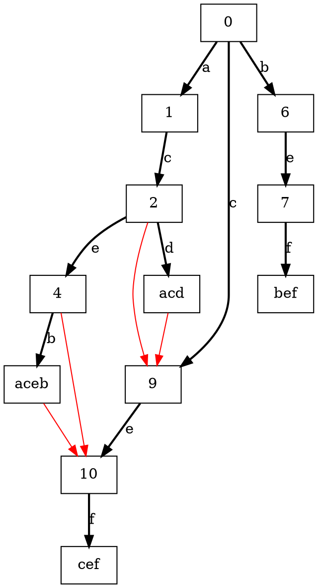

某个课程的作业，促使我来看看这玩意。

整个程序的算法思想是看别人的ACM的blog看懂的，感觉确实和KMP很像。但是代码呢就比较工程化一点。顺便回忆了一把ACM的感觉。

基本原理呢基于字典树，并增加了失败节点。

实现原理类似KMP算法，但是一次可以匹配多个字符串。在匹配失败时转向失败节点，并从失败节点开始继续向下匹配。

比如：我们有字典集合

acd、aceb、bef、cef

节点关系如图所示，红色为失败指针



当查找acefcab时，首先会按aceb的支路一直匹配到e，在e的位置发现找不到f，然后跳转到e的失败节点（即cef支路的e节点），查到f。并以此完成了第一次匹配。

接下来从根节点重新匹配并分别进入第一层的c节点，回到根节点，进入a节点，回到根节点，和进入b节点。

并在最终只匹配成功了cef

代码如下：

```cpp
/**
 * AC 自动机， 数节点类和自动机功能类
 * 文档格式：doxygen
 * @author owentou, owt5008137@live.com
 * @date 2012.08.28
 */

#ifndef __AC_AUTOMATION_HPP_
#define __AC_AUTOMATION_HPP_

#if defined(_MSC_VER) && (_MSC_VER >= 1020)
# pragma once
#endif

#include <map>
#include <string>
#include <cstddef>
#include <list>
#include <vector>
#include <assert.h>
#include "smart_ptr.h"


template<typename CH = char>
class ACTrie: public std::enable_shared_from_this< ACTrie<CH> >
{
public:
    typedef std::shared_ptr< ACTrie<CH> > ptr_type;

private:
    /**
     * 关联的匹配字符串<br />
     * size不为0表示该节点有关联的字符串并且是最后一个节点
     */
    std::string m_strMatchedString;

    /**
     * 失败转向节点
     */
    ptr_type m_pFailed;

    /**
     * 下一个查找项
     */
    std::map<CH, ptr_type> m_stNext;

    /**
     * 初始化自身和子节点的失败指针
     * @param pPreFailed 初始搜索的指针（一般为父节点的失败指针）
     * @param cChar 搜索的字符
     */
    void _init_failed(ptr_type pPreFailed, const CH& cChar)
    {
        typedef typename std::map<CH, ptr_type>::iterator iter_type;

        // 设置自身的失败指针
        iter_type iter;
        for(;; pPreFailed = pPreFailed->m_pFailed)
        {
            iter = pPreFailed->m_stNext.find(cChar);
            if (iter != pPreFailed->m_stNext.end())
            {
                m_pFailed = iter->second;
                break;
            }

            if (NULL == pPreFailed->m_pFailed.get())
            {
                m_pFailed = pPreFailed;
                break;
            }
        }
    }

    /**
     * 把子节点填充到链表中（用于BFS）<br />
     * 调用此函数时，当前节点的失败指针必须已经设置好
     * @param stList 填充目标
     */
    void _fill_children(std::list< std::pair<CH, ptr_type> >& stList)
    {
        typedef typename std::map<CH, ptr_type>::iterator iter_type;
        for(iter_type iter = m_stNext.begin();
            iter != m_stNext.end();
            ++ iter)
        {
            iter->second->m_pFailed = m_pFailed;    // 临时用于记录父节点的失败指针
            stList.push_back(std::make_pair(iter->first, iter->second));
        }
    }

    /**
     * 获取当前指针
     * @return 当前对象的智能指针
     */
    ptr_type _get_ptr()
    {
        return this->shared_from_this();
    }
public:
    ACTrie(ptr_type pRoot): m_pFailed(pRoot){}

    /**
     * 设置失败指针
     * @param pFailed 失败指针
     */
    void SetFailed(ptr_type pFailed)
    {
        m_pFailed = pFailed;
    }

    /**
     * 初始化根节点中，子节点的失败指针<br />
     * 当前节点会被视为根节点
     */
    void InitFailed()
    {
        m_pFailed = ptr_type(NULL);
        std::list< std::pair<CH, ptr_type> > stList;

        typedef typename std::map<CH, ptr_type>::iterator iter_type;

        // 第一层节点
        for(iter_type iter = m_stNext.begin();
            iter != m_stNext.end();
            ++ iter)
        {
            iter->second->m_pFailed = _get_ptr();
            iter->second->_fill_children(stList);
        }

        // 后续节点 BFS 建树
        while (stList.size() > 0)
        {
            std::pair<CH, ptr_type> stNode = stList.front();
            stList.pop_front();
            stNode.second->_init_failed(stNode.second->m_pFailed, stNode.first);
            stNode.second->_fill_children(stList);
        }
    }

    /**
     * 清空后续分支
     */
    void Reset()
    {
        m_stNext.clear();
    }

    /**
     * 当前节点是否是一个关键字的最后一个节点
     * @return 如果是返回true
     */
    bool IsLastNode() const
    {
        return m_strMatchedString.size() > 0;
    }

    /**
     * 构建关键字的字典树节点
     * @param pStr          当前字符指针
     * @param iLeftBytes    关键字剩余字节数
     * @param strOrigin     关键字原始内容
     */
    void InsertChildren(const CH* pStr, int iLeftBytes, const std::string& strOrigin)
    {
        // 最后一个节点
        if (0 >= iLeftBytes)
        {
            m_strMatchedString.assign(strOrigin.data(), strOrigin.size());
            return;
        }

        iLeftBytes -= sizeof(CH);

        typedef typename std::map<CH, ptr_type>::iterator iter_type;
        iter_type iter = m_stNext.find(*pStr);
        if (iter != m_stNext.end())
        {
            iter->second->InsertChildren(pStr + 1, iLeftBytes, strOrigin);
            return;
        }

        std::pair<iter_type, bool> iter_new = m_stNext.insert(std::make_pair(*pStr, ptr_type(new ACTrie<CH>(m_pFailed))));
        assert(iter_new.second);

        iter_new.first->second->InsertChildren(pStr + 1, iLeftBytes, strOrigin);
    }

    /**
     * 匹配目标字符
     * @param pChar 目标字符指针
     * @param iLeftBytes 剩余字节数
     * @return 第一项为匹配完成后剩余字节数，第二项为匹配的关键字<br />
     *         如果匹配失败，第一项为0或负数，第二项为空串
     */
    std::pair<int, std::string> Match(const CH* pChar, int iLeftBytes) const
    {
        using namespace std;
        // 成功匹配
        if (IsLastNode())
        {
            return std::make_pair(iLeftBytes, m_strMatchedString);
        }

        // 已到目标串目末尾，无匹配
        if (iLeftBytes <= 0)
        {
            return std::make_pair(iLeftBytes, std::string(""));
        }

        // 匹配下一项
        typedef typename std::map<CH, ptr_type>::const_iterator iter_type;
        iter_type iter = m_stNext.find(*pChar);
        if (iter != m_stNext.end())
        {
            return iter->second->Match(pChar + 1, iLeftBytes - sizeof(CH));
        }
        // 如果是root节点，往后匹配
        if (NULL == m_pFailed->m_pFailed.get())
        {
            return Match(pChar + 1, iLeftBytes - sizeof(CH));
        }
        // 否则, failed节点进行匹配
        return m_pFailed->Match(pChar, iLeftBytes);
    }
};

template<typename CH = char>
class ACAutomation
{
public:
    typedef typename ACTrie<CH>::ptr_type trie_type;
    typedef std::pair<size_t, const std::string> item_type;
    typedef std::vector< item_type > value_type;

private:
    /**
     * 根节点(空节点)
     */
    std::shared_ptr< ACTrie<CH> > m_pRoot; 

    bool m_bIsInited;

    /**
     * 初始化字典树的失败指针
     */
    void init()
    {
        if (m_bIsInited)
            return;

        m_pRoot->InitFailed();

        m_bIsInited = true;
    }

public:
    ACAutomation():
        m_pRoot(new ACTrie<CH>( std::shared_ptr< ACTrie<CH> >(NULL) )),
        m_bIsInited(false)
    {
        // 临时的自环
        m_pRoot->SetFailed(m_pRoot);
    }

    ~ACAutomation()
    {
        // 解除自环，防止内存泄漏
        m_pRoot->SetFailed(std::shared_ptr< ACTrie<CH> >(NULL));
    }

    /**
     * 增加关键字
     * @param strKeyword 关键字字符串
     */
    void InsertKeyword(const std::string& strKeyword)
    {
        assert(strKeyword.size() > 0);

        m_bIsInited = false;
        m_pRoot->InsertChildren(static_cast<const CH*>(strKeyword.c_str()), strKeyword.size(), strKeyword);
    }

    /**
     * 匹配目标串，返回匹配结果
     * @param strContent 目标字符串
     * @return 返回的结果列表,返回结果的first为开始位置，second为匹配的关键字
     */
    value_type Match(const std::string& strContent)
    {
        using std::size_t;
        init();
        using namespace std;
        value_type ret;
        int iSize = static_cast<int>(strContent.size()), iLeft = iSize;
        const char* pEnd = strContent.data() + iSize;

        while (iLeft > 0)
        {
            pair<int, string> res = m_pRoot->Match(static_cast<const CH*>(pEnd - iLeft), iLeft);
            iLeft = res.first;
            if (res.second.size() > 0)
            {
                ret.push_back(std::make_pair(static_cast<size_t>(iSize - iLeft) - res.second.size(),
                    res.second));
            }
        }

        return ret;
    }

    /**
     * 清空关键字列表
     */
    void Reset()
    {
        m_pRoot->Reset();
    }
};

#endif

其中的 smart_ptr.h 文件见 https://www.owent.net/2012/643.html
注意：这段代码没经过边界条件测试、压力测试 等等各种测试，所以不是稳定版
接下来是测试使用的文件

/**
 * AC 自动机， 关键字过滤作业，匹配逻辑<br />
 * VC 11        中编译测试通过[Windows]
 * GCC 4.7.1    中编译测试通过[Linux]  （with -std=c++11 -lstdc++）
 * 文档格式：doxygen
 * @author owentou, owt5008137@live.com
 * @date 2012.08.25
 */

#include <iostream>
#include "ACAutomation.hpp"


int main()
{
    ACAutomation<> stAcTree;

    stAcTree.InsertKeyword("acd");
    stAcTree.InsertKeyword("aceb");
    stAcTree.InsertKeyword("bef");
    stAcTree.InsertKeyword("cef");

    ACAutomation<>::value_type stRes = stAcTree.Match("acefcab");

    for(auto stItem: stRes) 
    {
        std::cout<< "Position: "<< stItem.first<< " Matched Keyword: "<< stItem.second<< std::endl;
    }

    return 0;
}
```

如注释所言，4.7.0 以前的GCC 就不用争扎了，编译不过的

以下内容包含了完整对AC自动机的解释构建过程
<iframe src="https://onedrive.live.com/embed?cid=9E9045AB22B1A22D&resid=9E9045AB22B1A22D%213581&authkey=AJ18KaVUXeeBG4o&em=2" width="804" height="654" frameborder="0" scrolling="no"></iframe>