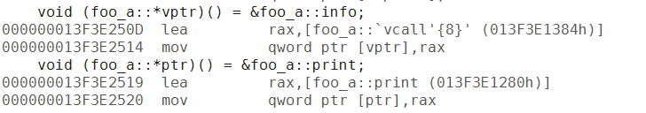
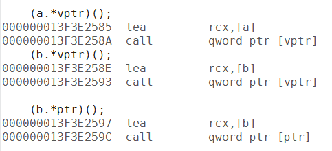
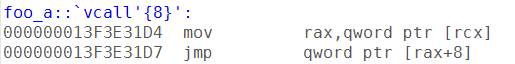
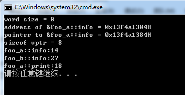
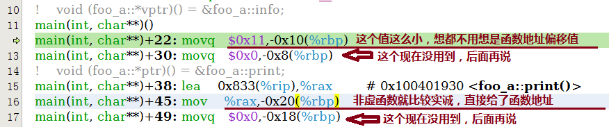
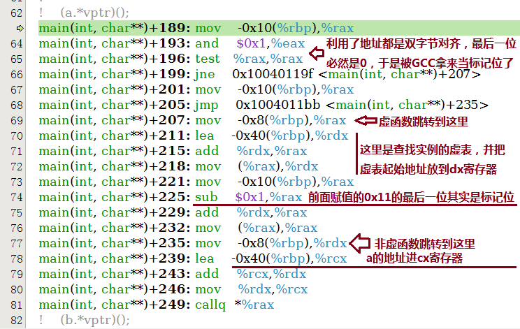
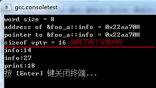

最近在《C++对象模型》一书里说到的virtual的成员函数指针，低于128的被cfront编译器认为是虚表偏移量（支持子类对父类函数的覆盖）。VC只是提了下单继承、多继承和虚继承的实现方案不同，GCC没有提及，所以就专门稍微深入分析研究下他们的实现机制。

以下所有代码都使用了64位编译，所以32位编译和运行的结果可能有略微差异。

## 单继承
首先是单继承的情况。这里用到的代码如下所示： 

```cpp
#include <ctime>
#include <vector>
#include <algorithm>
#include <cstdio>
#include <stdint.h>
#include <cstddef>
#include <string>

class foo_a
{
public:
    virtual ~foo_a(){}
    virtual void info() {
        printf("%s:%d\n", __FUNCTION__, __LINE__);
    }

    void print() {
        printf("%s:%d\n", __FUNCTION__, __LINE__);
    }
};


class foo_b: public foo_a
{
public:
    virtual void info() {
        printf("%s:%d\n", __FUNCTION__, __LINE__);
    }
};


int main(int argc, char* argv[]) {
    void (foo_a::*vptr)() = &foo_a::info;
    void (foo_a::*ptr)() = &foo_a::print;

    foo_b b;
    foo_a a;

    
    printf("word size = %d\n", (int)(sizeof(size_t)));
    printf("address of &foo_a::info = 0x%llxH\n", &foo_a::info);
    printf("pointer to &foo_a::info = 0x%llxH\n", vptr);
    printf("sizeof vptr = %d\n", (int)(sizeof(vptr)));

    (a.*vptr)();
    (b.*vptr)();

    (b.*ptr)();

    return 0;
}
```

先不展示这段代码的输出结果。这里面只有一层继承，分别有虚函数和非虚函数。并且都有指针赋值和执行操作。不出所料的是，(b.*vptr)() 这一行执行的是foo_b的info函数（虽然赋值的时候给的是foo_a的）。那么，VC和GCC是怎么实现这一功能的呢

## VC单继承成员函数指针实现



*图一： VC指针赋值*

可以看到，对非虚函数指针，直接把函数地址赋值过去了，但是对于虚函数，赋值的并不是foo_a::info的地址，而是**给了一个*foo_a::`vcall&rsquo;{8}&rsquo;*的函数地址**。



*图二：VC成员函数调用*

调用的时候倒是比较简单，各种的实现都一样。都是把**类实例的地址给了cx寄存器**，然后直接调用调转。那么这里的关键就在于vcall做了什么，怎么保证调用了正确的虚函数。

call指令里只有一行jmp跳转，我就不列举出了，接下来看vcall{8}干了什么。



*图三： VC虚成员函数vcall实现*

这里把cx取出并取值后加了8的地址偏移，说明VC内单继承情况下的虚表指针放在了数据结构最前面。+8显然是第二个虚函数的地址偏移（第一个是析构）。然后就华丽丽地a跳到了foo_a::info()，b跳到了foo_b::info() 函数。

由此可见，对于**虚函数指针，会多一次vcall的函数跳转**。由此来保证调用的是子类里的成员函数。

好吧运行结果还是有必要贴一下的



*图四： VC单继承测试代码执行结果*

## GCC单继承成员函数指针实现

接下来就是GCC了。GCC是怎么实现的呢？同样还是祭出大杀器，反汇编。



*图五：GCC单继承下成员函数指针赋值操作*

很明显就和VC不一样啦，GCC在给成员函数指针赋值的时候，给了两个值，第二个暂时没用到后面讨论。第一个值对**虚函数而言，给了*17（0x11h）*这个值，**非虚函数直接上了函数地址**。

从这里看，非虚函数它会怎么操作显而意见了，但是它不像VC那样多一层vcall跳转，他是怎么判断是不是虚函数的呢？往下看函数调用：



*图六：GCC单继承下成员函数指针调用*

可以看到，GCC的成员函数指针和VC的设计明显不同。**GCC的成员函数指针占用了两个word，**第一个用于记录函数指针或指针偏移，第二个用于记录虚表偏移。

而由于x86架构下默认是2字节对齐，ARM是4字节对齐或者8字节对齐。GCC正好利用了字节对齐的特点，用最后一位来标识是不是虚函数。如果是虚函数则查找虚表，计算实际函数地址；否则就直接跳转到该函数。

所以和VC不同的是，VC的vcall是长跳转，而gcc这种写法是短跳转。按个人理解，GCC的方式更利于CPU指令流水线的指令缓存。

但是这种做法带来的缺陷就是类成员函数指针**比VC多消耗了一倍的内存**，执行结果如下：



*图七：GCC单继承测试代码执行结果*

多重继承和虚继承的分析就下次再来啦。

下一篇&nbsp;[VC和GCC成员函数指针实现的研究(二)](https://www.owent.net/2013/896.html)