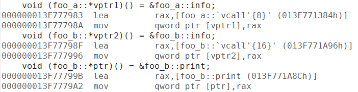
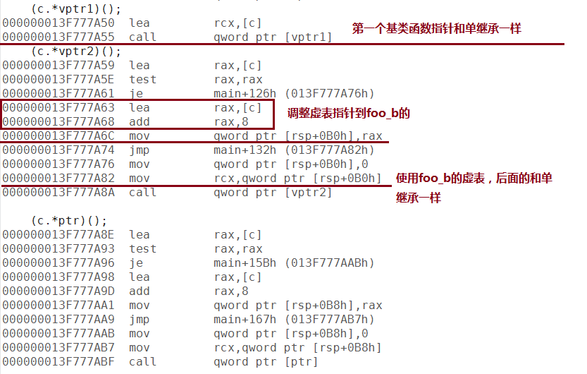
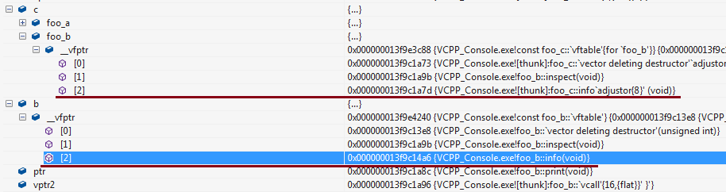
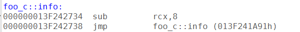
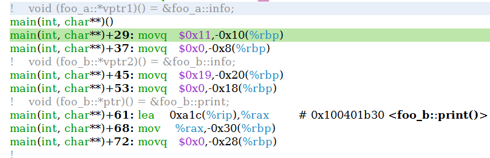
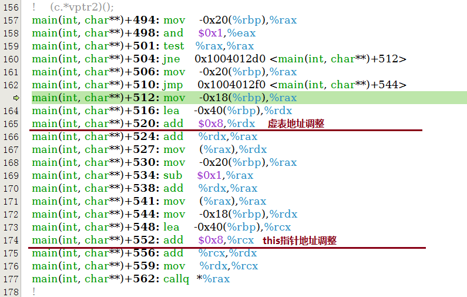
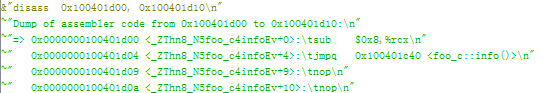

接上一篇 [VC和GCC内成员函数指针实现的研究(一)](https://www.owent.net/2013/890.html)

接下来是多重继承，用到的测试代码如下所示:

```cpp
#include <ctime>
#include <vector>
#include <algorithm>
#include <cstdio>
#include <stdint.h>
#include <cstddef>
#include <string>

class foo_a
{
public:
    virtual ~foo_a(){}
    virtual void info() {
        printf("%s:%d\n", __FUNCTION__, __LINE__);
    }
};

class foo_b
{
public:
    virtual ~foo_b(){}

    // 这个函数用于试foo_b的结构与foo_a不同
    // 以防止VC对foo_a和foo_b的`vcall'{8}'的代码合并
    virtual void inspect() { 
        printf("%s:%d\n", __FUNCTION__, __LINE__);
    } 

    virtual void info() {
        printf("%s:%d\n", __FUNCTION__, __LINE__);
    }

    void print() {
        printf("%s:%d\n", __FUNCTION__, __LINE__);
    }
};


class foo_c: public foo_a, public foo_b
{
public:
    virtual void info() {
        printf("%s:%d\n", __FUNCTION__, __LINE__);
    }
};


int main(int argc, char* argv[]) {
    void (foo_a::*vptr1)() = &foo_a::info;
    void (foo_b::*vptr2)() = &foo_b::info;
    void (foo_b::*ptr)() = &foo_b::print;

    foo_c c;
    foo_b b;
    foo_a a;

    
    printf("word size = %d\n", (int)(sizeof(size_t)));
    printf("address of &foo_a::info = 0x%llxH\n", &foo_a::info);
    printf("pointer to &foo_a::info = 0x%llxH\n", vptr1);
    printf("address of &foo_b::info = 0x%llxH\n", &foo_b::info);
    printf("pointer to &foo_b::info = 0x%llxH\n", vptr2);
    printf("sizeof vptr = %d\n", (int)(sizeof(vptr1)));

    (a.*vptr1)();
    (b.*vptr2)();
    (c.*vptr1)();
    (c.*vptr2)();

    (c.*ptr)();

    return 0;
}
```

## VC多重继承成员函数指针实现



***图八：VC多重继承的指针赋值操作***

赋值的部分和单继承是一样的。



***图九：VC多重继承的函数指针调用***

调用的时候主要看(c.*vptr2)()的代码。因为**(c.vptr1)()生成的和单继承一样**。而由于它们最终都转向vcall，所以vptr2的时候**调整了虚表指针为c的第二个虚表**。顺便**把this指针地址调整了**。

但是在转入vcall之后的操作和单继承是一样的，都是跳转到 **虚表+偏移**地址 后执行。

但是c的虚表内记得地址不是直接记得foo_c::info的地址，因为**要把this指针由foo_b*转回foo_c***。



***图十：VC多重继承的虚表***

*_(和前面不是同一批的截图，可能地址会对不上)_*

可以看到c和b的foo_b类型的虚表的info函数指向的地址是不同的。b中的foo_b虚表中的info函数直接指向了foo_b::info，但是c中的foo_b虚表里的info函数指向的地址先做了类型转换的地址调整，再才跳到foo_c::info，所以c的info的vcall跳过去后的代码是这样：



***图十一：VC多重继承的vcall***

*_(和前面不是同一批的截图，可能地址会对不上)_*

可以看到cx又减了8，把**this指针由foo_b*类型转回了foo_c***。

执行结果也没什么特别的就不贴了。

## GCC多重继承成员函数指针实现



*图十二：GCC多重继承的函数指针赋值*

哈，GCC的多重继承的赋值部分也和单继承一样，那么调用呢？



*图十三：GCC多重继承的函数指针调用*

如上图所示，比单继承多了两行，**第一行是调整虚表地址到foo_b**，这点和VC一样。**后面增加的add指令是调整成员函数的this指针地址**。



***图十四：GCC多重继承的函数指针调用***

*_(和前面不是同一批的截图，可能地址会对不上)_*

这个**this指针的恢复**的做法和VC是一样的，也是多一次跳转，然后把地址减回来。

下一篇 [VC和GCC成员函数指针实现的研究(三)](https://www.owent.net/2013/902.html)