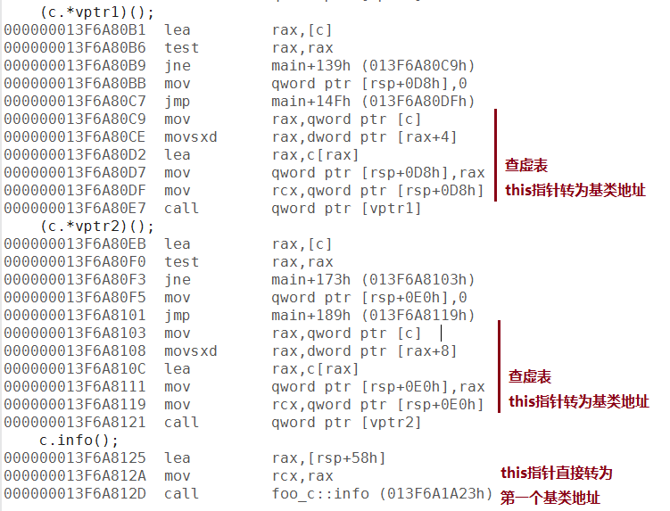
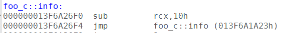
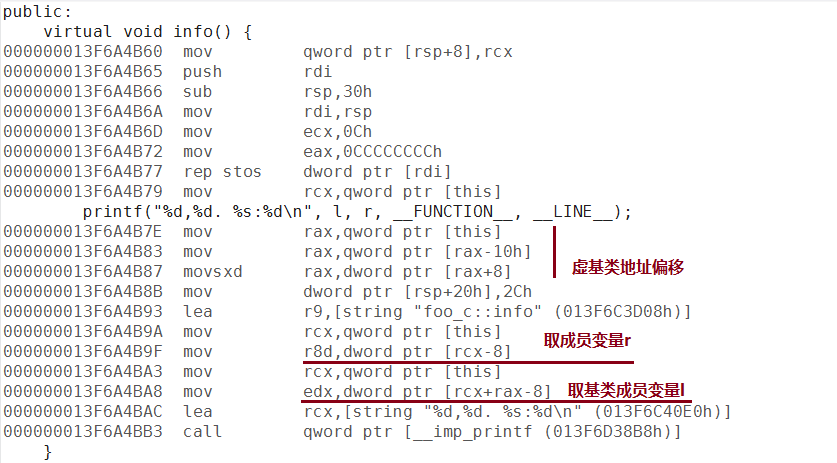
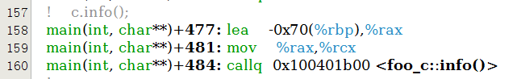
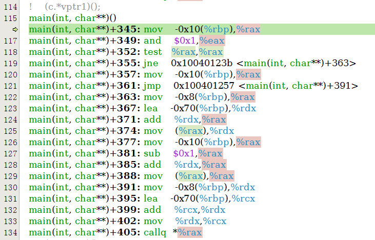
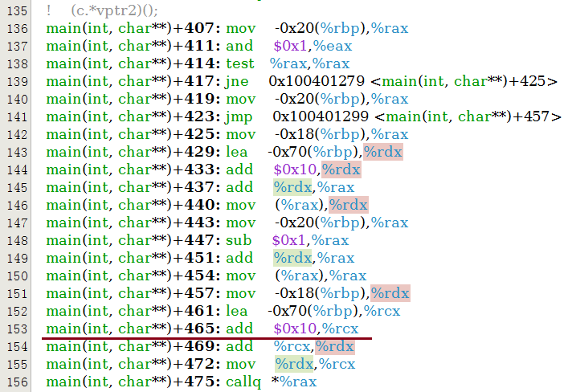
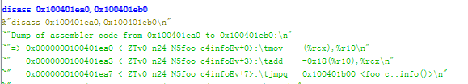

接上一篇 [VC和GCC内成员函数指针实现的研究(二)](https://www.owent.net/2013/896.html)

## 虚继承

终于到最后的虚继承了。

测试代码如下:

```cpp
#include <ctime>
#include <vector>
#include <algorithm>
#include <cstdio>
#include <stdint.h>
#include <cstddef>
#include <string>

class foo_a
{
public:
    virtual ~foo_a(){}
    virtual void info() {
        printf("%s:%d\n", __FUNCTION__, __LINE__);
    }

    void print(){
        printf("%s:%d\n", __FUNCTION__, __LINE__);
    }
};

class foo_l
{
public:
    int l;
    foo_l(): l(1){}

    virtual void info() {
        printf("%s:%d\n", __FUNCTION__, __LINE__);
    }
};

class foo_r: virtual public foo_a
{
public:
    int r;
    foo_r(): r(2){}
};

class foo_c: virtual public foo_l, public foo_r
{
public:
    virtual void info() {
        printf("%d,%d. %s:%d\n", l, r, __FUNCTION__, __LINE__);
    }
};


int main(int argc, char* argv[]) {
    void (foo_a::*vptr1)() = &foo_a::info;
    void (foo_l::*vptr2)() = &foo_l::info;
    void (foo_a::*ptr)() = &foo_a::print;

    foo_c c;
    foo_r r;
    foo_a a;

    printf("pword size = %d\n", (int)(sizeof(size_t)));
    printf("address of &foo_a::info = 0x%llxH\n", &foo_a::info);
    printf("pointer to &foo_a::info = 0x%llxH\n", vptr1);
    printf("sizeof vptr = %d\n", (int)(sizeof(vptr1)));

    (a.*vptr1)();
    (r.*vptr1)();
    (c.*vptr1)();
    (c.*vptr2)();
    c.info();

    (c.*ptr)();

    return 0;
}
```

## VC虚继承成员函数指针实现

因为是兼容虚继承和非虚继承的，所以赋值的部分的汇编是一样的。这里就不贴了。关键在于执行期它是怎么找到虚基类的。请往下看：



*图十五：VC多重虚继承的函数指针调用*

可以看到，虚基类函数指针调用是把this指针转为了虚基类地址再执行vcall函数。但是直接调用**c.info()**和调用第一个虚基类的函数指针的**(c.*vptr2)()**的this都是**虚基类foo_l**的指针，但是**(c.*vptr1)()**的this指针却是虚基类foo_a的指针。所以，在非第一个虚基类的函数指针调用时，VC用了一个和多继承相同的处理，即多一层vcall作地址偏移:



*图十六：VC多重虚继承的非第一个虚基类的地址偏移换算*

也是因为虚基类的调用传入的this并不是子类的首地址，而是第一个父类的首地址，所以去成员变量的时候也就多一次地址转换操作。



*图十七：VC多重虚继承的取成员变量和虚基类成员变量*

## GCC虚继承成员函数指针实现

同样，赋值部分没什么特别的，和前面都一样。经过测试，GCC在空虚基类成员函数指针调用和非空虚基类不同，我们直接上调用的汇编。



*图十八：GCC多重虚继承的直接函数调用*



*图十九：GCC多重虚继承的的空虚基类函数指针调用*

首先，GCC的直接调用和调用空虚基类成员函数时，cx直接是传入的子类的地址，和非虚继承一样。那么访问非空虚基类的时候呢？



*图二十：GCC多重虚继承的的非空虚基类函数指针调用*



*图二十一：GCC多重虚继承的的非空虚基类函数指针调用的基类偏移调整*

和多重继承的做法类似：**先给基类增加地址偏移；如果虚函数被覆盖，则再在虚表指向的函数里多一层跳转，并把偏移加回来到子类地址；而进了函数之后，变量的地址偏移就好算了**。


## 总结：

至此，VC和GCC主要的虚函数指针实现的方式就基本全了。但是开启了编译优化和某些flag之后的话可能生成的汇编会有些不同。但是应该都是以这个为基础的。从这里看起来VC和GCC的多重继承的实现方式是一样的，但是感觉VC的虚函数指针的vcall增加了很多复杂度，特别是。

另外就是虽然GCC的函数指针占用了两个指针大小，但是在这几个例子里，第二个的值一直是0，所以没搞清楚这个指针是做什么用的。难道是为了向前兼容就留着？希望能有知道的大神给点指示。

最后，文中可能有理解不对的地方，还请指正。 (* ^ _ ^ *)


## (评论迁移)
以下为blog迁移的评论内容：

> 在 https://www.owent.net/2013/896.html 的时候
> 
> 测试下&foo_c::info 就知道那个指针的用途了。
>
>  by yuanzhu]

> 感谢你得回复，在x86 GCC里这个里面另一个值仍然是0的。这里有个帖子有讨论这个问题。http://stackoverflow.com/questions/12006854/why-the-size-of-a-pointer-to-a-function-is-different-from-the-size-of-a-pointer
> 
> 还有这个 https://www.codeproject.com/Articles/7150/Member-Function-Pointers-and-the-Fastest-Possible
> 
> 简单地说，有一些编译器实现这种复杂的继承成员函数指针是通过：一个指针指向一个跳转函数，另一个指针里面保存偏移量，然后执行的时候根据偏移量来计算实际地址的。但是这里也说得很清楚。GCC使用了一个odd的优化，合并了指针和索引，其实就是用的上文里提到的那种方法（用x86架构函数地址至少对齐到2来做优化，最后一位当flag来用）。这样能够减少函数跳转，减少指令流水线的的预读cache miss。当然其他某些架构没有这个限定的，就不能用这种方法，我没有测试其他架构不是很确定，至少ARM要对齐到4，应该是和x86架构用的一样的trick。
> 
> 仍然感谢你得回复。
>   by owent

> 虚函数的成员函数指针结构。
> 
> ```cpp
> union{
>     struct{
>         word_int_t vtable_offset_1; //vtable_offset_1 % sizeof(vtable_offset_1) == 1
>         word_int_t this_pointer_offset;
>     }st;
>     R (C::*member_funtion_ptr)();
> }un;
> ```
> 非虚函数的成员函数指针结构。
> ```cpp
> union{
>     struct{
>         funtion_ptr_t function_ptr;
>         word_int_t this_pointer_offset;
>     }st;
>     R (C::*member_funtion_ptr)();
> }un;
> ```
> x86和x64都一回事。
> 
>   by 	yuanzhu 

> 我的意思是说，理论上有些编译器是这么实现（可能老的gcc也这么实现），但是现在的gcc已经使用vtable里记录和静态分析来实现计算offset了。我并没有找到gcc会（真正）使用这个指针（它不为0）的情况。如果有，可否贴一个sample？
> 
>   by owent

> 看来不是沟通误会了。。
> 
> 你的文章里 https://www.owent.net/2013/896.html
> 
> &foo_b::print 的那个值是0， 而&foo_c::print的那个值不会是0。
> 
> 用foo_c的指针去调用foo_b的成员函数的时候是需要对指针值做些offset修正的。
> 
> 然而
> 
> 1. 获取成员函数指针和成员函数调用是分开的场景。
> 2. 可以把基类成员函数当成子类成员函数来取地址（&foo_c::print）。
> 3. 在2发生之后，如果用子类指针去调用这个“伪”子类成员函数指针时，子类的指针值需要转换成基类的指针值。由于1，这个转换过程中的offset值不知道了。所以必须要靠成员函数指针把这个offset存> 下来。
> 4. 你可以试下把子类成员函数指针转换为基类成员函数指针，如果这个基类不是子类的第一父类，转换过程必然会导致修正这个offset值。
> 
> （考你个问题：子类引用转父类引用是左值吗？）。
> 
>   by 	yuanzhu

> 终于理解你得意思了。如果非虚非静态成员函数的类签名和指针类型的类签名不一样，并且这两个类型转换的时候地址会变化（不是第一个基类）的时候。要有offset来记录this的偏移。这上面的sample都过于简单了。
> 
> 我把我们最后讨论的结果和sample代码都贴gist了。地址位于:  https://gist.github.com/owt5008137/90d767e60f383b5e326eb7b1fb615781
> 
> 再次感谢你得指教。
> 
>   by owent