<!-- toc -->

用过std和boost的function对象和bind函数的童鞋们都知道这玩意用起来腰不酸了，腿不疼了，心情也舒畅了。先上一个简单得示例：

```cpp
std::string str;
std::function<bool()> func = std::bind(&std::string::at, &str);
bool is_empty = func();
```

但是这是怎么做到的呢？看完源码以后，你会发现这里面有着一些很巧妙的设计。

因为std和boost的实现原理基本一样，std的代码可阅读性极差，所以这里就主要拿boost的源码来分析了。不同的编译器在这基础上有不同的优化，等碰到的地方会大略地提一下，内部的实现原理一样的。

## 首先是bind函数Bind函数

在使用过程中实际上是有几个疑问点：

1.  如何统一处理函数、成员函数和仿函数的类型绑定?
2.  如何处理绑定式的函数参数和调用时的参数?
3.  如何控制调用时占位符位置和区分占位符与传入参数?

首先，需要知道的是，bind函数返回的是一个叫bind_t的模板类。并且这是个可调用对象（重载了operator()操作符）。

接下来主攻**第一个问题**，**它怎么处理不同类型的的参数绑定**。要研究这个的实现方法，首先要知道bind_t的数据结构。

<div style="text-align: center">
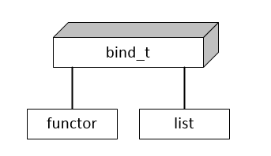

图1: bind_t 内存结构
</div>

bind_t里包含了两个成员，一个用于存可调用的仿函数functor，另一个用于保存执行bind函数时传入的参数列表list。

**仿函数functor**部分用于保存可调用的操作。如果bind操作传入的直接是一个仿函数，那么这个functor就直接是这个仿函数了；但是如果是普通函数或者成员函数，则会提供一个内定的仿函数内部记录这个函数指针。

**参数列表list**的部分则是直接保存了bind函数传入的参数。如果functor是一个成员函数的话，list至少要有一个，并且这个参数用于保存调用的对象。

在这之中，functor和list内参数个数和类型任意的变化都会导致最终生成的bind_t的类型变化，但是对最外层的bind接口，就把返回值都统一成了bind_t模板。

这里在list的实现上boost和std有一点小小的**差异**。由于boost要兼容老版本的编译器，而老版本编译器是不支持**动态模板参数**的。所以在boost中实现了boost::_bi::list0、boost::_bi::list_1一直到boost::_bi::list_9一系列模板list，用于保存参数。而GCC和VC 12以上都已经使用动态模板参数。

<div style="text-align: center">
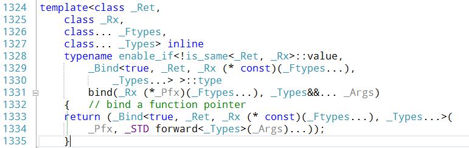

图2: VC12实现示例

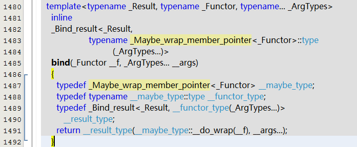

图3: GCC 4.8.2实现示例

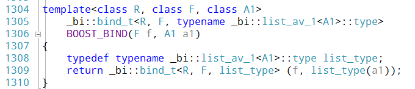

图4: Boost 1.55.0实现示例
</div>

接下来是第二个问题，**如何处理调用时的传入参数**。在bind一个函数或者对象的时候，可以在绑定期（就是调用bind函数的时候）传入一些参数，也可以在执行的时候传入一些参数。绑定期传入的参数在回答上一个问题的时候我们就知道是放在了bind_t的list成员里，那么怎么样可以少写代码处理剩下的参数传递呢？

<div style="text-align: center">
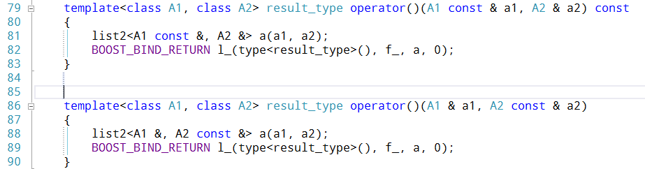

图5: Boost 1.54.0 的bind_t调用实现示例
</div>

Boost的实现比较暴力，枚举了各种参数限定和个数，而GCC和VC的做法无非是把这个体力活改成了动态模板参数，仅此而已。

在boost里，在接口上的多种参数实际上最终转向了list类的operator()操作符。所有的list都实现了传入另一个list的调用接口，在执行bind_t的时候对参数解引用。用这种方式把**二维的参数类型和个数列表**（第一维是绑定时传入参数，第二维是执行时传入参数）**收敛到了一维**。

<div style="text-align: center">
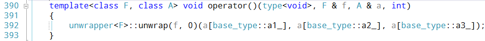

图6: Boost 1.55.0 的list3调用实现示例之一
</div>

见上面两幅图中，图5的调用最终会转向图6。图6中最后一个int参数是用来利用重载区分不同情况的函数的，请直接忽略之。而VC和GCC的实现中无非是改变了函数名称而已，流程是类似的。

简单地说，bind的构造和执行流程可以参照下图。

<div style="text-align: center">
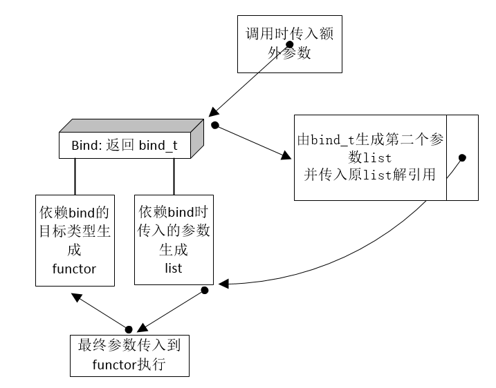

图7: Boost 1.55.0 的bind执行流程略图
</div>


执行流程解决了，最后就剩第三个问题，**如何控制调用时占位符位置和区分占位符与传入参数**。

前面有提到，所有bind产生的参数都由bind函数生成了list模板对象。而这个调用时的参数管理也需要这个模板对象来控制。但是在实际调用时，新传入的参数最终会交由原保存数据用的list调用执行。上面**图6**已经展示了第一个list取参数的过程。其中的a为新传入的参数list，*base_type::a1_*、*base_type::a2_*和*base_type::a3_*为原保存数据的list内的传入参数。这些参数可能是占位符，也可能是数据。

所以关键就在于operator[]取数据的方式。

<div style="text-align: center">
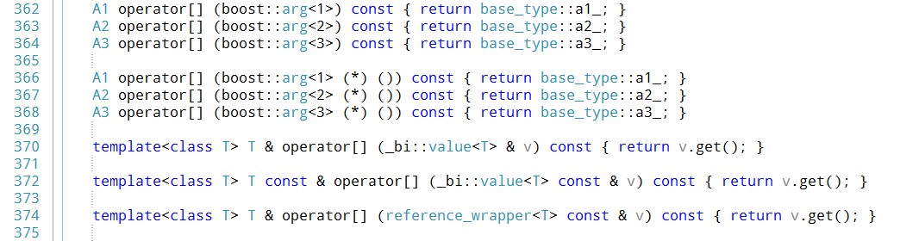

图8: Boost 1.55.0 内bind模块list去参数实现示例
</div>

从图中可以看出来，取参数的实现也相当简单。首先是成员函数重载实现对占位符取相应的数据。这里面 **boost::arg&lt;1&gt;**到**boost::arg&lt;3&gt;**分别是占位符。如果是占位符，就会返回参数列表（也就是新的list）内的对应位置的数据。否则直接把传入的数据的引用返回去了。而这里传入的数据都是由原保存数据list的内容，也就是执行bind函数时传入的东东。

这就用非常简洁地实现了任意控制占位符和预先传入的参数。其他参数个数的实现方法类似，这里就不一一截图列举了。

这么实现还有个好处，就是**如果使用了过大的占位符，在调用的时候由于参数个数不对，就会被编译器检测出来**并报错。

使用过boost的bind和function的童鞋应该看到过它里面的一个**注意事项**，就是如果bind的函数参数是引用类型，应该在执行bind函数时使用**引用包装**（boost::ref或者std::ref）。这其中的原因很简单，**如图4**，如果不使用引用包装，模板参数会认为传入类型为值类型，结果就**会导致传入的数据被复制**。

## 然后是function对象

function对象也上是有几个疑问点：

1.  function对象是固定大小、固定类型的，如何关联多种对象和函数？
2.  复制function时，为什么会导致其关联的对象也复制？
3.  调用时如何区分成员函数、非成员函数、虚函数和仿函数？

其实其中最为神奇的地方在于，function对象是一个固定类型的对象，却可以指向各种不同类型的仿函数或者函数，并且可以随意切换，其实也就是问题1。

<div style="text-align: center">
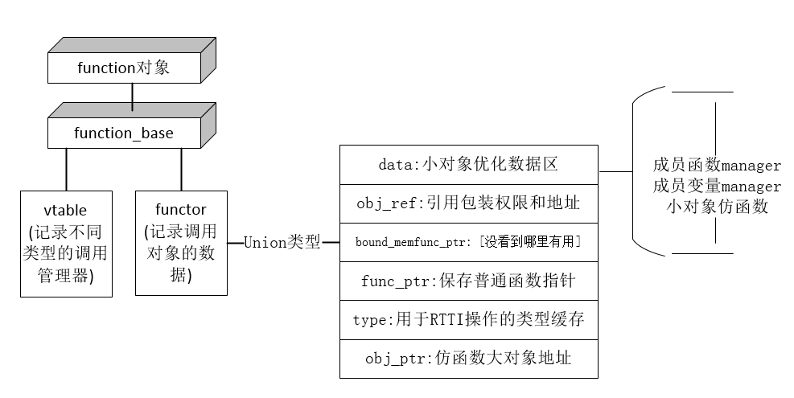

图9: function对象结构
</div>

首先是所有的function对象模板都集成自function_base，而这玩意里面主要有两部分。vtable指针和functor数据。

<div style="background-color: Gray;color: White;padding: 0.5em">
_注:在boost中，vtable指向一个静态对象，内含manager和invoker(调用时虚函数)；在GCC里，vtable部分被叫做manager，记录的是一个函数指针；而在VC里数据结构的分布略有不同，部分functor数据被直接记在了function里，并且invoker的实现直接采用了C++虚函数)_
</div>

在boost的实现里，每一种function实际绑定的类型都对应着一个**静态的vtable**对象。正如其名，他**模拟了编译器的虚函数表**的功能。在function对象被赋值为不同类型的数据的时候，设置为了不同的vtable对象。调用执行时也就是通过它，找到不同的invoker处理函数，并跳转到不同的绑定目标执行。

以上，就是**问题1**和**问题3**的解决方案。至于问题3中的区分成员函数和虚函数部分，可以参照我之前的一篇分享《[VC和GCC成员函数指针实现的研究](https://www.owent.net/2013/890.html)》。

至于**function复制**时如何发生？在有了functor结构之后就简单多了。

**首先**是，vtable指针直接复制，因为这仅仅是类型相关的。

**然后**，如果需要复制构造关联的东东，就复制构造它。代码实现见下图

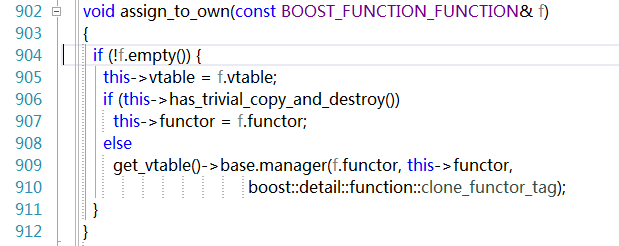

图10: function对象拷贝*

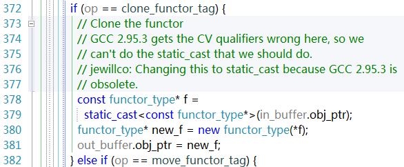

*图11: function对象关联内容拷贝(大Object)*

其中**clone_functor_tag**的操作见图11，这里是对大于缓冲区的对象执行复制构造。


在boost的function实现过程中还有很多**优化**，比如在对象比较小(functor能直接放得下整个关联的目标)时，它会把关联目标结构直接placement new在functor的内存位置（代码见下**图12**），大于缓冲区的会在堆里new出来(见**图11**和**图13**)。同时boost也利用了x86架构下函数地址为2字节对齐，拿最后一位来做是否是小functor的标记位。

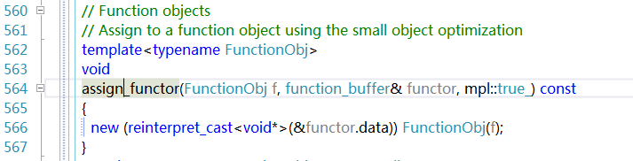

图12: function小对象和成员函数/变量functor数据保存

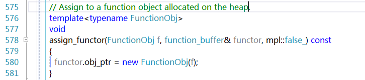​

图13: function大对象数据保存


另外在VC和GCC的实现里，都利用自身的特性进行了一系列的简化，使之占用内存更小，但是主要原理一致，这里就不再复述。


简单来说，function的实现原理就是模拟了C++编译器的虚函数表，对外提供统一的类型和接口。这样在我们拿它来做回调监听和事件响应的时候就可以简单地提供一组接口。而使用这些接口的模块可以根据自身的需求封入所需的各式各样的参数数据。提供了非常强的灵活性。

但是在使用function的时候也要有一个**注意事项**，那就是function的拷贝会导致所关联的结构体的复制，如果这种复制比较消耗性能的话需要考虑使用智能指针或者引用包装或者其他成本较小的方法来代替。


最后，在分析boost的function实现的时候我发现了一个有趣的地方。就是对于boost的引用包装，boost::function的functor部分采用了obj_ref结构来存储；但是对于标准库std的引用包装，却是视为了小对象仿函数来处理。其实是没什么太大影响啦。


function和bind的主要实现原理就是这些，如果各位大神发现哪里不对，还请指正。

