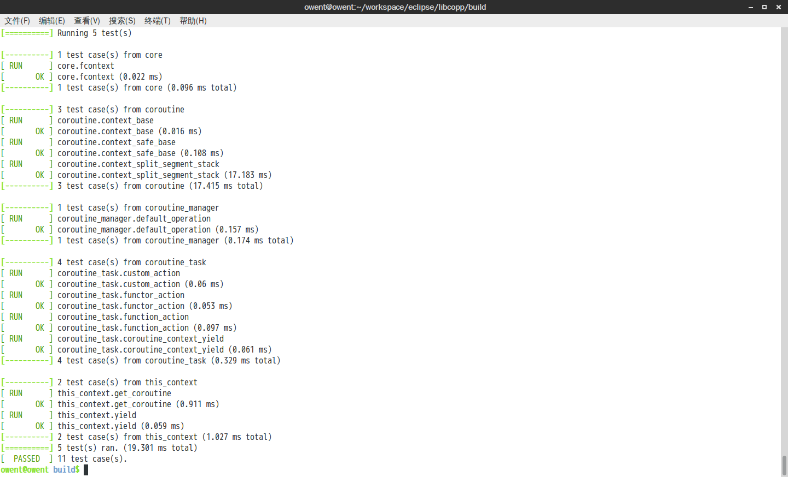
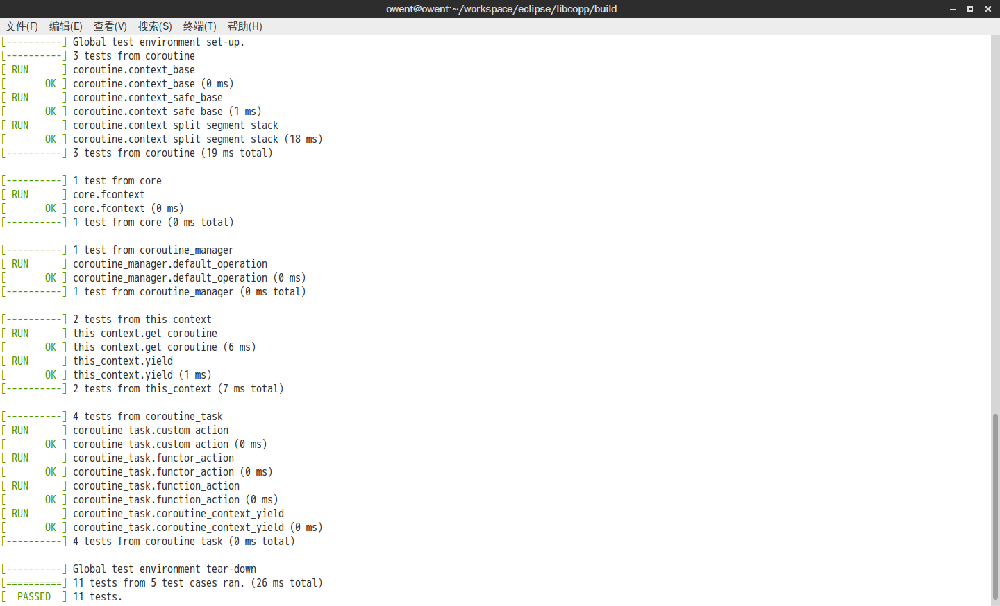
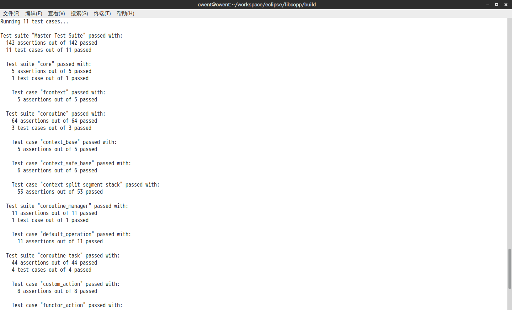

## 简介

众所周知，单元测试对于持续集成和变更的检测是十分重要的。
这个单元测试框架本是用于之前规划的C++协程框架使用的。
虽然已经有比较成熟的单元测试框架GTest、Boost.Test等等，但是要引入它们都会倒入很多文件。而且他们的兼容性也不是很好
GTest在ARM架构下需要额外作一些适配
Boost.Test的话，按Boost的尿性，一旦引入就会涉及上千个文件

目前这个单元测试框架还没有抽离出来，所以代码暂时放在
https://github.com/owt5008137/libcopp/tree/master/test
还有个镜像地址: http://git.oschina.net/owent/libcopp  后面的链接基本也有一样的镜像地址
这里面除了case目录是用于libcopp的单元测试外，其他的都属于单元测试框架部分
以后如果需要的话，可以再抽离出来

## 设计及技术方案

最初搞这个单元测试框架的时候，是想参照GTest的接口形式，即
CASE_TEST(测试套件名称, 测试case名称) {
… 测试内容
}
的形式。类似Google的方法是没有主动调用add test suite或者add test case的
所以在这个CASE_TEST的时候就需要把test suite和case放进测试池中。
同时CASE_TEST的最后部分必须是函数申明，以便后续跟上测试代码块

如何完成这一点呢？
我这里利用了全局变量会在程序进入man函数前初始化的特点。

1. 在申明CASE_TEST的时候，先作函数声明
> static void function_name();

2. 然后后跟一个全局注册变量，把suite名称、case名称和函数指针传进来
> test_case_base g_var(suite名称, case名称, &function_name);

3. 最后跟上函数定义
> void function_name()

这样后面就可以直接跟上测试代码块了。
接下来需要做的就是在构造函数里把函数注册进suite和case对应的测试池中。

那么在CASE的CHECK过程中怎么知道它是属于哪一个suite和case呢？
这里的做法是在test执行前，会在全局的位置标记一下，这样在Check成功或者失败的时候都可以知道是失败的位置了。

另外有一点**需要注意**的是，在Check宏的实现过程中只能有一次出现表达式求值的地方，不然表达式就会执行多次，这样会导致行为异常的
因为表达式只能出现一次，所以暂时没有做临时的数据存储，就不会像GTest那样写出 expected is XXX real is XXX 的东西出来（这个以后有需要可以加）。

自此，一个简易地单元测试框架就完成了，再加上一些终端颜色的控制，就基本OK了。
但是也是因为只是一个简单的框架，所以暂时不支持多线程，不支持在Windows命令提示符中带颜色显示。也暂时没有Check失败时程序终止的代码
但是作为一个简单的单元测试框架，核心功能已经具备。（其他的可以以后加嘛 ( * ^ _ ^ * ) ）


但是毕竟GTest和Boost.Test功能比较完善（特别是Boost.Test还自带内存泄露检测），于是就希望如果环境具备的情况下，能够不改一行代码直接切换到成熟的测试框架，于是还要增加切换的适配。 

## 一键切换适配方案 – GTest

其实要切换到GTest很简单，因为本来就是按GTest的接口方式来的，直接重新define就好了

原来的代码是 

```cpp
#define test_case_func_name(test_name, case_name) test_func_test_##test_name##_case_##case_name
#define test_case_obj_name(test_name, case_name) test_obj_test_##test_name##_case_##case_name##_obj

#define CASE_TEST(test_name, case_name) \
static void test_case_func_name(test_name, case_name) (); \
static test_case_base test_case_obj_name(test_name, case_name) (#test_name, #case_name, test_case_func_name(test_name, case_name)); \
void test_case_func_name(test_name, case_name) ()

    #define CASE_EXPECT_EXPR(expr) \
        if(expr){ \
            ++(*test_manager::me().success_counter_ptr); \
        } else { \
            ++(*test_manager::me().failed_counter_ptr);\
            printf(shell_font::GenerateString("FAILED => %s:%d\nExpected: %s\n", SHELL_FONT_COLOR_RED).c_str(),\
                __FILE__, __LINE__, \
                #expr); \
        }

    #define CASE_EXPECT_TRUE(c) CASE_EXPECT_EXPR(c)
    #define CASE_EXPECT_FALSE(c) CASE_EXPECT_EXPR(!(c))
    #define CASE_EXPECT_EQ(l, r) CASE_EXPECT_EXPR((l) == (r))
    #define CASE_EXPECT_NE(l, r) CASE_EXPECT_EXPR((l) != (r))
    #define CASE_EXPECT_LT(l, r) CASE_EXPECT_EXPR((l) < (r))
    #define CASE_EXPECT_LE(l, r) CASE_EXPECT_EXPR((l) <= (r))
    #define CASE_EXPECT_GT(l, r) CASE_EXPECT_EXPR((l) > (r))
    #define CASE_EXPECT_GE(l, r) CASE_EXPECT_EXPR((l) >= (r))
```

在切到GTest时直接变成 

```cpp
#define CASE_TEST(test_name, case_name) TEST(test_name, case_name)

#define CASE_EXPECT_TRUE(c) EXPECT_TRUE(c)
#define CASE_EXPECT_FALSE(c) EXPECT_FALSE(c)
#define CASE_EXPECT_EQ(l, r) EXPECT_EQ(l, r)
#define CASE_EXPECT_NE(l, r) EXPECT_NE(l, r)
#define CASE_EXPECT_LT(l, r) EXPECT_LT(l, r)
#define CASE_EXPECT_LE(l, r) EXPECT_LE(l, r)
#define CASE_EXPECT_GT(l, r) EXPECT_GT(l, r)
#define CASE_EXPECT_GE(l, r) EXPECT_GE(l, r)
```

即可，然后在main函数的入口处作一些函数调用的适配即可。（详见: https://github.com/owt5008137/libcopp/tree/master/test/frame/test_macros.h 和 https://github.com/owt5008137/libcopp/tree/master/test/app/main.cpp ） 

## 一键切换适配方案 – Boost.Test

boost这个比较麻烦，因为boost的接口方式不一样，甚至在使用静态库的时候有自己的入口函数
简单地说就是分支比较多

1. 在入口处要判断是静态库还是动态库，有没有使用boost.test内置的函数（详见: https://github.com/owt5008137/libcopp/tree/master/test/app/main.cpp ）
2. 添加suite和case的方式有变化（详见: https://github.com/owt5008137/libcopp/tree/master/test/frame/test_manager.cpp ）
3. 还是宏定义的部分变更（详见: https://github.com/owt5008137/libcopp/tree/master/test/frame/test_macros.h ）

剩下的就是一些环境判断和控制开关的宏了

## 效果展示
### 原版效果

生成命令: 

```
cmake ../repo -DLIBCOPP_ENABLE_SEGMENTED_STACKS=YES
make -j4
test/coroutine_test
```

效果预览: 



### 一键切换到GTest效果

生成命令:

```
cmake ../repo -DLIBCOPP_ENABLE_SEGMENTED_STACKS=YES  -DGTEST_ROOT=/home/owent/workspace/libs/gtest
make -j4
test/coroutine_test
```

效果预览: 



### 一键切换到Boost.Test效果

生成命令:

```
cmake ../repo -DLIBCOPP_ENABLE_SEGMENTED_STACKS=YES -DLIBCOPP_TEST_ENABLE_BOOST_UNIT_TEST=YES -DBOOST_ROOT=/home/owent/workspace/libs/libboost
make -j4
test/coroutine_test -r detailed
```

效果预览: 

