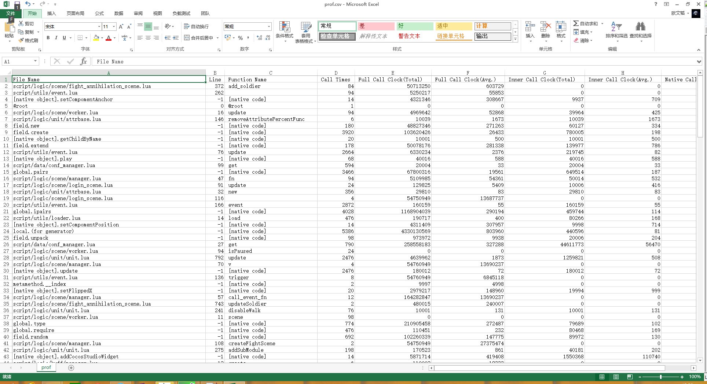
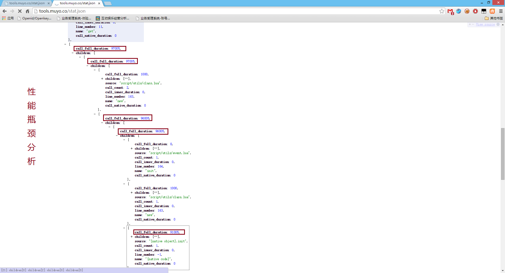

<!-- toc -->

前言
------
Lua性能分析本来有一些现成的工具，比如LuaProfile，不幸的是这货不支持luajit，另外LuaStudio虽然挺好用但是是收费的。
比较不爽，刚好Lua本身提供钩子功能，用来写调试工具和性能分析工具都比较简单，索性就自己写一个。

设计思路
------
在lua提供了钩子函数的情况下，性能分析其实比较简单。只要挂载**LUA_MASKCALL**钩子和**LUA_MASKRET**的钩子，自己搞一个执行栈信息记录的结构，里面记录一下时间差就好了。

一般性能分析工具都会提供函数内部开销和总开销。总执行时间差即是总开销，函数内部则在函数切换时累加，切换回来时重新计算开始时间即可。（其实还有一种办法是总时间减去其调用的函数开销，为什么不这么做下面会提到）

一些问题
------
但是实际实现过程中还是碰到了一些问题的，因为我直接用得luajit，所以不知道是不是luajit的bug。

1. 本地C代码会触发LUA_MASKCALL钩子，不会触发LUA_MASKRET钩子
2. 有些lua函数的返回钩子也不会被触发

总的来说就是**有些函数返回没有触发LUA_MASKRET钩子**，这样带来的一个问题就是统计不准，准确的说就是这些函数的实际调用开销会比统计结果小。并且调用关系可能会不正确。

为了尽可能减少不触发返回带来的影响，函数内部开销的统计在函数切换的时候就统计一次，并更新状态。另外如果弹出的函数不是记录中的最上层，就**一直弹出栈到匹配的函数为止**。

这样做的结果只能尽可能减少误差，当然还有一种可选方案是不统计这些不触发返回钩子的函数的统计，这样不会有误差，但是统计的信息量会减少。

精细统计
------
很多情况下总的调用统计并不能满足需求，特别是有上面误差的问题的情况下。所以就加了个对于单个函数调用手动hook的统计功能。

实现的方式就是替换原有的lua函数为自己实现的C函数，然后在自己的函数里增加统计信息，再去调用原来的lua函数。这种情况可以做到手动对单个函数的单次调用关系和消耗分析。对于查找性能毛刺有一定帮助。

hook的函数如下:
```cpp
// hook_fn[lua fn, stat fn](...)
static int LuaProfile_hook_run_fn(lua_State *L) {
    auto profile = LuaProfile::Instance();
    // 获取Lua调用信息
    lua_Debug ar;
    lua_getstack(L, 0, &ar);
    lua_getinfo(L, "Sn", &ar);

    LuaProfileStackData::stack_ptr_t root_ptr = LuaProfileStackData::make(std::make_pair(__FUNCTION__, __LINE__));
    root_ptr->name = ar.name;
    size_t top = profile->push_fn(root_ptr);

    // native 级cpu时钟统计 
    auto start_tm = LuaProfileStackData::clock_t::now();

    // 转入原来的lua 函数
    int param_num = lua_gettop(L);
    lua_pushvalue(L, lua_upvalueindex(1));

    for (int i = 1; i <= param_num; ++i) {
        lua_pushvalue(L, i);
    }
    lua_call(L, param_num, LUA_MULTRET);

    auto duration = LuaProfileStackData::clock_t::now() - start_tm;
    // 关闭统计
    profile->pop_fn(top);

    // 统计函数
    {
        lua_pushvalue(L, lua_upvalueindex(2));
        if (lua_isnil(L, -1)) {
            lua_pop(L, 1);
        } else {
            LuaProfile_hook_run_fn_gen_stats_table(L, root_ptr);
            lua_call(L, 1, 0);
        }

        ++ root_ptr->call_count;
        root_ptr->call_full_duration += duration;
    }

    // 优先读取第一子节点的信息
    if (!root_ptr->children.empty()) {
        root_ptr->source = root_ptr->children.begin()->second->source;
        root_ptr->line_number = root_ptr->children.begin()->second->line_number;
    }

    // TODO hook 的函数级监控
    int ret_top = lua_gettop(L);
    return ret_top - param_num;
}
```

导出Lua接口
------
开启性能分析的时候会导致执行速度大幅下降，而且lua的钩子是独占的，所以在lua层增加了接口用于控制性能分析组件。
```lua
profile.start() -- 启动栈性能分析
profile.stop() -- 停止栈性能分析
profile.reset() -- 重置栈性能分析缓存数据
profile.enable() -- 恢复性能分析
profile.disable() -- 暂停性能分析
profile.enableNativeProfile() -- 启动本地调用统计
profile.disableNativeProfile() -- 关闭本地调用统计
profile.dump_to(<文件路径>) -- 转储分析结果到文件（csv格式）
profile.dump() -- 返回分析结果（csv格式）
profile.hook(<lua函数>) -- 函数级性能分析钩子
```

输出
------
上面的总调用统计我这里直接输出csv文件或csv格式的文本了。有需要可以改成其他输出格式。


精确的函数调用关系统计直接输出的lua table，可以通过lua转成其他格式。比如下图是我转成json之后的结果：


所有代码托管在：
https://github.com/owent-utils/lua/tree/master/src_native/Script/Lua/LuaModule/LuaProfile.cpp
和
https://github.com/owent-utils/lua/tree/master/src_native/Script/Lua/LuaModule/LuaProfile.h

除这两个文件已外依赖项目：
1. https://github.com/owent-utils/c-cpp/tree/master/include/DesignPattern
2. https://github.com/owent-utils/c-cpp/tree/master/include/String/StringCommon.h

共3个文件，如果不需要单件模式基类和字符串跨平台CMP函数的话可以移除掉，有兴趣的童鞋可自取。

> Written with [StackEdit](https://stackedit.io/).

