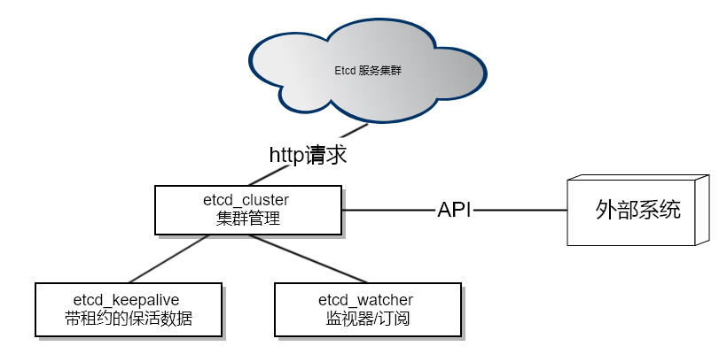

## 前言

最近在抽时间整理之气的游戏服务器框架和解决方案里[atsf4g-co][2]，现在的架构是使用[etcd][3]的是[atproxy][4]。简单得说就是服务集群是分组的，每个分组有分组代理服务[atproxy][4]做组间通信。然后[atproxy][4]之间使用[etcd][3]来做分组服务的服务发现和保活，并且以此来实现平行扩容。

之前做服务间通信组件[libatbus][5]的时候也提到了有一个暂时没实现的功能，就是全局路由表的自动通知。但是这个功能的实现主要也是用于后面不同种服务间感知到哪些节点是可用的，哪些是不可用的。而且我的简单实现必然是走心跳的模式，因为心跳的形式肯定不能把心跳设置得太短，同时也要考虑网络异常抖动和断线重连和丢包，所以肯定不是丢一个心跳包就认为丢失。所以故障或者扩缩容期间的感知时间就会比较长一些。另外就是因为可能有网络孤岛问题，所以可能短期内数据不一致（当然肯定会保证最终一致性）。

再加上由于[libatbus][5]是支持多级父子节点关系的，所以变化通知和同步包就要考虑自己与父节点、兄弟节点、自己与子节点的不同关系并作不同的同步流向，会比较复杂。比如：子节点下线，既要通知父节点，又要通知兄弟节点。那么这时候给兄弟节点通知就有两个通路，一个是经由父节点中转，另一种是直接发。当然这时候并不一定和兄弟节点有直接通路。所以可能兄弟节点会收到两次通知，一次来自兄弟节点，另一次来自公共父节点。然后又会有其他问题，就是万一又收到一条冲突的消息，来自父节点和来自兄弟节点的顺序是没有保证的，这里又得加入版本机制。总的来说，细节会比较复杂，具体在实现[libatbus][5]的这个功能的时候在谈吧。

上面说的[libatbus][5]的功能暂时没实现的最重要原因是[etcd][3]可以比较完美的解决上面的延迟问题和不一致问题。缺点就是请求的消耗会高于使用[libatbus][5]的通信机制。不过这玩意本身不是高频操作，而且故障和容灾本身不是一个频发的事情所以关系不大。而之前[etcd][3]的接入是直接写死在[atproxy][4]里的，那么这次重构的目的主要就是能够抽象出模块化的工具，以便后面不同的服务可以根据需要取用。

## 统一管理驱动管理器和模块化

按现在的功能划分，[etcd][3]的接入总共被分为3个模块，etcd_cluster、etcd_keepalive和etcd_watcher以及一个通用工具etcd_packer。etcd_packer用于对[etcd][3]的一些通用的打解包操作。

### etcd_cluster 

[etcd][3] v3版本内部的通信已经使用了grpc。本来我是想等他的grpc接口进入官方文档并且提供出的grpc的proto再接入的，可是它一直没有整理出直接grpc的proto文件列表。另外我看了一下它的proto文件里用到了一些[gogoprotobuf][7]的扩展，其他语言不一定可以无缝接入。考虑到etcd使用了[grpc-gateway][6]提供HTTP+JSON的网关层，所以我还是基于他的HTTP接入层来做。因为这里身频次不高，也没有那么在意性能。而且一组[etcd][3]服务的QPS也就在十万的级别，只要管理好连接，不要老新建立和关闭连接，HTTP的性能还是够的。

第一个上层服务就是etcd_cluster，用于和atframework里的http_request和[libuv][8]结合起来使用。统一管理[etcd][3]的请求、超时等。当然最重要的功能是做接入，也就是去读取[etcd][3]的服务器节点列表并定时刷新。这样可以适配[etcd][3]服务的容灾和扩缩容。我们使用[etcd][3]服务一般是5节点，2个同机架，3个同机房，2个异地。这样一般的应用的容灾上绰绰有余了。当然特殊的业务需要更高的容载能力还可以加，但是[etcd][3]随着节点数上升性能会下降，而且我们的atframework也不是说[etcd][3]挂了就完全不可用，只是新的服务器组暂时感知不到罢了。已有的服务器组之间还是有自己的心跳保活的，所以你要[etcd][3]和我们业务服务器同时故障的概率就非常小了。退一万步就算真的同时故障，在服务重新拉起后还是能秒级自动恢复的，问题其实不是很大。

不过由于keepalive和watcher比较特殊，所以etcd_cluster还是需要做一些额外的支持。比如[etcd][3]的节点切换和watcher的请求超时后需要自动重新发起watcher请求；[etcd][3]的服务节点切换后需要立即发起一次keepalive的数据确认和定期自动发起keepalive保活等。之前写死在[atproxy][4]里的keepalive流程是给一个path设置数据以后，不断地用PUT命令续期过期时间。这样有个坏处是会不断提升数据版本号。现在优化成了每个etcd_cluster可以申请一个lease，然后需要keepalive的数据之设置一次数据并绑定到这个lease上。然后由etcd_cluster不断地去续期这个lease的超时时间，就和zookeeper的模式一样。这样还有一个好处是如果我增加很多个keepalive的数据不需要每个数据都不断地发请求来续期超时时间。

不过有一项还没做的是认证功能，不过因为我们现在的业务可以用运维手段，通过网络手段去隔离外部请求，并且并不需要做成公共服务，所以暂时还不需要这个。当然如果以后需要接入到某个公共平台的话可以加一个这个，也不困难，就在member/list请求后面加一个认证流程拉取token，然后在setup http请求的地方统一加一个Authorization的HTTP Header就行了。

### etcd_packer

[etcd][3]提供的网关层的输出大部分有统一的response header，另外比如对于数字，输出 "a": "123"和"a": 123都是允许的。为了简化一些通用的流程，所以加了个小工具统一处理打解包操作。另外[etcd][3]的path和value都是二进制，然后再转化过程中全部被转为了base64编码的数据，所以对于内容而言etcd_packer就是提供了一个统一的方法把数据转换出来并且和内部的JSON对象进行转换。

### etcd_keepalive和etcd_watcher

这两个模块相关性比较强。之所以抽离出来，一方面是由于前面提到的，如果有多个需要keepalive的数据，不会有多余的开销。另外就是允许业务服务根据自己的需要取舍。比如邮件服务需要互相知道节点存活状态和负载Hash规则，还要同步自己的状态，所以既有邮件的watcher也有keepalive。但是邮件的客户端层面，只需要有watcher就可以知道负载规则，就可以了。这时候就不需要keepalive和lease。再比如我们现在的服务器集群中，逻辑服要关注好友服和邮件服，因为这两个服务都是按用户ID做Hash来确定服务请求应该发给哪台服务器的，所以可以只加两个watcher，订阅好友服和邮件服的服务器集群信息就行了。

etcd_keepalive要填充的数据的key已存在，还可以对已有数据做一次检查。这样如果崩溃后短时间内被拉起，可以知道现有的数据就是自己的，这时候直接覆盖即可。如果是正常启动，发现有冲突的信息，就可以打错误日志然后下线。比如在[atproxy][4]中，如果是崩溃拉起，那么listen地址和物理地址一定不会变化，那么直接副高即可。如果两个不同的[atproxy][4]使用了同一个bus id，那么后启动的[atproxy][4]就会检查不通过然后启动失败。

## Etcd V3 API

最早[atproxy][4]里写死的版本还是用的v2版的HTTP接口。因为那时候V3的接口还很不完整，现在也是直接接入了V3的API。我自己也是感觉V3的API更好更灵活一点。V2里很多靠HTTP HEADER来决定是什么行为的，数据一部分在HEADER里另一部分在BODY里，数据的传递好几种方式。现在的V3都使用URL来决定行为，用JSON内容来传递数据，和protobuf的结构保持一致了。另外就是用lease简化了keepalive的行为。

大多数数据层面还只是换了位置和名字，唯一有一个不太一样的流程是watch请求。在[etcd][3] v2的API中watch请求是一个一直BLOCK住的请求，当有事件变化到来的时候返回然后带回版本号ID，然后再用这个版本号ID去发起下一个watch请求。如果版本号之后又有变化事件会立即返回，否则继续block住。而现在[etcd][3] v3中，watch请求是一个流数据的回包，不需要再不停地发起请求了。但是流数据怎么判定是一个事件消息的结束呢？[grpc-gateway][6]的文档里说它会把流数据转化为换行符结尾的JSON串。再加上所有的数据中都被base64编码过了，所以我们可以直接用换行符来分割事件消息，然后etcd_watcher把这些消息封装成事件供业务层使用。

## 测试和工具

因为[atsf4g-co][2]还没有加入到CI里，所以先还是写了个[小工具][9]做测试，也算一个小demo吧，封装后的接口使用起来比较简单就一个文件。测试通过以后人工构造[atproxy][4]的各种情况然后看日志。后面有空再写自动化测试吧。

这个模块其实几周前就完成了，但是春节嘛想休息一下就一直没写这篇blog。唉！也是拖延癌拖到现在才补上来。我在接入的时候，[etcd][3]的v3版API还是v3alpha，现在已经前缀改为v3beta了，等到有空我看看变化然后改成v3beta的API，也不知道啥时候才能release版本。

这几个模块都还没抽离出[atsf4g-co][2]，现在是作为模块放在 https://github.com/atframework/atsf4g-co/tree/master/atframework/service/component/etcdcli 不过要提取出啦也没太大困难就是了，也没太多依赖，主要就依赖atframe_utils里面的http_request和base64编码。我也在考虑以后怎么给[atsf4g-co][2]模块化，做成依赖管理那种服务化的东西，等到那时候再提出来吧。

[1]: https://github.com/atframework
[2]: https://github.com/atframework/atsf4g-co
[3]: https://coreos.com/etcd
[4]: https://github.com/atframework/atsf4g-co/tree/master/atframework/service/atproxy
[5]: https://github.com/atframework/libatbus
[6]: https://github.com/grpc-ecosystem/grpc-gateway
[7]: https://github.com/gogo/protobuf
[8]: https://libuv.org
[9]: https://github.com/atframework/atsf4g-co/tree/master/src/tools/etcd-watcher