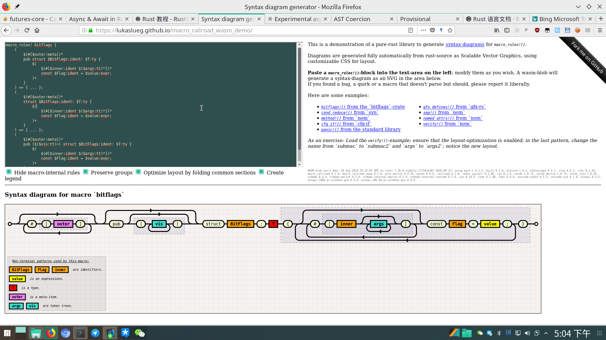

JUST PRACTICE
----------------------------------------------
蛮久前入门了一下 [Rust][1] 语言。它的设计模型非常地吸引C/C++的开发者。但是学习语言嘛还是要练习一下，之前也用它给我们项目写了个命令行小工具。这回拿来写个小型的服务器程序吧。

[Rust][1] 的生态还处于非常初级的阶段。很多组件和库都处于开发中和设计变更的阶段，比起golang来，很多功能库都没有。
服务器编程本身特别注重高并发能力和，高性能。和原来很多客户端程序的思路是不太一样的。所以本来想等新的Futures和await和2.0版本的宏机制完成再搞。而老的[Futures][14]库由于即将移入核心库，在[crates.io][5]上下架了。现在似乎很多[Rust][1]的库都按[Tokio][7]的的模式来，于是我看了一下基于[Futures][14]的多路复用IO库[Tokio][7]的文档来练习一下这个小服务器程序。

至于写个啥呢？之前想把 [IntelliJ IDEA License Server v1.6](http://blog.lanyus.com/archives/326.html) 部署到路由器上玩来着。无奈看了一下作者似乎是用golang写的。golang也是个地址怪兽，启动后虽然内存消耗只有4MB，但是地质空间分配了800MB。这对大型服务器程序其实没什么，但是我看了下我的路由器上是开了 ```vm.overcommit_memory=2``` 的，这意味着进程地址空间太大也会直接OOM。所以就尝试按他们提供的方法，[Rust][1]写一个看看吧。当然这只是玩具，有条件的童鞋还是支持正版呗。

先说结论，最终完成版放在 https://gitee.com/owent/ideaactsvr/ 。二进制大小和go语言版本差不多，地址空间（VSZ）大约是golang版本的4%。内存（RSS）大约是golang版本的70%。

在web框架选型里，我对比了一些框架（[actix-web][13]、[iron](https://crates.io/crates/iron)、[nickel](https://crates.io/crates/nickel)、[hyper][15]、[rocket][16]等）的易用性、社区活跃度和功能支持。最终选择了[actix-web][13] ，[actix-web][13] 支持websocket，支持HTTP/HTTPS ，可定制化尚可，又不像[hyper][15]那样提供的过于底层的接口据难用，也不像[rocket][16]那样提供的封装过于高层，以至于定制化比较困难而且使用特性有点激进。特别是[actix-web][13]支持websocket，所以做完这个小玩具之后，顺带我拿它也来优化了一下之前写的gmtools-cli。

以下记录一些碰到的问题点。

推翻惯性思维
----------------------------------------------

### getopt->clap
之前做gmtools-cli的时候用的启动参数解析是getopt，但是后来发现[clap][17]是个更好也是更多人的选择。它提供了一些更高级的特性，同时还提供了一些宏来读取[cargo][18]里的配置的。这样一些应用程序说明和名字之类就不用复制几遍了。版本号也可以托管进配置。

### 不优雅的全局静态变量
在通常的软件里，从一些位置或者启动参数读取配置然后以便全局使用是一个再正常不过的事儿吧？但是在[Rust][1]里就不太容易了。因为[Rust][1]会默认不允许线程不安全的代码，而全局变量和静态对象怎么保证不会出现访问冲突呢？

在通常的C/C++程序里，我们可能会在一开始初始化，后面不再变了。当然这是我们人工保证的，写起来也比较容易。然后如果需要reload的资源，可能会加锁。或者read和write的地方加锁，并不需要阻止已有的worker的继续用老版本的数据工作。

而在[Rust][1]里，直接访问全局变量是 **unsafe** 的。而直接Copy一份配置出来开销可能会很大。并且使用 ```Rc<T>```或者```Arc<T>```又不能保证一定只有在一个地方被借用（[Rust][1]里多个同时存在的运行时借用会被panic掉）。所以这里我用了一个非常绕且麻烦的方法。

首先创建了一个对象来存储全局数据:
```rust
struct AppEnvironmentInfo {
    pub host: Option<String>,
    pub port: i32,
    pub username: Option<String>,
    pub prefix: Option<String>,
    pub log: Option<String>,
    pub log_rotate: i32,
    pub log_rotate_size: usize,
    pub pid_file: Option<String>,
}

static mut APP_ENV_INFO_STORE: AppEnvironmentInfo = AppEnvironmentInfo {
    host: None,
    port: 12018,
    username: None,
    prefix: None,
    log: None,
    log_rotate: 8,
    log_rotate_size: 524288,
    pid_file: None,
};
```

上面之所以用Option来包裹String是因为这些数据是后面才会初始化的，并且没有引入[lazy_static][19]的情况下，静态对象里的String并不能从常量中初始化（不规定顺序）。
而且我觉得[lazy_static][19]也没多好用。

然后第二步就是创建一个类型，里面全是引用。这样来减少复制开销。
```rust
#[derive(Debug, Clone, Copy)]
pub struct AppEnvironment {
    pub appname: &'static str,
    pub host: &'static str,
    pub port: i32,
    pub username: &'static str,
    pub version: &'static str,
    pub prefix: &'static str,
    pub log: &'static str,
    pub log_rotate: i32,
    pub log_rotate_size: usize,
    pub pid_file: &'static str,
}
```

最后获取数据的时候就这样:
```rust
fn generate_app_env() -> AppEnvironment {
    unsafe {
        AppEnvironment {
            appname: crate_name!(),
            host: if let Some(ref x) = APP_ENV_INFO_STORE.host {
                x.as_str()
            } else {
                "127.0.0.1"
            },
            port: APP_ENV_INFO_STORE.port,
            username: if let Some(ref x) = APP_ENV_INFO_STORE.username {
                x.as_str()
            } else {
                crate_name!()
            },
            version: crate_version!(),
            prefix: if let Some(ref x) = APP_ENV_INFO_STORE.prefix {
                x.as_str()
            } else {
                "/"
            },
            log: if let Some(ref x) = APP_ENV_INFO_STORE.log {
                x.as_str()
            } else {
                "server.log"
            },
            log_rotate: APP_ENV_INFO_STORE.log_rotate,
            log_rotate_size: APP_ENV_INFO_STORE.log_rotate_size,
            pid_file: if let Some(ref x) = APP_ENV_INFO_STORE.pid_file {
                x.as_str()
            } else {
                "server.pid"
            },
        }
    }
}
```
再后面AppEnvironment的对象在多线程环境里就可以随便复制了。

### 多层Option和Result带来的缩进问题
第二个碰到的伤心处和[Rust][1]的设计模型有关。[Rust][1]默认要开发者关心错误，并且没有空类型，这是个很好的想法。于是返回的对象一般是```Option<T>```或者```Result<T, E>```。然后麻烦就来了。有多级这个错误处理的缩进相当客观。如果全部重构成小的碎片代码维护成本和十分可观。比如，日志模块的初始化函数我这么写的:

```rust
pub fn init_with_level(
    level: Level,
    file_path: &str,
    rotate_num: i32,
    rotate_size: usize,
) -> Result<(), SetLoggerError> {
    let mut init_rotate = 0;
    let mut last_modify_time = SystemTime::UNIX_EPOCH.clone();
    for idx in 0..rotate_num {
        let test_file_path = get_log_path(file_path, idx);
        let test_file = File::open(test_file_path);
        if let Ok(file) = test_file {
            if let Ok(meta) = file.metadata() {
                if let Ok(time) = meta.modified() {
                    if time > last_modify_time {
                        last_modify_time = time.clone();
                        init_rotate = idx;
                    }
                }
            }
        } else {
            init_rotate = if idx > 0 { idx - 1 } else { idx };
            break;
        }
    }

    // ...
}
```

上面是我按[log规范](https://crates.io/crates/log)写的能够自动滚动的文件日志的模块。当然自己写也是因为看了一圈[Rust][1]的已有组件没有轻量级且合适的。

当然你可以说上面这种```Result<T, E>```的我可以用 ```a = expr?;```语句。但是如果我不要它返回，只是忽略呢？又或者Option和Result混用呢？再或者错误类型不同呢（框架的错误类型和应用的错误类型不同还蛮常见的吧）？目前也没有想到什么特别好的方法。

### 生命周期转移的习惯差异
第三个问题则是一处理解和习惯上的差异。在C/C++里，我们经常会很自然的写出这种代码:
```cpp
clazz a;

a.act1();  // 先做第一个逻辑
a.act2();  // 再第二个
a.act3()); // 再第三个
// ...
```

上面的逻辑或是逻辑相关，或是有前置检查。也比较自然，但是碰到[Rust][1]的函数声明如果是:
```rust
impl clazz {
    pub fn act1(mut self) -> Self {
        // ...
        self
    }
    pub fn act2(mut self) -> Self {
        // ...
        self
    }
    pub fn act3(mut self) -> Self {
        // ...
        self
    }
}
```
这种，那直接调用
```rust
let a = clazz();

a.act1();  // 先做第一个逻辑
a.act2();  // 再第二个
a.act3()); // 再第三个
```
这样就会编译不过了。这是因为这三个函数接管了```clazz```的生命周期。然后通过返回值返回了。那么什么地方会有上面这种形式的接口呢？比如说那个命令行参数的解析库[clap][17]里的注册参数的函数:
```rust
pub fn arg<A: Into<Arg<'a, 'b>>>(mut self, a: A) -> Self {
    self.p.add_arg(a.into());
    self
}
```
这种形式比第一个参数直接传入```&self```的好处是可以内部转移生命周期和执行生命周期推断和检查，也可以在内部分析是否有必要复制（如果要切换到多线程环境）。对于这种情况，有两种调用方法:
```rust
// 连续调用
a.act1()
 .act2()
 .act3();

// 如果中间需要穿插其他的处理的话就
a = act1();
// do something
a = act2();
// do something
a = act3();
```

### 生命周期的模板推导
现在[Rust][1]的模板推导已经非常强大了，但是感觉生命周期的推导还不是很完善。因为有些地方我认为理论上是可以推导出来的生命周期申明，但实际上推导不出来，需要显式声明。这个在写上面那个小小服务器程序的过程中碰到了，但是后来我换了一种方法，原来的有问题的sample code找不到了，也不是那么容易碰到的问题。

### 面向对象惯性思维的冲突
在写这个程序的时候，发生了几次思维模式上的冲突。一开始我想使用[actix-web][13]的自定义handle的方式来处理请求调度。[actix-web][13]的自定义如下：
```rust
// handle的声明
#[allow(unused_variables)]
pub trait Handler<S>: 'static {
    /// The type of value that handler will return.
    type Result: Responder;

    /// Handle request
    fn handle(&self, req: &HttpRequest<S>) -> Self::Result;
}

// 接口声明如下
impl<S> Resource<S> {
    pub fn h<H: Handler<S>>(&mut self, handler: H) {
        self.routes.push(Route::default());
        self.routes.last_mut().unwrap().h(handler)
    }
}
```

另外我也没搞清楚类型限定用冒号 ```:``` 和用 ```where``` 关键字有啥区别。
我想加一个类似 ***基类*** 的traits，然后统一处理Repsonse和错误处理。所以声明了一个父traits然后声明了新的接口实现像这样（为了多模拟一些更复杂且更贴近实际使用的场景里面没有用最简单的结构）:

```rust
use std::marker::PhantomData;

#[allow(unused_variables)]
trait Handler<S> {
    type Result: std::fmt::Display;

    fn handle(&self) -> Self::Result;
}

trait BaseT<S>: Handler<S, Result = String> {
    fn dispatch(&self, s: String) -> String;

    fn handle(&self) -> String {
        self.dispatch(String::from("Hello, world!"))
    }
}

struct ObjectT();

impl<S> BaseT<S> for ObjectT {
    fn dispatch(&self, s: String) -> String {
        s
    }
}

struct Manager();

impl Manager {
    pub fn h<H: Handler<String>>(&self, handler: H) {
        println!("{}", handler.handle());
    }
}

fn main() {
    let mgr = Manager();
    mgr.h(ObjectT());
}

```
一切看似很美好，然而这是编译不通过的。报出的错误是```ObjectT```没有提供```Handler<S>```的实现。按照通常的理解，我们有```impl<S> BaseT<S> for ObjectT```，而```BaseT<S>```又是继承```Handler<S, Result = String>```的，那么```ObjectT```也应该有```Handler<S, Result = String>```的实现才对，但是实际上不能直接这么做。以下是一种针对这种情况可行的方法:
```rust
use std::marker::PhantomData;

#[allow(unused_variables)]
trait Handler<S> {
    type Result: std::fmt::Display;

    fn handle(&self) -> Self::Result;
}

trait BaseT<S>: Handler<S, Result = String> {
    fn dispatch(&self, s: String) -> String;
}

struct ObjectT();

impl<S, T> Handler<S> for T
where
    T: BaseT<S>,
{
    type Result = String;

    fn handle(&self) -> String {
        self.dispatch(String::from("Hello, world!"))
    }
}

impl<S> BaseT<S> for ObjectT {
    fn dispatch(&self, s: String) -> String {
        s
    }
}

struct Manager();

impl Manager {
    pub fn h<H: Handler<String>>(&self, handler: H) {
        println!("{}", handler.handle());
    }
}

fn main() {
    let mgr = Manager();
    mgr.h(ObjectT());
}
```

这里的关键点在 ```impl<S, T> Handler<S> for T where T: BaseT<S>``` 这里。但是这种情况也是有限制的，那就是这中特殊的范型必须和```traits Handler<S>```在同一个文件里。仔细想想这也合理，否则很容易被外部破坏内部行为。但是这也就有个问题，那就是外部模块没办法使用这种方式来抽象公共逻辑写法了。

### C++习惯对借用理解的冲突

C++写得多了以后，为了减少很多无意义的指针判空和减少拷贝。我们很多地方会用引用。所以带到[Rust][1]之后，很多地方也习惯性的认为不加 ```&``` 时会是对象复制而加上了 ```&``` 符号，其实在其他很多语言里没有这个 ```&``` 符号反而不太会被误导。其实在[Rust][1]里默认也是引用传递的，并且还带上了生命周期信息，而 ```&``` （[Rust][1]里叫借用） 可以理解为不带生命周期的引用传递。

函数类型里带了 ```&``` 也没啥，也就里面不能再使用会影响生命周期的功能，不能move，然后编译期推断可能得手动显式地写生命周期参数。所以通常来说，如果是非必须，还是不要带这个 ```&``` 比较好。 

加密组件
----------------------------------------------
这次写得这个小服务器程序需要使用加密算法组件。所以我看了一圈目前[Rust][1]上比较流行的加密算法库，还依稀记得之前适配[openssl][12]的酸爽。

### [rustls][8]、[webpki][9]和[ring][10]
这一套是目前[Rust][1]上比较火热的套件集合。这个是首选，构建流程和使用上会方便一些。这三个东西其实是一套，[ring][10]是最底层的s算法实现，[webpki][9]是在[ring][10]基础上的封装的验签库，然后[rustls][8]是在[webpki][9]和[ring][10]基础上实现的TLS接口封装。

然而我上面那个小程序需要RSA+MD5的验签方式，它们不支持。所以只能放弃寻求它法。

### 百度传说中心脏不再出血的[MesaLink][11]
之前看到新闻说百度出了个“心脏不再出血的[MesaLink][11]”，是用纯[Rust][1]实现的。想用它来代替[openssl][12]。然后华丽丽的发现，它就是拿了[rustls][8]来导出了一份[openssl][12]兼容的API，也是醉醉的。所以它也不支持RSA+MD5的验签。

### [openssl][12]和[openssl-sys][12]
最后还是得回归[openssl][12]。还好还有个[openssl][12]的binding可以用。就是用这个的话，交叉编译和编译musl库会非常麻烦。

我想去除发行版依赖，所以永乐musl工具链来编译，然后[openssl][12]开了 ```features = ["vendored"]``` 选项。这个选项会让[openssl][12]下载源码包并且只使用静态库，但是这个库的编译脚本似乎并不支持musl工具链。所以要么写编译脚本，要么用下面会提到的脚本编译工具集的方式。在Windows下，没有办法走自动构建，可以使用[openssl][12]里推荐的预编译包，chocolatey里的openssl-light（只有运行时，没有开发包）并不行。

交叉编译工具链-[cross][20]
----------------------------------------------
我在尝试了一些简化交叉编译的方法之后，最后发现最好用的还是官方的[cross][20]工具链。 https://github.com/rust-embedded/wg#the-tools-team 里有更详细的文档。

这个工具其实是靠docker环境来安装不同的交叉编译环境的，所以也需要安装docker。

```bash
sudo pacman -S -s docker docker-compose
sudo apt install docker docker-compose
sudo yum install docker
sudo dnf install docker docker-compose
```

然后它默认大部分是用[cargo][18]编译，但是少数环境会用[xargo][21]，所以还要安装[xargo][21]。[xargo][21]多了sysroot的管理。之前尝试压缩二进制的时候重新编译std库也是用这个。如果要指定特定目标的编译环境选项的话可以用nightly的rustc用下面的命令导出模板。
```rust
rustc -Z unstable-options --print target-spec-json --target aarch64-unknown-linux-gnu | tee aarch64-unknown-linux-uclibc.json
```
然后改内容。先移除```is-builtin```选项，再改自己的其他选项，比如:

```diff
{
  "abi-blacklist": [
    "stdcall",
    "fastcall",
    "vectorcall",
    "thiscall",
    "win64",
    "sysv64"
  ],
  "arch": "aarch64",
  "data-layout": "e-m:e-i8:8:32-i16:16:32-i64:64-i128:128-n32:64-S128",
  "dynamic-linking": true,
- "env": "gnu",
+ "env": "uclibc",
  "executables": true,
  "has-elf-tls": true,
  "has-rpath": true,
- "is-builtin": true,
  "linker-flavor": "gcc",
  "linker-is-gnu": true,
  "llvm-target": "aarch64-unknown-linux-gnu",
  "max-atomic-width": 128,
  "os": "linux",
  "position-independent-executables": true,
  "pre-link-args": {
    "gcc": [
      "-Wl,--as-needed",
      "-Wl,-z,noexecstack"
    ]
  },
  "relro-level": "full",
  "target-c-int-width": "32",
  "target-endian": "little",
  "target-family": "unix",
  "target-pointer-width": "64",
  "vendor": "unknown"
}
```

然后直接用[cross][20]编译即可:
```bash
cross build --target aarch64-unknown-linux-uclibc ;
# cross build --target aarch64-unknown-linux-uclibc --release --features system-alloc ; 
```

不过这一套还是有些局限性。可能因为是基于docker的，我这里在 [manjora](https://manjaro.org/) 发行版的Linux下尝试，只能打出linux+x86_64/i686和aarch64的二进制。其他的都失败了，可能和docker和宿主机共享内核有关。也可能其他环境的环境镜像没有很完善。

Rust2018
----------------------------------------------

上次看[Rust][1]的时候看到了它的2018计划，其中包括比较重要的std内的Futures库和2.0版本的宏，还有基于这两个的await功能。这也是比较吸引我的地方。不过[官方的异步编程指引](https://aturon.github.io/apr/)似乎还没有完成。并且第二版的《Rust 程序设计语言》又被整理出了2018版： https://doc.rust-lang.org/book/

现在也是看到越来越多的工具系统增加了对[Rust][1]的支持。比如 [gdbgui](https://gdbgui.com/docs.html) 里专门对[Rust][1]的支持，[Rust][1]也有自己的[符号表规则](https://en.wikipedia.org/wiki/Name_mangling#Rust) 。虽然发展速度和go差距甚远，但是看到进展神速也是蛮开心的。

### 宏的细节

[Rust][1]的宏我还没能完全理解，我目前的理解是[Rust][1]的提供了对[Rust][1]的AST的控制能力，宏支持模式匹配，但是匹配规则都是基于AST的。 https://danielkeep.github.io/tlborm/book/mbe-min-captures-and-expansion-redux.html 这里描述了宏的匹配规则和可用的一些匹配模式。 

另外[Rust][1]的宏还有一些特别的约束：

+ 变量和表达式以```$```开头，其他都按字面值匹配。
  > 这样就不像C得必须按```,```分隔。语法形式就能比较自由。

+ 不定长匹配的每个模式的个数要想等。
  > [Rust][1]的宏可以多个变长参数，不过这时候每个变长参数的个数必须相同

+ 类型推断不可回退 
+ [Rust][1]的宏作用域是跟着模块走的
  > 父模块里的宏子模块也有效，外部模块可以通过 ```#[macro_use] extern crate MODULE;``` 来引入

它还可以定义
```rust
macro_rules! bitflags {
    (
        $(#[$outer:meta])*
        pub struct $BitFlags:ident: $T:ty {
            $(
                $(#[$inner:ident $($args:tt)*])*
                const $Flag:ident = $value:expr;
            )+
        }
    ) => { ... };
}
```
这样的宏，来实现类似C#和typescript里属性器的功能。不过这部分我还没看懂。


有人还写了个[Rust][1]的宏匹配流程的图形化工具，挺有意思滴 https://lukaslueg.github.io/macro_railroad_wasm_demo/

### 宏与await

年初的时候，说是[Rust][1]要搞个官方流程的futures和await流程。我看了一篇介绍 https://boats.gitlab.io/blog/post/2018-04-06-async-await-final/ 。虽然现在还没有release，但是最近Tokio已经出了预览版的sample了。

在写这篇总结的过程中，我又看到篇长长长长长的文章， http://bryangilbert.com/post/code/rust/adventures-futures-tokio-rust/ 写得比较白话文一点。

大概代码长这样
```rust
// Somewhere towards the top

#[macro_use]
extern crate tokio;

use tokio::net::{TcpListener, TcpStream};
use tokio::prelude::*;

fn handle(mut stream: TcpStream) {
    tokio::spawn_async(async move {
        let mut buf = [0; 1024];

        loop {
            match await!(stream.read_async(&mut buf)).unwrap() {
                0 => break, // Socket closed
                n => {
                    // Send the data back
                    await!(stream.write_all_async(&buf[0..n])).unwrap();
                }
            }
        }
    });
}

// The main function
fn main() {
  let addr: SocketAddr = "127.0.0.1:8080".parse().unwrap();
  let listener = TcpListener::bind(&addr).unwrap();

    tokio::run_async(async {
        let mut incoming = listener.incoming();

        while let Some(stream) = await!(incoming.next()) {
            let stream = stream.unwrap();
            handle(stream);
        }
    });
}

```

表现方法和之前看到的差不多，但是细节实现原理还没深入去看。按之前的方法的理解的话，也是用包一层Future并以此来实现无栈协程。

因为无栈协程一般都是侵入式的，要封装一个扩展性良好的无栈协程确实不容易。

### Go 2的范型和错误处理草案

最近[Go 2的范型和错误处理草案](https://go.googlesource.com/proposal/+/master/design/go2draft.md)出来啦，看到篇[文章](https://rust.cc/article/522824c1-a5c4-4c8c-a8fe-c001d0b7d331)说参考了不少[Rust][1]的设计。我看了一下确实和[Rust][1]的设计模型很像。

话说我已经觉[Rust][1]的名字命名很非主流了，万万没想到golang用了个更调皮的名字 ```contract``` 。

[Rust][1]的学习成本真的是高，但是语言设计也真的是精巧。我上面的理解也可能有一些错误或者不完善的地方，希望能和有兴趣的小伙伴们也一起交流。

[1]: https://rust-lang.org/
[2]: https://kaisery.github.io/trpl-zh-cn/
[3]: https://doc.rust-lang.org/book/
[4]: https://docs.rs/
[5]: https://crates.io/
[6]: http://doc.crates.io/guide.html
[7]: https://tokio.rs/
[8]: https://github.com/ctz/rustls
[9]: https://github.com/briansmith/webpki
[10]: https://github.com/briansmith/ring
[11]: https://github.com/mesalock-linux/mesalink
[12]: https://github.com/sfackler/rust-openssl
[13]: https://actix.rs/
[14]: https://crates.io/crates/futures
[15]: https://hyper.rs/
[16]: https://rocket.rs/
[17]: https://clap.rs/
[18]: https://doc.rust-lang.org/cargo/
[19]: https://crates.io/crates/lazy_static
[20]: https://crates.io/crates/cross
[21]: https://github.com/japaric/xargo