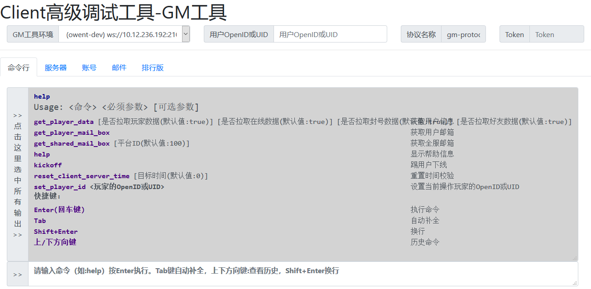
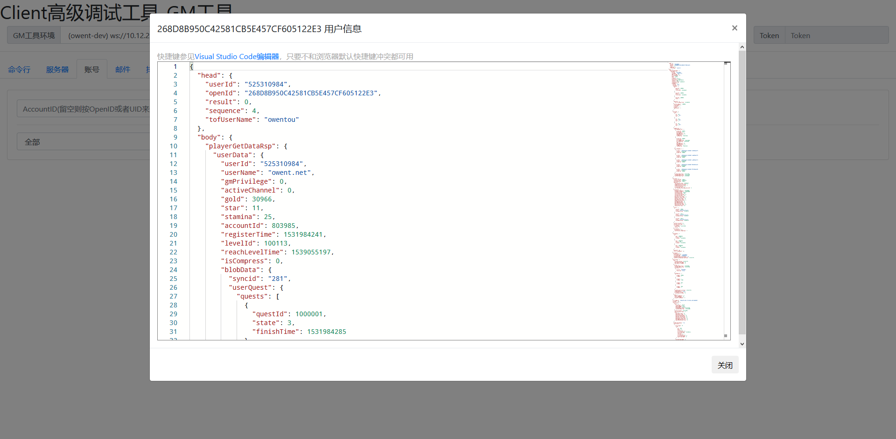

前言
------------------------------------------------

Web前端的组件技术刷新真的是日新月异，前段时间看到很多童鞋分享了[webpack][1]的使用，刚好之前做我们游戏里Web版的GM工具的时候正在想怎么用简单的方式，做模块分离并且又不需要引入重量级的第三方库或组件，也不需要太繁琐的流程（毕竟只是个小工具）。

我们的Web版GM工具长差不多这个样子，全静态页面。





因为分成了好几个模块，然后由于用的是bootstrap的。上面的Tab和下面的内容还有处理逻辑的函数都分了三大块，在不同的位置。在内容持续增加以后，全都写在一个html里太不方便了，而如果走ajax加载，调试和本地编辑都挺麻烦。

安装[webpack][1]
------------------------------------------------

安装[webpack][1]比较简单，直接走[npm][2]命令即可。

```bash
npm install webpack webpack-cli --save-dev
```

当然如果想要换源或者用 **tnpm** 或者[cnpm][3]，把上面的[npm][2]命令替换一下就行了。

后面的很多组件都涉及 [webpack][1] 的支持包，也都是需要额外安装的。

自动适配浏览器的ES6支持: [babel][4]
------------------------------------------------

现在ES版本很高了，开启一些新特性的支持试很爽的，但是浏览器兼容性怎么办呢？上 [babel][4]。当然还得加上 [webpack][1] 支持。

```bash
npm install babel-core babel-loader babel-preset-env --save-dev
```

还可以加上VSCode的提示tags支持。

```bash
npm install @babel/core @babel/preset-env --save
```

然后 [webpack][1] 模具哎规则里加上:

```js
{
    test: /\.js$/,
    exclude: /(node_modules|bower_components)/,
    use: {
        loader: 'babel-loader',
        options: {
            presets: ['env']
        }
    }
}
```

sass、css支持
------------------------------------------------

为了可以方便地使用css，可以加入 [sass][6] 或者 [less][5] 支持，我这里加入了 [sass][6] 支持。然后再加上原本的css模块。

```bash
npm install css-loader sass-loader style-loader node-sass --save-dev
```

然后 [webpack][1] 模具哎规则里加上:

```js
{
    test: /\.css$/,
    use: ['vue-style-loader', 'style-loader', 'css-loader']
},
{
    test: /\.scss$/,
    use: [
        "vue-style-loader", // Vue支持，后面会提到
        "style-loader", // creates style nodes from JS strings
        "css-loader", // translates CSS into CommonJS
        "sass-loader" // compiles Sass to CSS, using Node Sass by default
    ]
},
{
    test: /\.sass$/,
    use: [
        'vue-style-loader', // Vue支持，后面会提到
        "style-loader",
        'css-loader',
        {
            loader: 'sass-loader',
            options: {
                indentedSyntax: true
            }
        }
    ]
}
```

Vue模板
------------------------------------------------

我的GM工具中使用Vue做模板引擎，前面有提到Vue模板引擎的支持。首先也是安装基础库的支持库。

```bash
npm install vue --save
npm install vue-loader --save-dev
```

不过其实我没有使用 **vue-loader** 来提供.vue后缀的支持。感觉这种方式局限性比较高。我用的是运行时编译的版本，而 [vue][7] 对 [webpack][1] 文档里支持方式是只导入了runtime，没有导入编译库，所以这里初始化流程会麻烦一些。当然如果开 .vue 支持的话可以加规则:

```js
{
    test: /\.vue$/,
    loader: 'vue-loader'
}
```

插件初始化里要使用完整版本的Vue:

```js
{
  // 。。。
  plugins: [
    new webpack.ProvidePlugin({
      Vue: ['vue/dist/vue.esm.js', 'default']
    }),
    // new VueLoaderPlugin() //开 .vue 支持的话加这一行
  ]
}
```

HTML模板引擎和ejs
------------------------------------------------

[webpack][1] 默认是对js打包的，但是如果能在编译期对html打包才能满足我们GM工具的模块化的需求。其实有很多模板引擎增加了对 [webpack][1] 的支持，而我之前用过一些 [ejs][8] ，比较轻量级，功能也足够，所以我还是用了 [ejs][8] 作为模板系统。 另外要让 [webpack][1] 支持对html打包，还需要 **html-webpack-plugin** 插件:

```bash
npm install html-webpack-plugin ejs-loader ejs-webpack-loader --save-dev
```

这里要注意下 [webpack][1] 的版本，这里的插件对不同大版本的 [webpack][1] 可能不同。
接下来仍然是注册规则:

```js
{
    test: /\.ejs$/,
    use: ['ejs-webpack-loader']
}
```

然后初始化:

```js
{
  plugins: [
    new HtmlWebpackPlugin({
      template: '!!ejs-webpack-loader!./src/index.ejs',
      inject: 'body'
    })
  ]
}
```

额外组件： bootstrap、jquery、moment
------------------------------------------------

[bootstrap][9] 、 [jquery][10] 、 [moment][11] 是前端页面用到的，然后 [bootstrap][9] 还依赖 [popper.js][12] 。

先安装依赖:

```bash
npm install bootstrap jquery moment popper.js --save
```

接下来就比较特殊了，因为 [webpack][1] 走的是和 node.js 一样的模块隔离，像上面的这些库是需要写入全局命名空间的，所以还需要初始化的时候导入一下:

```js
{
  plugins: [
    new webpack.ProvidePlugin({
      moment: "moment",
      $: "jquery",
      jQuery: "jquery"
    })
  ]
}
```

集成VSCode: monaco-editor 和 typescript 支持
------------------------------------------------

我们GM工具里内嵌了VSCode的编辑器内核 [monaco-editor][13] ，在通用信息查看编辑和diff上还是很有用的。然后由于 [monaco-editor][13] 依赖 [typescript][14] 就顺便把 [typescript][14] 也导入进来了。

安装脚本:

```bash
npm install monaco-editor --save
npm install monaco-editor-webpack-plugin typescript vue-ts-loader --save-dev # 顺便安装 vue-ts-loader
```

规则配置:

```js
{
  test: /\.tsx?$/,
  use: ['vue-ts-loader']
}
```

插件配置:

```js
{
  plugins: [
    new MonacoWebpackPlugin()
  ]
}
```

最终配置和编译运行
------------------------------------------------
最终的配置其实还包含一些细节的目录结构、环境信息和构建选项。我们GM工具最终的 ```webpack.config.js``` 文件如下:

```js
const webpack = require('webpack');
const HtmlWebpackPlugin = require('html-webpack-plugin');
// const VueLoaderPlugin = require('vue-loader/lib/plugin');
const MonacoWebpackPlugin = require('monaco-editor-webpack-plugin');

module.exports = {
    // mode: 'development', //'mode' option to 'development' or 'production'
    entry: './src/js/main.js',
    output: {
        path: __dirname + '/dist/',
        filename: 'bundle.js'
    },
    devServer: {
        inline: false,
        contentBase: "./dist",
    },
    devtool: "cheap-module-source-map",
    module: {
        rules: [{
                test: /\.ejs$/,
                use: ['ejs-webpack-loader']
            },
            {
                test: /\.js$/,
                exclude: /(node_modules|bower_components)/,
                use: {
                    loader: 'babel-loader',
                    options: {
                        presets: ['env']
                    }
                }
            },
            {
                test: /\.tsx?$/,
                use: ['vue-ts-loader']
            },
            {
                test: /\.css$/,
                use: ['vue-style-loader', 'style-loader', 'css-loader']
            },
            {
                test: /\.scss$/,
                use: [
                    "vue-style-loader",
                    "style-loader", // creates style nodes from JS strings
                    "css-loader", // translates CSS into CommonJS
                    "sass-loader" // compiles Sass to CSS, using Node Sass by default
                ]
            },
            {
                test: /\.sass$/,
                use: [
                    'vue-style-loader',
                    "style-loader",
                    'css-loader',
                    {
                        loader: 'sass-loader',
                        options: {
                            indentedSyntax: true
                        }
                    }
                ]
            },
            // all files with a `.ts` or `.tsx` extension will be handled by `ts-loader`
            {
                test: /\.vue$/,
                loader: 'vue-loader'
            }
        ]
    },
    plugins: [
        new webpack.ProvidePlugin({
            moment: "moment",
            $: "jquery",
            jQuery: "jquery",
            Vue: ['vue/dist/vue.esm.js', 'default']
        }),
        // new VueLoaderPlugin(),
        new HtmlWebpackPlugin({
            template: '!!ejs-webpack-loader!./src/index.ejs',
            inject: 'body'
        }),
        new MonacoWebpackPlugin()
    ]
}
```

typescript配置文件 ```tsconfig.json``` 的配置如下：

```json
{
    "compilerOptions": {
        "target": "es5",
        "module": "es2015",
        "moduleResolution": "node",
        "declaration": false,
        "noImplicitAny": true,
        "removeComments": true,
        "preserveConstEnums": true,
        "emitDecoratorMetadata": true,
        "experimentalDecorators": true,
        "sourceMap": true,
        "typeRoots": [
            "node_modules/@types"
        ],
        "lib": [
            "es2017",
            "dom"
        ]
    },
    "include": [
        "src/**/*"
    ],
    "exclude": [
        "node_modules"
    ]
}
```

然后 ```package.json``` 里增加了脚本命令:

```json
{
  "scripts": {
    "dev": "webpack --mode development",
    "build": "webpack --mode production"
  }
}
```

最后，编译打包的时候只要运行 ```npm run dev``` 或 ```npm run build``` 就可以了。

[1]: https://webpack.js.org/
[2]: https://www.npmjs.com/
[3]: https://cnpmjs.org/
[4]: https://babeljs.io/
[5]: http://lesscss.org/
[6]: https://sass-lang.com/
[7]: https://vuejs.org/
[8]: http://www.embeddedjs.com/
[9]: http://getbootstrap.com/
[10]: http://jquery.com/
[11]: http://momentjs.com/
[12]: https://popper.js.org/
[13]: https://microsoft.github.io/monaco-editor/
[14]: https://www.typescriptlang.org/
