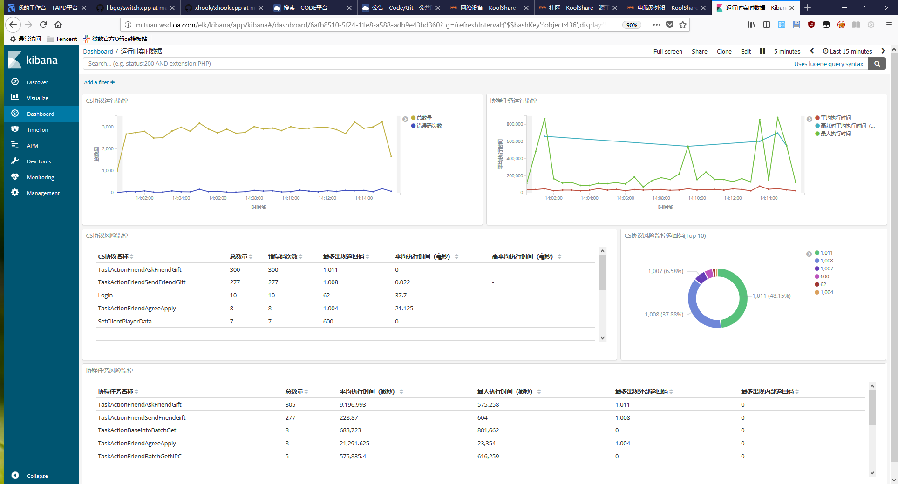

什么是ELK？
------------
ELK 是 [elasticsearch][1] + [logstash][2] + [kibana][3]的缩写。这一套是现在比较流行的日志全文索引系统了。我之前的项目也有用它来做过日志分析，这次主要是拿来搭建开发测试环境的监控和分析系统，顺带记录一下部署脚本和流程。

其中 [elasticsearch][1] 是日志索引系统，我按两个master，3个数据和处理节点来部署。 [logstash][2] 和 [kibana][3] 因为是开发测试环境使用，量级不大，所以只部署了一个节点。但是在使用过程中发现 [elasticsearch][1] 在jre的GC的时候还是有较长时间的 ***Stop The World*** 的问题，而且这期间的数据会倍丢弃。所以为了缓解这个状况，又引入了 [redis][4] 作为消息队列使用。然后使用两组pipeline，一个从 client -> [logstash][2] -> [redis][4] ，另一个从 [redis][4] -> [logstash][2] -> [elasticsearch][1] 来传输。这样如果在 [elasticsearch][1] GC的 ***Stop The World*** 结束的时候会把数据补回去。 外面更大型的部署也有用 [kafka][5] 或者更进一步优化的 [pulsar][6]。不过我们目前的应用也不太需要 [kafka][5] 和 [pulsar][6] 那种数据落地和强一致性，使用 [redis][4] 也已经够了。

后面的脚本都已 6.4.2 为准，因为最后一次更新多节点部署的脚本是基于 6.4.2 的。而且这个版本 x-pack 内置进 [elasticsearch][1] 了，也能省了 x-pack 的部署和基础版的License。

节点部署
------------

首先要准备好部署的包: jdk-8u181-linux-x64.rpm 、 elasticsearch-6.4.2.tar.gz 、 logstash-6.4.2.tar.gz 、 kibana-6.4.2-linux-x86_64.tar.gz 。

先贴整体结构图，后面的脚本和配置模板比较长。


### elasticsearch 集群部署
然后是我复制出来的init.d的启动脚本模板 (init.d/elasticsearch.template)

```bash
#!/bin/bash
#
# elasticsearch <summary>
#
# chkconfig:   2345 80 20
# description: Starts and stops a single elasticsearch instance on this system
#

### BEGIN INIT INFO
# Provides: Elasticsearch
# Required-Start: $network $named
# Required-Stop: $network $named
# Default-Start: 2 3 4 5
# Default-Stop: 0 1 6
# Short-Description: This service manages the elasticsearch daemon
# Description: Elasticsearch is a very scalable, schema-free and high-performance search solution supporting multi-tenancy and near realtime search.
### END INIT INFO

#
# init.d / servicectl compatibility (openSUSE)
#
if [ -f /etc/rc.status ]; then
    . /etc/rc.status
    rc_reset
fi

#
# Source function library.
#
if [ -f /etc/rc.d/init.d/functions ]; then
    . /etc/rc.d/init.d/functions
fi

# Sets the default values for elasticsearch variables used in this script
ES_HOME="%TEMPLATE_VAR_ELK_HOME%/elasticsearch"
MAX_OPEN_FILES=65536
MAX_MAP_COUNT=262144
ES_PATH_CONF="$ES_HOME/config"

PID_DIR="%TEMPLATE_VAR_ELK_HOME%/run"

# Source the default env file
ES_ENV_FILE="/etc/sysconfig/elasticsearch"
if [ -f "$ES_ENV_FILE" ]; then
    . "$ES_ENV_FILE"
fi

# ES_USER and ES_GROUP settings were removed
if [ ! -z "$ES_USER" ] || [ ! -z "$ES_GROUP" ]; then
    echo "ES_USER and ES_GROUP settings are no longer supported. To run as a custom user/group use the archive distribution of Elasticsearch."
    exit 1
fi

exec="$ES_HOME/bin/elasticsearch"
prog="elasticsearch"
pidfile="$PID_DIR/${prog}.pid"

export ES_JAVA_OPTS
export JAVA_HOME
export ES_PATH_CONF
export ES_STARTUP_SLEEP_TIME
export ES_HEAP_SIZE

lockfile=%TEMPLATE_VAR_ELK_DATA%/lock/$prog.lock

if [ ! -x "$exec" ]; then
    echo "The elasticsearch startup script does not exists or it is not executable, tried: $exec"
    exit 1
fi

checkJava() {
    if [ -x "$JAVA_HOME/bin/java" ]; then
        JAVA="$JAVA_HOME/bin/java"
    else
        JAVA=`which java`
    fi

    if [ ! -x "$JAVA" ]; then
        echo "Could not find any executable java binary. Please install java in your PATH or set JAVA_HOME"
        exit 1
    fi
}

start() {
    checkJava
    [ -x $exec ] || exit 5

    if [ -n "$MAX_OPEN_FILES" ]; then
        ulimit -n $MAX_OPEN_FILES
    fi
    # if [ -n "$MAX_LOCKED_MEMORY" ]; then
    #     ulimit -l $MAX_LOCKED_MEMORY
    # fi
    if [ -n "$MAX_MAP_COUNT" -a -f /proc/sys/vm/max_map_count ]; then
        sysctl -q -w vm.max_map_count=$MAX_MAP_COUNT
    fi

    # Ensure that the PID_DIR exists (it is cleaned at OS startup time)
    if [ -n "$PID_DIR" ] && [ ! -e "$PID_DIR" ]; then
        mkdir -p "$PID_DIR" && chown %TEMPLATE_VAR_ELK_USER%:%TEMPLATE_VAR_ELK_GROUP% "$PID_DIR"
    fi
    if [ -n "$pidfile" ] && [ ! -e "$pidfile" ]; then
        touch "$pidfile" && chown %TEMPLATE_VAR_ELK_USER%:%TEMPLATE_VAR_ELK_GROUP% "$pidfile"
    fi

    cd $ES_HOME
    echo -n $"Starting $prog: "
    # if not running, start it up here, usually something like "daemon $exec"
    daemon --user %TEMPLATE_VAR_ELK_USER% --pidfile $pidfile $exec -p $pidfile -d
    retval=$?
    echo
    [ $retval -eq 0 ] && touch $lockfile
    return $retval
}

stop() {
    echo -n $"Stopping $prog: "
    # stop it here, often "killproc $prog"
    killproc -p $pidfile -d 86400 $prog
    retval=$?
    echo
    [ $retval -eq 0 ] && rm -f $lockfile
    return $retval
}

restart() {
    stop
    start
}

reload() {
    restart
}

force_reload() {
    restart
}

rh_status() {
    # run checks to determine if the service is running or use generic status
    status -p $pidfile $prog
}

rh_status_q() {
    rh_status >/dev/null 2>&1
}


case "$1" in
    start)
        rh_status_q && exit 0
        $1
        ;;
    stop)
        rh_status_q || exit 0
        $1
        ;;
    restart)
        $1
        ;;
    reload)
        rh_status_q || exit 7
        $1
        ;;
    force-reload)
        force_reload
        ;;
    status)
        rh_status
        ;;
    condrestart|try-restart)
        rh_status_q || exit 0
        restart
        ;;
    *)
        echo $"Usage: $0 {start|stop|status|restart|condrestart|try-restart|reload|force-reload}"
        exit 2
esac
exit $?
```

如果是使用systemd的话就不需要上面那个，要另外写个守护服务配置模板和环境配置模板 (sysconfig/elasticsearch.template):
```bash
################################
# Elasticsearch
################################

ES_HEAP_SIZE=%TEMPLATE_VAR_ELK_ELASTICSEARCH_USE_MEMORY%

# Elasticsearch home directory
ES_HOME=%TEMPLATE_VAR_ELK_HOME%/elasticsearch

# Elasticsearch Java path
#JAVA_HOME=

# Elasticsearch configuration directory
ES_PATH_CONF=%TEMPLATE_VAR_ELK_HOME%/elasticsearch/config

# Elasticsearch PID directory
PID_DIR=%TEMPLATE_VAR_ELK_HOME%/run

# Additional Java OPTS
#ES_JAVA_OPTS=

# Configure restart on package upgrade (true, every other setting will lead to not restarting)
#RESTART_ON_UPGRADE=true

################################
# Elasticsearch service
################################

# SysV init.d
#
# The number of seconds to wait before checking if Elasticsearch started successfully as a daemon process
ES_STARTUP_SLEEP_TIME=%TEMPLATE_VAR_ELK_STARTUP_SLEEP%

################################
# System properties
################################

# Specifies the maximum file descriptor number that can be opened by this process
# When using Systemd, this setting is ignored and the LimitNOFILE defined in
# /usr/lib/systemd/system/elasticsearch.service takes precedence
#MAX_OPEN_FILES=65536

# The maximum number of bytes of memory that may be locked into RAM
# Set to "unlimited" if you use the 'bootstrap.memory_lock: true' option
# in elasticsearch.yml.
# When using systemd, LimitMEMLOCK must be set in a unit file such as
# /etc/systemd/system/elasticsearch.service.d/override.conf.
#MAX_LOCKED_MEMORY=unlimited

# Maximum number of VMA (Virtual Memory Areas) a process can own
# When using Systemd, this setting is ignored and the 'vm.max_map_count'
# property is set at boot time in /usr/lib/sysctl.d/elasticsearch.conf
#MAX_MAP_COUNT=262144
```

[elasticsearch][1] 的部署脚本分几个文件，其中配置文件(deploy-conf.sh)如下(里面也包含了一下依赖包):
```bash
#!/bin/bash

USER=执行用户;
GROUP=执行组;

ELK_CLUSTER_NAME="集群名称" ;
ELK_CLUSTER_MASTER=("主节点1-IP" "主节点2-IP") ;
ELK_CLUSTER_PASSWORD="集群密码"
ELK_ELASTICSEARCH_PKG_NAME="elasticsearch-6.4.2";
ELK_ELASTICSEARCH_PORT=9200;
ELK_ELASTICSEARCH_SLEEP_SEC=5;

JAVA_JDK_RPM=jdk-8u181-linux-x64.rpm ;

DATA_DIR=$(df -h | grep "\\/data" | awk '{print $6}');   # 数据盘挂在 /data*
HOME_DIR=$(cat /etc/passwd | grep $USER | cut -d: -f 6);
ELK_HOME_DIR="$HOME_DIR/elk";
ELK_DATA_DIR="$DATA_DIR/elk";

function is_elk_master() {
    for host_node in ${ELK_CLUSTER_MASTER[@]}; do
        if [ "$1" == "$host_node" ]; then
            echo "true";
            return;
        fi
    done
    echo "false";
}

function get_discovery_unicast() {
    RET="";
    for host in ${ELK_CLUSTER_MASTER[@]}; do
        if [ -z "$RET" ]; then
            RET="\"$host\"";
        else
            RET="$RET, \"$host\"";
        fi
    done

    echo "[$RET]";
}

function wait_for_elasticsearch_startup() {
    ELK_ELASTICSEARCH_WAIT_SEC=$(($ELK_ELASTICSEARCH_SLEEP_SEC+5));
    printf "Wait for elasticsearch startup ($ELK_ELASTICSEARCH_WAIT_SEC seconds) ";
    for ((i=0;i<$ELK_ELASTICSEARCH_WAIT_SEC;++i)); do
        printf ".";
        sleep 1;
    done
    echo "";
}
```

然后是部署机用的脚本(deploy-remote.sh)，这个脚本每个机器IP执行一次，要确保有权限:
```bash
#!/bin/bash

if [ $# -lt 2 ]; then
    echo "Usage: $0 <ip> <use memory>";
    exit 1;
fi

REMOTE_IP=$1;
USE_MEMORY=$2;

ssh 用户名@$REMOTE_IP "echo \"PWD=\$PWD\" && echo \"HOME=\$HOME\" && mkdir -p \$HOME/elk";
scp jdk-8u181-linux-x64.rpm *.tar.gz *.sh init.d sysconfig "用户名@$REMOTE_IP:/HOME目录/elk/";

ssh owentou@$REMOTE_IP "echo \"PWD=\$PWD\" && echo \"HOME=\$HOME\" && cd \$HOME/elk && chmod +x *.sh && sudo ./deploy.sh $REMOTE_IP $USE_MEMORY";
```

然后是目标机上执行的脚本(deploy.sh)，要注意防火墙要额外开一下:
```bash
#!/bin/bash

export PATH=$PATH:/sbin;

if [ $# -lt 2 ]; then
    echo "Usage: $0 <ip> <use memory>";
    exit 1;
fi

BIND_IP=$1;
USE_MEMORY=$2;

SCRIPT_DIR="$(cd $(dirname $0) && pwd)";
source "$SCRIPT_DIR/deploy-conf.sh";

mkdir -p $ELK_DATA_DIR/lock;
mkdir -p $ELK_DATA_DIR/elasticsearch/data;
mkdir -p $ELK_DATA_DIR/elasticsearch/logs;
mkdir -p $ELK_DATA_DIR/dump/data;
mkdir -p $ELK_DATA_DIR/dump/logs;

mkdir -p $ELK_HOME_DIR/lock;
mkdir -p $ELK_HOME_DIR/run;

# ====================== install java8 ======================
rpm -Uvh $SCRIPT_DIR/$JAVA_JDK_RPM;
if [ 0 -ne $? ]; then
    rpm -ivh $SCRIPT_DIR/$JAVA_JDK_RPM;
fi

alternatives --auto java 2>&1;
alternatives --display java 2>&1;
# alternatives --config java 2>&1;

# ====================== unpack elasticsearch ======================
cd "$ELK_HOME_DIR";

if [ ! -e "$ELK_ELASTICSEARCH_PKG_NAME" ]; then
    tar -axvf "$SCRIPT_DIR/$ELK_ELASTICSEARCH_PKG_NAME.tar.gz";
fi

if [ -e elasticsearch ] && [ -e "$PWD/$ELK_ELASTICSEARCH_PKG_NAME" ]; then
    rm -f elasticsearch;
fi
ln -sf "$PWD/$ELK_ELASTICSEARCH_PKG_NAME" elasticsearch;

# ====================== setup scripts ======================
# TEMPLATE_VAR_ELK_HOME, TEMPLATE_VAR_ELK_ELASTICSEARCH_USE_MEMORY, TEMPLATE_VAR_ELK_STARTUP_SLEEP, TEMPLATE_VAR_ELK_DATA, TEMPLATE_VAR_ELK_USER, TEMPLATE_VAR_ELK_GROUP
cp -f "$SCRIPT_DIR/init.d/elasticsearch.template" /etc/init.d/elasticsearch;   # ************ 如果使用systemd的话这里换成systemd的模板 ************
cp -f "$SCRIPT_DIR/sysconfig/elasticsearch.template" /etc/sysconfig/elasticsearch;

perl -p -i -e "s;\\%TEMPLATE_VAR_ELK_ELASTICSEARCH_USE_MEMORY\\%;$USE_MEMORY;g" /etc/sysconfig/elasticsearch;
perl -p -i -e "s;\\%TEMPLATE_VAR_ELK_HOME\\%;$ELK_HOME_DIR;g" /etc/sysconfig/elasticsearch;
perl -p -i -e "s;\\%TEMPLATE_VAR_ELK_STARTUP_SLEEP\\%;$ELK_ELASTICSEARCH_SLEEP_SEC;g" /etc/sysconfig/elasticsearch;

if [ -e /etc/sysconfig/elasticsearch.bak ]; then
    rm -f /etc/sysconfig/elasticsearch.bak;
fi

# ************ 如果使用systemd的话这里换成systemd的模板 ************
perl -p -i -e "s;\\%TEMPLATE_VAR_ELK_HOME\\%;$ELK_HOME_DIR;g" /etc/init.d/elasticsearch;
perl -p -i -e "s;\\%TEMPLATE_VAR_ELK_DATA\\%;$ELK_DATA_DIR;g" /etc/init.d/elasticsearch;
perl -p -i -e "s;\\%TEMPLATE_VAR_ELK_USER\\%;$USER;g" /etc/init.d/elasticsearch;
perl -p -i -e "s;\\%TEMPLATE_VAR_ELK_GROUP\\%;$GROUP;g" /etc/init.d/elasticsearch;

if [ -e /etc/init.d/elasticsearch.bak ]; then
    rm -f /etc/init.d/elasticsearch.bak;
fi

# ====================== setup configs ======================
# $ELK_HOME_DIR/elasticsearch/config/jvm.options
# -Xms$USE_MEMORY, -Xmx$USE_MEMORY
perl -p -i -e "s;\\bXms[0-9a-zA-Z]*\\b;Xms$USE_MEMORY;g" $ELK_HOME_DIR/elasticsearch/config/jvm.options;
perl -p -i -e "s;\\bXmx[0-9a-zA-Z]*\\b;Xmx$USE_MEMORY;g" $ELK_HOME_DIR/elasticsearch/config/jvm.options;
sed -i "/GC\\s*configuration/a -XX:MaxGCPauseMillis=1000" $ELK_HOME_DIR/elasticsearch/config/jvm.options;
sed -i "/GC\\s*configuration/a -XX:+UseG1GC" $ELK_HOME_DIR/elasticsearch/config/jvm.options;
perl -p -i -e "s;\\-XX:\\+UseConcMarkSweepGC;# -XX:+UseConcMarkSweepGC;g" $ELK_HOME_DIR/elasticsearch/config/jvm.options;
perl -p -i -e "s;\\-XX:CMSInitiatingOccupancyFraction;# -XX:CMSInitiatingOccupancyFraction;g" $ELK_HOME_DIR/elasticsearch/config/jvm.options;
perl -p -i -e "s;\\-XX:\\+UseCMSInitiatingOccupancyOnly;# -XX:+UseCMSInitiatingOccupancyOnly;g" $ELK_HOME_DIR/elasticsearch/config/jvm.options;
perl -p -i -e "s;\\-XX:HeapDumpPath=[^\\r\\n]*;-XX:HeapDumpPath=$ELK_DATA_DIR/dump/data;g" $ELK_HOME_DIR/elasticsearch/config/jvm.options;
perl -p -i -e "s;\\-XX:ErrorFile=[^\\r\\n]*;-XX:ErrorFile=$ELK_DATA_DIR/dump/logs/hs_err_pid%p.log;g" $ELK_HOME_DIR/elasticsearch/config/jvm.options;

# $ELK_HOME_DIR/elasticsearch/config/elasticsearch.yml
# cluster.name: $ELK_CLUSTER_NAME
perl -p -i -e "s;(\\#\\s*)?cluster\\s*.\\s*name:\\s*.*;cluster.name: \"$ELK_CLUSTER_NAME\";g" $ELK_HOME_DIR/elasticsearch/config/elasticsearch.yml;

# node.name: "app-node-$BIND_IP"
perl -p -i -e "s;(\\#\\s*)?node\\s*.\\s*name:\\s*.*;node.name: \"app-node-$BIND_IP:$ELK_ELASTICSEARCH_PORT\";g" $ELK_HOME_DIR/elasticsearch/config/elasticsearch.yml;

# # @see https://www.elastic.co/guide/en/elasticsearch/reference/current/modules-node.html
# node.master: $(is_elk_master $BIND_IP)
# node.data: true
# node.ingest: true
# search.remote.connect: true
sed -i "/node\\s*.\\s*master/d" $ELK_HOME_DIR/elasticsearch/config/elasticsearch.yml;
sed -i "/node\\s*.\\s*data/d" $ELK_HOME_DIR/elasticsearch/config/elasticsearch.yml;
sed -i "/node\\s*.\\s*ingest/d" $ELK_HOME_DIR/elasticsearch/config/elasticsearch.yml;
sed -i "/search\\s*.\\s*remote\\s*.\\s*connect/d" $ELK_HOME_DIR/elasticsearch/config/elasticsearch.yml;
sed -i "/node\\s*.\\s*name/a search.remote.connect: true" $ELK_HOME_DIR/elasticsearch/config/elasticsearch.yml;
sed -i "/node\\s*.\\s*name/a node.ingest: true" $ELK_HOME_DIR/elasticsearch/config/elasticsearch.yml;
sed -i "/node\\s*.\\s*name/a node.data: true" $ELK_HOME_DIR/elasticsearch/config/elasticsearch.yml;
sed -i "/node\\s*.\\s*name/a node.master: $(is_elk_master $BIND_IP)" $ELK_HOME_DIR/elasticsearch/config/elasticsearch.yml;

# path.data: $ELK_DATA_DIR/elasticsearch/data
perl -p -i -e "s;(\\#\\s*)?path\\s*.\\s*data:\\s*.*;path.data: $ELK_DATA_DIR/elasticsearch/data;g" $ELK_HOME_DIR/elasticsearch/config/elasticsearch.yml;

# path.logs: $ELK_DATA_DIR/elasticsearch/logs
perl -p -i -e "s;(\\#\\s*)?path\\s*.\\s*logs:\\s*.*;path.logs: $ELK_DATA_DIR/elasticsearch/logs;g" $ELK_HOME_DIR/elasticsearch/config/elasticsearch.yml;

# network.host: $BIND_IP
perl -p -i -e "s;(\\#\\s*)?network\\s*.\\s*host:\\s*.*;network.host: $BIND_IP;g" $ELK_HOME_DIR/elasticsearch/config/elasticsearch.yml;

# network.bind_host: ["$BIND_IP"]
sed -i "/network\\s*.\\s*bind_host/d" $ELK_HOME_DIR/elasticsearch/config/elasticsearch.yml;
sed -i "/network\\s*.\\s*host/a network.bind_host: [\"$BIND_IP\"]" $ELK_HOME_DIR/elasticsearch/config/elasticsearch.yml;

# http.port: $ELK_ELASTICSEARCH_PORT
perl -p -i -e "s;(\\#\\s*)?http\\s*.\\s*port:\\s*.*;http.port: $ELK_ELASTICSEARCH_PORT;g" $ELK_HOME_DIR/elasticsearch/config/elasticsearch.yml;

# discovery.zen.ping.unicast.hosts: $(get_discovery_unicast)
perl -p -i -e "s;(\\#\\s*)?discovery\\s*.\\s*zen\\s*.\\s*ping\\s*.\\s*unicast\\s*.\\s*hosts:\\s*.*;discovery.zen.ping.unicast.hosts: $(get_discovery_unicast);g" $ELK_HOME_DIR/elasticsearch/config/elasticsearch.yml;

# bootstrap.system_call_filter: false
sed -i "/bootstrap\\s*.\\s*system_call_filter/d" $ELK_HOME_DIR/elasticsearch/config/elasticsearch.yml;
echo "bootstrap.system_call_filter: false" >> $ELK_HOME_DIR/elasticsearch/config/elasticsearch.yml;

# xpack.security.enabled: false 
# 使用非HTTPS接口必须关闭安全模块
sed -i "/xpack\\s*.\\s*security\\s*.\\s*enabled/d" $ELK_HOME_DIR/elasticsearch/config/elasticsearch.yml;
echo "xpack.security.enabled: false" >> $ELK_HOME_DIR/elasticsearch/config/elasticsearch.yml;

# ====================== setup x-pack ======================
chown $USER:$GROUP -R $ELK_DATA_DIR;
chown $USER:$GROUP -R $ELK_HOME_DIR;

# ************ 如果使用systemd的话这里换成systemd的启动脚本 ************
chmod +x /etc/init.d/elasticsearch;
/etc/init.d/elasticsearch start;

wait_for_elasticsearch_startup;
echo "cd elasticsearch && bin/elasticsearch-setup-passwords interactive";

# elastic, kibana, and logstash_system users
cd elasticsearch && bin/elasticsearch-setup-passwords interactive;
cd -;

# 这里会需要手动输密码，请务必填成和 ELK_CLUSTER_PASSWORD 配置的一样，一遍后面检查API

# test users
curl -u elastic:$ELK_CLUSTER_PASSWORD "http://$BIND_IP:$ELK_ELASTICSEARCH_PORT";
curl -u kibana:$ELK_CLUSTER_PASSWORD "http://$BIND_IP:$ELK_ELASTICSEARCH_PORT";
curl -u logstash_system:$ELK_CLUSTER_PASSWORD "http://$BIND_IP:$ELK_ELASTICSEARCH_PORT";
# curl -u elastic:$ELK_CLUSTER_PASSWORD "http://$BIND_IP:$ELK_ELASTICSEARCH_PORT/_xpack/security/user/<username>/_password" ;

# ====================== setup chkconfig ======================
# ************ 如果使用systemd的话这里换成systemd的启动脚本 ************
chkconfig --add elasticsearch ;
/etc/init.d/elasticsearch restart ;
wait_for_elasticsearch_startup;

# ====================== check license ======================
# curl -u elastic:$ELK_CLUSTER_PASSWORD "http://$BIND_IP:$ELK_ELASTICSEARCH_PORT/_xpack/license";
```

以上，就可以比较方便地部署 [elasticsearch][1]的多节点集群了。

### logstash 部署

然后需要对日志采集做部署，[redis][4] 部署就补贴了，比较简单。单节点没写部署脚本，直接贴我的配置吧:

主配置: config/logstash.yml

```yaml
node.name: logstash节点名称
path.data: 数据目录

http.host: "监听IP"
http.port: 9670-9700

log.level: info
path.logs: "日志目录"

# ------------ X-Pack Settings (not applicable for OSS build)--------------
#
# X-Pack Monitoring
# https://www.elastic.co/guide/en/logstash/current/monitoring-logstash.html
xpack.monitoring.enabled: true
xpack.monitoring.elasticsearch.url: ["http://elasticsearch主节点1-IP:9200", "http://elasticsearch主节点1-IP:9200"]
xpack.monitoring.elasticsearch.username: logstash_system
xpack.monitoring.elasticsearch.password: "密码"
#xpack.monitoring.elasticsearch.ssl.ca: [ "/path/to/ca.crt" ]
#xpack.monitoring.elasticsearch.ssl.truststore.path: path/to/file
#xpack.monitoring.elasticsearch.ssl.truststore.password: password
#xpack.monitoring.elasticsearch.ssl.keystore.path: /path/to/file
#xpack.monitoring.elasticsearch.ssl.keystore.password: password
#xpack.monitoring.elasticsearch.ssl.verification_mode: certificate
xpack.monitoring.elasticsearch.sniffing: false
#xpack.monitoring.collection.interval: 10s
#xpack.monitoring.collection.pipeline.details.enabled: true
```

pipeline入口配置: config/pipelines.yml
```yaml
- pipeline.id: app_to_redis
  pipeline.workers: 8
  queue.type: memory
  path.config: "logstash主目录/config/app_to_redis.config"

- pipeline.id: redis_to_elastic
  pipeline.workers: 8
  queue.type: memory
  path.config: "logstash主目录/config/redis_to_elasticsearch.config"
```

然后是pipeline - config/app_to_redis.config :
```
input {
    udp {
        port => 9345
        workers => 4
        codec => json {
            charset => 'UTF-8'
        }
    }
#   stdin {}  #可以从标准输入读数据
}

filter {
  #Only matched data are send to output.
  if ![log_type] { 
    drop { }
  }
  if ![log_name] {
    drop { }
  }
  if ![log_id] {
    drop { }
  }
  if [log_type] == "osslog" {
    if [log_name] not in ["只选择部分需要的日志", ""] {
      if [log_name] !~ /^CSGMCmd-.*/ {
        drop { }
      }
    }
  }

  mutate {
    add_field => { "lc_identifier" => "%{log_type}-%{log_name}-%{log_id}" } # 这里是方便后面写规则定期清理和分类
  }
  mutate {
    lowercase => [ "lc_identifier" ]
  }
}
output {
  # For detail config for redis as output,
  # See: https://www.elastic.co/guide/en/logstash/6.4/plugins-outputs-redis.html
  redis {
    port => 16379
    key => "logstash"
    data_type => "list"
  }
}
```

最后是pipeline - config/app_to_redis.config :
```
input {
    redis {
        port => 16379
        data_type => "list"
        key => "logstash"
        codec => json {
            charset => 'UTF-8'
        }
    }
#   stdin {}  #可以从标准输入读数据
}
output {
  # For detail config for elasticsearch as output,
  # See: https://www.elastic.co/guide/en/logstash/current/plugins-outputs-elasticsearch.html
  elasticsearch {
    action => "index"                                                           # The operation on ES
    hosts  => ["elasticsearch主节点1-IP:9200", "elasticsearch主节点2-IP:9200"]  # ElasticSearch host, can be array.
    index  => "applog-%{lc_identifier}-%{+YYYY.MM.dd}"                          # The index to write data to.
    user   => "logstash_system"
    password => "密码"
  }
}

```

最后加一下启动脚本就好了。

### kibana 部署

[kibana][3] 是用于集群管理的，也贴一下我的配置吧。就一个文件 config/kibana.yml

```yaml
# 监听端口
server.port: 5601
server.host: "监听地址"

# 这个用于站点的子目录是kibana的时候，比如 http://127.0.0.1/elk/kibana
server.basePath: "/elk/kibana"

# The URL of the Elasticsearch instance to use for all your queries.
elasticsearch.url: "http://elasticsearch主节点1-IP:9200"

# When this setting's value is true Kibana uses the hostname specified in the server.host
# setting. When the value of this setting is false, Kibana uses the hostname of the host
# that connects to this Kibana instance.
#elasticsearch.preserveHost: true

# Kibana uses an index in Elasticsearch to store saved searches, visualizations and
# dashboards. Kibana creates a new index if the index doesn't already exist.
kibana.index: ".kibana"

elasticsearch.username: "kibana"
elasticsearch.password: "密码"

# pidfile 要和启动脚本列的一致
pid.file: pidfile路径/kibana.pid

i18n.defaultLocale: "zh_CN"
```

也是最后加一下启动脚本就好了。

我还用了nginx做反向代理，配置如下:

```nginx
upstream elasticsearch {
    server elasticsearch主节点-IP:9200;
}

upstream kibana {
    server kibana监听地址:5601;
}

location ^~ /elk/elasticsearch {
    proxy_pass http://elasticsearch;
    rewrite ^/elk/elasticsearch(.*) $1 break;
    proxy_http_version 1.1;
    proxy_request_buffering off;
    proxy_buffering off;
    proxy_set_header  X-Real-IP  $remote_addr;
    add_header Access-Control-Allow-Origin *;

    proxy_set_header X-Real-IP $remote_addr;
    proxy_set_header Host $host;
    proxy_set_header Upgrade $http_upgrade;
    proxy_set_header Connection 'upgrade';
    proxy_set_header X-Forwarded-For $proxy_add_x_forwarded_for;
}

location ^~ /elk/kibana {
    proxy_pass http://kibana;
    rewrite ^/elk/kibana(.*) $1 break;
    proxy_http_version 1.1;
    proxy_request_buffering off;
    proxy_buffering off;
    proxy_set_header  X-Real-IP  $remote_addr;
    add_header Access-Control-Allow-Origin *;

    proxy_set_header X-Real-IP $remote_addr;
    proxy_set_header Host $host;
    proxy_set_header Upgrade $http_upgrade;
    proxy_set_header Connection 'upgrade';
    proxy_set_header X-Forwarded-For $proxy_add_x_forwarded_for;
}
```

日志接入
------------
日志接入我是用的是protobuf转json。然后用上面的UDP发送到 [logstash][2] 。这个也比较简单，就是额外多做了负载均衡支持和reload支持。不过多描述了。

定期清理(elasticsearch-curator)
------------

我们使用的方式非常的暴力，没有做太多的索引优化，[elasticsearch][1]的全文索引内存消耗爆炸高。所以用了个官方的工具 [elasticsearch-curator][7] 来定期清理掉不再需要的日志，具体使用可以见官方文档，我这里设置了清理30天以上的条目。

跪着文件: action

```yaml
---
actions:
  1:
    action: delete_indices
    description: delete_indices
    options:
      timeout_override: 300
      continue_if_exception: True
      disable_action: False
    filters:
    - filtertype: age
      source: creation_date
      direction: older
      unit: days
      unit_count: 30
    - filtertype: pattern
      kind: prefix
      value: applog-  # 这个前缀要和上面的 pipeline 里的匹配
```

连接配置文件: curator.yml

```yaml
---
client:
  hosts:
    - 主节点1-IP
    - 主节点2-IP
  port: 9200
  url_prefix:
  use_ssl: False
  certificate:
  client_cert:
  client_key:
  ssl_no_validate: False
  http_auth: ELK用户名:ELK用户密码
  timeout: 30
  master_only: False

logging:
  loglevel: INFO
  logfile:
  logformat: default
  blacklist: ['elasticsearch', 'urllib3']
```

这个工具需要python3，然后定时执行就行了。

```bash
#!/bin/bash

export LC_ALL=en_US.utf8

cd "$(dirname $0)";

curator --config curator.yml actions
```

最后Sample
------------

最后贴一张我们项目内用的图吧。



上面的图是我拿来分析项目的错误码分布和监控远程调用和任务的健康情况的（失败率、延迟之类），其实更深入的使用不止于此，比如拿来查测试账号的登入时间点和登入服务器，对开发调试非常有用。我们的验证数据上报和抓取也是靠它，甚至可以加事件脚本来做告警等等。

[1]: https://www.elastic.co/cn/products/elasticsearch
[2]: https://www.elastic.co/cn/products/logstash
[3]: https://www.elastic.co/cn/products/kibana
[4]: https://redis.io/
[5]: https://kafka.apache.org/
[6]: https://pulsar.apache.org/
[7]: https://www.elastic.co/guide/en/elasticsearch/client/curator/current/index.html