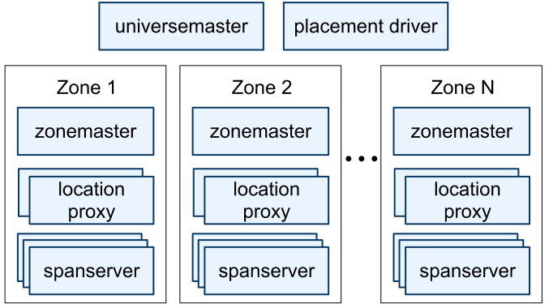
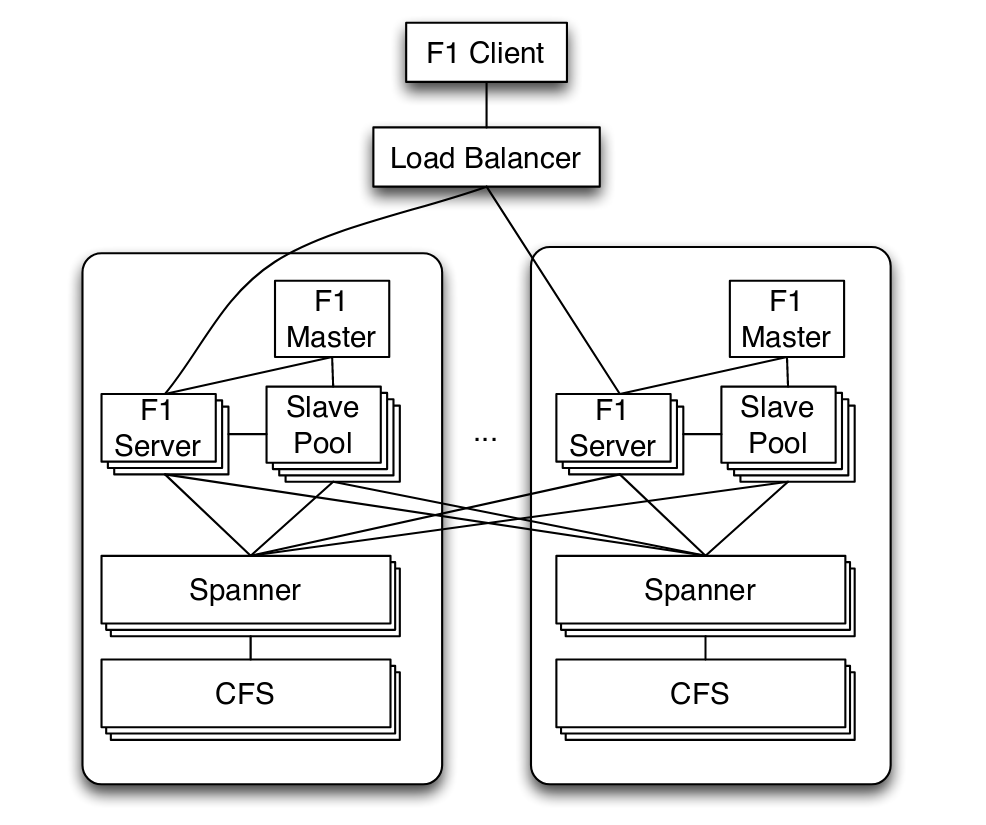

前言
================================================

之前看过 [《大规模分布式存储系统：原理解析与架构实战》][1] ，这个系统设计还是挺有意思的，里面提及了Google的一整套系统都有论文，而且现在已经进化到下一代支持分布式跨行事务的关系型数据库系统了。所以一直很想抽时间看看Google的那套去中心化并且可以平行扩容的分布式系统和数据库的论文。之前一些计划中的我自己的项目的优化项都差不多完成了，这段时间就陆陆续续的看完了这三篇Paper，可怜我的渣渣英语，所以看得比较慢。

Google的分布式系统基础组件的层层迭代真的是做的很好。在假定所有节点都可能出故障,并且任何节点出故障都不影响可用性的基础上，先是实现了分布式PB
级别的文件系统 **GFS**[^gfs] 。然后在此基础上，实现了支持海量数据、支持单行原子操作、支持自动按列分组和分片并且跨数据中心最终一致性保证的KV存储系统 **Bigtable**[^bigtable] 。而我准备看的这三篇文章分别是：基于 **Bigtable**[^bigtable] 的分布式增量事务和通知系统 **Percolator**[^percolator] 、保证强一致性并且支持分布式事务和跨行事务的的大规模关系型分布式数据库系统 **Spanner**[^spanner] 和其前端 **F1**[^f1] ，还支持OLTP和OLAP。上面所有的分布式系统都基于更早前实现的基于 **Paxos**[^paxos] 算法的分布式锁服务 **Chubby**[^chubby]。

现在业界也很多基于这些理论并在其上进行优化的数据库项目，比较知名的比如阿里的 [PolarDB][4] 和 [pingcap][2] 的 [TiDB][3] 。

Percolator[^percolator]
================================================

**Large-scale Incremental Processing Using Distributed Transactions and Notifications** ，系统名字叫 **Percolator**[^percolator] 。其实是为了提升Google的搜索引擎索引系统效率而存在的。它的设计其实有很多局限性的。首先它主要是用于增量事务，比如说搜索引擎中扫描到页面中某一个部分（比如blog里的推荐阅读列表）发生变化了，其他内容其实不需要重新算权重。那么整个页面的权重可能只要重算这个变化的区域+页面宗权重即可。另外一个特性就是延迟不敏感，因为 **Percolator**[^percolator] 里很多设计都是高延时的（茫茫多的锁和冲突时Waiting），所以要求应用不太在意延时。也是比如搜索引擎里，过几分钟再建索引并不是大问题。


## 事务支持

**Percolator**[^percolator] 的事务依赖 **Bigtable**[^bigtable] 时间戳的多版本数据保存和事务。每个Value都绑定了一系列元数据列，写入到 **Bigtable**[^bigtable] 的同一个本地组（Locality group）里。因为一个 **Locality group** 的物理部署在同一组 **Bigtable**[^bigtable] 节点上，这样可以实现对同一个 **Locality group** 的多列进行原子操作，也能加快关联数据的查找速度。

## 主要逻辑代码
```cpp
class Transaction {
    struct Write { Row row; Column col; string value; };
    vector<Write> writes ;
    int start_ts ;
    Transaction() : start_ts (oracle.GetTimestamp()) {}
    void Set(Write w) { writes .push back(w); }
    bool Get(Row row, Column c, string* value) {
        while (true) {
            bigtable::Txn T = bigtable::StartRowTransaction(row);
            // Check for locks that signal concurrent writes.
            if (T.Read(row, c+"lock", [0, start_ts ])) {
                // There is a pending lock; try to clean it and wait
                BackoffAndMaybeCleanupLock(row, c);
                continue;
            }
            // Find the latest write below our start timestamp.
            latest_write = T.Read(row, c+"write", [0, start_ts ]);
            if (!latest_write.found()) 
                return false; // no data
            int data_ts = latest_write.start_timestamp();
            *value = T.Read(row, c+"data", [data_ts, data_ts]);
            return true;
        }
    }

    // Prewrite tries to lock cell w, returning false in case of conflict.
    bool Prewrite(Write w, Write primary) {
        Column c = w.col;
        bigtable::Txn T = bigtable::StartRowTransaction(w.row);
        // Abort on writes after our start timestamp . . .
        if (T.Read(w.row, c+"write", [start_ts , ∞])) 
            return false;
        // . . . or locks at any timestamp.
        if (T.Read(w.row, c+"lock", [0, ∞])) 
            return false;
        T.Write(w.row, c+"data", start_ts , w.value);
        T.Write(w.row, c+"lock", start_ts , {primary.row, primary.col});
        // The primary’s location.
        return T.Commit();
    }

    bool Commit() {
        Write primary = writes [0];
        vector<Write> secondaries(writes .begin()+1, writes .end());
        if (!Prewrite(primary, primary)) 
            return false;
        for (Write w : secondaries)
            if (!Prewrite(w, primary)) 
                return false;
        int commit_ts = oracle .GetTimestamp();
        // Commit primary first.
        Write p = primary;
        bigtable::Txn T = bigtable::StartRowTransaction(p.row);
        if (!T.Read(p.row, p.col+"lock", [start_ts , start_ts ]))
            return false;
        // aborted while working
        T.Write(p.row, p.col+"write", commit_ts, start_ts ); // Pointer to data written at start_ts .
        T.Erase(p.row, p.col+"lock", commit_ts);

        if (!T.Commit()) 
            return false;
        // commit point
        // Second phase: write out write records for secondary cells.
        for (Write w : secondaries) {
            bigtable::Write(w.row, w.col+"write", commit_ts, start_ts );
            bigtable::Erase(w.row, w.col+"lock", commit_ts);
        }
        return true;
    }
} // class Transaction
```

## 写事务提交流程

1. 选取一个待写入Key作为主提交主键
  > 两阶段提交时以这个主键的锁为准。因为在预提交阶段所有相关Key都会被锁，所以所有这个事务加锁的时候会把这个主键的锁写入锁。在故障恢复阶段如果发现数据被锁了，就检查这个写入的主键是否以解锁，如果以解锁说明事务完成了，直接删除自己的锁，预提交阶段写入的数据生效。否则事务被放弃走数据恢复流程。

2. 预提交(Prewrite): 此时数据已写入但不可被读
  + 检查可写时间戳（版本号）
  + 检查锁时间段（版本号）
  + 写入数据
  + 写入锁

3. 分配一个解锁事务 **提交时间戳（版本号,commit_ts）**
  > 复查主键的锁上的事务时间戳（版本号），这里是为了实现原子的CAS操作。用于处理其他Worker节点认为本次事务卡死而清理它导致的一致性问题。
4. 主键解锁，版本号设为 **提交时间戳（版本号,commit_ts）** ，这个值肯定比 **事务时间戳（版本号,start_ts）** 大
5. 所有其他Key解锁，并把版本号设为 版本号设为 **提交时间戳（版本号,commit_ts）**

## 读事务和故障恢复流程

1. 读取制定时间戳（版本号）前的最后的锁
  + 如果被锁了可能是需要等待，也可能需要走故障恢复流程来强制解锁
2. 读取制定时间戳（版本号）前的最后一次提交的预提交时间戳（版本号）。
  > 因为数据保存在预提交中，数据最后提交后会把write字段写为那次事务的预提交时间戳（版本号）
3. 按时间戳（版本号）获取该Key的数据

## 关于冲突的细节

上面所有的操作都基于 **Bigtable**[^bigtable] 的按版本号记录数据的功能，数据更新和加解锁都是标记一个更新的时间修改的某个数据。这和 **GFS**[^gfs] 和 **Bigtable**[^bigtable] 所有操作都是追加行为的特性有关，具体的详情 [《大规模分布式存储系统：原理解析与架构实战》][1]  和 这两个组件的Paper里都有，这里就不复数原理和原因了。

锁信息要记录事务的Worker节点。每个Key只可能有一个未完成的事务，这时候lock信息会记录关联的主键 ；Worker节点会不断地写入自己的保活信息到 **Chubby** [^chubby] 中（原文中叫分布式锁服务） ；在故障恢复流程中，如果保活信息（锁）丢失或超时了，则是Worker异常崩溃或卡死了，可以直接认为事务失败。

如果读取的时候发现相关联的主键已经写入更高版本的写记录了，那么说明事务完成了，但是最后一个阶段解锁失败。这时候直接用更新的时间戳解锁即可。

如果读取的时候发现相关联的主键还没有解锁，说明事务异常终止了，这时候要走数据恢复流程。 Paper里说数据回滚是一个高消耗操作，我的理解是因为一方面这种情况得去获取 **Chubby** [^chubby] 锁信息，而这种 **Paxos**[^paxos] 操作流程其实性能还蛮受限的，而且延时可能高。另一方面 **Bigtable**[^bigtable] 正常读取数据流程的话数据不会太久远，不需要读取很长时间以前的快照和读写记录，而数据恢复的时候就不一定了，因为是Get的时候去尝试恢复的，所以可能是很久之前的信息。当然 **Percolator**[^percolator] 有定期扫描服务会把这种周期控制在一个可控范围内。

## 时间戳服务

时间戳服务Paper里说支持百万级QPS的分配版本号的服务。原文叫"Timestamp oracle"服务，直译是时间戳，但是我的理解更像是分配版本号的服务。它每次都分配一个ID段区间段并写入落地，然后如果每次不够都再分配一个段。如果这个服务节点崩溃，下次启动时会重新分配一个段，以此来保证严格递增。和我以前写的 [全局ID分配的RPC接口](https://github.com/atframework/atsf4g-co/blob/sample_solution/src/server_frame/rpc/db/uuid.cpp) 有点像。Google这个服务说是有单机 200W的QPS。我写的这个应该还更高一点，因为他是存到关系型数据库中我是存到NoSQL中。


## 其他

关于其他的部分，其实感觉不是那么难点就不详述了。通知服务是做成了周期性检查执行，而不是按事件通知，以此来防连锁性的数据变更通知而导致性能毛刺。 Paper里也用了比较简单的设计，约定某种数据只有一个观察者（虽然功能上支持多观察者），观察者总数也很少。最终达到减小惊群效应的效果。性能方面，单机性能也一般般，当然比MySQL是好一些。

|         | Bigtable | Percolator | Relative |
|---------|----------|------------|----------|
| Read/s  | 15513    | 14590      | 0.94     |
| Write/s | 31003    | 7232       | 0.23     |


Spanner[^spanner]
================================================

**Spanner: Google's Globally-Distributed Database**[^spanner] 。

**Spanner**[^spanner] 的特点是基于 **时间戳API** （后面有提到）的多版本数据库，SQL-based，支持分布式事务，支持跨行事务，支持原子更新元表，副本管理可以随着数据量增长动态分配，也可以由应用程序控制。数据在数据中心中的迁移对应用层是透明的。

**Spanner**[^spanner] 的设计有两个难点:

+ 对外的读写一致性
+ 全局读的强一致性，即某个时间点在整个集群任意节点读取数据都是一致的。

**Spanner**[^spanner] 实际上使用 **时间戳API** 来对事务排序，也以此来保证外部读写一致性。运维结构是： 一个 **universermaster** 用于统计和调试。按物理部署的分zone，每个zone一个 **zonemaster** 用于分组管理和负载均衡，多个 **location proxy** 用于和客户端通信，成百上千个 **spanserver** 用于处理逻辑。



数据层面 **Spanner**[^spanner] 按 数据Key+时间戳 来作为 **Key**，并以此来划分 **tablet** （类似 **Bigtable**[^bigtable] 的 **tablet** ）。

每个 **spanserver** 都服务一部分 **tablet** ，具体的负载均衡和副本管理由上层 **zonemaster** 决定。每个 **tablet** 有自己的 **Paxos**[^paxos] 组（一组 **tablet** 的主备一起组成一个 **Paxos group**），并以此来选出来哪个 **spanserver** 是主节点。这意味着在 **Spanner**[^spanner] 中， **Paxos**[^paxos] 的数据分组数量会非常多。 不过 **Paxos**[^paxos] 仅仅是用来选主的，具体分片信息是存储在主节点的 **tablet** 里。 

数据按桶组织在 **directory** 里，个人理解有点像 **redis-cluster**[^redis] 里的 **slot** ，里面包含了一系列的 **tablet** 。这也是 **Spanner**[^spanner] 数据管理和迁移的单位。 即便在事务执行过程中 **directory** 也可以被迁移（ 原文中叫 **Movedir** 任务）。 对于不跨 **directory** 的事务，主节点直接执行就行了，对于跨 **directory** 的事务，则需要选举出一个 **spanserver** 作为事务处理主节点。 **spanserver** 里有专门的 **transaction manager** 来处理这一类事情。

**Movedir** 任务迁移数据的时候是每次锁两个相关的 **Paxos group** 然后执行数据迁移。这样即便事务执行时间比较长的时候，也不会因为大量锁数据而导致大量的数据分片服务暂停。

每个 **tablet** 的数据分组里都存了一行的主键，支持“继承”功能（其实是关联，相当于告诉 **Spanner**[^spanner] 多个表的关系，以便 **Spanner**[^spanner] 把他们尽量放一起，减小跨 **tablet** 的可能性）。 顺带还支持关联删除。

### 时间戳API（TrueTime API）

在大规模集群中，不同机器间必然会有对时的时间抖动导致一个不确定的时间窗，Google使用了GPS和原子钟的技术让这个不确定的时间窗缩小到了10ms以内。这个API分配的时间是不下降的（即递增或相同）。

**TrueTime API** 设计为一个时间范围。提供这几种操作:

| Method       | Returns                              |
|--------------|--------------------------------------|
| TT.now()     | TTinterval: [earliest, latest]       |
| TT.after(t)  | true if t has definitely passed      |
| TT.before(t) | true if t has definitely not arrived |

**TrueTime API** 的对时机制采用 **GPS对时** 和 **原子钟** 两部分。并且服务上按数据中心分组，每个数据中心一个 **TrueTime API** 的主节点( **Armageddon master** )，然后每台机器都是从节点。只在主节点上启用 **GPS对时** （说是 **GPS对时** 成本较高），并且假定 **GPS对时** 无误差。 按论文里的描述，每30秒同步一次对时。 **原子钟** 的误差是每秒不超过200微妙，所以每次对时的误差不超过6毫秒。加上1毫秒的网络延迟（Google网络这么好的吗？内网延迟设计是1毫秒 -_-||），所以总误差不超过7毫秒( \\\( \epsilon \\\) )。

**TrueTime API** 的主节点之间也会定期交叉检查时间。如果误差很大则会把自己剔除出主节点。

### 事务处理

**Spanner**[^spanner] 的整个事务处理都是基于上面的 **TrueTime API** 的。 **读写事务** 使用的是悲观锁，其他的都是无锁。然后 **只读事务** 还有一种快照读功能。快照读和普通只读的区别就是快照读由客户端指定截止时间，而普通只读使用服务器里记录的最后提交时间。

在时间管理上， **Spanner**[^spanner] 定义了安全时间 \\\( T\_{safe} \\\) 。快照读的截止时间小于安全时间 ( \\\( t < T\_{safe} \\\) ) 的都可以由该节点直接提供结果。而 \\\( T\_{safe} = \min(t^{Paxos}\_{safe} , t^{safe}\_{TM})  \\\) 。 其中 \\\( t^{Paxos}\_{safe} \\\) 是最后一次 **Paxos group**  写入的时间。

> 在原文里描述的是每个写事务都会写入时间戳到对应的 **Paxos group** 里，但是我的理解因为已经用 **Paxos group** 对分片进行选主了。按理在leader确定的情况下其实可以直接由这个分片的leader来分配这个时间戳。但是这样在容灾和副在均衡期间这个分配可能延时会变高，但是毕竟这是少频率操作，而大部分情况下的写请求里分配时间戳不走 **Paxos group** ，可以大幅提高响应速度。

\\\( t^{safe}\_{TM} \\\) 的定义比较复杂一些，如果涉及的分片没有进行中的事务，则 \\\( t^{safe}\_{TM} = \infty \\\) 。否则安全时间设为涉及的所有分组里 **最小的事务准备阶段时间-1** ， \\\( t^{safe}\_{TM} = \min\_i(s^{prepare}\_{i,g}) - 1 \\\) 。

#### 读写事务

读写事务使用 **Wound-wait** 策略来防死锁。

> Wound-wait 策略: 在发生锁冲突时（T2尝试加锁时发现锁被T1持有），后者（T2）如果开始时间早于前者（T1），后者（T2）抢占锁且前者（T1）失败回滚并在一段时间后重试。如果后者（T2）开始时间晚于前者（T1），则后者（T2）等待到前者（T1）释放锁。
> 
> 对比于 Wait-die 策略: 在发生锁冲突时（T2尝试加锁时发现锁被T1持有），后者（T2）如果开始时间早于前者（T1），后者（T2）等待前者（T1）释放锁。如果后者（T2）开始时间晚于前者（T1），则后者（T2）等一段时间后重试。
> 

文中把事务的发起方称为客户端，大致的流程如下:

1. 客户端会先给所有要读的数据加读锁，并且使用心跳包来保证锁有效；
2. 准备好要写入的数据之后开始两阶段提交；
3. 第一阶段会从告诉所有参与的数据分组的主节点里选一个协调者，然后告诉所有参与分组的主点协调者的信息和准备写入的数据；
4. 所有的非协调者的主节点都会对待写入的数据加写锁，然后分配一个事务时间戳（必须大于所有已有事务的时间戳，必须保证单调递增），也就是准备阶段；
5. 协调者可以跳过准备阶段，从所有的分组的时间戳里选出最大的，然后要等待到这个时间之后；
> 前面说了时间是由误差的，这里一定要等到误差时间之后，所以等待延迟最大是 \\\( 2 \epsilon \\\) ，按上面提到的数据的话也就是14ms。

6. 等待时间之后，协调者会把提交的时间戳发给客户端和所有的参与者主节点。然后所有的参与者就可以释放锁了。 

#### 只读事务

只读事务还分为跨组只读和非跨组只读。首先定义了一个 **LastTS()** 用于表示最后提交时间。当非跨组只读事务时，**LastTS()** 设为最后一个事务的提交时间；当跨组只读事务时，为了避免多个分组节点之间的频繁协商，**Spanner**[^spanner] 采用了一个更简单的方案， **LastTS()** 设为当前时间的最大容忍值（ **TT.now().latest** ）。然后等待到安全时间之后再执行读取事务。

#### 元表更新事务

**Spanner**[^spanner] 有一种比较特殊的事务，就是 **元表更新事务（Schema-Change Transactions）** 元数据变化很容易影响很多分组。为了防止长时间对大量分组加锁，元表更新采用了一种更简单的非阻塞的方案。

在准备阶段评估并计算出一个提交时间，然后提交给所有相关节点这个元表变更和提交时间。所有其他的事务如果依赖新的元表结构且发生时间在这个提交时间后才需要等待，在之前是无意义的。这样可以大幅减小锁事务的可能性。

### 冲突处理

Paper里只是简单提了下关于时间方面的同步流程。大体上就三处：

1. 首先 \\\( t^{safe}\_{TM} \\\) 有一个设计缺陷是如果有处于准备状态的事务，会导致后续的所有事务（即便是只读）阻塞；
2. 然后 **LastTS()** 也有类似的缺陷，如果一个事务刚刚提交，后续的只读事务也需要等待代安全时间之后才能执行；
  > 文中提到一个可行的优化方案，即按Key再来一次分组，这样可以尽可能的减少冲突的可能性。但是当时的 **Spanner**[^spanner] 还没实现这个优化。

3. 再有 \\\( t^{Paxos}\_{safe} \\\) 的刷新依赖于 **Paxos writes** \(也就是事务执行\)。
  > 这会导致如果没有事务的话安全时间不增长，那么在从节点执行镜像读事务就会被阻塞。**Spanner**[^spanner] 解决方案是维护一个下一个事务的最小时间 ***MinNextTS\(\)*** 。每8秒刷新一次，因为这个是主节点才会执行所以不存在冲突问题。所以最坏情况下，从节点对8秒前的数据的读取也可以直接提供镜像读的服务（不需要考虑同步问题）。

文中也有提到 **TrueTime API** 依赖CPU时钟，这个出故障的概率远远小于其他硬件所以可以忽略不计了。另外这个论文发布时的 **Spanner**[^spanner] 版本在延迟方面毛刺还比较严重。我估计时因为时间机制的定期同步+误差容忍值引起的。感觉还是由比较大的优化空间。

个人感觉 **Spanner**[^spanner] 和 **Percolator**[^percolator] 相比最大的特点是用基 **Paxos group** 和 **TrueTime API** 代替了单点的时间戳服务。从而实现了真正意义上的平行扩容。这篇Paper没有太多提及事务的故障处理和冲突处理的部分，内容可能在我即将要看的F1 \( **Spanner**[^spanner] 的一个客户端实现 \) 里。

我的理解上事务的故障处理就依赖协调者，如果协调者超时或者通知放弃，则直接事务失败。而前面的 **Wound-wait** 策略是用于死锁的处理的，但是这里有一个问题。如果事务A和事务B互相锁资源导致死锁，这两个事务可能有重合的写分组，但是又不完全一样，那么他们的协调者可能也不一样。假设死锁的资源是r1和r2，这时候分配的写入时间可能会有 \\\( t^{r1}\_{A} < t^{r1}\_{B} \\\)  但是 \\\( t^{r2}\_{A} > t^{r2}\_{B} \\\)  。这会导致两个事务都放弃重试，这种情况下随机一段时间后重试，这种机制有点像 **Raft**[^raft] 的设计。但是在另一种情况下， \\\( t^{r1}\_{A} > t^{r1}\_{B} \\\) 并且 \\\( t^{r2}\_{A} > t^{r2}\_{B} \\\) 。并且B后抵达，按照**Wound-wait** 策略，B会覆盖A的锁。但是A怎么得知锁被覆盖了呢？文中没有提及，我的想法是第一种方案可以由B的协调者来通知A的协调者，但是这个过程也可能出现故障。另一种可能更好的方案是A的协调者在等待安全时间误差之后再向所有的锁确认一遍锁是否被覆盖，这样能把异常处理逻辑收敛到一个协调者上，因为如果等待时间误差过后所有的锁如果都没被覆盖，那么再之后的事务的时间必然晚于A了。当然这会导致正常流程多一组通信，然而根据 **Spanner**[^spanner] 的设计延迟和后面的性能报告，我觉得这个通信开销还是可以接受的。

目前我的理解也可能有些差错（英语不是很好）。如果有误也欢迎指正哈。

### 性能

| 副本数 |  读写事务  |  只读事务  |  镜像读事务  |  读写事务  |  只读事务  |  镜像读事务  |
|:------:|:----------:|:----------:|:------------:|:----------:|:----------:|:------------:|
| 1D     | 9.4±0.6   | -          | -            | 4.0±0.3   | -          | -            |
| 1      | 14.4±1.0  | 1.4±0.1   | 1.3±0.1     | 4.1±0.05  | 10.9±0.4  | 13.5±0.1    |
| 3      | 13.9±0.6  | 1.3±0.1   | 1.2±0.1     | 2.2±0.5   | 13.8±3.2  | 38.5±0.3    |
| 5      | 14.4±0.4  | 1.4±0.05  | 1.3±0.04    | 2.8±0.3   | 25.3±5.2  | 50.0±1.1    |

其实按 **Spanner**[^spanner] 的设计，延迟还是比较高的，单机性能也一般。但是它有非常强大的平行扩容能力和容灾能力，并且自动化运维很强，特别适合海量的数据。当然也还有很多可优化点可提升空间。

F1[^f1]
================================================

**F1: A Distributed SQL Database That Scales**[^f1] 。



**F1**[^f1] 客户端对 **F1**[^f1] 服务器是尽可能就近接入，当本地的节点故障或高延迟时也可以接入远距离的服务器节点。 **F1**[^f1] 服务器和其后端的 **Spanner**[^spanner] 也是尽可能部署在一起的，这样可以减少延迟。

除非**F1**[^f1] 客户端发起了带悲观锁的事务，否则 **F1**[^f1] 服务器是无状态的。由于 **Spanner**[^spanner] 本身的延迟比较高，然后如果是跨数据中心事务，延迟可能高达(50-150 ms)。

**F1**[^f1]为了便于分析逻辑关系和存储，也采用了继承模型和父子表结构，并且父级表和子表尽可能存储在一起。然后增加了多索引支持。

## 元表变更

由于 **F1**[^f1] 的应用场景是针对多外部用户的，而且外部用户可能会比较频繁地修改表结构或者索引结构，并且 **F1**[^f1] 还支持多索引。所以 **F1**[^f1] 不能像 **Spanner**[^spanner] 那样在元表变更时直接加悲观锁，因为这会影响可用性。

> 原文中举了一个例子， 比如有服务器组 \\\( M\_{1} \\\) 和 \\\( M\_{2} \\\) ， 然后有索引变更有索引 \\\( S\_{1} \\\) 和 索引 \\\( S\_{2} \\\) 。因为索引变更是异步的，所以就会存在某个时间窗里 \\\( M\_{1} \\\) 上是 \\\( S\_{1} \\\)  然后 \\\( M\_{2} \\\) 上是 \\\( S\_{2} \\\) 。\\\( S\_{2} \\\) 比 \\\( S\_{1} \\\)  多新增了索引 \\\( I \\\)  接下来按下面的流程: 
> 1. \\\( M\_{2} \\\)  新增一行数据r，那么同时会新增索引 \\\( I\(r\) \\\) ；
> 2. \\\( M\_{1} \\\)  删除行r，但是由于 \\\( S\_{1} \\\) 里没有索引 \\\( I \\\) ，所以也不会有删除 \\\( I\(r\) \\\) 的通知；
> 3. 等 \\\( S\_{2} \\\)  同步到所有服务器之后，查询索引 \\\( I \\\) 的结果里就会包含本来应该已被删除的 \\\( I\(r\) \\\) 。

**F1**[^f1] 的元表变更的设计目标包含几个特性：

+ 跨地域和跨数据中心的大规模分布式系统
+ 每个服务器节点内有一份放在内存的元表，所以元表是不可能原子化修改的
+ 元表变更不能影响服务的正常运行 （ 直接用 **Spanner**[^spanner] 的话会锁表导致暂时性服务不可用）
+ 元表变更期间请求延迟不应该显著提高 （ 直接用 **Spanner**[^spanner] 的话都服务不可用了，就不用说延迟了）

为了实现上面的特性，**F1**[^f1] 的元表变更实现了下面这两个规则：

1. 每个 **F1**[^f1] 服务器节点内最多有两个版本的元表，服务器内正在使用的元表要么是当前元表，要么是下一个元表。
2. 元表变更的事务分为几个阶段，并且每个阶段必须是互相兼容的。
> 比如上面的例子里，第一步增加一个只处理删除操作的索引 \\\( I \\\) ， 然后等所有服务器节点都获知这个索引之后，再开启所有节点对  \\\( I \\\) 的写入权限和初始化。等所有的节点初始化完成后再返回索引建立完成。这样在第一阶段中间删除数据的话，仅仅是最后初始化的时候就不会再建立这个索引了；而在第二阶段任意节点删除数据，也能通知到删除这条数据的索引。

## 事务

**F1**[^f1] 的事务大体上分三种，

1. Snapshot transactions （快照事务），对应 **Spanner**[^spanner] 的只读快照事务，用于读取一段时间（5-10秒）之前的数据。可以在任意主节点或从节点上进行。
2. Pessimistic transactions （悲观锁事务），对应 **Spanner**[^spanner] 的读写事务，这个事务也会加悲观锁。
3. Optimistic transactions （优化写事务），这是 **F1**[^f1] 的默认事务模型，是针对于主流应用场景的优化。

为什么说 Optimistic transactions （优化写事务） 是针对于主流应用场景的优化呢？ 是因为大部分的业务一次处理的数据量都不会很大，一般走 **读-处理-写** ，读可能涉及很多行，写一般涉及的数据行比较少。而一个长时间的事务，大多数情况下处理数据才是比较耗时的，如果这期间一直不释放锁，反而导致冲突率大幅增加而阻塞服务。 

Optimistic transactions 使用的是类似乐观锁的方案，它在每个数据行里插入一个隐藏的列，记录 **最后写入的时间戳（也可以理解为版本号）**。 在事务的读取阶段读出这个字段，然后实际写出的阶段再在 **Spanner**[^spanner] 这一层锁这个 **最后写入的时间戳（版本号）** 的列即可。这个数据很小并且只有一列，所以可以把锁的冲突范围缩减到一个非常小的范围里。如果最后写出的时候发现这个 **时间戳（版本号）** 变化了，则事务失败。这个机制使得 **F1**[^f1] 虽然内部还是使用了 **Spanner**[^spanner] 的读写事务， 但是对多个事务共享数据的冲突可能性大幅降低了，而且对外是一个乐观锁的机制。

Optimistic transactions 的优点首先毋庸置疑的，对于长时间事务而言，锁冲突变少了；然后 **F1**[^f1] 对这种事务透明地重试也变容易了；其次，由于状态保留在客户端，如果服务器重试失败，客户端也可以换节点重试，也更利于负载均衡；最后就是事务执行期间，如果其他事务需要读这些行的数据也是不会阻塞的。当然Optimistic transactions 也有一些缺陷，其一是新插入的数据行冲突问题（因为时间戳存在于行数据里，多个节点插入同一个Key的话涉及插入冲突），这点可以通过对上层父级表加乐观锁实现；另一个是如果真的同时有大量的对同一行的数据操作，会导致失败率非常高，这也是所有乐观锁的缺陷。这个就需要上层业务自己斟酌做批量提交或是使用其他类型的事务了。

**F1**[^f1] 默认是使用行级锁，但是也可以业务层自己指定锁的分组，以进一步减小锁冲突的可能性。

和大多数数据库服务一样， **F1**[^f1] 也提供变更历史的功能。变更历史有很多作用，比如主从同步、故障恢复等等。 **F1**[^f1] 里还有个重量级的应用是用作订阅-发布模型的消息队列系统， 有了变更历史，这个分布式的订阅-发布模型的消息队列也很容易实现了。 **F1**[^f1] 的变更历史存储是作为实际数据表的子表存储的，这样可以尽可能放在一起，减少高延时操作。

## **F1**[^f1] 的客户端设计

个人感觉 **F1**[^f1] 的客户端还是比较重的，首先它舍弃了多行读取的隐式的顺序保证，来换得更高的并发度。这个我的理解就是多个节点处理数据的时候，谁先返回就先拿到谁呗。然后对于NoSQL的接入也很简单，本来 **F1**[^f1] 、**Spanner**[^spanner] 的底层存储也就是Key-Value的。

**F1**[^f1] 客户端的SQL接入就比较复杂一些了。毕竟也要靠它提供 OLTP 和 OLAP 的功能。 对于 OLTP 功能， **F1**[^f1] 客户端采用中心化的访问策略，其实前面的机制也算基本完成了。 而 OLAP 采用分布式的访问策略，并且仅访问快照。 整体上**F1**[^f1] 客户端的功能还是比较重的。我记一下我认为的重要的地方吧。

1. 针对 OLTP 操作，使用中心化策略，Client直接访问主节点；针对 OLAP 操作，采用分布式策略，Client执行仅使用快照读。
2. 依据 **Spanner**[^spanner] ，整体是流式地执行和返回，数据按Hash分布。
    > 因为所有数据都是远程的，所以不能像传统数据库那样把相近的放一起，也没办法使用本地数据优化Batch读取。不过有个好处是不用再关心底层存储和延迟，二而且按Hash的流式很容易控制内存使用量。

3. 父子表的join(cluster join)由于前缀相同，可以直接映射上去。同时存在父表和多个子表的join操作要复杂一些，先对一个父子表做cluster join，然后按请求的关系去选取join策略和分批选取另一个子表里的数据。
    > 我的理解的话，如果是多个子表一对一或者一对多的话还是比较号处理的。也是按Hash请求就行了，然后join上去。但是如果是多对多，每次必须拉取一个集合然后笛卡尔集？这样好像也不太容易控制内存施用量，当然也可以落地缓存中间结果，但是这样会增加开销和延迟。不过这种需求应该仅仅会出现在 OLAP 里并且很少见，这点延迟倒是没啥。

4. 分布式执行，一条事务（特别是OLAP事务）可能涉及多个endpoint。解决最终结果汇聚到一起可能引起单点瓶颈的问题。
    > 由于所有数据都是按Hash存储的，把一个事务分成多个子事务然后分散到多个节点(endpoint)去执行也就比较容易了。另外，在故障的时候也容易转移到其它的endpoint上去，但是可能整个子句都得重跑。文中提到为了提高故障时候的效率，可以考虑保存中间数据落地到磁盘上，但是这样做也会增加非故障时的负载。目前也没有什么特别好的方法能不影响正常时候的性能来优化这一点，毕竟大多数情况是不会故障的。客户端的请求结果里返回了最终存储数据的endpoint集合，然后client遍历结果的时候依次从这些endpoint里取就可以了。

5. 集成protobuf的解包功能
    > Google亲儿子呀。不过按照文中的说法这个接入只是支持解包后用作SQL条件用的，存储还是按序列化之后的二进制。所以使用这个特性不会减少IO负载，并且还有个打解包开销。

## 部署、延迟和吞吐

受制于 **Spanner**[^spanner] 和 **F1**[^f1] 的特性，Client（特别是负责写事务的时候）显然和服务器部署在一起能显著减少延迟。按文中描述的是部署在美国东西海岸各两个副本，中部一个副本的情况下，再加上2PC的机制，写事务单单多副本间通信的延迟就到50ms了。整体平均延迟读事务5-10ms，写事务50-150ms。并且500行数据一个Batch写事务的情况下，每秒500个事务是比较轻松的。

总结
================================================
整个看完以后我觉得这种分布式系统，各个部分其实也没太复杂的地方。但是把他们拼接起来确实是一个巨大的工程。这其中实现的话还涉及更多的细节，对SSD的优化、对文件系统的优化，对网络和延迟的优化等等。这个三件套系统原理上大致是这样，但是细节可以提升的点还有很多。比如 **Spanner**[^spanner] 的跨组只读事务，其实只要所有分组拉一下最后提交时间后取最大值，也可以避免很多情况下的直接用最新时间然后等待造成的延迟，实现也会很简单。

总体上， **Spanner**[^spanner] 和 **F1**[^f1] 对标的还是 MySQL。单机性能和延迟和它在一个数量级，只是可以大规模扩展，并且海量数据的时候可以支持分布式处理。分布式事务也是其一大亮点。但是针对于大多数只需要 NoSQL 的场景来说，性能和延迟和比较优秀的 NoSQL ([redis][5]、[pedis][6]、[anna][7]等) 来比较都有一到两个数量级的差距。而 **Percolator**[^percolator] 只是针对特定场景，使用和 **Spanner**[^spanner] 类似的技术的优化，延迟比 **Spanner**[^spanner] 好一些。 它们最重要的核心思想其实都是用了一个 **版本号** 的机制来解决不确定性，用两次提交和事务的主节点提交信息来收敛冲突问题，并且做了自动故障恢复。不同的是这个 **版本号** 在 **Percolator**[^percolator] 里是一个数据库行，而在 **Spanner**[^spanner] 在里是时间+误差容忍（GPS对时+原子钟）。

最近被同事安利了个比较给力的新NoSQL数据库 [anna][7] ，我准备下一波就看看它的核心设计啦。之前看过 [redis cluster][5] 的方案细节，但是目前支持 [redis cluster][5] 的接入仍然是非常得少，特别是 C++。 我之前写得 https://github.com/owt5008137/hiredis-happ/ 这个仍然算是个比较完整的 [redis cluster][5] 接入层，支持script命令但是没支持订阅。而且其实 [redis cluster][5] 的方案非常简单，容灾也是主从模型，故障切换得手动来，而且主从部署在同机房吧，机房故障就一起GG，不部署在同机房吧延迟也会变大，而且由于 gossip 算法的随机性所有有点看脸。我初步看了下 [anna][7] 的介绍，它天生是为了分布式扩容而设计的，似乎要优于现有的很多系统，结合了很多比较新的技术，我决定下一个就看它啦。

最后的最后，欢迎有兴趣的小伙伴们一起交流哈。

[^paxos]: https://en.wikipedia.org/wiki/Paxos_(computer_science) "Paxos"
[^chubby]: https://ai.google/research/pubs/pub27897 "The Chubby lock service for loosely-coupled distributed systems"
[^gfs]: https://ai.google/research/pubs/pub51 "The Google File System"
[^bigtable]: https://ai.google/research/pubs/pub27898 "Bigtable: A Distributed Storage System for Structured Data "
[^percolator]: https://ai.google/research/pubs/pub36726 "Large-scale Incremental Processing Using Distributed Transactions and Notifications"
[^spanner]: https://ai.google/research/pubs/pub39966 "Spanner: Google's Globally-Distributed Database"
[^f1]: https://ai.google/research/pubs/pub41344 "F1: A Distributed SQL Database That Scales"
[^redis]: https://redis.io "Redis"
[^raft]: https://raft.github.io/ "The Raft Consensus Algorithm"

[1]: https://read.douban.com/ebook/10179010/
[2]: https://pingcap.com/
[3]: https://github.com/pingcap/tidb
[4]: https://www.aliyun.com/product/polardb
[5]: https://redis.io/
[6]: https://github.com/fastio/pedis
[7]: http://db.cs.berkeley.edu/jmh/papers/anna_ieee18.pdf
