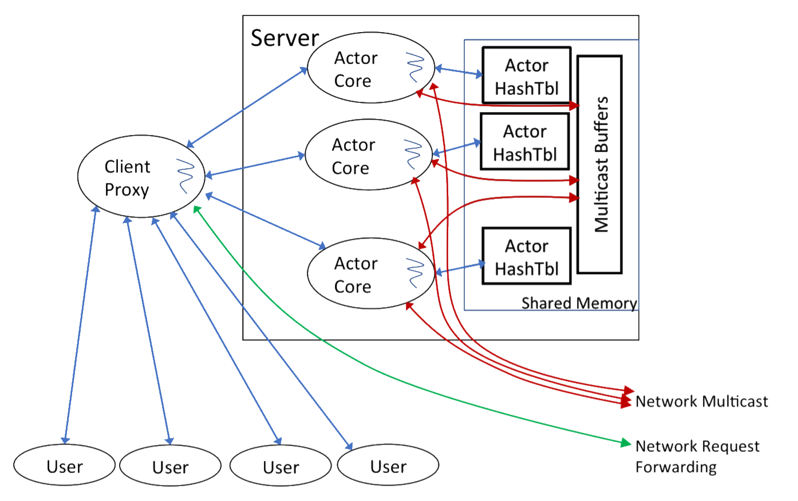
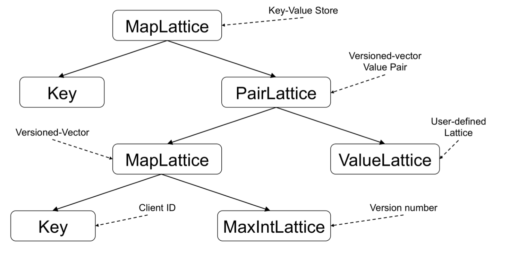
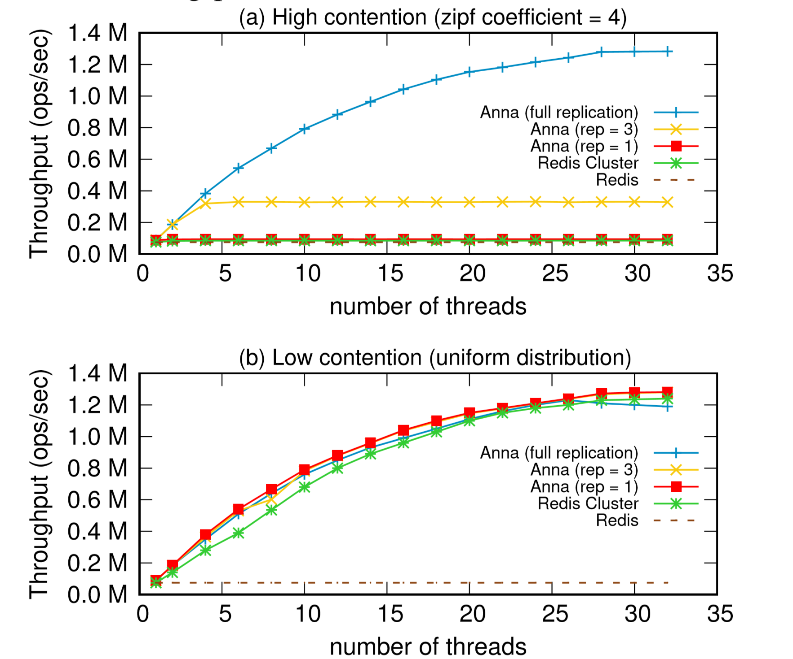

前言
================================================
年前被同事安利了这个分布式最终一致性的存储系统 [Anna][3] 。初略看了一眼Paper，似乎很是牛X。说是支持任意规模的扩展，并且性能不低于 [pedis][2]。于是抽空来看看并了解下这套系统的设计特点和这种夸张的单机性能和扩展性的来源。

主流分布式KVS的比较
================================================

| 系统名词      | 扩容设计    | 内存模型          | 针对单个Key的一致性策略                                                                  | 针对多个Key一致性策略            |
| ------------- | ----------- | ----------------- | ---------------------------------------------------------------------------------------- | -------------------------------- |
| Masstree      | 多核        | 共享内存          | [**线性(Linearizable)**][6]                                                              | 无                               |
| Bw-tree       | 多核        | 共享内存          | [**线性(Linearizable)**][6]                                                              | 无                               |
| PALM          | 多核        | 共享内存          | [**线性(Linearizable)**][6]                                                              | 无                               |
| MICA          | 多核        | 共享内存          | [**线性(Linearizable)**][6]                                                              | 无                               |
| Redis         | 单核        | N/A               | [**线性(Linearizable)**][6]                                                              | [**串行化(Serializable)**][7]    |
| COPS, Bolt-on | 分布式      | 消息队列          | [**最终一致性(Eventual)**][5]                                                            | [**因果一致性(Causal)**][4]      |
| Bayou         | 分布式      | 消息队列          | [**最终一致性(Eventual)**][5], 单调读/写, [**Read Your Writes**][8]                      | [**最终一致性(Eventual)**][5]    |
| Dynamo        | 分布式      | 消息队列          | [**线性(Linearizable)**][6], [**最终一致性(Eventual)**][5]                               | 无                               |
| Cassandra     | 分布式      | 消息队列          | [**线性(Linearizable)**][6], [**最终一致性(Eventual)**][5]                               | 无                               |
| PNUTS         | 分布式      | 消息队列          | 线性写, 单调读                                                                           | 无                               |
| CouchDB       | 分布式      | 消息队列          | [**最终一致性(Eventual)**][5]                                                            | 无                               |
| Voldemort     | 分布式      | 消息队列          | [**线性(Linearizable)**][6], [**最终一致性(Eventual)**][5]                               | 无                               |
| HBase         | 分布式      | 消息队列          | [**线性(Linearizable)**][6]                                                              | 无                               |
| Riak          | 分布式      | 消息队列          | [**最终一致性(Eventual)**][5]                                                            | 无                               |
| DocumentDB    | 分布式      | 消息队列          | [**最终一致性(Eventual)**][5], [**Session**][10], [**Bounded Staleness**][9], [**线性(Linearizable)**][6] | 无              |
| Memcached     | 多核&分布式 | 共享内存&消息队列 | [**线性(Linearizable)**][6]                                                              | 无                               |
| MongoDB       | 多核&分布式 | 共享内存&消息队列 | [**线性(Linearizable)**][6]                                                              | 无                               |
| H-Store       | 多核&分布式 | 消息队列          | [**线性(Linearizable)**][6]                                                              | [**串行化(Serializable)**][7]    |
| ScyllaDB      | 多核&分布式 | 消息队列          | [**线性(Linearizable)**][6], [**最终一致性(Eventual)**][5]                               | 无                               |
| Anna          | 多核&分布式 | 消息队列          | [**最终一致性(Eventual)**][5], [**最终一致性(Eventual)**][5], Item Cut, Writes Follow Reads, 单调读/写, [**Read Your Writes**][8], [**PRAM**][11] | [**Read Committed**][13], [**Read Uncommitted**][12] |

> 一致性说明:
>
> + [**线性(Linearizable)**][6] 是指在更新了某行之后，后续的客户端不会读到老数据，通常用在单行一致性上，最强的一致性模型；
> + [**最终一致性(Eventual)**][5] 是指在更新了某行之后，后续的客户端可能在某些（缓存）结点上会读到老数据（特别是并发执行的事务），但是最后（一段时间后）一定会读到一致的最新数据；
> + [**串行化(Serializable)**][7] 是指对多个读写同一行数据的事务，采用排序和排队执行的机制，这样也能保证数据的严格一致性，但是通常这涉及加锁（[spanner][22]/[f1][21]）或单点原子化操作（[redis][1]）；
> + **单调读(Monotonic Reads)** 是指在某一个客户端读取到新数据后，不会再读到老数据，但是有可能在更新一行后短期内客户端仍然读到老数据，属于 [**最终一致性**][5] 的一种；
> + **单调写(Monotonic Writes)** 是指对单个客户端的写入操作一定是有序的，属于 [**最终一致性**][5] 的一种；
> + [**因果一致性(Causal)**][4] 是指在某个客户端上对一组Key的读写操作会被认为有因果关系，那么在进程上也都保持一样的可见性顺序，属于 [**最终一致性**][5] 的一种。通常通过 [向量时钟(Vector Clock)][16] 实现；
> + [**Read Your Writes**][8] 是指当一个数据行被更新后，这个进程后面的读操作一定会读到这个新值。通常如果数据库系统有 **N个副本节点** ， **W个节点感知到写入** ， **R个节点对读操作返回的数据一致** ， 且如果 **W + R > N** ， 那么我们认为当前系统符合 [**Read Your Writes**][8] 一致性，属于 [**最终一致性**][5] 的一种；
> + [**Session**][10] 是[**Read Your Writes**][8]的一种更具体的行为，即每一次客户端连接到服务器的Session中保证 [**Read Your Writes**][8] 一致性，如果重新建立Session则不保证，属于 [**最终一致性**][5] 的一种；
> + [**Bounded Staleness**][9] 是指读取操作最多滞后于写入操作最多k个版本或t个周期之后，属于 [**最终一致性**][5] 的一种；
> + **Writes follows reads** 是指对一个Key的读操作后一定跟着这个Key的写操作；
> + [**PRAM**][11] 是指对于某个进程对多个Key的写入，其他进程看到的写入顺序和这个写入进程的写入顺序一致。因为这些Key在这个写入进程上是同一个pipeline；
> + [**Read Uncommitted**][12] 是指对同一组事务禁止 ***脏写*** ，即多个未提交事务同时修改一组数据；
> + [**Read Committed**][13] 是指事务读取数据时，不允许看到其他未提交事务所写入的数据，通常涉及多个事务并发执行且需要访问同一组数据；
>
> See https://en.wikipedia.org/wiki/Consistency_model for more details

[Anna][3] 架构设计
================================================

[Anna][3] 整体上依赖 [**bounded join semilattice**][14] (文中简称 [lattice][14] ) 的核心设计，不知道该怎么翻译了。

数学上 [Semilattice][14] 符合 **ACI** 特性：

+ 交换律（Commutativity）: \\\( \\sqcup (a, b) = \\sqcup (b, a), \\forall_{a,b} \\in S \\\)  ，即操作和顺序无关
+ 结合律（Associativity）: \\\( \\sqcup (\\sqcup (a, b), c) = \\sqcup (a, \\sqcup (b, c)), \\forall_{a,b,c} \\in S \\\) ，即操作和先后次序无关
+ 幂等性（Idempotence）: \\\( \sqcup (a, a) = a, \\forall_{a} \\in S \\\) ，即操作多次不影响结果
+ **join-semilattice** : join操作 \\\( \\sqcup (a, b) \\\) 指a,b的最小上界。
    > 这里是数学定义，我的理解在 [Anna][3] 中指数据合并操作。

+ **bounded** : 指存在特定元素 **1**，使得 \\\( \\sqcup (a, 1) = a , \\forall_{a,1} \\in S \\\)

详见维基百科: https://en.wikipedia.org/wiki/Semilattice

我的理解就是一个比较细粒度的模块化数据块，互相之间没有强交互和关联，大多数情况下仅处理自己的数据集。然后对于数据合并的操作，要设计成符合上面的 **ACI** 特性。

在 [lattice][14] 的基础上，很容易就可以设计出适合这种场景的分布式状态模型和通信模型。

整个架构使用了actor模型。和 [seastar][15] 框架相似，系统采用多线程结构，并且按CPU核心数分配线程。并且和 golang 的核心思想一样，用 **Message-passing** 来 **shared-memory** 。 这样虽然是多线程，但是每个线程跑自己的 **Actor Core** ，在业务处理的时候互相之间几乎不需要互相通信。每个actor线程由自己的数据变更集(**changeset**)，然后定期访问广播通道执行集群管理或者是合并操作。

[Anna][3] 的key和节点的分布也是一致性哈希。采用 [gossip][20] 算法来处理actor的容灾和扩缩容。按文中的意思似乎数据分片的同步也采用的是 [gossip][20] 。不过在这一点上 [gossip][20] 对分布式系统的局部分片扩容天生是比 [Paxos][17] 和 [Raft][18] 要好很多。

另外在 [Anna][3] 的actor中，记录了所有其他actor最后感知到这个actor事件的 [向量时钟(Vector Clock)][16] ，这样在多副本时，比如出现任意副本对某个Key的删除操作，就可以用因果关系感知到其他副本的actor都同步了这个事件之后再执行真正的垃圾回收操作。这就避免了不一致的时候再被同步回来的问题。这个事件最差情况也会由广播机制定期同步。

> 其实我有点怀疑这种方案在大规模集群上的延迟，这样意味着每个actor两两之间都需要比较高密度的数据同步。后面给出的各项测试模式里也没有涉及大量节点和大规模跨机器的测试结果。大多数给的都是少数机器几十个节点的性能报告。

弹性可扩展的一致性策略
================================================
[Anna][3] 是通过设计成一个无需交互，并且让内部符合ACI特性来实现这个高性能高并发的KVS的。[Anna][3] 通过一种自底向上的方法，通过把复杂数据结构切割成一个一个的 [**ACI Building Blocks（Lattice）**][14] 来保证整体的保持ACI特性。系统内置了一些一致性模型的设计，然后用户也可以自定义Merge函数。 [Anna][3] 的设计重点之一就是方便用户可以用 [Anna][3] 已有提供好的符合 **ACI** 的 [lattice][14] 来组合成自己需要的也符合 **ACI** 的新形态。然后以此来很方便地实现上面提到的那么多种一致性策略。

> 文中说是以C++模板来实现易扩展的 [lattice][14] 的。感觉和STL的思路比较像。

比如说实现了 **MapLattice** （KV结构） 、 **PairLattice** （带版本号的数据对） 、 **MaxIntLattice** （递增整数） 、 **ValueLattice** （用户自定义数据）。可以按下面的结构实现 [**因果一致性(Causal)**][4]。

如图，使用Key为 ClientID， Value为 **MaxIntLattice** 的 **MapLattice** 来实现因果一致性所需的 [向量时钟(Vector Clock)][16] 。 大部分情况下，分片稳定并且系统运行良好的情况下，数据的因果关系可以通过 [向量时钟(Vector Clock)][16] 判定出来。少数情况下，如果发生了冲突，就要走冲突合并流程了。只要合并操作符合上面的 **ACI** 特性，等到一定时间窗以后，无论哪个节点先执行合并、数据合并的顺序是怎样，一定会有一个统一的最终结果。

> 比如合并数据的时候采用按时间+节点ID排序，然后舍弃老数据。就是无论怎么合并。最终的结果一定是一致的。

再比如 [**Read Committed**][13] 的一致性策略。 其他的部分和 [**因果一致性(Causal)**][4] 一样，只要把维护Key的 [向量时钟(Vector Clock)][16] 改成用 **MaxIntLattice** 表示的最大时间戳，然后合并策略改成按最新时间戳就行了。

性能
================================================
看 [Anna][3] 对比其他的 KVS 都是碾压的，但是我个人对其他 KVS的设计不熟，对 [redis][1] 倒是比较熟悉。所以这里贴出来它和 [redis][1] (主要是 redis-cluster) 的对比。

如图，在低争用的情况下，[Anna][3] 的表现和 [redis-cluster][19] 相近。在高争用的时候，这里说是 [Anna][3] 的优势比较明显。但是我个人的理解， [Anna][3] 的这部分性能完全来自于对一致性的舍弃上。 [redis-cluster][19] 是很容易配置成强一致，但是 [Anna][3] 是采用了多个 **Actor Core** 独立运行，然后最终进行Merge的形式。那么在高争用的时候， [redis-cluster][19] 相当于收敛到了少数节点上运行，但是仍然是可以实现保证一致性的；而 [Anna][3] 是先跑完再Merge，这种的话一致性就比较差，也很难实现CAS类的操作（否则也会fallback到少数节点执行，那么和 [Anna][3] 的设计模式就相背离了）。

它在性能消耗分析的部分也说明了，如果一致性策略选的比较弱的话，多副本高争用的情况下还会有Merge开销激增的情况。这个Merge因为是跨节点通信的操作，在Paper提供的3副本的部署结构下大约69%的CPU消耗在这上面。所以影响还是蛮大的，相当于单点性能退化了。

总结
================================================
最终一致性和强一致性的数据库系统还是有很大区别，最终一致性不能保证大家看到的中间状态是一致的，并且可能需要自己去选择或者提供冲突时的处理方法。感觉上可能比较适合非关键性数据的分发和存储。至少在游戏项目中，感觉更实用的还是能保证强一致性的系统，即便是NoSQL系统。因为很多东西有比较复杂的逻辑关系，不太能接受多个节点结果不一致的状态。

上面 [Anna][3] 和其他系统的比较里也有列出一些强一致性的系统，我觉得和这些强一致的系统比性能其实不太公平。但是 [Anna][3] 的一些设计层面的东西还是值得参考的，比如它对worker的设计和考量。这方面它和 [pedis][2] 也很像，而且 [pedis][2] 性能比它没差太多，但是我的理解没错的话它可以保持强一致，感觉更胜一筹。当然 [pedis][2] 功能上目前实现也还是弱了一些，事务的支持和CAS的支持都没有。也就是说乐观锁和悲观锁都还不支持，目前还是没法用于要求强一致的业务里，也就和 [Anna][3] 没太大区别了。

从分布式设计来看，[Anna][3] 和 [redis-cluster][19] 的大体结构是一样的。节点间通信都是消息传递，节点维护都是 [gossip][20] ，节点收到其他节点的请求都是redirect过去。区别是 [Anna][3] 使用的多线程设计， 而 [redis-cluster][19] 是多进程模型；[Anna][3] 提供了更完备的proxy层，而redis-cluster目前这方面还得靠客户端支持；然后 [Anna][3] 对于resharding的自动化更好一些，并且还实现了热Key的动态副本。如果单单从单点性能的话，[Anna][3] 是和redis差不多的。

个人感觉 [Anna][3] 最大的优势还是在于它的 [lattice][14] 的设计。这极大地方便了对多种一致性策略的扩展。以后如果有什么新的技术方案出来也能够比较容易在这上面实现和测试。

[1]: https://redis.io/
[2]: https://github.com/fastio/pedis
[3]: http://db.cs.berkeley.edu/jmh/papers/anna_ieee18.pdf
[4]: https://en.wikipedia.org/wiki/Causal_consistency
[5]: https://en.wikipedia.org/wiki/Eventual_consistency
[6]: https://en.wikipedia.org/wiki/Linearizability
[7]: https://en.wikipedia.org/wiki/Serializability
[8]: http://www.dbms2.com/2010/05/01/ryw-read-your-writes-consistency/
[9]: http://pbs.cs.berkeley.edu/
[10]: https://www.allthingsdistributed.com/2007/12/eventually_consistent.html
[11]: https://en.wikipedia.org/wiki/PRAM_consistency
[12]: https://jepsen.io/consistency/models/read-uncommitted
[13]: https://jepsen.io/consistency/models/read-committed
[14]: https://en.wikipedia.org/wiki/Semilattice
[15]: https://github.com/scylladb/seastar
[16]: https://en.wikipedia.org/wiki/Vector_clock
[17]: https://en.wikipedia.org/wiki/Paxos_(computer_science)
[18]: https://raft.github.io/
[19]: https://redis.io/topics/cluster-spec
[20]: http://publicatio.bibl.u-szeged.hu/1529/1/gossip11.pdf
[21]: https://ai.google/research/pubs/pub41344 "F1: A Distributed SQL Database That Scales"
[22]: https://ai.google/research/pubs/pub39966 "Spanner: Google's Globally-Distributed Database"