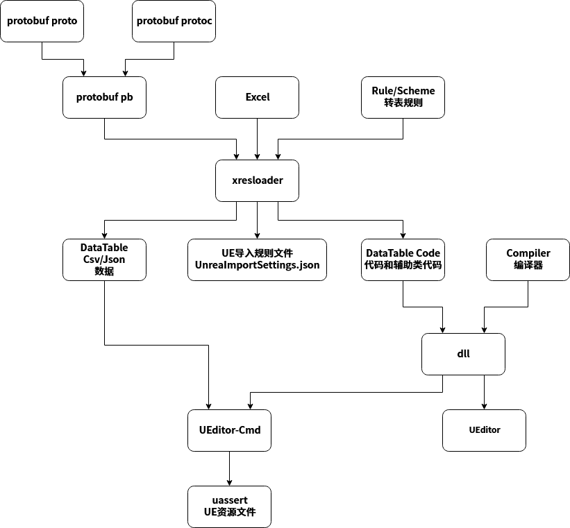

前言
================================================
我们项目组最近在学习UE，然后就涉及导表这个东东。之前我已经做过一个功能比较全面并且跨平台的Excel导出protobuf、msgpack、xml、lua、json、javascript等的工具 [xresloader][2] 。并且做了方便服务器集成的CLI工具和方便策划、前端用的GUI工具。那么这次很自然地就让它能够导出UE所支持的内容就行了。然后额外增加了基于protobuf插件形式的多key索引和自动生成一些支持蓝图和非蓝图的常用接口代码。

其实也是看了一下周边团队的做法，参考了一下他们的流程。然后结合 UE的文档和 [xresloader][2] 的特性，让它支持导出 UE所支持的DataTable，供给项目中使用。 顺便还完成了一些之前想做但是一直没做的功能流程，那就是支持通过protobuf插件的形式配置部分数据。目前只是还是简单地加了一些插件功能，但是这个流程打通以后，后面就方便做一些更高级特性了。

protobuf插件式扩展
================================================
protobuf插件功能在protobuf的官方文档里没有什么详细的说明。但是根据其他一些应用和protobuf提供的descriptor.proto文件还是比较容易知道它的用法。

protobuf内部数据描述保留了 1-1000 的段，那么我这里 xresloader 就使用了 1001-2000 的段。 其中 1001-1100 用来标记公共的扩展功能，其他的还可以分类放在不同的段里。

我在 [xresloader][3] 的设计里早先是独立于协议的。所以内部有自己的数据结构描述，相当于也要加扩展信息的结构，用于把 protobuf 插件信息用 [xresloader][3] 内部的 AST 结构描述出来。

数据输出和代码输出
------------------------------------------------

目前数据extend支持以下扩展。

```protobuf
syntax = "proto3";

import "google/protobuf/descriptor.proto";

package org.xresloader;

extend google.protobuf.FileOptions {
    string file_description = 1001; // 描述信息（不同的输出可能有不同的功能）

    // 用户自定义扩展字段请使用 2000 to max;
}

extend google.protobuf.MessageOptions {
    string   msg_description          = 1001; // 描述信息（不同的输出可能有不同的功能）
    // 用户自定义扩展字段请使用 2000 to max;
}

extend google.protobuf.FieldOptions {
    string verifier          = 1001; // 附加验证器
    string field_description = 1011; // 描述信息（不同的输出可能有不同的功能）

    // 用户自定义扩展字段请使用 2000 to max;
    // extensions 1000 to max;
}

```

对于 File 和 Message 扩展可能目前用处不是特别大，仅仅是在输出的header里和某些代码文件里增加了一个头，用来输出一些描述信息。
实际更有意义一点的可能是 Field 里的verifier，这样我们就可以不仅仅能在Excel里加验证器，而是直接可以把数据验证器加到类型上。比如sample里 ```role_upgrade_cfg``` 的 ```CostType``` 字段：

```protobuf
message role_upgrade_cfg {
    uint32 Id        = 1;
    uint32 Level     = 2;
    uint32 CostType  = 3 [ (org.xresloader.verifier) = "cost_type", (org.xresloader.field_description) = "Refer to cost_type" ];
    int32  CostValue = 4;
    int32  ScoreAdd  = 5;
}
```

UnrealEngine 的额外扩展
------------------------------------------------

在完成上面的流程之后，增加内容就变得很容易了。 我目前给 UE 扩展插件时分配了 1101-1200 段。 UE扩展其实更需要这些功能，因为要比较好地支持 UE 里的功能，需要自定义的条目可能结构比较复杂。特别是考虑到以后会加入多索引以后。目前的扩展结构如下：

```protobuf
syntax = "proto3";

import "google/protobuf/descriptor.proto";

package org.xresloader.ue;

extend google.protobuf.FieldOptions {
    int64  key_tag        = 1101; // key字段映射的系数
    string ue_type_name   = 1102; // UE内部类型(比如: TSoftObjectPtr<UTexture>)
    bool ue_type_is_class = 1103; // UE内部类型是否是Class(如果为true，会生成: TSoftClassPtr<T> 而不是 TSoftObjectPtr<T>)
}

extend google.protobuf.MessageOptions {
    string helper = 1101;       // 辅助函数的类名
    bool not_data_table = 1102; // 不是DataTable，helper类里不生成加载代码
}
```

主要的功能上面注释里写的应该也比较清晰了。后面也有对内哦那个更详细的说明。

UnrealEngine 支持
================================================

UE的DataTable和UStruct数据结构
------------------------------------------------

UE的数据导入支持Json和CSV两种形式。Json格式比较固定，但是CSV比较麻烦。

初期我实现的第一个版本没有支持可嵌套的结构，所有的复杂结构会被打平到扁平结构再生成代码和输出数据。但是后来结合对UE的导入模块的代码分析和Csv格式的Export结果分析。其实CSV也是支持复杂格式的，而且CSV的导入代码里数据加载是流式的。所以后面又增加了一个选项 ```UeCfg-RecursiveMode=true/false``` 来控制是否要开启嵌套结构的支持，然后默认处于开启状态。

在嵌套模式里，Csv所有的一级字段都是引号包裹的字符串。对于数组，是括号 ```()``` 包裹， ```,``` 分隔的数据元组。对于UStruct，则是  ```()``` 包裹， ```,``` 分隔的 ```Key=Value``` 的数据对。因为Key必须可输出为变量名，所以肯定是没有需要转义的字符的，而Value如果是字符串则需要再来一层 ```""``` 包裹起来。 因为数据的类型要么是基本类型，要么是数组或是UStruct，也没有嵌套转义的问题。

另外就是输出的数据不允许空字段，不然打开UEditor的时候会报Warning。在之前所有支持的输出类型，都是支持 **optional** 字段的，但是在输出UE数据的时候，就得把数据结构中空数据的 **optional** 补全默认值。

因为没有找到相关的比较确切的文档，所以对于CSV格式，我目前的实现还是按读的代码和UE导出的样例，按我的理解实现的转出。所以建议上，如果要使用平铺的模式，两种转表输出的格式都可以。
如果要使用嵌套模式，还是推荐用json。因为至少它的规范是统一的。

对常量的转出目前也是一个最简单的形式。即Key-Value，Key为protobuf形式的路径字符串，value为对应的数字。这个应用场景没有特别多，而且很容易有可替代方案。后面有空改成输出UE支持的蓝图枚举类型吧。

Csv、Json和ImportSetting
------------------------------------------------
UE的数据导入可以用 **UEditor-Cmd.exe** + **UnreaImportSettings.json** 导入到项目中，也可以UEditor里手动导入。（不过我咨询了下UE的技术支持，说是他们目前版本的 **UEditor-Cmd.exe** 仅支持Windows）。
**UnreaImportSettings.json** 文件里主要描述了每个要导入的 **DataTable** 的csv/json文件路径和映射的代码类。当然导入之前需要把生成的代码先编译进dll。结构大概是这样:

```json
{
    "ImportGroups": [
    {
        "GroupName": "XResConfig",
        "DestinationPath": "DataTable",
        "FactoryName": "ReimportDataTableFactory",
        "Filenames": ["/mnt/d/workspace/projs/xresloader/xresloader/sample/proto_v3/json/KindConst.json"],
        "ImportSettings": {
            "ImportType": "ECSV_DataTable",
            "ImportRowStruct": "KindConst"
        },
        "bSkipReadOnly": "true",
        "bReplaceExisting": "true"
    }
}
```

这边我输出的文件名都是绝对路径，因为Windows环境下跨盘符不是太好处理，还是需要转成绝对路径。当然这个也可以后面有空再来优化成相对路径。绝对路径有个坏处就是不同人那里转出来的数据源可能不一样，转出的uassert里是会记录数据源的路径的。这时候如果换一个环境可能路径就不存在了，那么UEditor里就没有检测到文件变化然后自动提示reload了。

第二期优化的时候，我加了个scheme参数 ```UeCfg-DestinationPath``` 用来指定uassert的输出目录。最早的版本实现里uassert的输出目录和csv/json的数据文件输出目录是一样的，实际上导入项目只需要uassert就行了。所以之前我们会把所有资源文件（包括 **UnreaImportSettings.json** ）都输出到Content同一目录下。这个只是为了把uassert和其他数据源分开来。

Helper类和辅助函数
------------------------------------------------

前面的插件功能大多是针对于辅助函数的，因为UE里的UStruct是不允许有虚函数的，而UE的DataTable的Key固定只有一个并且是 ```FName``` 类型。但是我们项目里肯定会有需求是多级Key的，甚至多重索引（这个目前还只是预留，还没加这个功能）。所以我们要提供一个通用的方法把几个Key组合成UE的Name，实现 **get by key** ，显然会同时需要static的版本和蓝图版本。另外UStruct是不允许返回指针的，所以我们也需要一个Default对象，就是空对象。并且空对象的函数也可以方便逻辑里的一些操作。

除了上面提到的以外，还会有一些辅助函数。为了防止这些函数和字段重名，所以我是支持另外生成一个Helper类，来存放这些函数。比如sample里的:

```cpp
UCLASS(Blueprintable, BlueprintType)
class UArrInArrHelper : public UObject
{
    GENERATED_BODY()

public:
    UArrInArrHelper();

    static void ClearRow(FArrInArr& TableRow);

    UFUNCTION(BlueprintCallable, Category = "XResConfig")
    void ClearDataRow(FArrInArr& TableRow) const;

private:
    FArrInArr Empty;
};
```

这也是为以后如果有更复杂的用法的时候，提供一个功能支持的容器。

题外话
================================================

后面只是记录一些随手做的优化和改进了，和UE转表无关。

xresconv-gui额外事件和nodejs沙盒
------------------------------------------------

首先是批量转表GUI工具里，原先的事件是一个eval函数，现在改成了nodejs沙盒。这样能尽可能减少破坏外部环境，也基本杜绝了注入问题。同时也是为了方便工具集成，给GUI工具加了一些开始转表前的事件和转表完成后的事件支持。主要用于开始前集成转pb的功能和转表后处理支援和自动调用 **UEditor-Cmd.exe** 来导入uassert到项目里。

持续发布(CD)
------------------------------------------------

持续发布就是把之前其他项的流程搬过来了，以前都是我手动打包jar发布的，现在就走自动发布啦。

写在最后
================================================

最后也没啥好写的了。主要都是UE的踩坑经历，贴一个上面转表的流程结构图吧。



[1]: https://xresloader.atframe.work/
[2]: http://github.com/xresloader/
[3]: https://github.com/xresloader/xresloader
