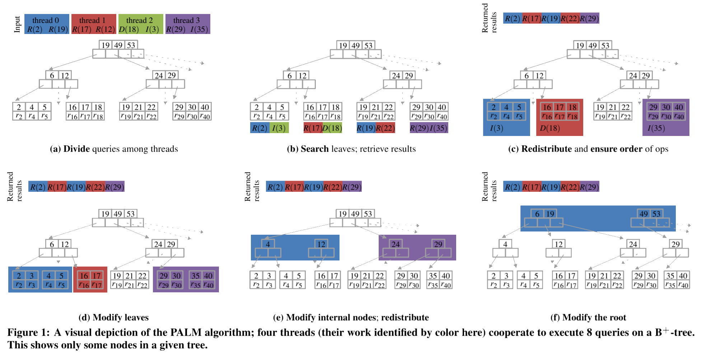

介绍
------------------------------------------------

年初的时候再知乎上看到有人分享 [**PALM树**][1] 树的文章，看简介是专为多核并发而设计的树形结构。比较好奇所以抽时间来看了看它的设计原理和是如合做到高并发的。

首先按照论文里介绍的 [**PALM树**][1] 的特性：

+ Latch-free 的B+树批处理.\(个人理解差不多是无自旋锁\)
+ 多核友好 — 高扩展性，针对SIMD，对缓存友好
+ 高性能
  > (CPU: Intel Xeon X5680 * 2(6核12线程))
  > 128M数据存量时可达，40M次更新/秒。（平均每物理核心 3.33M，逻辑核1.67M的QPS）
  > 512K数据存量时可达，128M次更新/秒（平均每物理核心 10.67M，逻辑核5.33M的QPS）
  > 查询性能是更新性能的1.6倍
+ 极短的响应延迟，几乎和吞吐保持一致, 一般在60–350μs之间
+ 2.3X–19X the state of the art on [skewed distributions][3].
+ 将来的Intel Knights Ferry CPU可以获得1.5–2.1倍的性能。
+ 更容易测试和维护
+ 基于 [Bulk Synchronous Parallel (BSP) ][7] 模型。

简单的理解，PALM就是普通B+树然后在某些阶段执行同步操作，收敛工作线程来解决并发执行时传统方案的频繁加锁的问题。

PALM 批处理
------------------------------------------------

PALM树的核心从系统层面来看，入口就是它的批处理流程。相当于天生就把操作Batch化了。

假设有数据库 \\\(D\\\) , 然后里面有全量的Key索引 \\\(K\\\) ， 然后索引对 \\\((k,r^∗_k)\\\) 。 \\\(r^∗_k\\\) 是指向实际数据集\\\(r_k\\\) 。
然后对于数据库 \\\(D\\\) 的树形结构索引 \\\(T_D\\\) [**PALM树**][1] 支持三种操作:

+ RETRIEVE(\\\(T_D\\\) , \\\(k\\\)): 返回 \\\(r_k\\\) 或 \\\(\Theta , if(k \notin T_D)\\\)
+ INSERT(\\\(T_D\\\) , \\\((k,e)\\\)): \\\(if(k \in T_D)\\\) ，追加数据 \\\(e\\\) 到 \\\(r_k\\\) ；否则初始化 \\\(r_k\\\) 为 \\\({e}\\\) ，然后增加新的指针对 \\\(r^∗_k\\\) 到 \\\(T_D\\\)
+ DELETE(\\\(T_D\\\) , \\\((k,e)\\\)): \\\(if(k \in T_D)\\\) ，把 \\\(e\\\) 从 \\\(r_k\\\) 里移除， 然后 \\\(if(length(r_k)=0)\\\) ，从 \\\(T_D\\\) 里移除指针对 \\\(r^∗_k\\\) ， \\\(if( k \notin T_D)\\\) ，忽略操作。

这些也是一个容器数据结构里必备的几项操作，而对于 [**PALM树**][1] 来说，能表现其特色的是下面的流程。

### 核心流程

整个流程伪代码如下：

```bash
PALM(O, T[D], i, t)
  // O are queries, T[D] is the tree
  // i is the thread-id, and t is the number of threads
  O[i] = PARTITION-INPUT (O, i, t)
  L[i] = SEARCH (O[i], T[D])
  SYNC(i, t)
  L'[i] = REDISTRIBUTE-WORK (L[0], . . . , L[t-1], i)
  (R[i], O'[L'[i]]) = RESOLVE-HAZARDS(L'[i] , O, D)
  for (O[λ], λ) in (O'[L'[i]], L'[i])
    M[1][i] = M[1][i] ∪ MODIFY-NODE (O[λ], λ)
  SYNC(i, t)
  for d = 1 to depth (T[D]) - 1
    M[d'][i] = REDISTRIBUTE-WORK(M[d][0], ..., M[d][t-1], i)
    for (Λ, η) in M[d'][i]
      M[d+1][i] = M[d+1][i] ∪ MODIFY-NODE (Λ, η)
    SYNC(i, t)
  if (i == 0)
    HANDLE-ROOT(⋃(M[d+1][i]), T[D])
  return (R[0], ..., R[t-1])
```

上面公式里由于Markdown和公式渲染的限制改成了偏程序的表达形式。`O` 是请求集合， `T[D]` 是Palm树结构, `i` 是线程ID、 `t` 是总线程数。

简单地描述，上面公式地流程就是收到批处理请求之后：

1. **先对请求排序和分组（PARTITION-INPUT）**
2. **然后收集相关的叶子节点**
3. **分配工作线程（REDISTRIBUTE-WORK）**
4. **收集需要返回的结果（RESOLVE-HAZARDS）**
5. **开始并行执行B+树的修改节点的操作（MODIFY-NODE）**
6. **对B+树逐层往上收敛工作线程并执行修改节点**
7. **全部处理完以后可能要修改根节点，完了以后返回查询请求的结果**

文中没有详细描述批处理怎么分批。个人觉得一个比较简单的方式是在上一个批处理没结束前，收到的请求全部进队列，然后限制一下最大数量作为下一个批处理集合就可以了。

### PARTITION-INPUT

第一部分的 **对请求排序和分组** ， 是为了减少线程间同步的次数。这样按照key排序以后给工作线程按ID大小来分组，按原文的说法这样也可以减小后面B+树向上收敛的时候的线程间通信。

### REDISTRIBUTE-WORK

上面流程里的 `REDISTRIBUTE-WORK` 这一步，简明来说就是构造一个新的执行节点的集合 \\\(L'_i\\\)  ，让它和原来的执行节点的集合 \\\(L_i\\\) 和 \\\(L_j\\\) 满足下面的关系。（ `i` 和 `j` 是线程ID）

$$L'_i = {λ \in L_i|λ \notin L_j , \forall 0 \le j < i}$$

上面这个公式的作用是决定一个节点的执行者应该由哪个线程执行。其实换一种程序化的描述很简单，就是把所有的同时有多个执行线程的节点的归属权交给ID小的那个。贴一个原文的图方便理解。

> 原Paper里非得写个公式化的东西并且和程序化思维反着来，理解起来绕了一圈。



前面 [PARTITION-INPUT](#partition-input) 提到过。请求批处理是按key排序后分组再分配给工作线程的，并且分配的时候也是线程ID的大小来依次分配的。这样要实现上面这种单调的性质就很容易。 按原文的意思，当处理父节点要收敛工作线程的时候，可以只让线程 `i` 与线程 `i+1` 和线程 `i-1` 通信即能直到自己是否要让出执行权。

> 我觉得这里有更好更简单的方案，直接CAS的方式来执行工作线程抢占。这样甚至能省去收敛工作线程时的同步操作。
> 
> + 首先处理完子节点以后会生成一系列批处理转交给父节点（具体的流程见下面的 [节点内处理 MODIFY-NODE](#%E8%8A%82%E7%82%B9%E5%86%85%E5%A4%84%E7%90%86-modify-node) ） 。
> + 可以直接把这些批处理添加到父节点的待执行队列，这里可以用无锁队列实现， 然后直接抢占父节点工作线程。
> + 如果抢占失败说明有其他线程在执行，自己直接进空闲线程池即可
> + 如果抢占成功那自己就是工作线程，执行一个循环不断地把待执行队列取出来，执行这个节点的 MODIFY-NODE 流程直到待执行队列空即可。
> 
> 这样的话对请求排序其实都不是必须的。（当然排序还是有可能增加缓存命中率，可以作为优化项）

### RESOLVE-HAZARDS

这个行为我的理解主要是要收集请求的结果。因为对同一个Key的执行最终是分配到一个线程上执行的。要保证操作和结果的顺序也很容易，所以这个操作只要先记录下哪个查询请求对应的结果是什么，等批处理全部执行完一起返回就好了。

节点内处理 MODIFY-NODE
------------------------------------------------

上面的住流程还有一个重要的流程是对节点的修改操作。还是先贴下原文里的公式。

```bash
MODIFY-NODE (Λ, η)
  // Λ is sequence of modifications to node η.
  // If η is internal, Λ is a modification list.
  // If η is a leaf, Λ is a series of INSERT and DELETE queries.
  E = items (η)
  K = ∅
  for m in Λ
    K = K ∪ orphaned-keys (m)
    if class (m) == "+"
      E = E ∪ items (m)
    elseif class (m) == "−"
      E = E \ items (m)
  if |E| > MAX-DEGREE
    (η, η', η'', ...) = BIG-SPLIT(E)
    return {"+", parent (η) , η', η'', ..., K}
  elseif |E| < MIN-DEGREE
    return {"−", parent (η) , η, K ∪ descendant-keys (E)}
  else
    child-ranges (η) = E
    return {∅, K}
```

上面公式也由于Markdown和公式渲染的限制改成了偏程序的表达形式。`Λ` 是修改操作集合（"+"为增，"−"为减）。查询请求和Update请求都不会改变节点结构所以不会产生节点变更操作。`η` 是 [**PALM树**][1] 上的一个节点。

简单描述一下流程就是:

1. **先收集出所有操作会造成的孤儿节点**（`orphaned-keys (m)`）

  > 比如如果是删除子节点操作，那么这个被删除的子节点的所有Children就会变成孤儿节点。

2. **按操作类型增删子节点**
3. **子节点过多则需要分裂**，这里生成增加节点（"+"操作）的操作，并附带上孤儿节点传递给上一层。
4. **子节点过少则需要合并**，这里生成删除节点（"-"操作）的操作，并把自己的子节点附带上孤儿节点生成增加节点（"+"操作）的操作传递给上一层。
5. **子节点数没有超出B+树阈值**，把孤儿节点生成增加节点（"+"操作）的操作传递给上一层即可。

至此，整个 [**PALM树**][1] 的核心流程就完结了。

其他细节优化
------------------------------------------------

[**PALM树**][1] 的论文里还包含一些其他的优化细节介绍。但是这些优化也可以用于其他的数据结构和算法上，也不算 [**PALM树**][1] 特有的。

主要是:

+ 请求排序和线程间同步优化(前面提到过的Key排序和按线程ID分配后只让线程 `i` 与线程 `i+1` 和线程 `i-1` 通信的收敛过程)。
+ 使用 [缓存预取指令][5] 和 [数据预取][4] 来辅助提前将内存加载进缓存。
+ 使用SIMD寄存器指令集来提高并发。
+ 精心设计数据结构的大小来更好地利用CPU Cache Line

最后
------------------------------------------------

读这篇Paper主要是了解一下它的原理，可能对以后默写系统的设计实现有参考价值。我就没有去写一个了，Paper里的性能测试报告差不多是个量级层面的参考，我就不贴了。他们的测试机器配置还不错，比我们目前项目里用的好一些，性能差别应该不会大到哪里去。

我觉得 [**PALM树**][1] 里的一些性能对比有些有失公允。因为它集成了更多的优化手段，而其中有些手段用其他的库也是可以提升性能的。比如很多容器是不自带Batch功能的，如果我们也做一层Batch，对请求排序。也能提升其他容器实现的缓存命中率，从而提升性能效果。不过 [**PALM树**][1] 里自带调度功能和与之相搭配的多多核执行更友好的设计还是值得借鉴的。

文中如果有哪些地方理解有偏差欢迎小伙伴们交流指正哈。

[1]: http://www.vldb.org/pvldb/vol4/p795-sewall.pdf "PALM: Parallel Architecture-Friendly Latch-FreeModifications to B+ Trees on Many-Core Processors"
[2]: https://en.wikipedia.org/wiki/Knights_Ferry_(Intel) "Knights Ferry"
[3]: https://www.sciencedirect.com/topics/mathematics/skewed-distributions "skewed distributions"
[4]: https://en.wikipedia.org/wiki/Cache_prefetching "Cache prefetching"
[5]: https://en.wikipedia.org/wiki/Cache_control_instruction "Cache control instruction"
[6]: https://gcc.gnu.org/projects/prefetch.html "GCC - Data Prefetch Support"
[7]: https://en.wikipedia.org/wiki/Bulk_synchronous_parallel
