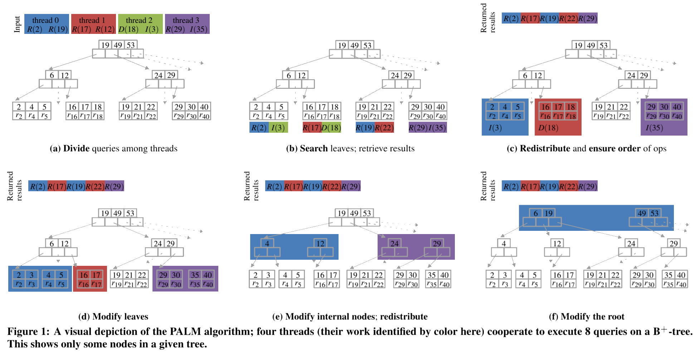

前言
================================================
前段时间被同事安利了这个分布式最终一致性的存储系统 [Anna][^anna] 。初略看了一眼Paper，似乎很是牛X。说是支持任意规模的扩展，并且性能不低于 [pedis][2]。于是想来看看了解下这套系统的设计特点和这种夸张的单机性能和扩张性的来源。

主流分布式KVS的比较
================================================

| 系统名词      | 扩容设计    | 内存模型          | 针对单个Key的一致性策略                                                                  | 针对多个Key一致性策略            |
| ------------- | ----------- | ----------------- | ---------------------------------------------------------------------------------------- | -------------------------------- |
| Masstree      | 多核        | 共享内存          | 线性                                                                                     | 无                               |
| Bw-tree       | 多核        | 共享内存          | 线性                                                                                     | 无                               |
| PALM          | 多核        | 共享内存          | 线性                                                                                     | 无                               |
| MICA          | 多核        | 共享内存          | 线性                                                                                     | 无                               |
| Redis         | 单核        | N/A               | 线性                                                                                     | 串行化                           |
| COPS, Bolt-on | 分布式      | 消息队列          | 因果一致性                                                                               | 因果一致性                       |
| Bayou         | 分布式      | 消息队列          | 最终一致性, 单调读/写, Read Your Writes                                                  | 最终一致性                       |
| Dynamo        | 分布式      | 消息队列          | 线性, 最终一致性                                                                         | 无                               |
| Cassandra     | 分布式      | 消息队列          | 线性, 最终一致性                                                                         | 无                               |
| PNUTS         | 分布式      | 消息队列          | 线性写, 单调读                                                                           | 无                               |
| CouchDB       | 分布式      | 消息队列          | 最终一致性                                                                               | 无                               |
| Voldemort     | 分布式      | 消息队列          | 线性, 最终一致性                                                                         | 无                               |
| HBase         | 分布式      | 消息队列          | 线性                                                                                     | 无                               |
| Riak          | 分布式      | 消息队列          | 最终一致性                                                                               | 无                               |
| DocumentDB    | 分布式      | 消息队列          | 最终一致性, Session, Bounded Staleness, 线性                                             | 无                               |
| Memcached     | 多核&分布式 | 共享内存&消息队列 | 线性                                                                                     | 无                               |
| MongoDB       | 多核&分布式 | 共享内存&消息队列 | 线性                                                                                     | 无                               |
| H-Store       | 多核&分布式 | 消息队列          | 线性                                                                                     | 串行化                           |
| ScyllaDB      | 多核&分布式 | 消息队列          | 线性, 最终一致性                                                                         | 无                               |
| Anna          | 多核&分布式 | 消息队列          | 最终一致性, 因果一致性, Item Cut, Writes Follow Reads, 单调读/写, Read Your Writes, PRAM | Read Committed, Read Uncommitted |

> 一致性说明:
> + [**线性(Linearizable)**][6] 是指在更新了某行之后，后续的客户端不会读到老数据，通常用在单行一致性上，最强的一致性模型；
> + [**最终一致性(Eventual)**][5] 是指在更新了某行之后，后续的客户端可能在某些（缓存）结点上会读到老数据（特别是并发执行的事务），但是最后（一段时间后）一定会读到一致的最新数据；
> + [**串行化(Serializable)**][7] 是指对多个读写同一行数据的事务，采用排序和排队执行的机制，这样也能保证数据的严格一致性，但是通常这涉及加锁（[spanner][^spanner]/[f1][^f1]）或单点原子化操作（[redis][^redis]）；
> + **单调读(Monotonic Reads)** 是指在某一个客户端读取到新数据后，不会再读到老数据，但是有可能在更新一行后短期内客户端仍然读到老数据，属于 [**最终一致性**][5] 的一种；
> + **单调写(Monotonic Writes)** 是指对单个客户端的写入操作一定是有序的，属于 [**最终一致性**][5] 的一种；
> + [**因果一致性(Causal)**][4] 是指在某个客户端上对一组Key的读写操作会被认为有因果关系，那么在进程上也都保持一样的可见性顺序，属于 [**最终一致性**][5] 的一种；
> + [**Read Your Writes**][8] 是指当一个数据行被更新后，这个进程后面的读操作一定会读到这个新值。通常如果数据库系统有 **N个副本节点** ， **W个节点感知到写入** ， **R个节点对读操作返回的数据一致** ， 且如果 **W + R > N** ， 那么我们认为当前系统符合 [**Read Your Writes**][8] 一致性，属于 [**最终一致性**][5] 的一种；
> + [**Session**][10] 是[**Read Your Writes**][8]的一种更具体的行为，即每一次客户端连接到服务器的Session中保证 [**Read Your Writes**][8] 一致性，如果重新建立Session则不保证，属于 [**最终一致性**][5] 的一种；
> + [**Bounded Staleness**][9] 是指读取操作最多滞后于写入操作最多k个版本或t个周期之后，属于 [**最终一致性**][5] 的一种；
> + **Writes follows reads** 是指对一个Key的读操作后一定跟着这个Key的写操作；
> + [**PRAM**][11] 是指对于某个进程对多个Key的写入，其他进程看到的写入顺序和这个写入进程的写入顺序一致。因为这些Key在这个写入进程上是同一个pipeline；
> + [**Read Uncommitted**][12] 是指对同一组事务禁止 ***脏写*** ，即多个未提交事务同时修改一组数据；
> + [**Read Committed**][13] 是指事务读取数据时，不允许看到其他未提交事务所写入的数据，通常涉及多个事务并发执行且需要访问同一组数据；
> See https://en.wikipedia.org/wiki/Consistency_model for more details

Anna架构设计
================================================

actor模型

多线程，按CPU核心数分配线程。

每个actor线程由自己的数据变更集(**changeset**)，然后定期访问广播通道执行合并操作。

弹性的一致性策略
================================================
[Anna][^anna] 是通过设计成一个无需交互，并且让内部符合ACI特性来实现这个高性能高并发的KVS的。[Anna][^anna] 通过一种自底向上的方法，通过把复杂数据结构切割成一个一个的 **ACI Building Blocks（Lattice）** 来保证整体的保持ACI特性。系统内置了一些一致性模型的设计，然后用户也可以自定义Merge函数

> ACI是指：
> + 交换律（Commutativity）
> + 结合律（Associativity）
> + 等幂性（Idempotence）
 
冲突
================================================
自定义 [最终一致性][5] 下的冲突解决策略。

总结
================================================
最终一致性和强一致性的数据库系统还是有很大区别，最终一致性不能保证大家看到的中间状态是一致的，并且可能需要自己去选择或者提供冲突时的处理方法。感觉上可能比较适合非关键性数据的分发和存储。至少在游戏项目中，感觉更实用的还是能保证强一致性的系统，即便是NoSQL系统。因为很多东西有比较复杂的逻辑关系，不太能接受多个节点结果不一致的状态。

上面 [Anna][^anna] 和其他系统的比较里也有列出一些强一致性的系统，我觉得和这些强一致的系统比性能其实不太公平。但是 [Anna][^anna] 的一些设计层面的东西还是值得参考的，比如它对worker的设计和考量。这方面它和 [pedis][2] 也很像，而且 [pedis][2] 性能比它没差太多，但是我的理解没错的话它可以保持强一致，感觉更胜一筹。当然 [pedis][2] 功能上目前实现也还是弱了一些，事务的支持和CAS的支持都没有。也就是说乐观锁和悲观锁都还不支持，目前还是没法用于要求强一致的业务里，也就和 [Anna][^anna] 没太大区别了。

[^anna]: http://db.cs.berkeley.edu/jmh/papers/anna_ieee18.pdf "Anna: A KVS For Any Scale"
[^redis]: https://redis.io "Redis"
[^raft]: https://raft.github.io/ "The Raft Consensus Algorithm"
[^spanner]: https://ai.google/research/pubs/pub39966 "Spanner: Google's Globally-Distributed Database"
[^f1]: https://ai.google/research/pubs/pub41344 "F1: A Distributed SQL Database That Scales"

[1]: https://redis.io/
[2]: https://github.com/fastio/pedis
[3]: http://db.cs.berkeley.edu/jmh/papers/anna_ieee18.pdf
[4]: https://en.wikipedia.org/wiki/Causal_consistency
[5]: https://en.wikipedia.org/wiki/Eventual_consistency
[6]: https://en.wikipedia.org/wiki/Linearizability
[7]: https://en.wikipedia.org/wiki/Serializability
[8]: http://www.dbms2.com/2010/05/01/ryw-read-your-writes-consistency/
[9]: http://pbs.cs.berkeley.edu/
[10]: https://www.allthingsdistributed.com/2007/12/eventually_consistent.html
[11]: https://en.wikipedia.org/wiki/PRAM_consistency
[12]: https://jepsen.io/consistency/models/read-uncommitted
[13]: https://jepsen.io/consistency/models/read-committed
