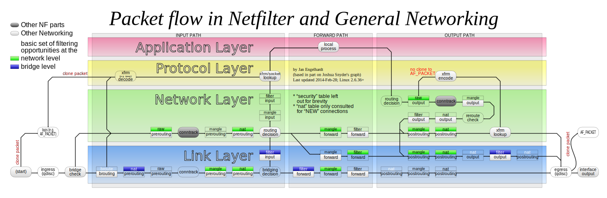

前言
----------------------------------------------

之前耳闻 [nftables][2] 是下一代 [iptables][3] 。前段时间配了一台主机，折腾成家里的软路由。就一并来尝鲜一系列新东西，其中就包括 [nftables][2] 。[nftables][2] 和 [iptables][3] 、[ebtables][7] 等一样，都是对底层 xtables 的封装，目前看来 [nftables][2] 比 [iptables][3] 更简洁易用，更易读，更容易理解，扩展性和也更好。但是目前各个发行版中对 [nftables][2] 的支持还比较参差不齐，导致 [nftables][2] 很多功能比 [iptables][3] 还是有所缺失，所以个人感觉短期内还是替代不了 [iptables][3] （比如 tproxy 功能需要 linux kernel 4.19+， 而即便是 [CentOS 8][6] 的内核版本也只是 4.18 ，所以都不支持 ）。 [nftables][2] 所支持的功能列表及所以来的内核版本和内核模块可以在这里找到 https://wiki.nftables.org/wiki-nftables/index.php/Supported_features_compared_to_xtables 。

[nftables][2] 的功能分两块，一块是内核支持，这个受限于内核版本。另一部分是用户空间的库和工具。有些发行版会滚动更新内核，但是 [nftables][2] 版本比较低，这时候如果要用就得自己编译。[nftables][2] 依赖库及命令行工具的代码仓库如下:

+ libmnl: http://git.netfilter.org/libmnl/
+ libnftnl: http://git.netfilter.org/libnftnl/
+ nftables: http://git.netfilter.org/nftables/

和 [podman][4] 一样， [nftables][2] 的高版本对依赖库的版本也有一定要求，系统自带的不一定符合要求，就得一个一个编译。我写了一个构建脚本: https://github.com/owent-utils/docker-setup/blob/master/build-nftables.sh ， 并且实测如果使用 [podman][4] 或者 [docker][5] 的话，可以宿主机编译，然后mount共享给子机也是可以的。

官方Wiki: https://wiki.nftables.org
官方文档: https://www.netfilter.org/projects/nftables/manpage.html
官方文档不是很全，这个文档更完整一些: https://www.mankier.com/8/nft

nftables与iptables
----------------------------------------------

先贴一张 [iptables][3] 的流程图。



在这张图表示的流程里 [nftables][2] 比 [iptables][3] 最大的一个区别就是， [nftables][2] 可以自由创建多个 table， 然后去hook图里的不同阶段（https://www.mankier.com/8/nft#Chains）。而 [iptables][3] 仅有默认的 **raw** ,  **mangle** ,  **nat** ,  **filter** 等table， hook了名字一样的阶段。[nftables][2] 可以建立多个 table， 多个table的执行顺序是按优先级来的（https://www.mankier.com/8/nft#Chains 下面的 **Table 6.** 和 **Table 7.** 里有文档）。 其他的规则和流程 [nftables][2] 和 [iptables][3] 是一样的。只是 [nftables][2] 更简单易读一些。

[nftables][2] 的基本命令表达式为 ```nft create/add/delete/list/flush table/chain/rule [ip/ip6/inet/arp/bridge/netdev] [表达式]``` 。其中 ```inet``` 相当于 ```ip+ip6``` 。

表达式主要有两大类，一类是匹配表达式，还有一类是行为表达式，每一类都分很多种而且是多层级的和 [iptables][3] 也差不多。但是 [nftables][2] 有个比较方便的地方是表达式的最后一个参数如果要多个的话，可以用 ```{ VALUE1, VAULE2 }``` 来一次写多个。比如我要同时匹配 tcp和udp 协议，可以写成 ```meta l4proto { tcp, udp }``` ; 如果我要匹配所有的 ipv6 的源地址是私有地址和回环地址的话可以写成 ```ip6 saddr {::1/128, fc00::/7, fe80::/10, fd00::/8, ff00::/8}``` 。

以下是一些常用命令:

| [iptables][3]                                                                              | [nftables][2]                                                                             | 说明                                   |
|:-------------------------------------------------------------------------------------------|:------------------------------------------------------------------------------------------|:---------------------------------------|
| ```iptables -t mangle -L```                                                                | ```nft list table mangle```                                                               | 显示指定table(mangle)的所有chains      |
| -                                                                                          | ```nft list ruleset```                                                                    | 显示所有table的所有chains              |
| ```iptables -t mangle -A V2RAY -j TRACE```                                                 | ```nft add rule inet mangle V2RAY meta nftrace set 1```                                   | 跟踪调试包                             |
| ```iptables -t mangle -A V2RAY -j LOG --log-level debug --log-prefix "###LOG PREFIX:"```   | ```nft add rule inet mangle V2RAY log prefix '"###LOG PREFIX:"' level debug flags all```  | 输出内核日志                           |

> 上面跟踪调试包流程的时候 [nftables][2] 可以用 ``` nft monitor trace``` 来查看包的状态流转。具体可参见 Wiki: https://wiki.nftables.org/wiki-nftables/index.php/Ruleset_debug/tracing
>


在 [nftables][2] 里有个工具 **iptables-nft** (```iptables-translate [iptables参数列表]```) 可以用来转换 [iptables][3] 表达式到 [nftables][2]表达式。但是我自己实测的不是很全有些地方也有些谬误。

nftables与ebtables
----------------------------------------------

上面的流程图显示来自于桥接的走了另一套状态流转的流程。要控制桥接的流程，传统的做法可以使用 [ebtables][7] 。按文档的说法 （ https://www.mankier.com/8/ebtables-legacy#Description-Tables ）， 在 BROUTE 链DROP掉包，能阻止桥接来的包走转发规则，从而转走路由规则。 但是在 [nftables][2] 的文档里仅有 https://www.mankier.com/8/nft#Statements-Payload_Statement 里写了个例子改路由。然而我尝试了几次并没有成功。不管我怎么设置，最终还是走了桥接的包转发，并没有走我指定的流转路径（比如转换成tproxy）。另外还看到个文档 （ https://www.mankier.com/8/ebtables-nft ） [nftables][2] 目前还不支持对 BROUTE 的HOOK。所以我自己这里目前还是走的用 [ebtables][7] 。

个人感觉 [ebtables][7] 使用起来比 [iptables][3] 麻烦一些，很多插件功能不支持，有些规则也有些限制，比如不支持 [ipset][8] 。但是凑合着还算能用吧。

> 使用 [ebtables][7] 需要开启内核模块: ```br_netfilter```

另外如果要使用网桥包转路由，然后走比如tproxy需要增加如下配置:

```bash
echo "
net.ipv4.ip_forward=1
net.ipv4.ip_forward_use_pmtu=1
net.ipv4.conf.all.forwarding=1
net.ipv4.conf.default.forwarding=1
net.ipv6.conf.all.forwarding=1
net.ipv6.conf.default.forwarding=1
# Configures below are used to support tproxy for bridge
net.bridge.bridge-nf-call-arptables = 1
net.bridge.bridge-nf-call-ip6tables = 1
net.bridge.bridge-nf-call-iptables = 1
net.ipv4.conf.all.rp_filter=0
net.ipv4.conf.default.rp_filter=0
net.ipv4.conf.all.route_localnet=1
net.ipv4.conf.default.route_localnet=1
" > /etc/sysctl.d/91-forwarding.conf ;
sysctl -p ;
```

nftables与ipset
----------------------------------------------

我看了一圈文档，没有找到 [nftables][2] 直接访问 [ipset][8] 的方式。按Wiki的说法（ https://wiki.nftables.org/wiki-nftables/index.php/Moving_from_ipset_to_nftables ） 是可以用 [nftables][2] 内置的set和map功能来代替。不过现有的一些工具之集成了对  [ipset][8] 的支持没有支持 [nftables][2] 的set和map的话，就得另想办法了。

总体上 [ipset][8] 和 [nftables][2] 的map和set功能差不太多，有一个区别是 [nftables][2] 的map和set都是绑在 [nftables][2] 的table里的，而 [ipset][8] 没有table的概念。个人觉得 [nftables][2] 的更好用一些。

部分参考对比如下:

| [ipset][8]                                                                                     | [nftables][2]                                                          |
|:-----------------------------------------------------------------------------------------------|:-----------------------------------------------------------------------|
| ```ipset create V2RAY_BLACKLIST_IPV4 hash:ip family inet```                                    | ```nft add set ip v2ray BLACKLIST { type ipv4_addr\; }```              |
| ```ipset flush V2RAY_BLACKLIST_IPV4```                                                         | ```nft flush set ip v2ray BLACKLIST```                                 |
| ```ipset add V2RAY_BLACKLIST_IPV4 $PPP_OUTER_IP```                                             | ```nft add element ip v2ray BLACKLIST { $PPP_OUTER_IP } ;```           |
| ```iptables -t mangle -A V2RAY -p tcp -m set --match-set V2RAY_BLACKLIST_IPV4 dst -j RETURN``` | ```nft add rule ip v2ray PREROUTING meta l4proto tcp ip daddr @BLACKLIST return``` |
| ```ipset create myset hash:ip,port,ip family inet```                                           | ```nft add set inet filter myset { type type ipv4_addr . inet_service . ipv4_addr : verdict \; }```              |
| ```ipset add myset 172.16.0.1,tcp:80,10.0.0.1```                                               | ```nft add element inet filter myset { 172.16.0.1 . 80 . 10.0.0.1 : accept } ;```           |
| ```iptables -t filter -A INPUT -m set --match-set myset src,dst,dst -j ACCEPT```               | ```nft add rule inet filter INPUT meta nfproto ipv4 ip saddr . tcp dport . ip daddr vmap @myset``` |

nftables与iptables与NAT
----------------------------------------------

按 Wiki 里的说法 （ https://wiki.nftables.org/wiki-nftables/index.php/Performing_Network_Address_Translation_(NAT)#Incompatibilities ） 。要使用 [nftables][2] 来做 NAT 就要关闭 [iptables][3] 的NAT。即不能载入 ```iptable_nat``` 和 ```ip6table_nat``` 。但是我自己这边使用的时候，这两个模块被其他的模块拉起了，也是能正常NAT的。不过我并没有用 [iptables][3] 配置任何NAT规则。要彻底屏蔽这两个内核模块并且禁止其他模块拉起可以运行如下脚本:

```bash
echo "## Do not load the iptable_nat,ip_tables,ip6table_nat,ip6_tables module on boot.
blacklist iptable_nat
blacklist ip6table_nat

# Upper script will disable auto load , or using scripts below to force disable modules
# install iptable_nat /bin/true
# install ip6table_nat /bin/true
" | tee /etc/modprobe.d/disable-iptables.conf
```

另外我本地为了支持NAT和一些辅助功能开启的模块如下:

```bash
echo "
xt_nat
nf_reject_ipv4
nf_reject_ipv6
nf_tables_set
nf_log_ipv6
nf_log_ipv4
nf_log_common
nf_tables
nfnetlink
nf_nat
nf_conntrack
nf_defrag_ipv6
nf_defrag_ipv4
nft_log
nft_masq
nft_ct
nft_meta_bridge
nft_counter
nft_reject
nft_reject_inet
nft_reject_bridge
nft_chain_nat
nft_nat
" | tee /etc/modules-load.d/nftables-nat.conf
```

nftables与firewalld
----------------------------------------------

我之前一直有用 [firewalld][11] 来操作防火墙。但是当把 [firewalld][11] 的后端设为 [nftables][2] 以后。我发现我自己加的规则老被它刷掉。所以最后我关掉了 [firewalld][11] 并且抄了一份它的默认配置如下:

```bash
nft list table inet security_firewall > /dev/null 2>&1 ;
if [ $? -eq 0 ]; then
    nft delete table inet security_firewall ;
fi
nft add table inet security_firewall ;

nft add table inet security_firewall ;

nft add chain inet security_firewall PREROUTING { type filter hook prerouting priority raw + 10\; policy accept\; }
nft add rule inet security_firewall PREROUTING icmpv6 type { nd-router-advert, nd-neighbor-solicit } accept ;
nft add rule inet security_firewall PREROUTING meta nfproto ipv6 fib saddr . iif oif missing drop ;

nft add chain inet security_firewall INPUT { type filter hook input priority filter + 10\; policy accept\; }
nft add rule inet security_firewall INPUT ct state { established, related } accept
nft add rule inet security_firewall INPUT ct status dnat accept
# 这里 br0是我自己建的用于内网通信的桥接，添加了enp1s0f0和enp1s0f1 。 enp5s0是我用来调试的接口， WAN口的出口留了两个用于拨号， enp1s0f2 和 enp1s0f3
nft add rule inet security_firewall INPUT iifname { lo, br0, enp1s0f0, enp1s0f1, enp5s0 } accept
# Internal services -- begin
nft add rule inet security_firewall INPUT ip saddr {127.0.0.1/32, 192.168.0.0/16, 172.16.0.0/12, 10.0.0.0/8} tcp dport 22 ct state { new, untracked } accept
nft add rule inet security_firewall INPUT ip6 saddr {::1/128, fc00::/7, fe80::/10, fd00::/8, ff00::/8} tcp dport 22 ct state { new, untracked } accept
nft add rule inet security_firewall INPUT ip6 daddr fe80::/64 udp dport 546 ct state { new, untracked } accept
nft add rule inet security_firewall INPUT tcp dport 53 ct state { new, untracked } accept
nft add rule inet security_firewall INPUT udp dport 53 ct state { new, untracked } accept
nft add rule inet security_firewall INPUT udp dport 67 ct state { new, untracked } accept
nft add rule inet security_firewall INPUT udp dport 547 ct state { new, untracked } accept
nft add rule inet security_firewall INPUT tcp dport 853 ct state { new, untracked } accept
# 其他自定义要放过的服务端口和协议
# Internal services -- end
nft add rule inet security_firewall INPUT meta l4proto { icmp, ipv6-icmp } accept
nft add rule inet security_firewall INPUT ct state { invalid } drop
nft add rule inet security_firewall INPUT reject with icmpx type admin-prohibited

nft add chain inet security_firewall OUTPUT { type filter hook output priority filter + 10\; policy accept\; }
nft add rule inet security_firewall OUTPUT  oifname "lo" accept
nft add rule inet security_firewall OUTPUT  ip6 daddr { ::/96, ::ffff:0.0.0.0/96, 2002::/24, 2002:a00::/24, 2002:7f00::/24, 2002:a9fe::/32, 2002:ac10::/28, 2002:c0a8::/32, 2002:e000::/19 } reject with icmpv6 type addr-unreachable

nft add chain inet security_firewall FORWARD { type filter hook forward priority filter + 10\; policy accept\; }
nft add rule inet security_firewall FORWARD  ct state { established, related } accept
nft add rule inet security_firewall FORWARD  ct status dnat accept
# 这里 br0是我自己建的用于内网通信的桥接，添加了enp1s0f0和enp1s0f1 。 enp5s0是我用来调试的接口， WAN口的出口留了两个用于拨号， enp1s0f2 和 enp1s0f3
nft add rule inet security_firewall FORWARD  iifname { lo, br0, enp1s0f0, enp1s0f1, enp5s0 } accept
nft add rule inet security_firewall FORWARD  ip6 daddr { ::/96, ::ffff:0.0.0.0/96, 2002::/24, 2002:a00::/24, 2002:7f00::/24, 2002:a9fe::/32, 2002:ac10::/28, 2002:c0a8::/32, 2002:e000::/19 } reject with icmpv6 type addr-unreachable
#
nft add rule inet security_firewall FORWARD  meta l4proto { icmp, ipv6-icmp } accept
nft add rule inet security_firewall FORWARD  ct state { new, untracked } accept
#
nft add rule inet security_firewall FORWARD  ct state { invalid } drop
nft add rule inet security_firewall FORWARD  reject with icmpx type admin-prohibited

```

备注小记
----------------------------------------------

以下纪录一下我折腾 [nftables][2] 的过程中留下的一些可以复用的脚本和趟的坑。

+ NAT的设置脚本: https://github.com/owent-utils/docker-setup/blob/master/setup-router/ppp-nat/setup-nat-ssh.sh
+ 防火墙设置脚本: https://github.com/owent-utils/docker-setup/blob/master/setup-router/ppp-nat/setup-nft-security.sh
+ pppoe自动加入[ipset][8]和[nftables][2]的set的设置脚本: https://github.com/owent-utils/docker-setup/blob/master/setup-router/ppp-nat/setup-ppp-route-ipv4.sh
+ 要使用 tproxy (透明代理) 和打 [SO_MARK][9] 的设置脚本: https://github.com/owent-utils/docker-setup/blob/master/setup-router/v2ray/setup-tproxy.nft.sh
+ [docker][5]/[podman][4] 里如果要使用 tproxy (透明代理) 和打 [SO_MARK][9]，需要基于 [CAP_NET_ADMIN][10] 权限
+ 要使用 tproxy (透明代理) 需要开启的内核模块: （其中 ```nft_tproxy``` 要求 linux kernel 4.19+）
  >
  > ```bash
  > echo "
  > nf_tproxy_ipv4
  > nf_tproxy_ipv6
  > nf_socket_ipv4
  > nf_socket_ipv6
  > xt_TPROXY,nft_socket
  > nft_tproxy
  > " | tee /etc/modules-load.d/nftables-tproxy.conf
  > ```

+ 要管理 [ebtables][7] 的 **broute** 链要开启内核模块: ```br_netfilter```

### nftables Hook

|  Type  |       Families          |      Hooks                             |        Description                                     |
|--------|-------------------------|----------------------------------------|--------------------------------------------------------|
| filter | all                     | all                                    | Standard chain type to use in doubt.                   |
| nat    | ip, ip6, inet           | prerouting, input, output, postrouting | Chains of this type perform Native Address Translation based on conntrack entries. Only the first packet of a connection actually traverses this chain - its rules usually define details of the created conntrack entry (NAT statements for instance). |
| route  | ip, ip6                 | output                                 | If a packet has traversed a chain of this type and is about to be accepted, a new route lookup is performed if relevant parts of the IP header have changed. This allows to e.g. implement policy routing selectors in nftables. |

### Standard priority names, family and hook compatibility matrix

> The priority parameter accepts a signed integer value or a standard priority name which specifies the order in which chains with same hook value are traversed. The ordering is ascending, i.e. lower priority values have precedence over higher ones.
> 

| Name      | Value | Families                   | Hooks       |
|-----------|-------|----------------------------|-------------|
| raw       | -300  | ip, ip6, inet              | all         |
| mangle    | -150  | ip, ip6, inet              | all         |
| dstnat    | -100  | ip, ip6, inet              | prerouting  |
| filter    | 0     | ip, ip6, inet, arp, netdev | all         |
| security  | 50    | ip, ip6, inet              | all         |
| srcnat    | 100   | ip, ip6, inet              | postrouting |

### Standard priority names and hook compatibility for the bridge family

|Name   | Value | Hooks       |
|-------|-------|-------------|
|dstnat | -300  | prerouting  |
|filter | -200  | all         |
|out    | 100   | output      |
|srcnat | 300   | postrouting |

[1]: https://github.com/owent-utils/docker-setup
[2]: https://nftables.org/projects/nftables/index.html
[3]: https://nftables.org/projects/iptables/index.html
[4]: https://podman.io/
[5]: https://www.docker.com/
[6]: https://www.centos.org/
[7]: http://ebtables.netfilter.org/
[8]: https://nftables.org/projects/ipset/index.html
[9]: http://man7.org/linux/man-pages/man7/socket.7.html
[10]: http://man7.org/linux/man-pages/man7/capabilities.7.html
[11]: https://firewalld.org/
