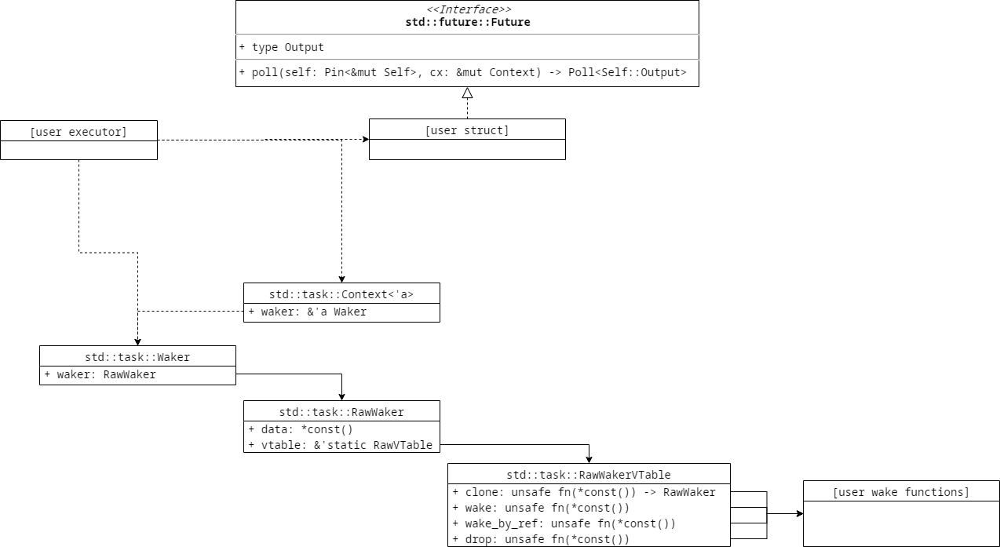
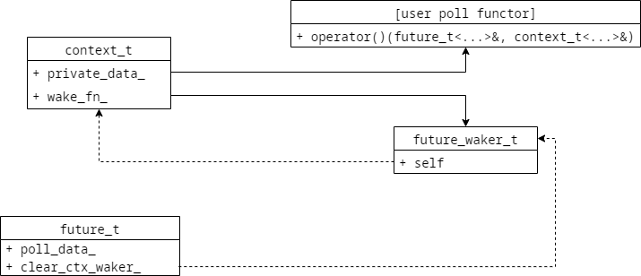
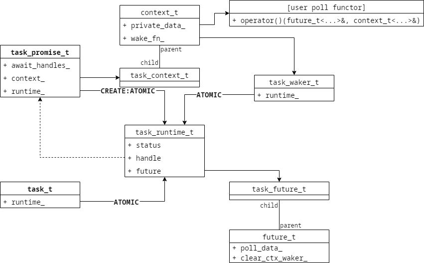
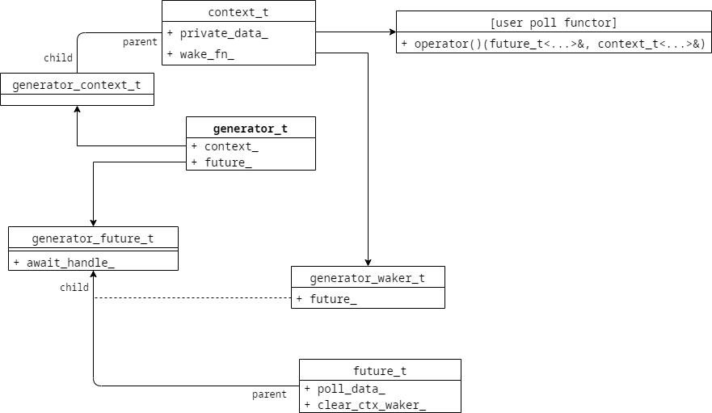
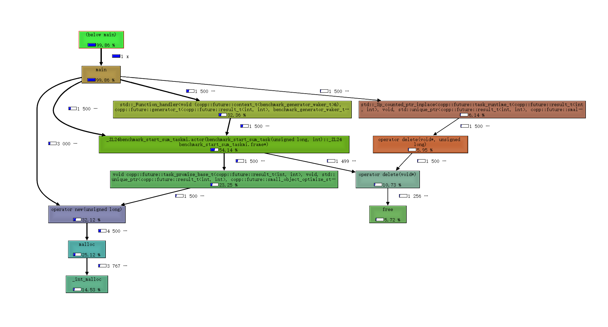
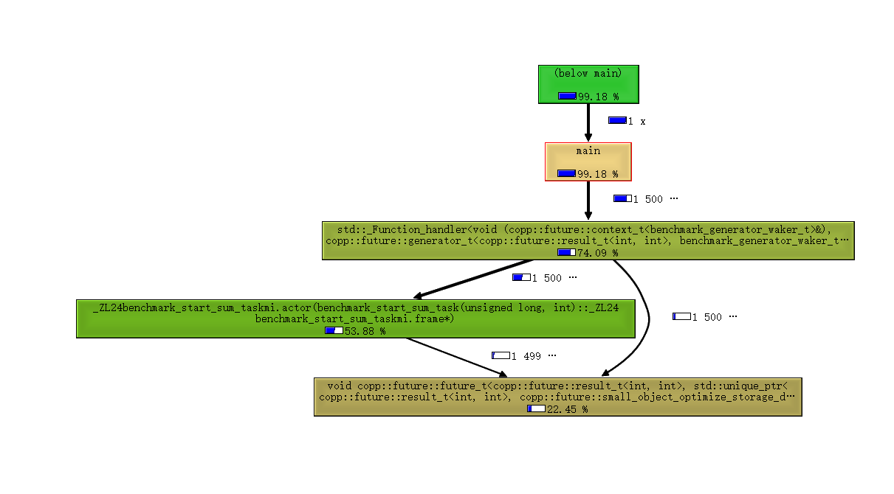

前言
----------------------------------------------

计划给 [libcopp][1] 接入[C++20协程][11]也有一阵子了。最近GCC 10.1.0 发布，主流编译器基本也都支持了这个功能。最近就进行了一些接入的实施。我在设计新的接入模型的时候一方面考虑重点是降低抽象的性能开销，另一方面是想要做到尽可能容易地度过过渡阶段。也就是在C++20正式完全普及之前可以和之前地协程系统配合，并且以后某个时间点切过来足够方便。

设计 [libcopp][1] 接入[C++20协程][11]的结构的时候主要参考了 [Rust语言][9] 里号称零开销抽象的设计（其中一个重要原因是 [Rust][9] 的很多设计哲学和设计思路和C++一样）和 CppCon 2019 上一位演讲者分享的 [cppcoro][6] 。

C++20 协程
----------------------------------------------

C++20的协程基本介绍可以见我之前写得一个小体验 [《C++20 Coroutine》][10] 和 https://en.cppreference.com/ 上的文档 [《Coroutines (C++20)》][11] 。 简单地说， C++20协程主要分为 **函数返回值类型** 、 **存放协程上下文数据的promise_type** 和 **用于判定是否需要切出的awaitable** 。

之前看CppCon 2019的分享视频的时候看到了 [cppcoro][6] 这个库，其实就是一个典型的C++风格的协程封装，增加了一些对各项STL操作和IO更友好的基础设施，没啥太多可说的，有兴趣的小伙伴可以直接去看它的源码。

Rust的零开销抽象协程
----------------------------------------------

为什么要参考 [Rust][9] 的设计呢？[Rust][9] 的很多设计哲学和设计思路和C++一样，并且它的很多设计就是为了解决C++的坑。而且 [Rust][9] 的标准库支持 ```await``` 比较晚，它的标准库协程方面的设计也综合考虑了老的一些库层面的协程实现和新的内置机制的迁移和融合，也考虑了低开销和经过了很多人在很多应用场景上的讨论。和我计划给 [libcopp][1] 当前接入C++20协程的目标是一样的，所以一开始我是想尽可能设计成类似 [Rust][9] 的结构。但是后来分析了一下我发现C++20协程是做不到 [Rust][9] 那样的零开销抽象的，其中一个很重要的原因是 [Rust][9] 引入了生命周期概念，一个对象的生命周期只有一个， 那么比如 ```a.then(b)``` （ ```a``` 和 ```b``` 都是Future）在 [Rust][9] 里的主流实现是创建一个Future ```c``` ，然后把 ```a``` 和 ```b``` move进来。 因为[Rust][9] 可以在编译阶段分析出生命周期，并且一个对象的生命周期只有一个。那么创建 ```a``` 和 ```b``` 对象的时候就可以直接创建在 ```c``` 里，额外创建的 ```c``` 就不会有任何的开销。 而在C++里，虽然现在有move和右值，但是这个其实说白了只是个约定和编译器提供的一种非强制性语义。要实现把 ```a``` 和 ```b``` move进来这种操作，多多少少还是有开销的，如果 ```a``` 和 ```b``` 地址不变就得分配在堆上，就有堆管理和至少一个 ```unique_ptr``` 的开销，如果分配在栈上，那要执行整个 ```a``` 和 ```b``` 的move构造或者move赋值。两种方法都是只能做到降低开销但无法做到零开销。

同时，我个人觉得 [Rust][9] 的抽象在运行时性能和无缝迁移的 **我全都要** 的设计，导致接入和理解成本太高，而且所有的调用组合最终都是一个大 Future，里面包含了很多子Future，这导致每一种调用方式都是一个全新的模板实例化，对编译器的负担太重了。我们来看个最简单的接入的例子:

```rust
use std::future::Future;
use std::task::{Poll, Context, Waker, RawWaker, RawWakerVTable};
use std::pin::Pin;
use std::boxed::Box;
use std::sync::mpsc::{channel,Receiver,Sender};

// ============== 用户调度层接入 ==============
struct MessageEvent {
    tx: Sender<i32>,
    waker: Waker
}

// 因为全局变量访问默认不是线程安全，不标记unsafe无法直接访问
// Mutex不能静态构造，使用 lazy_static 模块再加Mutex可以把这里的全局变量访问转为safe的
static mut USER_DISPATCHER: Option<MessageEvent> = Option::None;

// 用于异步调用层接入
struct Message {
    rx: Option<Receiver<i32>>
}

impl Future for Message {
    type Output = i32;
    fn poll(self: Pin<&mut Self>, ctx: &mut Context) -> Poll<Self::Output> {
        if let Some(ref rx) = self.rx {
            if let Ok(x) = rx.try_recv() {
                Poll::Ready(x)
            } else {
                Poll::Pending
            }
        } else {
            let (tx, rx) = channel();
            unsafe {
                self.get_unchecked_mut().rx = Some(rx);
                USER_DISPATCHER = Some(MessageEvent{
                    tx: tx,
                    waker: ctx.waker().clone()
                });
            }
            Poll::Pending
        }
    }
}

// ============== 使用者示例 ==============
async fn call_1() {
    let msg = Message {
        rx: Option::None
    };

    println!("await and got {}!", msg.await);
}

// ============== 框架调度层接入 ==============
struct TaskData {
    waker: Option<Waker>,
    future: * mut Pin<Box<dyn Future<Output = ()>>>
}

// 因为全局变量访问默认不是线程安全，不标记unsafe无法直接访问
// Mutex不能静态构造，使用 lazy_static 模块再加Mutex可以把这里的全局变量访问转为safe的
static USER_WAKER_VTABLE: RawWakerVTable = RawWakerVTable::new(
    user_clone_fn, user_wake_fn, user_wake_by_ref_fn, user_drop_fn
);

struct Executor {
    future: Option<Pin<Box<dyn Future<Output = ()>>>>
}

fn user_clone_fn(d: *const ()) -> RawWaker {
    println!("clone!");
    RawWaker::new(d, &USER_WAKER_VTABLE)
}

fn user_wake_fn(task: *const ()) {
    println!("wake!");
    // 这里透传参数是裸指针，只能unsafe了，
    unsafe {
        if let Some(ref waker) = (*(task as *mut TaskData)).waker {
            let mut context = &mut Context::from_waker(&waker);
            let _ = (*(*(task as *mut TaskData)).future).as_mut().poll(&mut context);
        }
    }
}

fn user_wake_by_ref_fn(_: *const ()) {
    println!("wake_by_ref!");
}

fn user_drop_fn(_: *const ()) {
    println!("drop!");
}

impl Executor {
    fn run(&mut self) {
        if let Some(future) = self.future.as_mut() {
            // 准备协程任务数据
            let mut tast_data = TaskData {
                waker: Option::None,
                future: 0 as * mut Pin<Box<dyn Future<Output = ()>>>
            };
            let waker = unsafe{
                Waker::from_raw(
                    RawWaker::new((&mut tast_data as * mut TaskData) as *const (), &USER_WAKER_VTABLE)
                )
            };
            tast_data.waker = Some(waker);
            tast_data.future = future as * mut Pin<Box<dyn Future<Output = ()>>>;
            tast_data.waker.unwrap().clone().wake(); // First poll

            unsafe {
                // 模拟有数据
                if let Some(ref evt) = USER_DISPATCHER {
                    let _ = evt.tx.send(200);
                    evt.waker.clone().wake();
                }
            }
        }
    }
}

fn main() {
    println!("Hello, world!");
    let future = call_1();
    let mut exec = Executor {
        future: Some(Box::pin(future)) /*转入到堆上分配*/
    };
    exec.run();
}
```

大致的结构如下:



有兴趣的童鞋可以去 https://play.rust-lang.org/?version=stable&mode=debug&edition=2018&gist=ea8c97f972905513afd5e7044841e97b 这里自己看运行结果。

libcopp对 C++20 协程的设计抽象
----------------------------------------------

### 为平滑迁移而设计的 future_t 、 poll_t 和 context_t

C++并没有在语言层面保证生命周期唯一性，如果为了防止误用和生命周期混乱，要么引入引用计数来保证生命周期得可靠性，要么禁止复制。我们这里为了减少不必要的开销选择了禁止复制。

提供的基本组件如下:

+ ```future_t<T>``` : 用户数据层抽象，指示未来完成以后返回类型 ```T```
+ ```poll_t<T>``` :  ```future_t<T>``` 中的存储结构， 提供了低开销的 **转移** 语义、is_ready语义、存储结构和一系列辅助函数。 有点像 [Rust][9] 里的 ```std::option::Option<T>``` : 同时提供了C++的低开销的存储结构、转移、赋值和小对象优化等等，下面会提到。
+ ```context_t<TPD>``` : 用户调度层抽象，用于创建用户自定义类型(```TPD```)的执行状态机和通过提供构造、析构等函数提供功能性接口。
+ ```TPD::operator(...)``` : 用户异步调用事件通知抽象，用来通知 ```future_t<T>``` 的状态变化和如何变化。目前的设计中， ```future_t<T>::poll(context_t<TPD>)``` 也会自动设置 ```context_t<TPD>``` 的wake行为，并且最终回调到 ```TPD::operator(...)```

按目前的设计，引入 [C++20协程][11] 以后几乎不需要修改接入代码，接入样例如下:

```cpp
#include <assert.h>
#include <iostream>
#include <list>

#include <libcopp/future/future.h>
#include <libcopp/future/context.h>

// 自定义成功的数据类型
struct example_result_message_t {
    int return_code;
    int response_code;
};
struct example_poller;

// libcopp中提供一个比较通用的组件 copp::future::result_t , 用于辅助管理future的成功/失败的存储和内部的数据结构
typedef copp::future::result_t<
    example_result_message_t, // future执行成功的数据类型
    int                       // future执行失败的数据类型，假设是错误码
> example_result_t;
typedef copp::future::future_t<example_result_t> example_future_t;
typedef copp::future::context_t<example_poller> example_context_t;

std::list<example_context_t*> g_executor;

struct example_poller {
    example_result_t::storage_type* result;
    std::list<example_context_t*>::iterator iter;
    example_poller(): result(NULL) {
        iter = g_executor.end();
    }
    ~example_poller() {
        // 如果未产生消息就结束了，清理数据
        // 相当于Rust的Waker里的drop接口
        if (iter != g_executor.end()) {
            g_executor.erase(iter);
        }
    }
    void operator()(example_future_t& future, example_context_t &ctx) {
        // 类似于Rust的Future里的poll接口
        // 第一次调用poll的时候，我们会自动设置ctx的wake接口来再次触发到这里
        if (NULL != result) {
            // 给 poll_data 赋值即为标记future为ready状态。
            future.poll_data() = *result;
            result = NULL;
            // 已经调度完了，就可以移除
            if (iter != g_executor.end()) {
                g_executor.erase(iter);
                iter = g_executor.end();
            }
        } else {
            // 第一次执行poll，加入到等待事件的列表
            if (iter == g_executor.end()) {
                iter = g_executor.insert(g_executor.end(), &ctx);
            }
        }
    }
};

int main() {
    copp::future::future_t<example_result_t> future;
    example_context_t context;

    assert(future.is_ready() == false);

    // 第一次调用poll函数会自动绑定context的wake行为为继续回调这个future.poll(context)
    // 所以用户要保证一个future对象只能poll同一个context对象
    future.poll(context);

    while (!g_executor.empty()) {
        example_result_message_t msg;
        // 虚拟的自定义消息，假定这里RPC返回了
        msg.return_code = 0;
        msg.response_code = 200;
        // 如果成功的数据类型和失败的数据类型都是trivial的而且都很小，那么storage_type会是result_t本身
        // 否则storage_type会是std::unique_ptr<result_t>
        // 无论哪种情况， result_t::make_success(msg) 和 result_t::make_error(msg) 都会返回一个正确的可以直接转移给
        //     future 内 poll_data() 的类型（也就是 storage_type）。
        example_result_t::storage_type result_storage = example_result_t::make_success(msg);
        (*g_executor.begin())->get_private_data().result = &result_storage;
        // 调用wake函数会再次触发上面的operator()，使用者不用关心这里的调用流程
        (*g_executor.begin())->wake();
    }

    // Then future is ready
    assert(future.is_ready() == true);
    example_result_t* result = future.data();
    assert(result != NULL);
    
    assert(result->is_success());
    assert(200 == result->get_success()->response_code);
    assert(false == result->is_error());
    assert(NULL == result->get_error());

    std::cout<< "Got future success response code: "<< result->get_success()->response_code<< std::endl;
    return 0;
}
```

看起来代码也不少，实际上就下面这个结构:



我们提供了更多呃辅助工具以适应各种使用场景的，更多详情见[libcopp dev分支][12]的单元测试 https://github.com/owt5008137/libcopp/blob/dev/test/case/future_and_std_coroutine_test.cpp 和 [README][12] 。

#### 小对象优化

future的实现需要一个重要的设施，那就是在未完成前是空状态，完成后需要把执行的结果 **转移** 到future中。那么为了一方面高效地实现 **转移** 语义，另一方面对小数据对象又不想分配在堆上浪费开销。所以我们在实际决定future内的poll_type的存储结构时会根据对象的大小(未来也可能修订这个大小的限定，但是如果使用下面提到的 ```result_t``` 的话用户层接口可以不变)以及是否是trivial来决定是否走小对象优化。这个优化有点像 [```std::string``` 的 SSO 机制](https://shaharmike.com/cpp/std-string/) 。对于大的数据结构或者非trivial的数据结构，poll_type中我们采用 ```std::unique_ptr<T, std::default_delete<T> >``` 来保存。对于 ```result_t``` 中的数据，我们采用 ```std::shared_ptr<T>``` 来保存。

### ```copp::future::result_t<成功类型,错误类型>```

在实际项目中，我们对一段future代码执行结果最通用的设计就是成功了怎么怎么样，然后失败了怎么怎么样。另外由于上面提到的小对象优化，给我们future的结果的数据类型和用户的使用上带来了一定的复杂度。为了解决这个问题，我在 [libcopp][1] 中引入了 ```copp::future::result_t<成功类型,错误类型>``` 的辅助类。这里面会根据自定义类型的具体情形来决定使用哪种存储结构，也提供了函数来取成功或失败的数据结构和状态。功能类似 [Rust][9] 的 ```std::result::Result``` 。

然后 ```result_t``` 额外提供了 ```result_t::make_success(...)``` 和 ```result_t::make_error(...)``` 来创建可以直接移动赋值给 ```future_t::poll_type``` 的简化接口。

### 协程任务 task_t

后面就是按[C++20协程][11]的方式接入，可以做到接入层不需要改变。整体结构设计如下：



上面有一些数据结构是为了嵌套 ```co_await``` 而存在，自动记录了引用关系。然后在使用过程中，我们定义协程函数就很简单了：

```cpp
copp::future::task_t<int> call_for_coroutine_fn_runtime_trivial() {
    // ... any code
    co_return 123;
}

copp::future::task_t<void> call_for_coroutine_fn_runtime_void() {
    // ... any code
    co_return;
}
```

更多的细节可以参照 [libcopp dev分支][12] 的单元测试 https://github.com/owt5008137/libcopp/blob/dev/test/case/future_and_std_coroutine_test.cpp 和 [README][12]

### 生成器 generator_t

其实 [C++20协程][11] 创建开销还是比较高的。很多情况下我们只是需要提供调度层机制在RPC或者慢操作完成以后通知协程恢复，这时候就不必要去创建一个协程。于是 [libcopp][1] 里还提供了一个 ```copp::future::generator_t<T, TPD>``` 对象。用于提供统一的方式接入 ```co_await``` 。大致结构如下:



### 我们来个完整的example

```cpp
#include <assert.h>
#include <iostream>
#include <string>

// include manager header file
#include <libcopp/future/std_coroutine_task.h>
#include <libcopp/future/std_coroutine_generator.h>

// 定义一个自定义的消息类型，作为异步调用的结果，这里是非trivial类型
struct sample_message_t {
    int ret_code;
    std::string response;
};

struct sample_generator_waker_t;

typedef copp::future::result_t<sample_message_t, int32_t> sample_result_t;
typedef copp::future::task_t<sample_result_t>             sample_task_t;
typedef copp::future::generator_future_t<sample_result_t> sample_future_t;
typedef copp::future::generator_context_t<sample_generator_waker_t> sample_generator_context_t;


std::list<std::pair<sample_generator_context_t *, std::string> > g_sample_executor;

struct sample_generator_waker_t {
    int32_t code;
    std::list<std::pair<sample_generator_context_t *, std::string> >::iterator refer_to;

    // 所有传给 generator_t 的参数都会被透传过来
    // 如果允许接受和忽略任意参数且仅在协程函数里使用，可以申明一个 template<class... ARGS> 构造函数然后仅仅忽略参数
    sample_generator_waker_t(int32_t c) : code(c) {
        refer_to = g_sample_executor.end();
    }

    ~sample_generator_waker_t() {
        // 析构释放资源，如果 generator_t 未完成，但是协程任务被外部 kill 可能会触发强制resume，这时候没有数据，也不会走operator()里的释放流程
        if (refer_to != g_sample_executor.end()) {
            g_sample_executor.erase(refer_to);
        }
    }

    void operator()(sample_future_t &fut, sample_generator_context_t &ctx) {
        if (refer_to == g_sample_executor.end()) {
            // 第一次poll，加入到自定义的调度器
            refer_to = g_sample_executor.insert(
                g_sample_executor.end(),
                std::make_pair(&ctx, std::string())
            );
            return;
        }

        if (!(*refer_to).second.empty()) {
            // 已经获取到数据了，给 fut.poll_data() 赋值然后从调度器移除
            sample_message_t msg;
            msg.ret_code    = code;
            msg.response.swap((*refer_to).second);

            fut.poll_data() = sample_result_t::make_success(std::move(msg));
            // 由于是非trivial类型，这里等同于:
            // auto ptr = std::make_unique<sample_result_t>(sample_result_t::create_success(std::move(msg)));
            // fut.poll_data() = std::move(ptr);

            g_sample_executor.erase(refer_to);
            refer_to = g_sample_executor.end();
        }
    }
};
typedef copp::future::generator_t<sample_result_t, sample_generator_waker_t> sample_generator_t;

static copp::future::task_t<void> call_for_noop_task() {
    co_return;
}

static copp::future::task_t<int> call_for_coroutine_task() {
    // 可以启动一个新的协程任务然后await等它完成
    copp::future::task_t<void> t = call_for_noop_task();
    co_await t;

    // 也可以启动一个低消耗的异步generator并等它完成
    sample_generator_t generator = copp::future::make_generator<sample_generator_t>(200);
    auto result = co_await generator;

    if (result) {
        if (result->is_success()) {
            std::cout<< "Got response message: "<< result->get_success()->response<< std::endl;
            co_return result->get_success()->ret_code;
        } else {
            co_return *result->get_error();
        }
    }
    co_return 0;
}

int main() {
    copp::future::task_t<int> t = call_for_coroutine_task();
    assert(false == t.done());
    assert(NULL == t.data());  // 任务未结束没有data数据

    while (!g_sample_executor.empty()) {
        // 模拟异步任务完成，并且产生了消息
        g_sample_executor.begin()->second = "Hello World!";
        g_sample_executor.begin()->first->wake();
    }

    assert(t.done());
    assert(t.data()); // 任务结束后就有data了
    std::cout<< "Task "<< t.get_task_id()<< " finished and got result: "<< *t.data()<< std::endl;
    return 0;
}
```

这里看起来好像和 [Rust][9] 的流程差不多。实际上还是有很大区别，[Rust][9] 的协程是一个包含关系，而 [C++20协程][11] 是链式的关系。一个最显著的特点就是在 [C++20协程][11] 里一个协程 ```co_await``` 另一个协程的时候，被 ```co_await``` 的协程收到事件处理上下文并且负责完成以后resume到上一级协程。 而 [Rust][9] 的协程本质上是 Future 的嵌套，所有的poll操作都是从最外层的调用方开始的。这里影响到我们对协程的封装上最直观的结果简单来说就是 [Rust][9] 的协程的 ```Context``` 和 ```Waker``` 由框架层封装，并且由于封装度高且复杂，多个框架之间的设计模型有差异的话可能很难混用；而 [libcopp][1] 对 [C++20协程][11] 的封装的 ```context_t<T>``` 由异步调用接口创建，并且对系统框架的调度层几乎没有要求，也支持其他的协程模型和 [libcopp][1] 混用。[libcopp][1] 和 [C++20协程][11] 的选择是用比较低的开销换取了灵活性，接入一个异步调用虽然会创建更多的对象，但是都是底层自动完成的且放在一起以减少碎片，同时对生命周期的管理做了一定的防误用。这当然也和 [libcopp][1] 的尽量防止被误用和误用情况下尽可能保证安全的设计原则有关。

下面是一个对比，假设异步调用的结果是 ```RpcResult``` ，自定义用户调度层接入类型为 ```RpcCall``` :

| 对比项                     | [Rust][9] 协程                                              | [libcopp][1] + [C++20协程][11]                                                    |
|:--------------------------:|:-----------------------------------------------------------:|:---------------------------------------------------------------------------------:|
| 异步调用系统底层创建的对象 | 符合 ```traits Future<Output=RpcResult>``` 的 ```RpcCall``` | ```future_t<RpcResult>``` 、```context_t<RpcCall>``` 和用户自定数据 ```RpcCall``` |
| 异步调用用户层接口         | 调用方创建 ```RpcCall```                                    | 调用方创建 ```generator_t<RpcResult,RpcCall>```                                   |
| 异步调用调度层接入         | 实现 ```RpcCall``` 的 ```poll() -> Poll<RpcResult>``` 接口  | 实现 ```RpcCall::operator(future, context)```                                     |
| Waker和Future绑定关系      | 由框架调度层实现                                            | 自动绑定，用户调度层可修改替换                                                    |
| 协程组织结构               | **has-a 关系** ，重入有低开销，组织管理无开销               | 链式关系，重入几乎零开销，组织管理低开销                                          |
| Context/Waker生命周期      | 跟随异步任务，多个异步调用可以复用同一个Waker               | 跟随异步调用                                                                      |
| 异步任务系统底层创建的对象 | 现有的实现里大部分由额外的Task对象和管理层对象              | 比异步调用多 ```task_t<RpcResult, RpcCall>``` 、```runtime_t<RpcResult, RpcCall>``` 和```task_t<RpcResult, RpcCall>::promise_type``` |
| 异步任务用户层接口         | 比异步调用多一个对Future的生命周期管理（一般会包到```Pin<Box<Future<Output=RpcResult>>>``` 里丢到堆上）| 调用方函数返回 ```task_t<RpcResult,RpcCall>```                                    |
| 异步任务调度层接入         | 非常复杂，设计多个对象的生命周期管理和调度入口管理          | 很简单，也可以使用 ```task_t<RpcResult, void>``` 来实现零接入                     |
| 异步任务超时和错误管理     | 只能依赖await前嵌套timeout future实现，必须转换成相同的输出类型 | 允许外部总控超时和错误，对父子模块间无类型要求                                |
| 多个框架融合               | 非常复杂，要合并多个框架的调度入口、事件管理和生命周期管理  | 只要符合 [C++20协程][11] 规范，无需额外接入                                       |

同样更多的使用细节可以参照 [libcopp dev分支][12] 的单元测试 https://github.com/owt5008137/libcopp/blob/dev/test/case/future_and_std_coroutine_test.cpp 和 [README](https://github.com/owt5008137/libcopp/tree/dev)

### 压力测试

压力测试机器环境:

| 环境名称                         | 值                                                  |
|----------------------------------|-----------------------------------------------------|
| 系统                             | Linux kernel 3.10.107(Docker)                       |
| CPU                              | Intel(R) Xeon(R) Gold 61xx CPU @ 2.50GHz \* 48      |
| L1 Cache                         | 64Bytes\*64sets\*8ways=32KB                         |
| 系统负载                         | 1.67 0.56 0.30                                      |
| 内存占用                         | 23GB(used)/125GB(sum)                               |
| CMake                            | 3.17.0                                              |
| GCC版本                          | 10.1.0                                              |
| Clang版本                        | 10.0.0                                              |
| libcopp                          | dev分支(20200520)                                   |
| librf                            | master分支(20200519)                                |


我对profile初步分析了一下开销占比发现创建task时的new runtime、no trivial对象走的new和其他一些 ```new/delete/malloc/free``` 的开销占比比较大。而我们主要还是要测试协程的开销，并且我们的项目中也会使用 [jemalloc][7] 来替换掉默认的内存分配器。所以跑压力测试的时候跑了两个版本，左边是编译器自带的 ```malloc/free``` 实现的开销，右边是是有 [jemalloc][7] 时的开销。

| 组件(Avg)                            | 协程数：1 切换开销 | 协程数：1000 创建开销 | 协程数：1000 切换开销 | 协程数：30000 创建开销 | 协程数：30000 切换开销 |
|--------------------------------------|--------------------|-----------------------|-----------------------|------------------------|------------------------|
| C++20 Coroutine - Clang              |  5 ns              |  130 ns               |    6 ns               | 136 ns                 |    9 ns                |
| C++20 Coroutine - GCC                |  7 ns              |  146 ns               |    7 ns               | 120 ns                 |    9 ns                |
| [librf][8](C++20 Coroutine) - Clang  | 310 ns / 292 ns    |  252 ns / 245 ns      |   29 ns / 29 ns       | 281 ns / 229ns         |   33 ns / 31 ns        |
| [libcopp+动态栈池][1]                | 32 ns              |   96 ns               |   77 ns               | 212 ns                 |  213 ns                |
| [libcopp+libcotask+动态栈池][1]      | 49 ns              |  134 ns               |  134 ns               | 256 ns                 |  371 ns                |
| libcopp future_t - GCC               | 4 ns  / 4 ns       |  26 ns / 25 ns        |   4 ns / 4 ns         | 30 ns / 30 ns          |   9 ns / 5 ns          |
| libcopp future_t(no trivial) - GCC   | 4 ns  / 4 ns       |  26 ns / 24 ns        |   4 ns / 4 ns         | 26 ns / 31 ns          |   6 ns / 5 ns          |
| libcopp task_t - GCC                 | 21 ns / 23 ns      |  120 ns / 118 ns      |   25 ns / 25 ns       | 122 ns / 131 ns        |   35 ns / 33 ns        |
| libcopp task_t(no trivial) - GCC     | 41 ns / 32 ns      |  112 ns / 120 ns      |   41 ns / 32 ns       | 122 ns / 131 ns        |   50 ns / 38 ns        |
| libcopp future_t - Clang             | 5 ns / 5 ns        |  30 ns / 30 ns        |   5 ns / 5 ns         | 30 ns / 35 ns          |   7 ns / 6 ns          |
| libcopp future_t(no trivial) - Clang | 7 ns / 7 ns        |  30 ns / 30 ns        |   7 ns / 7 ns         | 30 ns / 37 ns          |   8 ns / 8 ns          |
| libcopp task_t - Clang               | 24 ns / 24 ns      |  237 ns / 142 ns      |   24 ns / 24 ns       | 357 ns / 156 ns        |   44 ns / 33 ns        |
| libcopp task_t(no trivial) - Clang   | 53 ns / 44 ns      |  257 ns / 155 ns      |   53 ns / 45 ns       | 357 ns / 175 ns        |   70 ns / 61 ns        |

上面 [librf][8] 是另一个使用[C++20协程][11]的封装库，仅用它自带的工具，用一样的编译选线给出压力测试结果对比。上面还提供了使用 [libcopp][1] 传统有栈协程的开销对比。和其他一些常用协程库比如 [libco][15] 、 [libgo][14] 、 goroutine 等的对比可以见我之前一篇分享: [《C++20 Coroutine 性能测试 (附带和libcopp/libco/libgo/goroutine/linux ucontext对比)》][13]

最后测出来的创建 ```task_t``` 的开销分布如下:



最后测出来的切换（创建 ```generator_t``` ）的开销分布如下:



从结果来看，使用 [jemalloc][7] 后创建开销已经比较贴近原始的协程调用了，优化空间不大，毕竟设计模式还是有一定损耗的。但是切换开销目前 [libcopp][1] 的切换开销比裸调用原始API大，主要原因有两个。一是 ```generator_t``` 仍然有创建 ```context_t``` 和 ```future_t``` 还有 ```用户层waker``` 对象的开销；另一方面是wake接口会过一层 ```std::function``` + ```future_t::poll_as``` + ```context_t::poll_as``` + ```用户层waker::operator()``` 导致对inline和cache命中不友好。这方面还有优化空间，不过优化出来也只是跑分好看而已。 压力测试中是复用了 ```generator_t``` 对象多次产出数据，如果每次都创建新的 ```generator_t``` 平均开销会增大 ```10-20ns``` 。

来个直观点的对比图(不带 [jemalloc][7] 版本):


{
  "type": "bar",
  "data": {
    labels: ['协程数:1,栈大小16KB', '协程数:1000,栈大小2MB', '协程数:30000,栈大小64KB'],
    "datasets": [ {
      "label": "C++20 Coroutine - Clang 切换耗时",
      "borderColor": "rgba(139, 0, 0, 1)",
      "fill": false,
      "yAxisID": 'y-axis-2',
      "data": [5, 6, 9],
      "type": 'line'
    }, {
      "label": "C++20 Coroutine - MSVC 切换耗时",
      "borderColor": "rgba(0, 0, 139, 1)",
      "fill": false,
      "yAxisID": 'y-axis-2',
      "data": [10, 14, 28],
      "type": 'line'
    }, {
      "label": "librf(C++20 Coroutine) - Clang 切换耗时",
      "borderColor": "rgba(0, 139, 139, 1)",
      "fill": false,
      "yAxisID": 'y-axis-2',
      "data": [null, 29, 33],
      "type": 'line'
    }, {
      "label": "libcopp+动态栈池 切换耗时",
      "borderColor": "rgba(184, 134, 11, 1)",
      "fill": false,
      "yAxisID": 'y-axis-2',
      "data": [32, 77, 213],
      "type": 'line'
    }, {
      "label": "libcopp+libcotask+动态栈池 切换耗时",
      "borderColor": "rgba(189, 183, 107, 1)",
      "fill": false,
      "yAxisID": 'y-axis-2',
      "data": [49, 134, 371],
      "type": 'line'
    }, {
      "label": "libcopp future_t - GCC 切换耗时",
      "borderColor": "rgba(139, 0, 139, 1)",
      "fill": false,
      "yAxisID": 'y-axis-2',
      "data": [4, 4, 9],
      "type": 'line'
    }, {
      "label": "libcopp future_t(no trivial) - GCC 切换耗时",
      "borderColor": "rgba(85, 107, 47, 1)",
      "fill": false,
      "yAxisID": 'y-axis-2',
      "data": [4, 4, 6],
      "type": 'line'
    }, {
      "label": "libcopp task_t - GCC 切换耗时",
      "borderColor": "rgba(255, 140, 0, 1)",
      "fill": false,
      "yAxisID": 'y-axis-2',
      "data": [23, 25, 35],
      "type": 'line'
    }, {
      "label": "libcopp task_t(no trivial) - GCC 切换耗时",
      "borderColor": "rgba(153, 50, 204, 1)",
      "fill": false,
      "yAxisID": 'y-axis-2',
      "data": [41, 41, 50],
      "type": 'line'
    }, {
      "label": "libcopp future_t - Clang 切换耗时",
      "borderColor": "rgba(233, 150, 122, 1)",
      "fill": false,
      "yAxisID": 'y-axis-2',
      "data": [5, 5, 7],
      "type": 'line'
    }, {
      "label": "libcopp future_t(no trivial) - Clang 切换耗时",
      "borderColor": "rgba(143, 188, 143, 1)",
      "fill": false,
      "yAxisID": 'y-axis-2',
      "data": [7, 7, 8],
      "type": 'line'
    }, {
      "label": "libcopp task_t - Clang 切换耗时",
      "borderColor": "rgba(255, 20, 147, 1)",
      "fill": false,
      "yAxisID": 'y-axis-2',
      "data": [24, 24, 44],
      "type": 'line'
    }, {
      "label": "libcopp task_t(no trivial) - Clang 切换耗时",
      "borderColor": "rgba(72, 61, 139, 1)",
      "fill": false,
      "yAxisID": 'y-axis-2',
      "data": [53, 53, 70],
      "type": 'line'
    }, {
      "label": "C++20 Coroutine - Clang 创建耗时",
      "backgroundColor": "rgba(255, 0, 0, 1)",
      "yAxisID": 'y-axis-1',
      "data": [null, 130, 136]
    }, {
      "label": "C++20 Coroutine - MSVC 创建耗时",
      "backgroundColor": "rgba(0, 0, 255, 1)",
      "yAxisID": 'y-axis-1',
      "data": [null, 407, 369]
    }, {
      "label": "librf(C++20 Coroutine) - Clang 创建耗时",
      "backgroundColor": "rgba(0, 255, 255, 1)",
      "yAxisID": 'y-axis-1',
      "data": [null, 252, 281]
    }, {
      "label": "libcopp+动态栈池 创建耗时",
      "backgroundColor": "rgba(218, 165, 32, 1)",
      "yAxisID": 'y-axis-1',
      "data": [null, 96, 212]
    }, {
      "label": "libcopp+libcotask+动态栈池 创建耗时",
      "backgroundColor": "rgba(240, 230, 140, 1)",
      "yAxisID": 'y-axis-1',
      "data": [null, 134, 256]
    }, {
      "label": "libcopp future_t - GCC 创建耗时",
      "backgroundColor": "rgba(255, 0, 255, 1)",
      "yAxisID": 'y-axis-1',
      "data": [null, 26, 30]
    }, {
      "label": "libcopp future_t(no trivial) - GCC 创建耗时",
      "backgroundColor": "rgba(128, 128, 0, 1)",
      "yAxisID": 'y-axis-1',
      "data": [null, 26, 26]
    }, {
      "label": "libcopp task_t - GCC 创建耗时",
      "backgroundColor": "rgba(255, 165, 0, 1)",
      "yAxisID": 'y-axis-1',
      "data": [null, 120, 122]
    }, {
      "label": "libcopp task_t(no trivial) - GCC 创建耗时",
      "backgroundColor": "rgba(218, 112, 214, 1)",
      "yAxisID": 'y-axis-1',
      "data": [null, 112, 122]
    }, {
      "label": " libcopp future_t - Clang 创建耗时",
      "backgroundColor": "rgba(250, 128, 114, 1)",
      "yAxisID": 'y-axis-1',
      "data": [null, 30, 30]
    }, {
      "label": "libcopp future_t(no trivial) - Clang 创建耗时",
      "backgroundColor": "rgba(46, 139, 87, 1)",
      "yAxisID": 'y-axis-1',
      "data": [null, 30, 30]
    }, {
      "label": "libcopp task_t - Clang 创建耗时",
      "backgroundColor": "rgba(106, 90, 205, 1)",
      "yAxisID": 'y-axis-1',
      "data": [null, 237, 357]
    }, {
      "label": "libcopp task_t(no trivial) - Clang 创建耗时",
      "backgroundColor": "rgba(112, 128, 144, 1)",
      "yAxisID": 'y-axis-1',
      "data": [null, 257, 357]
    }]
  },
  "options": {
      title: {
        display: true,
        text: '切换/创建耗时（越小越好）'
    },
      scales: {
        yAxes: [{
            type: 'linear',
            display: true,
            scaleLabel: {
                display: true,
                labelString: "切换耗时（单位：纳秒）"
            },
            position: 'left',
            id: 'y-axis-2',
            gridLines: {
                drawOnChartArea: false
            },
            ticks: {
                callback: function(value, index, values) {
                    return value + ' ns';
                }
            }
        }, {
            type: 'logarithmic',
            display: true,
            scaleLabel: {
                display: true,
                labelString: "创建耗时（单位：纳秒）"
            },
            ticks: {
                autoSkip: true,
                callback: function(value, index, values) {
                    for (var idx in values) {
                        var tv = values[idx];
                        if (tv < value && Math.floor(Math.log(value)) == Math.floor(Math.log(tv))) {
                            return null;
                        }
                    }
                    return value + ' ns';
                }
            },
            position: 'right',
            id: 'y-axis-1',
        }],
    }
  }
}


再来个直观点的带 [jemalloc][7] 版本的对比图，带上 [jemalloc][7] 之后对clang编译的结果影响比较大:


{
  "type": "bar",
  "data": {
    labels: ['协程数:1,栈大小16KB', '协程数:1000,栈大小2MB', '协程数:30000,栈大小64KB'],
    "datasets": [ {
      "label": "C++20 Coroutine - Clang 切换耗时",
      "borderColor": "rgba(139, 0, 0, 1)",
      "fill": false,
      "yAxisID": 'y-axis-2',
      "data": [5, 6, 9],
      "type": 'line'
    }, {
      "label": "C++20 Coroutine - MSVC 切换耗时",
      "borderColor": "rgba(0, 0, 139, 1)",
      "fill": false,
      "yAxisID": 'y-axis-2',
      "data": [10, 14, 28],
      "type": 'line'
    }, {
      "label": "librf(C++20 Coroutine) - Clang 切换耗时",
      "borderColor": "rgba(0, 139, 139, 1)",
      "fill": false,
      "yAxisID": 'y-axis-2',
      "data": [null, 29, 31],
      "type": 'line'
    }, {
      "label": "libcopp+动态栈池 切换耗时",
      "borderColor": "rgba(184, 134, 11, 1)",
      "fill": false,
      "yAxisID": 'y-axis-2',
      "data": [32, 77, 213],
      "type": 'line'
    }, {
      "label": "libcopp+libcotask+动态栈池 切换耗时",
      "borderColor": "rgba(189, 183, 107, 1)",
      "fill": false,
      "yAxisID": 'y-axis-2',
      "data": [49, 134, 371],
      "type": 'line'
    }, {
      "label": "libcopp future_t - GCC 切换耗时",
      "borderColor": "rgba(139, 0, 139, 1)",
      "fill": false,
      "yAxisID": 'y-axis-2',
      "data": [4, 4, 5],
      "type": 'line'
    }, {
      "label": "libcopp future_t(no trivial) - GCC 切换耗时",
      "borderColor": "rgba(85, 107, 47, 1)",
      "fill": false,
      "yAxisID": 'y-axis-2',
      "data": [4, 4, 5],
      "type": 'line'
    }, {
      "label": "libcopp task_t - GCC 切换耗时",
      "borderColor": "rgba(255, 140, 0, 1)",
      "fill": false,
      "yAxisID": 'y-axis-2',
      "data": [23, 25, 33],
      "type": 'line'
    }, {
      "label": "libcopp task_t(no trivial) - GCC 切换耗时",
      "borderColor": "rgba(153, 50, 204, 1)",
      "fill": false,
      "yAxisID": 'y-axis-2',
      "data": [32, 32, 38],
      "type": 'line'
    }, {
      "label": "libcopp future_t - Clang 切换耗时",
      "borderColor": "rgba(233, 150, 122, 1)",
      "fill": false,
      "yAxisID": 'y-axis-2',
      "data": [5, 5, 6],
      "type": 'line'
    }, {
      "label": "libcopp future_t(no trivial) - Clang 切换耗时",
      "borderColor": "rgba(143, 188, 143, 1)",
      "fill": false,
      "yAxisID": 'y-axis-2',
      "data": [7, 7, 8],
      "type": 'line'
    }, {
      "label": "libcopp task_t - Clang 切换耗时",
      "borderColor": "rgba(255, 20, 147, 1)",
      "fill": false,
      "yAxisID": 'y-axis-2',
      "data": [24, 24, 33],
      "type": 'line'
    }, {
      "label": "libcopp task_t(no trivial) - Clang 切换耗时",
      "borderColor": "rgba(72, 61, 139, 1)",
      "fill": false,
      "yAxisID": 'y-axis-2',
      "data": [44, 45, 61],
      "type": 'line'
    }, {
      "label": "C++20 Coroutine - Clang 创建耗时",
      "backgroundColor": "rgba(255, 0, 0, 1)",
      "yAxisID": 'y-axis-1',
      "data": [null, 130, 136]
    }, {
      "label": "C++20 Coroutine - MSVC 创建耗时",
      "backgroundColor": "rgba(0, 0, 255, 1)",
      "yAxisID": 'y-axis-1',
      "data": [null, 407, 369]
    }, {
      "label": "librf(C++20 Coroutine) - Clang 创建耗时",
      "backgroundColor": "rgba(0, 255, 255, 1)",
      "yAxisID": 'y-axis-1',
      "data": [null, 245, 229]
    }, {
      "label": "libcopp+动态栈池 创建耗时",
      "backgroundColor": "rgba(218, 165, 32, 1)",
      "yAxisID": 'y-axis-1',
      "data": [null, 96, 212]
    }, {
      "label": "libcopp+libcotask+动态栈池 创建耗时",
      "backgroundColor": "rgba(240, 230, 140, 1)",
      "yAxisID": 'y-axis-1',
      "data": [null, 134, 256]
    }, {
      "label": "libcopp future_t - GCC 创建耗时",
      "backgroundColor": "rgba(255, 0, 255, 1)",
      "yAxisID": 'y-axis-1',
      "data": [null, 25, 30]
    }, {
      "label": "libcopp future_t(no trivial) - GCC 创建耗时",
      "backgroundColor": "rgba(128, 128, 0, 1)",
      "yAxisID": 'y-axis-1',
      "data": [null, 24, 31]
    }, {
      "label": "libcopp task_t - GCC 创建耗时",
      "backgroundColor": "rgba(255, 165, 0, 1)",
      "yAxisID": 'y-axis-1',
      "data": [null, 118, 131]
    }, {
      "label": "libcopp task_t(no trivial) - GCC 创建耗时",
      "backgroundColor": "rgba(218, 112, 214, 1)",
      "yAxisID": 'y-axis-1',
      "data": [null, 120, 131]
    }, {
      "label": " libcopp future_t - Clang 创建耗时",
      "backgroundColor": "rgba(250, 128, 114, 1)",
      "yAxisID": 'y-axis-1',
      "data": [null, 30, 35]
    }, {
      "label": "libcopp future_t(no trivial) - Clang 创建耗时",
      "backgroundColor": "rgba(46, 139, 87, 1)",
      "yAxisID": 'y-axis-1',
      "data": [null, 30, 37]
    }, {
      "label": "libcopp task_t - Clang 创建耗时",
      "backgroundColor": "rgba(106, 90, 205, 1)",
      "yAxisID": 'y-axis-1',
      "data": [null, 142, 156]
    }, {
      "label": "libcopp task_t(no trivial) - Clang 创建耗时",
      "backgroundColor": "rgba(112, 128, 144, 1)",
      "yAxisID": 'y-axis-1',
      "data": [null, 155, 175]
    }]
  },
  "options": {
      title: {
        display: true,
        text: '切换/创建耗时（越小越好）'
    },
      scales: {
        yAxes: [{
            type: 'linear',
            display: true,
            scaleLabel: {
                display: true,
                labelString: "切换耗时（单位：纳秒）"
            },
            position: 'left',
            id: 'y-axis-2',
            gridLines: {
                drawOnChartArea: false
            },
            ticks: {
                callback: function(value, index, values) {
                    return value + ' ns';
                }
            }
        }, {
            type: 'logarithmic',
            display: true,
            scaleLabel: {
                display: true,
                labelString: "创建耗时（单位：纳秒）"
            },
            ticks: {
                autoSkip: true,
                callback: function(value, index, values) {
                    for (var idx in values) {
                        var tv = values[idx];
                        if (tv < value && Math.floor(Math.log(value)) == Math.floor(Math.log(tv))) {
                            return null;
                        }
                    }
                    return value + ' ns';
                }
            },
            position: 'right',
            id: 'y-axis-1',
        }],
    }
  }
}


### 原task对象的接入

现在的实现中，[C++20协程][11]可以 ```co_await``` 原来老的 ```cotask::task<T>``` 。反过来有个想法是 ```task_action::operator()``` 返回 ```copp::future::task_t``` 的话就可实现反过来的 ```co_await``` 。但是要兼容以前的函数签名得模板写得比较调皮，而且也只能支持一层。暂时还没决定好要怎么写。现在支持的向前兼容的形式如下:

```cpp
#include <iostream>

#include <libcopp/future/std_coroutine_task.h>
#include <libcotask/task.h>

#if defined(LIBCOPP_MACRO_ENABLE_STD_COROUTINE) && LIBCOPP_MACRO_ENABLE_STD_COROUTINE

typedef cotask::task<> my_task_t;

static copp::future::task_t<int> call_for_await_cotask(my_task_t::ptr_t t) {
    if (t) {
        co_return co_await t;
    }

    co_return 0;
}

static int cotask_action_callback(void *) {
    int ret = 234;
    void* ptr = nullptr;
    cotask::this_task::get_task()->yield(&ptr);
    if (ptr != nullptr) {
        ret = *reinterpret_cast<int*>(ptr);
    }
    return ret;
}

int main() {
    my_task_t::ptr_t co_task = my_task_t::create(cotask_action_callback);

    auto t = call_for_await_cotask(co_task);
    co_task->start();

    int res = 345;
    co_task->resume(reinterpret_cast<void*>(&res));

    if (nullptr != t.data()) {
        std::cout<< "co_await a cotask::task and get result: "<< *t.data()<< std::endl;
    }
    return 0;
}
```

GCC 10.1.0 的坑
----------------------------------------------

### 符号问题

我发现在 **GCC 10.1.0** 中，如果多个文件可能会引用到协程库的时候，链接时会报类似这样的错误

```bash
C:/msys64/mingw64/bin/../lib/gcc/x86_64-w64-mingw32/10.1.0/../../../../x86_64-w64-mingw32/bin/ld.exe: CMakeFiles/libcopp_unit_test.dir/objects.a(future_and_std_coroutine_test2.cpp.obj): in function `std::__n4861::__dummy_resume_destroy()':
C:/msys64/mingw64/include/c++/10.1.0/coroutine:222: multiple definition of `.weak._ZNSt7__n486122__dummy_resume_destroyEv._ZnwyPv'; CMakeFiles/libcopp_unit_test.dir/objects.a(future_and_std_coroutine_test.cpp.obj):C:/msys64/mingw64/include/c++/10.1.0/coroutine:222: first defined here
[100%] Built target libcopp_sample_readme_3
C:/msys64/mingw64/bin/../lib/gcc/x86_64-w64-mingw32/10.1.0/../../../../x86_64-w64-mingw32/bin/ld.exe: CMakeFiles/libcopp_unit_test.dir/objects.a(future_and_std_coroutine_test2.cpp.obj):future_and_std_coroutine_test2.cpp:(.data+0x0): multiple definition of `.weak._ZNSt7__n486114__noop_coro_frE._ZnwyPv'; CMakeFiles/libcopp_unit_test.dir/objects.a(future_and_std_coroutine_test.cpp.obj):D:/workspace/github/libcopp/test/frame/test_manager.h:130: first defined here
```

看提示和出错的符号名感觉应该是引用到的相关头文件应该要生成弱符号，结果生成了强符号导致链接不过。这个问题仅在Windows上出现（我的测试环境是MSYS2带的MinGW64环境， GCC 10.1.0 ），Linux下正常。初步查了下Windows下输出的中间文件 ```.obj``` 中生成了代码（T）符号和弱（W）符号。而在Linuxia只生成了弱（W）符号。看涉及的符号名感觉是GCC的BUG，猜测是GCC 10.1.0实现生成的符号可见性有点问题，我没有过多地深究。

### 生命周期和析构

本来受 [cppcoro][6] 的启发，想实现这样的使用接口。 ```auto poll_data = co_await copp:future::make_generator<T, TPD>(...);``` 。然后 ```poll_data``` 指向 ```copp:future::poll_t<T>``` 来获取协程数据结果。 这里有两个临时对象，一个是 ```generator_t``` ， 另一个是 await ```generator_t``` 时产生的 ```awaitable_t``` 。 为了减少分配开销，我们的context和future对象都直接分配在 ```generator_t``` 里，然后 ```generator_t``` 禁止复制和禁止转移， 并且在 ```awaitable_t``` 的 ```await_resume``` 接口里通过右值构造临时对象转移数据。
这个流程在 MSVC 上是可行的，但是在GCC里 ```awaitable_t``` 挂起之前，临时的 ```generator_t``` 会被析构掉。这回导致context和future对象被释放。 所以为了性能考虑，最终还是只允许稍微繁琐一点的使用方式。

```cpp
auto generator = copp:future::make_generator<T, TPD>(...);
auto future_data = co_await generator;
if (nullptr != future_data && future_data->is_ready()) {
  // ...
}
```

同样，这个问题和导致的使用上的限制在 ```copp:future::task_t``` 上也一样。

写在最后
----------------------------------------------

至此 [libcopp][1] 对 [C++20协程][11] 的接入就初步完成了。后面有空还可以加一些语法糖类的辅助工具，迭代器支持，manager接入之类的。这就后续有空再说了。欢迎有兴趣的童鞋们一起交流。

[1]: https://github.com/owt5008137/libcopp/
[2]: https://rust-lang.github.io/async-book/
[3]: https://doc.rust-lang.org/std/future/trait.Future.html
[4]: https://doc.rust-lang.org/std/task/struct.Context.html
[5]: https://doc.rust-lang.org/std/task/struct.Waker.html
[6]: https://github.com/lewissbaker/cppcoro
[7]: https://github.com/jemalloc/jemalloc
[8]: https://github.com/tearshark/librf
[9]: https://www.rust-lang.org/
[10]: https://owent.net/2019/1904.html
[11]: https://en.cppreference.com/w/cpp/language/coroutines
[12]: https://github.com/owt5008137/libcopp/tree/dev
[13]: https://owent.net/2019/1911.html
[14]: https://github.com/yyzybb537/libgo
[15]: https://github.com/Tencent/libco
