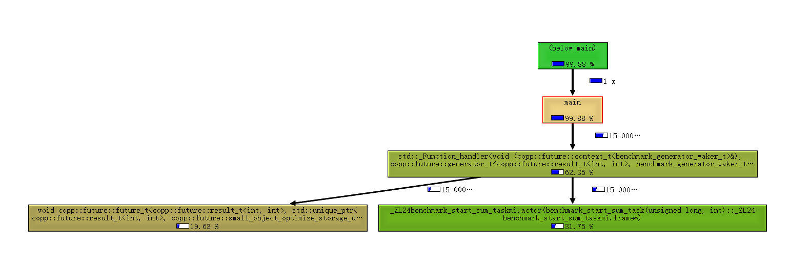

Rust的零开销抽象协程
----------------------------------------------

C++20 协程
----------------------------------------------

libcopp对 C++20 协程的设计抽象
----------------------------------------------

### 为平滑迁移而设计的 future_t、poll_t和context_t

接入样例和目标

#### 小对象优化

### 协程任务 task_t

### 生成器 generator_t

### 压力测试

压力测试机器环境:

| 环境名称                         | 值                                                  |
|----------------------------------|-----------------------------------------------------|
| 系统                             | Linux kernel 3.10.107(Docker)                       |
| CPU                              | Intel(R) Xeon(R) Gold 61xx CPU @ 2.50GHz \* 48      |
| L1 Cache                         | 64Bytes\*64sets\*8ways=32KB                         |
| 系统负载                         | 1.67 0.56 0.30                                      |
| 内存占用                         | 23GB(used)/125GB(sum)                               |
| CMake                            | 3.17.0                                              |
| GCC版本                          | 10.1.0                                              |
| Clang版本                        | 10.0.0                                              |
| libcopp                          | dev分支                                             |


我对profile初步分析了一下开销占比发现创建task时的new runtime、no trivial对象走的new和其他一些 ```new/delete/malloc/free``` 的开销占比比较大。而我们主要还是要测试协程的开销，并且我们的项目中也会使用 [jemalloc][7] 来替换掉默认的内存分配器。所以跑压力测试的时候跑了两个版本，左边是编译器自带的 ```malloc/free``` 实现的开销，右边是是有 [jemalloc][7] 时的开销。

| 组件(Avg)                            | 协程数：1 切换开销 | 协程数：1000 创建开销 | 协程数：1000 切换开销 | 协程数：30000 创建开销 | 协程数：30000 切换开销 |
|--------------------------------------|--------------------|-----------------------|-----------------------|------------------------|------------------------|
| C++20 Coroutine - Clang              |  5 ns              |  130 ns               |    6 ns               | 136 ns                 |    9 ns                |
| C++20 Coroutine - GCC                |  7 ns              |  146 ns               |    7 ns               | 120 ns                 |    9 ns                |
| C++20 Coroutine - MSVC               | 10 ns              |  407 ns               |   14 ns               | 369 ns                 |   28 ns                |
| [libcopp][1]                         | 34 ns              |  4.1 us               |   80 ns               | 3.8 us                 |  223 ns                |
| [libcopp+动态栈池][1]                | 32 ns              |   96 ns               |   77 ns               | 212 ns                 |  213 ns                |
| [libcopp+libcotask][1]               | 50 ns              |  4.1 us               |  141 ns               | 4.2 us                 |  389 ns                |
| [libcopp+libcotask+动态栈池][1]      | 49 ns              |  134 ns               |  134 ns               | 256 ns                 |  371 ns                |
| libcopp future_t - GCC               | 4 ns  / 4 ns       |  28 ns / 28 ns        |   4 ns / 4 ns         | 31 ns / 35 ns          |   9 ns / 5 ns          |
| libcopp future_t(no trivial) - GCC   | 4 ns  / 4 ns       |  28 ns / 26 ns        |   4 ns / 4 ns         | 27 ns / 32 ns          |   6 ns / 5 ns          |
| libcopp task_t - GCC                 | 36 ns / 36 ns      |  112 ns / 120 ns      |   36 ns / 36 ns       | 140 ns / 127 ns        |   48 ns / 41 ns        |
| libcopp task_t(no trivial) - GCC     | 54 ns / 41 ns      |  112 ns / 120 ns      |   53 ns / 43 ns       | 140 ns / 130 ns        |   70 ns / 51 ns        |
| libcopp future_t - Clang             | 6 ns / 6 ns        |  30 ns / 30 ns        |   5 ns / 5 ns         | 32 ns / 35 ns          |   8 ns / 6 ns          |
| libcopp future_t(no trivial) - Clang | 7 ns / 7 ns        |  30 ns / 30 ns        |   7 ns / 7 ns         | 30 ns / 38 ns          |   8 ns / 7 ns          |
| libcopp task_t - Clang               | 36 ns / 36 ns      |  260 ns / 138 ns      |   35 ns / 35 ns       | 370 ns / 158 ns        |   60 ns / 58 ns        |
| libcopp task_t(no trivial) - Clang   | 64 ns / 51 ns      |  255 ns / 153 ns      |   62 ns / 53 ns       | 360 ns / 172 ns        |   78 ns / 73 ns        |

最后测出来的创建 ```task_t``` 的开销分布如下:


最后测出来的切换（创建 ```generator_t``` ）的开销分布如下:



### 原task对象的接入

GCC 10.1.0 的坑
----------------------------------------------

### 符号问题

我发现在 **GCC 10.1.0** 中，如果多个文件可能会引用到协程库的时候，链接时会报类似这样的错误

```bash
C:/msys64/mingw64/bin/../lib/gcc/x86_64-w64-mingw32/10.1.0/../../../../x86_64-w64-mingw32/bin/ld.exe: CMakeFiles/libcopp_unit_test.dir/objects.a(future_and_std_coroutine_test2.cpp.obj): in function `std::__n4861::__dummy_resume_destroy()':
C:/msys64/mingw64/include/c++/10.1.0/coroutine:222: multiple definition of `.weak._ZNSt7__n486122__dummy_resume_destroyEv._ZnwyPv'; CMakeFiles/libcopp_unit_test.dir/objects.a(future_and_std_coroutine_test.cpp.obj):C:/msys64/mingw64/include/c++/10.1.0/coroutine:222: first defined here
[100%] Built target libcopp_sample_readme_3
C:/msys64/mingw64/bin/../lib/gcc/x86_64-w64-mingw32/10.1.0/../../../../x86_64-w64-mingw32/bin/ld.exe: CMakeFiles/libcopp_unit_test.dir/objects.a(future_and_std_coroutine_test2.cpp.obj):future_and_std_coroutine_test2.cpp:(.data+0x0): multiple definition of `.weak._ZNSt7__n486114__noop_coro_frE._ZnwyPv'; CMakeFiles/libcopp_unit_test.dir/objects.a(future_and_std_coroutine_test.cpp.obj):D:/workspace/github/libcopp/test/frame/test_manager.h:130: first defined here
```

看提示和出错的符号名感觉应该是引用到的相关头文件应该要生成弱符号，结果生成了强符号导致链接不过。这个问题仅在Windows上出现（我的测试环境是MSYS2带的MinGW64环境， GCC 10.1.0 ），Linux下正常。初步查了下Windows下输出的中间文件 ```.obj``` 中生成了代码（T）符号和弱（W）符号。而在Linuxia只生成了弱（W）符号。看涉及的符号名感觉是GCC的BUG，猜测是GCC 10.1.0实现生成的符号可见性有点问题，我没有过多地深究。

### 生命周期和析构

[1]: https://github.com/owt5008137/libcopp/
[2]: https://rust-lang.github.io/async-book/
[3]: https://doc.rust-lang.org/std/future/trait.Future.html
[4]: https://doc.rust-lang.org/std/task/struct.Context.html
[5]: https://doc.rust-lang.org/std/task/struct.Waker.html
[6]: https://github.com/lewissbaker/cppcoro
[7]: https://github.com/jemalloc/jemalloc
