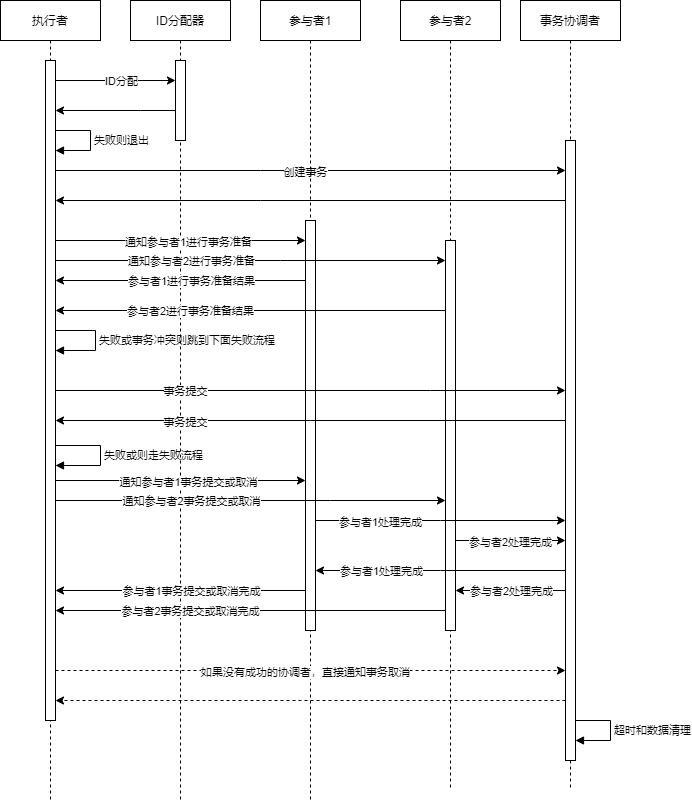

前言
----------------------------------------------

游戏业务通常有个特点是模块相关性非常高，模块之间的联动也非常密集且复杂。要保持各个相关模块的数据一致性，同时又兼顾效率和，没有一个通用的方法。通常的做法是走有损服务（也叫柔性服务）和自动修复的方式。比如支付服务一般的做法是在2PC的基础上增加redo log，对于发放和订单确认这两方，如果失败了会尝试几次补发。又或者好友系统或者公会，因为涉及多个对象的数据相互索引，一些做法是玩家在线的时候定期去检查数据是否正确，如果不正确走修复流程。

我去年的时候看了下Google的一些分布式系统的分布式事务的设计的论文（[《Google去中心化分布式系统论文三件套(Percolator、Spanner、F1)读后感》][2]），感觉上也挺适合游戏业务中某些系统的使用场景。所以在我们现在的项目中就做了一些尝试，对一些系统引入了分布式事务的设计，主要目的还是为了解决数据一致性，并且提供可大规模平行扩容的能力。

基本流程和通用分布式事务服务器
----------------------------------------------

其实分布式事务的本质是把事务的成功与否收敛到单点上，也就是需要唯一的 **协调者** 。然后执行方要支持TCC (Try-Commit/Cancel)操作。简单得描述流程如下：

1. 创建事务,分配事务ID（两次数据库操作，一次分配ID，一次创建）
2. 所有参与者预提交阶段(Try，1次RPC)
3. 事务提交（Commit/Cancel，1次RPC+1次数据库操作）
4. 通知所有参与者提交成功/失败（2次RPC）
5. 所有参与者确认提交成功后删除事务（数据库操作）
6. 如果没有参与者成功，执行者直接通知事务 **协调者** 清理事务（1次RPC+1次数据库操作）

[Percolator][^Percolator] 的论文里有伪代码，写得比较清楚易懂。它的 **Try** 阶段叫 **Prewrite** 。

为了尽可能地抽象和简化分布式事务的接入，我们把分布式事务的流程划分成了上面也提到过的三个角色： **参与者** 、 **执行者** 、 **协调者** 。

+ **执行者** 是事务的发起方，也是执行事务的推动方，负责创建事务、通知 **参与者** 执行状态等；
+ **参与者** 即是不同事务事件处理的执行方，一个事务可能涉及多种不同类型的参与者和事务事件操作，参与者自己要实现事务的retry和超时retry流程；
+ **协调者** 即是如上面提到的，收敛事务的最终状态。以 **协调者** 对事务的操作结果为准，来断定事务是否成功执行。同时 **协调者** 也负责事务的数据清理。

在我们的系统中，提供了 **执行者** 流程模板。执行阶段，我们会使用一个全局唯一ID分配器来分配事务ID，并创建事务数据，这个流程和执行过程中的检查、超时、通知流程都是统一的。同时我们提供了统一的 **协调者** 服务，用于管理事务数据。这样，业务模块要接入分布式事务，仅仅需要实现 **参与者** 流程即可，相对来说，这个流程实现就比较简单了。

比较完整的流程时序图如下:



实现分布式事务需要所有参与者实现事务操作的 [幂等性][3] ( $$f(f(x)) = f(x)$$ ) 。说人话就是执行一次和执行N次，的效果相同。在事务系统中还要更进一步，要至少保证最终一致性。为了达到这个目标，一般不同的系统有不同的取舍和方案，这在我的另一篇文章中 [《Anna（支持任意扩展和超高性能的KV数据库系统）阅读笔记 - 主流分布式KVS的比较》](https://owent.net/2019/1905.html#%E4%B8%BB%E6%B5%81%E5%88%86%E5%B8%83%E5%BC%8Fkvs%E7%9A%84%E6%AF%94%E8%BE%83) 有一些简单的总结。

在传统存储系统中，这个 [幂等性][3] 的事务操作比较容易抽象统一，因为存储系统的操作无非是增删改查，其中删比较特殊复杂一些（ **GFS**[^gfs] 的论文有提及）。而在 [Percolator][^Percolator] 系统中，主要是Google的索引系统，它的模块间关系更加简单一些，只是需要触发被依赖的模块更新而已。

而在游戏项目中，这个关系就比较复杂，因为涉及多方和多种不同的逻辑。比如移除好友时可能也要清理多个账户上好友间的其他交互数据（邀请、通知、分享等），玩家被批准加入公会后可能要保证这个玩家加入其他公会的申请失效，而此时玩家可能并不在线，者就涉及不同的业务模块（也就是 **参与者** ）需要根据自身的业务特性来实现这个 [幂等性][3] ，实现的内容和策略都大相径庭。

在我们目前实现的事务 **参与者** 实现中，均采用给事务数据操作单元分配一个递增的事件ID（ ```event_id``` ）来实现，这个ID仅仅和某个力度很小的逻辑模块数据单元有关（比如每个玩家的好友数据块上都有自己的事件ID分配器，多个玩家之间的分配器之间不会相互影响；同一个玩家的好友和公会数据之间也不会互相影响）。在业务逻辑中，我们会处理事务关联关系，并在逻辑模块数据单元里记录下最后执行的事务的事件ID。因为无论什么数据，到最基础的逻辑也都是增删改查，只是不同类型数据的关联关系和逻辑条件不一样而已。对于删除的数据，我们会保留一段时间，这个时间至少要大于事务的超时时间+N次自动retry的时间+时间误差。这样，我们就可以仅根据事件ID的大小来决定事务的流程是需要执行还是忽略。同时我们还增加了数据块级别的事件ID，这个数据块级别的事件ID和逻辑模块数据单元里记录的事件ID的关系有点像数据库的行级锁和数据列的关系。

业务补偿： event_id

容灾和负载均衡
----------------------------------------------

1. 参与者再超时时去事务服务器拉取事务状态
  > 1.1 Not  Found
  > 1.2 Commited
  > 1.2 Abort

协调者无状态，类似 [Wound-wait][1] 策略。

对于玩家对象我们有一些特殊对待，因为它由网关层决定在哪个gamesvr节点上拉起。如果在执行事务的过程中玩家对象被需要在其他节点上拉起，则需要引入一些列的锁、超时管理等机制，因为事务执行的RPC次数比较多，如果事务执行延迟比较大，也会增加登入时的稳定性。所以为了避免这些麻烦，我们目前的玩家对象（gamesvr上）不作为事务的参与者，只能作为执行者。目前我们的服务器实现中，对好友服务和公会服务实施了分布式事务支持。

垃圾处理
----------------------------------------------

一些对比
----------------------------------------------

|           特性      |                    我们的分布式事务服务                  |               Google Percolator                  |               Google Spanner                        |
|---------------------|----------------------------------------------------------|--------------------------------------------------|-----------------------------------------------------|
| 事件ID/事件版本号   | 池化分配，按服务对象key分布式事件版本号,设计QPS>1亿/s    | 全服单点timestamp oracle服务，QPS大约200万/s     | TrueTime时间戳服务                                  |
| 协调者              | 专用协调者服务器                                         | 固定算法，指定一个参与事务执行者做协调者         | Paxos算法选举Leader做协调者                         |
| 脏数据/垃圾清理     | 协调者服务器定期清理，下一次GET/SET时清理                | 下一次GET/SET时清理                              | 下一次GET/SET时清理                                 |
| 底层存储            | 任意内存数据库(比如redis)                                | BigTable                                         | BigTable                                            |
| 延迟                | 每个事务4次DB请求，1次内部RPC，每个参与者3次内部RPC      | 索引服务，延迟不敏感                             | 26-200ms                                            |
| QPS                 | 依赖服务器间通信和底层存储，设计QPS>=1亿/s               | 对比BigTable，读事务\*0.94，写事务BigTable\*0.23 | -                                                   |
| 冲突策略            | 根据业务实现，目前业务实现是无锁。[Wound-wait][1]        | 悲观锁，类似 [Wound-wait][1]                     | 只读无锁，读写悲观锁，[Wound-wait]（F1引入了乐观锁）|
| 其他特点            | 适用于多参与者对等接入，适用于多种业务类型，但接入较复杂 | 索引服务，自动化依赖分析和触发依赖事务           | 分布式关系型数据库                                  |

优化
----------------------------------------------

垃圾清理通知


[^paxos]: https://en.wikipedia.org/wiki/Paxos_(computer_science) "Paxos"
[^chubby]: https://ai.google/research/pubs/pub27897 "The Chubby lock service for loosely-coupled distributed systems"
[^gfs]: https://ai.google/research/pubs/pub51 "The Google File System"
[^bigtable]: https://ai.google/research/pubs/pub27898 "Bigtable: A Distributed Storage System for Structured Data "
[^percolator]: https://ai.google/research/pubs/pub36726 "Large-scale Incremental Processing Using Distributed Transactions and Notifications"
[^spanner]: https://ai.google/research/pubs/pub39966 "Spanner: Google's Globally-Distributed Database"
[^f1]: https://ai.google/research/pubs/pub41344 "F1: A Distributed SQL Database That Scales"
[^redis]: https://redis.io "Redis"
[^raft]: https://raft.github.io/ "The Raft Consensus Algorithm"

[1]: https://en.wikibooks.org/wiki/Design_of_Main_Memory_Database_System/Concurrency#8.3.4.1_Dead_Lock_Prevention
[2]: https://owent.net/2019/1902.html
[3]: https://en.wiktionary.org/wiki/idempotent
