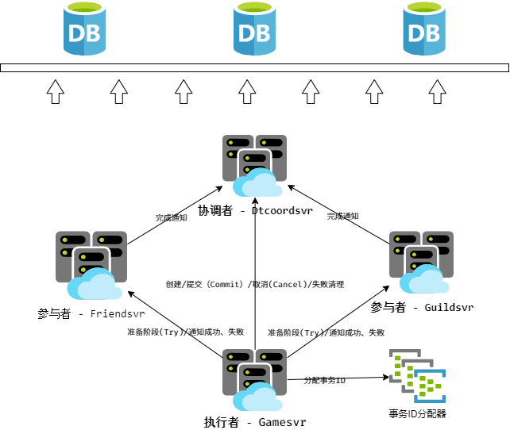

前言
----------------------------------------------

游戏业务通常有个特点是模块相关性非常高，模块之间的联动也非常密集且复杂。要保持各个相关模块的数据一致性，同时又兼顾效率和，没有一个通用的方法。通常的做法是走有损服务（也叫柔性服务）和自动修复的方式。比如支付服务一般的做法是在2PC的基础上增加redo log，对于发放和订单确认这两方，如果失败了会尝试几次补发。又或者好友系统或者公会，因为涉及多个对象的数据相互索引，一些做法是玩家在线的时候定期去检查数据是否正确，如果不正确走修复流程。

我去年的时候看了下Google的一些分布式系统的分布式事务的设计的论文（[《Google去中心化分布式系统论文三件套(Percolator、Spanner、F1)读后感》][2]），感觉上也挺适合游戏业务中某些系统的使用场景。所以在我们现在的项目中就做了一些尝试，对一些系统引入了分布式事务的设计，主要目的还是为了解决数据一致性，并且提供可大规模平行扩容的能力。

基本流程和通用分布式事务服务器
----------------------------------------------

其实分布式事务的本质是把事务的成功与否收敛到单点上，也就是需要唯一的 **协调者** 。然后执行方要支持TCC (Try-Commit/Cancel)操作。简单得描述流程如下：

1. 创建事务,分配事务ID（两次数据库操作，一次分配ID，一次创建）
2. 所有参与者预提交阶段(Try，1次RPC)
3. 事务提交（Commit/Cancel，1次RPC+1次数据库操作）
4. 通知所有参与者提交成功/失败（2次RPC）
5. 所有参与者确认提交成功后删除事务（数据库操作）
6. 如果没有参与者成功，执行者直接通知事务 **协调者** 清理事务（1次RPC+1次数据库操作）

[Percolator][^Percolator] 的论文里有伪代码，写得比较清楚易懂。它的 **Try** 阶段叫 **Prewrite** 。

为了尽可能地抽象和简化分布式事务的接入，我们把分布式事务的流程划分成了上面也提到过的三个角色： **参与者** 、 **执行者** 、 **协调者** 。

+ **执行者** 是事务的发起方，也是执行事务的推动方，负责创建事务、通知 **参与者** 执行状态等；
+ **参与者** 即是不同事务事件处理的执行方，一个事务可能涉及多种不同类型的参与者和事务事件操作，参与者自己要实现事务的retry和超时retry流程；
+ **协调者** 即是如上面提到的，收敛事务的最终状态。以 **协调者** 对事务的操作结果为准，来断定事务是否成功执行。同时 **协调者** 也负责事务的数据清理。

在我们的系统中，提供了 **执行者** 流程模板。执行阶段，我们会使用一个全局唯一ID分配器来分配事务ID，并创建事务数据，这个流程和执行过程中的检查、超时、通知流程都是统一的。同时我们提供了统一的 **协调者** 服务，用于管理事务数据。这样，业务模块要接入分布式事务，仅仅需要实现 **参与者** 流程即可，相对来说，这个流程实现就比较简单了。

比较完整的流程时序图如下:

实现分布式事务需要所有参与者实现事务操作的 [幂等性][3] ( $$f(f(x)) = f(x)$$ ) 。说人话就是执行一次和执行N次，的效果相同。在事务系统中还要更进一步，要至少保证最终一致性。为了达到这个目标，一般不同的系统有不同的取舍和方案，这在我的另一篇文章中 [《Anna（支持任意扩展和超高性能的KV数据库系统）阅读笔记 - 主流分布式KVS的比较》](https://owent.net/2019/1905.html#%E4%B8%BB%E6%B5%81%E5%88%86%E5%B8%83%E5%BC%8Fkvs%E7%9A%84%E6%AF%94%E8%BE%83) 有一些简单的总结。

在传统存储系统中，这个 [幂等性][3] 的事务操作比较容易抽象统一，因为存储系统的操作无非是增删改查，其中删比较特殊复杂一些（ [GFS][^gfs] 的论文有提及）。而在 [Percolator][^Percolator] 系统中，主要是Google的索引系统，它的模块间关系更加简单一些，只是需要触发被依赖的模块更新而已。

而在游戏项目中，这个关系就比较复杂，因为涉及多方和多种不同的逻辑。比如移除好友时可能也要清理多个账户上好友间的其他交互数据（邀请、通知、分享等），玩家被批准加入公会后可能要保证这个玩家加入其他公会的申请失效，而此时玩家可能并不在线，者就涉及不同的业务模块（也就是 **参与者** ）需要根据自身的业务特性来实现这个 [幂等性][3] ，实现的内容和策略都大相径庭。

在我们目前实现的事务 **参与者** 实现中，均采用给事务数据操作单元分配一个递增的事件ID（ `event_id` ）来实现，这个ID仅仅和某个力度很小的逻辑模块数据单元有关（比如每个玩家的好友数据块上都有自己的事件ID分配器，多个玩家之间的分配器之间不会相互影响；同一个玩家的好友和公会数据之间也不会互相影响）。在业务逻辑中，我们会处理事务关联关系，并在逻辑模块数据单元里记录下最后执行的事务的事件ID。因为无论什么数据，到最基础的逻辑也都是增删改查，只是不同类型数据的关联关系和逻辑条件不一样而已。对于删除的数据，我们会保留一段时间，这个时间至少要大于事务的超时时间+N次自动retry的时间+时间误差。通过这种方式，我们就可以仅根据事件ID的大小来决定事务的流程是需要执行还是忽略。

我们还增加了数据块级别的事件ID，这个数据块级别的事件ID和逻辑模块数据单元里记录的事件ID的关系有点像数据库的行级锁和数据列的关系。这有什么作用呢？比如现如今的业务有要求必须提供删除账号的功能，那么怎么判定删除账号和新增或者变更数据的事务同时进行，那么我们怎么判定新增或者变更数据的操作是否要被忽略呢？这时候我们就可以给删除事务的事件ID赋值到数据块级别的事件ID记录。如果后续的事务操作大于这个数据块级别的事件ID则是需要执行的，否则是可以直接忽略的。

即便实现了上述的分布式事务的系统，我们还是少不了传统的 **业务补偿** 逻辑，只是可以简化一些。这是因为在游戏服务器业务中，一般不会有特别高的一致性要求，比如上面这些业务服务器大多数是没有主备的。那么我们还是要有一定的策略来处理执行者认为事务成功，但是执行节点宕机导致的数据一致性问题。这个 **业务补偿** 逻辑就和传统的方案很像了，只是可以比较简单一些，因为这个阶段只是需要保证数据能正常运行，并不特别依赖它作逻辑一致性保证，可以弱化修复流程。

容灾和负载均衡
----------------------------------------------

由于我们用 **分布式池化ID分配器** 来分配事务，所以我们对事务的负载均衡就可以使用事务ID作为一致性Hash的来分发到 **协调者** 服务器上。而 **协调者** 服务是一个带缓存的无状态服务，逻辑也很简单（创建保存、读数据、标记已完成的参与者、如果所有参与者都处理完毕了就清理数据这几种）。所以它的每次操作都是用CAS对内存数据操作，如果CAS返回数据版本过老，则是缓存过期，会重新拉取数据然后尝试retry（类似 [Wait-die][1] 策略，这里 **协调者** 仅仅是记录 **参与者** 的完成情况，不影响事务的结果，所以不存在 [Wait-die][1] 策略通常会有的饥饿的问题）。这里的一致性保证依赖了所使用的内存数据库的一致性保证。 **执行者** 是发起事务的一方，直接使用在业务设计的本身负载均衡策略即可。

前面提到，新的业务模块想要接入这个分布式事务系统的话只需要实现 **参与者** 逻辑即可，实际上 **参与者** 的实现还是有一定要求的。一是上面已经提到过的通过 事件ID（ `event_id` ） 来实现的 [幂等性][3] 保证；二是在对 **协调者** 的通知失败或者不确定成功还是失败时要有retry机制；三是需要在超时的时候去拉取事务状态，然后拉事务状态会有以下这三种结果。

1. Not Found : 视为失败，放弃执行
2. Commited : 事务成功，提交执行
3. Abort : 事务终止，放弃执行

这里特别解释一下 ***Not Found*** 的原因。正常情况下在所有的 **参与者** 收到通知或失败消息后，会通知 **协调者** 它已完成对事务的处理。而 **协调者** 在收到所有参与者的完成通知后，会对事务做清理，即从数据库里移除。而 **执行者** 创建完事务后要通知所有 **参与者** 进行 **Try** 阶段，只要  **参与者** 进行了 **Try** 阶段，那么 **参与者** 一定会通知到 **协调者** 最后清理数据。但是如果 **执行者** 第一次通知 **参与者** 进行 **Try** 阶段失败了，或者不知道是否失败，那么 **执行者** 无法知道 **参与者** 是否真的执行了这个请求，如果 **参与者** 没有执行到 **Try** 阶段，那这个事务就只要会有一个 **参与者** 没有完成，如果不处理就会导致事务数据泄露。所以如果 **执行者** 通知所有 **参与者** 进行 **Try** 阶段有任意的失败的话， **执行者** 会直接执行删除事务的操作。

对于玩家对象我们有一些特殊对待，因为它由网关层决定在哪个gamesvr节点上拉起。如果在执行事务的过程中玩家对象被需要在其他节点上拉起，则需要引入一些列的锁、超时管理等机制，因为事务执行的RPC次数比较多，如果事务执行延迟比较大，也会增加登入时的稳定性。所以为了避免这些麻烦，我们目前的玩家对象（gamesvr上）不作为事务的 **参与者** ，只能作为 **执行者** 。目前我们的服务器实现中，对好友服务和公会服务实施了分布式事务支持。

我们目前实现的服务结构和关系如下：

简单对比
----------------------------------------------

我们简单的和 [Percolator][^percolator] 和 [Spanner][^spanner] 的分布式事务做一个对比如下：

|           特性      |                    我们的分布式事务服务                  |               Google Percolator                  |               Google Spanner                                                   |
|---------------------|----------------------------------------------------------|--------------------------------------------------|--------------------------------------------------------------------------------|
| 事件ID/事件版本号   | 池化分配，按服务对象key分布式事件版本号,设计QPS>1亿/s    | 全服单点timestamp oracle服务，QPS大约200万/s     | TrueTime时间戳服务                                                             |
| 协调者              | 专用 **协调者** 服务器                                   | 固定算法，指定一个参与事务执行者做协调者         | Paxos算法选举Leader做 **协调者**                                               |
| 脏数据/垃圾清理     | **参与者** 服务器定期清理，下一次GET/SET时清理           | 下一次GET/SET时恢复/清理，定期扫描               | **参与者** 超时清理。切换 **协调者** leader时，新leader负责恢复/清理未完成事务 |
| 底层存储            | 任意支持CAS的内存Key-Value数据库(比如 [redis][^redis] )  | [BigTable][^bigtable]                            | [BigTable][^bigtable]                                                          |
| 延迟                | 每个事务4次DB请求，1次内部RPC，每个参与者3次内部RPC      | 索引服务，延迟不敏感                             | 26-200ms                                                                       |
| QPS                 | 依赖服务器间通信和底层存储                               | 对比BigTable，读事务\*0.94，写事务BigTable\*0.23 | -                                                                              |
| 冲突策略            | 根据业务实现，目前业务实现是无锁                         | 悲观锁，Get前清理失效事务                        | 只读无锁，读写悲观锁，[Wound-wait][1]（F1引入了乐观锁）                        |
| 一致性保证          | 目前业务实现是每个Key独立的递增事件ID，协调者CAS         | 锁记录操作的节点，Chubby锁服务记录节点存活       | 依赖TrueTime时间戳，服务器间低延迟和安全时间 \\\( T\_{safe} \\\)               |
| 其他特点            | 适用于多参与者对等接入，适用于多种业务类型，但接入较复杂 | 索引服务，自动化依赖分析和触发依赖事务           | 分布式关系型数据库                                                             |

我们的无锁是业务特性+简化设计导决定的。如果实现得更严谨一些，还是应该走乐观锁的流程然后走 [Wound-wait][1] 策略解决冲突。举个例子，比如我们的公会功能有多个管理员，一个管理员同意某个人加入公会的同时另一个管理员拒绝了，这种情况下严格的做法是按先后顺序（即按事件ID（ `event_id` ） ），先锁加锁然后后请求的失败。而我们这里会直接返回 *其他管理员正在操作中，请稍后...* ，然后在 **Try** 阶段会直接失败掉。这样能省去定时器和稍后重试和解死锁的逻辑，能够极大地降低复杂度。但是这显然是和业务相关的，并不是所有的业务形式都可以这么做，具体还是得根据业务需求来抉择。

后续的优化
----------------------------------------------

分布式事务的细节优化点其实非常多，在我们目前的系统中主要还有两个方向的优化。第一是上面提到的更严谨的事务加锁流程。第二是我们目前的事务完成完全是 **参与者** 驱动的，那么如果 **参与者** 所在机器如果宕机了，并且没有再上线的话（比如特别是玩家流失以后），那么 **协调者** 就会一直收不到 **参与者** 的完成通知，就会遗留一些事务数据一直处于没有清理的状态。 目前我的想法是后续加一个定时任务，定期扫描出超时很久并且未完成的事务，然后通知 **参与者** 拉起对应数据块继续把事务执行完，可能会和 [Percolator][^percolator] 里的定期扫描比较像。因为事务表数据库只会保存正在进行未完成的事务数据，所以即便全表扫描数据量也不会很大，而且如果数据库支持快照的话可以从快照里读，也不会影响正在运行的业务。

最后，欢迎有兴趣的小伙伴们一起交流，如果文中有什么偏差的地方欢迎指正。

[^paxos]: https://en.wikipedia.org/wiki/Paxos_(computer_science) "Paxos"
[^chubby]: https://ai.google/research/pubs/pub27897 "The Chubby lock service for loosely-coupled distributed systems"
[^gfs]: https://ai.google/research/pubs/pub51 "The Google File System"
[^bigtable]: https://ai.google/research/pubs/pub27898 "Bigtable: A Distributed Storage System for Structured Data "
[^percolator]: https://ai.google/research/pubs/pub36726 "Large-scale Incremental Processing Using Distributed Transactions and Notifications"
[^spanner]: https://ai.google/research/pubs/pub39966 "Spanner: Google's Globally-Distributed Database"
[^f1]: https://ai.google/research/pubs/pub41344 "F1: A Distributed SQL Database That Scales"
[^redis]: https://redis.io "Redis"
[^raft]: https://raft.github.io/ "The Raft Consensus Algorithm"

[1]: https://en.wikibooks.org/wiki/Design_of_Main_Memory_Database_System/Concurrency#8.3.4.1_Dead_Lock_Prevention
[2]: https://owent.net/2019/1902.html
[3]: https://en.wikipedia.org/wiki/Idempotence#Computer_science_meaning
