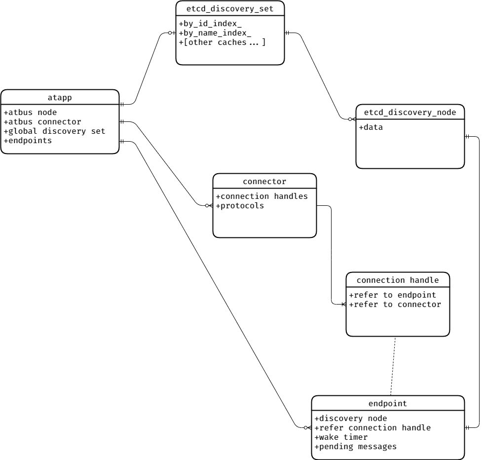

最近给 [libatapp][6] 增加了一系列改造，非常多且琐碎，这里简单记录下吧。

首先是重构了配置管理。原来是手写在代码里的，因为原来上层的 [libatbus][5] 是不依赖 [protobuf][10] 的，现在 既然已经依赖 [protobuf][10] 了就转为 [protobuf][10] 管理了。同时现在还支持YAML配置，使用 [yaml-cpp][9] 来解析YAML文件，这个库也被一些其他知名的大型项目使用了，比如 [Envoy proxy][1] 。 原来的conf/ini模式的配置也是支持的，现在加载配置的时候会尝试猜测以下配置文件是yaml还是conf/ini模式。 并且增加了统一的 *YAML转[protobuf][10]* 、 *conf/ini转[protobuf][10]* 和 *指定层级配置导出到[protobuf][10]* 的接口来方便使用。比较特殊的是自定义日志配置后端的接入接口有了一些小变化，问题也不大。

另外增加了统一的服务发现组件，并且增加了简单的对端管理和连接管理。并且支持自定义接入层实现，只要地址符合 ```协议名://地址[:端口]``` 这种形式即可。这些改动一方面是根据我们目前项目中一些结构和设计的变化，另一方面是为了未来可能接入 [Service Mesh][8] 做准备。

最后是重构了构建系统，修复了一些libwebsockets、libcurl和openssl/libressl在modern cmake构建系统下的版本兼容问题，现在还会导入常用压缩库 zlib、lz4 和 zstd。另外还导入了grpc和其依赖的几个组件。可以和 [atsf4g-co][7] 里的构建系统搭配使用。

> 列举一下openssl相关的主要修订内容:
> 
> + libwebsockets 会直接导入openssl的库文件，而项目中如果有其他组件使用了modern cmake中 ```OpenSSL::Crypto``` 或者 ```OpenSSL::SSL``` 这两个target会导致重复链接和依赖顺序错乱。所以我对 libwebsockets 的导出target打了patch，把直接的加密库替换成 ```OpenSSL::Crypto``` 和 ```OpenSSL::SSL```。
> + libcurl 则是还不支持最新的openssl 的 API Level 3.0 ，所以构建的时候目前只能强制 API Level设置到 1.1.1
> + [grpc][11] 使用到了 某些在 API Level 1.1.0及以后deprecated的API，只能通过设置 API Level 到 1.0.2 或以关掉编译openssl的 ```no-deprecated``` 选项来解决。我这里是关掉了以前编译openssl的 ```no-deprecated``` 选项。

## 服务发现

服务发现其实是把之前 [atsf4g-co][7] 里的 component 挪到了 [libatapp][6] 中，另外增加了 **服务发现组** 的模块，并且支持绑定私有数据。这个目的是可以根据项目需要自定义定制化的服务发现功能。考虑到以后可能接入一些更复杂的使用场景，服务发现模块内置了一些和其他系统搭配的预留字段。比如预留了 ```atapp_metadata``` 用于可能以后接入 [kubernetes][2] 之类的服务治理， 预留了 ```atapp_area``` 用于可能以后支持按地域的节点亲和性。

默认的服务发现组提供了一些基本的查询策略，包含 **按名字** 、 **按ID** 、 **随机** 、 **Round-Robin** 和 **一致性Hash** 。整个索引构建也是 lazy-evolution 的，即当有节点变化时仅在第一次接口调用的时候才会重建索引。实现的接口在 https://github.com/atframework/libatapp/blob/master/include/atframe/etcdcli/etcd_discovery.h 。在我当前的项目中，自定义的 **服务发现组** 有4组，分别是 **按type id,zone id** 、 **按type id**  、 **按zone id** 和最后一个和我们当前项目场景相关的 **按战斗资源版本号** 。


## 连接管理

增加连接管理模块也是为了支持多种连接组件。原来只有内置的 [libatbus][5] 连接，现在增加了一个 connector 的概念，connector可以在atapp启动前注册协议。无论是listen还是connect一个地址的时候都会按协议分发到对应的connector上去，如果正常发起了连接需要connector去保存handle，并在连接成功后调用 ```set_ready()```。[libatapp][6] 中内置了 [libatbus][5] 的connector，然后为了向前兼容，默认开启了找不到connector的时候会fallback到使用 [libatbus][5] 。

连接发起是按需的，并且是和服务发现组件搭配的。当第一次对一个指定名字或者ID的节点发消息的时候，[libatapp][6] 会先新建一个 ```endpint``` 。 然后缓存这个消息，按服务发现里的信息发起连接。如果服务发现里的节点信息有配置网关，则是连向网关。如果发起连接是成功的 connector 需要保存 ```handle``` ，等发起连接成功以后需要 ```set_ready()``` 。当然也可以直接 ```set_ready()``` 表示服用已有连接或者不需要等待已经连接成功。 如果服务发现节点下线或者handle被释放，系统会自动通知pending的消息发送失败然后清理 ```endpint``` 和 ```handle``` 。整个模型关系大致如下:



## 关于Service Mesh

前段时间了一些[Service Mesh][8]的东西，这个运维的理念现在比较火。[Service Mesh][8] 有个问题代理层级很多 ，我没测试他对延迟带来的影响所以这方面给它打个问号。但是以后或许某些游戏服务器也可以用这套东西，因为并不是所有的业务对对延迟有非常高的要求。现在 [kubernetes][2] 已经进入了Linux基金会，现在基本上也是最成熟的[Service Mesh][8]平台。现有的最火的 [Service Mesh][8] 方案 [istio][3] 和 微软最近推出的 [Open Service Mesh][4] 的网络反向代理用的都是 [Envoy proxy][1]，而[Envoy proxy][1]目前似乎除了tcp、udp等以外支持的协议仅有http即基于http2的 [grpc][11] （[istio][3] 支持的路由协议可以参见 https://istio.io/latest/docs/reference/config/networking/virtual-service/#VirtualService）。不得不说虽然 [grpc][11] 的性能不咋地，生态是真滴好。

对于游戏服务器而言，要要优化性能的话有状态服务是很重要的。而现有现成的 [Service Mesh][8] 都是对无状态服务比较友好，对有状态服务不太友好。而有状态服务需要根据某些定向发送消息，那如果不裸用http协议的话就只能用 [grpc][11] 了，目前也没有其他选择。我最早看 [istio][3] 文档的时候，它还不支持一致性Hash，虽说现在已经支持了，但是也仅仅只能根据HTTP Header和Cookie来设置Hash策略。（文档: https://istio.io/latest/docs/reference/config/networking/destination-rule/#LoadBalancerSettings-ConsistentHashLB ）。另外我还没有深入研究 [istio][3] 目前还不知道如果服务器节点变化的话服务器进程多久能感知到，是否必须通过 [kubernetes][2] API去监听这个节点变化。因为在有状态服务里，服务进程是需要感知到其他节点的状态的，因为会触发负载均衡和容灾的变化，而且需要和 [Service Mesh][8] 层的路由分发保持一致。

其实现在现有的可以[Service Mesh][8]部署在 [kubernetes][2] 的有状态服务里，基本都是自己维护服务发现和路由转发（比如redis和etcd）。使用[Service Mesh][8]的网关也仅仅用于对外提供服务，对外的节点是对等的。我咨询过一些用[Service Mesh][8]管理有状态服务的兄弟项目组，目前还都是接入 [grpc][11] ，然后使用 [istio][3] 的subset功能，一个subset只部署一个节点。这样按subset分发无论什么策略都是分发到一个进程上，服务发现也是不依赖 [kubernetes][2] 的。还有另一种方法就是设计一个SideCar的服务进程组，专门用于协调网关收到流量都对内部服务网络的转发，内部服务之间还是走自己的服务发现和连接管理机制。我司有这种设计的组件，不过对外通信好像还是包了一层 [grpc][11] ，目前我还没有接触到有项目组用这种方式。

上面提到的后一种方式，我后面会再预研一下看看是否能给 [libatbus][5] 增加这种无状态网关功能，因为要优化性能必须得剥离掉 [grpc][11]（[libatbus][5]的QPS大约比[grpc][11]高1到2个数量级），还有一个麻烦的地方是 [Service Mesh][8] 外和 [Service Mesh][8] 内的节点通信要走 [Service Mesh][8] 网关，但是同一组 [Service Mesh][8] 内通信是不需要走的，这里也需要考虑网络隔离的问题和这个无状态的网关进程组要和内部的所有同 [Service Mesh][8] 的入口节点 （atproxy） 保持连接，这里还需要解耦 [libatbus][5] 中的connector和endpoint的1对N的绑定关系，改为M对N，还要考虑收敛连接。这些细节都后面再说把，不管怎么说，想要能够灵活得路由分发，目前都是需要接入 [grpc][11] 的，其实我觉得如果能够优化 [grpc][11] 的性能（不知道 [grpc][11] 是不是高消耗在压缩和加密上，不知道是否能关闭压缩和加密，因为内网一般是可信的网络，如果能剥离掉不知道吸能是否会好点）的话，直接使用 [grpc][11] 是最好的，因为这样就可以直接使用 [Service Mesh][8] 里的一些其他的组件，比如链路跟踪，故障演练等等。所以现在的 [libatapp][6] 也集成了 [grpc][11] 的构建和导入，后续我也会增加 [grpc][11] 的connector，这是目前接入 [Service Mesh][8] 最简单快捷的方式了。

最后，希望有兴趣的小伙伴们可以一起交流。

[1]: https://www.envoyproxy.io/
[2]: https://kubernetes.io/
[3]: https://istio.io/
[4]: https://openservicemesh.io/
[5]: https://github.com/atframework/libatbus
[6]: https://github.com/atframework/libatapp
[7]: https://github.com/atframework/atsf4g-co
[8]: https://www.nginx.com/blog/what-is-a-service-mesh/
[9]: https://github.com/jbeder/yaml-cpp
[10]: https://github.com/protocolbuffers/protobuf
[11]: https://grpc.io/
