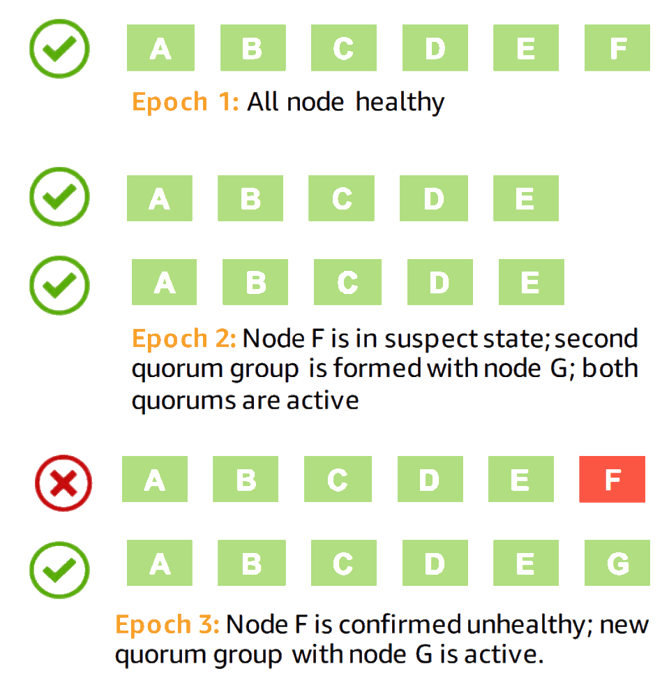
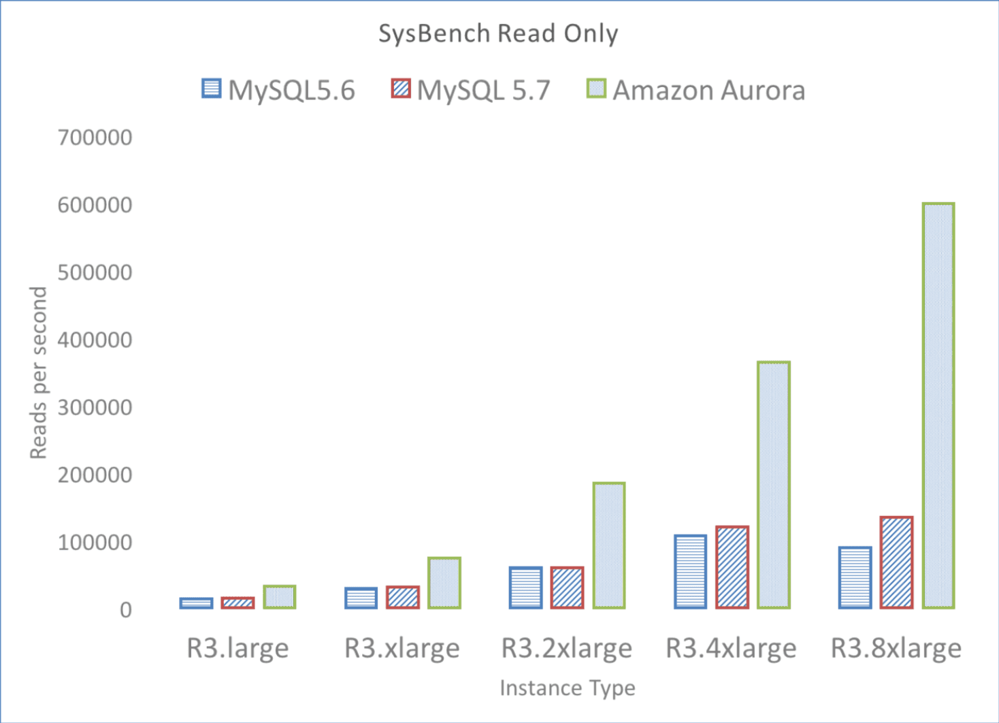
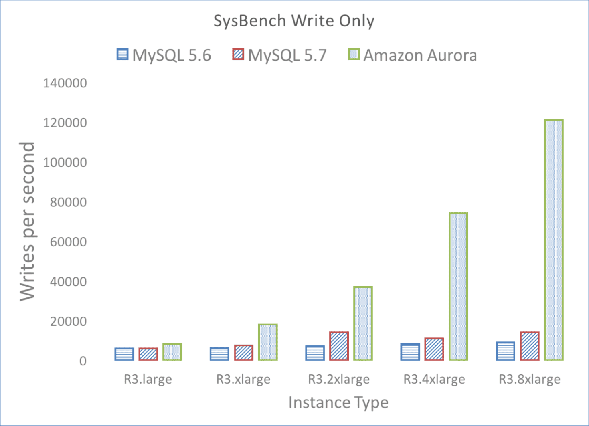

## 前言

前段时间接触到腾讯云的一个新数据库产品 [CynosDB][9] 是基于 [Amazon Aurora][10] 数据库的Paper实现的。我比较感兴趣就来看看它和之前看过的 [Spanner][4] 之类有什么不同，也许部分设计也能用在我们游戏业务的服务器中。它的主要的创新点在于重新设计了binlog和存储的部分，所以我也主要就看了两篇Paper： [《Amazon Aurora - Design Considerations for High Throughput Cloud-Native Relational Databases》][1] 是一个整体性质的介绍和概述； [《Amazon Aurora: On Avoiding Distributed Consensus for I/Os,Commits, and Membership Changes》][6] 是对其重点部分的存储服务的。

## 设计要点

[Amazon Aurora][10] 主要重构了MySQL中关于binlog和数据存储的部分。数据全部保存为WAL（和redis很像），这样复制和备份数据都很简单。WAL日志都保证了幂等性，所以发生故障转移的时候填补日志空洞也很简单。

为了应对地理性的灾害（比如某地地震、火山等），并且在发生灾害时如果同时在进行容灾、扩缩容等操作时，集群仍然可用。[Amazon Aurora][10] 从副本的分布上，分为3组6个副本。3组对应了3个Amazon Zone(AZ)，可以部署在3个不同的地点，每个AZ两个副本。对于读请求需要保证6个中的3个节点确认才能请求成功，对于写请求需要6个节点中的4个确认才能认为执行成功。在发生扩缩容或者升级或者故障转移的时候，会一个副本一个副本地取迁移。如果这时候某个AZ整体故障了，至少读请求还都能被响应。

因为 [Amazon Aurora][10] 仅改写了存储层，事务处理层并没有变，仍然是按InnoDB的MTR（mini transaction）的流程。有一个稍微不同的变化是 [Amazon Aurora][10] 的WAL是按PG(Protection  Groups)分组的，那么执行的MTR也会按涉及的数据所属的PG的分组来批处理。所以 [Amazon Aurora][10] 的隔离性和InnoDB一样，使用了Read View实现了MVCC(MultiVersion Concurrency Control)。在执行一个事务的过程中，[Amazon Aurora][10] 还是区分写节点和副本节点的，也仅有些节点会执行UNDO操作。

## 存储层细节

不再像传统方案一样写本地硬盘然后等待完成（因为要等待本地硬盘flush完成的延迟是很高的，更何况MySQL为了防止脏页写还是Double-Write）。[Amazon Aurora][10] 转而使用专用的Key-Value存储服务（感觉很像 [GFS][11] ）。[Amazon Aurora][10] 设计了递增的LSN(Log Sequence Number) 贯穿了WAL的维护和管理流程。这个LSN其实就相当于Log里加了个版本号，这样在合并的时候就很容易处理覆盖还是放弃。这么设计的好处是整个存储流程不需要执行一致性共识流程，也就不需要等待其他节点确认的流程。

> 其实我们项目的游戏服务器业务逻辑里也有类似的设计，给一些操作（公会好友之类）增加了Event Log Sequence，这样多人同时操作时就能保证最终一致性。不过我们的Event Log Sequence和最近看的另一篇Paper [《Exploiting Commutativity For Practical Fast Replication》][8] 更像一点，对于复合交换律的多个操作可以是乱序的。

存储服务其他的一些设计要点如下：

+ 日志按PG分组(Protection  Groups),每个PG 10GB
+ 不需要2PC，容灾和故障恢复直接复制PG
+ [Gossip][12] 协议同步和填补WAL空洞
+ 使用递增的LSN(Log Sequence Number)处理冲突（补偿策略）
+ 定义VCL(Volume Complete LSN)标识本地已经完成执行的事务Log序号
+ 定义VDL(Volume Durable LSN)标识本地已经完成持久化的事务Log序号。 \\\( VDL<=VCL \\\)
+ 故障恢复就是简单地复制PG，所以很快。（Paper里是说在QPS 在10W时，单个PG地恢复时间通常也在10秒内）
+ 定义PGMRPL(per-PG Minimum Read Point LSN)，标识每个PG的Minimum Read Point LSN。即这个值之前的所有Log都已经同步到所有的副本。
+ 维护执行中的事务队列，小于PGMRPL的事务可以被GC
+ 使用 [Gossip][12] 协议同步PGMRPL

### 写请求

+ 定义LAL(LSN Allocation Limit)用于控制执行队列的最大长度（1千万）。 \\\( max(SLN) <= VDL+VCL \\\)
+ 每个PG定义一个SCL(Segment Complete LSN)标识已经完成的Log序号
+ 每个Log记录上一条同PG的Log索引，构成链表（这样可以通过某条请求的LSN来追溯数据，实现隔离性）
+ 合包策略和我以前些的通信中间件 [libatbus][7] 一样，都是会上一条请求发送过程中新收到的请求。

### 提交流程

因为定义了VDL标识本地已经完成持久化的事务Log序号，那么提交流程就很简单了。直接增长VDL就完事儿了。另外一个常见的小优化是因对客户端有专门的线程池，这样可以服务器内部流程和客户端请求互相不影响。

### 读请求

+ 带本地Page缓存，本地缓存的LSN总是小于等于VDL，所以缓存淘汰和换入直接替换即可，不存在落地和一致性问题
+ 使用VDL来同步Read View

## 容灾

对于容灾而言，因为抽离了存储服务，并且数据就是Log。所以如果涉及新节点拉起，那么直接新节点去存储服务拉它需要的PG即可。但是在拉取的过程中整体服务是不能中断的，拉取完以后也需要无缝切换。
所以故障切换节点时整个流程如下：

1. 新增一个副本（比如ABCDEF中F故障，新增副本G。把然后把副本分为两组，ABCDEF和ABCDEG）
2. 在同步和迁移过程中，对写操作，要求所有副本组都满足 4/6 确认。（即ABCDEF和ABCDEG中都必须至少有4个确认）
3. 在同步和迁移过程中，对读操作，要求任一副本组满足 3/6 确认。（即ABCDEF和ABCDEG中只要任一组有3个确认即可）
4. 等迁移完毕，移除副本F

流程如下:

如果在这过程中又有节点失败，则同时要满足以上规则里两个副本迁移的条件。比如在上述流程中E节点又故障了。

1. 新增副本H；
2. 在同步和迁移过程中，对于写操作，需要ABCDEF和ABCDEG中副本都满足 4/6 确认，且ABCDFH和ABCDGH中副本都满足 4/6 确认。

## 其他要点及优化

+ 写数据的隔离性和社区版MySQL一致
+ 读和镜像隔离性依赖InnoDB内的B+树+共享的redo log
+ 个人觉得整体设计特别适合 [LSM Tree][5]
+ GC策略: 可以安全回收PGMRPL(per-PG Minimum Read Point LSN)之前的Log
+ **写放大优化**(Full Segments/Tail Segments)。把6倍放大优化到3倍。
  + Redo Log数据相对较小（因为PGMRPL之前的部分是可以直接回收的，这个窗口很小）。全量数据比较大。
  + 把副本分为Full Segments和Tail Segments，3个Full Segments副本和3个Tail Segments副本
  + 写确认改为4/6副本或3/3 Full Segments副本确认
  + 读确认改为3/6副本确认或1/3 Full Segments副本确认
  + 容灾和故障转移中Full Segments副本需要先从其他Full Segments副本同步快照，然后从其他Tail Segments副本中同步Redo Log。

上面提及的优化里对 **写放大** 的优化比较有意思。按前面的设计描述里，一个集群总共有6个副本，那么整个存储系统里一份数据就会被复制6份。并且由于存储引擎本身也是有备份的，那数据放大的倍数其实还是比较夸张的。那么为了优化这个问题，[Amazon Aurora][10] 利用了本身系统的一些特性，把节点分成了Full Segments和Tail Segments两种。顾名思义，Full Segments的节点里会存储全量的数据，而Tail Segments只会存储运行中的事务Log（即PGMRPL之后的数据）。因为在集群健康的情况下，运行中未被同步确认的事务相对于总体数据量而言是一个几乎可以忽略的非常小的数据量。以此就把副本的存储量缩减了一半。

当然这对读写流程和故障转移流程会有一些影响。即上面要点里提到的：写操作变为所有副本的4/6确认或者3/3 Full Segments副本确认；读操作变为所有副本的3/6确认或1/3 Full Segments副本确认。故障的时候Full Segments节点先从其他的Full Segments同步快照，完了以后由于可能崩溃前是只有本节点确认了，但是客户端认为事务完成了（写操作中 1/3 Full Segments副本和 3/3 Tail Segments副本确认的情况），所以还需要从Tail Segments同步Log。并且无论是读操作还是写操作都是增加了“或”流程，所以理论上延迟也会略微降低。

## 性能

这里直接贴Paper里的性能数据吧。使用Amazon EC2实例，实例类型为R3(内存优化型)

> CPU: 32 vCPUs(Xeon E5-2670 v2)
> Memory: 244GB

几乎拥有线性扩展能力。

Table 2: SysBench Write-Only (writes/sec)

| DB Size | Amazon Aurora | MySQL |
|---------|---------------|--------|
| 1 GB    | 10700         | 8400  |
| 10GB    | 107000        | 2400  |
| 100 GB  | 101000        | 1500  |
| 1 TB    | 41000         | 1200  |

Table 3: SysBench OLTP(writes/sec)

| Connections | Amazon Aurora | MySQL  |
|-------------|---------------|--------|
| 50          | 40000         | 10000  |
| 500         | 71000         | 21000  |
| 5000        | 111000        | 13000  |

Table 4: Replica Lag for SysBench Write-Only(msec)

| Writes/sec | Amazon Aurora | MySQL  |
|------------|---------------|--------|
| 1000       | 2.62          | < 1000 |
| 2000       | 3.42          | 1000   |
| 5000       | 3.94          | 60000  |
| 10000      | 5.38          | 300000 |

这里解耦并使用的服务化的存储引擎和不需要协商一致性就展现出了副本拷贝延迟的巨大优势。

## 总结

文中也提到了 Google的 [Spanner][4] ，并说 [Spanner][4] 是针对 Google 多读的业务优化的。但是我个人的想法是 [Spanner][4] 的设计特点是基于时间的，要考虑误差所以延迟比较高。 [Aurora][1] 这种直接基于InnoDB流程的就比较容易有低延迟，但是另一方面对部分式事务的一致性的支持没有 [Spanner][4] 好。而且 [Aurora][1] 的这种设计相当于站在了 MySQL 这个巨人的肩膀上，可以复用 MySQL 的很多组件，相对工作量也会小很多。

我本人也不是搞数据库的，以上属于个人理解，也可能有些谬误，欢迎有兴趣的童鞋互相交流。

[1]: https://media.amazonwebservices.com/blog/2017/aurora-design-considerations-paper.pdf "Amazon Aurora: Design Considerations for High Throughput Cloud-Native Relational Databases"
[2]: http://www.dbms2.com/2010/05/01/ryw-read-your-writes-consistency/
[3]: http://pages.cs.wisc.edu/~yxy/cs839-s20/papers/aurora-sigmod-18.pdf "Amazon Aurora: On Avoiding Distributed Consensus for I/Os, Commits, and Membership Changes"
[4]: https://ai.google/research/pubs/pub39966 "Spanner: Google's Globally-Distributed Database"
[5]: https://en.wikipedia.org/wiki/Log-structured_merge-tree
[6]: https://dl.acm.org/doi/abs/10.1145/3183713.3196937 "Amazon Aurora: On Avoiding Distributed Consensus for I/Os, Commits, and Membership Changes"
[7]: https://github.com/atframework/libatbus
[8]: https://www.usenix.org/system/files/nsdi19-park.pdf "Exploiting Commutativity For Practical Fast Replication"
[9]: https://cloud.tencent.com/product/cynosdb
[10]: https://aws.amazon.com/rds/aurora/
[11]: https://ai.google/research/pubs/pub51 "The Google File System"
[12]: https://en.wikipedia.org/wiki/Gossip_protocol
