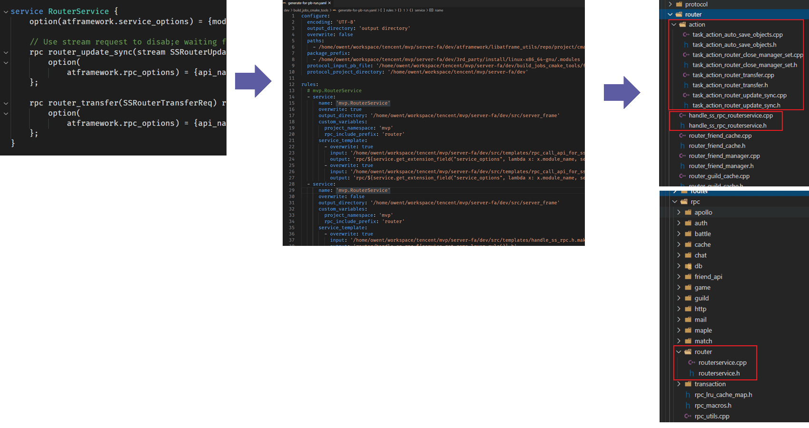

## 前言

前段时间我用 [Python][2] 和 [Mako][3] 模板引擎重新梳理了我们项目中的一些重复的流程。重构了所有的RPC系统。这个工作其实完成了挺久了，但是迫于懒一直拖着没写完这篇记录，就一直没发。

使用代码生成工具实现RPC模块还是比较有成效的事情，有助于统一API接口，也有利于部分组件模块化，修改和重构内部实现也会比较方便。业内已有的代码生成实现也比较多，但是多是针对特定系统和框架实现的，如果要接入其他框架或者说接入多种SDK的流程并不是很方便。我这次的实现一方面是针对我们内部的服务提供类似很多RPC系统也提供的内部接口、实现和注册流程的标准化，另一方面也是尽可能灵活且通用一些，可以用于接入外部的SDK。

## 基于protobuf rpc的代码生成

现有的组件或者框架里，基于 [protobuf][1] rpc 的代码生成多是提供了 `protoc` 插件的形式。比如 [grpc][4] ，这种方式有好有坏。好处是他能侵入 [protobuf][1] 官方工具生成的代码，在其预设的一些插入点插入额外的代码。缺点就是它必须得编译出一个可执行程序，如果是跨平台的话比较麻烦，并且一旦有修改要测试也比较麻烦。另外还有一个缺点是输出文件必须在插件指向的目录里，对于多个目录输出也比较麻烦。

### 使用 `libprotoc`

使用 `protoc` 插件的话官方的文档是缺失的，但是可以从一些代码文档和其他的工具里去找一些sample。如果是使用C++，可以直接使用官方的 `libprotoc` 。用这个的好处是他封装了基本流程的接口，实现接口继承 `google::protobuf::compiler::CodeGenerator` 就可以了。比如我们项目组中使用了 [fmt.dev][5] 作为 [C++20 Text formatting][6] 的过渡，客户端使用的是protobuf-lite版本，移除了反射功能。于是我们自己写了 `protoc` 插件去给生成的C++代码插入对 [fmt.dev][5] 的支持。代码如下:

```cpp
#include <algorithm>
#include <fstream>
#include <sstream>
#include <string>

#ifndef UTIL_CONFIG_COMPILER_PROTOBUF_PREFIX_H
#include <config/compiler/protobuf_prefix.h>
#endif


#include <google/protobuf/compiler/code_generator.h>
#include <google/protobuf/compiler/cpp/cpp_generator.h>
#include <google/protobuf/compiler/plugin.h>
#include <google/protobuf/descriptor.h>
#include <google/protobuf/descriptor.pb.h>
#include <google/protobuf/io/printer.h>
#include <google/protobuf/io/zero_copy_stream.h>

#ifdef UTIL_CONFIG_COMPILER_PROTOBUF_PREFIX_H
#include <config/compiler/protobuf_suffix.h>
#endif

// namespace google::protobuf::compiler

namespace details {
    template <class TChar>
    static TChar tolower(TChar in) {
        return static_cast<TChar>(::tolower(in));
    }

    // Copy from <protobuf>/src/google/protobuf/compiler/cpp/cpp_helpers.cc
    static const char* const kKeywordList[] = {  //
        "NULL",          "alignas",      "alignof",   "and",        "and_eq",
        "asm",           "auto",         "bitand",    "bitor",      "bool",
        "break",         "case",         "catch",     "char",       "class",
        "compl",         "const",        "constexpr", "const_cast", "continue",
        "decltype",      "default",      "delete",    "do",         "double",
        "dynamic_cast",  "else",         "enum",      "explicit",   "export",
        "extern",        "false",        "float",     "for",        "friend",
        "goto",          "if",           "inline",    "int",        "long",
        "mutable",       "namespace",    "new",       "noexcept",   "not",
        "not_eq",        "nullptr",      "operator",  "or",         "or_eq",
        "private",       "protected",    "public",    "register",   "reinterpret_cast",
        "return",        "short",        "signed",    "sizeof",     "static",
        "static_assert", "static_cast",  "struct",    "switch",     "template",
        "this",          "thread_local", "throw",     "true",       "try",
        "typedef",       "typeid",       "typename",  "union",      "unsigned",
        "using",         "virtual",      "void",      "volatile",   "wchar_t",
        "while",         "xor",          "xor_eq"};
    static std::unordered_set<std::string> kKeywords;

    static const std::unordered_set<std::string>& GetKeywords() {
        if (!kKeywords.empty()) {
            return kKeywords;
        }

        for (size_t i = 0; i < sizeof(kKeywordList) / sizeof(const char* const); ++i) {
            kKeywords.insert(kKeywordList[i]);
        }

        return kKeywords;
    }

    inline bool IsMapEntryMessage(const google::protobuf::Descriptor* descriptor) { return descriptor->options().map_entry(); }

    static std::string ResolveKeyword(const std::string& name) {
        if (GetKeywords().count(name) > 0) {
            return name + "_";
        }
        return name;
    }

    static std::string ClassName(const google::protobuf::Descriptor* descriptor) {
        // const Descriptor* parent = descriptor->containing_type();
        std::string res;
        // if (parent) res += ClassName(parent) + "_";
        res += descriptor->name();
        if (IsMapEntryMessage(descriptor)) res += "_DoNotUse";
        return ResolveKeyword(res);
    }

    static std::string FieldName(const google::protobuf::FieldDescriptor* field) {
        std::string result = field->lowercase_name();
        if (GetKeywords().count(result) > 0) {
            result.append("_");
        }
        return result;
    }

    // static std::string EnumValueName(const EnumValueDescriptor* enum_value) {
    //     std::string result = enum_value->lowercase_name();
    //     if (GetKeywords().count(result) > 0) {
    //         result.append("_");
    //     }
    //     return result;
    // }
}  // namespace details

class FaStdFormaterGenerator : public google::protobuf::compiler::CodeGenerator {
public:
    virtual bool Generate(const google::protobuf::FileDescriptor* file, const std::string&,
                          google::protobuf::compiler::GeneratorContext* context, std::string*) const {
        if (nullptr == file || file->package().size() < 6 || file->package().substr(0, 6) != "FaGame" ||
            (file->package().size() > 6 && file->package()[6] != '.')) {
            return true;
        }

        if (/**file->enum_type_count() == 0 && **/ file->message_type_count() == 0) {
            return true;
        }

        std::string file_name = file->name();
        std::string namespace_prefix;
        size_t last_dot = std::string::npos;
        for (size_t i = 0; i < file_name.size(); ++i) {
            if (file_name[i] == '.') {
                last_dot = i;
            }
        }
        if (std::string::npos != last_dot) {
            file_name = file_name.substr(0, last_dot);
        }
        file_name += ".pb.h";


        last_dot = std::string::npos;
        const std::string& package_name = file->package();
        for (size_t i = 0; i < package_name.size(); ++i) {
            if (package_name[i] == '.') {
                if (std::string::npos != last_dot) {
                    namespace_prefix += package_name.substr(last_dot + 1, i - last_dot - 1);
                } else {
                    namespace_prefix = package_name.substr(0, i);
                }
                last_dot = i;
                namespace_prefix += "::";
            }
        }
        if (std::string::npos != last_dot) {
            namespace_prefix += package_name.substr(last_dot + 1);
        } else {
            namespace_prefix = package_name;
        }
        namespace_prefix += "::";

        std::unique_ptr<google::protobuf::io::ZeroCopyOutputStream> output_formater(context->OpenForInsert(file_name, "global_scope"));
        google::protobuf::io::Printer formater_printer(output_formater.get(), '$');
        formater_printer.Print("#include <config/atframe_utils_build_feature.h>\n");
        formater_printer.Print("#if defined(LIBATFRAME_UTILS_ENABLE_STD_FORMAT) && LIBATFRAME_UTILS_ENABLE_STD_FORMAT\n");
        formater_printer.Print("  #include <format>\n");
        formater_printer.Print("#elif defined(LIBATFRAME_UTILS_ENABLE_FMTLIB) && LIBATFRAME_UTILS_ENABLE_FMTLIB\n");
        formater_printer.Print("  #include <fmt/format.h>\n");
        formater_printer.Print("#endif\n");
        formater_printer.Print("\n");

        formater_printer.Print("namespace LOG_WRAPPER_FWAPI_NAMESPACE_ID {\n");

        for (int i = 0; i < file->enum_type_count(); ++i) {
            GenerateEnum(formater_printer, *file->enum_type(i), namespace_prefix);
        }

        for (int i = 0; i < file->message_type_count(); ++i) {
            GenerateMessage(formater_printer, *file->message_type(i), namespace_prefix);
        }
        formater_printer.Print("}\n");

        return true;
    }

    void GenerateMessage(google::protobuf::io::Printer& printer, const google::protobuf::Descriptor& msg,
                         const std::string& namespace_prefix) const {
        std::string msg_clazz_name = details::ClassName(&msg);
        printer.Print("\n  template <class CharT>\n");
        printer.Print("  struct formatter<$namespace_prefix$$message_name$, CharT> : formatter<std::basic_string<CharT> > {\n",
                      "namespace_prefix", namespace_prefix, "message_name", msg_clazz_name);
        printer.Print("    template <class FormatContext>\n");
        printer.Print(
            "    auto format(const $namespace_prefix$$message_name$& input_message, FormatContext& ctx) -> decltype(ctx.out()) {\n",
            "namespace_prefix", namespace_prefix, "message_name", msg_clazz_name);

        std::stringstream field_fmts;
        std::stringstream field_params;
        for (int i = 0; i < msg.field_count(); ++i) {
            std::string get_func_name = details::FieldName(msg.field(i));
            if (i != 0) {
                field_fmts << ", ";
            }
            if (msg.field(i)->is_repeated()) {
                field_fmts << "\\\"" << msg.field(i)->name() << "\\\": [{}]";
                field_params << ", LOG_WRAPPER_FWAPI_NAMESPACE_ID::join(input_message." << get_func_name << "().begin(), input_message."
                             << get_func_name << "().end(), \", \")";
            } else {
                field_fmts << "\\\"" << msg.field(i)->name() << "\\\": {}";
                field_params << ", input_message." << get_func_name << "()";
            }
        }
        printer.Print("      return LOG_WRAPPER_FWAPI_NAMESPACE format_to(ctx.out(), \"{}$field_fmts${}\", \"{\"$field_params$, \"}\");\n",
                      "field_fmts", field_fmts.str(), "field_params", field_params.str());
        printer.Print("    }\n");
        printer.Print("  };\n");

        std::string nested_type_prefix = namespace_prefix + msg_clazz_name + "::";
        for (int i = 0; i < msg.nested_type_count(); ++i) {
            GenerateMessage(printer, *msg.nested_type(i), nested_type_prefix);
        }

        for (int i = 0; i < msg.enum_type_count(); ++i) {
            GenerateEnum(printer, *msg.enum_type(i), nested_type_prefix);
        }
    }

    void GenerateEnum(google::protobuf::io::Printer& /*printer*/, const google::protobuf::EnumDescriptor& /*enum_desc*/,
                      const std::string& /*namespace_prefix*/) const {
        return;
        /**
        printer.Print("\n  template <class CharT>\n");
        printer.Print("  struct formatter<$namespace_prefix$$message_name$, CharT> : formatter<int, CharT> {\n", "namespace_prefix",
                      namespace_prefix, "message_name", enum_desc.name());
        printer.Print("    template <class FormatContext>\n");
        printer.Print("    auto format(const $namespace_prefix$$message_name$& input_enum, FormatContext& ctx) -> decltype(ctx.out()) {\n",
        "namespace_prefix", namespace_prefix, "message_name", enum_desc.name());

        printer.Print("      return LOG_WRAPPER_FWAPI_NAMESPACE format_to(ctx.out(), \"{}\", static_cast<int>(input_enum));\n");
        printer.Print("    }\n");
        printer.Print("  };\n");
        **/
    }
};

int main(int argc, char* argv[]) {
    FaStdFormaterGenerator generator;
    return google::protobuf::compiler::PluginMain(argc, argv, &generator);
}
```

以上工具生成的代码是依赖我们的跨平台基础库 [atframe_utils][7] 的，主要使用到了对 [fmt.dev][5] 和 [C++20 Text formatting][6] 的检测适配模块 。可以发现很简短不到250行代码就完成了。但是实际上使用 `libprotoc` 也有一些坑，比如对于一些内部的变量和和关键字，实际生成代码的时候 [protobuf][1] 时会做变量名转换的，但是这个转换规则的接口它并没有导出。所以上面有一大坨代码是照着官方的转换规则再手写一遍。另一个不太方便的地方是它对自定义变量只支持简单的字符串占位符替换，不支持复杂表达式和结构。

### 接入 `plugin.proto` 协议

手动接入 `plugin.proto` 协议的话原理和使用 `libprotoc` 是一样的，但是跨语言了。也因为没有现成的建议接入方法，所以如果要高级的模板替换，protobuf结构打解包等等等也得自己来。

### 基于脚本和模板引擎

我们的工具则是使用了一种更加灵活的方式，没有依赖protoc，而是使用了 [protobuf][1] 本身提供的 python 接口，去解析 `descriptor.proto` 里的结构，然后使用了 [Mako][3] 模板引擎去生成我们需要的代码 。完全没有走 `protoc` 的那一套。缺点就是没法很方便地直接侵入官方生成的代码；好处也很明显，主要有以下几点：

1. 我们使用了模板引擎来“渲染”生成的代码。这样可以对各部分组件更好地模块化，维护也更直观。

  > 我们中途接入了全链路追踪，接入的方式就是增加了一个全链路追踪模板模块。非常容易扩展且一次插入，对所有的已有接口也全部生效。

2. 由于使用的是脚本，所以修改生成的代码结构和调试就非常简单。
3. 首先我们支持了自定义插件，这样对多种SDK可以分别通过 [protobuf][1] 定制接口特性。
4. 我们对输出文件提供了表达式的功能，这样我们输出的文件名可以根据自己的规则来，并且这些规则也是支持模板引擎的。
5. 对同一组接口描述，输出多个文件（主要是空的执行方任务、调用方RPC接口、和服务注册三类）的弹性就很高。而且输出的目标服务和目录都是不一样的。

之所以使用 [Mako][3] 模板引擎 是因为它很轻量级，是个纯Python实现。

### 方案对比

|     比较项     |            基于脚本的动态模板引擎             |   基于 `libprotoc`   | 接入 `plugin.proto` 协议 |
|----------------|-----------------------------------------------|--------------------------|------------------------------|
| 基本流程       | 使用 [protobuf][1] 运行时库，使用反射接口，接入模板引擎 | 链接 [protobuf][1] 库的 `libprotoc` ，提供 `google::protobuf::compiler::CodeGenerator` 的实现 | 取决于接入方式   |
| 运行效率       | 较慢                                          | 快                       | 取决于接入方式               |
| 快速迭代       | 简单，修改模板即可，可视化程度高              | 复杂，需要重新编译可执行程序。特别是对于跨平台的场景需要每个平台单独编译再测试 | 较复杂，取决于接入方式，也需要考虑跨平台场景每个平台单独编译 |
| 模板扩展性     | 高,支持复杂的逻辑控制流，复用语言生态，模块化 | 低，仅有简单的变量替换   | 取决于接入方式，大部分静态模板引擎不支持复杂的逻辑控制流 |
| 原生代码插入点 | 不支持，但通常不需要，可以直接改模板          | 允许使用内置插入点       | 允许使用内置插入点           |

## 实现

实现的基本原理就是按 `descriptor.proto` 里的结构去解析pb文件。然后按指定的规则和模板去生成代码。比如RPC接口的大体流程如下:


实际实现的时候有几个细节可以分享一下。

### 支持自定义插件和二次构建

首先是为了支持自定义插件，我们采用了二次构建符号库的方式。因为我们是直接使用了protobuf的构建符号库的接口。它有一个限制就是构建符号库的过程中只会用当前已有的符号描述和插件描述，但是在读取解析完成前输入的pb文件里的插件和相关的message的信息是只有原始数据的。所以为了简单起见我们第一步是把pb读进来以后创建出第一个符号库集合，然后把它和官方和我们工具自带的符号库整合，再执行一次构建符号库。这样第二次构建的时候就可以直接使用在同一个pb文件里的插件数据了。

### [protobuf][1] 的Native接口

[protobuf][1] 提供的Python接口其实有两种，一种是使用Native Code编译出了动态库，然后给python去调用，另一种是纯Python实现。在实现我们的工具的过程中，我发现使用二次构建的方式，通过 [protobuf][1] 的反射接口去读插件信息时，如果使用Native Code的分支，有时候会有问题（其实我两次构建用得是完全两组隔离的protobuf里的DataPool和SymbolPool）。通过显式关闭掉Native Code的分支，强行使用纯Python实现的话可以解决。这里没有深究，改成强行使用纯Python实现了，有了解的小伙伴可以分享交流一下。（目前猜想可能和两次构建符号名相同，但是结构对象变化了有关）

### 批处理优化

使用脚本处理pb描述一个重大的缺点就是 **“慢”** ， 尤其我们原先是每次生成一组接口都是新开进程跑的。这有个问题就是每次都得重新跑整个pb的符号库的二次构建流程。这非常慢，后来服务多了以后甚至要半分钟之久，而且以后增肌更多类型的服务后还会更长。所以后来我优化了下流程，允许代码生成工具去从 YAML 里读取多个服务的多个生成规则。整个流程里增加了一步，提供了接口把多种类型的服务的声明整合到一个YAML配置文件里。在执行工具生成代码时，先构建好符号库，然后从这个YAML配置文件里读每个服务的模板生成规则，复用同一个符号库。这样就把所有服务和接口的总代码生成的时间又缩短到了3秒以内。



## 示例

我们的应用除了用于实现对外提供服务外，也用于生成一些SDK和平台接入层的代码和文档。对于平台接入层代码，接入者需要写公共接入层代码，使用者只需要按对应平台的文档，根据自己的需要写 `proto` 文件文件即可。最终会生成RPC接口；而我们自己对外的服务则要生成的内容更多一些，除了RPC接口外还有空的任务代码和把这个任务注册到调度系统中的注册代码。

随便举两个例子吧，大概展示下。

### 服务间消息

```protobuf
// 路由系统的服务
service RouterService {
    option (atframework.service_options) = {
        module_name : "router"
    };

    // 流式接口
    rpc router_update_sync(stream SSRouterUpdateSync) returns (google.protobuf.Empty) {
        option (atframework.rpc_options) = {
            api_name : "通知路由表更新"
            descriptions : "notify another server instance to update router table"
        };
    };

    // 请求-返回包接口
    rpc router_transfer(SSRouterTransferReq) returns (SSRouterTransferRsp) {
        option (atframework.rpc_options) = {
            api_name : "路由对象转移"
            descriptions : "transfer a router object into another server instance"
        };
    };
}
```

生成的用户层API:

```cpp
namespace rpc {
    class context;
    namespace router {
        struct routerservice_result_t {
            routerservice_result_t();
            routerservice_result_t(int code);
            operator int() const LIBCOPP_MACRO_NOEXCEPT;

            bool is_success() const LIBCOPP_MACRO_NOEXCEPT;
            bool is_error() const LIBCOPP_MACRO_NOEXCEPT;

            copp::future::poll_t<int> result;
        };

        // ============ mvp.RouterService.router_update_sync ============
        /**
         * @brief 通知路由表更新
         * @param __ctx          RPC context, you can get it from get_shared_context() of task_action or just create one on stack
         * @param dst_bus_id     target server bus id
         * @param req_body       request body
         * @note  notify another server instance to update router table
         * @return 0 or error code
         */
        routerservice_result_t router_update_sync(context& __ctx, uint64_t dst_bus_id, mvp::SSRouterUpdateSync &req_body);

        // ============ mvp.RouterService.router_transfer ============
        /**
         * @brief 路由对象转移
         * @param __ctx          RPC context, you can get it from get_shared_context() of task_action or just create one on stack
         * @param dst_bus_id     target server bus id
         * @param req_body       request body
         * @param rsp_body       response body
         * @note  transfer a router object into another server instance
         * @return 0 or error code
         */
        routerservice_result_t router_transfer(context& __ctx, uint64_t dst_bus_id, mvp::SSRouterTransferReq &req_body, mvp::SSRouterTransferRsp &rsp_body);
    } // namespace router
}
```

生成的服务注册层代码:

```cpp
#include <router/action/task_action_router_update_sync.h>
#include <router/action/task_action_router_transfer.h>

#include "handle_ss_rpc_routerservice.h"

namespace handle {
    namespace router {
        int register_handles_for_routerservice() {
            int ret = 0;
            REG_TASK_RPC_HANDLE(ss_msg_dispatcher, ret, task_action_router_update_sync, mvp::RouterService::descriptor(), "mvp.RouterService.router_update_sync");
            REG_TASK_RPC_HANDLE(ss_msg_dispatcher, ret, task_action_router_transfer, mvp::RouterService::descriptor(), "mvp.RouterService.router_transfer");
            return ret;
        }
    } // namespace router
}
```

生成的 [**空任务代码**](#生成的空任务代码) 和下面的小节里的一样的，就不做重复展示了。

### HTTP/Websocket接入

我们一些特殊的服务提供的是HTTP+Json接口，还有一部分提供的是Websocket+Json的接口。这两类接口在我们系统里的服务声明时类似的。

```protobuf
// GM 工具服务
service CustomGmService {
    option (atframework.http.http_service) = {
        protocol_name : "gm-ws"               // 对应Websocket协议的服务名
        mount_prefix : "/gm-ws"               // 用于Websocket握手Upgrade的HTTP入口的URL前缀
        module_name : "custom"                // 和输出代码的路径相关
        service_type : SERVICE_TYPE_WEBSOCKET // 这是一个Websocket的服务
    };
    // atframework.http.HttpServiceOptions.SERVICE_TYPE_WEBSOCKET

    rpc get_user_data(CustomGmGetUserDataReq) returns (CustomGmGetUserDataRsp) {
        option (gm_cmd_descriptions) = "拉取用户原始数据";
        option (gm_cmd_readonly)     = true;
    };
}
```

```protobuf
// 对接外部平台的HTTP接口示例
service HttpService {
    option (atframework.http.http_service) = {
        protocol_name : "common-http" // 我们每个服务要有个唯一的服务名
        mount_prefix : "/http"        // HTTP的URL前缀
        module_name : "http"          // 和输出代码的路径相关
    };

    // 返回类型设为Empty表示由task自己组回包内容。否则就是按 returns 的message类型打包回包成Json
    rpc survey(google.protobuf.Empty) returns (google.protobuf.Empty) {};
}
```

上面的 `option` 里的部分其实就是针对特定类型服务的接入层的自定义扩展机制。生成的服务注册层代码和前面是类似的，就不展示了。

### 生成的空任务代码

无论是哪种RPC接口，只要是我们提供实现的（比如上面的 **服务间消息** 和 **HTTP/Websocket接入** ）都会生成类似下面的空任务代码。然后使用者只需要填充内容就行了。

```cpp
#include "task_action_<RPC名>.h"

#include <std/explicit_declare.h>
#include <log/log_wrapper.h>
#include <time/time_utility.h>

#include <config/compiler/protobuf_prefix.h>

#include <protocol/pbdesc/svr.const.err.pb.h>
#include <protocol/pbdesc/svr.protocol.pb.h>

#include <config/compiler/protobuf_suffix.h>

#include <config/logic_config.h>
#include <utility/protobuf_mini_dumper.h>

#include <config/extern_service_types.h>

#include <string>
#include <utility>
#include <memory>

task_action_<RPC名>::task_action_<RPC名>(dispatcher_start_data_t COPP_MACRO_RV_REF param) : base_type(COPP_MACRO_STD_MOVE(param)) {}
task_action_<RPC名>::~task_action_<RPC名>() {}

bool task_action_<RPC名>::is_stream_rpc() const {
    return true;
}

int task_action_<RPC名>::operator()() {
    EXPLICIT_UNUSED_ATTR const rpc_request_type& req_body = get_request_body();
    EXPLICIT_UNUSED_ATTR rpc_response_type& rsp_body = get_response_body();

    // TODO 需要使用者实现逻辑代码块 ...

    return hello::err::EN_SUCCESS;
}

int task_action_<RPC名>::on_success() { return get_ret_code(); }

int task_action_<RPC名>::on_failed() { return get_ret_code(); }
```

当然，针对一些特殊功能的任务还是会提供一些特别的结构的，比如给HTTP服务提供一些HTTP协议常用的接口。实现方式是继承的基类不一样。

## 写在最后

在实现这个工具的时候也考虑过是否使用编译型语言+模板引擎，但是现有编译型语言成熟的模板引擎都比较弱鸡。无论是 [Rust][9] 的 [handlebars][10] 还是 [golang][12] 的 [go-template][13] 都是语法晦涩，逻辑语句块功能和对动态自定义类型的支持羸弱。 [Rust][9] 的 [tinytemplate][11] 对自定义动态类型的支持倒是还行，但是要求全部转成Json对象传给模板引擎，这也是个额外且多于的开销。另外如果我们需要在模板中调用一些底层函数（比如我们经常性有时候会调用外部的 `git` 命令获取当前的commit sha1或者获取当前的时间，生成Copyright注释和版本信息相关的代码或注释就需要一些系统级的包和接口），它们都得一个一个手动去加，不太方便。所以目前还是选用了动态语言，而 [protobuf][1] 又是有python的官方支持的所以选了python。

最后列举一下以上工具的代码吧:

+ 工具实现: https://github.com/atframework/atsf4g-co/blob/master/src/generate-for-pb.py 
+ 相关服务间RPC的cmake集成接口: https://github.com/atframework/atsf4g-co/blob/master/src/generate_for_pb_utility.cmake 
+ 依赖的Python包配置: https://github.com/atframework/atsf4g-co/blob/master/3rd_party/python_env/requirements.txt 
+ sample和示例见 [atsf4g-co][8] 的sample_solution分支: https://github.com/atframework/atsf4g-co/tree/sample_solution

欢迎有兴趣的小伙伴们交流分享。

[1]: https://github.com/protocolbuffers/protobuf
[2]: https://www.python.org/
[3]: https://www.makotemplates.org/
[4]: https://grpc.io/
[5]: https://fmt.dev
[6]: https://en.cppreference.com/w/cpp/utility/format
[7]: https://github.com/atframework/atframe_utils
[8]: https://github.com/atframework/atsf4g-co/
[9]: https://www.rust-lang.org/
[10]: https://crates.io/crates/handlebars
[11]: https://crates.io/crates/tinytemplate
[12]: https://golang.org/
[13]: https://golang.org/pkg/html/template/
