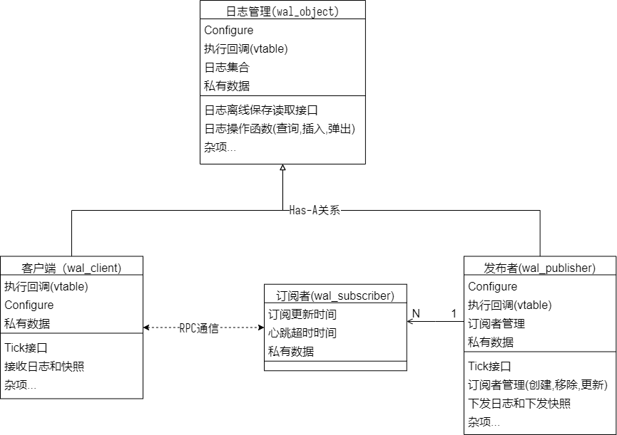

## 前言

在挺久以前我写过一篇分享 [《在游戏服务器中使用分布式事务》][1] 。当时尝试在我们的游戏服务中引入TCC模型的分布式事务机制，以优化好友和公会服务的一致性流程。
但是时间原因，但是写的第一版是深入我们当时的游戏业务的，第一版仅用在好友服上，既不通用测试也不完善。
后来逐渐把公会服务和聊天的功能也采用或部分采用这里的分布式事务的组件来实现，发现有大量的相似代码。
并且由于分布式事务的流程本身比较复杂，其他人接手的时候看起来就会比较吃力，所以我一直有计划重构这一块代码并且实现为更加通用且灵活的模块。
最近也是基本完成了这部分的工作，通用接口主要分为两部分。第一部分是 **Write Ahead Log(WAL)** 模块，第二部分是事务管理模块。
本此分享主要专注于第一部分 **Write Ahead Log(WAL)** 。

## 设计目标

很多服务都需要执行日志的管理机制，比如帧同步服务。这些服务在事件管理上都有一些相似性：

+ 维护日志队列
  + 有序
  + 查询（二分查找）
  + Push/Pop
  + 可落地保存
  + 按 **事件类型** 执行日志
  + Crash恢复
+ 容量管理
  + 最大数量限制
  + 定期淘汰
  + 强制淘汰
+ 发布/订阅
  + 发布、订阅操作
  + 订阅者超时管理
  + 定时发送订阅请求
  + 冲突管理
  + 压缩日志( 类似 [Etcd的compaction][3] )
  + 快照下发和快照加载
  + 日志补发和日志读取
  + Crash恢复

**Write Ahead Log(WAL)** 的主要目的就是针对这些需求提供一个通用的模块。于此同时我们也针对游戏业务的使用做了一些扩展设计。
比如： 不同类型的业务的 **EventLog** 类型是不同的，同时也允许定制如何定义 **事件类型** ；不同服务收发消息的流程会有差异，所以也需要允许定制定化如何首发不同类型的消息（主要涉及订阅和发布管理）；同理，不同的服务中存取离线数据的方式和结构也可能不一样，所以这也需要可定制化。

## 日志管理、发布者、订阅者和客户端

为了通用化我们的定制化需求，并且能够减少在C++中的强制类型转换（以避免内存错误的风险）。我们需要善用C++的模板机制。一方面，抹除掉强制类型转换的需要；另一方面也要防止模板设计过于复杂，防止带来过高的编译期开销和人工阅读的开销；同时也要兼顾性能。

这里 **订阅者** 特指 **发布者** 中管理的 **订阅者** 对象，实际的 **订阅者** 是 **客户端** 。 由于 **发布者** 和 **客户端** 都需要 **日志管理** 模块，所以 **日志管理** 是公用的。结构如下:



### 日志管理 - `wal_object`

在 **日志管理** 模块中要严格要求日志的有序，所以我们要求 **事件执行函数** 必须是同步的。在操作时，建议日志是有序的，总是 `push_back` ，如果从中间插入日志且日志已存在，则会走Merge流程，如果原来不存在，那么插入操作可能开销会较高。如果事件回调返回值不是 `kOk` , 那么该日志会被忽略，这样也允许我们在执行时间日志的时候来决定改日志是否真的有效。

我们考虑以下内容:

+ 定制化类型
  + 离线存储的数据库是什么类型: `StorageT`
  + 透传到回调函数的自定义参数: `CallbackParamT`
  + 保存在Log管理器对象数据里的用户自定义数据: `PrivateDataT`
  + Log的类型: `LogT`
  + Log的 **Meta数据三元组**
    + Log的Key的类型: `LogKeyT` (要求单调增，不要求连续)
    + Log地Action类型: 可以从 `ActionGetter` 地返回值推断
      + (可选) 用于使用Hash Table按Action类型分类Action回调的 `HashActionCaseT` , `EqualActionCaseT`
    + Log地产生时间
+ 定义行为（回调， `vtable` ）
  + (必须) 如何从Log中提取Action: `ActionGetter`
    + 可以直接根据返回值推断
  + (必须) 如何提取Log Key
  + (必须) 如何比较Log Key
  + (必须) 如何分配Log Key
    + 如果不允许创建log，也要设置 `vtable` ，可以直接返回 `wal_object_type::log_key_result_type::make_error(wal_result_code::kBadLogKey)`
  + (必须) 如何提取和设置 **Meta数据三元组**
  + (必须,至少一种) 如何分发Action回调
    + 按Action类型分发回调或默认分发回调
    + 允许Patch log数据
  + (可选) 如何加载和导出需要落地保存地数据 `load/dump`
  + (可选) 添加和移除事件 `on_log_added/on_log_removed`

为了减少模板参数的复杂性，我们采用一个 `wal_log_operator` 类型来定义。建议使用的时候用户定一个类型继承它，或者定一个类定义里面的所有类型。

```cpp
template <class LogT, class ActionGetter>
struct LIBATFRAME_UTILS_API_HEAD_ONLY wal_log_action_getter_trait {
#if defined(__cplusplus) && __cplusplus >= 201703L
  using type = std::invoke_result_t<ActionGetter, LogT>;
#else
  using type = typename std::result_of<ActionGetter(LogT)>::type;
#endif
};

template <class LogKeyT, class LogT, class ActionGetter, class CompareLogKeyT = std::less<LogKeyT>,
          class HashActionCaseT = std::hash<typename wal_log_action_getter_trait<LogT, ActionGetter>::type>,
          class EqualActionCaseT = std::equal_to<typename wal_log_action_getter_trait<LogT, ActionGetter>::type> >
class LIBATFRAME_UTILS_API_HEAD_ONLY wal_log_operator {
 public:
  using log_key_type = LogKeyT;                                                 // Log的Key是什么类型，必须可比较大小
  using log_type = LogT;                                                        // Log的数据结构类型
  using action_getter_trait = wal_log_action_getter_trait<LogT, ActionGetter>;  // 用于提取Log事件类型
  using action_getter_type = ActionGetter;                                      // 如何从Log总提取事件类型
  using action_case_type = typename action_getter_trait::type;                  // Log事件类型,默认采用type_traits推断
  using log_key_compare_type = CompareLogKeyT;                                  // 如何比较Log的Key
  using action_case_hash = HashActionCaseT;                                     // 计算Log事件类型的Hash值，用于hash map
  using action_case_equal = EqualActionCaseT;                                   // 如何判定Log事件类型相等，用于hash map

  using log_pointer = std::shared_ptr<log_type>;                                // 存储Log数据的智能指针
  using log_const_pointer = std::shared_ptr<const log_type>;                    // 时间分发时指向Log数据的智能指针(常量)
  using log_key_result_type = LIBATFRAME_UTILS_NAMESPACE_ID::design_pattern::result_type<log_key_type, wal_result_code>;
                                                                                // std::variant<log_key_type, wal_result_code> 的替代
};
```

创建的时候，还需要指定一些回调，因为数量比较多，所以包装在了 `vtable` 对象里。

```cpp
template <class StorageT,       // 离线数据的数据类型
          class LogOperatorT,   // 上面的 wal_log_operator 结构
          class CallbackParamT, // 各类接口的自定义参数
          class PrivateDataT>    // 内部私有数据类型
class LIBATFRAME_UTILS_API_HEAD_ONLY wal_object {
// ...
  struct configure_type {
    duration gc_expire_duration;  // 自动GC清理多长时间后的Log
    size_t max_log_size;          // 最大保留的Log数量
    size_t gc_log_size;           // Log数量超过多少才启动自动GC
  };
  using configure_pointer = std::shared_ptr<configure_type>;

  struct vtable_type {
    callback_load_fn_t load;                      // (可选,需要数据落地时必须)如何从离线数据中加载
    callback_dump_fn_t dump;                      // (可选,需要数据落地时必须)保存到离线数据中
    callback_log_get_meta_fn_t get_meta;          // (必须)如何从Log中提取(Key,创建时间,事件类型)三元组
    callback_log_set_meta_fn_t set_meta;          // (可选)把(Key,创建时间,事件类型)三元组设置到Log中
    callback_log_merge_fn_t merge_log;            // (可选)触发Merge Log的
    callback_get_log_key_fn_t get_log_key;        // (必须)如何从Log中提取事件类型
    callback_alloc_log_key_fn_t allocate_log_key; // (可选)分配Log Key
    callback_log_event_fn_t on_log_added;         // (可选)Log添加完成事件
    callback_log_event_fn_t on_log_removed;       // (可选)Log移除事件
    callback_log_group_map_t log_action_delegate; // (可选,和default_delegate至少有一个)按Log事件类型执行的回调函数
    callback_log_fn_group_t default_delegate;     // (可选,和log_action_delegate至少有一个)默认的Log事件类型执行的回调函数
  };
  using vtable_pointer = std::shared_ptr<vtable_type>;
// ...
};
```

其中 `set_meta` , `allocate_log_key` 是可选的，但是如果需要调用 `allocate_log(...)` 接口（比如发布者）的话这两个就是必须的。

### 发布者 - `wal_publisher`

发布者需要 **日志管理** 模块，里面的设置和 `vtable` 是继承 **日志管理** 内的相应结构并做额外扩展的。

+ 包含 **Log管理** 内的所有内容
+ 定制化额外的类型
  + 订阅者的Key
    + (可选) 用于使用Hash Table按Key类型分类订阅者的 `HashSubscriberKeyT` , `EqualSubscriberKeyT`
  + 订阅者的私有数据: `PrivateDataT`
+ 定义额外行为（回调， `vtable` ）
  + (必须) 如何发送快照 `snapshot`
  + (必须) 如何发送增量Log
  + (可选) 如何发送订阅和心跳的回包
  + (可选) 如何检查订阅者有效性
    > 允许业务层自定义订阅者有效性逻辑
  + (可选) 如何处理收到的订阅和心跳的回调
  + (可选) 设置强制下发快照的规则检查
  + (可选) 新的订阅者回调
  + (可选) 移除订阅者回调
+ 调度层流程要求
  + (必须) 创建
    + `std::make_shared<wal_publisher::vtable_type>` 并设置上述回调
    + `wal_publisher::make_configure(configure)` 并修改设置
    + `wal_publisher::create(vtable, configure)`
  + (必须) 定期或收到事件前调用 `tick()`
  + (必须) 通过 `emplace_back_log()` 或 `push_back_log()` 添加新Log(会触发log action回调)
  + (可选) 通过 `load/dump` 加载和导出需要离线保存的数据
    + 在 `load` 回调中使用 `assign_logs()` 来设置数据，此操作不会触发log action回调
  + (可选) 通过 `allocate_log()` 分配新log
  + (必须) 通过 `create_subscriber()` 分配新订阅者
  + (必须) 收到订阅心跳后调用 `receive_subscribe_request()`
+ 特殊功能点
  + 被移除的订阅者可选择是否发送最后的Log信息
    > 通常涉及告诉该订阅者，你被移除了
  + 新增的订阅者可选是否发送快照
    > 有时是订阅者重连，这时候其实不需要发快照，补Log即可。
    > 除了设置规则回调以外，有一个Trick的方法是通过 `set_last_removed_key(...)` 设置最后移除log key为(默认值+1), 然后分配log key由默认值+2开始
  + 当发生日志压缩，且无法补给订阅者日志空洞时，下发快照，否则仅下发缺失的log

其中，扩展的 `vtable` 和配置 如下:

```cpp
template <class StorageT, class LogOperatorT, class CallbackParamT, class PrivateDataT,
  class WalSubscriber> // 订阅者管理器类型
class LIBATFRAME_UTILS_API_HEAD_ONLY wal_publisher {
// ...
  struct configure_type : public object_type::configure_type {
    duration subscriber_timeout;                        // 订阅者超时时间
    bool enable_last_broadcast_for_removed_subscriber;  // 订阅者移除时是否接收最后一次广播消息(通常用于告诉订阅者已经被移除)
  };
  using configure_pointer = std::shared_ptr<configure_type>;

  struct vtable_type : public object_type::vtable_type {
    callback_send_snapshot_fn_t send_snapshot;                                      // (必须)如何下发快照
    callback_send_logs_fn_t send_logs;                                              // (必须)如何下发增量日志
    callback_send_subscribe_response_fn_t subscribe_response;                       // (可选)发送订阅者回包

    callback_check_subscriber_fn_t check_subscriber;                                // (可选)额外的订阅者是否有效的检查条件
    callback_subscriber_force_sync_snapshot_fn_t subscriber_force_sync_snapshot;    // (可选)检查是否需要强制给订阅者发送快照
    callback_on_subscriber_request_fn_t on_subscriber_request;                      // (可选)收到订阅者订阅消息的回调
    callback_on_subscriber_added_fn_t on_subscriber_added;                          // (可选)新增订阅者回调
    callback_on_subscriber_removed_fn_t on_subscriber_removed;                      // (可选)移除订阅者回调
  };
  using vtable_pointer = std::shared_ptr<vtable_type>;
// ...
};
```

我们要求 `wal_publisher` 定期调用 `tick(...)` 接口以触发定时事件, 通过 `allocate_log()` 分配新log，通过 `create_subscriber()` 分配新订阅者，收到订阅心跳后调用 `receive_subscribe_request()` 以更新LRU Map。

我们还增加了全局忽略列表，用于一些特殊事件可以设置之前的Log全部忽略。
比如说我们删除账号的时候有个删除事件，这时候我们可以设置删除事件的Log Key到全局忽略列表，这样删除操作不需要Block等待，在删除过程中如果又发生了重新创建账号，那么这之前的Event Log即便后收到，也是不需要执行的。

在 **发布者** 中，我们也记录了一个最后删除的Log Key，作为compact操作的边界。如果订阅者上次同步的Log Key早于这个Key，我们会触发发送快照的回调，而不是补日志。

#### 订阅者管理 - `wal_subscriber`

上面 `wal_publisher` 中的 `WalSubscriber` 指向 `wal_subscriber` 结构。里面就记录了收到订阅的时间和一个LRU算法的订阅者管理。这里就不过多阐述了。
订阅者管理的功能是可选的，但是如果使用这个功能的话，就要求订阅者要定时发送订阅请求，同时发布者收到订阅请求后要调用 `receive_subscribe_request(...)` 接口。
这里不需要订阅者离线（也可能是Crash）后立刻发送反订阅请求，也可以在订阅者进程收到Log事件时再发反订阅。

### 订阅者-客户端 - `wal_client`

客户端也需要 **日志管理** 模块，同样里面的设置和 `vtable` 是继承 **日志管理** 内的相应结构并做额外扩展的。

+ 包含 **Log管理** 内的所有内容
+ 定制化额外的类型
  + 网络传输的快照类型: `SnapshotT`
    + (可选) 用于使用Hash Table按Key类型分类订阅者的 `HashSubscriberKeyT` , `EqualSubscriberKeyT`
+ 定义额外行为（回调， `vtable` ）
  + (必须) 如何处理收到的快照
  + (可选) 如何发送订阅和心跳请求
  + (可选) 如何处理收到的订阅和心跳回包
+ 调度层流程要求
  + (必须) 创建
    + `std::make_shared<wal_client::vtable_type>` 并设置上述回调
    + `wal_client::make_configure(configure)` 并修改设置
    + `wal_client::create(vtable, configure)`
  + (必须) 定期调用 `tick()`
  + (必须) 收到Log数据时，通过 `allocate_log()` 创建新log对象，通过 `receive_log()/receive_logs()` 添加Log对象(会触发log action回调)
  + (必须) 收到快照数据时，通过 `receive_snapshot()` 处理快照
  + (可选) 通过 `load/dump` 加载和导出需要离线保存的数据
    + 在 `load` 回调中使用 `assign_logs()` 来设置数据，此操作不会触发log action回调
+ 特殊功能点
  + 被移除的订阅者可选择是否发送最后的Log信息
    > 通常涉及告诉该订阅者，你被移除了
  + 新增的订阅者可选是否发送快照
    > 有时是订阅者重连，这时候其实不需要发快照，补Log即可。
    > 除了设置规则回调以外，有一个Trick的方法是通过 `set_last_removed_key(...)` 设置最后移除log key为(默认值+1), 然后分配log key由默认值+2开始
  + 当发生日志压缩，且无法补给订阅者日志空洞时，下发快照，否则仅下发缺失的log

其中，扩展的 `vtable` 和配置 如下:

```cpp
template <class StorageT, class LogOperatorT, class CallbackParamT, class PrivateDataT,
  class SnapshotT> // 网络层快照的数据结构
class LIBATFRAME_UTILS_API_HEAD_ONLY wal_client {
//...
  struct vtable_type : public object_type::vtable_type {
    callback_on_receive_snapshot_fn_t on_receive_snapshot;                      // (必须)收到快照的回调
    callback_on_receive_subscribe_response_fn_t on_receive_subscribe_response;  // (可选,如果要使用订阅回包则必须)收到订阅回包的回调
    callback_send_subscribe_request_fn_t subscribe_request;                     // (可选)如何发送订阅请求
  };
  using vtable_pointer = std::shared_ptr<vtable_type>;

  struct configure_type : public object_type::configure_type {
    duration subscriber_heartbeat_interval;       // 订阅者心跳间隔
    duration subscriber_heartbeat_retry_interval; // 订阅者心跳重试间隔(如果发送失败会用这个间隔重试)
  };
  using configure_pointer = std::shared_ptr<configure_type>;
//...
};
```

同样，我们要求 `wal_client` 定期调用 `tick(...)` 接口以触发定时事件。订阅者离线时最好主动立刻发送反订阅请求，当然这不是强制的，只是为了减少发布者开销。
`wal_client` 不需要使用 `allocate_log(...)` 接口创建消息，取而代之的是 `receive_log(...)` 来接收收到的日志，这些日志必须有序。
在从数据库加载数据时，我们仅仅要重建日志集合，而不要执行日志事件回调，这时候用 `assign_logs(...)` 来加载全量数据。

## 最后

在实际我们的使用场景中，我们在 `send_snapshot` 和 `send_logs` 的回调里还会先按订阅者所在的服务器节点分组。这样我们对一台服务器要通知多条消息就可以采用多播的方式，减少网络开销。
这个实现开源在了 [atframework/atframe_utils][3] 仓库的 [include/distributed_system][4] 目录中。
单元测试（也顺带当成Example）位于 [test/case][5] 目录中的 `wal_client_test.cpp`, `wal_object_test.cpp`, `wal_publisher_test.cpp` 三个文件中。

欢迎有兴趣的同学互相交流。

[1]: https://owent.net/2020/2005.html
[2]: https://github.com/atframework/atframe_utils
[3]: https://etcd.io/docs/latest/learning/data_model/
[4]: https://github.com/atframework/atframe_utils/tree/main/include/distributed_system
[5]: https://github.com/atframework/atframe_utils/tree/main/test/case
