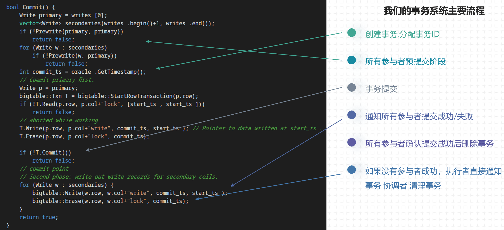
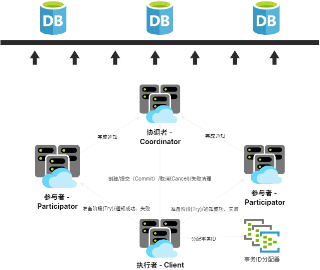
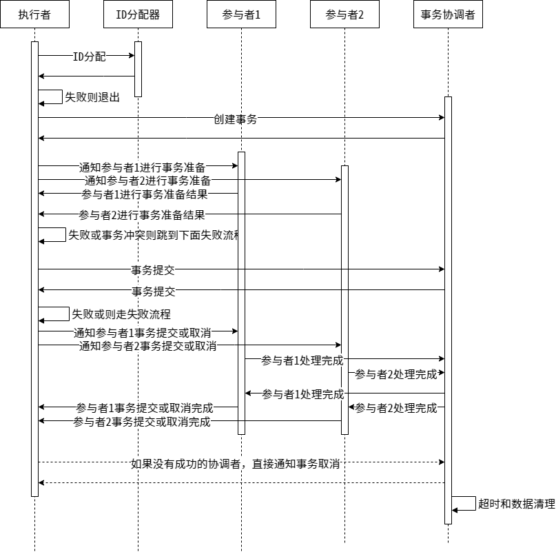
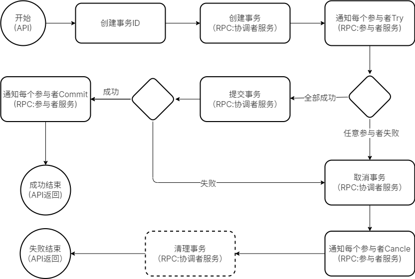

## 前言

接上文 [《游戏服务的分布式事务优化（一）- Write Ahead Log(WAL) 模块》][11]

在挺久以前我写过一篇分享 [《在游戏服务器中使用分布式事务》][1] 。当时尝试在我们的游戏服务中引入TCC模型的分布式事务机制，以优化好友和公会服务的一致性流程。
最开始的实现并不通用，后来我对这个事务的实现做了进一步的优化和重构，抽离成了较为通用的模块，并对之前没全部完成的功能做了进一步完善。
此篇为重构内容的第二部分，主要聚焦于事务管理。

## 基本原理

首先，先简介一下这个分布式事务系统的基本原理。详细一点的可以看我之前一篇文章，[《Google去中心化分布式系统论文三件套(Percolator、Spanner、F1)读后感》](https://owent.net/2019/1902.html) 。简单地流程如下:



更详细的信息可以直接去看论文Paper，相关性最高的两篇为:

+ 《Large-scale Incremental Processing Using Distributed Transactions and Notifications》: https://ai.google/research/pubs/pub36726 
+ 《Spanner: Google's Globally-Distributed Database》: https://ai.google/research/pubs/pub39966

## 整体设计

### 架构设计

在上述原理的基础上，我们把事务分成了三个角色： **协调者(coordinator)** , **参与者(participator)** 和 **执行者(client)** 。



我们把 **协调者(coordinator)** 设计成独立服务，**参与者(participator)** 和 **执行者(client)** 以SDK的形式提供，结构如下:

+ distributed_transaction
  + dtcoordsvr                              : **协调者(coordinator)** 独立服务
  + protocol                                : 通信协议结构
  + sdk                                     : SDK
    + logic/action
    + rpc
    + transaction_client_handle.h/.cpp      : **执行者(client)** SDK入口
    + transaction_participator_handle.h.cpp : **参与者(participator)** SDK入口

本来最初的想法是把这些组件也写进 [atframe_utils][2] ，还方便写单元测试。但是如果要同时支持协程和非协程异步通信，且要支持自定义IO事件管理的话，整个抽象起来太过于复杂了。而且本身分布式事务模块要接入的规范就比较多，使用起来有一定难度，抽象非常复杂的情况下使用起来就更困难了。所以最终我还是决定集成到我们的开发框架 ( [atsf4g-co][4] ) 中，复用我们的IO系统和协程RPC机制。具体位置在 [src/component/distributed_transaction][5] 目录。

### 容灾和一致性

容灾和一致性方面我们支持三种模型。

第一种模型也是最早实现的模型，**协调者(coordinator)** 服务作为弱状态服务。首先 **协调者(coordinator)** 路由使用一致性Hash，它使用数据库的CAS操作做状态管理。即本地有缓存时使用本地的缓存，否则从数据库拉取，缓存采用LRU机制淘汰。如果发生扩缩容或者分布变化，会不同节点发出的消息的路由短暂的不一致。这时候某些节点执行协调者数据保存时，CAS操作会由于冲突而失败。因为 **协调者(coordinator)** 要处理的消息比较简单，并且状态机是单向的，所以这时候我们可以直接从数据库拉取最新的数据Retry即可。


stateDiagram-v2
  Prepared: Prepared\n所有参与者准备完毕
  Committed: Committed\n已批准/提交
  Rejected: Rejected\n已否决
  WaitingParticipator: Waiting Participator\n等待所有参与者提交成功或否决的已处理通知
  DBRemoved: DB Removed\n数据库删除
  CacheRemoved: (Timer)Cache Removed\n（定时器驱动）缓存删除
  
  [*] --> Created
  Created --> Prepared
  state Prepared <<fork>>
    Prepared --> Committed
    Prepared --> Rejected
  state WaitingParticipator <<join>>
    Committed --> WaitingParticipator
    Rejected --> WaitingParticipator
    Created --> WaitingParticipator
    Prepared --> WaitingParticipator
  WaitingParticipator --> DBRemoved
  DBRemoved --> CacheRemoved
  CacheRemoved --> [*]


第二种模型比较简单，纯内存模式，即不写入数据库。这种模式适用于一些不太严格要求一致性，但要求性能更高一些的场景。

第三种模型则是实现了 [Read-Your-Writes 一致性][6] 要求。即N为副本数，W为感知到写的副本数，R为读操作需要访问的节点数。当 `W+R>N` 时，认为符合 Read-Your-Write 一致性要求。

> [Read-Your-Writes 一致性][6] 是一种以 [Client为中心][7] 的一致性模型。
> 因为对于事务的三个角色（ **执行者(client)** , **参与者(participator)** , 和 **协调者(coordinator)** ）所涉及要修改的数据各不相同。
> 在无故障时，采用这种模型的开销相对较低。

在这种场景下，不要求主从节点之分。**协调者(coordinator)** 的逻辑较轻，不需要WAL模块。但是 **执行者(client)** 和 **参与者(participator)** 的逻辑比较重。

+ **执行者(client)** 在创建事务时也要计算出当前事务的所有副本节点和(R和W的数量)。
+ **执行者(client)** 的 ***创建，提交，否决*** 流程，需要满足 `W+R>N` 。
+ **参与者(participator)** 的 ***提交，否决*** 流程，需要满足 `W+R>N` 才能回包。

以下涉及的接口如果被标识为 **(同步)** , 则表示在事务处理这个模块中是同步的，不应该依赖异步流程来完成该操作。
比如在需要发送消息时，应该由网络层组件来进行排队或等发送完消息后销毁相关资源，事务管理模块不应该关心具体细节。

> 对于所有的网络消息的传输不要求可靠，如果网络失败，可能会收不到回包，此时认为该节点失败即可。
> 当 `W+R>N` 时即可执行事务的下一步流程，所以部分节点失败并不影响事务可靠性。
> 对于不要求故障时高可用的系统(故障转移期间允许正在进行的事务失败)，可以设置 **保存完离线数据后才执行** 并设置 `W=1,R=1,N=1` 。
> 这时候数据一致性仍然能够得到保证，但是事务恢复和一致性保证依赖保存离线数据的一致性(通常时保存到KV数据库)。

对于一些涉及等待回包操作但标识为 **(同步)** 的接口，需要外部的机制来发起任务管理并最终调用 `receive_xxx_response(...)` 接口 。

> 比如在 [atsf4g-co][4] 中可以使用 `rpc::async_invoke(...)` 来发起协程任务来处理IO。

## 协调者(coordinator)

协调者主要目的是提供一个事务协调方，保证整个事务是否执行成功都是咦这个协调者内的状态为基准。其中管理逻辑是弱状态的，即使用CAS来保存数据，如果失败直接重新从数据库读取然后Retry。对于单个事务而言，流程图大致如下：



那么，我们需要实现以下协议:

```protobuf
service DtcoordsvrService {
  option (atframework.service_options) = {
    module_name: "transaction"
  };

  rpc query(SSDistributeTransactionQueryReq) returns (SSDistributeTransactionQueryRsp) {
    option (atframework.rpc_options) = {
      api_name: "拉取事务数据"
      allow_no_wait: true
      warning_log_response_code: "PROJECT_NAMESPACE_ID::err::EN_SYS_NOTFOUND"
    };
  };

  rpc create(SSDistributeTransactionCreateReq) returns (SSDistributeTransactionCreateRsp) {
    option (atframework.rpc_options) = {
      api_name: "创建分布式事务"
      allow_no_wait: true
    };
  };

  rpc commit(SSDistributeTransactionCommitReq) returns (SSDistributeTransactionCommitRsp) {
    option (atframework.rpc_options) = {
      api_name: "分布式事务-提交"
      allow_no_wait: true
      warning_log_response_code: "PROJECT_NAMESPACE_ID::err::EN_DB_OLD_VERSION"
    };
  };

  rpc reject(SSDistributeTransactionRejectReq) returns (SSDistributeTransactionRejectRsp) {
    option (atframework.rpc_options) = {
      api_name: "分布式事务-拒绝"
      allow_no_wait: true
      warning_log_response_code: "PROJECT_NAMESPACE_ID::err::EN_DB_OLD_VERSION"
    };
  };

  rpc commit_participator(SSDistributeTransactionCommitParticipatorReq)
      returns (SSDistributeTransactionCommitParticipatorRsp) {
    option (atframework.rpc_options) = {
      api_name: "分布式事务-单个参与者提交"
      allow_no_wait: true
      warning_log_response_code: "PROJECT_NAMESPACE_ID::err::EN_SYS_NOTFOUND"
      warning_log_response_code: "PROJECT_NAMESPACE_ID::err::EN_DB_OLD_VERSION"
    };
  };

  rpc reject_participator(SSDistributeTransactionRejectParticipatorReq)
      returns (SSDistributeTransactionRejectParticipatorRsp) {
    option (atframework.rpc_options) = {
      api_name: "分布式事务-单个参与者拒绝"
      allow_no_wait: true
      warning_log_response_code: "PROJECT_NAMESPACE_ID::err::EN_SYS_NOTFOUND"
      warning_log_response_code: "PROJECT_NAMESPACE_ID::err::EN_DB_OLD_VERSION"
    };
  };

  rpc remove(SSDistributeTransactionRemoveReq) returns (SSDistributeTransactionRemoveRsp) {
    option (atframework.rpc_options) = {
      api_name: "强制删除分布式事务"
      allow_no_wait: true
      warning_log_response_code: "PROJECT_NAMESPACE_ID::err::EN_DB_OLD_VERSION"
      info_log_response_code: "PROJECT_NAMESPACE_ID::err::EN_DB_RECORD_NOT_FOUND"
    };
  };
}
```

对于管理器而言，还需要实现以下功能:

+ 管理正在进行的事务: LRU Cache
+ 管理已经结束但是尚未淘汰的事务: LRU Cache
+ 调度层流程要求
  + 定期 `tick()`
    + 对超时且超出容忍值的日志做清理操作（否决）
    + GC掉可以淘汰的事务

以上功能都已经提供实现了，所以使用者使用的时候只需要部署服务就好了。不需要做额外操作。

## 参与者(participator)

**参与者(participator)** 是事务Log的业务逻辑真正的执行的地方。其数据分为两部分，第一部分是和协调者类似的事务管理层。第二部分是和具体执行的功能相关的逻辑模块，这部分可以使用 [**WAL** 模块][11]。
我们仅仅能提供SDK封装掉一些复杂的流程，让使用者接口尽可能简化。它做的事情大致如下:

+ 需要离线保存和恢复的数据
  + (必须)正在执行的事务
  + (必须)已完成的事务
  + (可选)私有数据
+ 定义行为（回调， `vtable` ）
  + (必须)事件执行回调(Do)
  + (可选)事件回滚回调(Undo,进force_commit模式有效)
  + (必须)检查事务是否可执行
  + (可选)启动事务
  + (可选)事务结束
  + (可选)事务进入已完成待清理队列
  + (可选)事务进入已完成清理
+ 接口
  + `load/dump` : 用于读取和转储离线数据。
    + 拉取数据完成后要执行:
      + 更新事务状态，如果处于已完成或移除状态，直接移入 **已完成的事务** 集合
      + 根据当前状态决定是触发 **提交事务回调** 还是 **否决事务回调** 还是待定
    + 保存离线数据完成后移除已完成的事务集合
    + 读取离线数据恢复当前状态后还需要重新向协调者请求数据，以拿到最新的事务状态
    + 如果读取完以后处于超时状态，要发起 **拉取事务当前状态数据(发起请求)**
  + 准备事务
  + 提交事务(主要用于通知协调者可以清理数据了)
    + 要先发起 **变更参与者状态数据** 请求
  + 否决事务(主要用于通知协调者可以清理数据了)
    + 要先发起 **变更参与者状态数据** 请求
  + `tick()` 接口，用于处理超时事务。超时不能直接删除，要重新向协调者请求数据更新状态。
  + `check_lock()/lock()/unlock()` 接口，以便使用 [Wound-Wait][8] 的冲突处理策略。（后面会提到，详见 [资源锁](#%E8%B5%84%E6%BA%90%E9%94%81)）
    + 业务层可以自己定义资源锁的粒度。
    + 锁的生命周期一方面跟随上述 `lock()/unlock()` 接口，另一方面跟随事务本身。

**参与者(participator)** SDK内部的实现流程较繁琐，单对用户侧暴露的接口并不多。同时对用户，我们有几点要求。

+ 所有的事务事件必须满足 [交换律][10]
+ 定期调用 `tick()` 接口
+ 定义上述 `vtable` 内的必须接口

由于我们只提供了SDK，对于RPC操作， **参与者(participator)** 服务还必须接入以下服务:

```protobuf
// ====== 事件准备阶段 ======
message SSParticipatorTransactionPrepareReq {
  transaction_participator_storage storage = 1;
}

// ====== 事件准备阶段 ======
message SSParticipatorTransactionPrepareRsp {
  transaction_participator_failure_reason reason = 1;
}

// ====== 事件提交（成功完成）请求 ======
message SSParticipatorTransactionCommitReq {
  bytes transaction_uuid = 1;  // 事务UUID
}

// ====== 事件提交（成功完成）回包 ======
message SSParticipatorTransactionCommitRsp {}

// ====== 事件拒绝（失败）请求 ======
message SSParticipatorTransactionRejectReq {
  bytes transaction_uuid = 1;  // 事务UUID

  // 对于 force_commit=true 的事务，拒绝时，需要提供完整信息以便执行undo操作
  transaction_participator_storage storage = 2;
}

// ====== 事件拒绝（失败）回包 ======
message SSParticipatorTransactionRejectRsp {}

// ------------ Here is the sample service for participator ------------
service ParticipatorService {
  rpc transaction_prepare(SSParticipatorTransactionPrepareReq) returns (SSParticipatorTransactionPrepareRsp) {
    option (atframework.rpc_options) = {
      api_name: "事务准备阶段(Try)"
      router_rpc: true
      user_rpc: true
      allow_no_wait: true
    };
  };

  rpc transaction_commit(SSParticipatorTransactionCommitReq) returns (SSParticipatorTransactionCommitRsp) {
    option (atframework.rpc_options) = {
      api_name: "事务提交(Commit)"
      router_rpc: true
      user_rpc: true
      allow_no_wait: true
    };
  };

  rpc transaction_reject(SSParticipatorTransactionRejectReq) returns (SSParticipatorTransactionRejectRsp) {
    option (atframework.rpc_options) = {
      api_name: "事务拒绝(Commit)"
      router_rpc: true
      user_rpc: true
      allow_no_wait: true
    };
  };
}
```

然后收到相应事件消息的时候去调用 `transaction_participator_handle` 里的 `prepare(...)/commit(...)/reject(...)/` 接口就可以了。

另外，我们提供了一种额外的模式，在 `transaction_participator_storage` 的配置选项里有个 `force_commit` 字段。这表示强制提交，收到Prepare消息后强制提交，直接执行Event Log。这时候如果后面收到 Reject 请求，则直接走 Undo 。用这种方式我们顺带还实现了 [2PC(两阶段提交)][12] 事务。

## 执行者(client)

有一些系统中 **执行者** 是合并进了参与者或者协调者的，我们这里按模块分开了这个功能，如果业务想要合并某些角色，直接在某类服务上同时创建这两个角色的对象即可。

**执行者** 接入的要求有

+ 扩展配置
  + 最大重试次数
  + 锁冲突随机等待时间的范围
+ 定义行为（回调， `vtable` ）
  + (必须)通知参与者准备(发起请求)
  + (可选)通知参与者否决(发起请求)
  + (可选)通知参与者提交(发起请求)
+ 接口
  + 创建事务
    + 决定采用哪种模式（数据库CAS、纯内存、[Read-Your-Writes 一致性][6]）
    + 决定是否采用Force Commit( [2PC(两阶段提交)][12] )
    + 内部会根据模式选择是
  + 设置事务数据
  + 添加参与者
  + 提交事务

可以看到，**执行者** 的接入还是相当简单的，接口也很少。如果用户不定义 **通知参与者否决** 和 **通知参与者提交** 的话，

我们采用 [标准UUID][13] 的BASE64来作为事务的Key。这样长度在24以内，对于C++11 `std::string` 还能触发小字符串优化。

**执行者** 的执行流程大致如下:



## 资源锁

前面提到，对于某些互斥的资源我们提供了加锁策略。那么既然涉及加锁，必然也会涉及死锁问题。我们采用了两种方式来解决锁冲突问题。

首先是对使用约定上的，没有程序化的约束。一个事务对所有的要占用的资源按某种固定的规则排序，我们加锁一定是有序的。
其次我们采用 [Wound-Wait][8] 策略来解除锁冲突（和死锁）。

### 关于 [Wound-Wait][8] 策略的实现

在 **参与者(participator)** 接口和 **执行者(client)** 协议中，我们提供 `lock()` 接口把资源锁在事务上，**参与者(participator)** 在事务结束时，自动释放锁。
按照 [Wound-Wait][8] 策略的标准实现，在事务 $T_n$ 和 $T_k$ 中，如果 $T_k$ 先到（先获得锁），采用以下策略：

1. $Timepoint(T_n) < Timepoint(T_k)$ : $T_n$ 抢占 $T_k$ 的锁， $T_k$ 被终止，并在一个随机时间后重试。
2. $Timepoint(T_n) > Timepoint(T_k)$ : $T_n$ 等待资源可用。

首先，我们对所有的参与者排序，锁资源约定按照参与者的顺序，以规避 [ABBA死锁][9] 问题。
然后,对于AB,BC资源锁，我们在 `prepare` 阶段加锁。对于上述的第一种场景，可以由 `prepare` 返回占用来告知 $T_k$ 被终止。在重试时重新 `prepare` 所有 **参与者(participator)** 。
而对于第二种场景，最简单地方式也是在某个随机延迟后重试。也可以更复杂地方案，由 **参与者(participator)** 记录下一个占用锁的 **执行者(client)** ，然后通知解锁。
**执行者(client)** 收到所有等待资源的解锁通知后再来重试 `prepare` 所有 **参与者(participator)** 。第一阶段我会先实现简单版本，即随机延迟后重试。
最后，我们使用对事务的Key比较来代替时间( *Timepoint* )，因为我们需要的是顺序而不太在意实际时间。因为我们的库面向线上逻辑业务不面向OLTP或OLAP，不会有长时间的大规模的锁冲突。

## 后续工作

+ 性能优化。当前版本的RPC次数还比较多，事务单CPU核心的QPS只能到千级别，延迟100ms左右这个还能够有提升空间。
+ 锁的接触通知，目前我们按标准 [Wound-Wait][8] 流程锁冲突后随机延迟后重试，后面可以加入主动通知机制。这样能更快地解锁。
+ 可能还会有一些功能需求上的提升。
+ 使用示例

我们公司内部的开源版本是有一个公会的例子和好友服务的例子，但是目前这些服务还涉及一些公司内部的组件，所以不便对外开源。
我看看啥时候有空的话可以尝试重写一个最简单功能的版本示例，规划是：

### 好友服务

| 进程名    | WAL 模块 | 订阅机制 | 事务管理     |
| --------- | -------- | -------- | ------------ |
| gamesvr   | ✔️       | ❌       | client       |
| friendsvr | ✔️       | ❌       | participator |

### 公会服务

| 进程名   | WAL 模块 | 订阅机制   | 事务管理            |
| -------- | -------- | ---------- | ------------------- |
| gamesvr  | ❌       | Subscriber | ❌                  |
| guildsvr | ✔️       | Publisher  | participator,client |

### 聊天服务 - 仅使用WAL模块，不使用事务管理

| 进程名  | WAL 模块 | 订阅机制   | 事务管理 |
| ------- | -------- | ---------- | -------- |
| gamesvr | ✔️       | Subscriber | ❌       |
| chatsvr | ✔️       | Publisher  | ❌       |

## 最后

这个整套实现开源在了 [atsf4g-co][4] 的 [src/component/distributed_transaction][5] 目录中。

欢迎有兴趣的同学互相交流。

[1]: https://owent.net/2020/2005.html
[2]: https://github.com/atframework/atframe_utils
[3]: https://etcd.io/docs/latest/learning/data_model/
[4]: https://github.com/atframework/atsf4g-co/tree/sample_solution 
[5]: https://github.com/atframework/atsf4g-co/tree/sample_solution/src/component/distributed_transaction
[6]: http://www.dbms2.com/2010/05/01/ryw-read-your-writes-consistency/
[7]: https://en.wikipedia.org/wiki/Consistency_model#Client-centric_consistency_models
[8]: http://www.mathcs.emory.edu/~cheung/Courses/554/Syllabus/8-recv+serial/deadlock-compare.html
[9]: https://www.oreilly.com/library/view/hands-on-system-programming/9781788998475/edf57b67-a572-4202-8e56-18c85c2141e4.xhtml
[10]: https://zh.wikipedia.org/zh-cn/%E4%BA%A4%E6%8F%9B%E5%BE%8B
[11]: https://owent.net/2022/2203.html
[12]: https://en.wikipedia.org/wiki/Two-phase_commit_protocol
[13]: https://en.wikipedia.org/wiki/Universally_unique_identifier
