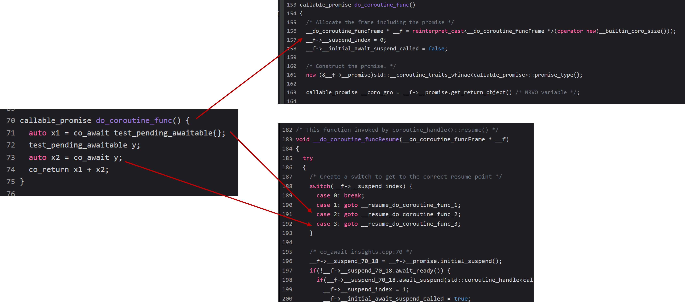
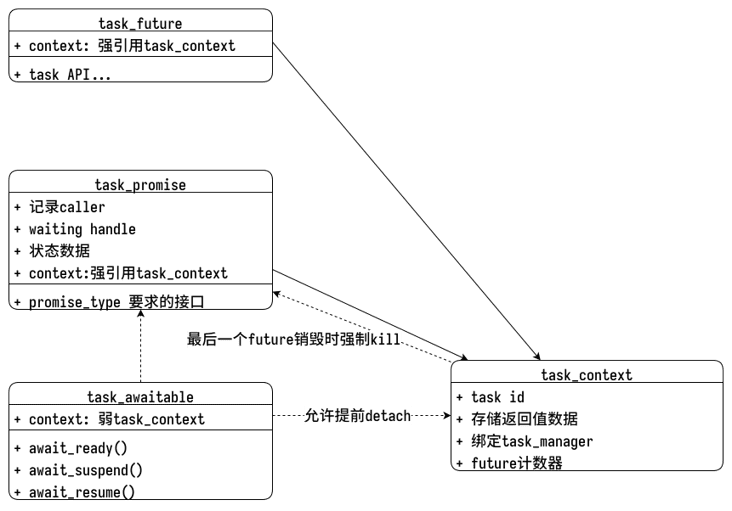
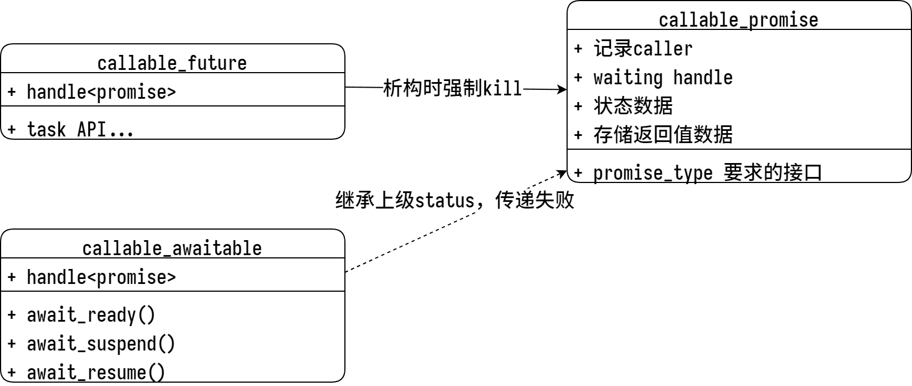
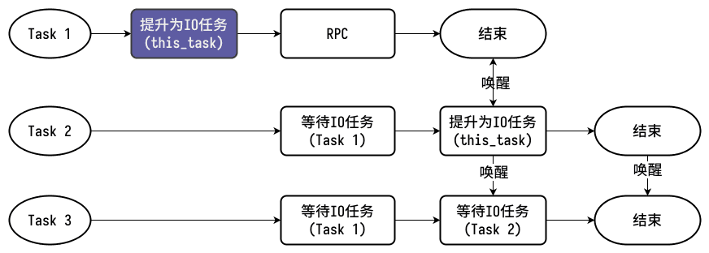
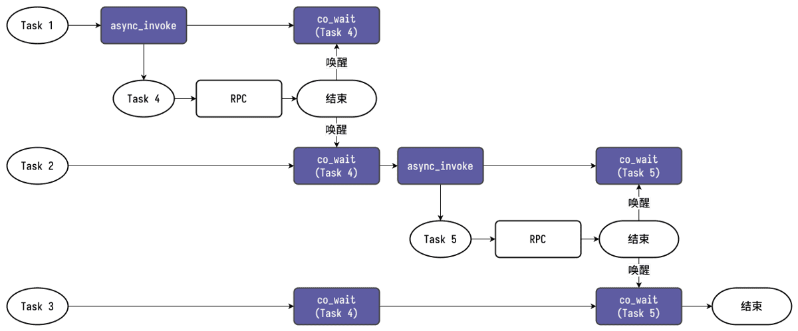

## 前言

我们终于在年初的时候最后完成了整体服务器框架对C++20协程的支持和接入。虽然之前陆陆续续抽时间改造一些组件，让它支持C++20协程，期间也记录了一些早期的设计思路和踩的坑（包括 [《libcopp接入C++20 Coroutine和一些过渡期的设计》][1]和[《libcopp对C++20协程的接入和接口设计》][2]），其中不乏一些C++20协程使用上可能打破我们常规思路细节和编译器的BUG。而且这些都是各个组件的改造，并没有最后整合到一起。

而这次，总算是全部完成了改造，并且完成了主要RPC流程的测试。在最后的改造过程中，因为C++20协程还是比较新的东西，我们希望在某些开发环境测试新协程，老环境还是走原先的协程调用方式，我设计了一套对RPC和任务系统的抽象，让无论是新协程还是老协程的调用方式都保持一致。这次整合也是又新发现了一些问题和新的编译器BUG。（[《libcopp对C++20协程的接入和接口设计》][2] 里已经提过的踩坑点和编译器BUG这里不再复述。）

## C++20协程的一些背景

之前在 [《libcopp对C++20协程的接入和接口设计》][2] 里已经做了一些文本上的设计和总结记录了，这里为了方便直观点，再提取一些重点吧。

首先C++20协程的原理是啥呢？我们可以借助 cppinsights（ <https://cppinsights.io/s/5e6b138c> ）来探其究竟。



可以看到，本质上是创建了一个对象用来放协程栈上的变量，通过一个挂起点的状态机和 `goto` 去做resume状态。

而要接入C++20协程需要满足一下需求:

| C++20协程 – 返回值(T)类型要求                                            | C++20协程 – awaitable类型要求                   |
| ------------------------------------------------------------------------ | ----------------------------------------------- |
| \[必须\] 声明类型 T::promise_type                                        | \[必须\] 实现 awaitable::await_ready            |
| \[必须\] 实现T::promise_type::get_return_object() -> T                   | \[必须\] 实现 awaitable:: await_suspend(handle) |
| \[必须\] 实现T::promise_type::initial_suspend()-> SUSPEND                | \[必须\] 实现 awaitable:: await_resume          |
| \[必须\] 实现T::promise_type::final_suspend()-> SUSPEND                  | \[可选\] 实现 co_await operator                 |
| \[必须\] 实现T::promise_type::return_void() : 和以下二选一               |                                                 |
| \[必须\] 实现T::promise_type::return_value() : 和以上二选一              |
| \[可选\] 实现T::promise_type::unhandled_exception()                      |
| \[可选\] 实现T::promise_type::await_transform(…)                         |
| \[可选\] 实现 T::promise_type::get_return_object_on_allocation_failure() |

可以看出来，接入还是比较麻烦的，所以我们的协程库 [libcopp][3] 抽象了这些要求，简化使用难度。
另外，根据我们常见的使用场景，协程是使用上大概三大类：

+ **业务层**: 由于无栈协程是侵入式的，那么业务调用的时候其实上下文关系需要层层透传。要求高性能且调用频繁。
+ **调度层**: 在框架层，我们要能总控和调度资源，控制生命周期。
+ **接入层**: 一般用于各类SDK接入、event loop接入或者其他事件机制接入。用来把各类平台服务或者功能库抽象成统一的协程模型，需要适应各类接入方式。

那么我这里针对这三种使用场景设计了3个不同的结构。

Task用于框架调度层，需要能够异步执行，能够脱离调用者的生命周期，并且需要能够提前终止，大致结构如下：



而Callable用于业务层，需要能够足够轻量，能够传递调用者和Task状态，大致结构如下：



我们可以对比一下之前有栈协程的使用情况。

| **功能点**        | **`cotask::task<T>`** | **C++20 coroutine**              | **附注**                                                                                               |
| ----------------- | --------------------- | -------------------------------- | ------------------------------------------------------------------------------------------------------ |
| 调度层 - 任务管理 | `cotask::task<T>`     | `task_future<TRETURN, TPRIVATE>` | 前者的私有数据分配在栈上，通过接口获取。后者的私有数据就是 TPRIVATE                                    |
| 接入层 - 延时操作 | `task::resume(void*)` | `generator_future<TRETURN>`      | 前者通过参数 void* 指向自定义类型，需要外部额外检查数据有效性，后者内置 set_value 接口，自动管理有效性 |
| 业务层 - 组合     | `task::yield(void*)`  | `callable_future<TRETURN>`       | 前者通过参数 void* 指向自定义类型来接收数据，后者通过 co_await 的返回                                  |
| 返回值类型        | `int`                 | 自定义                           |                                                                                                        |

那么接下来就是这些组件在实际项目框架中的落地。

## 框架任务模型和RPC模型的抽象

要实现能够一键切换老式有栈协程和新式C++20协程，需要把接口封装成两种调用形式一致。由于无栈协程是侵入式的，所以避免不了对原有接口做一些改造。
并且有些改造只能借助宏来完成，我们也尽量保证新老方式的切换对接口层的要求一致。

### 所有协程接口必须 `co_await`

由于我们的协程库（[libcopp][3]） 在父协程函数调用子协程函数没有调用 `co_await` 的话，子协程在析构时会进入 cancle 状态。而有栈协程是必须等待返回的，这里是第一个不一致的地方。
那么为了编译期能够检查这种不一致性，首先，我们就是给所有的协程接口增加了不能忽略返回值的标记，并把未使用的Warning转Error。

```cpp
/**
 * @brief nodiscard, 标记禁止忽略返回值
 * usage:
 *   EXPLICIT_NODISCARD_ATTR int a;
 *   class EXPLICIT_NODISCARD_ATTR a;
 *   EXPLICIT_NODISCARD_ATTR int a();
 */
#if defined(__cplusplus) && __cplusplus >= 201703L
#  define EXPLICIT_NODISCARD_ATTR [[nodiscard]]
#elif defined(__clang__)
#  define EXPLICIT_NODISCARD_ATTR __attribute__((warn_unused_result))
#elif defined(__GNUC__) && ((__GNUC__ >= 4) || ((__GNUC__ == 3) && (__GNUC_MINOR__ >= 1)))
#  define EXPLICIT_NODISCARD_ATTR __attribute__((warn_unused_result))
#elif defined(_MSC_VER) && _MSC_VER >= 1700  // vs 2012 or higher
#  if _MSC_VER >= 1910 && defined(_MSVC_LANG) && _MSVC_LANG >= 201703L
#    define EXPLICIT_NODISCARD_ATTR [[nodiscard]]
#  else
#    define EXPLICIT_NODISCARD_ATTR _Check_return_
#  endif
#else
#  define EXPLICIT_NODISCARD_ATTR
#endif
```

给这些接口加 `EXPLICIT_NODISCARD_ATTR` 属性即可。接下来，我们会要求所有的协程调用必须使用我们提供的宏来 “`co_await`”，即便是忽略返回值，也需要显式指定 。宏的实现如下：

```cpp
// When using c++20 coroutine, declare RPC_AWAIT_CODE_RESULT like this
#if defined(PROJECT_SERVER_FRAME_USE_STD_COROUTINE) && PROJECT_SERVER_FRAME_USE_STD_COROUTINE
#  define RPC_AWAIT_IGNORE_RESULT(x) (::rpc::details::_ignore_result(co_await (x)))
#  define RPC_AWAIT_IGNORE_VOID(x) (co_await (x))
#  define RPC_AWAIT_TYPE_RESULT(...) (co_await (__VA_ARGS__))
#  define RPC_RETURN_TYPE(...) co_return (__VA_ARGS__)
#  define RPC_RETURN_VOID co_return

#else
#  define RPC_AWAIT_IGNORE_RESULT(x) (::rpc::details::_ignore_result(x))
#  define RPC_AWAIT_IGNORE_VOID(x) (::rpc::details::_ignore_void(x))
#  define RPC_AWAIT_TYPE_RESULT(...) ::rpc::details::_get_rpc_result_value(__VA_ARGS__)
#  define RPC_RETURN_VOID return ::rpc::result_void_type(true)
#  define RPC_RETURN_TYPE(...) return ::rpc::details::_make_rpc_result_guard(__VA_ARGS__)

#endif

#define RPC_AWAIT_CODE_RESULT(...) RPC_AWAIT_TYPE_RESULT(__VA_ARGS__)
```

可以看到，我们分别对返回 `void` 类型和返回非 `void` 类型都提供了await接口和return接口。在启用和不启用协程时走不通的分支。
另外，可以看到，我们对忽略返回值，采用了 `::rpc::details::_ignore_result` 和 `::rpc::details::_ignore_void` 包装，而没有使用 `(void)(x)` 这种形式。
这是因为 `(void)(x)` 这种形式是非标准的，某些编译器上仍然会报为未使用的Warning。
而我们对 `void` 类型有栈协程也不能直接返回 `void` ，而要包一层 `result_void_type` 也是因为 `void` 是没法判定 Unused 的。

在使用上，我们的调用形式就变成了:

```cpp
int32_t res = RPC_AWAIT_CODE_RESULT(rpc::db::TABLE_SERVICE_CONFIGURE_DEF::get(get_shared_context(), 0, global_conf, &global_version));
if (PROJECT_NAMESPACE_ID::err::EN_DB_RECORD_NOT_FOUND == res) {
  RPC_AWAIT_IGNORE_RESULT(rpc::db::TABLE_SERVICE_CONFIGURE_DEF::add(get_shared_context(), global_conf));
  res = RPC_AWAIT_CODE_RESULT(rpc::db::TABLE_SERVICE_CONFIGURE_DEF::get(get_shared_context(), 0, global_conf, &global_version));
}
```

而协程函数的实现，就变成了下面这种形式:

```cpp
rpc::result_code_type player_manager::remove(rpc::context &ctx, player_manager::player_ptr_t u, bool force_kickoff) {
  if (!u) {
    RPC_RETURN_CODE(PROJECT_NAMESPACE_ID::err::EN_ROUTER_NOT_FOUND);
  }

  RPC_RETURN_CODE(RPC_AWAIT_CODE_RESULT(remove(ctx, u->get_user_id(), u->get_zone_id(), force_kickoff, u.get())));
}
```

可以看到，就是 `return` 语句用宏代替掉了。

### Task常见接口的切换封装

对于之前的一些使用方式，包括获取任务ID、判定退出状态等也需要做一层抽象。这和我们之前的使用方式有关，具体包含:

```cpp
struct task_type_trait {
  using internal_task_type = cotask::task_future<int32_t, task_private_data_type>;
  using id_type = typename internal_task_type::id_type;
  using task_type = internal_task_type;
  using task_status = typename internal_task_type::task_status_type;

  inline static id_type get_task_id(const task_type& task) noexcept;
  inline static void reset_task(task_type& task) noexcept;
  inline static bool empty(const task_type& task) noexcept;
  inline static int32_t get_result(const task_type& task);
  inline static bool is_exiting(task_status status) noexcept;
  inline static bool is_timeout(task_status status);
  inline static bool is_cancel(task_status status);
  inline static bool is_fault(task_status status);
  template <class TVALUE, class TERROR_TRANSFORM>
  inline static bool is_exiting(const copp::callable_future<TVALUE, TERROR_TRANSFORM>& future) noexcept;
  template <class TVALUE, class TERROR_TRANSFORM>
  inline static bool is_timeout(const copp::callable_future<TVALUE, TERROR_TRANSFORM>& future) noexcept;
  template <class TVALUE, class TERROR_TRANSFORM>
  inline static bool is_cancel(const copp::callable_future<TVALUE, TERROR_TRANSFORM>& future) noexcept;
  template <class TVALUE, class TERROR_TRANSFORM>
  inline static bool is_fault(const copp::callable_future<TVALUE, TERROR_TRANSFORM>& future) noexcept;
  template <class TVALUE, class TPRIVATE_DATA, class TERROR_TRANSFORM>
  inline static bool is_exiting(const cotask::task_future<TVALUE, TPRIVATE_DATA, TERROR_TRANSFORM>& task) noexcept;
  template <class TVALUE, class TPRIVATE_DATA, class TERROR_TRANSFORM>
  inline static bool is_timeout(const cotask::task_future<TVALUE, TPRIVATE_DATA, TERROR_TRANSFORM>& task) noexcept;
  template <class TVALUE, class TPRIVATE_DATA, class TERROR_TRANSFORM>
  inline static bool is_cancel(const cotask::task_future<TVALUE, TPRIVATE_DATA, TERROR_TRANSFORM>& task) noexcept;
  template <class TVALUE, class TPRIVATE_DATA, class TERROR_TRANSFORM>
  inline static bool is_fault(const cotask::task_future<TVALUE, TPRIVATE_DATA, TERROR_TRANSFORM>& task) noexcept;
  inline static task_private_data_type* get_private_data(task_type& task) noexcept;
};
```

这里还有一个特殊的地方，新的C++20协程因为主调方无法感知被切出，所以没法像之前有栈协程一样提供一个 `this_task` 接口，来获取当前运行的协程和获取绑定在上面的用户层私有数据。
纵观之前使用 `this_task` 的用例，我们发现主要就三类：第一类用于获取Task ID。然后此类Task可能被其他Task await；第二类是获取状态，是否超时、是否被Kill等等；第三类是判定当前是否在协程中。
对于Task ID，因为我们要求所有的协程调用必须透传 `rpc::context` ，所以通过把协程Task ID和用户层私有数据都写入 `rpc::context` 里来解决。
对于第二类获取状态的，我们可以用过 [libcopp][3] 内置获取当前协程状态的 `co_yield` 接口来实现：

```cpp
#if defined(PROJECT_SERVER_FRAME_USE_STD_COROUTINE) && PROJECT_SERVER_FRAME_USE_STD_COROUTINE
#  define TASK_COMPAT_ASSIGN_CURRENT_STATUS(VAR_NAME) \
    task_type_trait::task_status VAR_NAME = co_yield task_type_trait::internal_pick_current_status()
#else
#  define TASK_COMPAT_ASSIGN_CURRENT_STATUS(VAR_NAME) \
    task_type_trait::task_status VAR_NAME =           \
        task_type_trait::get_status(task_type_trait::internal_task_type::this_task())

#endif
```

而对于第三类，现在不在协程中的协程调用，会直接编译不过。所以不需要再检查了。

### 协程lambda表达式的返回值

对于C++20协程是lambda的情况，由于直接 `co_return` 并不能让编译器对应的promise是什么类型，所以现在的lambda协程都必须指定返回值类型。

```cpp
auto invoke_result = rpc::async_invoke(
    ctx, "rpc_lru_cache_map.await_fetch",
    [out, key, fn = std::move(fn)](rpc::context &child_ctx) -> rpc::result_code_type {
      int32_t ret = RPC_AWAIT_CODE_RESULT(fn(child_ctx, key, out->data_object, &out->data_version));

      if (task_type_trait::get_task_id(out->pulling_task) == child_ctx.get_task_context().task_id) {
        task_type_trait::reset_task(out->pulling_task);
      }

      RPC_RETURN_CODE(ret);
    });
```

这里没有想到什么办法可以在使用有栈协程的时候，让编译器能检测出没有显示指定返回值类型。这里有感兴趣的同学也可以一起交流下。

### `task<T>::then()` 的生命周期变化

在原先的有栈协程中，我们可以通过 `task<T>::then(action)` 来串联一些相关逻辑。比如在我们的UUID分配器代码中有一些串联和防惊群的逻辑。
因为要保证调用分配唯一ID接口顺序和实际响应顺序一致，我们分配到ID池后，通过then的回调来判定应该resume FIFO队列头的task。
在有栈协程的 `task<T>::then(action)` 中，action的生命周期是绑在 `task<T>` 之后的。而在新式的协程 `task_promise` 中，为了降低不必要的开销，我没有提供这类事件存储。

对这类典型的IO收敛任务的例子原先的流程如下:



那么为了实现类似的功能，我这里提供了一个 `async_then` 接口，内部通过 `async_invoke` 来启动一个新协程，由同一个 `task_manager` 管理生命周期。然后内部去 `co_await` 需要等待的协程。
实现如下:

```cpp
template <class TCALLABLE, class... TARGS>
void async_then(context &ctx, gsl::string_view name, task_type_trait::task_type waiting, TCALLABLE &&callable,
                TARGS &&...args) {
  if (task_type_trait::empty(waiting) || task_type_trait::is_exiting(waiting)) {
    callable(std::forward<TARGS>(args)...);
    return;
  }

  async_invoke_result result = async_invoke(
      ctx, name, [waiting = std::move(waiting), callable, args...](rpc::context &child_ctx) -> rpc::result_code_type {
        auto ret = RPC_AWAIT_CODE_RESULT(rpc::wait_task(child_ctx, waiting));
        callable(std::forward<TARGS>(args)...);
        RPC_RETURN_CODE(ret);
      });

  if (result.is_success()) {
    return;
  }

  FWLOGERROR("Try to invoke task({}) to wait task {} and then call callable failed, try to call it directly.", name,
             task_type_trait::get_task_id(waiting));
  callable(std::forward<TARGS>(args)...);
}
```

使用 `async_then` ，对应上文提到的典型IO收敛任务，现在的流程如下:



## 编译器BUG

本次发现的新的编译器BUG不是很多，这里记录一下可能其他同学也会碰到。我们封装接口的时候尽量避开就好了。

### GCC 12.2

GCC碰到的BUG简单来说就是 使用 `obj.member = co_yield TEMPLATE::func();` 这种形式的代码时，编译会Crash，报 `<source>:79:16: internal compiler error: in instantiate_type, at cp/class.cc:8742` 。必须赋值左边是一个结构体。右边是一个模板的函数返回的对象可以被 `co_await` 。

重现代码如下:

```cpp
#include <iostream>
#include <memory>
#include <coroutine>

template<class PrivateDataType>
struct task;

template <class PrivateDataType>
struct task_private_data {
  inline task_private_data() noexcept : data_(nullptr) {}
  inline task_private_data(PrivateDataType* input) noexcept : data_(input) {}
  inline task_private_data(task_private_data&& other) noexcept = default;
  inline task_private_data& operator=(task_private_data&&) noexcept = default;
  inline task_private_data(const task_private_data&) = delete;
  inline task_private_data& operator=(const task_private_data&) = delete;
  inline ~task_private_data() {}

  inline bool await_ready() const noexcept { return true; }
  inline PrivateDataType* await_resume() const noexcept { return data_; }
  inline void await_suspend(std::coroutine_handle<>) noexcept {}

  PrivateDataType* data_;
};

template<class PrivateDataType>
struct task_context {
    PrivateDataType data_;
};

template<class PrivateDataType>
struct task {
    using self_type = task<PrivateDataType>;
    std::shared_ptr<task_context<PrivateDataType>> context_;

    task(const std::shared_ptr<task_context<PrivateDataType>>& input): context_(input) {}

    static auto yield_private_data() noexcept { return task_private_data<PrivateDataType>{}; }

    struct promise_type {
      std::shared_ptr<task_context<PrivateDataType>> context_;

      template<class Input, class... Rest>
      promise_type(Input&& input, Rest&&...) {
        context_ = std::make_shared<task_context<PrivateDataType>>();
        context_->data_ = std::forward<Input>(input);
      }

      auto get_return_object() noexcept { return self_type{context_}; }
      std::suspend_never initial_suspend() noexcept { return {}; }
      std::suspend_never final_suspend() noexcept { return {}; }
      void unhandled_exception() { throw; }

      template<class ReturnType>
      void return_value(ReturnType&&) {}

      template <class InputPrivateDataType>
      inline task_private_data<InputPrivateDataType> yield_value(
          task_private_data<InputPrivateDataType>&& input) noexcept {
        input.data_ = &context_->data_;
        return task_private_data<InputPrivateDataType>(input.data_);
      }
    };
};

template<class TArg, class OutputType>
task<std::string> call1(TArg&& arg, OutputType& output) {
    OutputType* ptr = co_yield task<TArg>::yield_private_data();
    output = *ptr;
    co_return 0;
}


struct container {
    std::string* ptr;
};

template<class TArg>
task<std::string> call2(TArg&& arg, container& output) {
    output.ptr = co_yield task<TArg>::yield_private_data();
    co_return 0;
}

int main() {
  // success
  std::string output1;
  call1(std::string("hello1"), output1);
  std::cout<< "output1: "<< output1<< std::endl;

  // crash
  container output2;
  auto task2 = call2(std::string("hello2"), output2);
  std::cout<< "output2: "<< *output2.ptr<< std::endl;
  return 0;
}
```

也可以看 <https://godbolt.org/z/d5M9ca567> 这里对比和Clang的输出结果。

我给GCC的BUG单 <https://gcc.gnu.org/bugzilla/show_bug.cgi?id=108620> 也有其他人发现了相似问题，但是似乎目前还没人认领。

### MSVC 17.5

MSVC的这个BUG比GCC的要轻微得多，因为首先代码是错误的。
如上面的cppinsights的展示的C++20协程的原理中，C++20协程函数返回的对象其实是一个Promise类型。
那么可能比较自然的能想到，如果我在两个函数里 `call_parent()` 会调用 `call_child()` 且返回值一样，某些情况是否可以直接 `return` `call_child()` 的返回值，而不使用 `co_return` ？
然后其他分支可以继续使用 `co_return` ?实际上MSVC有个扩展是 `return` 和 `co_return` 混合使用，默认是不开的。而这个BUG的触发条件是，我们完全不使用 `co_return`，直接对协程函数使用 `return` 语句。
并且这个返会的对象被上层 `co_await` ，MSVC就会出现编译器内部错误。这里完整调用链的代码比较长就不贴了。

另外MSVC目前版本在协程内调用 `std::rethrow_exception` 会Crash，所以 [libcopp][3] 目前在C++20不再捕获unhandle_exception，可以由业务层自己处理。

## 写在最后

我们的框架方案和底层协程库都是开源的，协程库（[libcopp][3]）开源地址在 <https://github.com/owent/libcopp> 。
框架方案的开源版本在 <https://github.com/atframework/atsf4g-co/tree/sample_solution> ，可以通过cmake编译选项 `PROJECT_SERVER_FRAME_USE_STD_COROUTINE` 手动设置使用C++20协程还是老式有栈协程（默认在编译器支持的情况下，优先使用C++20协程）。

整个新协程的实现接入过程中，由于C++20协程能够让我们对类型信息做更多地编译期处理，我也优化了框架层很多类型检测的细节。这些不是C++20协程接入的必须项，这里就不列出了。

欢迎有兴趣的小伙伴们互相交流。

[1]: https://owent.net/2020/2004.html
[2]: https://owent.net/2022/2206.html
[3]: https://github.com/owent/libcopp
