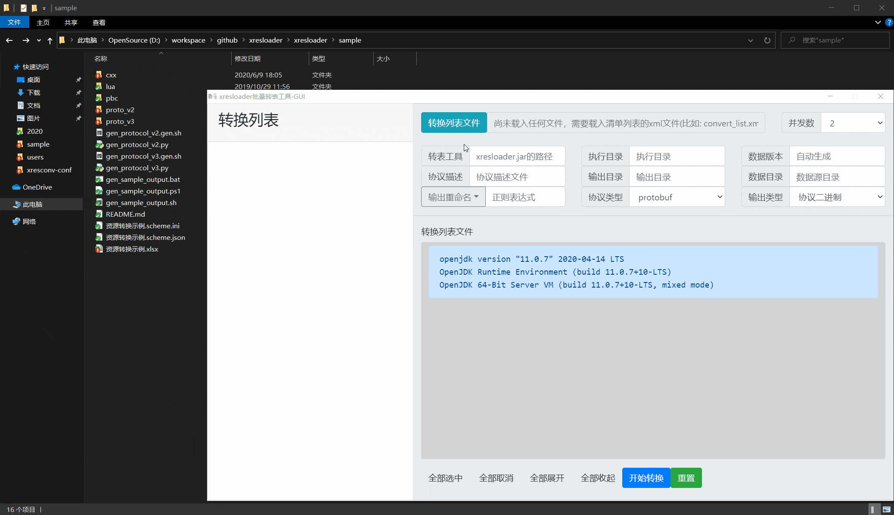
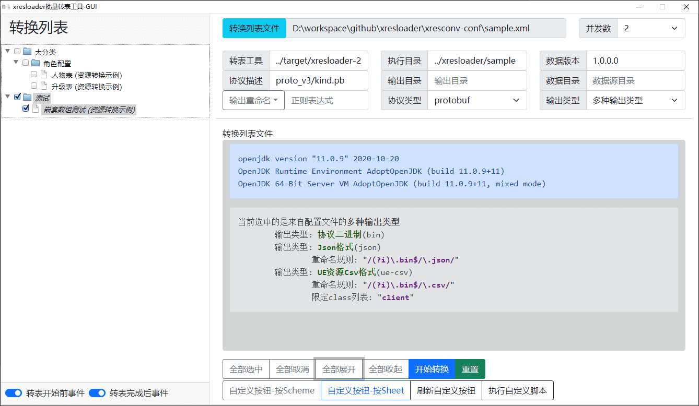

## 前言

[xresloader][1] 是一组用于把Excel数据结构化并导出为程序可读的数据文件的导表工具集。它包含了一系列跨平台的工具、协议描述和数据读取代码。

主要功能特点：

+ 跨平台（java 11 or upper）
+ Excel => protobuf/msgpack/lua/javascript/json/xml
+ 完整支持协议结构，包括嵌套结构和数组嵌套
+ 同时支持protobuf proto v2 和 proto v3
+ 支持导出proto枚举值到lua/javascript代码和json/xml数据
+ 支持导出proto描述信息值到lua/javascript代码和json/xml数据（支持自定义插件，方便用户根据proto描述自定义反射功能）
+ 支持导出 UnrealEngine 支持的json或csv格式，支持自动生成和导出 UnrealEngine 的 ``DataTable`` 加载代码
+ 支持别名表，用于给数据内容使用一个易读的名字
+ 支持验证器，可以在数据里直接填写proto字段名或枚举名，或者验证填入数据的是否有效
+ 支持通过protobuf协议插件控制部分输出
+ 支持自动合表，把多个Excel数据表合并成一个输出文件
+ 支持公式
+ 支持oneof,支持plain模式输入字符串转为数组或复杂结构,支持map
+ 支持空数据压缩（裁剪）或保留定长数组
+ 支持基于正则表达式分词的字段名映射转换规则
+ 支持设置数据版本号
+ Lua输出支持全局导出或导出为 ``require`` 模块或导出为 ``module`` 模块。
+ Javascript输出支持全局导出或导出为 ``nodejs`` 模块或导出为 ``AMD`` 模块。
+ 提供CLI批量转换工具（支持python 2.7/python 3 @ Windows、macOS、Linux）
+ 提供GUI批量转换工具（支持Windows、macOS、Linux）
+ CLI/GUI批量转换工具支持include来实现配置复用

[xresloader][1] 包含了多个组件，其中最主要的部分分别是。

+ [xresloader][2] : 转表模块引擎
+ [xresconv-cli][3] : 用于批量转表集成的命令行工具
+ [xresconv-gui][4] : 用于批量转表集成的GUI工具
+ [xresconv-conf][5] : 用于批量转表集成的规范文件
+ [xres-code-generator][6] : 读表代码生成工具
+ [xresloader-dump-bin][7] : 针对转出protobuf二进制打印为可读文本的工具
+ [xresloader-protocol][9] : 所使用的到的协议集合
+ [xresloader-docs][10] : 文档

这个工具集已经开发了很长时间了，近两年陆陆续续也收到一些Feature Request，我抽空实现了一些，同时也收到了一些PR来增强功能。

## 近期主要变更和优化

### [xresloader][2]-转表模块引擎的杂项优化和变更

对于 [xresloader][2]-转表模块引擎。首先有一些细碎的小变化:

+ 因为java 8已经逐渐时区主流支持，我们把对JRE的要求上升到了java 11。
+ 优化了文本类型的输出字段顺序，保证有序，这样便于版本迭代时使用diff工具查看变化。
+ [Plain模式][8] 的message数组允许指定下标。
+ 优化公式存在不支持函数时的输出，我们发现POI库对公式的支持有限。之前的输出会误导用户。
+ 增加了 `-r/--descriptor-print` 选项，用于导出所有描述数据，特别是导出整体描述数据到lua/javascript等脚本。
+ 抽离协议为单独的子模块，这样方便被更多的工具共享。
+ 修复Lua输出 `</` 时追加了冗余的 `\` 导致转移错误的问题。
+ 增加 `--enable-string-macro` 用于让Macro(文本替换)，对字符串类型生效。或使用 `--disable-string-macro` 让Macro(文本替换)，对字符串类型不生效。

### 启用内置的索引器

另外早先时候，有项目组反馈说使用 [xresloader][2] 转出一个超级大表（大约70万行数据）的时候耗时很长，并且会OOM。当时排查的原因是POI自带的索引开销太高了。
所以当时我基于POI库的流式接口自己实现了一个索引，CPU占用大约是POI的1/6，内存开销也低了一个数量级。

这个索引器一直处于试用阶段，经过比较长的时间测试之后，现在也是把默认的索引器切到这个内置索引了。这个内置索引和之前的相比牺牲了两个功能，一个是公式的实时重算。
因为Excel在保存时会根据当前的数据状态计算公式结果并保存在Cache里，所以即便没有公式重算，公式功能也是受支持的，这个实时重算意义也不是特别大。
另一个牺牲就是现在对日期时间类型的判定可能没有原先那么精准了，Excel预制的时间格式比较多，我没有全部去核查匹配。当然基本的格式还是可以检测到的。

由于新的索引器不支持公式重算，所以我服用了一个原来就有的选项： `--enable-excel-formular` ，用于告知 [xresloader][2] 使用老的索引器。这样对一些存量业务不方便修改或者有兼容性问题的还是可以切回到老版本。

### 重构UE输出的结构和对数组增加strip功能

如果一个Excel单元格没有填写内容，但是设置了格式，这时候接口读出来可能是有数据但是内容为空。
所以 [xresloader][2] 有一个功能是裁减掉Excel尾部的空数据。同时为了允许类似在Excel话地图、阵型的场景，提供了 `--disable-empty-list` 来关闭裁剪，强行填充空元素。

那么就有项目组提过一个Feature Request，希望可以不仅仅是裁剪 `repeated` 字段掉尾部的空数据，也可以裁剪掉头部的空数据或中间的空数据。于是我新加了一组选项 `--list-keep-empty` , `--list-strip-all-empty` 和 `--list-strip-empty-tail` 来支持对裁剪的控制。

但是这里实现的时候出现一个比较麻烦的地方。因为UE对数据格式的输出有一些要求，之前UE的输出都是单独写的数据结构的映射。
特别是对UE-Csv格式的输出，我们采用流式的输出方式。在原先只裁剪尾部的时候，我们的实现可以是碰到数据以后填充前面缺失项目来补空数据。
而现在我们对单元格碰到空数据，是不能确定我们能不能补空项目的，因为要根据配置和后面是否有数据来判断。
当然我们也可以单独写数据裁剪的规则，根据配置和当前数组元素的位置来决定是走延后的填补，还是直接跳过空数据。
但是这就有4中输出的模式需要实现为一样的功能，再加上一些插件的行为处理，导致整体逻辑非常复杂。所以我就干脆彻底重构了这一块，让UE的数据先预处理到和之前Lua、Javascipt等文本输出一样的中间结构，再导出到UE DataTable所要求的数据格式中。


flowchart TD
    A[fa:fa-file-excel-o Excel文件] --> |数据源描述信息| H(数据源和索引器)
    H --> |protobuf描述/插件| B(数据验证器和插件预处理)
    B --> G(内置数据结构)
    G --> C{UE输出模块}
    C --> D[fa:fa-file UE-Json格式输出]
    C --> E[fa:fa-file-text UE-Csv格式输出]
    C --> F[fa:fa-code UE加载代码]
    C --> I[fa:fa-code UnreaImportSettings.json]


这样也能方便后续的新功能维护。

### UE输出加载代码的定制化

我们之前集成测试的时候，UE还没有限制DataTable的Loader初始化（ `FObjectFinder` ）必须在构造函数中。后来有小伙伴提了个BUG，说（至少某些版本）UE如果Loader的初始化不在构造函数中会报错。
正好之前一直也在想加一些自定义Loader的功能，就顺便一起加上了。除了把默认Loader挪到构造函数之外，还增加了一些选项和插件，用于控制关闭默认行为。

+ 增加了 `UeCfg-EnableDefaultLoader` 这个选项，用于控制输出的代码默认情况下是否生成的Loader代码。
+ 增加了 `org.xresloader.ue.default_loader=EN_LOADER_MODE_DEFAULT|EN_LOADER_MODE_ENABLE|EN_LOADER_MODE_DISABLE` 插件，用来针对特定的数据特殊处理这个选项。
+ 增加了 `UeCfg-IncludeHeader` 选项，对所有输出的UE代码额外包含头文件，允许输出的代码增加包含头文件。
+ 增加了 `org.xresloader.ue.include_header` 插件用于对于特定的Message额外附加包含文件。

### 增加了Javascript的数据Patch机制

这里特别要感谢 [@superwenda](https://github.com/superwenda) ，提供了通过Javascript二次处理数据的插件机制。并且增加了压力测试。

现在可以通过 `CallbackScript=javascript脚本路径` 的方式对中间数据做二次处理，在整个执行流程中内置数据和输出的中间插入了脚本支持。


flowchart TD
    A[fa:fa-file-excel-o Excel文件] --> |数据源描述信息| H(数据源和索引器)
    H --> |protobuf描述/插件| B(数据验证器和插件预处理)
    B --> G(内置数据结构)
    G --> |Javascript脚本处理数据| D(内置数据结构)
    D --> C{UE输出模块}


脚本会在初始化阶段执行 `initDataSource()` 接口，在每个数据行会执行 `currentMessageCallback()` 接口。并且会注入 `gOurInstance` 和 `gSchemeConf` 用来在脚本里获取配置和描述信息。
具体的示例可以参考 <https://github.com/xresloader/xresloader/blob/main/sample/cb_script.js> 。

### 批量转表工具增加 `tag/class` 限定

现在允许针对某些装表条目设置为仅仅执行某些输出了，比如:

```xml
<?xml version="1.0" encoding="UTF-8"?>
<!-- <?xml-stylesheet type="text/xsl" href="helper/view.xsl"?> -->
<root>
    <global>
        <proto desc="协议类型，-p选项">protobuf</proto>
        <output_type desc="输出类型，-t选项，支持多个同时配置多种输出">bin</output_type>
        <output_type desc="可以通过指定class来限制输出的规则" rename="/(?i)\.bin$/\.csv/" class="client" >ue-csv</output_type>
        <!-- 其他无关设置不再列举 -->
    </global>
    <list>
        <item file="资源转换示例.xlsx" scheme="scheme_kind" name="人物表" cat="kind" class="server"></item>
        <item name="嵌套数组测试" cat="test" class="client server">
            <scheme name="DataSource" desc="数据源(文件名|表名|数据起始行号,数据起始列号)">资源转换示例.xlsx|arr_in_arr|3,1</scheme>
            <scheme name="ProtoName" desc="协议名">arr_in_arr_cfg</scheme>
            <scheme name="OutputFile" desc="输出文件名">arr_in_arr_cfg.bin</scheme>
        </item>
    </list>
</root>
```

这种情况中，**嵌套数组测试** 既会转出为protobuf二进制，又会转出为 。而 **人物表** 只会转出protobuf二进制。这样可以避免掉客户端或者服务器不需要关心的数据导出。

### 批量转表GUI工具增加事件的控制和自定义按钮

为了方便分程序同学使用，我们还提供了GUI工具。界面如下:



然后为了方便工具集成，我们给转变开始前和完成后都加入了事件机制，可以通过nodejs代码去控制后续行为去做一些工具集成。比如转表成功以后制动执行UE-Command的Import去把数据导入到DataTable中。
但是后来有其他项目组同学提出希望可以控制跳过某些事件。因为有些流程可能本地调试用，全跑完事件流程会比较慢，同时希望可以提供功能来按规则一键选中某些需要转的表的条目。
所以一方面我给命名事件（有 `name` 字段）增加了可选的开关。同时为了方便进一步支持扩展行为，增加了一组自定按钮的配置，可以配置为按通配符或者正则表达式选中和反选转表条目。
甚至允许执行配置在xml里的脚本。比如以下自定义按钮的配置:

```json
[{
    "name": "自定义按钮-按Scheme",
    "by_schemes": [{
        "file": "资源转换示例.xlsx",
        "scheme": "glob: *"
    }],
    "default_selected": false
}, {
    "name": "自定义按钮-按Sheet",
    "by_sheets": [{
        "file": "资源转换示例.xlsx",
        "sheet": "regex: .*"
    }],
    "default_selected": true,
    "style": "outline-primary"
}, {
    "name": "刷新自定义按钮",
    "action": [
        "unselect_all",
        "reload"
    ],
    "style": "outline-dark"
}, {
    "name": "执行自定义脚本",
    "action": [
        "unselect_all",
        "script: delaycall",
        "script: 自定义脚本"
    ],
    "style": "outline-dark"
}]
```

会插入的自定义按钮如下:



### 新增小工具 [xresloader-dump-bin][7]

虽然我们在使用 [xresloader][2] 转出数据的时候，可以设置多个输出，也导出一份json、lua、javascript等格式的配置以方便集成到Web或者其他周边工具中。也可以用于人工查看转出的数据。
但是我们项目中主要还是使用二进制格式，毕竟还是有些区别。为了方便查看实际的二进制数据，我新增了一个小工具 [xresloader-dump-bin][7] ，用于把protobuf格式的二进制直接转出为文本格式。
方便人工查阅，同时在发布更新资源版本的时候，为了方便使用diff工具查看变化的内容，我对输出的字段做了严格顺序的排序。

一个输出的示例如下:

```bash
# $ ./xresloader-dump-bin -p ./sample-conf/kind.pb -b ./sample-data/role_upgrade_cfg.bin

======================== Header: .\sample-data\role_upgrade_cfg.bin ========================
xresloader version: 2.8.0
data version: 2.8.0.20200609192757
data count: 11
hash code: sha256:718d22f78006e5d34d6b68eb56e204a00f4174737b6864e247b661d8963c7df3
description:
============ Body: .\sample-data\role_upgrade_cfg.bin -> role_upgrade_cfg ============
[
    {"Id": 10001, "Level": 1},
    {"Id": 10001, "Level": 2, "CostType": 10001, "CostValue": 50},
    {"Id": 10001, "Level": 3, "CostType": 10001, "CostValue": 100},
    {"Id": 10001, "Level": 4, "CostType": 10001, "CostValue": 150},
    {"Id": 10001, "Level": 5, "CostType": 10001, "CostValue": 200},
    {"Id": 10001, "Level": 6, "CostType": 10001, "CostValue": 250},
    {"Id": 10001, "Level": 7, "CostType": 10001, "CostValue": 300},
    {"Id": 10001, "Level": 8, "CostType": 10001, "CostValue": 350},
    {"Id": 10001, "Level": 9, "CostType": 10101, "CostValue": 400},
    {"Id": 10001, "Level": 10, "CostType": 10101, "CostValue": 450},
    {"Id": 10001, "Level": 11, "CostType": 10101, "CostValue": 500},
]
```

如果加 `--pretty` 选项可以进一步展开。diff的话比如可以如下输出:

```bash
$ git diff -a l.txt r.txt
diff --git a/l.txt b/r.txt
index 7ed0f3c..6f8d6fb 100644
--- a/l.txt
+++ b/r.txt
@@ -15,5 +15,6 @@ description:
     {"Id": 10001, "Level": 7, "CostType": 10001, "CostValue": 300},
     {"Id": 10001, "Level": 8, "CostType": 10001, "CostValue": 350},
     {"Id": 10001, "Level": 9, "CostType": 10101, "CostValue": 400},
-    {"Id": 10001, "Level": 10, "CostType": 10101, "CostValue": 500},
+    {"Id": 10001, "Level": 10, "CostType": 10101, "CostValue": 450},
+    {"Id": 10001, "Level": 11, "CostType": 10101, "CostValue": 500},
 ]
```

如果使用 `vimdiff` 或者其他编辑器的diff还能更好看一些。

## 最后

感谢大家的关注和贡献，欢迎持续交流拍砖。

[1]: https://xresloader.atframe.work/
[2]: https://github.com/xresloader/xresloader
[3]: https://github.com/xresloader/xresconv-cli
[4]: https://github.com/xresloader/xresconv-gui
[5]: https://github.com/xresloader/xresconv-conf
[6]: https://github.com/xresloader/xres-code-generator
[7]: https://github.com/xresloader/xresloader-dump-bin
[8]: https://xresloader.atframe.work/users/advance_usage.html#plain-xresloader-2-7-0
[9]: https://github.com/xresloader/xresloader-protocol
[10]: https://github.com/xresloader/xresloader-docs
