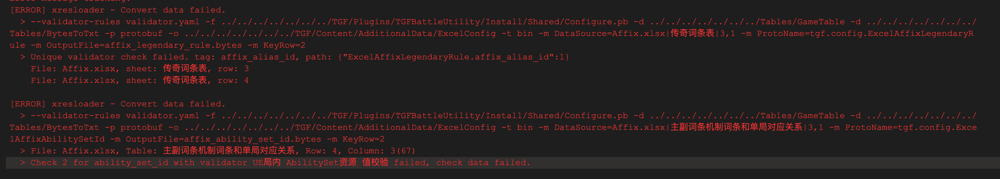

## 前言

[xresloader][1] 是一组用于把Excel数据结构化并导出为程序可读的数据文件的导表工具集。它包含了一系列跨平台的工具、协议描述和数据读取代码。

主要功能特点：

+ 跨平台（java 11 or upper）
+ Excel => protobuf/msgpack/lua/javascript/json/xml
+ 完整支持协议结构，包括嵌套结构和数组嵌套
+ 同时支持protobuf proto v2 和 proto v3
+ 支持导出proto枚举值到lua/javascript代码和json/xml数据
+ 支持导出proto描述信息值到lua/javascript代码和json/xml数据（支持自定义插件，方便用户根据proto描述自定义反射功能）
+ 支持导出 UnrealEngine 支持的json或csv格式，支持自动生成和导出 UnrealEngine 的 ``DataTable`` 加载代码
+ 支持别名表，用于给数据内容使用一个易读的名字
+ 支持验证器，可以在数据里直接填写proto字段名或枚举名，或者验证填入数据的是否有效
+ 支持通过protobuf协议插件控制部分输出
+ 支持自动合表，把多个Excel数据表合并成一个输出文件
+ 支持公式
+ 支持oneof,支持plain模式输入字符串转为数组或复杂结构,支持map
+ 支持空数据压缩（裁剪）或保留定长数组
+ 支持基于正则表达式分词的字段名映射转换规则
+ 支持设置数据版本号
+ Lua输出支持全局导出或导出为 ``require`` 模块或导出为 ``module`` 模块。
+ Javascript输出支持全局导出或导出为 ``nodejs`` 模块或导出为 ``AMD`` 模块。
+ 提供CLI批量转换工具（支持python 2.7/python 3 @ Windows、macOS、Linux）
+ 提供GUI批量转换工具（支持Windows、macOS、Linux）
+ CLI/GUI批量转换工具支持include来实现配置复用

[xresloader][1] 包含了多个组件，其中最主要的部分分别是。

+ [xresloader][2] : 转表模块引擎
+ [xresconv-cli][3] : 用于批量转表集成的命令行工具
+ [xresconv-gui][4] : 用于批量转表集成的GUI工具
+ [xresconv-conf][5] : 用于批量转表集成的规范文件
+ [xres-code-generator][6] : 读表代码生成工具
+ [xresloader-dump-bin][7] : 针对转出protobuf二进制打印为可读文本的工具
+ [xresloader-protocol][8] : 所使用的到的协议集合
+ [xresloader-docs][9] : 文档

这个工具链集合已经开发了比较长的时间了，也收到过很多项目组提的Feature request。由于时间原因每次都是收集一批功能需求之后抽时间一起实现。
这次也是我们的新项目需要所以一起实现了一批之前计划中的功能点，主要是在数据验证方面。

## 新的验证器

我大幅改造了验证器机制，现在会自动对验证器的配置做标准化操作，这样能更多地命中和复用验证器缓存。同时增加了简单的词法解析，以便支持函数式的验证器配置。
以下有一些新的验证器用到了这个大重构。

### 唯一性验证器

我原来是推崇用Excel自带的重复检查功能来检查重复数据。但是实际上Excel的这类数据验证写起来并不太方便，而且多种验证规则组合也比较麻烦。
所以我索性直接在 [xresloader][1] 里来提供这个功能了。

首先是增加了 `org.xresloader.field_unique_tag` 插件，值是一个字符串，表示唯一性检测标签，可以出现多次。
对于相同唯一性检测标签的所有字段组合，只能出现一次。否则转换过程就会报错。比如:

```protobuf
message level_up_cfg {
    uint32         id    = 1 [ (org.xresloader.field_unique_tag) = "id_level" ];
    uint32         level = 2 [ (org.xresloader.field_unique_tag) = "id_level" ];
}
```

|  角色ID   | 等级             |   备注       |
|-----------|------------------|--------------|
|   id      | level            |              |
|   10001   | 1                |              |
|   10001   | 2                |              |
|   10001   | 1                | 此行会冲突   |

### Excel数据列和外部文本验证器

为了方便验证数据在Excel某个列中必须存在，我们增加了 `InTableColumn("文件名", "Sheet名", 从第几行开始, 从第几列开始)` 和 `InTableColumn("文件名", "Sheet名", 从第几行开始, KeyRow, KeyValue)` 的数据列验证器。

比如我们配置某个道具ID必须在道具表中存在，比如对于在 `Item.xlsx` 文件的 `items` 表中这种结构:

|  角色ID   | 描述           |
|-----------|----------------|
|  item_id  | name           |
|  1001     | coin           |

那么我们可以把要验证的字段验证器设置为 `InTableColumn("Item.xlsx", "items", 3, 1)` 。
有时候，我们也要方便Excel结构调整，那么这时候数据列可能是不确定的，那么我们可以通过上面第二个验证器来告诉 [xresloader][1] 从那一行读取 `KeyRow` ，并且使用匹配的值所在列作为数据列。比如 `InTableColumn("Item.xlsx", "items", 3, 2, item_id)` 。

有时候外部数据不总是来自于Excel文件，比如在我们项目中，要交叉验证Excel里的配置和Unreal Engine(UE)里的资产是否匹配。
我们会先开发工具流把Unreal Engine(UE)里要验证的资产导出文本文件，另外提供了 `InText("文件名"[, 第几个字段[, "字段分隔正则表达式"]])` 验证器来读取并解析指定文本里的字段。

### 自定义验证器

自定义验证器主要用于重复使用一些复杂组合的验证规则。比如我们配置奖励表，要求奖励必须是某个虚拟的道具ID（对应protobuf的枚举类型），或者在道具表中，或者在邮件表中，或者在商城表中等等。
每一个要配置奖励的地方都去单独写这么长的验证规则，一方面不好看，另一方面后续增加新类型维护起来非常容易出错。于是我们现在提供了一个自定义验证器的功能。

首先是增加了 `--validator-rules` 参数用于告诉 [xresloader][1] 去哪里读取自定义验证器，自定义验证器配置是一个 YAML 文件，格式如下:

```yaml
validator:
  - name: "validator name"
    description: "（可选）描述"
    rules:
      - 子规则1
      - 子规则2
      - ...
```

为了降低错误配置，我们会检测验证器的环形依赖。但是为了降低不必要的检测开销，我们仅仅在第一次使用这个验证器时才会做检查。

比如我们配置验证器:

```yaml
validator:
  # com.struct.battle.config.proto
  - name: "UESourceAbilitySet_ue_source_id"
    description: "UE局内 AbilitySet资源 值校验"
    rules:
      - InText("UeSource_AbilitySet.txt", 3)
  - name: "ExcelAffixCountRandomPool_affix_count_pool_id"
    description: "Affix.xlsx|词条数量随机池表|affix_count_pool_id 值校验"
    rules:
      - InTableColumn("Affix.xlsx", "词条数量随机池表", 3, 2, "affix_count_pool_id")
```

验证器检查不通过的一个示例如下(还包含一个唯一性检查报错):



### 数值范围验证器的增强

范围验证器的增强主要有两处，一处是支持 `>数字` , `>=数字` , `<数字` , `<=数字` 这种格式的配置。第二处是现在支持浮点数了。

## 其他优化

### 验证器细项优化

+ `org.xresloader.field_alias` 和 `org.xresloader.enum_alias` 允许多个别名。
  > 这样可以方便版本升级的时候做一定时间的向前兼容。
  > 我们在某些协议功能性更新期间，可以先同时保留新老版本的别名，等到代码层改造完以后在移除老的别名。
+ 验证器插件重命名 `verifier` -> `validator`。兼容老版本二进制配置和文本配置。
+ 增加 `org.xresloader.field_not_null` 插件和 `org.xresloader.oneof_not_null` 插件用以忽略Excel中指定数据为空的数据行。
  > 这可以有效的减少一些Excel误操作带来的空数据项。（比如漏删除空单元格，不小心设置了某个空数据行的单元格格式）。比如:
  >
  > ```protobuf
  > message level_up_cfg {
  >     uint32         id    = 1 [ (org.xresloader.field_not_null) = true ];
  >     uint32         level = 2;
  > }
  > ```
  >
  > |  角色ID   | 等级             |   备注       |
  > |-----------|------------------|--------------|
  > |   id      | level            |              |
  > |   10001   | 1                |              |
  > |           | 2                | 此行会被忽略 |

### 文件管理优化

+ 允许传入多个 pb 文件，方便项目组分类管理多个pb。并且允许多个pb中有重复类型声明。
  > 有重复类型声明会使用第一个。

+ 对于内建的数据索引模式（关闭实时公式）。我们实现了一个LRU算法的数据表缓存，并提供了选项 `--data-source-lru-cache-rows` 来控制缓存数据行数。
  > 这样对于一些经常加载的数据可以大幅减少IO和建索引的开销。
  > 特别是有了自定义验证器以后。可以让用于验证的数据尽可能命中缓存。

### UE输出代码的增强

我们收到反馈，UE的 `FObjectFinder` 只能用于构造函数吗，但是某些使用的流程里并不在构造函数里初始化，并且有些使用者需要一些更细致得定制化输出类型的需求。
为了适配这些场景，我们也实验性质的增加了一系列辅助工具。

+ 增加 `UeCfg-EnableDefaultLoader` 选项控制默认的Loader是否开启
+ 增加 `org.xresloader.ue.default_loader=EN_LOADER_MODE_DEFAULT|EN_LOADER_MODE_ENABLE|EN_LOADER_MODE_DISABLE` 选项控制单独的Message是否开启默认Loader
+ 增加 `UeCfg-IncludeHeader` 选项，对所有输出的UE代码额外包含头文件
+ 增加 `org.xresloader.ue.include_header` 插件用于对于特定的Message额外附加包含文件
+ 增加 `org.xresloader.ue.ue_origin_type_name` 来设置输出UE代码的原始类型
+ 增加 `org.xresloader.ue.ue_origin_type_default_value` 来设置输出UE代码的原始类型的默认值

通过上面的插件和选项，再结合代码层面的控制，我们可以允许使用者自定义什么时候加载数据，从哪里加载数据，以及一些自定义的类型行为。
当然这些工具和选项目前是实验性质的，以后我们可能会在保证功能不减少的情况下做一些调整。

### 杂项优化和修复

+ 修复了一些错误
  + 在Plain模式中 `oneof` 内使用enum类型时，无法导出输出的问题。
  + 修复Lua输出 `</` 时追加了冗余的 `\` 导致转移错误的问题。
+ 修复打包时 `Discovered module-info.class. Shading will break its strong encapsulation.` 的告警
+ 优化错误提示输出的列名（A、B、C之类）。
+ 从Excel读取浮点数支持 `%` ，读取整数支持 `,` 分隔符。方便某些工具写入数据时自动添加这种模式的数值。
+ 允许在Excel同一列里配置多个字段，由转表工具自动复制。
  > 这个功能主要是搭配读表工具使用，因为目前读表代码生成工具只支持对第一层数据建索引。如果我们有数据要封装进内部，可以使用这种方式。比如:
  >
  > ```protobuf
  > message level_data_cfg {
  >     uint32 level = 1;
  >     uint32 exp = 2;
  > }
  > message level_up_cfg {
  >     option (xrescode.loader) = {
  >         file_path: "level_up.bytes"
  >         indexes: { fields: "id" fields: "level" index_type: EN_INDEX_KV }
  >         tags: "client"
  >         tags: "server"
  >     };
  >     uint32         id    = 1;
  >     uint32         level = 2;
  >     level_data_cfg data  = 3;
  > }
  >```
  >
  > |  角色ID   | 等级             |   经验      |
  > |-----------|------------------|-------------|
  > |   id      | level,data.level | data.exp    |
  > |   10001   | 1                | 0           |

## 开源和文档

有兴趣的小伙伴们可以访问下面链接查看更多详情:

+ 文档: <https://xresloader.atframe.work/>
+ 命令行批量转表工具: <https://github.com/xresloader/xresconv-cli>
+ GUI批量转表工具: <https://github.com/xresloader/xresconv-gui>
+ 读取代码生成工具: <https://github.com/xresloader/xres-code-generator>
+ 二进制输出Dump文本工具: <https://github.com/xresloader/xresloader-dump-bin>
+ 文档系统源码: <https://github.com/xresloader/xresloader-docs>

[1]: https://xresloader.atframe.work/
[2]: https://github.com/xresloader/xresloader
[3]: https://github.com/xresloader/xresconv-cli
[4]: https://github.com/xresloader/xresconv-gui
[5]: https://github.com/xresloader/xresconv-conf
[6]: https://github.com/xresloader/xres-code-generator
[7]: https://github.com/xresloader/xresloader-dump-bin
[8]: https://github.com/xresloader/xresloader-protocol
[9]: https://github.com/xresloader/xresloader-docs
