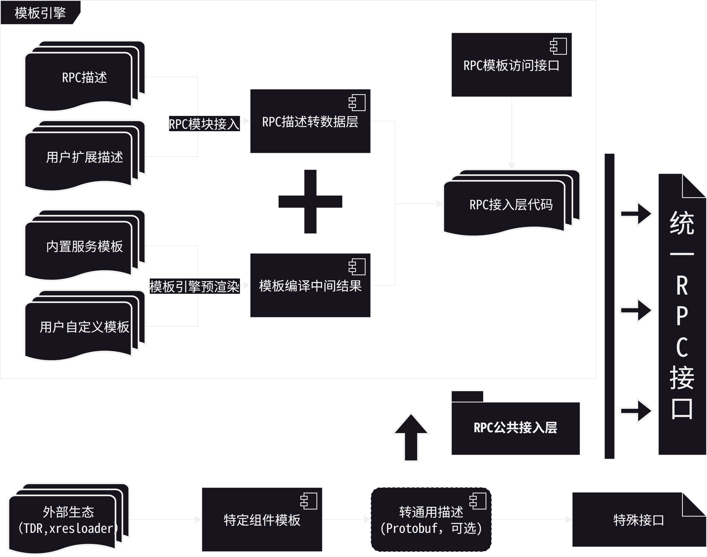

## 背景

我们项目组需要接入多种RPC接入和工具转换流程，并且每种接入层有自己的扩展和定制需求。为了提高开发效率，我们需要一个通用的RPC代码生成器，能够支持多种RPC接入层级的代码生成，同时支持自定义插件和模板。并且自由增加自定义插件而不需要变更构建系统流程。以便提供最佳的灵活性且能支持protobuf的所有特性。

## 使用上手文档

目前仅提供了Jinja2模板引擎的cmake接口封装（service-rpc层级），如果有需要Mako模板引擎封装接口或者增加message-field层级、enum-enumvalue层级、fileset-file层级或者global层级的接口入口可以联系 @owentou 。

首先添加Proto查找路径：

```cmake
generate_for_pb_add_proto_path("${PROJECT_SERVER_FRAME_PROTOCOL_DIR}/private"
                               "${PROJECT_SERVER_FRAME_PROTOCOL_DIR}/public")
```

添加Proto：

```cmake
generate_for_pb_add_proto_file(
  "${PROJECT_SERVER_FRAME_PROTOCOL_DIR}/private/protocol/extension/svr.*.proto"
  "${PROJECT_SERVER_FRAME_PROTOCOL_DIR}/private/protocol/common/svr.*.proto"
  "${PROJECT_SERVER_FRAME_PROTOCOL_DIR}/private/protocol/config/svr.*.proto"
  "${PROJECT_SERVER_FRAME_PROTOCOL_DIR}/private/protocol/pbdesc/svr.*.proto"
  "${PROJECT_SERVER_FRAME_PROTOCOL_DIR}/public/protocol/extension/*.proto"
  "${PROJECT_SERVER_FRAME_PROTOCOL_DIR}/public/protocol/common/*.proto"
  "${PROJECT_SERVER_FRAME_PROTOCOL_DIR}/public/protocol/config/*.proto"
  "${PROJECT_SERVER_FRAME_PROTOCOL_DIR}/public/protocol/pbdesc/*.proto")
```

（可选）注册服务器间通信服务:

```cmake
generate_for_pb_add_ss_service(
  "${PROJECT_NAMESPACE}.LogicCommonService"
  "${CMAKE_CURRENT_LIST_DIR}/server_frame"
  TASK_PATH_PREFIX "logic"
  HANDLE_PATH_PREFIX "logic"
  PROJECT_NAMESPACE "${PROJECT_NAMESPACE}"
  SERVICE_DLLEXPORT_DECL SERVER_FRAME_API
  RPC_DLLEXPORT_DECL SERVER_FRAME_API)
```

（可选）注册CS通信服务和CS协议模拟工具接口:

```cmake
# 注册CS通信服务
generate_for_pb_add_cs_service(
  "${PROJECT_NAMESPACE}.GameClientService"
  "${CMAKE_CURRENT_LIST_DIR}/gamesvr"
  RPC_IGNORE_EMPTY_REQUEST
  TASK_PATH_PREFIX "logic"
  HANDLE_PATH_PREFIX "app"
  PROJECT_NAMESPACE "${PROJECT_NAMESPACE}"
  SERVICE_DLLEXPORT_DECL GAMECLIENT_SERVICE_API
  RPC_DLLEXPORT_DECL GAMECLIENT_RPC_API)

# 注册CS协议模拟工具接口
generate_for_pb_add_simulator_cs_api(
  "${PROJECT_NAMESPACE}.GameClientService"
  "${CMAKE_CURRENT_LIST_DIR}/tools/simulator"
  RPC_IGNORE_EMPTY_REQUEST
  PROJECT_NAMESPACE "${PROJECT_NAMESPACE}"
  SERVICE_DLLEXPORT_DECL GAMECLIENT_SERVICE_API
  RPC_DLLEXPORT_DECL GAMECLIENT_RPC_API)
```

（可选）注册自定义配置

```cmake
generate_for_pb_add_custom_configure(
  "
# ${PROJECT_NAMESPACE}.ace.AntiCheatExpertService
- service:
    name: '${PROJECT_NAMESPACE}.ace.AntiCheatExpertService'
    overwrite: false
    output_directory: '${CMAKE_CURRENT_LIST_DIR}/sdk'
    service_dllexport_decl: 'ACE_SERVICE_API'
    rpc_dllexport_decl: 'ACE_SDK_API'
    custom_variables:
      project_namespace: '${PROJECT_NAMESPACE}'
      include_headers: [ ]
    service_template:
      - overwrite: true
        input: '${GENERATE_FOR_PB_SOURCE_DIR}/templates/ace_http_apis.h.mako'
        output: 'include/rpc/ace/ace_http_apis.h'
      - overwrite: true
        input: '${GENERATE_FOR_PB_SOURCE_DIR}/templates/ace_http_apis.cpp.mako'
        output: 'src/rpc/ace/ace_http_apis.cpp'")
```

最后执行启动生成:

```cmake
# Run generator finally
generate_for_pb_run_generator()
```

模板内自动注入的变量参见下面 [自动注入的模板变量和接口](#自动注入的模板变量和接口) 章节。

模板引擎语法参见下面 [模板引擎语法参考](#模板引擎语法参考) 章节。

CMake接口说明参见下面 [CMake接口](#CMake接口) 章节。

## 设计文档

### 代码生成器引擎版本和配置

目前 **通用RPC代码生成器** 有两个版本:

- Jinja2模板引擎: [src/tools/generate-for-pb/jinja2-generator.py](https://github.com/atframework/atsf4g-co/blob/main/src/tools/generate-for-pb/jinja2-generator.py)
  - CMake变量: `${GENERATE_FOR_PB_JINJA2_PY}`
- Mako模板引擎: [src/tools/generate-for-pb/mako-generator.py](https://github.com/atframework/atsf4g-co/blob/main/src/tools/generate-for-pb/mako-generator.py)
  - 对应CMake变量: `${GENERATE_FOR_PB_MAKO_PY}`
- 中间配置参考: [src/tools/generate-for-pb/generate-for-pb.conf.yaml](https://github.com/atframework/atsf4g-co/blob/main/src/tools/generate-for-pb/generate-for-pb.conf.yaml)

> Mako模板引擎有更好的灵活性，可以自由引入Python的全部组件。Jinja2的限定比较严格，目前仅导入了 `os`,`re`,`sys`,`re` 几个系统组件。
> 如果需要增加的话需要改模板引擎脚本。

### 模板引擎语法参考

- Jinja模板语法: <https://jinja.palletsprojects.com/en/stable/templates/>
- Mako模板语法: <https://docs.makotemplates.org/en/latest/>

### CMake接口

```cmake
# 添加Proto查找路径
generate_for_pb_add_proto_path([proto文件查找路径...])

# 添加Proto
generate_for_pb_add_proto_file([proto文件...])

# 添加自定义配置组(结构见中间配置结构的Rules部分)
generate_for_pb_add_custom_configure("YAML配置内容")

# 注册服务间通信服务
generate_for_pb_add_ss_service("服务名" "输出目录"
  [RPC_IGNORE_EMPTY_REQUEST]        # 是否忽略 google.protobuf.Empty 类型请求
  [NO_RPC]                          # 不生成RPC模板
  [NO_SERVICE_TASK]                 # 不生成Service模板
  [TASK_PATH_PREFIX <value>]        # 输出的任务代码路径前缀
  [HANDLE_PATH_PREFIX <value>]      # 输出的handle注册代码路径前缀
  [PROJECT_NAMESPACE <value>]       # 项目命名空间
  [RPC_ROOT_DIR <value>]            # 输出的RPC模板渲染文件目录
  [SERVICE_DLLEXPORT_DECL <value>]  # Service模板符号导出宏
  [RPC_DLLEXPORT_DECL <value>]      # RPC模板符号导出宏
  [INCLUDE_HEADERS <values...>]     # 额外包含的头文件
)

# 注册CS通信服务
generate_for_pb_add_cs_service("服务名" "输出目录"
  [RPC_IGNORE_EMPTY_REQUEST]        # 是否忽略 google.protobuf.Empty 类型请求
  [TASK_PATH_PREFIX <value>]        # 输出的任务代码路径前缀
  [HANDLE_PATH_PREFIX <value>]      # 输出的handle注册代码路径前缀
  [PROJECT_NAMESPACE <value>]       # 项目命名空间
  [SERVICE_DLLEXPORT_DECL <value>]  # Service模板符号导出宏
  [RPC_DLLEXPORT_DECL <value>]      # RPC模板符号导出宏
  [INCLUDE_HEADERS <values...>]     # 额外包含的头文件
)

# 注册CS协议模拟工具接口
generate_for_pb_add_simulator_cs_api("服务名" "输出目录"
  [RPC_IGNORE_EMPTY_REQUEST]        # 是否忽略 google.protobuf.Empty 类型请求
  [PROJECT_NAMESPACE <value>]       # 项目命名空间
  [SERVICE_DLLEXPORT_DECL <value>]  # Service模板符号导出宏
  [RPC_DLLEXPORT_DECL <value>]      # RPC模板符号导出宏
  [INCLUDE_HEADERS <values...>]     # 额外包含的头文件
)

# 执行生成
generate_for_pb_run_generator()
```

还可以根据需要扩展更多的自定义服务流程

### 技术白皮书

为了降低重复解析pb和建立符号表带来的CPU开销导致的流程缓慢。整个模板引擎的RPC流程尽量采用统一配置文件，加载多个pb file的方式。然后通过配置多组生成组来生成不同的服务和模板。





代码生成的层级分为两类，第一类是全局模板。对应配置中的 `- global:` 。另一类是层级模板，分为外层和里层。外层会对每个模板执行一次渲染，里层模板会对每个内部子结构分别做一次渲染。

- 对于service模板，外层是service本身，里层是rpc。
- 对于message模板，外层是message本身，里层是每个字段。
- 对于enum模板，外层是enum本身，里层是每个枚举项。
- 对于fileset模板，外层是pb文件本身的描述，里层是每个文件。

比如我们要对以下服务应用模板渲染:

```proto
service FriendsvrService {
  option (atframework.service_options) = {
    module_name: "friend_api"
  };

  rpc get_all(SSFriendGetAllReq) returns (SSFriendGetAllRsp) {
    option (atframework.rpc_options) = {
      api_name: "拉取好友信息"
      router_rpc: true
      user_rpc: true
    };
  };

  rpc echo(SSFriendEchoReq) returns (SSFriendEchoRsp) {
    option (atframework.rpc_options) = {
      api_name: "Benchmark接口-用于请求放大"
      router_rpc: true
      user_rpc: true
    };
  };
}
```

对 `service.c.template` 输入 `FriendsvrService` 渲染输出一个文件 `friendsvr_service.c` ，然后对每个RPC分别应用 `rpc.c.template` 渲染除 `rpc_get_all.c` 和 `rpc_echo.c` 。
那么就是使用service模板， `service.c.template` 作为外层模板，`rpc.c.template` 作为内层模板。

显然这里我们输出的文件名也是根据外层或内层的结构动态生成的。所以我们的文件名输出也支持模板渲染参数。
这个例子里 `service.c.template` 的输出可以设置为 `{{ service.get_name_lower_rule() }}.c` 。`rpc.c.template` 的输出可以设置为 `rpc_{{ rpc.get_name_lower_rule() }}.c`

所有的输出均会检查变更，未变更不写出。这样不会破坏编译缓存命中。

### 自动注入的模板变量和接口

#### 全局模板

```javascript
{
    "generator": "代码生成器路径",
    "local_vcs_user_name": "当前操作者用户名",
    "output_file_path": "输出文件路径",
    "output_render_path": "输出文件路径渲染结果",
    "database": PbDatabase(), // PbDatabase 对象
    "global_dllexport_decl": "符号导出宏",
    "PbConvertRule": PbConvertRule // PbConvertRule里包含了一些命名转换定义
}
```

#### Service模板

外层模板参数:

```javascript
{
    "generator": "代码生成器路径",
    "local_vcs_user_name": "当前操作者用户名",
    "service": PbService(), // 对应的PbService对象
    "rpcs": {"rpc name": PbRpc()}, // Service内的rpc集合
    "output_file_path": "输出文件路径",
    "output_render_path": "输出文件路径渲染结果",
    "current_instance": PbService(), // service的别名
    "service_dllexport_decl": "Service模板符号导出宏",
    "rpc_dllexport_decl": "RPC模板符号导出宏",
    "PbConvertRule": PbConvertRule // PbConvertRule里包含了一些命名转换定义
}
```

内层模板参数:

```javascript
{
    "generator": "代码生成器路径",
    "local_vcs_user_name": "当前操作者用户名",
    "service": PbService(), // 对应的PbService对象
    "rpcs": {"rpc name": PbRpc()}, // Service内的rpc集合
    "rpc": PbRpc(), // 当前渲染的rpc对象
    "output_file_path": "输出文件路径",
    "output_render_path": "输出文件路径渲染结果",
    "current_instance": PbRpc(), // rpc的别名
    "service_dllexport_decl": "Service模板符号导出宏",
    "rpc_dllexport_decl": "RPC模板符号导出宏",
    "PbConvertRule": PbConvertRule // PbConvertRule里包含了一些命名转换定义
}
```

#### Message模板

外层模板参数:

```javascript
{
    "generator": "代码生成器路径",
    "local_vcs_user_name": "当前操作者用户名",
    "message": PbMessage(), // 对应的PbMessage对象
    "fields": {"field name": PbField()}, // Message内的字段集合
    "output_file_path": "输出文件路径",
    "output_render_path": "输出文件路径渲染结果",
    "current_instance": PbMessage(), // message的别名
    "message_dllexport_decl": "Message模板符号导出宏",
    "field_dllexport_decl": "字段模板符号导出宏",
    "PbConvertRule": PbConvertRule // PbConvertRule里包含了一些命名转换定义
}
```

内层模板参数:

```javascript
{
    "generator": "代码生成器路径",
    "local_vcs_user_name": "当前操作者用户名",
    "message": PbMessage(), // 对应的PbMessage对象
    "fields": {"field name": PbField()}, // PbMessage内的字段集合
    "field": PbField(), // 当前渲染的字段对象
    "output_file_path": "输出文件路径",
    "output_render_path": "输出文件路径渲染结果",
    "current_instance": PbField(), // field的别名
    "message_dllexport_decl": "Message模板符号导出宏",
    "field_dllexport_decl": "字段模板符号导出宏",
    "PbConvertRule": PbConvertRule // PbConvertRule里包含了一些命名转换定义
}
```

#### Enum模板

外层模板参数:

```javascript
{
    "generator": "代码生成器路径",
    "local_vcs_user_name": "当前操作者用户名",
    "enum": PbEnum(), // 对应的PbEnum对象
    "enumvalues": {"enumvalue name": PbEnumValue()}, // Enum内的枚举项集合
    "output_file_path": "输出文件路径",
    "output_render_path": "输出文件路径渲染结果",
    "current_instance": PbEnum(), // enum的别名
    "enum_dllexport_decl": "Enum模板符号导出宏",
    "enumvalue_dllexport_decl": "Enum值模板符号导出宏",
    "PbConvertRule": PbConvertRule // PbConvertRule里包含了一些命名转换定义
}
```

内层模板参数:

```javascript
{
    "generator": "代码生成器路径",
    "local_vcs_user_name": "当前操作者用户名",
    "enum": PbEnum(), // 对应的PbEnum对象
    "enumvalues": {"enumvalue name": PbEnumValue()}, // PbEnum内的枚举项集合
    "enumvalue": PbEnumValue(), // 当前渲染的枚举项对象
    "output_file_path": "输出文件路径",
    "output_render_path": "输出文件路径渲染结果",
    "current_instance": PbEnumValue(), // enumvalue的别名
    "enum_dllexport_decl": "Enum模板符号导出宏",
    "enumvalue_dllexport_decl": "Enum值模板符号导出宏",
    "PbConvertRule": PbConvertRule // PbConvertRule里包含了一些命名转换定义
}
```

#### FileSet模板

内层模板参数:

```javascript
{
    "generator": "代码生成器路径",
    "local_vcs_user_name": "当前操作者用户名",
    "file_descriptor_set": PbDatabase(), // PbDatabase 对象
    "files": {"文件路径": PbFile()}, // PbEnum内的文件描述集合
    "file": PbFile(), // 当前渲染的文件描述对象
    "output_file_path": "输出文件路径",
    "output_render_path": "输出文件路径渲染结果",
    "current_instance": PbFile(), // file的别名
    "file_dllexport_decl": "文件模板符号导出宏",
    "PbConvertRule": PbConvertRule // PbConvertRule里包含了一些命名转换定义
}
```

#### Python对象接口

```python
class PbConvertRule:
    """
    PbConvertRule is a class that defines constants for different naming conversion rules.

    Attributes:
        CONVERT_NAME_NOT_CHANGE (int): 不执行命名转换
        CONVERT_NAME_LOWERCASE (int): 命名风格转换： 转小写
        CONVERT_NAME_UPPERCASE (int): 命名风格转换： 转大写
        CONVERT_NAME_CAMEL_FIRST_LOWERCASE (int): 命名风格转换： 转首字母大写的驼峰式命名
        CONVERT_NAME_CAMEL_CAMEL (int): 命名风格转换： 转驼峰式命名
    """
    CONVERT_NAME_NOT_CHANGE = 0
    CONVERT_NAME_LOWERCASE = 1
    CONVERT_NAME_UPPERCASE = 2
    CONVERT_NAME_CAMEL_FIRST_LOWERCASE = 3
    CONVERT_NAME_CAMEL_CAMEL = 4


class PbObjectBase(object):
    """
    所有模板目标结构的基类.

    Attributes:
        descriptor: 原始的描述结构.
        refer_database: 指向 PbDatabase 结构，可以用这个访问其他描述信息.
    """

    def __init__(self, descriptor, refer_database):
        pass

    """
    输入标识符名字，按规则转换标识符名字

    Args:
        name: 输入标识符名字
        mode: 转换规则
        package_seperator: package分隔符

    Returns:
        转换后的标识符名字
    """
    def get_identify_name(self, name, mode=PbConvertRule.CONVERT_NAME_LOWERCASE, package_seperator="."):
        pass

    """
    输入标识符名字，转换成小写风格.

    Args:
        name: 输入标识符名字

    Returns:
        转换后的标识符名字
    """
    def get_identify_lower_rule(self, name):
        pass

    """
    输入标识符名字，转换成大写风格.

    Args:
        name: 输入标识符名字

    Returns:
        转换后的标识符名字
    """
    def get_identify_upper_rule(self, name):
        pass

    """
    获取小写风格的名字

    Returns:
        小写风格的名字
    """
    def get_name_lower_rule(self):
        pass

    """
    获取大写风格的名字

    Returns:
        小写风格的名字
    """
    def get_name_upper_rule(self):
        pass

    """
    获取插件对象

    Args:
        name: 插件名（完整路径）
        default_value: 找不到返回值

    Returns:
        插件对象或default_value
    """
    def get_extension(self, name, default_value=None):
        pass

    """
    获取插件字段对象

    Args:
        name: 插件名（完整路径）
        fn: 提取插件字段的函数
        default_value: 找不到返回值

    Returns:
        插件对象或default_value
    """
    def get_extension_field(self, name, fn, default_value=None):
        pass

    """
    是否有效
    """
    def is_valid(self, ignore_request):
        pass

    """
    获取原始name

    Returns:
        原始name
    """
    def get_name(self):
        pass

    """
    获取完整name

    Returns:
        完整name
    """
    def get_full_name(self):
        pass

    """
    获取C++类名

    Returns:
        C++类名
    """
    def get_cpp_class_name(self):
        pass

    """
    获取C++命名空间起始声明

    Args:
        full_name: 输入名字
        pretty_ident: 美化输出的缩进

    Returns:
        C++命名空间起始声明
    """
    def get_cpp_namespace_begin(self, full_name, pretty_ident=""):
        pass

    """
    获取C++命名空间结束声明

    Args:
        full_name: 输入名字
        pretty_ident: 美化输出的缩进

    Returns:
        C++命名空间结束声明
    """
    def get_cpp_namespace_end(self, full_name, pretty_ident=""):
        pass

    """
    获取C++命名空间代码前缀

    Args:
        full_name: 输入名字

    Returns:
        C++命名空间代码前缀
    """
    def get_cpp_namespace_prefix(self, full_name):
        return "::".join(HANDLE_SPLIT_MODULE_RULE.split(full_name))

    """
    获取package

    Returns:
        package
    """
    def get_package(self):
        return self.descriptor.file.package


class PbFile(PbObjectBase):

    """
    获取去除后缀之后的文件路径

    Returns:
        去除后缀之后的文件路径
    """
    def get_file_path_without_ext(self):
        full_name = self.get_full_name()
        if full_name.endswith(".proto"):
            return full_name[:-len(".proto")]
        return full_name

class PbField(PbObjectBase):
    pass

class PbOneof(PbObjectBase):
    """
    Oneof结构表述.

    Attributes:
        file: 所属 PbFile
        container: 所属 PbMessage
        fields: 包含字段 ([PbField])
        fields_by_name: 包含字段,名字集合 (PbField)
        fields_by_number: 包含字段,Field Number集合 (PbField)
    """
    pass

class PbMessage(PbObjectBase):
    """
    Message 结构表述.

    Attributes:
        file: 所属 PbFile
        fields: 包含字段 ([PbField])
        fields_by_name: 包含字段,名字集合 (PbField)
        fields_by_number: 包含字段,Field Number集合 (PbField)
        oneofs: 包含oneof(PbOneof)
        oneofs_by_name: 包含oneof,名字集合 (PbOneof)
    """
    pass

class PbEnumValue(PbObjectBase):
    """
    Enum枚举项结构表述.

    Attributes:
        file: 所属 PbFile
        container: 包含Enum (PbEnum)
    """
    pass


class PbEnum(PbObjectBase):
    """
    Enum枚举项结构表述.

    Attributes:
        file: 所属 PbFile
        values: 包含字段 ([PbField])
        values_by_name: 包含字段,名字集合 (PbField)
        values_by_number: 包含字段,Field Number集合 (PbField)
    """
    pass


class PbRpc(PbObjectBase):
    """
    RPC结构表述.

    Attributes:
        file: 所属 PbFile
        service: 所属 Service ([PbService])
    """

    """
    获取所属的Service

    Returns:
        所属的Service
    """
    def get_service(self):
        return self.service

    """
    获取请求结构描述

    Returns:
        请求结构描述
    """
    def get_request(self):
        pass

    """
    获取请求结构原始类型描述

    Returns:
        请求结构原始类型描述
    """
    def get_request_descriptor(self):
        return self.get_request().descriptor

    """
    获取请求结构插件

    Args:
        name: 插件名
        default_value: 找不到返回默认值

    Returns:
        插件或default_value
    """
    def get_request_extension(self, name, default_value=None):
        pass

    """
    获取回包结构描述

    Returns:
        回包结构描述
    """
    def get_response(self):
        pass

    """
    获取回包结构原始类型描述

    Returns:
        回包结构原始类型描述
    """
    def get_response_descriptor(self):
        return self.get_response().descriptor

    """
    获取回包结构插件

    Args:
        name: 插件名
        default_value: 找不到返回默认值

    Returns:
        插件或default_value
    """
    def get_response_extension(self, name, default_value=None):
        pass

    """
    获取请求是否是流式

    Returns:
        请求是否是流式
    """
    def is_request_stream(self):
        pass

    """
    获取回包是否是流式

    Returns:
        回包是否是流式
    """
    def is_response_stream(self):
        pass


class PbService(PbObjectBase):
    """
    Service结构表述.

    Attributes:
        file: 所属 PbFile
        rpcs: 包含的RPC集合，名字为Key (PbRpc)
    """


class PbDatabase(object):
    """
    符号数据库.

    Attributes:
        raw_files: 包含的原始file描述集合
        raw_symbols: 包含的原始符号表描述
        default_factory: 初始注册表工厂（第一次建库，无自定义插件）
        extended_factory: 扩展注册表工厂（第二次建库，包含自定义插件）
    """

    """
    加载pb文件

    Args:
        pb_file_path: 基础pb文件
        external_pb_files: 依赖pb文件列表

    Returns:
        插件或default_value
    """
    def load(self, pb_file_path, external_pb_files):
        pass

    """
    获取原始file描述集合

    Returns:
        获取原始file描述集合
    """
    def get_raw_file_descriptors(self):
        pass

    """
    获取原始符号描述

    Args:
        full_name: 符号完整名称

    Returns:
        原始符号描述
    """
    def get_raw_symbol(self, full_name):
        pass

    """
    获取PbFile

    Args:
        name: 路径

    Returns:
        PbFile
    """
    def get_file(self, name):
        pass

    """
    获取PbService

    Args:
        full_name: 完整名称

    Returns:
        PbFile
    """
    def get_service(self, full_name):
        pass

    """
    获取PbMessage

    Args:
        full_name: 完整名称

    Returns:
        PbMessage
    """
    def get_message(self, full_name):
        pass

    """
    获取PbEnum

    Args:
        full_name: 完整名称

    Returns:
        PbMessage
    """
    def get_enum(self, full_name):
        pass

    """
    获取原始插件结构

    Args:
        full_name: 完整名称

    Returns:
        PbMessage
    """
    def get_extension(self, full_name):
        pass
```

### 中间配置结构

```yaml
# 全局配置
configure:
  # 输出文件编码
  encoding: "UTF-8"
  # 默认输出目录
  output_directory: "output directory"
  # 默认是否覆盖已存在文件
  overwrite: false # overwrite file if it's already exists
  # 额外的Python PATH
  paths: []
  # 额外的Python包路径
  package_prefix: []
  # protoc 路径（使用传入的pb时这个可以不用）
  protoc: "path of protobuf protoc"
  # protoc 执行参数（使用传入的pb时这个可以不用）
  protoc_flags: []
  # protoc 执行包含目录（使用传入的pb时这个可以不用）
  protoc_includes: []
  # protoc 执行的 .proto 文件（使用传入的pb时这个可以不用）
  protocol_files: []
  # 输入的 .pb 文件
  protocol_input_pb_file: "path of input pb file"
  # 如果执行了protoc，输出文件位置
  protocol_output_pb_file: "path of output pb file"
  # 工程目录
  protocol_project_directory: "path of project"
  # 额外的依赖pb文件列表
  protocol_external_pb_files: [] # external pb fils to load
  # 自定义注入参数
  custom_variables:
    key: "value" # custom variables of "key"

# 规则列表，内含多个规则
rules:
  # 全局模板
  - global:
      # 是否覆盖已存在文件
      overwrite: false # overwrite configure.overwrite
      # 输出目录
      output_directory: "overwrite configure.output_directory"
      # 自定义注入参数
      custom_variables:
        key: "value" # overwrite configure.custom_variables.key
      # 输入的模板路径
      input: "input template path"
      # 输出的文件规则
      output: "output path rule"
  # Service模板
  - service:
      # Service完整名称
      name: "service name"
      # 默认是否覆盖已存在文件
      overwrite: false # overwrite configure.overwrite
      # 默认输出目录
      output_directory: "overwrite configure.output_directory"
      # 自定义注入参数
      custom_variables:
        key: "value" # overwrite configure.custom_variables.key
      # 外层模板： service
      service_template:
        # 是否覆盖已存在文件
        - overwrite: false
          # 输入的模板路径
          input: "input template path"
          # 输出的文件规则
          output: "output path rule"
      # 内层模板： rpc
      rpc_template:
        - overwrite: false
          input: "input template path"
          output: "output path rule"
      # 内存模板的包含规则（正则表达式）
      rpc_include: "regex rule"
      # 内存模板的排除规则（正则表达式）
      rpc_exclude: "regex rule"
      # 按请求类型忽略RPC（内层模板）
      rpc_ignore_request: [] # ignore request types for rpc template
  # Message模板，结构和上面类似，不再复述
  - message:
      # Message完整名称
      name: "message name"
      overwrite: false # overwrite configure.overwrite
      output_directory: "overwrite configure.output_directory"
      custom_variables:
        key: "value" # overwrite configure.custom_variables.key
      message_template:
        - overwrite: false
          input: "input template path"
          output: "output path rule"
      field_template:
        - overwrite: false
          input: "input template path"
          output: "output path rule"
      field_include: "regex rule"
      field_exclude: "regex rule"
      # 按字段类型忽略RPC（内层模板）
      field_ignore_type: [] # ignore types for field template
  # Enum模板，结构和上面类似，不再复述
  - enum:
      # Enum完整名称
      name: "enum name"
      overwrite: false # overwrite configure.overwrite
      output_directory: "overwrite configure.output_directory"
      custom_variables:
        key: "value" # overwrite configure.custom_variables.key
      enum_template:
        - overwrite: false
          input: "input template path"
          output: "output path rule"
      value_template:
        - overwrite: false
          input: "input template path"
          output: "output path rule"
      value_include: "regex rule"
      value_exclude: "regex rule"
  # 文件集（.pb文件）模板，结构和上面类似，不再复述
  - file:
      overwrite: false # overwrite configure.overwrite
      output_directory: "overwrite configure.output_directory"
      custom_variables:
        key: "value" # overwrite configure.custom_variables.key
      # file_template 是内层模板，文件集没有外层模板
      file_template:
        - overwrite: false
          input: "input template path"
          output: "output path rule"
      file_include: "regex rule"
      file_exclude: "regex rule"
      # 按package忽略file
      file_ignore_package: [] # ignore files by package
```

## 最后

工具和代码开源在 <https://github.com/atframework/atsf4g-co/blob/main/src/generate_for_pb_utility.cmake> 和 <https://github.com/atframework/atsf4g-co/tree/main/src/tools/generate-for-pb> 。
欢迎有兴趣的同学互相交流。
