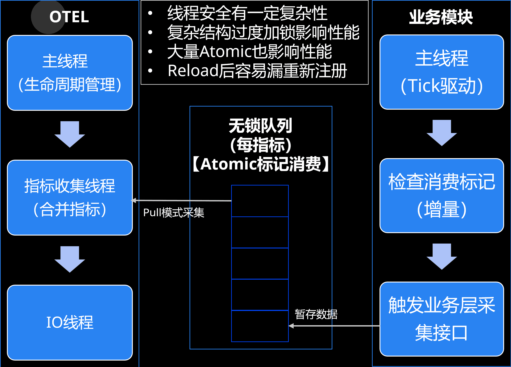

## 前言

我给我们的服务器框架深度集成了一些可观测性的能力。使用 [opentelemetry-cpp][1] 作为接入层。
在指标方面，我们允许业务层自由地定制化指标上报和拉取，并以此实现策略控制。上报的时候有Pull模式接口（异步接口），也有Push模式接口（同步接口）。
为了减少 [opentelemetry-cpp][1] 内部的视图合并开销，性能最佳，我们尽量使用异步接口。
但是这种情况下由于 [opentelemetry-cpp][1] 内部存在后台Processor线程、Exporter线程等，指标的采集往往需要跨线程操作。
这就要求我们上报代码逻辑需要保证线程安全。

而要求所有逻辑代码保证线程安全，一方面对于深层次有复杂关系的数据，代码复杂度比较高，很容易出错；另一方面如果过多无脑加锁也会一种开销和资源浪费。
所以我尝试抽象了一组接口来屏蔽这个细节，让业务层可以无脑接入。

## 性能和易用性问题

最早我们使用 [opentelemetry-cpp][1] 比较粗暴，直接调用同步接口。在上报量稍微大点的时候，因为频繁触发视图的属性比较和Merge计算，导致某些场景的CPU开销能占到 10%。
所以后来进行了一系列优化，第一步骤就是通过一些预统计，减少属性集比较和视图合并。然后采用异步接口上报。

大致的采集流程如下：

```{mermaid}
flowchart LR
 subgraph PullExporter["Pull模式驱动器"]
    direction LR
        PPull("Prometheus Pull Exporter
            (MetricReader)
            【fa:fa-globe 外部请求触发】")
        PEMR("PeriodicExportingMetricReader
            【fa:fa-clock 定时器触发】")
  end
 subgraph PrometheusExporter["Prometheus和其他"]
    direction LR
        PPush("fa:fa-file-export Prometheus Push Exporter")
        PFile("fa:fa-file-export Prometheus File Exporter")
        OtherPushExporter("fa:fa-file-export 其他Push模式Exporter...")
  end
 subgraph OTLPExporter["OTLP"]
    direction LR
        OTLPGRPC("fa:fa-file-export OTLP gRPC Exporter")
        OTLPHTTP("fa:fa-file-export OTLP HTTP Exporter")
        OTLPFile("fa:fa-file-export OTLP File Exporter")
  end
 subgraph PushExporter["Push模式输出"]
    direction TB
        PrometheusExporter
        OTLPExporter
  end
 subgraph Meters["多个指标"]
    direction LR
        Meter1("Meter 1")
        Meter2("Meter 2")
        Meter3("Meter 3")
        Meter4("Meter ...")
  end
 classDef callback stroke:#f00
 subgraph MeterCallbacks["指标回调(每个指标)"]
    direction TB
        Callback["Callback"]:::callback
        ObservableRegistry["ObservableRegistry"]       
  end
 subgraph SyncMeterAPI["同步指标接口(每个指标)"]
    direction LR
        Counter["fa:fa-paper-plane Counter"]
        Gauge["fa:fa-paper-plane Gauge"]
        Histogram["fa:fa-paper-plane Histogram"]
  end
 subgraph MetricStorageLayer["存储层(每个视图)"]
    direction TB
        SyncMetricStorage["fa:fa-layer-group 同步存储层"]
        AsyncMetricStorage["fa:fa-layer-group 异步存储层"]
  end
 subgraph MeterCollect["采集层"]
        MC("MetricCollector")
        MetricProducer("MetricProducer")
        Meters
        MeterCallbacks
        SyncMeterAPI
        MetricStorageLayer
  end
    PullExporter -- 驱动触发采集 --> MetricProducer
    MetricProducer --> MC
    MC --> Meters
    ObservableRegistry --> Callback
    Meters --> MeterCallbacks
    SyncMeterAPI --> MetricStorageLayer
    MeterCallbacks --> MetricStorageLayer
    MetricStorageLayer -- 通知指标提取 --> Meters
    Meters -- Collect获取结果后 --> PushExporter
    SyncMetricStorage@{ shape: lin-cyl}
    AsyncMetricStorage@{ shape: lin-cyl}
```

但是异步接口调用有一定复杂度，一个最简单的注册指标的流程如下:

```cpp
using otel_observer_result_int64 = opentelemetry::metrics::ObserverResultT<int64_t>;
using otel_observer_result_double = opentelemetry::metrics::ObserverResultT<double>;

auto meter = provider->GetMeter("meter name");
auto instrument = meter->CreateInt64ObservableGauge("instrument name", "instrument description", "instrument unit");

instrument->AddCallback([](opentelemetry::metrics::ObserverResult result, void* /*private_data*/) {
    if (opentelemetry::nostd::holds_alternative<opentelemetry::nostd::shared_ptr<otel_observer_result_int64>>(result)) {
        auto type_result = opentelemetry::nostd::get<opentelemetry::nostd::shared_ptr<otel_observer_result_int64>>(result);
        if (type_result) {
            type_result->Observe(static_cast<int64_t>(get_result_value()), {} /* attributes */);
        }
    } else if (opentelemetry::nostd::holds_alternative<opentelemetry::nostd::shared_ptr<otel_observer_result_double>>(result)) {
        auto type_result = opentelemetry::nostd::get<opentelemetry::nostd::shared_ptr<otel_observer_result_double>>(result);
        type_result->Observe(static_cast<double>(result_value), {} /* attributes */);
    }
} /*, void* private_data*/);
```

这个接口有几个需要注意的地方:

+ 上报一个指标，有meter和instrument的概念。目前v1版本是不支持删除callback、instrument和meter的。目前即便v2版本也删不干净。所以如果reload，最好是重新创建provider，那么这里这个meter、instrument和callback都要重新创建和注册。

> 由于最后一个Provider引用释放的时候，otel-cpp会自动调用一次Flush吧所有已经导出的数据强制刷出。这会导致线程Block，所以为了不影响业务主线程。这里还要处理一次Reload的时候另起线程来执行Flush。

+ 指标类型和调用Observe的传入类型要匹配，如果涉及浮点和整数转换的话，还要考虑 [epsilon][2] 。
+ 回调函数的签名是 `using ObservableCallbackPtr = void (*)(ObserverResult, void *);` 只能透传一个 `void*` ，如果要包装更复杂的数据透传需要自己封装。
+ 回调执行会跨线程，所以数据上报要保证线程安全。
+ 多源拉取时可能会反复触发回调，所以不能简单地根据回调时间差来计算增量部分，否则可能导致误差。

我们通过抽象了一层来一次性解决这些问题。每次业务层采集从缓存里读数据，并且底层直接处理掉类型转换。比如:

```cpp
for (auto& record : metrics_item->collected_records) {
    if (!record) {
    continue;
    }
    ++export_record_count;

    if (opentelemetry::nostd::holds_alternative<
            opentelemetry::nostd::shared_ptr<opentelemetry::metrics::ObserverResultT<int64_t>>>(result)) {
    auto real_observer = opentelemetry::nostd::get<
        opentelemetry::nostd::shared_ptr<opentelemetry::metrics::ObserverResultT<int64_t>>>(result);
    if (real_observer) {
        real_observer->Observe(get_opentelemetry_utility_metrics_record_value_as_int64(record->value),
                                opentelemetry_utility::get_attributes(record->attributes));
    }
    } else if (opentelemetry::nostd::holds_alternative<
                    opentelemetry::nostd::shared_ptr<opentelemetry::metrics::ObserverResultT<double>>>(result)) {
    auto real_observer = opentelemetry::nostd::get<
        opentelemetry::nostd::shared_ptr<opentelemetry::metrics::ObserverResultT<double>>>(result);
    if (real_observer) {
        real_observer->Observe(get_opentelemetry_utility_metrics_record_value_as_double(record->value),
                                opentelemetry_utility::get_attributes(record->attributes));
    }
    }
}
```

这里 `metrics_item->collected_records` 什么时候刷新呢？每次触发采集的时候，我们会检查采集版本号，当超出采集周期的时候会自增需要采集的版本号。

```cpp
if (now - metrics_item->collected_timepoint > metrics_item->collect_interval) {
  metrics_item->export_version.store(metrics_item->collect_version.load(std::memory_order_acquire),
                                     std::memory_order_release);
  callback_data_set.second.collecting_version.fetch_add(1, std::memory_order_release);
  metrics_item->collected_timepoint = now;
  std::lock_guard<std::recursive_mutex> collected_lock_guard{metrics_item->collected_lock};
  metrics_item->collected_records.clear();
} else if (now < metrics_item->collected_timepoint) {
  metrics_item->collected_timepoint = now;
}
```

然后外部Tick的时候，发现这个collecting_version大于导出数据版本的时候，才去触发用户层采集接口。
在多源抓取的时候，可能在一个采集周期内多次触发采集回调。这时候就能直接命中缓存，直接返回。

这里有个小细节是因为指标数量可能比较多，如果一帧里全量采集可能会导致卡顿。所以有必要在一次采集消耗过高时分针增量采集。
我们现在是以一个指标为单位，比如有2000个指标，采集200个就话费了比较长时间了，就让出时间片，下一个Tick从第201个开始。
这里也要限制每个Tick的采集量，尽可能公平调度，防止引起其他功能模块饥饿。

由于希望业务层不要关心线程安全的复杂性，所以我们的OTEL层采集在专门的采集线程上，但是业务层的采集总是在主线程执行。中间用无锁队列串起来，大致结构如下:



## 自动重注册

在Reload的时候，我们需要支持重新加载所有的配置资源、processor、exporter等组件。但是整个OTEL SDK里是没有移除接口的。整个处理组件和IO组件一旦搭配好就处于immutable状态。
那么为了实现Reload，最简单的方式就是从最上游开始，也就是从Provider层开始整个重建。这里涉及两个问题。

问题一：在创建完新Provider后，销毁前一个Provider时，会触发对正在导出的数据的Flush操作。这有可能是个延迟操作，会阻塞调用方。显然我们不能接受足额阻塞我们业务线程。
所以这里的解决方法就是创建一个专门的销毁线程。

```cpp
std::shared_ptr<global_service_data_type> current_service_cache = get_global_service_data();
if (!current_service_cache) {
    return;
}

// 我们的系统存在多分组，所以要处理一下默认分组和命名分组
std::shared_ptr<group_type> previous_group = group;
if (group->group_name.empty()) {
    current_service_cache->default_group.swap(previous_group);
} else {
    current_service_cache->named_groups[group->group_name].swap(previous_group);
}

// Shutdown in another thread to avoid blocking
do {
    if (!previous_group || previous_group == group) {
        break;
    }
    // 这里引用provider是为了续上provider的生命周期传给自线程内执行Flush，否则最后一个引用计数结束会立即执行Flush阻塞。
    if (previous_group->logs_handle.provider == group->logs_handle.provider) {
        previous_group->logs_handle.reset();
    }
    if (previous_group->metrics_handle.provider == group->metrics_handle.provider) {
        previous_group->metrics_handle.reset();
    }
    if (previous_group->tracer_handle.provider == group->tracer_handle.provider) {
        previous_group->tracer_handle.reset();
    }
    std::thread cleanup_thread([previous_group, current_service_cache]() {
        // 子线程执行Flush和销毁操作,这里面是执行一些线程安全相关的设置和Flush
        _opentelemetry_cleanup_group(previous_group, current_service_cache);
    });
    cleanup_thread.detach();
} while (false);

static void _opentelemetry_cleanup_group(std::shared_ptr<::mx::telemetry::group_type> group,
                                         const std::shared_ptr<global_service_data_type> &current_service_cache) {
  std::list<std::shared_ptr<std::thread>> shutdown_threads;

  if (current_service_cache && group && group->initialized) {
    atfw::util::lock::read_lock_holder<atfw::util::lock::spin_rw_lock> lock_guard{
        current_service_cache->on_group_destroy_callback_lock};
    for (auto &callback_fn : current_service_cache->on_group_destroy_callbacks) {
      if (callback_fn) {
        callback_fn(group);
      }
    }

    group->initialized = false;
  }

  if (group) {
    // Provider must be destroy before logger
    {
      atfw::util::lock::write_lock_holder<atfw::util::lock::spin_rw_lock> lock_guard{group->logger_lock};
      if (group->logs_handle.provider) {
        if (group->logs_handle.shutdown_callback) {
          auto handle = group->logs_handle;
          // 每个组件分别再在子线程内销毁，减少远端配置错误或者远端延迟导致累计延迟
          shutdown_threads.push_back(
              atfw::memory::stl::make_shared<std::thread>([handle]() { handle.shutdown_callback(handle.provider); }));
        }
        group->logs_handle.reset();
      }
      group->default_logger = opentelemetry::nostd::shared_ptr<opentelemetry::logs::Logger>();
    }

    // ...
}

// 这里是其中一个Shutdown回调的代码
ret.shutdown_callback =
    [processors_ptr](const opentelemetry::nostd::shared_ptr<opentelemetry::trace::TracerProvider> &provider) {
    if (!provider) {
        return;
    }

    auto trace_provider = opentelemetry::trace::Provider::GetTracerProvider();
    if (trace_provider == provider) {
        opentelemetry::trace::Provider::SetTracerProvider(
            opentelemetry::nostd::shared_ptr<opentelemetry::trace::TracerProvider>(
                new opentelemetry::trace::NoopTracerProvider()));
    }

    // 处理优雅退出时无限等待的问题
    if (processors_ptr && !processors_ptr->empty()) {
        std::chrono::microseconds timeout =
            std::chrono::duration_cast<std::chrono::microseconds>(std::chrono::seconds{10});
        auto app = atapp::app::get_last_instance();
        if (nullptr != app) {
        timeout = std::chrono::duration_cast<std::chrono::microseconds>(
            std::chrono::seconds{app->get_origin_configure().timer().stop_timeout().seconds() / 2});
        timeout += std::chrono::duration_cast<std::chrono::microseconds>(
            std::chrono::nanoseconds{app->get_origin_configure().timer().stop_timeout().nanos() / 2});
        }
        // 某些老版本Provider层调用Shutdown没有透传timeout到processor，会导致Flush时间过长。这里显示调用一次来解决
        for (auto &processor : *processors_ptr) {
            processor->Shutdown(timeout);
        }
        processors_ptr->clear();
    }

    static_cast<opentelemetry::sdk::trace::TracerProvider *>(provider.get())->Shutdown();
    };
```

问题二：在重新创建后所有的指标监听都需要重建。我们有不希望把这个重复注册的复杂性暴露给用户层，所以底层做了另外一层缓存。在重建Provider之后也自动重新注册。

因为我们之前采集层面已经做了数据层缓存分离了，所以我们这里在那个缓存层之上顺便把注册也缓存了就行了。

```cpp
SERVER_FRAME_API bool opentelemetry_utility::add_global_metics_observable_int64(
    metrics_observable_type type, opentelemetry::nostd::string_view meter_name, meter_instrument_key metrics_key,
    std::function<void(metrics_observer&)> fn) {
  if (!fn) {
    return false;
  }

  // opentelemetry only use metrics name as key of metric storage
  std::string key = atfw::util::log::format("{}:{}", gsl::string_view{meter_name.data(), meter_name.size()},
                                            gsl::string_view{metrics_key.name.data(), metrics_key.name.size()});

  std::pair<std::recursive_mutex&, opentelemetry_utility_global_metrics_set&> data_set = get_global_metrics_set();
  {
    std::lock_guard<std::recursive_mutex> lock_guard{data_set.first};
    auto iter = data_set.second.int64_observable_by_key.find(key);
    if (data_set.second.int64_observable_by_key.end() != iter && iter->second) {
      iter->second->callback = fn;
      return true;
    }
  }

  auto handle = atfw::memory::stl::make_shared<opentelemetry_utility::metrics_observer>();
  if (!handle) {
    return false;
  }
  handle->key = key;
  handle->type = type;
  handle->meter_name = static_cast<std::string>(meter_name);
  handle->meter_instrument_name = static_cast<std::string>(metrics_key.name);
  handle->meter_instrument_description = static_cast<std::string>(metrics_key.description);
  handle->meter_instrument_unit = static_cast<std::string>(metrics_key.unit);
  handle->collect_interval = protobuf_to_chrono_duration<>(
      logic_config::me()->get_logic().telemetry().opentelemetry().metrics().reader().export_interval());
  if (handle->collect_interval < std::chrono::seconds{2}) {
    handle->collect_interval = std::chrono::seconds{15};
  } else {
    handle->collect_interval -= std::chrono::seconds{1};
  }
  handle->callback = std::move(fn);
  handle->origin_callback = nullptr;
  if (false == data_set.second.initialized.load(std::memory_order_acquire) ||
      internal_add_global_metrics_observable_int64(*handle)) {
    std::lock_guard<std::recursive_mutex> lock_guard{data_set.first};
    data_set.second.int64_observable_by_key[key] = handle;
    data_set.second.int64_observable_by_pointer[reinterpret_cast<void*>(handle.get())] = handle;
    ++data_set.second.collecting_version;
    return true;
  } else {
    return false;
  }
}
```

这里面 `internal_add_global_metrics_observable_int64` 是实际执行注册observable。Reload的时候重新调用一次就行了。

## 上报数据转换

虽然我们的通信接口都是OTEL规范，但是有时候会上传到其他平台。比如目前指标领域的事实标准-[Prometheus][3]。

[Prometheus][3] 其实数据结构是比较简单的，比如指标名只允许 `[a-zA-Z_:][a-zA-Z0-9_:]*` 这个规范。只有一层标签的概念，标签名必须满足 `[a-zA-Z_][a-zA-Z0-9_]*` ，并且只有一层。

> 参考: <https://prometheus.io/docs/concepts/data_model/>

OTEL就复杂多了，指标的结构如下:

```proto
// MetricsData
// └─── ResourceMetrics
//   ├── Resource
//   ├── SchemaURL
//   └── ScopeMetrics
//      ├── Scope
//      ├── SchemaURL
//      └── Metric
//         ├── Name
//         ├── Description
//         ├── Unit
//         └── data
//            ├── Gauge
//            ├── Sum
//            ├── Histogram
//            ├── ExponentialHistogram
//            └── Summary
```

里面的属性结构更加复杂:

```proto
//    Metric
//  +------------+
//  |name        |
//  |description |
//  |unit        |     +------------------------------------+
//  |data        |---> |Gauge, Sum, Histogram, Summary, ... |
//  +------------+     +------------------------------------+
//
//    Data [One of Gauge, Sum, Histogram, Summary, ...]
//  +-----------+
//  |...        |  // Metadata about the Data.
//  |points     |--+
//  +-----------+  |
//                 |      +---------------------------+
//                 |      |DataPoint 1                |
//                 v      |+------+------+   +------+ |
//              +-----+   ||label |label |...|label | |
//              |  1  |-->||value1|value2|...|valueN| |
//              +-----+   |+------+------+   +------+ |
//              |  .  |   |+-----+                    |
//              |  .  |   ||value|                    |
//              |  .  |   |+-----+                    |
//              |  .  |   +---------------------------+
//              |  .  |                   .
//              |  .  |                   .
//              |  .  |                   .
//              |  .  |   +---------------------------+
//              |  .  |   |DataPoint M                |
//              +-----+   |+------+------+   +------+ |
//              |  M  |-->||label |label |...|label | |
//              +-----+   ||value1|value2|...|valueN| |
//                        |+------+------+   +------+ |
//                        |+-----+                    |
//                        ||value|                    |
//                        |+-----+                    |
//                        +---------------------------+
```

那为什么要这么复杂呢？
我们举例一个场景，比如我们自己接入了指标上报，我们依赖的gRPC或者其他第三方组件也接入了可观测性。
那么怎么保证我们的上报点不冲突？这可以通过不同的Scope来区分。
然后同样在一个进程里，上报的数据会包含比如host信息，进程名字、业务类型等等和进程相关的信息。但是我们有2000个指标，那么用原始的 [Prometheus][3] 我们不得不把这些信息重复上报 2000 份。
而在OTEL里，只要在Resource去上报一次就行了。同理还有指标级共享和每个Point不同的数据区，也是能减少不必要的重复上报。

> 实际上对于进程级资源共享，[Prometheus][3] 和 [OpenCensus][4] 都有一个方案。定义了一个 [target_info][5] 类型的特殊指标来承载这些信息。
> 同一个连接，[target_info][5] 只要上报一次即可。后面上报的指标自动关联这些属性。但是这个并不是所有平台都兼容，将具体是否可用还要咨询使用的平台。
> 有兴趣可以阅读 <https://opentelemetry.io/docs/specs/otel/compatibility/prometheus_and_openmetrics/#resource-attributes-1>

这里涉及数据标签的问题。另外，规范里还定义了一些特殊的单位转换，比如:

```cpp
// Time
{"d", "days"},
{"h", "hours"},
{"min", "minutes"},
{"s", "seconds"},
{"ms", "milliseconds"},
{"us", "microseconds"},
{"ns", "nanoseconds"},
// Bytes
{"By", "bytes"},
{"KiBy", "kibibytes"},
{"MiBy", "mebibytes"},
{"GiBy", "gibibytes"},
{"TiBy", "tibibytes"},
{"KBy", "kilobytes"},
{"MBy", "megabytes"},
{"GBy", "gigabytes"},
{"TBy", "terabytes"},
{"By", "bytes"},
{"KBy", "kilobytes"},
{"MBy", "megabytes"},
{"GBy", "gigabytes"},
{"TBy", "terabytes"},
// SI
{"m", "meters"},
{"V", "volts"},
{"A", "amperes"},
{"J", "joules"},
{"W", "watts"},
{"g", "grams"},
// Misc
{"Cel", "celsius"},
{"Hz", "hertz"},
{"1", ""},
{"%", "percent"}
```

比如我们定义的一个OTEL的指标为 `{name="abc", description="XXX", unit="%"}` ，最后输出的 [Prometheus][3] 指标名是 `abc_percent` 。
这些规则还在演进变化中，另外早期的OTEL-CPP SDK有个BUG，没有设置单位的属性多余输出了下划线。
比如 `{name="abc", description="XXX", unit=""}` 对应的 [Prometheus][3] 指标名应该是 `abc`, 但是早期版本会使用 `abc_` 。

那为了抹平拉取聚合这一侧用户使用的复杂性，我们抽象了 `SanitizePrometheusName` 接口，保持和OTEL-CPP里一样的转换规则。
而提取指标名则是搞了个“奇技淫巧”,先创建一个虚假的指标。执行一次OTEL里的指标转换，在提取生成的指标名。代码如下:

```cpp
  opentelemetry::sdk::metrics::ResourceMetrics fake_resource_metrics;
  opentelemetry::sdk::metrics::MetricData fake_metrics_data;
  opentelemetry::sdk::metrics::PointDataAttributes fake_point_data;
  auto fake_scope = opentelemetry::sdk::instrumentationscope::InstrumentationScope::Create("none");
  fake_metrics_data.aggregation_temporality = opentelemetry::sdk::metrics::AggregationTemporality::kCumulative;
  fake_metrics_data.instrument_descriptor.name_ = metrics_name_;
  fake_metrics_data.instrument_descriptor.description_ = metrics_description_;
  fake_metrics_data.instrument_descriptor.unit_ = metrics_unit_;
  fake_metrics_data.instrument_descriptor.value_type_ = opentelemetry::sdk::metrics::InstrumentValueType::kLong;

  // @see OtlpMetricUtils::GetAggregationType in otel-cpp
  switch (metrics_type_) {
    case PROJECT_NAMESPACE_ID::config::EN_HPA_POLICY_METRICS_TYPE_COUNTER: {
      fake_metrics_data.instrument_descriptor.type_ = opentelemetry::sdk::metrics::InstrumentType::kObservableCounter;
      fake_point_data.point_data = opentelemetry::sdk::metrics::SumPointData{};
      break;
    }
    default: {
      fake_metrics_data.instrument_descriptor.type_ = opentelemetry::sdk::metrics::InstrumentType::kObservableGauge;
      fake_point_data.point_data = opentelemetry::sdk::metrics::LastValuePointData{};
      break;
    }
  }
  fake_metrics_data.point_data_attr_.push_back(fake_point_data);
#if OPENTELEMETRY_VERSION_MAJOR * 1000 + OPENTELEMETRY_VERSION_MINOR >= 1012
  fake_resource_metrics.scope_metric_data_.push_back(
      {fake_scope.get(), std::vector<opentelemetry::sdk::metrics::MetricData>{fake_metrics_data}});
#else
  fake_resource_metrics.scope_metric_data_.push_back({fake_scope.get(), {fake_metrics_data}});
#endif
#if OPENTELEMETRY_VERSION_MAJOR * 1000 + OPENTELEMETRY_VERSION_MINOR < 1012
  auto prometheus_family =
      opentelemetry::exporter::metrics::PrometheusExporterUtils::TranslateToPrometheus(fake_resource_metrics);
#else
  auto prometheus_family =
      opentelemetry::exporter::metrics::PrometheusExporterUtils::TranslateToPrometheus(fake_resource_metrics, false);
#endif
```

最终我们提供给用户层的配置大概是这样。

```yaml
- metrics_name: "ds_fps_gauge"
  metrics_unit: us
  metrics_description: "DS Runtime Fps Metrics"
  metrics_type: gauge
  aggregation: count
  aggregation_parameter:
  by:
    labels:
    - region_group
    - StandAlone
  simple_function:
  - last_over_time: 1m
  selectors:
  "PlayerInit": "true"
  "service_name": "DsMonitor"
  without_auto_selectors:
  - service_name
  - hpa_target_name
- metrics_name: "product_sales_order"
  metrics_unit: count
  metrics_description: "OrderSvr Product Sales Order Count"
  metrics_type: gauge
  aggregation: sum
  aggregation_parameter:
  by:
    labels:
    - area_code
    - market_id
    - product_id
  simple_function:
  - last_over_time: 1m
  without_auto_selectors:
  - service_name
  - hpa_target_name
```

受[Grafana][6]的启发，我们也提供了一些基础的函数包装和聚合转换，并且自动注入一些聚合标签来做多环境隔离，避免用户直接配置PromQL，防止出错的可能性。

## 基础的部分采样方案

最后，我们提供给使用者一方的的指标接口就相当简单，比如交易行服务的IO毛刺监控:

```cpp
// 一秒内IO数
rpc::telemetry::opentelemetry_utility::add_global_metics_observable_int64(
    rpc::telemetry::metrics_observable_type::kGauge, "trade_order", {"trade_order_second_max_io_count", "", ""},
    [](rpc::telemetry::opentelemetry_utility::metrics_observer& result) {
    if (global_order_manager::is_instance_destroyed()) {
        return;
    }
    metrics_global_data& metrics_data = global_order_manager::me()->metrics_data_;
    int64_t value = metrics_data.second_max_io_count.load(std::memory_order_acquire);
    metrics_data.second_max_io_count.store(metrics_data.second_current_max_io_count, std::memory_order_release);
    rpc::telemetry::opentelemetry_utility::global_metics_observe_record(result, value);
    });
```

<div style="backgroud-color: black;">

</div>

再展示个更复杂的动态多层级指标:

```cpp
// 更新视图索引索引CPU消耗
rpc::telemetry::opentelemetry_utility::add_global_metics_observable_int64(
    rpc::telemetry::metrics_observable_type::kGauge, "trade_order", {"trade_order_slot_distribution", "", ""},
    [](rpc::telemetry::opentelemetry_utility::metrics_observer& result) {
    if (global_order_manager::is_instance_destroyed()) {
        return;
    }

    std::shared_ptr<::rpc::telemetry::group_type> lifetime;

    for (auto& area_data : global_order_manager::me()->metrics_data_.area_metric_data) {
        if (!area_data.second) {
        continue;
        }
        for (auto& order_type_data : area_data.second->order_type_metric) {
        if (!order_type_data.second) {
            continue;
        }

        for (auto& slot_dist : order_type_data.second->slot_distribution) {
            rpc::telemetry::trace_attribute_pair_type internal_attributes[] = {
                {"trade_area_code", area_data.first},
                {"trade_order_type", order_type_data.first},
                {"trade_order_slot_id", slot_dist}};

            rpc::telemetry::opentelemetry_utility::global_metics_observe_record_extend_attrubutes(
                result, 1, lifetime, internal_attributes);
        }
        }
    }
});
```


## 最后

可观测性领域还有很多其他的优化和探索，后面有空慢慢分享吧。
也欢迎有兴趣的小伙伴们互相交流探讨。

[1]: https://github.com/open-telemetry/opentelemetry-cpp
[2]: https://en.cppreference.com/w/cpp/types/numeric_limits/epsilon
[3]: https://prometheus.io/
[4]: https://opencensus.io/
[5]: https://github.com/prometheus/OpenMetrics/blob/v1.0.0/specification/OpenMetrics.md#supporting-target-metadata-in-both-push-based-and-pull-based-systems
[6]: https://grafana.com/
