## 前言

近年来可观测性领域越来越成熟，游戏服务的可观测性能力建设日益成为提升产品质量与运维效率的关键环节。随着游戏系统架构的不断复杂化，传统的监控和故障排查方式已难以满足业务高可用和用户体验优化的需求。通过健全的可观测性体系，可以实现对游戏服务全链路的实时监控、异常检测与分析，助力技术团队及时发现和定位问题，推动产品持续优化与稳定迭代，从而为玩家提供更加流畅和可靠的游戏体验。

作为 [OpenTelemetry][1] 社区 [C++ SDK][2] 的核心贡献者，我一直致力于将可观测性能力引入并深度集成和应用到游戏服务框架和业务开发过程中。本文的主要内容是分享在这个过程中积累的工程实践和典型案例，并探讨遇到的主要问题及解决思路。

> [OpenTelemetry][1] 隶属于CNCF（云原生计算基金会），2019年成立，2021年开始孵化。

## 应用场景

首先介绍一点典型的应用场景。

### 链路追踪

首先最基础的能力之一是链路追踪。最早我们也使用过gtrace做链路追踪。但是现在gtrace已经停止维护并全面转向 [OpenTelemetry][1] 了。

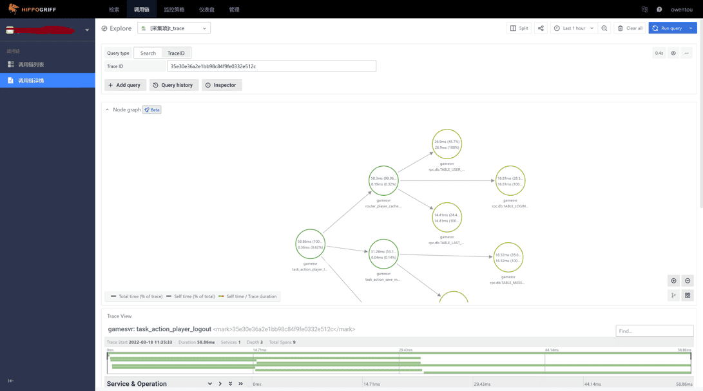

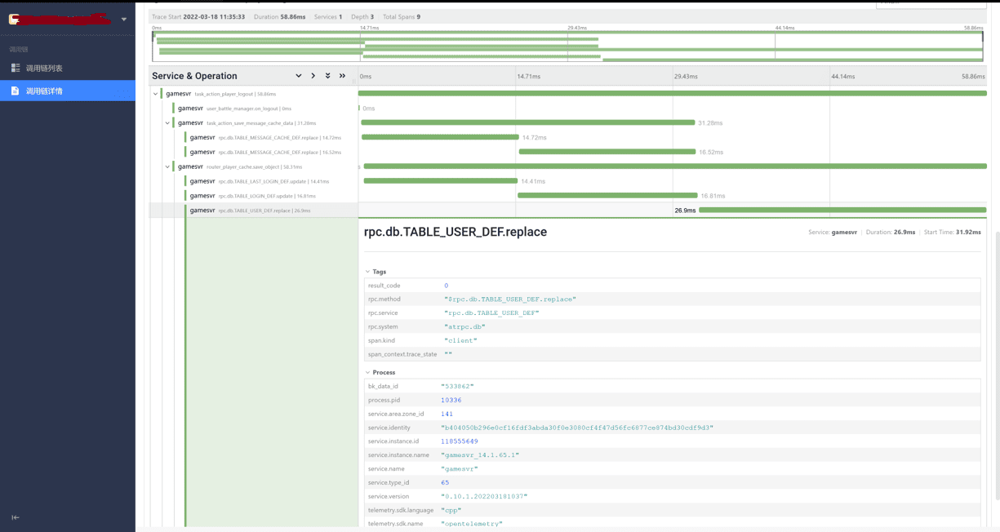

可以看到，我们可以对单个链路单独分析每一层调用关系的负载、延迟等。不止如此，有一些平台还会有一些特色功能，比如帮我们分析 99%，95%、服务间关系，健康度等。

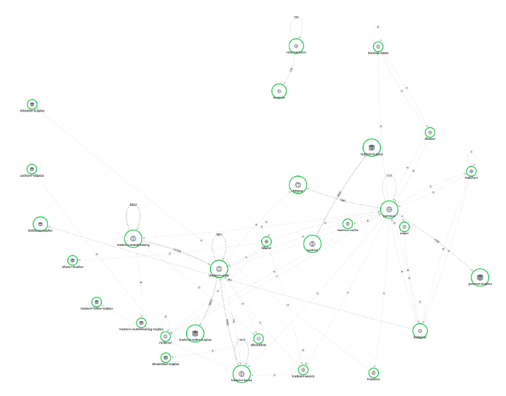

### 指标

在指标方面，最常见的应用是对CPU、内存等资源监控。

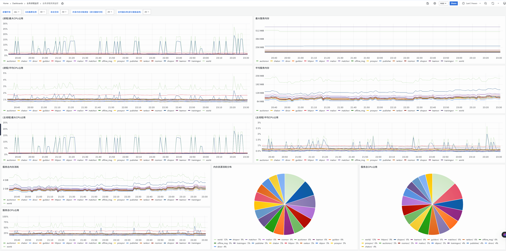

和传统方案对比，这里的优势是我们可以给上报指标大打多标签。然后在面板上随时切换。
通常情况下，我们有时候某个研发环境出故障，只有特定环境、特定类型的服务故障。这时候就可以通过多维度切换，快速找到问题所在的服务。

另外也可以很方便地统计各类资源占用大盘，来给我们各类服务的资源配比提供指导。

除了基础的系统进程层面的信息外，也能助力我们框架层的监控。比如RPC、错误分析、数据库资源占用等等。

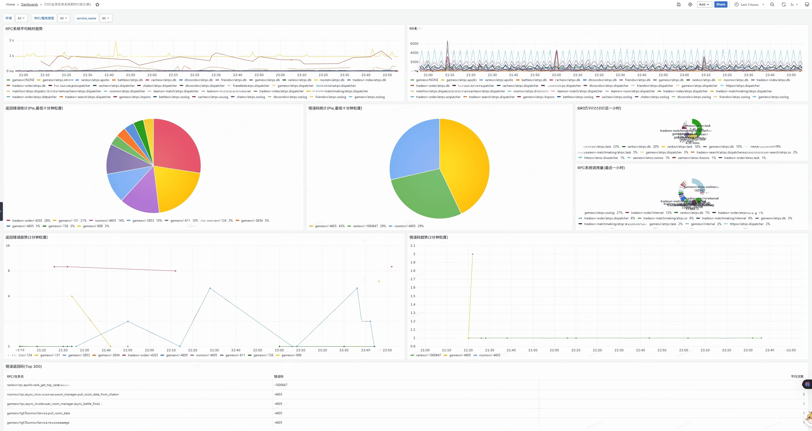

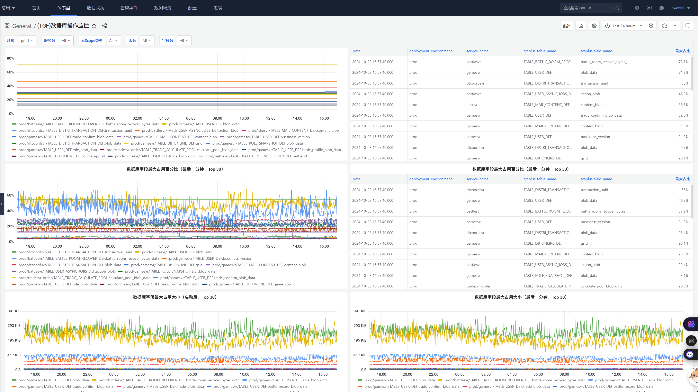

我们系统里数据库字段有最大长度，存入数据库的是pb打包后的二进制。长度是动态的，上面的图里有分析数据库字段占用情况。在快要耗尽时告警扩容。
我们曾经发现过一个IO问题，交易行服务在停服时需要保存大量的订单数据，会导致集中保存。大量的IO导致触发了公共集群数据库的限频。
然后后台失败重试，最终导致雪崩。

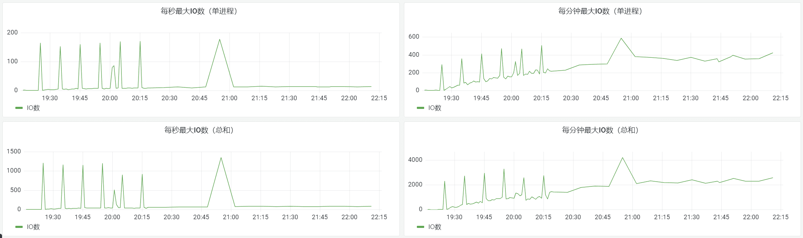

我们通过一个动态消峰的机制解决了这个问题，并且之后加入了IO监控来监视这类情况的风险。

在业务层面，我们也有很多的应用。比如交易行模块有一个视图索引设计，用于多维护多标签的搜索和推荐。但是要平衡搜索和推荐的视图数量和LRU参数是否合理，于是有了视图和基础索引的开销分析。

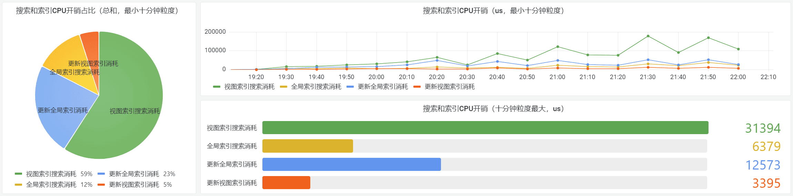

我们同样为策划提供交易行订单分析能力，用于监控实时市场价格和订单分布变化，以便做宏观调控。

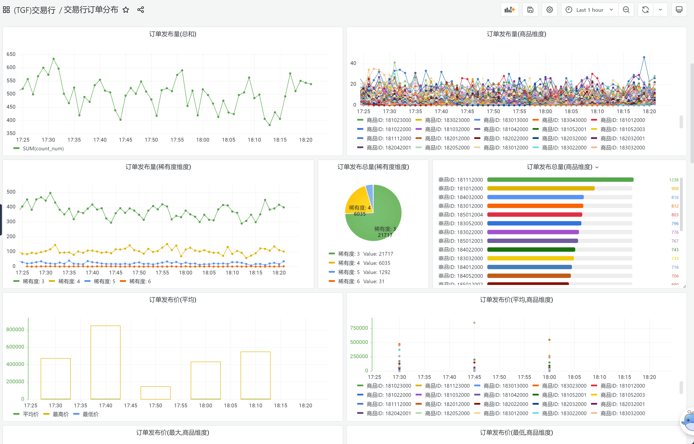

并且在Steam新品节期间，比安全组件更快发现工作室倒金行为。

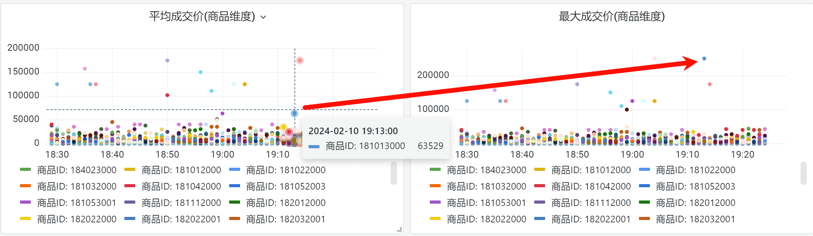

通过结合指标拉取聚合能力，我们实现了允许业务开发在业务层实现动态策略能力，比如根据交易行不同商品的订单数动态调整一口价的撮合节点数，并且评估撮合策略的合理性。

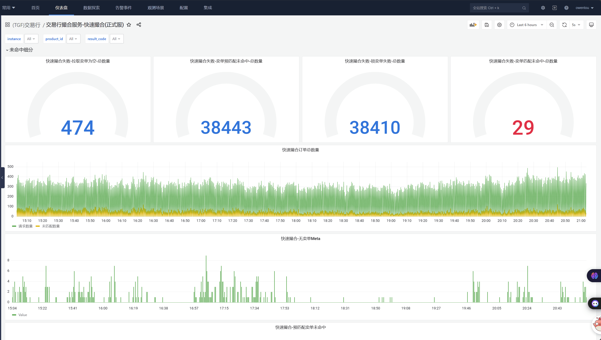

还有按地图和玩法分类，根据玩家数决定排队长度等等。

### 日志

日志方面，[OpenTelemetry][1] 的主要目标是统一接口和模型。我们典型的使用案例是利用事件日志告警（当然也有根据指标告警）。

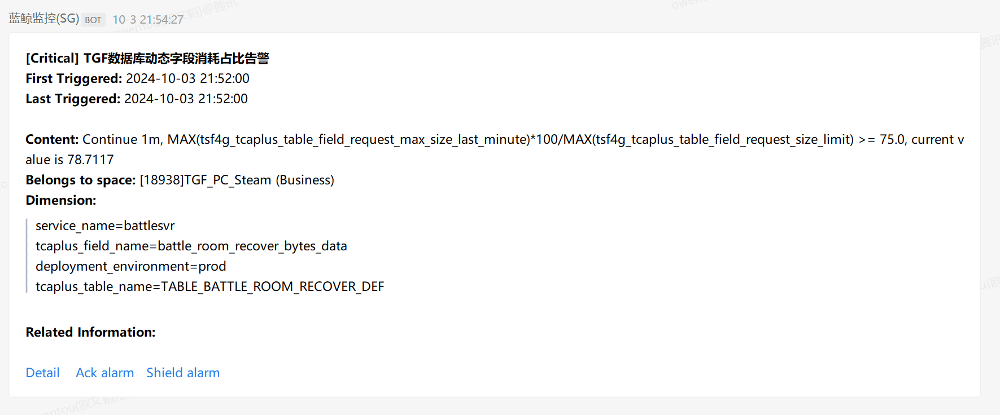

另外日志还可以和链路跟踪自动关联，这样我们调试问题的时候可以直接一键拉到问题链路相关的日志，就不用人工查找分析了。

## 基本概念和框架

案例举例就到这里，接下来我们先来看一下可观测性 （[OpenTelemetry][1]） 的基本概念和框架结构。

### 基础组件

早期 [OpenTelemetry][1] 的基础结构如下所示。

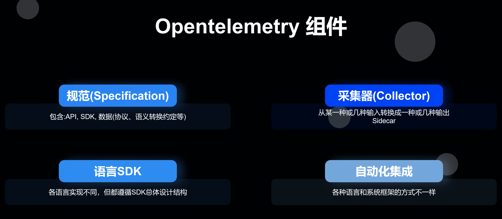

其核心资源分为三个部分： **链路跟踪** 、 **指标** 和 **日志** 。

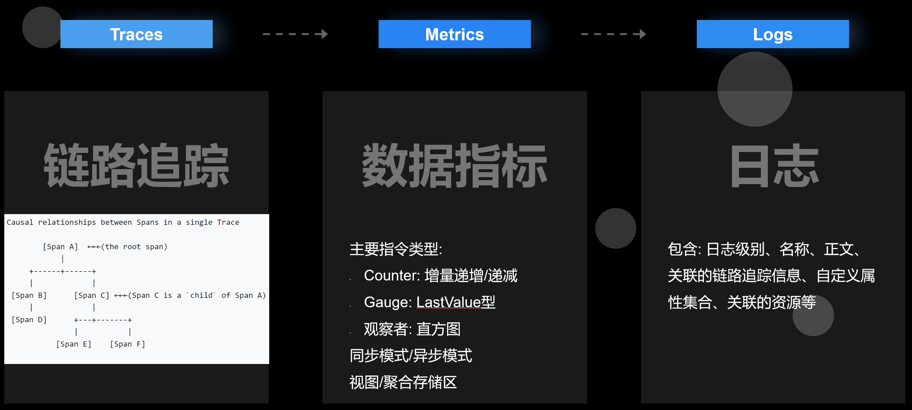

### 快速上手

如果只是作为使用者，产生和上报数据。最简单的接入使用非常简单。

```cpp
// ======================== 链路跟踪 ========================
auto provider = trace::Provider::GetTracerProvider();
auto tracer = provider->GetTracer("foo_library");
void f1() {
  auto scoped_span = trace::Scope(get_tracer()->StartSpan("f1"));
}
void f2() {
  auto scoped_span = trace::Scope(get_tracer()->StartSpan("f2"));
  f1();
  f1();
}
// f2 -> f1+f1

// ======================== 指标 ========================
auto provider = metrics_api::Provider::GetMeterProvider();
auto meter = provider->GetMeter(name, "1.2.0");
// 同步指令
auto double_counter = meter->CreateDoubleCounter("sync_counter");
for (uint32_t i = 0; i < 20; ++i) {
  double val = (rand() % 700) + 1.1;
  double_counter->Add(val);
  std::this_thread::sleep_for(std::chrono::milliseconds(500));
}
// 异步(回调)指令
auto observable_counter = meter->CreateDoubleObservableCounter("async_counter");
observable_counter->AddCallback([](opentelemetry::metrics::ObserverResult observer_result, void * /* state */) {
    if (opentelemetry::nostd::holds_alternative<opentelemetry::nostd::shared_ptr<
            opentelemetry::metrics::ObserverResultT<double>>>(observer_result)) {
      opentelemetry::nostd::get<
          opentelemetry::nostd::shared_ptr<opentelemetry::metrics::ObserverResultT<double>>>(observer_result)->Observe((rand() % 700) + 1.1);
    }
}, nullptr);

// ======================== 日志 ========================
auto provider = logs::Provider::GetLoggerProvider();
auto logger = provider->GetLogger("foo_library_logger", "foo_library");
logger->Debug("body", ctx.trace_id(), ctx.span_id(), ctx.trace_flags());
```

### SDK设计结构

[OpenTelemetry][1] 整体的设计汲取了之前的链路跟踪（比如gtrace）和指标（比如 [prometheus][4]，[opencensus][5]）的诸多应用场景和经验。
所以整个设计结构和概念其实是比较复杂的。

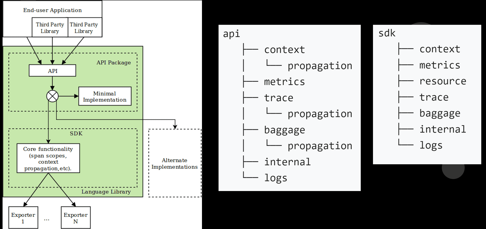

API层要求最小消耗的空实现，SDK层是正式的功能实现。他们通过符号引用可以热插拔得嵌入到上报者和框架集成方。然后Exporter是复制数据IO的。
这些结构落地到C++ SDK实现大概是这个样子。

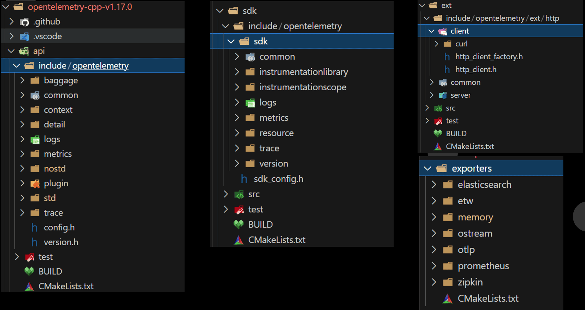

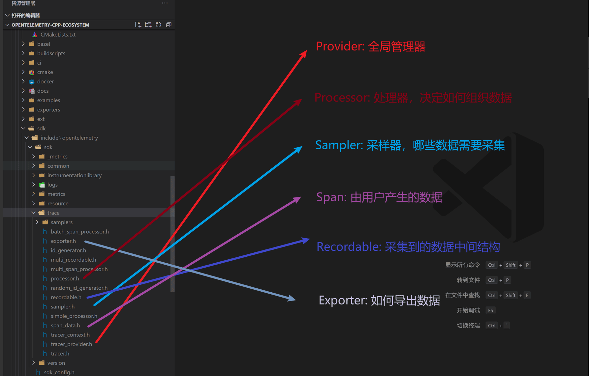

Provider是一个全局的资源管理器，所有的组件创建数据都从Provider开始。数据产生后交由Processor处理。
比如一个标准的Processor叫BatchProcessor，顾名思义它会把产生的数据自动按负载合并并Batch化发送。
Recordable对应何磊组件里生成的数据接口，Exporter则是负责怎么输出数据。

### 语义转换

基础的结构只有属性的概念，但是我们在很多场景里表要标识哪个属性表达什么含义。比如说前面案例里有平台根据链路跟踪获取服务间的调用关系。
那平台怎么知道我们的RPC类型、名字和服务的名字呢？这里就要提到 **语义转换约定**。

[OpenTelemetry][1] 有一个章节描述了什么字段应该符合什么样的标准，报什么内容。这样我们使用方案这个标准报，各个平台就可以根据自己的特色提供一些平台特色的能力。使用方不用写任何特殊代码就能享用社区的成果。

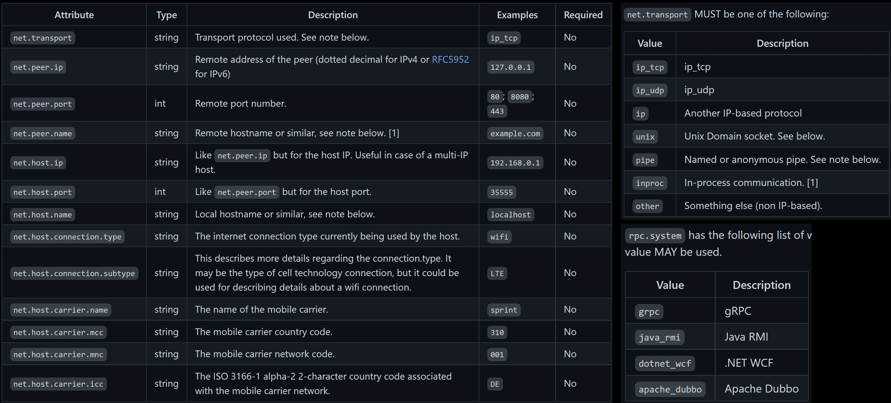

> 详见: <https://opentelemetry.io/docs/specs/otel/semantic-conventions/>

各个厂商的特性化也可以通过这里提供。

### OTLP标准协议

为了标准化数据传输的过程， [OpenTelemetry][1] 包含了一个标准协议。基于Protobuf生态。

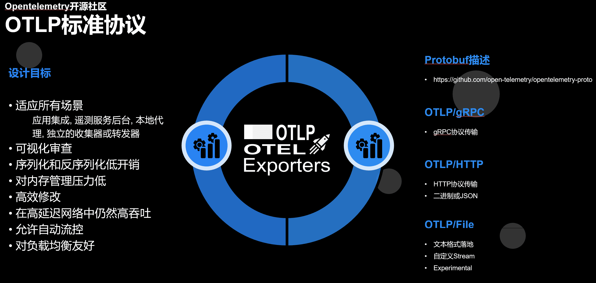

首先外层结构，**链路跟踪** 、 **指标** 和 **日志** 的结构类似。(这里以指标为例)

```proto
// MetricsData
// └─── ResourceMetrics
//   ├── Resource
//   ├── SchemaURL
//   └── ScopeMetrics
//      ├── Scope
//      ├── SchemaURL
//      └── Metric
//         ├── Name
//         ├── Description
//         ├── Unit
//         └── data
//            ├── Gauge
//            ├── Sum
//            ├── Histogram
//            ├── ExponentialHistogram
//            └── Summary
```

大致分为，Service/Data->Resouce->Scope->Span/Metric/Log这几层。为什么要这么多层呢？

我们举例一个场景，比如我们自己接入了指标上报，我们依赖的gRPC或者其他第三方组件也接入了可观测性。
那么怎么保证我们的上报点不冲突？这可以通过不同的Scope来区分。
然后同样在一个进程里，上报的数据会包含比如host信息，进程名字、业务类型等等和进程相关的信息。但是我们有2000个指标，显然我们不需要把这些信息重复上报 2000 份。
而在OTLP里，只要在Resource去上报一次就行了。接下来就是各自的数据区。

对于指标而言，还有一些更细致的分类和结构,当然也是和指标本身的概念相关。

```proto
//    Metric
//  +------------+
//  |name        |
//  |description |
//  |unit        |     +------------------------------------+
//  |data        |---> |Gauge, Sum, Histogram, Summary, ... |
//  +------------+     +------------------------------------+
//
//    Data [One of Gauge, Sum, Histogram, Summary, ...]
//  +-----------+
//  |...        |  // Metadata about the Data.
//  |points     |--+
//  +-----------+  |
//                 |      +---------------------------+
//                 |      |DataPoint 1                |
//                 v      |+------+------+   +------+ |
//              +-----+   ||label |label |...|label | |
//              |  1  |-->||value1|value2|...|valueN| |
//              +-----+   |+------+------+   +------+ |
//              |  .  |   |+-----+                    |
//              |  .  |   ||value|                    |
//              |  .  |   |+-----+                    |
//              |  .  |   +---------------------------+
//              |  .  |                   .
//              |  .  |                   .
//              |  .  |                   .
//              |  .  |   +---------------------------+
//              |  .  |   |DataPoint M                |
//              +-----+   |+------+------+   +------+ |
//              |  M  |-->||label |label |...|label | |
//              +-----+   ||value1|value2|...|valueN| |
//                        |+------+------+   +------+ |
//                        |+-----+                    |
//                        ||value|                    |
//                        |+-----+                    |
//                        +---------------------------+
```

#### 标准协议和实际落地的取舍

原始的OTLP协议属性是可以完全动态且嵌套的。
但是在我们的C++的实现中，为了降低不必要的开销的生命周期管理，大多数属性引用都是用视图传递。
这就失去生命周期的管理，就没法实现完整的OTLP协议。这里C++ SDK在性能和完整性上做了一些平衡和取舍，只实现了子集。

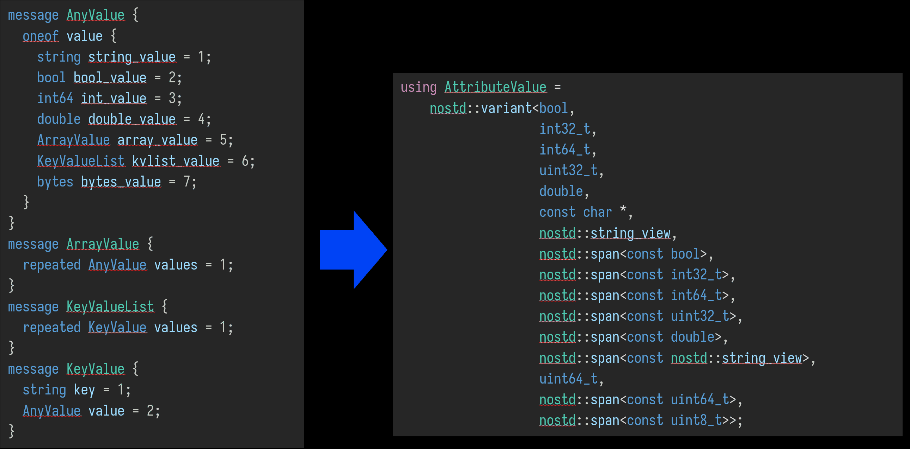

### 指标的复杂性结构

相对于 **链路跟踪** 和 **日志** 来说，**指标** 要更复杂一些。
多了一些概念，比如Push模式、Pull模式。增量值、累计值，计数器、Gauge、直方图等等。

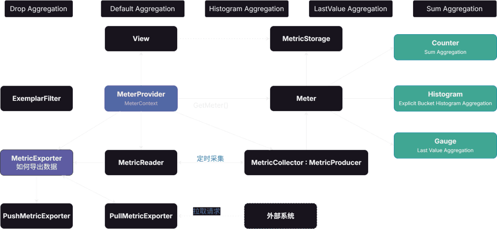

这里比 [prometheus][4] 复杂得多。这是因为考虑和非常多的引用场景。
比如完全抽象了数据产生和数据上报，产生数据不用关系Exporter是采用Push模式还是Pull模式。
再比如对一份上报的数据，可能命中多个属性集合视图。那么SDK会自动拆分到多个Storage里，不需要调用者关心。

还有直方图数据类型可能和我们直观的感知有差异，我们很多小伙伴在使用过程中都会发生误解和困惑。

> 关于直方图建议阅读 <https://prometheus.io/docs/practices/histograms/> 。

这些最终造成 **指标** 比其他的组件要更复杂。

### 生态适配

#### 存量生态

前面也提到 [OpenTelemetry][1] 是结合了之前各类组件的经验，目标是成为可观测性领域大一统标准。比如 **链路跟踪** 替代了gtrace，指标大量参考了 [prometheus][4]，[opencensus][5] 等。

那对于一些旧有项目，怎么提供一些简单的迁移方式呢？目前有两种方式。一是通过shim库转换数据，二是通过Exporter层做数据格式转换。

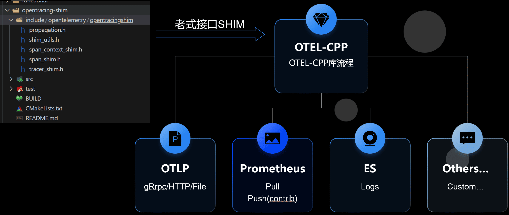

#### Prometheus和OTEL Metrics的异同和适配

虽然我们的通信接口都是 [OpenTelemetry][1] 规范，但是有时候会上传到其他平台。比如目前指标领域的事实标准-[Prometheus][4]。

[Prometheus][4] 其实数据结构是比较简单的，比如指标名只允许 `[a-zA-Z_:][a-zA-Z0-9_:]*` 这个规范。只有一层标签的概念，标签名必须满足 `[a-zA-Z_][a-zA-Z0-9_]*` ，并且只有一层。

> 参考: <https://prometheus.io/docs/concepts/data_model/>

前面提到的一个进程内有2000个指标，上报共享的进程信息的时候，如果用原始的 [Prometheus][4] 我们不得不把这些信息重复上报 2000 份。

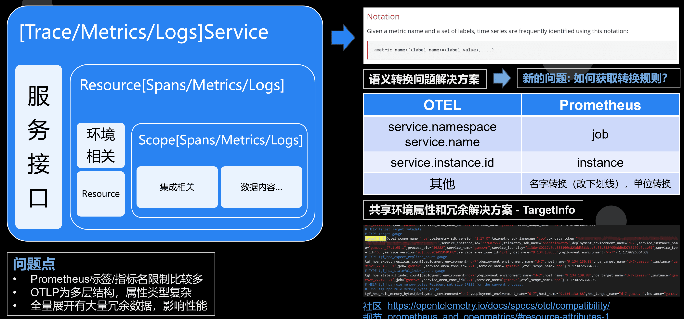

> 实际上对于进程级资源共享，[Prometheus][4] 和 [OpenCensus][5] 都有一个方案。定义了一个 [target_info][6] 类型的特殊指标来承载这些信息。
> 同一个连接，[target_info][6] 只要上报一次即可。后面上报的指标自动关联这些属性。但是这个并不是所有平台都兼容，将具体是否可用还要咨询使用的平台。
> 有兴趣可以阅读 <https://opentelemetry.io/docs/specs/otel/compatibility/prometheus_and_openmetrics/#resource-attributes-1>

除此之外，[OpenTelemetry][1] 的指标有unit的概念。在转换成 [Prometheus][4]也需要做一些单位标准化。

```cpp
// Time
{"d", "days"},
{"h", "hours"},
{"min", "minutes"},
{"s", "seconds"},
{"ms", "milliseconds"},
{"us", "microseconds"},
{"ns", "nanoseconds"},
// Bytes
{"By", "bytes"},
{"KiBy", "kibibytes"},
{"MiBy", "mebibytes"},
{"GiBy", "gibibytes"},
{"TiBy", "tibibytes"},
{"KBy", "kilobytes"},
{"MBy", "megabytes"},
{"GBy", "gigabytes"},
{"TBy", "terabytes"},
{"By", "bytes"},
{"KBy", "kilobytes"},
{"MBy", "megabytes"},
{"GBy", "gigabytes"},
{"TBy", "terabytes"},
// SI
{"m", "meters"},
{"V", "volts"},
{"A", "amperes"},
{"J", "joules"},
{"W", "watts"},
{"g", "grams"},
// Misc
{"Cel", "celsius"},
{"Hz", "hertz"},
{"1", ""},
{"%", "percent"}
```

比如我们定义的一个OTEL的指标为 `{name="abc", description="XXX", unit="%"}` ，最后输出的 [Prometheus][4] 指标名是 `abc_percent` 。
这些规则还在演进变化中，另外早期的OTEL-CPP SDK有个BUG，没有设置单位的属性多余输出了下划线。
比如 `{name="abc", description="XXX", unit=""}` 对应的 [Prometheus][4] 指标名应该是 `abc`, 但是早期版本会使用 `abc_` 。

那为了抹平拉取聚合这一侧用户使用的复杂性，我们抽象了 `SanitizePrometheusName` 接口，保持和OTEL-CPP里一样的转换规则。
而提取指标名则是搞了个“奇技淫巧”,先创建一个虚假的指标。执行一次OTEL里的指标转换，在提取生成的指标名。代码如下:

```cpp
  opentelemetry::sdk::metrics::ResourceMetrics fake_resource_metrics;
  opentelemetry::sdk::metrics::MetricData fake_metrics_data;
  opentelemetry::sdk::metrics::PointDataAttributes fake_point_data;
  auto fake_scope = opentelemetry::sdk::instrumentationscope::InstrumentationScope::Create("none");
  fake_metrics_data.aggregation_temporality = opentelemetry::sdk::metrics::AggregationTemporality::kCumulative;
  fake_metrics_data.instrument_descriptor.name_ = metrics_name_;
  fake_metrics_data.instrument_descriptor.description_ = metrics_description_;
  fake_metrics_data.instrument_descriptor.unit_ = metrics_unit_;
  fake_metrics_data.instrument_descriptor.value_type_ = opentelemetry::sdk::metrics::InstrumentValueType::kLong;

  // @see OtlpMetricUtils::GetAggregationType in otel-cpp
  switch (metrics_type_) {
    case PROJECT_NAMESPACE_ID::config::EN_HPA_POLICY_METRICS_TYPE_COUNTER: {
      fake_metrics_data.instrument_descriptor.type_ = opentelemetry::sdk::metrics::InstrumentType::kObservableCounter;
      fake_point_data.point_data = opentelemetry::sdk::metrics::SumPointData{};
      break;
    }
    default: {
      fake_metrics_data.instrument_descriptor.type_ = opentelemetry::sdk::metrics::InstrumentType::kObservableGauge;
      fake_point_data.point_data = opentelemetry::sdk::metrics::LastValuePointData{};
      break;
    }
  }
  fake_metrics_data.point_data_attr_.push_back(fake_point_data);
#if OPENTELEMETRY_VERSION_MAJOR * 1000 + OPENTELEMETRY_VERSION_MINOR >= 1012
  fake_resource_metrics.scope_metric_data_.push_back(
      {fake_scope.get(), std::vector<opentelemetry::sdk::metrics::MetricData>{fake_metrics_data}});
#else
  fake_resource_metrics.scope_metric_data_.push_back({fake_scope.get(), {fake_metrics_data}});
#endif
#if OPENTELEMETRY_VERSION_MAJOR * 1000 + OPENTELEMETRY_VERSION_MINOR < 1012
  auto prometheus_family =
      opentelemetry::exporter::metrics::PrometheusExporterUtils::TranslateToPrometheus(fake_resource_metrics);
#else
  auto prometheus_family =
      opentelemetry::exporter::metrics::PrometheusExporterUtils::TranslateToPrometheus(fake_resource_metrics, false);
#endif
```

## 历史包袱承重的C++生态

C++是一个历史包袱承重的语言，而且它设计目的之一就是保证向前兼容性。
再加上那个年代在包管理和依赖管理上的设计缺失，导致C++生态下要踩很多现代化语言不存在的坑。


### 社区小故事 - 关于可见性的讨论

为了简化构建和接入，[OpenTelemetry][1] C++的API层要求header only。这里面有些组件就涉及单例。
那么问题就来了。在不同的平台上，ABI的设计不同。并且用户层不同的编译选项还会有不同的结果。
这就导致在Header Only的前提下，我们没有找到一种可以完美解决所有场景的单例方案。

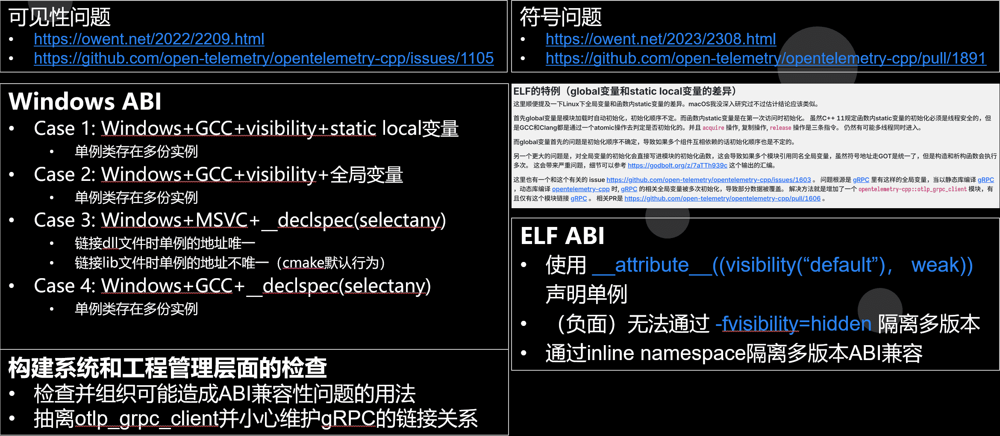

> - 不同平台的ABI和符号加载机制建议参考书：《程序员的自我修养：链接、装载与库》。
> - 可见性问题更多详情可参考：
>   - <https://owent.net/2022/2209.html>
>   - <https://github.com/open-telemetry/opentelemetry-cpp/issues/1105>
> - 符号问题更多详情可参考：
>   - <https://owent.net/2023/2308.html>
>   - <https://github.com/open-telemetry/opentelemetry-cpp/pull/1891>

### nostd和ABI兼容性设计

我们一个框架需要用 [OpenTelemetry][1] 上报数据，我们的依赖库可嫩也使用 [OpenTelemetry][1] 并且是二进制发布的。
这就可以我们用的 [OpenTelemetry][1] 版本不一致，为了解决版本不一致带来的ABI兼容性问题，[OpenTelemetry][1] 对于对外接口，统一使用 nostd 替代了直接使用STL。并且API层要求必须ABI兼容。（通过 <https://github.com/lvc/abi-compliance-checker> 检查 ）

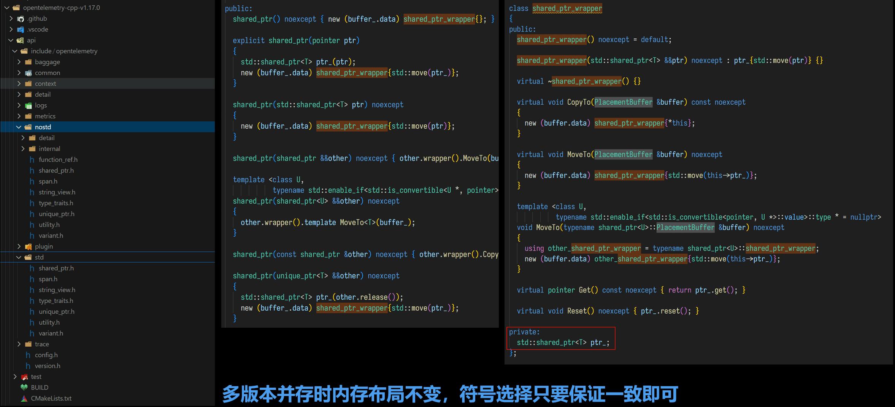

### 社区小故事 - Bundle和外部版本的abseil-cpp（ABI兼容性）

我们还有个小故事是早期我们的nostd适配层引入了特定版本的 abseil-cpp ，并做了 inline 命名空间来做符号隔离。
导致如果用户如果编译 [OTEL-CPP][2] 的时候没有引入abseil-cpp，但是后来其他库引入了。轻则版本混用编译不过，重则ABI不匹配，运行时Crash。

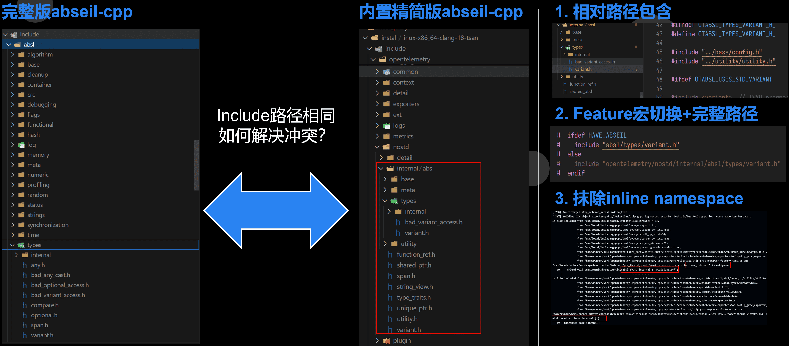

这个问题最新版本通过重新梳理包含路径和彻底抹除内置版本abseil-cpp的inline namespace，然后替换命名空间解决了。

### UE引擎内存管理的坑

我们还碰到一个ABI相关的坑是关于引入UE引擎的。这个坑其实起源于 Protobuf。

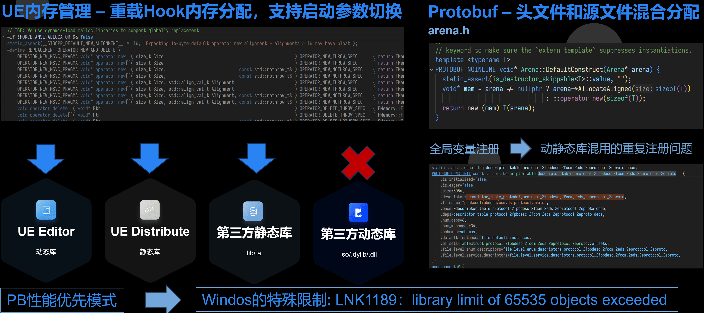

UE的UBT默认第三方库大多数采用静态库的方式链接。包括Protobuf，并且它冲过重载 `operator new` 来重定向内存分配接口。
Protobuf'又会产生大量符号，以至于我们引入大量proto之后，Windows上直接超过.lib的符号限制了。

但是如果 `.pb.cc` 编译成动态库（源码引入UE模块时，Editor的默认行为），静态链接Protobuf。
由于Protobuf和gRPC都用了全局变量来放一些注册数据，在某些ABI或者编译选项下就是导致跨 `.so/.dll` 注册的符号不互通而Crash。

全用动态库，Protobuf里有些代码它为了提高速度，`.h` 里和 `.pb.cc` 里都有一份，`.pb.cc` 引用的是 libprotobuf 里的反射接口创建和销毁（不同版本实现不完全一样）。本来这两个行为一致到没什么，而UE又Hook了内存分配，就会导致 `.h` 里创建的对象走了UE的内存分配，而如果销毁的时候走了 `.pb.cc` 里最终使用 libprotobuf 里的版本有没有使用UE的内存分配。两边不一致就会Crash。

目前我们的方案是关掉UE的 `operator new` 重载，并通过 `LD_PRELOAD` 的方式接管第三方库的内存分配。（UE自己的组件是显示调用它的接口的，还是受UE启动参数影响，仅仅第三方库采用这种方式）

### 应对不统一的IO模型

C++没有统一的IO模型也给IO的抽象带来了极大的困扰，有些库用libevent，有些libuv有些boost.asio，还有自己撸的和gRPC这种内部封装不对外暴露的。
还有更暴力比如Prometheus-Cpp直接用同步接口的。

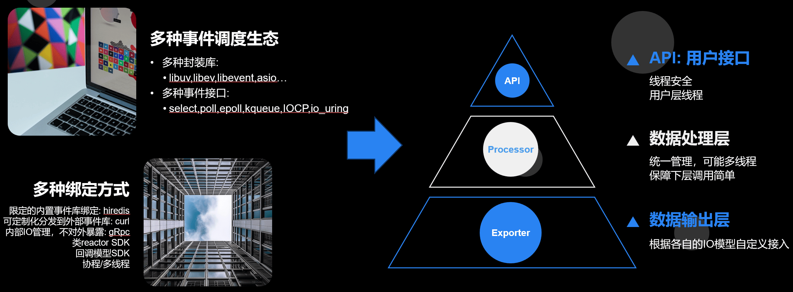

目前为了适应多种场景和上游依赖，做法是多线程。这样不但能简单抽象IO模型，还能后台去做自动合批，跨线程采集等等。就不会影响业务线程，不会造成卡帧。

### 构建系统和依赖管理的痛

C++构建系统和依赖管理也是一大痛点。[OTEL-CPP][2] 官方支持 CMake 和 Bazel。

Bazel的定制化和动态配置方面比 CMake 要弱。并且上游包也有版本依赖关系，对不同编译器、编译环境操作系统、上游软件包版本管理造成了不少困扰。

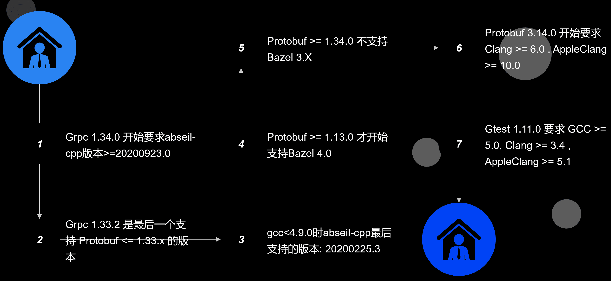

所以我基于CMake自研了一个构建系统和报管理系统。兼容vcpkg并且比 [OpenTelemetry][1] 和 vcpkg都有更好的兼容性。大体架构如下:

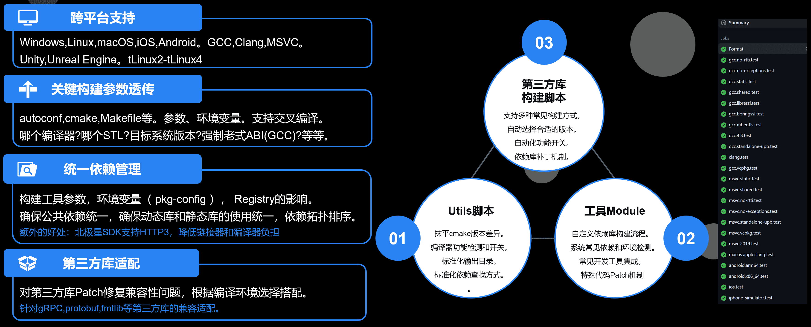

开源在 <https://github.com/atframework/cmake-toolset> 。

更多详情可以参见:

- <https://owent.net/2021/2106.html>
- <https://owent.net/2021/2109.html>
- <https://owent.net/2023/2301.html>

### 社区小故事 - gRPC的坑

这里忍不住吐槽一下 gRPC 的符号和编译问题的坑。

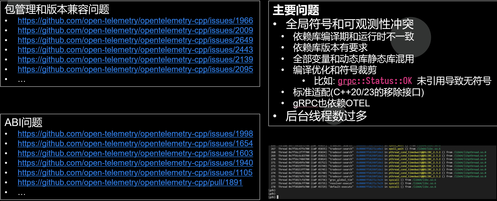

### gRPC Exporter的线程数问题

另外 gRPC 底层会按CPU 核心数创建IO线程，并且还不能改。上面图里可以看到创建了近300个线程。

它代码如下：

```cpp
// cpu.cc
static long ncpus = 0;

static void init_ncpus() {
  ncpus = sysconf(_SC_NPROCESSORS_CONF);
  if (ncpus < 1 || ncpus > INT32_MAX) {
    LOG(ERROR) << "Cannot determine number of CPUs: assuming 1";
    ncpus = 1;
  }
}

unsigned gpr_cpu_num_cores(void) {
  static gpr_once once = GPR_ONCE_INIT;
  gpr_once_init(&once, init_ncpus);
  return (unsigned)ncpus;
}

// executor.cc
Executor::Executor(const char* name) : name_(name) {
  adding_thread_lock_ = GPR_SPINLOCK_STATIC_INITIALIZER;
  gpr_atm_rel_store(&num_threads_, 0);
  max_threads_ = std::max(1u, 2 * gpr_cpu_num_cores());
}
```

这个问题我们有两个优化方向：

- 优化一：共享gRPC Context。

> 这个优化已经合入社区，详见: <https://github.com/open-telemetry/opentelemetry-cpp/pull/3041>

- 优化二：Hook获取CPU数的接口。

并没有地方可以改这个 `max_threads_` 值。所以我写了个hook工具，然后 `LD_PRELOAD` 来从环境变量改 `sysconf(_SC_NPROCESSORS_CONF)` 的返回值。

```cpp
long sysconf(int name) { //NOLINT: runtime/int
    // 获取原始的sysconf函数
    using sysconf_fn_t = long (*)(int); //NOLINT: runtime/int
    static sysconf_fn_t real_sysconf = nullptr;
    if (!real_sysconf) {
        real_sysconf = (sysconf_fn_t)dlsym(RTLD_NEXT, "sysconf");
    }

    // 只修改_SC_NPROCESSORS_CONF和_SC_NPROCESSORS_ONLN的返回值
    if (name == _SC_NPROCESSORS_CONF || name == _SC_NPROCESSORS_ONLN) {
        // 检查是否设置了环境变量
        const char* fake_cpu_count = getenv("MY_APP_RES_LIMITS_CPU");
        if (fake_cpu_count && strlen(fake_cpu_count) > 0) {
            char* endptr;
            long count = strtol(fake_cpu_count, &endptr, 10); //NOLINT: runtime/int

            // 检查转换是否成功且值合理
            if (*endptr == '\0' && count > 0) {
                return count;
            } else {
                fprintf(stderr, "Warning: Invalid MY_APP_RES_LIMITS_CPU value: %s, using real value\n", fake_cpu_count);
            }
        }
    }

    // 其他参数使用原始函数处理
    return real_sysconf(name);
}
```

## 应用案例和踩坑

接下来分享我们项目应用过程中的问题和优化方案。

### 业务整体生态架构案例

我们可观测性能力建设的整体结构如下。

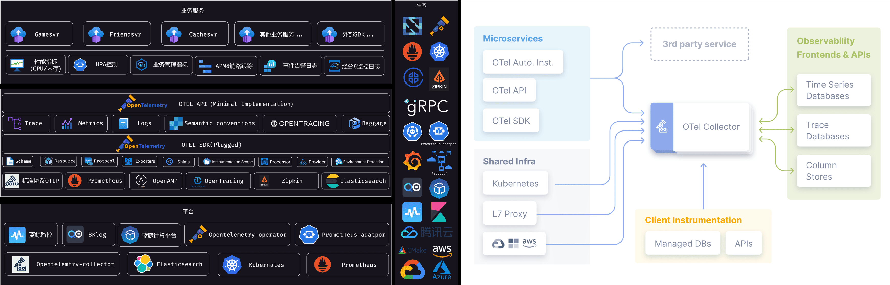

### 协程和Scope组件的冲突

现在协程在很多框架组件里都广泛使用。在链路跟踪方面，最早且多个项目组碰到的是协程和Scope组件的冲突。

[OTEL-CPP][2] 有个Scope组件，用于自动设置调用链上下文。这样函数调用者通过Scope可以不同透传上下文就自动设置主调和被调的关系。

但是 Scope 的实现原理是基于一个TLS变量管理调用栈，再由栈变量构造和析构的RAII机制自动Push和Pop。
显然在协程场景下，这个构造和析构顺序并不是实际调用的顺序。所以我们还是要自己管理。

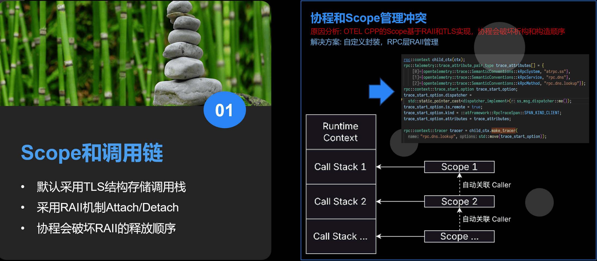

### 共享栈有栈协程和线程安全的冲突

某些协程库使用共享栈技术（比如 libco 和早期的 libgo ），在上下文切出时，把栈内存copy出去。然后栈给其他运行上下文用。等要切回来的时候再copy回来。
这种情况下切出以后其实栈上变量是不能访问的。但是在 [OTEL-CPP][2] 中有多线程，线程间同步依赖条件变量。这要求栈上变量总是可用。这就导致了冲突。

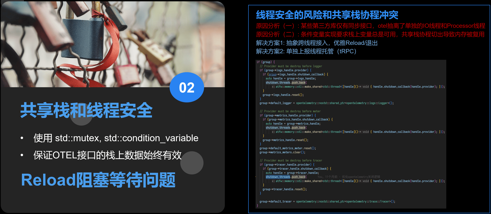

对于共享栈协程，解决方案就是仅仅在栈上生产Span数据，然后交由外部独立的IO线程去管理生命周期。然后显式调用End。
缺点就是没法充分利用RAII的优势。

> 普通协程只是不能用Scope，生命周期管理还是可以利用RAII自动处理的。

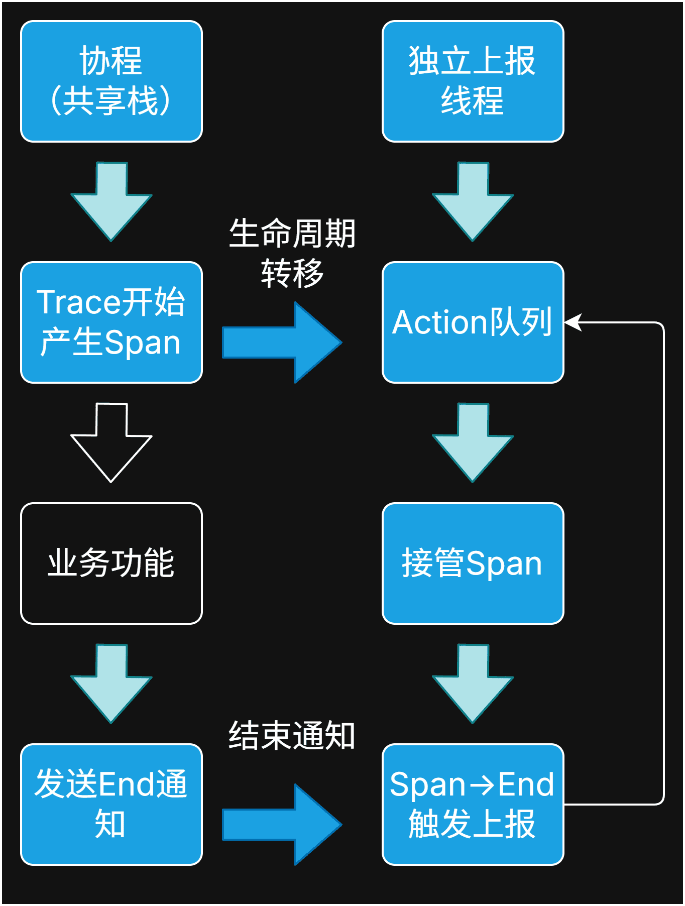

### 社区小故事 - 多线程的痛和GCC BUG

这里再分享个某个版本踩坑的GCC Bug。

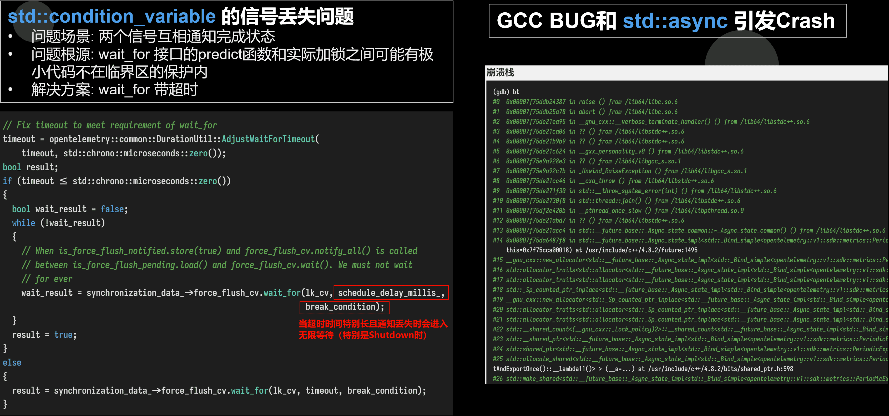

> 详见分享: <https://owent.net/2024/2402.html>

### 海量数据并发和高延迟丢包问题

[OTEL-CPP][2] 自带一个Batch Processor。它会在后台把收到的各类Record先合并后再通过RPC发到远程服务器。
大多数情况再BatchProcessor合并数据之后，IO不会成为瓶颈。

但是曾经tRPC接入Logs模块上报大量Logs的时候，发现会导致日志丢失。

由于BatchProcessor收到消息的时候时先推到内部的无锁队列的。在发送过程中持续收到的消息会继续进到无所队列。
但是这个队列不能无限长，超过最大限制了就会Drop。同时，[OpenTelemetry][1] 规范要求Processor对Exporter的导出接口调用必须单线程。
那么这种情况下，想要并发发送数据就必须IO复用。实际上，[OpenTelemetry][1] 规范对并发导出时可选的。所以有些Exporter只支持同步输出。
比如Prometheus Exporter，受限于上游Prometheus CPP库实现得比较暴力，导致只支持同步输出。
而早期得OTLP接口，也使用得时gRPC和CURL得同步接口。

其实在大多数场景下，在BatchProcessor合批优化后，即便链路跟踪每秒产生数万条Span。同步输出也是足够的。
而tRPC这里碰到的场景比较特殊，首先是有大量的日志持续不断地产生。其次平台方在高压力情况下产生了高延迟，一次调用超过100ms。
最终就导致了导出过程中产生新日志地数量大于消费数量而丢日志。

实际上这里更高并发度的话平台时可以处理的，所以我就给OTLP协议实现了并发导出支持。

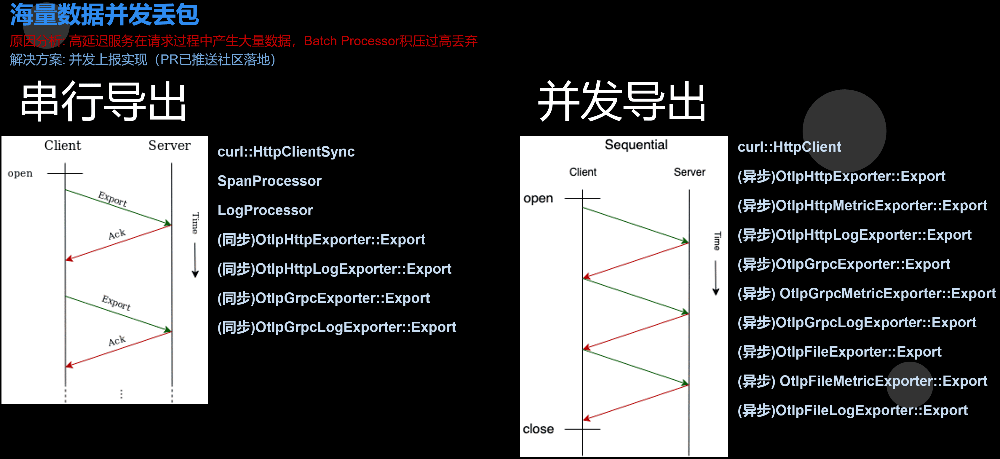

- 对于gRPC，因为内部有io线程。所以最早我是加了个线程做同步用。后来新版本新增了async接口，可以复用gRPC的线程。于是现在统一改成gRPC async接口做数据同步，可以少一个不必要的线程开销。

```{mermaid}
flowchart LR
 subgraph SDK["OTEL-CPP SDK层"]
    direction TB
        Recordable("fa:fa-file-text Trace/Metrics/Logs数据")
        BatchProcessor("fa:fa-tasks BatchProcessor")
  end
 subgraph Exporter["OTEL-CPP Exporter层"]
    direction TB
        Exporter1("fa:fa-paper-plane gRPC Exporter")
  end
 subgraph ThirdParty["外部SDK"]
    direction TB
        IOMGR("fa:fa-exchange gRPC IOMgr")
        Thread1("fa:fa-file-export IO线程")
        Thread2("fa:fa-file-export IO线程")
        Thread3("fa:fa-file-export IO线程")
        Thread4("fa:fa-file-export IO线程...")
  end
    Recordable -- 产生数据 --> BatchProcessor
    IOMGR --> Thread1 & Thread2 & Thread3 & Thread4
    Exporter1 --> IOMGR
    SDK --> Exporter
```

<!--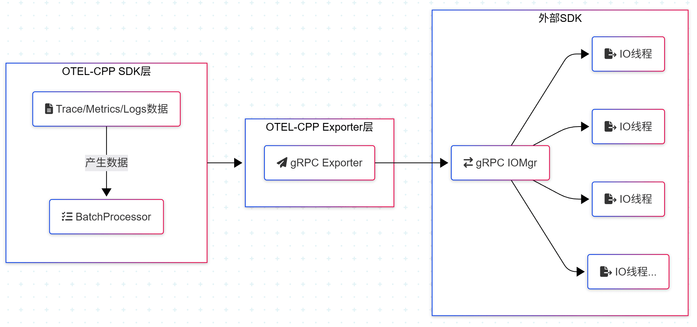-->

- 对于HTTP，由于现在 [OTEL-CPP][2] 没有实现自己的event poll机制。所以复用了curl内置的poll机制（curl是支持绑定外部event poll的）。这个默认poll再Linux下是走poll接口（不是epoll），Windows上是select。我们一个Exporter通常并发度不需要太高，所以select也是足够的。但是这里需要一个额外的线程去调用poll，去做IO同步。

```{mermaid}
flowchart LR
 subgraph SDK["OTEL-CPP SDK层"]
    direction TB
        Recordable("fa:fa-file-text Trace/Metrics/Logs数据")
        BatchProcessor("fa:fa-tasks BatchProcessor")
  end
 subgraph Exporter["OTEL-CPP Exporter层"]
    direction TB
        Exporter1("fa:fa-paper-plane gRPC Exporter")
  end
 subgraph ThirdParty["外部SDK"]
    direction TB
        IOMGR("fa:fa-exchange gRPC IOMgr")
        Thread1("fa:fa-file-export IO线程")
        Thread2("fa:fa-file-export IO线程")
        Thread3("fa:fa-file-export IO线程")
        Thread4("fa:fa-file-export IO线程...")
  end
    Recordable -- 产生数据 --> BatchProcessor
    IOMGR --> Thread1 & Thread2 & Thread3 & Thread4
    Exporter1 --> IOMGR
    SDK --> Exporter
```

<!--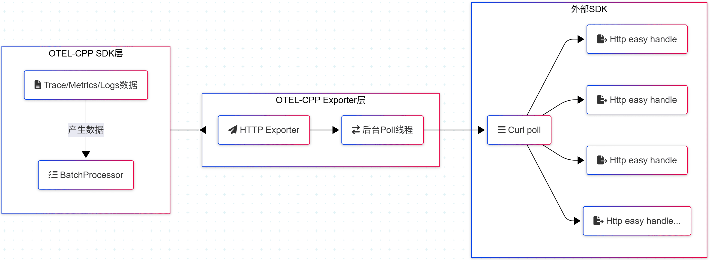-->

- 对于文件系统，目前直接利用自带的buffer机制就可以了。

### 链路跟踪的性能优化

我们最早采用RapidJSON+TDR反射接口上报链路跟踪数据，但是发现数据量大以后，链路跟踪本身的开销就很高。所以我们很早的时候就切到了 [OTEL-CPP][2]。

当时切换完后，走OTLP gRPC协议，发现性能提升了近6倍。但是后来链路数据越来越复杂，标签属性越来越多以后开销也越来越高。
同时为了支持多维护的调试统计，我们也把链路跟踪清洗成指标。由于API和SDK层属性集合是完全动态的，导致每次Merge数据和属性计算的开销巨大无比。

早期 [OTEL-CPP][2] 为了保证无序属性设置不影响属性比较（比如 `{ {"a, 1}, {"b", 2} } == { {"b", 2}, {"a", 1} }`），底层直接用了 `std::map` 。
这就导致每次插入必须做大量的字符串比较，开销巨大。但是在链路跟踪场景里，实际上对于一种类型的调用，大部分属性往往是一样的。

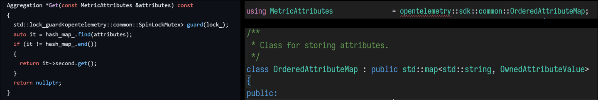

这样我们 **第一阶段优化** 就很明确了：

- 内部统计聚合，缩减和简化索引，聚合后上报（OTEL库调用降频）
- 分离上报和采集，减少多线程锁冲突

这一阶段的 ***优化效果*** 是：链路跟踪负载降低约60%。数据量大时仍然有较高的CPU开销（低于20%）。

[OpenTelemetry][1] 社区自带一个 [collector][7] 组件，可以用于缓冲和代理数据转发。里面也附带清洗功能。所以我们 **第二阶段优化** 的就是把清洗负载从业务进程分离出去。而且[collector][7]还能再做二次聚合，降低上报服务的负载。另外由于平台限制, 我们通过 [Prometheus][4] 上报指标不得不复制大量相似属性（不支持前面提到的 [target_info][6]），但是OTLP没这问题。

**第二阶段优化** 核心优化内容是：

- otelcol代理缓冲，使用connector组件外部进程trace转指标
- 无需双向拉取上报的指标，全部使用OTLP代替Prometheus

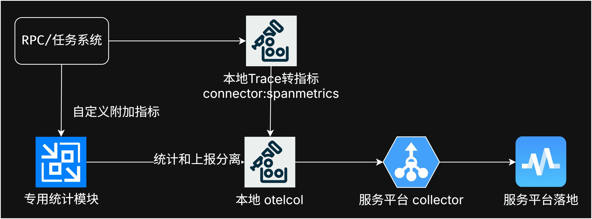

同时我也在推进社区改进算法，截至带今天。指标部分已经采用带HashCode缓存的HashMap去管理属性集了。开销已经大幅下降了。

最终完整版接入方案如下：

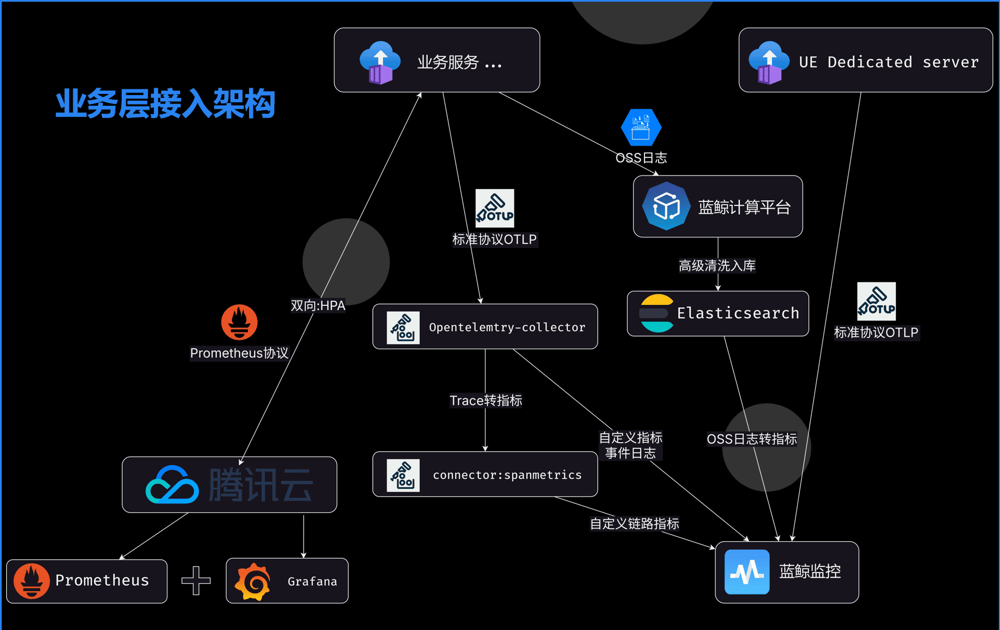

再附上几个阶段和最早RapidJSON+TDR的性能对比。

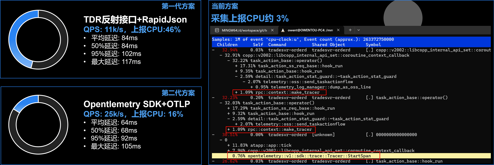

这里的第二代方案指的是不包含我们上述 **第一阶段优化** 和 **第二阶段优化**，仅仅是替换完使用 [OTEL-CPP][2] 的OTLP上报链路跟踪的结果。

然后我们还进行了 **第三阶段优化** （尚未压测），主要核心点是：

- 增加动态的线程池，分离高负载调用到Worker线程。
  > 不仅仅应用于链路跟踪，也应用于Logs上报和数据库等IO任务。这样可以降低主线程的负载和卡顿。
- 动态采样方案

#### 基础的部分采样方案

[OpenTelemetry][1] 的链路跟踪自带部分采样的方案。只要我们创建TraceProvider的时候使用 `TraceIdRatioBasedSampler` 就可以了。
它的核心代码很简单:

```cpp
SamplingResult TraceIdRatioBasedSampler::ShouldSample(
    const trace_api::SpanContext & /*parent_context*/,
    trace_api::TraceId trace_id,
    nostd::string_view /*name*/,
    trace_api::SpanKind /*span_kind*/,
    const opentelemetry::common::KeyValueIterable & /*attributes*/,
    const trace_api::SpanContextKeyValueIterable & /*links*/) noexcept
{
  if (threshold_ == 0)
    return {Decision::DROP, nullptr, {}};

  if (CalculateThresholdFromBuffer(trace_id) <= threshold_)
  {
    return {Decision::RECORD_AND_SAMPLE, nullptr, {}};
  }

  return {Decision::DROP, nullptr, {}};
}
```

根据trace id计算hash值，和预设比例对比。为什么只用trace_id呢？因为我们约定链路跟踪里，一条完整的链路的 trace_id 是一样的。里面不同的层级有自己的span。
那我们不能子节点要采样，父节点不采样。或者中间父节点不采样，前后采样。所以整个是基于要么整个链路都采样，要么整个链路都不踩。
这么实现的好处是不需要RPC层跨线程传输额外的数据。

#### 动态部分采样方案

但是我们更希望，低负载的场景尽量多采样，高负载场景才根据负载动态采样。这时候如果涉及跨进程，span是否需要采样是需要RPC层带一些标识数据的。
因为决定是否采样的决策层可能不在本进程上。我给我们框架写了一个动态采样的Sampler去提供这个功能。

```cpp
// 主调和被调关系采样标记继承
if (nullptr != options.parent_network_span &&
    options.parent_network_span->trace_id().size() == trace_id_span::extent &&
    options.parent_network_span->span_id().size() == span_id_span::extent) {
  // -  网络（跨进程）
  const uint8_t *parent_trace_id = reinterpret_cast<const uint8_t *>(options.parent_network_span->trace_id().c_str());
  const uint8_t *parent_span_id = reinterpret_cast<const uint8_t *>(options.parent_network_span->span_id().c_str());
  uint8_t trace_flags = opentelemetry::trace::TraceFlags::kIsRandom;
  if (!options.parent_network_span->dynamic_ignore()) {
    trace_flags |= opentelemetry::trace::TraceFlags::kIsSampled;
  }
  span_options.parent = opentelemetry::trace::SpanContext{
      opentelemetry::trace::TraceId{trace_id_span{parent_trace_id, trace_id_span::extent}},
      opentelemetry::trace::SpanId{span_id_span{parent_span_id, span_id_span::extent}},
      opentelemetry::trace::TraceFlags{trace_flags}, options.is_remote};
} else if (options.parent_memory_span) { 
  // -  本地
  if (!options.parent_memory_span->IsRecording()) {
    return false;
  }
  span_options.parent = options.parent_memory_span->GetContext();
}

// 第一个Trace Span决策是否采样
static bool should_sample_trace_span() {
  time_t now = atfw::util::time::time_utility::get_sys_now();

  auto &metrics_data = get_rpc_context_mertrics_data();
  if (now != metrics_data.last_collect_per_second_timepoint) {
    calculate_trace_span_permillage(now);
  }

  if (metrics_data.configure_max_count_per_second > 0 &&
      metrics_data.configure_max_count_per_second + metrics_data.last_second_timepoint_sample_trace_span_count <
          metrics_data.total_sample_trace_span_count) {
    return false;
  }

  if (metrics_data.configure_max_count_per_minute > 0 &&
      metrics_data.configure_max_count_per_minute + metrics_data.last_minute_timepoint_sample_trace_span_count <
          metrics_data.total_sample_trace_span_count) {
    return false;
  }

  if (metrics_data.sample_rate <= 0 || metrics_data.sample_rate > 0xFFFFFF) {
    return true;
  }

  return atfw::util::random_engine::fast_random_between<int64_t>(0, 0x1000000) < metrics_data.sample_rate;
}
```

### 指标的性能和易用性优化

前面提到，指标的采集和合并其实实在单独的后台线程。上报也分Pull模式和Push模式。整个流程是有差异的。

大致的采集流程如下：

```{mermaid}
flowchart LR
 subgraph PullExporter["Pull模式驱动器"]
    direction LR
        PPull("Prometheus Pull Exporter
            (MetricReader)
            【fa:fa-globe 外部请求触发】")
        PEMR("PeriodicExportingMetricReader
            【fa:fa-clock 定时器触发】")
  end
 subgraph PrometheusExporter["Prometheus和其他"]
    direction LR
        PPush("fa:fa-file-export Prometheus Push Exporter")
        PFile("fa:fa-file-export Prometheus File Exporter")
        OtherPushExporter("fa:fa-file-export 其他Push模式Exporter...")
  end
 subgraph OTLPExporter["OTLP"]
    direction LR
        OTLPGRPC("fa:fa-file-export OTLP gRPC Exporter")
        OTLPHTTP("fa:fa-file-export OTLP HTTP Exporter")
        OTLPFile("fa:fa-file-export OTLP File Exporter")
  end
 subgraph PushExporter["Push模式输出"]
    direction TB
        PrometheusExporter
        OTLPExporter
  end
 subgraph Meters["多个指标"]
    direction LR
        Meter1("Meter 1")
        Meter2("Meter 2")
        Meter3("Meter 3")
        Meter4("Meter ...")
  end
 classDef callback stroke:#f00
 subgraph MeterCallbacks["指标回调(每个指标)"]
    direction TB
        Callback["Callback"]:::callback
        ObservableRegistry["ObservableRegistry"]       
  end
 subgraph SyncMeterAPI["同步指标接口(每个指标)"]
    direction LR
        Counter["fa:fa-paper-plane Counter"]
        Gauge["fa:fa-paper-plane Gauge"]
        Histogram["fa:fa-paper-plane Histogram"]
  end
 subgraph MetricStorageLayer["存储层(每个视图)"]
    direction TB
        SyncMetricStorage["fa:fa-layer-group 同步存储层"]
        AsyncMetricStorage["fa:fa-layer-group 异步存储层"]
  end
 subgraph MeterCollect["采集层"]
        MC("MetricCollector")
        MetricProducer("MetricProducer")
        Meters
        MeterCallbacks
        SyncMeterAPI
        MetricStorageLayer
  end
    PullExporter -- 驱动触发采集 --> MetricProducer
    MetricProducer --> MC
    MC --> Meters
    ObservableRegistry --> Callback
    Meters --> MeterCallbacks
    SyncMeterAPI --> MetricStorageLayer
    MeterCallbacks --> MetricStorageLayer
    MetricStorageLayer -- 通知指标提取 --> Meters
    Meters -- Collect获取结果后 --> PushExporter
    SyncMetricStorage@{ shape: lin-cyl}
    AsyncMetricStorage@{ shape: lin-cyl}
```

<!--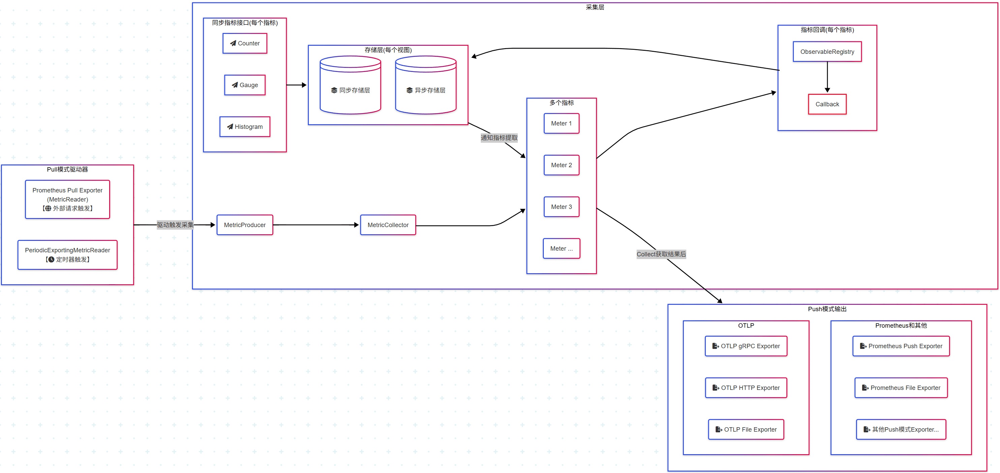-->

为了性能考虑，我们主要使用指标的一部接口。下面是一个简单的注册上百示例：

```cpp
using otel_observer_result_int64 = opentelemetry::metrics::ObserverResultT<int64_t>;
using otel_observer_result_double = opentelemetry::metrics::ObserverResultT<double>;

auto meter = provider->GetMeter("meter name");
auto instrument = meter->CreateInt64ObservableGauge("instrument name", "instrument description", "instrument unit");

instrument->AddCallback([](opentelemetry::metrics::ObserverResult result, void* /*private_data*/) {
    if (opentelemetry::nostd::holds_alternative<opentelemetry::nostd::shared_ptr<otel_observer_result_int64>>(result)) {
        auto type_result = opentelemetry::nostd::get<opentelemetry::nostd::shared_ptr<otel_observer_result_int64>>(result);
        if (type_result) {
            type_result->Observe(static_cast<int64_t>(get_result_value()), {} /* attributes */);
        }
    } else if (opentelemetry::nostd::holds_alternative<opentelemetry::nostd::shared_ptr<otel_observer_result_double>>(result)) {
        auto type_result = opentelemetry::nostd::get<opentelemetry::nostd::shared_ptr<otel_observer_result_double>>(result);
        type_result->Observe(static_cast<double>(result_value), {} /* attributes */);
    }
} /*, void* private_data*/);
```

异步接口的使用有几个需要注意的地方:

- 上报一个指标，有meter和instrument的概念。目前v1版本是不支持删除callback、instrument和meter的。目前即便v2版本也删不干净。所以如果reload，最好是重新创建provider，那么这里这个meter、instrument和callback都要重新创建和注册。

> 由于最后一个Provider引用释放的时候，otel-cpp会自动调用一次Flush吧所有已经导出的数据强制刷出。这会导致线程Block，所以为了不影响业务主线程。这里还要处理一次Reload的时候另起线程来执行Flush。

- 指标类型和调用Observe的传入类型要匹配，如果涉及浮点和整数转换的话，还要考虑 [epsilon][3] 。
- 回调函数的签名是 `using ObservableCallbackPtr = void (*)(ObserverResult, void *);` 只能透传一个 `void*` ，如果要包装更复杂的数据透传需要自己封装。
- 回调执行会跨线程，所以数据上报要保证线程安全。

> 业务层如果加锁粒度太粗，有可能影响主线程业务执行。如果无脑加很细粒度的锁，很容易频繁加解锁而导致不少开销。

- 多源拉取时可能会反复触发回调，所以不能简单地根据回调时间差来计算增量部分，否则可能导致误差。

为了解决这个问题，我们利用前面的Worker池，抽象了指标注册的包装来解决注册和Reload的问题，使用无所队列中转来解决线程安全的问题。

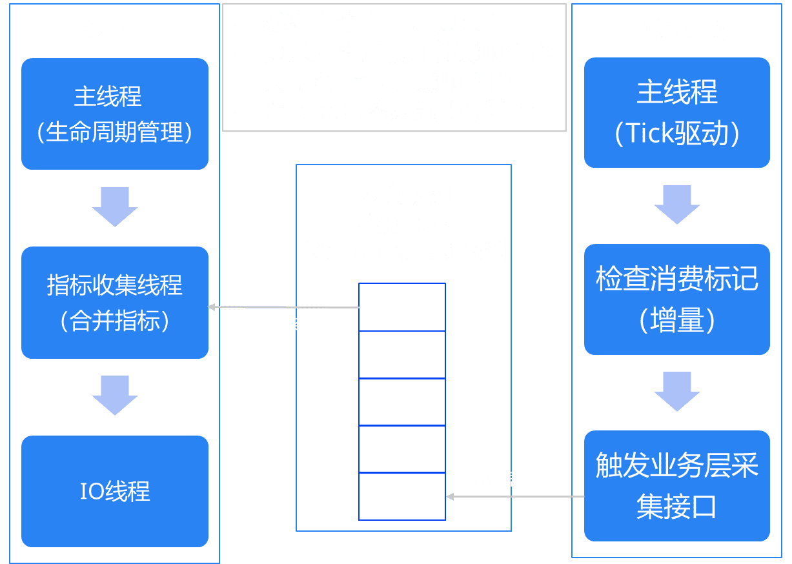

更多详情可以参见另一篇文章: [指标上报的多线程优化和多拉取源点优化][8] ，这里就不展开了。

### 动态策略控制模块和新一代HPA方案

游戏业务里很多服务都是有状态的，而对于上云以后的有状态服务的HPA能力支持，现在很多项目组已经有一些解决方案了。

- 方案一: BCS Hook,PreDeleteHook触发迁移

> 采用一些Hook，在集群认为需要缩容的时候通知业务节点，然后定期询问业务节点状态数据是否已经迁出。这种方案对业务侧状态数据管理有一定要求，比如要随时可以短时间迁出，自己处理路由一致性问题，不适用一些长状态业务，因为有些实现可能会阻塞控制器。

- 方案二:外部Sidecar服务管理，API触发集群变更

> 还有采用外部Sidecar服务管理，最终通过API触发集群变更的。这种方式Sidecar服务可以和业务框架RPC系统打通，可以抽象一些路由模型。但是由于对业务层来说是独立的外部组件，要做更深一步的定制化会要求这个独立服务的能力支持，这方面会复杂一些。
> 也有一些项目这方面采用自己维护私有版本istio的方式，给它增加私有协议支持，我们交流下来他们的主要问题是istio演进很快，那么他们的侵入式实现方案得follow istio的变化，成本会越来越高。后面他们也打算改成独立agent的方式，本质上也是一个外部服务。

- 方案三:业务内集成指标，通过指标触发集群变更

> 随着k8s新版HPAv2本对外部指标的支持，那么还有第三种方案就是业务层自己上报指标，导入到k8s外部指标里控制它的HPA行为。这种方式则需要业务层框架有自定义的指标上报能力，属于侵入式的，初期接入成本会高一些。

而除了基础的HPA和消息路由的整合以外，我们在业务层经常会有很多其他动态策略调整和监控的能力，其实是和有状态服务的HPA的流程很像。
比如前面提到的战斗房间管理，允许负责DS房间管理的研发同学通过按地图、玩法模式的DS相关的指标计数做资源预埋。特别是对于海外环境需要提前预订机器资源池的场景的风控和体验优化。
再比如对于匹配体验:，可以按不同玩法，队伍人数的负载来控制匹配节点数和对匹配服务虚拟分组，这样可以提高匹配成功率。
前面交易行也提到有动态虚拟分组，视图参数和缓存量控制的需求。

我们希望达成一个新的目标，就是统一业务层动态策略控制和HPA控制的流程。这样可以大幅降低这类基于整体大盘数据来动态调整某些策略的业务接入难度和成本。
一方面对于基础的HPA能力支持，业务侧可以定制化更多的自定义策略，只需要关心自己依据什么去控制负载，而不需要关心怎么去和k8s、BCS或者其他外部组件去搭配通信。
另一方面对于其他自定义的策略，业务层只需要关心自己需要什么参考系数和怎么用在这些系数产生自己的策略配置，而不需要关心怎么下发，怎么同步，怎么汇总，谁去汇总。

这些场景可以拆解为这几个核心问题:

1. 如何上报业务策略系数？如何发现负载或策略需要变更？
2. 如何处理多种业务层策略并存？如何抽象能力让其不仅限于负载控制？我们不再是狭义的pod数伸缩，也包括业务策略伸缩。
3. 如何决定谁来控制策略？如何人工干预？
4. 如何简化策略共识过程？如何处理策略变化的时候多个共识达成过程中的一致性问题？
5. 还有我们服务涉及都中不同的框架，GS是我们自己的服务框架，DS则基于UE的架构和生态。我们也并没有所有服务都上云，云上和云下的统一和复用社区的生态和涉及理念也能降低所有人理解上的心智负担。

对于第一个问题，策略上报和发现变更，我们利用系统内可观测性能力。目前主要是Prometheus协议，当然如果后续OTEL的系统更加成熟了的话可能也会切到纯OTEL的生态。然后定期去拉取指标汇总结果，并且这里我们就可以让业务指标汇总的时候复用Prometheus社区的各种聚合接口的能力。这种方式比传统的业务层管理方案省去了专门的管理和汇聚服务成本。

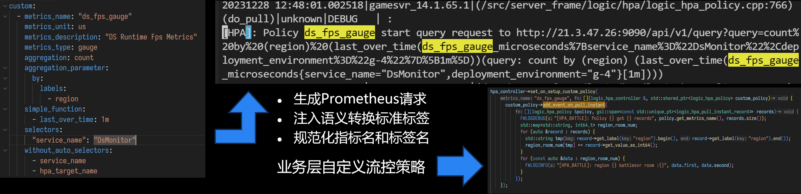

业务层接入方式，一个是配置指标名和自定义标签，另一个是代码层面注册上报和拉取后的处理接口，在业务层都是比较简单的。这个HPA控制器和可观测性模块会处理标签标准化语义转换，多个策略隔离和共享等问题。并且可以看到这里没有直接暴露原始的Prometheus Query，而是提供对函数和结合的封装。这是因为跨组件传递标签的时候不同组件的规范不一样，所以我抽象了标准化语义转换的过程，并且和社区的语义转换规范保持一致。

然后我们把策略数据写入到ETCD，通过ETCD的lease和watch机制下发自动控制策略。通过配置中心下发人工策略。就可以实现这个通用的基于指标的策略控制系统。

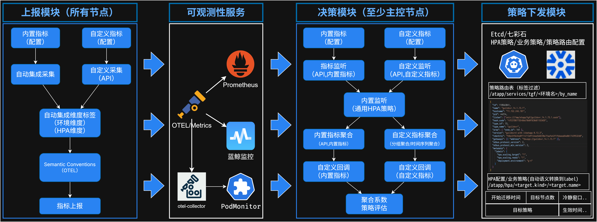

在有了指标上报和策略管理之后，我们就可以结合新版本K8S的HPAv2的外部指标和自定义指标来驱动K8S管理Pods。

在HPA控制器的层面，我们又加了两组指标来和K8S打通。
一个指标是最大有状态节点Pod Index。（如果节点包含状态数据，则上报自己的Pod Index，没有数据则上报零。）
另一个指标是主控节点上报预期节点数。

然后在策略路由层加了两个标签来表示当前分布和目标分布。
扩缩容时数据先由当前分布向目标分布迁移，完成后通过标签来切换SDK端的策略路由。
最后在震荡期之后的安全退出阶段，写出预期副本数据的指标，通知K8S扩缩容。

- 无状态服务直接按目标分布标签的策略路由控制集群分布即可。
- 短状态服务比较简单，如果节点包含状态数据，则上报自己的Pod Index，没有数据则上报零，然后退出前可以再通过preStop来double check。
- 长状态服务要先由主控节点决策执行状态迁移起始和结束保底时间，分为主备同步阶段、转发阶段和安全退出阶段。某些服务主备同步阶段可以跳过。

因为我们要自己接管前置策略和下发，所以我在这个组件里C++实现了CPU、内存的指标上报和监控，还有冷静窗口，多指标融合计算等等，和k8s的策略相似。
也有一些框架相关的指标，比如主线程CPU占用和协程栈池占用。业务层其他动态策略的指标也可以作为HPA计算。

数据迁移期间某些服务会有主从同步，我们在RPC层实现了RPC Clone来实现。
在转发阶段，已经迁出的节点收到请求则通过RPC层实现了RPC Forward机制来透明代理。
这部分和Redis Cluster的方案有点像（，但我们是服务端转发。）

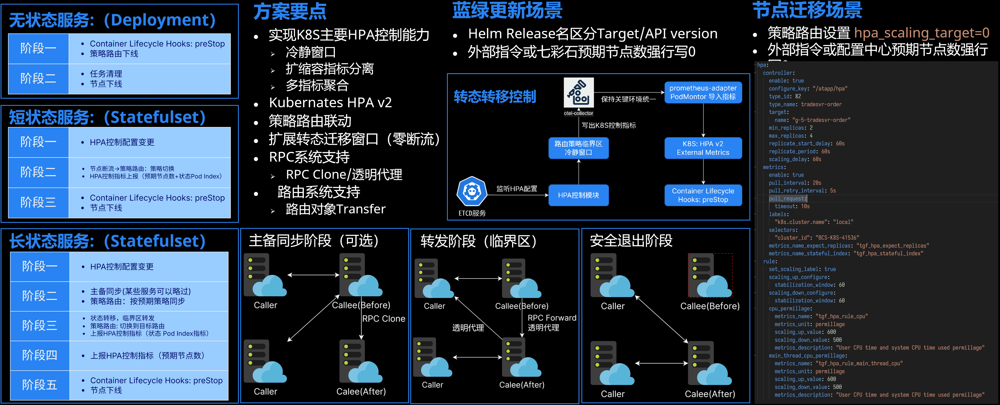

这样，整体方案就能同时覆盖无状态、短状态和长状态的HPA场景。

## 最后

这篇写得篇幅比较大，基本上是个大一统的分享。后续有空我也会再再几个子项分享展开。

也欢迎有兴趣的小伙伴们互相交流。

[1]: https://opentelemetry.io
[2]: https://github.com/open-telemetry/opentelemetry-cpp
[3]: https://en.cppreference.com/w/cpp/types/numeric_limits/epsilon
[4]: https://prometheus.io/
[5]: https://opencensus.io/
[6]: https://github.com/prometheus/OpenMetrics/blob/v1.0.0/specification/OpenMetrics.md#supporting-target-metadata-in-both-push-based-and-pull-based-systems
[7]: https://opentelemetry.io/docs/collector/
[8]: https://owent.net/2025/2503.html
