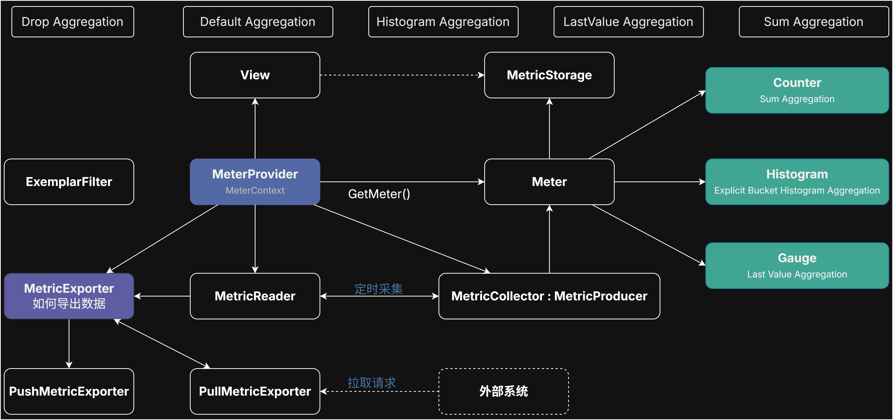

## 前言

近年来可观测性领域越来越成熟，游戏服务的可观测性能力建设日益成为提升产品质量与运维效率的关键环节。随着游戏系统架构的不断复杂化，传统的监控和故障排查方式已难以满足业务高可用和用户体验优化的需求。通过健全的可观测性体系，能够实现对游戏服务全链路的实时监控、异常检测与分析，助力技术团队及时发现和定位问题，推动产品持续优化与稳定迭代，从而为玩家提供更加流畅和可靠的游戏体验。

作为 [OpenTelemetry][1] 社区 [C++ SDK][2] 的核心贡献者，我一直致力于将可观测性能力引入并深度集成和应用到游戏服务框架和业务开发过程中。本文的主要的内容就是分享在这个过程中积累的工程实践和典型案例，并探讨遇到的主要问题及解决思路。

> [OpenTelemetry][1] 隶属于CNCF（云原生计算基金会），2019年成立，2021年开始孵化。

## 应用场景

首先介绍一点典型的应用场景。

### 链路追踪

首先最基础的能力之一是链路追踪。最早我们也使用过gtrace做链路追踪。但是现在gtrace已经停止维护并全面转向 [OpenTelemetry][1] 了。


可以看到，我们可以对单个链路单独分析每一层调用关系的负载、延迟等。不止如此，有一些频台还会有一些特色功能，比如帮我们分析 99%，95%、服务间关系，健康度等。


### 指标

在指标方面，最常见的应用是对CPU、内存等资源监控。


和传统方案对比，这里的优势是我们可以给上报指标大很多标签。然后在面板上随时切换。
通常情况下，我们有时候某个研发环境出故障，只有特定环境、特定类型的服务故障。这时候就可以通过多维度切换快速找到问题所在的服务。

另外也可以很方便地统计各类资源占用大盘，来给我们各类服务的资源配比提供指导。

除了基础的系统进程层面的信息外，也能助力我们框架层的监控。比如RPC、错误分析、数据库占用等等。


我们系统里数据库字段有最大长度，存入数据库的是pb打包后的二进制。长度是动态的，上面的图里有分析数据库字段占用，情况。在快要耗尽时告警扩容。
我们曾今发现过一个IO问题，交易行服务在停服时需要保存大量的订单数据，会导致集中保存。大量的IO导致出发了公共集群数据库的限频。
然后后台失败重试，导致了雪崩。


我们通过一个动态消峰的机制解决了这个问题，并且之后加入了IO监控来监视这类情况的风险。

在业务层面，我们也有很多的应用。比如交易行模块有一个视图索引设计，用于多维护多标签的搜索和推荐。但是要平衡搜索和推荐的视图数量和LRU参数是否合理，于是有了视图和基础索引的开销分析。


我们同样提供交易行订单分析能力给策划监控实时市场价格和订单分布变化，以便做宏观调控。


并且在Steam新品节期间比安全组件更快发现工作室倒金行为。


通过结合指标拉取聚合能力，我们实现了允许业务开发在业务层实现动态策略能力，比如根据交易行不同商品的订单数动态调整一口价的撮合节点数，并且评估撮合策略的合理性。


还有按地图和玩法分类，根据玩家数决定排队长度等等。

### 日志

日志方面，[OpenTelemetry][1] 的主要目标是统一接口和模型。我们典型的使用案例是利用事件日志告警（当然也有根据指标告警）。


比如前面提到的发现数据库字段快要耗尽的告警，和协程并发度过高的告警。


另外日志还可以和链路跟踪自动关联，这样我们调试问题的时候可以直接一键拉到问题链路相关的日志，就不用人工查找分析了。


## 基本概念和框架

案例举例就到这里，接下来我们先来看一下可观测性 （[OpenTelemetry][1]） 的基本概念和框架结构。

### 基础组件

早期 [OpenTelemetry][1] 的基础结构如下所示。


其核心资源分为三个部分： **链路跟踪** 、 **指标** 和 **日志** 。


### 快速上手

如果只是作为使用者，产生和上报数据。最简单的接入使用非常简单。

```cpp
// ======================== 链路跟踪 ========================
auto provider = trace::Provider::GetTracerProvider();
auto tracer = provider->GetTracer("foo_library");
void f1() {
  auto scoped_span = trace::Scope(get_tracer()->StartSpan("f1"));
}
void f2() {
  auto scoped_span = trace::Scope(get_tracer()->StartSpan("f2"));
  f1();
  f1();
}
// f2 -> f1+f1

// ======================== 指标 ========================
auto provider = metrics_api::Provider::GetMeterProvider();
auto meter = provider->GetMeter(name, "1.2.0");
// 同步指令
auto double_counter = meter->CreateDoubleCounter("sync_counter");
for (uint32_t i = 0; i < 20; ++i) {
  double val = (rand() % 700) + 1.1;
  double_counter->Add(val);
  std::this_thread::sleep_for(std::chrono::milliseconds(500));
}
// 异步(回调)指令
auto observable_counter = meter->CreateDoubleObservableCounter("async_counter");
observable_counter->AddCallback([](opentelemetry::metrics::ObserverResult observer_result, void * /* state */) {
    if (opentelemetry::nostd::holds_alternative<opentelemetry::nostd::shared_ptr<
            opentelemetry::metrics::ObserverResultT<double>>>(observer_result)) {
      opentelemetry::nostd::get<
          opentelemetry::nostd::shared_ptr<opentelemetry::metrics::ObserverResultT<double>>>(observer_result)->Observe((rand() % 700) + 1.1);
    }
}, nullptr);

// ======================== 日志 ========================
auto provider = logs::Provider::GetLoggerProvider();
auto logger = provider->GetLogger("foo_library_logger", "foo_library");
logger->Debug("body", ctx.trace_id(), ctx.span_id(), ctx.trace_flags());
```

### SDK设计结构

[OpenTelemetry][1] 整体的设计汲取了之前的链路跟踪（比如gtrace）和指标（比如 [prometheus][4]，[opencensus][5]）的诸多应用场景和经验。
所以整个设计结构和概念其实是比较复杂的。


那这些结构落地到C++ SDK实现大概是这个样子。


Provider是一个全局的资源管理器，所有的组件创建数据都从Provider开始。数据产生后交由Processor处理。
比如一个标准的Processor叫BatchProcessor，顾名思义它会把产生的数据自动按负载合并并Batch化发送。
Recordable对应何磊组件里生成的数据接口，Exporter则是负责怎么输出数据。

### 语义转换

基础的结构只有属性的概念，但是我们在很多场景里表要标识哪个属性表达什么含义。比如说前面案例里有平台根据链路跟踪获取服务间的调用关系。
那平台怎么知道我们的RPC类型、名字和服务的名字呢？这里就要提到 **语义转换约定**。

[OpenTelemetry][1] 有一个章节描述了什么字段应该符合什么样的标准，报什么内容。这样我们使用方案这个标准报，各个平台就可以根据自己的特色提供一些平台特色的能力。使用方不用写任何特殊代码就能享用社区的成果。


> 详见: <https://opentelemetry.io/docs/specs/otel/semantic-conventions/>

各个厂商的特性化也可以通过这里提供。

### OTLP标准协议

为了标准化数据传输的过程， [OpenTelemetry][1] 包含了一个标准协议。基于Protobuf生态。


首先外层结构，**链路跟踪** 、 **指标** 和 **日志** 的结构类似。(这里以指标为例)

```proto
// MetricsData
// └─── ResourceMetrics
//   ├── Resource
//   ├── SchemaURL
//   └── ScopeMetrics
//      ├── Scope
//      ├── SchemaURL
//      └── Metric
//         ├── Name
//         ├── Description
//         ├── Unit
//         └── data
//            ├── Gauge
//            ├── Sum
//            ├── Histogram
//            ├── ExponentialHistogram
//            └── Summary
```

大致分为，Service/Data->Resouce->Scope->Span/Metric/Log这几层。为什么要这么多层呢？

我们举例一个场景，比如我们自己接入了指标上报，我们依赖的gRPC或者其他第三方组件也接入了可观测性。
那么怎么保证我们的上报点不冲突？这可以通过不同的Scope来区分。
然后同样在一个进程里，上报的数据会包含比如host信息，进程名字、业务类型等等和进程相关的信息。但是我们有2000个指标，显然我们不需要把这些信息重复上报 2000 份。
而在OTLP里，只要在Resource去上报一次就行了。接下来就是各自的数据区。

对于指标而言，还有一些更细致的分类和结构,当然也是和指标本身的概念相关。

```proto
//    Metric
//  +------------+
//  |name        |
//  |description |
//  |unit        |     +------------------------------------+
//  |data        |---> |Gauge, Sum, Histogram, Summary, ... |
//  +------------+     +------------------------------------+
//
//    Data [One of Gauge, Sum, Histogram, Summary, ...]
//  +-----------+
//  |...        |  // Metadata about the Data.
//  |points     |--+
//  +-----------+  |
//                 |      +---------------------------+
//                 |      |DataPoint 1                |
//                 v      |+------+------+   +------+ |
//              +-----+   ||label |label |...|label | |
//              |  1  |-->||value1|value2|...|valueN| |
//              +-----+   |+------+------+   +------+ |
//              |  .  |   |+-----+                    |
//              |  .  |   ||value|                    |
//              |  .  |   |+-----+                    |
//              |  .  |   +---------------------------+
//              |  .  |                   .
//              |  .  |                   .
//              |  .  |                   .
//              |  .  |   +---------------------------+
//              |  .  |   |DataPoint M                |
//              +-----+   |+------+------+   +------+ |
//              |  M  |-->||label |label |...|label | |
//              +-----+   ||value1|value2|...|valueN| |
//                        |+------+------+   +------+ |
//                        |+-----+                    |
//                        ||value|                    |
//                        |+-----+                    |
//                        +---------------------------+
```

#### 标准协议和实际落地的取舍

原始的OTLP协议属性是可以完全动态且嵌套的。
但是在我们的C++的实现中，为了降低不必要的开销的生命周期管理，大多数属性引用都是用视图传递。
这就失去生命周期的管理，就没法实现完整的OTLP协议。这里C++ SDK在性能和完整性上做了一些平衡和取舍，只实现了子集。


### 指标的复杂性结构

相对于 **链路跟踪** 和 **日志** 来说，**指标** 要更复杂一些。
多了一些概念，比如Push模式、Pull模式。增量值、累计值，计数器、Gauge、直方图等等。



这里比 [prometheus][4] 复杂得多。这是因为考虑和非常多的引用场景。
比如完全抽象了数据产生和数据上报，产生数据不用关系Exporter是采用Push模式还是Pull模式。
再比如对一份上报的数据，可能命中多个属性集合视图。那么SDK会自动拆分到多个Storage里，不需要调用者关心。

还有直方图数据类型可能和我们直观的感知有差异，我们很多小伙伴在使用过程中都会发生误解和困惑。

> 关于直方图建议阅读 <https://prometheus.io/docs/practices/histograms/> 。

这些最终造成 **指标** 比其他的组件要更复杂。

### 生态适配

#### 存量生态

前面也提到 [OpenTelemetry][1] 是结合了之前各类组件的经验，目标是成为可观测性领域大一统标准。比如 **链路跟踪** 替代了gtrace，指标大量参考了 [prometheus][4]，[opencensus][5] 等。

那对于一些旧有项目，怎么提供一些简单的迁移方式呢？目前有两种方式。一是通过shim库转换数据，二是通过Exporter层做数据格式转换。


#### Prometheus和OTEL Metrics的异同和适配

虽然我们的通信接口都是 [OpenTelemetry][1] 规范，但是有时候会上传到其他平台。比如目前指标领域的事实标准-[Prometheus][4]。

[Prometheus][4] 其实数据结构是比较简单的，比如指标名只允许 `[a-zA-Z_:][a-zA-Z0-9_:]*` 这个规范。只有一层标签的概念，标签名必须满足 `[a-zA-Z_][a-zA-Z0-9_]*` ，并且只有一层。

> 参考: <https://prometheus.io/docs/concepts/data_model/>

前面提到的一个进程内有2000个指标，上报共享的进程信息的时候，如果用原始的 [Prometheus][4] 我们不得不把这些信息重复上报 2000 份。

> 实际上对于进程级资源共享，[Prometheus][4] 和 [OpenCensus][5] 都有一个方案。定义了一个 [target_info][5] 类型的特殊指标来承载这些信息。
> 同一个连接，[target_info][5] 只要上报一次即可。后面上报的指标自动关联这些属性。但是这个并不是所有平台都兼容，将具体是否可用还要咨询使用的平台。
> 有兴趣可以阅读 <https://opentelemetry.io/docs/specs/otel/compatibility/prometheus_and_openmetrics/#resource-attributes-1>

除此之外，[OpenTelemetry][1] 的指标有unit的概念。在转换成 [Prometheus][4]也需要做一些单位标准化。

```cpp
// Time
{"d", "days"},
{"h", "hours"},
{"min", "minutes"},
{"s", "seconds"},
{"ms", "milliseconds"},
{"us", "microseconds"},
{"ns", "nanoseconds"},
// Bytes
{"By", "bytes"},
{"KiBy", "kibibytes"},
{"MiBy", "mebibytes"},
{"GiBy", "gibibytes"},
{"TiBy", "tibibytes"},
{"KBy", "kilobytes"},
{"MBy", "megabytes"},
{"GBy", "gigabytes"},
{"TBy", "terabytes"},
{"By", "bytes"},
{"KBy", "kilobytes"},
{"MBy", "megabytes"},
{"GBy", "gigabytes"},
{"TBy", "terabytes"},
// SI
{"m", "meters"},
{"V", "volts"},
{"A", "amperes"},
{"J", "joules"},
{"W", "watts"},
{"g", "grams"},
// Misc
{"Cel", "celsius"},
{"Hz", "hertz"},
{"1", ""},
{"%", "percent"}
```

比如我们定义的一个OTEL的指标为 `{name="abc", description="XXX", unit="%"}` ，最后输出的 [Prometheus][4] 指标名是 `abc_percent` 。
这些规则还在演进变化中，另外早期的OTEL-CPP SDK有个BUG，没有设置单位的属性多余输出了下划线。
比如 `{name="abc", description="XXX", unit=""}` 对应的 [Prometheus][4] 指标名应该是 `abc`, 但是早期版本会使用 `abc_` 。

那为了抹平拉取聚合这一侧用户使用的复杂性，我们抽象了 `SanitizePrometheusName` 接口，保持和OTEL-CPP里一样的转换规则。
而提取指标名则是搞了个“奇技淫巧”,先创建一个虚假的指标。执行一次OTEL里的指标转换，在提取生成的指标名。代码如下:

```cpp
  opentelemetry::sdk::metrics::ResourceMetrics fake_resource_metrics;
  opentelemetry::sdk::metrics::MetricData fake_metrics_data;
  opentelemetry::sdk::metrics::PointDataAttributes fake_point_data;
  auto fake_scope = opentelemetry::sdk::instrumentationscope::InstrumentationScope::Create("none");
  fake_metrics_data.aggregation_temporality = opentelemetry::sdk::metrics::AggregationTemporality::kCumulative;
  fake_metrics_data.instrument_descriptor.name_ = metrics_name_;
  fake_metrics_data.instrument_descriptor.description_ = metrics_description_;
  fake_metrics_data.instrument_descriptor.unit_ = metrics_unit_;
  fake_metrics_data.instrument_descriptor.value_type_ = opentelemetry::sdk::metrics::InstrumentValueType::kLong;

  // @see OtlpMetricUtils::GetAggregationType in otel-cpp
  switch (metrics_type_) {
    case PROJECT_NAMESPACE_ID::config::EN_HPA_POLICY_METRICS_TYPE_COUNTER: {
      fake_metrics_data.instrument_descriptor.type_ = opentelemetry::sdk::metrics::InstrumentType::kObservableCounter;
      fake_point_data.point_data = opentelemetry::sdk::metrics::SumPointData{};
      break;
    }
    default: {
      fake_metrics_data.instrument_descriptor.type_ = opentelemetry::sdk::metrics::InstrumentType::kObservableGauge;
      fake_point_data.point_data = opentelemetry::sdk::metrics::LastValuePointData{};
      break;
    }
  }
  fake_metrics_data.point_data_attr_.push_back(fake_point_data);
#if OPENTELEMETRY_VERSION_MAJOR * 1000 + OPENTELEMETRY_VERSION_MINOR >= 1012
  fake_resource_metrics.scope_metric_data_.push_back(
      {fake_scope.get(), std::vector<opentelemetry::sdk::metrics::MetricData>{fake_metrics_data}});
#else
  fake_resource_metrics.scope_metric_data_.push_back({fake_scope.get(), {fake_metrics_data}});
#endif
#if OPENTELEMETRY_VERSION_MAJOR * 1000 + OPENTELEMETRY_VERSION_MINOR < 1012
  auto prometheus_family =
      opentelemetry::exporter::metrics::PrometheusExporterUtils::TranslateToPrometheus(fake_resource_metrics);
#else
  auto prometheus_family =
      opentelemetry::exporter::metrics::PrometheusExporterUtils::TranslateToPrometheus(fake_resource_metrics, false);
#endif
```

## 历史包袱承重的C++生态

### 社区小故事 - 关于可见性的讨论

### nostd和ABI兼容性设计

### 社区小故事 - Bundle和外部版本的abseil-cpp（ABI兼容性）

### 应对不统一的IO模型

### 构建系统和依赖管理的痛

### 社区小故事 - gRPC的坑

### gRPC Exporter的线程数问题

## 应用案例和踩坑

### 业务整体生态架构案例

### 协程和Scope组件的冲突

### 共享栈有栈协程和线程安全的冲突

### 社区小故事 - 多线程的痛和GCC BUG

### 海量数据并发和高延迟丢包问题

### 链路跟踪的性能优化

### 指标的性能和易用性优化

最早我们使用 [opentelemetry-cpp][1] 比较粗暴，直接调用同步接口。在上报量稍微大点的时候，因为频繁触发视图的属性比较和Merge计算，导致某些场景的CPU开销能占到 10%。
所以后来进行了一系列优化，第一步骤就是通过一些预统计，减少属性集比较和视图合并。然后采用异步接口上报。

大致的采集流程如下：

```{mermaid}
flowchart LR
 subgraph PullExporter["Pull模式驱动器"]
    direction LR
        PPull("Prometheus Pull Exporter
            (MetricReader)
            【fa:fa-globe 外部请求触发】")
        PEMR("PeriodicExportingMetricReader
            【fa:fa-clock 定时器触发】")
  end
 subgraph PrometheusExporter["Prometheus和其他"]
    direction LR
        PPush("fa:fa-file-export Prometheus Push Exporter")
        PFile("fa:fa-file-export Prometheus File Exporter")
        OtherPushExporter("fa:fa-file-export 其他Push模式Exporter...")
  end
 subgraph OTLPExporter["OTLP"]
    direction LR
        OTLPGRPC("fa:fa-file-export OTLP gRPC Exporter")
        OTLPHTTP("fa:fa-file-export OTLP HTTP Exporter")
        OTLPFile("fa:fa-file-export OTLP File Exporter")
  end
 subgraph PushExporter["Push模式输出"]
    direction TB
        PrometheusExporter
        OTLPExporter
  end
 subgraph Meters["多个指标"]
    direction LR
        Meter1("Meter 1")
        Meter2("Meter 2")
        Meter3("Meter 3")
        Meter4("Meter ...")
  end
 classDef callback stroke:#f00
 subgraph MeterCallbacks["指标回调(每个指标)"]
    direction TB
        Callback["Callback"]:::callback
        ObservableRegistry["ObservableRegistry"]       
  end
 subgraph SyncMeterAPI["同步指标接口(每个指标)"]
    direction LR
        Counter["fa:fa-paper-plane Counter"]
        Gauge["fa:fa-paper-plane Gauge"]
        Histogram["fa:fa-paper-plane Histogram"]
  end
 subgraph MetricStorageLayer["存储层(每个视图)"]
    direction TB
        SyncMetricStorage["fa:fa-layer-group 同步存储层"]
        AsyncMetricStorage["fa:fa-layer-group 异步存储层"]
  end
 subgraph MeterCollect["采集层"]
        MC("MetricCollector")
        MetricProducer("MetricProducer")
        Meters
        MeterCallbacks
        SyncMeterAPI
        MetricStorageLayer
  end
    PullExporter -- 驱动触发采集 --> MetricProducer
    MetricProducer --> MC
    MC --> Meters
    ObservableRegistry --> Callback
    Meters --> MeterCallbacks
    SyncMeterAPI --> MetricStorageLayer
    MeterCallbacks --> MetricStorageLayer
    MetricStorageLayer -- 通知指标提取 --> Meters
    Meters -- Collect获取结果后 --> PushExporter
    SyncMetricStorage@{ shape: lin-cyl}
    AsyncMetricStorage@{ shape: lin-cyl}
```

但是异步接口调用有一定复杂度，一个最简单的注册指标的流程如下:

```cpp
using otel_observer_result_int64 = opentelemetry::metrics::ObserverResultT<int64_t>;
using otel_observer_result_double = opentelemetry::metrics::ObserverResultT<double>;

auto meter = provider->GetMeter("meter name");
auto instrument = meter->CreateInt64ObservableGauge("instrument name", "instrument description", "instrument unit");

instrument->AddCallback([](opentelemetry::metrics::ObserverResult result, void* /*private_data*/) {
    if (opentelemetry::nostd::holds_alternative<opentelemetry::nostd::shared_ptr<otel_observer_result_int64>>(result)) {
        auto type_result = opentelemetry::nostd::get<opentelemetry::nostd::shared_ptr<otel_observer_result_int64>>(result);
        if (type_result) {
            type_result->Observe(static_cast<int64_t>(get_result_value()), {} /* attributes */);
        }
    } else if (opentelemetry::nostd::holds_alternative<opentelemetry::nostd::shared_ptr<otel_observer_result_double>>(result)) {
        auto type_result = opentelemetry::nostd::get<opentelemetry::nostd::shared_ptr<otel_observer_result_double>>(result);
        type_result->Observe(static_cast<double>(result_value), {} /* attributes */);
    }
} /*, void* private_data*/);
```

这个接口有几个需要注意的地方:

+ 上报一个指标，有meter和instrument的概念。目前v1版本是不支持删除callback、instrument和meter的。目前即便v2版本也删不干净。所以如果reload，最好是重新创建provider，那么这里这个meter、instrument和callback都要重新创建和注册。

> 由于最后一个Provider引用释放的时候，otel-cpp会自动调用一次Flush吧所有已经导出的数据强制刷出。这会导致线程Block，所以为了不影响业务主线程。这里还要处理一次Reload的时候另起线程来执行Flush。

+ 指标类型和调用Observe的传入类型要匹配，如果涉及浮点和整数转换的话，还要考虑 [epsilon][2] 。
+ 回调函数的签名是 `using ObservableCallbackPtr = void (*)(ObserverResult, void *);` 只能透传一个 `void*` ，如果要包装更复杂的数据透传需要自己封装。
+ 回调执行会跨线程，所以数据上报要保证线程安全。
+ 多源拉取时可能会反复触发回调，所以不能简单地根据回调时间差来计算增量部分，否则可能导致误差。

#### 自动重注册

#### 上报数据转换

#### 基础的部分采样方案

#### 采样标记

### 动态策略控制模块和新一代HPA方案

优化一：共享gRPC Context。
优化二：Hook获取CPU数的接口。

[1]: https://opentelemetry.io
[2]: https://github.com/open-telemetry/opentelemetry-cpp
[3]: https://en.cppreference.com/w/cpp/types/numeric_limits/epsilon
[4]: https://prometheus.io/
[5]: https://opencensus.io/
[6]: https://github.com/prometheus/OpenMetrics/blob/v1.0.0/specification/OpenMetrics.md#supporting-target-metadata-in-both-push-based-and-pull-based-systems
