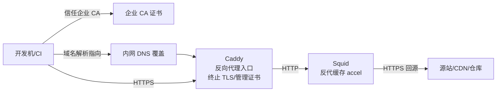
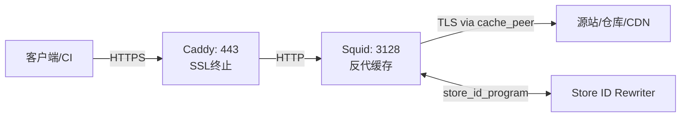
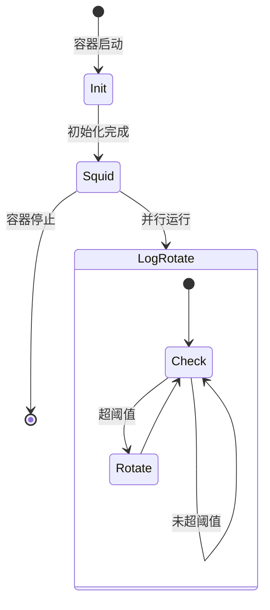

## 背景

近期，公司代理侧的流量负担持续上升；在高峰期访问常见开发资源（包管理器、SDK、依赖镜像、CDN 文件等）会出现明显抖动。为降低重复下载带来的外网带宽开销与峰值波动，决定在内网引入一套“通用下载缓存代理”。

为了让使用侧尽量接近“零配置”，整体链路采用“内网 DNS 指向 + HTTPS 入口统一管理 + 缓存层只处理 HTTP + 回源保持 TLS”的组合方式：



下文按“共性问题 -> 原因 -> 配置落地”的方式，复盘这套方案的结构设计与关键取舍，并总结实践中遇到的典型问题与对应的解决策略。

## 0. 目标与约束

- **目标**：在局域网/机房内为开发与 CI 提供可复用的下载缓存，减少重复拉取与外网带宽消耗。
- **约束**：不做 MITM；客户端依旧以 HTTPS 访问入口；后端缓存尽量只处理“可判定稳定”的内容。

## 1. 结构设计

### 1.1 数据流设计（HTTPS 入口 + HTTP 缓存 + TLS 回源）

核心思路是把“HTTPS 解密”与“缓存”拆开：

- **Caddy** 负责对客户端提供 HTTPS，并将请求转发给 Squid。
- **Squid** 以反向代理（`accel`）方式工作，只处理来自 Caddy 的 HTTP，并通过 `cache_peer` 用 TLS 回源。



### 1.2 配置与代码分层（可扩展、可审计、默认安全）

这套方案把“共性能力”与“域名/业务规则”拆成三层：

- **主配置**（`etc/squid.conf`）：端口模式、ACL 基线、缓存参数、日志、以及 `include conf.d`。
- **域名模块**（`etc/conf.d/*.conf`）：每个“域名集合”的 ACL、`cache_peer`、`never_direct`、`refresh_pattern`、`store_id_access`。
- **URL 重写规则**（`script/store_id_rewriter.py` + `script/domains/*`）：把可安全缓存的 URL 规整成稳定的 Store ID。

一个重要的“安全阀”是：`conf.d` 的最后通常放一个默认拒绝（例如 `store_id_access deny all`），确保新增域名不会因为漏配而误重写。

### 1.3 目录结构（为什么要“模块化”）

与其把所有规则塞进一个超长的 `squid.conf`，这套配置选择了“主配置 + 模块目录 + 脚本规则”的组合。这样做的直接收益是：新增/下线某类资源时，只需要增删一个模块文件，变更边界清晰。

```text
squid/
├── squid.Dockerfile          # 容器镜像（安装 squid + supervisor）
├── supervisor/               # 容器内进程编排：初始化 + 主进程 + 日志轮转
├── etc/
│   ├── squid.conf            # 基线配置（端口/ACL/缓存参数/日志/include）
│   └── conf.d/               # 规则模块（按域名集合拆分）
│       ├── 00-unreal-engine.conf   # Unreal Engine CDN
│       ├── 10-github.conf          # GitHub 资产
│       ├── 20-cdn.conf             # 主流 CDN (jsDelivr, cdnjs, etc.)
│       ├── 30-microsoft.conf       # 微软下载 (VS, VS Code, Windows Update)
│       ├── 35-unity.conf           # Unity 下载
│       ├── 40-golang.conf          # Golang 模块代理
│       ├── 45-maven.conf           # Maven/Gradle 仓库
│       ├── 50-python.conf          # Python/PyPi仓库
│       ├── 55-nodejs.conf          # NodeJs/yarn仓库
│       └── 99-deny-store-id.conf   # 默认拒绝 store_id
└── script/
    ├── store_id_rewriter.py  # Store ID 重写入口
    └── domains/              # 域名/版本匹配规则（正则聚合）
        ├── __init__.py
        ├── github.py
        ├── cdn.py
        ├── microsoft.py
        ├── unity.py
        ├── unreal_engine.py
        ├── golang.py
        ├── maven.py
        ├── python.py
        └── nodejs.py
```

## 2. 共性问题与解决方案（以及配置如何落地）

### 2.1 问题：HTTPS 资源不好缓存

**原因**：正向代理想缓存 HTTPS 往往需要解密流量；而不做 MITM 就拿不到明文。

**解决**：把 HTTPS 放在入口终止，缓存层只处理 HTTP；回源仍然保持 TLS。

配置体现（概念示例，避免逐行照抄）：

- Squid 以 `http_port ... accel vhost` 作为反代入口。
- 对每个域名定义 `cache_peer <domain> parent 443 ... originserver tls tls-default-ca=on`。
- 用 `never_direct allow <acl>` 强制必须通过 peer 回源，避免“直连绕过策略”。

这使得缓存层既不需要 MITM，又能对 HTTPS 资源进行“可控缓存”。

补充一个很容易忽略的坑：**DNS 回环/污染**。如果代理节点的 DNS 把某些源站解析回了内网入口，可能导致请求在 Caddy/Squid 之间打转。

因此主配置会显式指定公共 DNS 服务器，目的是让回源解析更可预测、避免“自己代理自己”。

### 2.2 问题：URL 动态参数导致缓存永远 MISS

**现象**：下载链路经常带签名/追踪参数（典型是云存储签名链接）。同一个文件内容，每次 URL 不同，缓存键不同，自然命中率很低。

**根因**：缓存键通常包含完整 URL（含 query），而 query 往往不影响内容，甚至是纯鉴权参数。

**解决**：启用 `store_id_program`，用脚本生成“内容等价”的 Store ID。

这套脚本的策略可以抽象成三段式（比“对某域名就删参数”更安全）：

1. **明确排除**：先用排除规则拦截“不应该被规整”的 URL（例如快照/临时版本）。
2. **安全剥离**：对“内容由 path 唯一确定”的 URL，剥离 query/fragment。
3. **条件剥离**：对 CDN 等场景，仅在 path 中出现“明确版本号”时才剥离；否则保持原 URL，让缓存短周期自更新。

这样做的核心收益是：提高命中率的同时，尽量避免把“会变的东西”缓存成“不会变”。

**快速自测（不依赖运行 Squid）**：

```bash
# 期望：剥离签名参数 -> OK store-id=...
echo "https://release-assets.githubusercontent.com/xxx?X-Amz-Algorithm=AWS4" | python3 /opt/squid/script/store_id_rewriter.py

# 期望：带版本号 -> OK
echo "https://cdn.jsdelivr.net/npm/vue@3.2.0/dist/vue.js" | python3 /opt/squid/script/store_id_rewriter.py

# 期望：@latest -> ERR（不重写）
echo "https://cdn.jsdelivr.net/npm/vue@latest/dist/vue.js" | python3 /opt/squid/script/store_id_rewriter.py
```

### 2.3 问题：同域名混合“下载内容”和“API/元数据”

**现象**：同一个生态会同时存在：

- **大文件/版本化产物**：适合长缓存（例如带版本号的包、安装包、归档）。
- **API/元数据**：参数影响内容且频繁变化，通常只适合短缓存或不缓存。

**解决**：用 ACL 做“语义分流”，然后分别配置缓存与重写策略。

典型落地方式：

- `acl xxx_downloads dstdomain ...` 或按 path 规则命中“可缓存下载”。
- `acl xxx_api dstdomain ...` 或按 path 命中“元数据/API”。
- `store_id_access allow xxx_downloads`，而对 `xxx_api` 明确不做重写。
- `refresh_pattern` 给两类流量不同 TTL：下载长、元数据短。

这比“对整个域名一刀切”更稳：既能提升命中率，又不容易引入“更新不及时”的副作用。

### 2.4 问题：源站 Cache-Control 过于保守，导致代理不敢缓存

**原因**：不少分发站点会返回 `no-store`/`private`/`must-revalidate` 等头，目的是让客户端尽量拿到最新内容，但对“版本化大文件”来说会严重浪费带宽。

**解决**：在 `refresh_pattern` 上使用“有限度的强制策略”，并把范围控制在“可判定稳定”的下载内容上。

一个典型模式是：

```conf
# 仅作为模式演示：对“下载类”放宽缓存指令
refresh_pattern -i download\.example\.com 10080 100% 43200 \
  override-expire ignore-reload ignore-no-store ignore-private ignore-must-revalidate \
  ignore-no-cache store-stale
```

同时，主配置里常会配合“过期窗口”来优化体验：允许在一定时间内直接命中过期缓存、后台再验证，减少用户等待与回源抖动。

### 2.5 问题：大文件与并发下载放大回源压力

**现象**：CI/多客户端并发拉取同一资源时，容易出现“回源风暴”（多个 MISS 同时打到源站）。

**解决**：

- 开启请求合并/折叠转发（`collapsed_forwarding on`），让同一资源的并发 MISS 尽量合并成一次回源。
- 放开 Range 下载的限制（例如 `range_offset_limit none`），让断点续传与分段下载更友好。
- 调整对象大小与缓存目录（例如 `maximum_object_size 5 GB`），确保大文件不会因为上限太小而永远不入缓存。

### 2.6 问题：上游识别“你是代理”导致风控/限速

**原因**：某些源站会根据 `Via`、`X-Forwarded-For` 等头判断代理行为。

**解决**：在反代缓存场景下，尽量减少额外头部暴露：关闭 `via`，删除/禁止部分转发头。

这属于“可用性增强”，但仍建议只在受控环境中使用，并配合 ACL 限制访问来源。

### 2.7 问题：容器里既要初始化又要长期运行，还要做日志轮转

**原因**：

- Squid 首次启动前需要 `squid -z` 初始化缓存目录结构。
- 容器里通常没有 cron/systemd，日志轮转如果不做，很容易把磁盘写爆。

**解决**：使用 Supervisor 作为容器内的“最小进程编排器”：

- 一个一次性初始化进程（检测 `swap.state`，不存在才初始化）。
- 一个前台主进程（Squid foreground，便于容器托管）。
- 一个常驻轮转进程（按大小定时触发 `squid -k rotate`）。

在实现上通常还会配合 Squid 自身的 `logfile_rotate`（例如保留 5 份），避免轮转文件无限增长。



### 2.8 问题：同域名里的“配置/元数据”端点触发频繁刷新（TCP_REFRESH_UNMODIFIED）

**现象**：访问日志中出现类似下面的记录：

```text
TCP_REFRESH_UNMODIFIED/200 ... GET http://public-cdn.cloud.unity3d.com/config/production
```

**解读**：客户端看到的响应仍是 200，但 Squid 的状态 `TCP_REFRESH_UNMODIFIED` 表示“对象已过期并触发再验证（revalidate），确认上游内容未变化后继续返回本地缓存”。

**原因**（共性规律，不限定 Unity）：

- `/config/*`、`/metadata/*` 这类端点通常属于“配置/元数据分发”，**内容可能经常变**，但又希望客户端能快速确认“有没有更新”。
- Squid 发现缓存对象过期后，会对上游做 revalidate（例如带 `If-Modified-Since`/`If-None-Match`）。如果上游判断内容没变，Squid 会标记为 *Refresh Unmodified*：
  - 表示“已向上游确认未变化，因此继续使用本地缓存响应”。
- 这并不是错误，但如果对整个域名统一配置“长 TTL + 强制缓存”，就会出现：**配置端点被当成下载资源一样对待**，导致频繁 revalidate 噪音、以及不必要的上游访问。

**影响**：该类端点的“短周期再验证”会表现为日志噪音与额外的上游请求；如果与“长 TTL / 强制缓存 / Store ID 规整”混用，还可能放大不必要的验证流量。

**解决方案**（与本仓库配置一致）：通过“允许短窗口内返回过期缓存 + 后台再验证更新”的方式，把 revalidate 的等待成本从客户端路径上移除。

落地通常分两层：

- **全局窗口**：在主配置启用 `refresh_stale_hit`，允许在指定时间窗口内直接返回过期对象，同时触发异步验证。
- **规则级行为**：在需要的 `refresh_pattern` 上启用 `store-stale`，明确该类对象在验证时“先用旧的、后台刷新”。

配置对应关系：

```conf
# etc/squid.conf
# 允许返回过期缓存的时间窗口 (秒)
refresh_stale_hit 86400 seconds
```

```conf
# etc/conf.d/35-unity.conf
# store-stale: 验证时先返回过期缓存，后台更新
refresh_pattern -i public-cdn\.cloud\.unity3d\.com 10080 100% 43200 \
    override-expire ignore-reload ignore-no-store ignore-private ignore-must-revalidate ignore-no-cache store-stale
```

这样处理后，日志中依然可能出现 `TCP_REFRESH_UNMODIFIED`（因为 Squid 仍在做验证以保持一致性），但对客户端而言更接近“stale-while-revalidate”：优先拿到可用结果，同时缓存会在后台被更新。

**可选优化**：如果确实确认某些 path（如 `/config/`）属于高频变更元数据，且不希望其继承“下载域名”的长缓存策略，再单独做 path 分流、缩短 TTL，并避免纳入 Store ID 规整会更稳。

### 2.9 问题：系统 CA 正常，但 Yarn/Node 仍报证书不受信任

**现象**：浏览器访问 HTTPS 正常，系统也安装了 CA 证书，但 `yarn install` 仍然报错（证书链不受信任）。

**原因**：

- Yarn 的 TLS 走的是 Node.js 的 TLS 栈。
- Node 在不同平台/发行方式下，**不一定读取系统证书库**（很多情况下更依赖 Node 自带 CA bundle）。因此“系统信任”不等于“Node 信任”。

**解决方案**：显式把额外 CA 证书注入 Node 的信任链。

推荐做法是设置环境变量 `NODE_EXTRA_CA_CERTS` 指向你的自定义 CA PEM 文件（例如公司/自建代理的根证书）：

```bash
# Linux/macOS
export NODE_EXTRA_CA_CERTS=/etc/ssl/certs/my-proxy-ca.pem

# Windows PowerShell（示例）
$env:NODE_EXTRA_CA_CERTS = "C:\\path\\to\\my-proxy-ca.pem"

yarn install
```

把它归为“共性问题”的原因是：只要遇到“工具 A（浏览器）没问题、工具 B（语言包管理器/CLI）报证书问题”，优先怀疑它使用了不同的信任源；对 Node 生态，`NODE_EXTRA_CA_CERTS` 往往是最直接、侵入性最小的修复手段。

### 2.10 问题：NuGet 元数据请求出现大量 TCP_MISS_ABORTED

**现象**：访问日志中出现大量类似记录，集中在 `api.nuget.org` 的 registration 索引（JSON 元数据）请求：

```text
TCP_MISS_ABORTED/000 0 GET http://api.nuget.org/v3/registration5-gz-semver2/.../index.json - HIER_NONE/- -
TCP_MISS_ABORTED/000 0 GET http://api.nuget.org/v3/registration5-gz-semver2/.../index.json - FIRSTUP_PARENT/<ip> -
TCP_MISS/200 ... GET http://api.nuget.org/v3/registration5-gz-semver2/.../index.json - FIRSTUP_PARENT/<ip> application/json
```

其中：

- `TCP_MISS_ABORTED/000 0` 常见于“本地无缓存，需要回源，但在 Squid 产生任何响应之前，请求就被中止”，因此状态码显示为 `000`、响应字节为 `0`。
- `FIRSTUP_PARENT/<ip>` 表示已按规则选择并尝试从上游 peer 回源；`HIER_NONE` 则常见于回源链路尚未建立完成就已终止，或终止发生在路由/建连之前。

**原因**：

- **元数据请求并发高**：NuGet v3 的 registration 索引属于“依赖解析元数据”。在 SDK/workload/依赖树解析阶段，会出现短时间内大量并发请求。
- **下游主动取消**：上层工具可能在拿到足够元数据后取消剩余并发请求，或因为自身超时策略提前终止连接。在“入口（Caddy）-> 缓存（Squid）”链路中，这会表现为 Squid 侧的 `TCP_MISS_ABORTED/000 0`。

**影响**：

- `TCP_MISS_ABORTED/000` 会显著增加日志噪音，掩盖少量真正需要关注的 5xx/timeout。
- 若 aborted 发生在回源已发起之后，会造成一定“无效回源”开销（请求被取消但回源已开始），在高峰期可能放大上游压力。

**建议**：

- **把 aborted 当成信号，而不是结论**：优先用 `.../502`、`timeout`、`DNS` 等“失败类事件”定位真实问题；对 `.../000 0` 更倾向于从下游取消/超时入手。
- **减少等待型抖动**：对“已有缓存但需要验证”的对象，结合全局 `refresh_stale_hit` 可把 revalidate 的等待从客户端链路上移除；对首次 MISS 则重点关注上游链路与入口超时策略。
- **在受控范围内做短缓存**：对 `api.nuget.org` 这类元数据端点，短 TTL 往往比强制长缓存更稳；更长的缓存策略建议只用于 `globalcdn.nuget.org` 这类版本化包文件（`.nupkg`）。

### 2.11 问题：cache.log 出现 Vary object loop（Accept-Encoding 变体循环）

**现象**：`cache.log` 里出现类似日志，并且集中在某些元数据/配置类端点：

```text
varyEvaluateMatch: Oops. Not a Vary match on second attempt, 'http://public-cdn.cloud.unity3d.com/config/production' 'accept-encoding="gzip, deflate, br, zstd"'
clientProcessHit: Vary object loop!
```

**原因**：

- 上游响应带有 `Vary: Accept-Encoding`（或等价的变体控制），表示“响应内容会随请求头 `Accept-Encoding` 的不同而不同”。
- Squid 会为同一 URL 维护多个变体对象（gzip/br/zstd 等不同压缩方式）。当入口侧转发的 `Accept-Encoding` 在短时间内出现多种取值（或 Squid 在内部归一化/重试时看到不同取值），就可能出现“尝试命中某个变体 -> 发现不匹配 -> 再尝试 -> 仍不匹配”的循环告警。
- 该问题通常发生在“对象已在缓存中（HIT 路径）且存在多变体”的场景，因此会在 `clientProcessHit` 阶段看到 `Vary object loop`。

**影响**：

- 告警本身会刷屏并增加排障噪音。
- 命中路径可能退化为重新回源/重新选择变体，带来额外延迟与回源压力；在极端情况下会放大上游连接数。

**建议**（按侵入性从低到高）：

- **优先在入口侧收敛上游变体，同时对客户端启用 zstd**：仅对触发 `Vary object loop` 的问题域名，在 Caddy 到 Squid 的反代链路上固定上游 `Accept-Encoding`，让 Squid 看到“稳定且单一”的变体。

  推荐做法是对该域名按路径分流：

  - 对 `/config*` 这类配置/元数据端点固定 `Accept-Encoding: gzip`（通常是小文本/JSON，回源更省带宽且兼容性更好）。
  - 对其他路径固定 `Accept-Encoding: identity`，让 Squid 缓存单一“未压缩”对象，同时由 Caddy 面向客户端开启 `encode zstd gzip` 做压缩协商。

配置示例（对应本仓库的 [setup-router/squid/etc/Caddyfile.example](setup-router/squid/etc/Caddyfile.example) 思路）：

```caddy
(squid_proxy_unity_public_cdn) {
  encode zstd gzip

  @unity_public_cdn_config path /config*
  handle @unity_public_cdn_config {
    reverse_proxy squid:3128 {
      header_up Host {host}
      header_up Accept-Encoding "gzip"
    }
  }

  handle {
    reverse_proxy squid:3128 {
      header_up Host {host}
      header_up Accept-Encoding "identity"
    }
  }
}

public-cdn.cloud.unity3d.com {
  import squid_proxy_unity_public_cdn
}
```

- **在 Squid 侧收敛变体**：若不方便改入口，可在 Squid 上对特定域名/路径剥离或固定 `Accept-Encoding`，避免产生多变体缓存对象。
- **对配置/元数据端点禁缓存**：若该端点本就不期望被缓存（或短缓存收益很小），可以对其 `cache deny`，直接规避变体缓存与相关告警。

## 3. 使用方式

我们的实施配置开源并放在了 <https://github.com/owent/docker-setup/tree/main/setup-router/squid> 。
有兴趣的小伙伴可以自取。

### 3.1 容器方式（Podman/Docker）

容器方式的关键是把“配置/脚本”以只读挂载，把“缓存/日志”以可写挂载：

```bash
podman build -f squid.Dockerfile -t squid-cache .

# 注意这里只挂载squid.conf文件和conf.d目录，因为 /etc/squid 下有其他文件，不能掩盖，否则会启动失败。
podman run -d \
  --name squid \
  -p 3128:3128 \
  -v /path/to/squid/etc/squid.conf:/etc/squid/squid.conf:ro \
  -v /path/to/squid/etc/conf.d:/etc/squid/conf.d:ro \
  -v /path/to/squid/script:/opt/squid/script:ro \
  -v /path/to/squid/cache:/var/spool/squid \
  -v /path/to/squid/logs:/var/log/squid \
  squid-cache
```

### 3.2 手动安装方式（不使用容器）

手动安装的核心流程是：放置配置与脚本、初始化缓存目录、验证配置、再启动/重载。

```bash
cp -r etc/squid.conf /etc/squid/
cp -r etc/conf.d /etc/squid/

mkdir -p /opt/squid/script
cp -r script/* /opt/squid/script/
chmod +x /opt/squid/script/store_id_rewriter.py

mkdir -p /var/spool/squid
chown squid:squid /var/spool/squid

squid -z
squid -k parse
squid -k reconfigure
```

### 3.3 验证与观测（命中率与空间）

我们可以把“能不能用”和“有没有命中”分开验证：

- **重写逻辑**：用 `echo URL | python3 store_id_rewriter.py` 快速确认 OK/ERR 是否符合预期。
- **命中情况**：从 `access.log` 观察 HIT/MISS/REVALIDATE。
- **空间占用**：看 `/var/spool/squid` 的大小与 `swap.state` 是否生成。

```bash
tail -f /var/log/squid/access.log | grep -E "HIT|MISS|REVALIDATE"
du -sh /var/spool/squid/
ls -la /var/spool/squid/swap.state
```

如果需要查看缓存目录信息，可查询 Squid 内建管理接口：

```bash
curl -s "http://127.0.0.1:3128/squid-internal-mgr/storedir"
```

日志轮转可以人工触发（用于验证 supervisor/配置是否生效）：

```bash
podman exec squid squid -k rotate
```

## 4. 如何扩展：新增一个“下载域名 + API 域名”的模块

新增支持的通用步骤是：

1. 在 `etc/conf.d/` 新增一个模块文件：
    - 定义下载与 API 的 ACL。
    - 为每个域名配置 `cache_peer` 与 `cache_peer_access`。
    - 用 `store_id_access` 只允许下载流量进入重写。
    - 用 `refresh_pattern` 给下载与 API 不同的缓存周期。
2. 如需 Store ID 重写：在 `script/domains/` 添加正则规则，并在 `__init__.py` 聚合导出。

这样扩展的好处是：规则可审计、可回滚，且默认不会误把未知域名纳入重写。

## 5. 风险和边界

- **误剥离参数的风险**：最危险的不是“命中率低”，而是“命中到错误内容”。因此策略里必须有排除与条件剥离。
- **强制缓存头的风险**：只建议用于版本化/可判定稳定的下载内容；对 API/元数据保持短缓存或不缓存。
- **入口/访问控制**：这套配置假设在受控网络内使用，仍应依赖 ACL 对来源网段做限制。

## 最后

欢迎有兴趣的小伙伴们互相交流。
