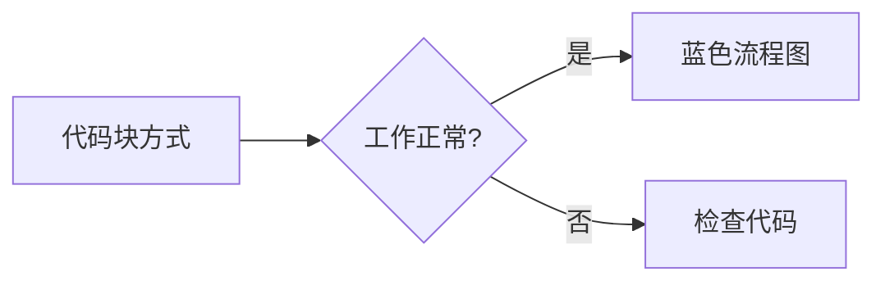

## 背景

在很久以前，我给我的Blog的主题加了 [Hugo][hugo] 的针对 [Mermaid][mermaid] 和 [Chart.js][chartjs] shortcodes 的支持。但是之支持迁入代码的方式。
如果文档很复杂，在Markdown里写大段的代码体验观感也不是很好。
而现在很多Markdown生态里是支持通过代码块的方式嵌入的。
同时现在很多插件可以直接按文件后缀编辑文件，然后直接指向文件的形式引用进来，这样可维护性会好很多。

我之前也懒得一个一个组件去研究和何种模式的测试搭配，现在AI很强了，刚好可以让它帮我把这个优化干了。
并且可以让这些插件都支持各种引入方式，确实是省事儿不少。

实测下来写代码还是Claude强，Google Gemini 3 Pro/Flash 也好，GPT 5.2/5.1-Codex-Max也好都会不同层度的瞎写。
Google Gemini 3 Pro写代码感觉比GPT 5.2强一点。但是通用总结，比如让它给我改Markdown的lingt错误Google Gemini 3 Pro比GPT 5.2差很多。

以下就是花了差不多2个小时，使用的Claude Opus 4.5模型，一口气消耗了Github copilot 75个高级Request（Copilot Pro+订阅的5%）。
最后完成了对 [Mermaid][mermaid]、[Chart.js][chartjs]、[Excalidraw][excalidraw]、[draw.io/diagrams.net][diagramsnet] 的统一支持各种引用模式的支持。

## AI自动生成的测试用例

This page demonstrates all supported methods for rendering diagrams and charts:

- **[Draw.io/diagrams.net][diagramsnet]** - `.drawio` files
- **[Mermaid][mermaid]** - `.mermaid` files
- **[Excalidraw][excalidraw]** - `.excalidraw` files  
- **[Chart.js][chartjs]** - `.chart.json` files

Each format supports 4 usage methods:
1. Image syntax: ``
2. Code block: ` ```language `
3. Shortcode with src: ``
4. Shortcode inline: `content`

---

## 1. [Draw.io/diagrams.net][diagramsnet] 测试

### 1.1 图片语法引用 .drawio 文件

下面是通过图片语法引用的 [draw.io/diagrams.net][diagramsnet] 图表：


### 1.2 代码块方式（内嵌XML）

```drawio
<mxfile host="app.diagrams.net">
  <diagram name="Page-1" id="codeblock-test">
    <mxGraphModel dx="800" dy="400" grid="1" gridSize="10" guides="1" tooltips="1" connect="1" arrows="1" fold="1" page="1" pageScale="1" pageWidth="827" pageHeight="1169">
      <root>
        <mxCell id="0" />
        <mxCell id="1" parent="0" />
        <mxCell id="2" value="代码块方式" style="rounded=1;whiteSpace=wrap;html=1;fillColor=#dae8fc;strokeColor=#6c8ebf;fontSize=14;fontStyle=1" vertex="1" parent="1">
          <mxGeometry x="40" y="40" width="120" height="50" as="geometry" />
        </mxCell>
      </root>
    </mxGraphModel>
  </diagram>
</mxfile>
```

### 1.3 Shortcode 引用外部文件



### 1.4 Shortcode 内联方式


<mxfile host="app.diagrams.net">
  <diagram name="Page-1" id="shortcode-inline-test">
    <mxGraphModel dx="800" dy="400" grid="1" gridSize="10" guides="1" tooltips="1" connect="1" arrows="1" fold="1" page="1" pageScale="1" pageWidth="827" pageHeight="1169">
      <root>
        <mxCell id="0" />
        <mxCell id="1" parent="0" />
        <mxCell id="2" value="Shortcode 内联" style="rounded=1;whiteSpace=wrap;html=1;fillColor=#d5e8d4;strokeColor=#82b366;fontSize=14;fontStyle=1" vertex="1" parent="1">
          <mxGeometry x="40" y="40" width="120" height="50" as="geometry" />
        </mxCell>
      </root>
    </mxGraphModel>
  </diagram>
</mxfile>


---

## 2. [Mermaid][mermaid] 图片语法测试

### 2.1 图片语法引用 .mermaid 文件

下面是通过图片语法引用的 [Mermaid][mermaid] 图表：


### 2.2 代码块方式



### 2.3 Shortcode 引用外部文件



### 2.4 Shortcode 内联方式


graph TD
    A[Shortcode 内联] --> B[Mermaid 图表]
    B --> C{正常显示?}
    C -->|是| D[成功]
    C -->|否| E[检查]


---

## 3. [Excalidraw][excalidraw] 图片语法测试

### 3.1 图片语法引用 .excalidraw 文件

下面是通过图片语法引用的 [Excalidraw][excalidraw] 图表：


### 3.2 Shortcode 引用外部文件



### 3.3 Shortcode 内联方式


{
  "type": "excalidraw",
  "version": 2,
  "source": "https://excalidraw.com",
  "elements": [
    {
      "id": "shortcode-inline-rect",
      "type": "rectangle",
      "x": 100,
      "y": 100,
      "width": 180,
      "height": 80,
      "angle": 0,
      "strokeColor": "#2f9e44",
      "backgroundColor": "#b2f2bb",
      "fillStyle": "solid",
      "strokeWidth": 2,
      "roughness": 1,
      "opacity": 100,
      "seed": 11111,
      "version": 1,
      "versionNonce": 1
    },
    {
      "id": "shortcode-inline-text",
      "type": "text",
      "x": 115,
      "y": 125,
      "width": 150,
      "height": 30,
      "angle": 0,
      "strokeColor": "#1e1e1e",
      "backgroundColor": "transparent",
      "fillStyle": "solid",
      "strokeWidth": 1,
      "roughness": 1,
      "opacity": 100,
      "seed": 22222,
      "version": 1,
      "versionNonce": 1,
      "text": "Shortcode 内联",
      "fontSize": 18,
      "fontFamily": 1,
      "textAlign": "center",
      "verticalAlign": "middle"
    }
  ],
  "appState": {
    "viewBackgroundColor": "#ffffff"
  }
}


### 3.4 代码块方式

```excalidraw
{
  "type": "excalidraw",
  "version": 2,
  "source": "https://excalidraw.com",
  "elements": [
    {
      "id": "codeblock-rect",
      "type": "rectangle",
      "x": 100,
      "y": 100,
      "width": 200,
      "height": 100,
      "angle": 0,
      "strokeColor": "#1971c2",
      "backgroundColor": "#a5d8ff",
      "fillStyle": "solid",
      "strokeWidth": 2,
      "roughness": 1,
      "opacity": 100,
      "seed": 54321,
      "version": 1,
      "versionNonce": 1
    },
    {
      "id": "codeblock-text",
      "type": "text",
      "x": 130,
      "y": 135,
      "width": 140,
      "height": 30,
      "angle": 0,
      "strokeColor": "#1e1e1e",
      "backgroundColor": "transparent",
      "fillStyle": "solid",
      "strokeWidth": 1,
      "roughness": 1,
      "opacity": 100,
      "seed": 65432,
      "version": 1,
      "versionNonce": 1,
      "text": "代码块方式",
      "fontSize": 20,
      "fontFamily": 1,
      "textAlign": "center",
      "verticalAlign": "middle"
    }
  ],
  "appState": {
    "viewBackgroundColor": "#ffffff"
  }
}
```

---

## 4. [Chart.js][chartjs] 测试

### 4.1 图片语法引用 .chart.json 文件

下面是通过图片语法引用的 [Chart.js][chartjs] 图表：


### 4.2 Shortcode 引用外部文件



### 4.3 Shortcode 内联方式


{
  "type": "doughnut",
  "data": {
    "labels": ["Red", "Blue", "Yellow"],
    "datasets": [{
      "data": [300, 50, 100],
      "backgroundColor": ["#FF6384", "#36A2EB", "#FFCE56"]
    }]
  },
  "options": {
    "responsive": true,
    "plugins": {
      "title": {
        "display": true,
        "text": "Shortcode 内联图表"
      }
    }
  }
}


### 4.4 代码块方式

```chart
{
  "type": "line",
  "data": {
    "labels": ["周一", "周二", "周三", "周四", "周五"],
    "datasets": [{
      "label": "访问量",
      "data": [65, 59, 80, 81, 56],
      "fill": false,
      "borderColor": "rgb(75, 192, 192)",
      "tension": 0.1
    }]
  },
  "options": {
    "responsive": true,
    "plugins": {
      "title": {
        "display": true,
        "text": "代码块方式图表 (chart)"
      }
    }
  }
}
```

### 4.5 代码块方式 (chartjs 语法)

```chartjs
{
  "type": "pie",
  "data": {
    "labels": ["Chrome", "Firefox", "Safari", "Edge"],
    "datasets": [{
      "data": [60, 20, 10, 10],
      "backgroundColor": ["#4285F4", "#FF7139", "#00D084", "#0078D7"]
    }]
  },
  "options": {
    "responsive": true,
    "plugins": {
      "title": {
        "display": true,
        "text": "代码块方式图表 (chartjs)"
      }
    }
  }
}
```

---

## 5. 测试结果

| 类型 | 图片语法 | 代码块方式 | Shortcode (内联) | Shortcode (src) |
|------|---------|-----------|-----------------|-----------------|
| [Draw.io/diagrams.net][diagramsnet] | ✓ `.drawio` | ✓ `drawio` | ✓ | ✓ |
| [Mermaid][mermaid] | ✓ `.mermaid` | ✓ `mermaid` | ✓ | ✓ |
| [Excalidraw][excalidraw] | ✓ `.excalidraw` | ✓ `excalidraw` | ✓ | ✓ |
| [Chart.js][chartjs] | ✓ `.chart.json` | ✓ `chart` / `chartjs` | ✓ | ✓ |

如果所有图表都能正常显示，说明功能正常工作！

[hugo]: https://gohugo.io/
[mermaid]: https://mermaid.js.org/
[chartjs]: https://www.chartjs.org/
[excalidraw]: https://github.com/excalidraw/excalidraw
[diagramsnet]: https://www.diagrams.net/
