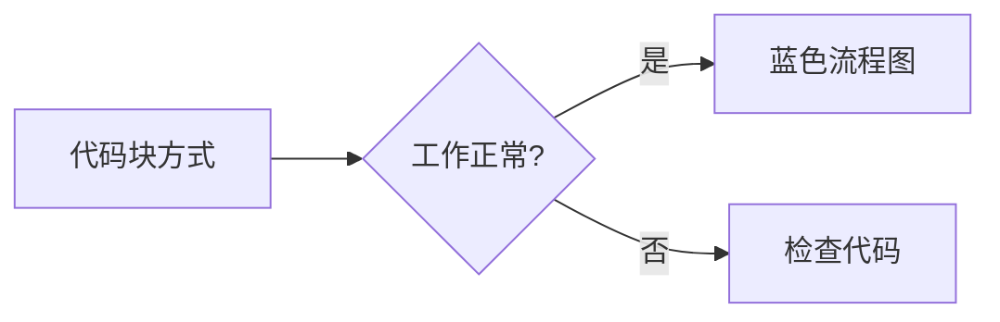
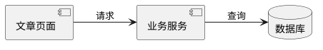

## 背景

在很久以前，我给我的Blog的主题加了 [Hugo][hugo] 的针对 [Mermaid][mermaid] 和 [Chart.js][chartjs] shortcodes 的支持。但是之支持迁入代码的方式。
如果文档很复杂，在Markdown里写大段的代码体验观感也不是很好。
而现在很多Markdown生态里是支持通过代码块的方式嵌入的。
同时现在很多插件可以直接按文件后缀编辑文件，然后直接指向文件的形式引用进来，这样可维护性会好很多。

我之前也懒得一个一个组件去研究和何种模式的测试搭配，现在AI很强了，刚好可以让它帮我把这个优化干了。
并且可以让这些插件都支持各种引入方式，确实是省事儿不少。

实测下来写代码还是Claude强，Google Gemini 3 Pro/Flash 也好，GPT 5.2/5.1-Codex-Max也好都会不同层度的瞎写。
Google Gemini 3 Pro写代码感觉比GPT 5.2强一点。但是通用总结，比如让它给我改Markdown的lingt错误Google Gemini 3 Pro比GPT 5.2差很多。

以下就是花了差不多2个小时，使用的Claude Opus 4.5模型，一口气消耗了Github copilot 75个高级Request（Copilot Pro+订阅的5%）。
最后完成了对 [Mermaid][mermaid]、[Chart.js][chartjs]、[Excalidraw][excalidraw]、[draw.io/diagrams.net][diagramsnet] 的统一支持各种引用模式的支持。

## AI自动生成的测试用例

This page demonstrates all supported methods for rendering diagrams and charts:

- **[Draw.io/diagrams.net][diagramsnet]** - `.drawio` files
- **[Mermaid][mermaid]** - `.mermaid` files
- **[Excalidraw][excalidraw]** - `.excalidraw` files  
- **[Chart.js][chartjs]** - `.chart.json` files
- **[ECharts][echarts]** - `.echarts.json` files
- **[Plotly.js][plotly]** - `.plotly.json` files
- **[D2][d2]** - `.d2` files, rendered to inline SVG at build time
- **[PlantUML][plantuml]** - `.puml` / `.plantuml` files, rendered to inline SVG at build time

Each format supports 4 usage methods:

1. Image syntax: ``
2. Code block: ` ```language `
3. Shortcode with src: ``
4. Shortcode inline: `content`

---

## 1. [Draw.io/diagrams.net][diagramsnet] 测试

### 1.1 图片语法引用 .drawio 文件

下面是通过图片语法引用的 [draw.io/diagrams.net][diagramsnet] 图表：


### 1.2 代码块方式（内嵌XML）

```drawio
<mxfile host="app.diagrams.net">
  <diagram name="Page-1" id="codeblock-test">
    <mxGraphModel dx="800" dy="400" grid="1" gridSize="10" guides="1" tooltips="1" connect="1" arrows="1" fold="1" page="1" pageScale="1" pageWidth="827" pageHeight="1169">
      <root>
        <mxCell id="0" />
        <mxCell id="1" parent="0" />
        <mxCell id="2" value="代码块方式" style="rounded=1;whiteSpace=wrap;html=1;fillColor=#dae8fc;strokeColor=#6c8ebf;fontSize=14;fontStyle=1" vertex="1" parent="1">
          <mxGeometry x="40" y="40" width="120" height="50" as="geometry" />
        </mxCell>
      </root>
    </mxGraphModel>
  </diagram>
</mxfile>
```

### 1.3 Shortcode 引用外部文件



### 1.4 Shortcode 内联方式


<mxfile host="app.diagrams.net">
  <diagram name="Page-1" id="shortcode-inline-test">
    <mxGraphModel dx="800" dy="400" grid="1" gridSize="10" guides="1" tooltips="1" connect="1" arrows="1" fold="1" page="1" pageScale="1" pageWidth="827" pageHeight="1169">
      <root>
        <mxCell id="0" />
        <mxCell id="1" parent="0" />
        <mxCell id="2" value="Shortcode 内联" style="rounded=1;whiteSpace=wrap;html=1;fillColor=#d5e8d4;strokeColor=#82b366;fontSize=14;fontStyle=1" vertex="1" parent="1">
          <mxGeometry x="40" y="40" width="120" height="50" as="geometry" />
        </mxCell>
      </root>
    </mxGraphModel>
  </diagram>
</mxfile>


---

## 2. [Mermaid][mermaid] 图片语法测试

### 2.1 图片语法引用 .mermaid 文件

下面是通过图片语法引用的 [Mermaid][mermaid] 图表：


### 2.2 代码块方式


```mermaid
graph LR
    A[代码块方式] --> B{工作正常?}
    B -->|是| C[蓝色流程图]
    B -->|否| D[检查代码]
```

### 2.3 Shortcode 引用外部文件



### 2.4 Shortcode 内联方式


graph TD
    A[Shortcode 内联] --> B[Mermaid 图表]
    B --> C{正常显示?}
    C -->|是| D[成功]
    C -->|否| E[检查]


---

## 3. [Excalidraw][excalidraw] 图片语法测试

### 3.1 图片语法引用 .excalidraw 文件

下面是通过图片语法引用的 [Excalidraw][excalidraw] 图表：


### 3.2 Shortcode 引用外部文件



### 3.3 Shortcode 内联方式


{
  "type": "excalidraw",
  "version": 2,
  "source": "https://excalidraw.com",
  "elements": [
    {
      "id": "shortcode-inline-rect",
      "type": "rectangle",
      "x": 100,
      "y": 100,
      "width": 180,
      "height": 80,
      "angle": 0,
      "strokeColor": "#2f9e44",
      "backgroundColor": "#b2f2bb",
      "fillStyle": "solid",
      "strokeWidth": 2,
      "roughness": 1,
      "opacity": 100,
      "seed": 11111,
      "version": 1,
      "versionNonce": 1
    },
    {
      "id": "shortcode-inline-text",
      "type": "text",
      "x": 115,
      "y": 125,
      "width": 150,
      "height": 30,
      "angle": 0,
      "strokeColor": "#1e1e1e",
      "backgroundColor": "transparent",
      "fillStyle": "solid",
      "strokeWidth": 1,
      "roughness": 1,
      "opacity": 100,
      "seed": 22222,
      "version": 1,
      "versionNonce": 1,
      "text": "Shortcode 内联",
      "fontSize": 18,
      "fontFamily": 1,
      "textAlign": "center",
      "verticalAlign": "middle"
    }
  ],
  "appState": {
    "viewBackgroundColor": "#ffffff"
  }
}


### 3.4 代码块方式

```excalidraw
{
  "type": "excalidraw",
  "version": 2,
  "source": "https://excalidraw.com",
  "elements": [
    {
      "id": "codeblock-rect",
      "type": "rectangle",
      "x": 100,
      "y": 100,
      "width": 200,
      "height": 100,
      "angle": 0,
      "strokeColor": "#1971c2",
      "backgroundColor": "#a5d8ff",
      "fillStyle": "solid",
      "strokeWidth": 2,
      "roughness": 1,
      "opacity": 100,
      "seed": 54321,
      "version": 1,
      "versionNonce": 1
    },
    {
      "id": "codeblock-text",
      "type": "text",
      "x": 130,
      "y": 135,
      "width": 140,
      "height": 30,
      "angle": 0,
      "strokeColor": "#1e1e1e",
      "backgroundColor": "transparent",
      "fillStyle": "solid",
      "strokeWidth": 1,
      "roughness": 1,
      "opacity": 100,
      "seed": 65432,
      "version": 1,
      "versionNonce": 1,
      "text": "代码块方式",
      "fontSize": 20,
      "fontFamily": 1,
      "textAlign": "center",
      "verticalAlign": "middle"
    }
  ],
  "appState": {
    "viewBackgroundColor": "#ffffff"
  }
}
```

---

## 4. [Chart.js][chartjs] 测试

### 4.1 图片语法引用 .chart.json 文件

下面是通过图片语法引用的 [Chart.js][chartjs] 图表：


### 4.2 Shortcode 引用外部文件



### 4.3 Shortcode 内联方式


{
  "type": "doughnut",
  "data": {
    "labels": ["Red", "Blue", "Yellow"],
    "datasets": [{
      "data": [300, 50, 100],
      "backgroundColor": ["#FF6384", "#36A2EB", "#FFCE56"]
    }]
  },
  "options": {
    "responsive": true,
    "plugins": {
      "title": {
        "display": true,
        "text": "Shortcode 内联图表"
      }
    }
  }
}


### 4.4 代码块方式

```chart
{
  "type": "line",
  "data": {
    "labels": ["周一", "周二", "周三", "周四", "周五"],
    "datasets": [{
      "label": "访问量",
      "data": [65, 59, 80, 81, 56],
      "fill": false,
      "borderColor": "rgb(75, 192, 192)",
      "tension": 0.1
    }]
  },
  "options": {
    "responsive": true,
    "plugins": {
      "title": {
        "display": true,
        "text": "代码块方式图表 (chart)"
      }
    }
  }
}
```

### 4.5 代码块方式 (chartjs 语法)

```chartjs
{
  "type": "pie",
  "data": {
    "labels": ["Chrome", "Firefox", "Safari", "Edge"],
    "datasets": [{
      "data": [60, 20, 10, 10],
      "backgroundColor": ["#4285F4", "#FF7139", "#00D084", "#0078D7"]
    }]
  },
  "options": {
    "responsive": true,
    "plugins": {
      "title": {
        "display": true,
        "text": "代码块方式图表 (chartjs)"
      }
    }
  }
}
```

---

## 5. [ECharts][echarts] 测试

[ECharts][echarts] 的扩展是增量式的：默认只加载核心包（含所有 2D 图表），需要 3D 时通过 `extensions="gl"` 追加 `echarts-gl`。下面分别用 2D 数学函数图 `y = sin(x)` 和 3D 曲面图 `z = sin(sqrt(x^2 + y^2))` 覆盖四种引入方式。

### 5.1 图片语法引用 .echarts.json（2D 数学函数）

最小包即可渲染：


### 5.2 代码块方式（2D 数学函数）

```echarts
{
  "title": { "text": "y = sin(x)", "left": "center" },
  "tooltip": { "trigger": "axis" },
  "xAxis": { "type": "value", "name": "x", "min": 0, "max": 6.283 },
  "yAxis": { "type": "value", "name": "y", "min": -1.1, "max": 1.1 },
  "series": [{ "type": "line", "showSymbol": false, "smooth": true, "data": [[0.000,0.000], [0.262,0.259], [0.524,0.500], [0.785,0.707], [1.047,0.866], [1.309,0.966], [1.571,1.000], [1.833,0.966], [2.094,0.866], [2.356,0.707], [2.618,0.500], [2.880,0.259], [3.142,0.000], [3.403,-0.259], [3.665,-0.500], [3.927,-0.707], [4.189,-0.866], [4.451,-0.966], [4.712,-1.000], [4.974,-0.966], [5.236,-0.866], [5.498,-0.707], [5.760,-0.500], [6.021,-0.259], [6.283,0.000]] }]
}
```

### 5.3 Shortcode 引用外部文件（3D 曲面，gl 扩展）

3D 曲面需要 `echarts-gl`，通过 `extensions="gl"` 声明：



### 5.4 Shortcode 内联方式（3D 曲面，gl 扩展）


{
  "title": { "text": "z = sin(sqrt(x^2 + y^2))", "left": "center" },
  "tooltip": {},
  "xAxis3D": { "type": "value" },
  "yAxis3D": { "type": "value" },
  "zAxis3D": { "type": "value" },
  "grid3D": { "viewControl": { "autoRotate": true } },
  "series": [{ "type": "surface", "wireframe": { "show": false }, "data": [[-3.0,-3.0,-0.892], [-3.0,-2.4,-0.644], [-3.0,-1.8,-0.349], [-3.0,-1.2,-0.089], [-3.0,-0.6,0.082], [-3.0,0.0,0.141], [-3.0,0.6,0.082], [-3.0,1.2,-0.089], [-3.0,1.8,-0.349], [-3.0,2.4,-0.644], [-3.0,3.0,-0.892], [-2.4,-3.0,-0.644], [-2.4,-2.4,-0.250], [-2.4,-1.8,0.141], [-2.4,-1.2,0.442], [-2.4,-0.6,0.619], [-2.4,0.0,0.675], [-2.4,0.6,0.619], [-2.4,1.2,0.442], [-2.4,1.8,0.141], [-2.4,2.4,-0.250], [-2.4,3.0,-0.644], [-1.8,-3.0,-0.349], [-1.8,-2.4,0.141], [-1.8,-1.8,0.561], [-1.8,-1.2,0.830], [-1.8,-0.6,0.947], [-1.8,0.0,0.974], [-1.8,0.6,0.947], [-1.8,1.2,0.830], [-1.8,1.8,0.561], [-1.8,2.4,0.141], [-1.8,3.0,-0.349], [-1.2,-3.0,-0.089], [-1.2,-2.4,0.442], [-1.2,-1.8,0.830], [-1.2,-1.2,0.992], [-1.2,-0.6,0.974], [-1.2,0.0,0.932], [-1.2,0.6,0.974], [-1.2,1.2,0.992], [-1.2,1.8,0.830], [-1.2,2.4,0.442], [-1.2,3.0,-0.089], [-0.6,-3.0,0.082], [-0.6,-2.4,0.619], [-0.6,-1.8,0.947], [-0.6,-1.2,0.974], [-0.6,-0.6,0.750], [-0.6,0.0,0.565], [-0.6,0.6,0.750], [-0.6,1.2,0.974], [-0.6,1.8,0.947], [-0.6,2.4,0.619], [-0.6,3.0,0.082], [0.0,-3.0,0.141], [0.0,-2.4,0.675], [0.0,-1.8,0.974], [0.0,-1.2,0.932], [0.0,-0.6,0.565], [0.0,0.0,0.000], [0.0,0.6,0.565], [0.0,1.2,0.932], [0.0,1.8,0.974], [0.0,2.4,0.675], [0.0,3.0,0.141], [0.6,-3.0,0.082], [0.6,-2.4,0.619], [0.6,-1.8,0.947], [0.6,-1.2,0.974], [0.6,-0.6,0.750], [0.6,0.0,0.565], [0.6,0.6,0.750], [0.6,1.2,0.974], [0.6,1.8,0.947], [0.6,2.4,0.619], [0.6,3.0,0.082], [1.2,-3.0,-0.089], [1.2,-2.4,0.442], [1.2,-1.8,0.830], [1.2,-1.2,0.992], [1.2,-0.6,0.974], [1.2,0.0,0.932], [1.2,0.6,0.974], [1.2,1.2,0.992], [1.2,1.8,0.830], [1.2,2.4,0.442], [1.2,3.0,-0.089], [1.8,-3.0,-0.349], [1.8,-2.4,0.141], [1.8,-1.8,0.561], [1.8,-1.2,0.830], [1.8,-0.6,0.947], [1.8,0.0,0.974], [1.8,0.6,0.947], [1.8,1.2,0.830], [1.8,1.8,0.561], [1.8,2.4,0.141], [1.8,3.0,-0.349], [2.4,-3.0,-0.644], [2.4,-2.4,-0.250], [2.4,-1.8,0.141], [2.4,-1.2,0.442], [2.4,-0.6,0.619], [2.4,0.0,0.675], [2.4,0.6,0.619], [2.4,1.2,0.442], [2.4,1.8,0.141], [2.4,2.4,-0.250], [2.4,3.0,-0.644], [3.0,-3.0,-0.892], [3.0,-2.4,-0.644], [3.0,-1.8,-0.349], [3.0,-1.2,-0.089], [3.0,-0.6,0.082], [3.0,0.0,0.141], [3.0,0.6,0.082], [3.0,1.2,-0.089], [3.0,1.8,-0.349], [3.0,2.4,-0.644], [3.0,3.0,-0.892]] }]
}


### 5.5 代码块方式（3D 曲面，gl 扩展）

代码块里通过 info string 的属性声明扩展：```` ```echarts {extensions="gl"} ````。

```echarts {extensions="gl"}
{
  "title": { "text": "z = sin(sqrt(x^2 + y^2)) (代码块)", "left": "center" },
  "tooltip": {},
  "xAxis3D": { "type": "value" },
  "yAxis3D": { "type": "value" },
  "zAxis3D": { "type": "value" },
  "grid3D": { "viewControl": { "autoRotate": true } },
  "series": [{ "type": "surface", "wireframe": { "show": false }, "data": [[-3,-3,-0.892], [-3,-2.25,-0.572], [-3,-1.5,-0.211], [-3,-0.75,0.049], [-3,0,0.141], [-3,0.75,0.049], [-3,1.5,-0.211], [-3,2.25,-0.572], [-3,3,-0.892], [-2.25,-3,-0.572], [-2.25,-2.25,-0.040], [-2.25,-1.5,0.424], [-2.25,-0.75,0.696], [-2.25,0,0.778], [-2.25,0.75,0.696], [-2.25,1.5,0.424], [-2.25,2.25,-0.040], [-2.25,3,-0.572], [-1.5,-3,-0.211], [-1.5,-2.25,0.424], [-1.5,-1.5,0.852], [-1.5,-0.75,0.994], [-1.5,0,0.997], [-1.5,0.75,0.994], [-1.5,1.5,0.852], [-1.5,2.25,0.424], [-1.5,3,-0.211], [-0.75,-3,0.049], [-0.75,-2.25,0.696], [-0.75,-1.5,0.994], [-0.75,-0.75,0.873], [-0.75,0,0.682], [-0.75,0.75,0.873], [-0.75,1.5,0.994], [-0.75,2.25,0.696], [-0.75,3,0.049], [0,-3,0.141], [0,-2.25,0.778], [0,-1.5,0.997], [0,-0.75,0.682], [0,0,0.000], [0,0.75,0.682], [0,1.5,0.997], [0,2.25,0.778], [0,3,0.141], [0.75,-3,0.049], [0.75,-2.25,0.696], [0.75,-1.5,0.994], [0.75,-0.75,0.873], [0.75,0,0.682], [0.75,0.75,0.873], [0.75,1.5,0.994], [0.75,2.25,0.696], [0.75,3,0.049], [1.5,-3,-0.211], [1.5,-2.25,0.424], [1.5,-1.5,0.852], [1.5,-0.75,0.994], [1.5,0,0.997], [1.5,0.75,0.994], [1.5,1.5,0.852], [1.5,2.25,0.424], [1.5,3,-0.211], [2.25,-3,-0.572], [2.25,-2.25,-0.040], [2.25,-1.5,0.424], [2.25,-0.75,0.696], [2.25,0,0.778], [2.25,0.75,0.696], [2.25,1.5,0.424], [2.25,2.25,-0.040], [2.25,3,-0.572], [3,-3,-0.892], [3,-2.25,-0.572], [3,-1.5,-0.211], [3,-0.75,0.049], [3,0,0.141], [3,0.75,0.049], [3,1.5,-0.211], [3,2.25,-0.572], [3,3,-0.892]] }]
}
```

---

## 6. [Plotly.js][plotly] 测试

[Plotly.js][plotly] 的 partial bundle（basic / gl3d / cartesian 等）互相覆盖全局 `Plotly`，无法叠加。因此加载策略是：默认只加载最小包（`plotly-basic`，含 scatter/bar/pie）；当页面里同时出现最小特性图表和声明了扩展的图表（如 3D 的 `extensions="gl3d"`）时，自动升级到完整包。本页同时有 2D 和 3D，所以会用完整包渲染。

### 6.1 图片语法引用 .plotly.json（2D 数学函数）


### 6.2 代码块方式（2D 数学函数）

```plotly
{
  "data": [{ "type": "scatter", "mode": "lines", "name": "sin(x)", "x": [0.000, 0.262, 0.524, 0.785, 1.047, 1.309, 1.571, 1.833, 2.094, 2.356, 2.618, 2.880, 3.142, 3.403, 3.665, 3.927, 4.189, 4.451, 4.712, 4.974, 5.236, 5.498, 5.760, 6.021, 6.283], "y": [0.000, 0.259, 0.500, 0.707, 0.866, 0.966, 1.000, 0.966, 0.866, 0.707, 0.500, 0.259, 0.000, -0.259, -0.500, -0.707, -0.866, -0.966, -1.000, -0.966, -0.866, -0.707, -0.500, -0.259, 0.000], "line": { "width": 2 } }],
  "layout": { "title": { "text": "y = sin(x)" }, "xaxis": { "title": { "text": "x" } }, "yaxis": { "title": { "text": "y" }, "range": [-1.1, 1.1] } }
}
```

### 6.3 Shortcode 引用外部文件（3D 曲面，gl3d 扩展）



### 6.4 Shortcode 内联方式（3D 曲面，gl3d 扩展）


{
  "data": [{ "type": "surface", "x": [-3, -2.25, -1.5, -0.75, 0, 0.75, 1.5, 2.25, 3], "y": [-3, -2.25, -1.5, -0.75, 0, 0.75, 1.5, 2.25, 3], "z": [[-0.892, -0.572, -0.211, 0.049, 0.141, 0.049, -0.211, -0.572, -0.892], [-0.572, -0.040, 0.424, 0.696, 0.778, 0.696, 0.424, -0.040, -0.572], [-0.211, 0.424, 0.852, 0.994, 0.997, 0.994, 0.852, 0.424, -0.211], [0.049, 0.696, 0.994, 0.873, 0.682, 0.873, 0.994, 0.696, 0.049], [0.141, 0.778, 0.997, 0.682, 0.000, 0.682, 0.997, 0.778, 0.141], [0.049, 0.696, 0.994, 0.873, 0.682, 0.873, 0.994, 0.696, 0.049], [-0.211, 0.424, 0.852, 0.994, 0.997, 0.994, 0.852, 0.424, -0.211], [-0.572, -0.040, 0.424, 0.696, 0.778, 0.696, 0.424, -0.040, -0.572], [-0.892, -0.572, -0.211, 0.049, 0.141, 0.049, -0.211, -0.572, -0.892]] }],
  "layout": { "title": { "text": "z = sin(sqrt(x^2 + y^2))" }, "scene": { "xaxis": {"title": { "text": "x" }}, "yaxis": {"title": { "text": "y" }}, "zaxis": {"title": { "text": "z" }} } }
}


### 6.5 代码块方式（3D 曲面，gl3d 扩展）

```plotly {extensions="gl3d"}
{
  "data": [{ "type": "surface", "x": [-3, -2.25, -1.5, -0.75, 0, 0.75, 1.5, 2.25, 3], "y": [-3, -2.25, -1.5, -0.75, 0, 0.75, 1.5, 2.25, 3], "z": [[-0.892, -0.572, -0.211, 0.049, 0.141, 0.049, -0.211, -0.572, -0.892], [-0.572, -0.040, 0.424, 0.696, 0.778, 0.696, 0.424, -0.040, -0.572], [-0.211, 0.424, 0.852, 0.994, 0.997, 0.994, 0.852, 0.424, -0.211], [0.049, 0.696, 0.994, 0.873, 0.682, 0.873, 0.994, 0.696, 0.049], [0.141, 0.778, 0.997, 0.682, 0.000, 0.682, 0.997, 0.778, 0.141], [0.049, 0.696, 0.994, 0.873, 0.682, 0.873, 0.994, 0.696, 0.049], [-0.211, 0.424, 0.852, 0.994, 0.997, 0.994, 0.852, 0.424, -0.211], [-0.572, -0.040, 0.424, 0.696, 0.778, 0.696, 0.424, -0.040, -0.572], [-0.892, -0.572, -0.211, 0.049, 0.141, 0.049, -0.211, -0.572, -0.892]] }],
  "layout": { "title": { "text": "z = sin(sqrt(x^2 + y^2)) (代码块)" }, "scene": { "xaxis": {"title": { "text": "x" }}, "yaxis": {"title": { "text": "y" }}, "zaxis": {"title": { "text": "z" }} } }
}
```

---

## 7. [D2][d2] 测试

D2 使用构建时渲染。2026-10-07 核对官方 `@d2lang/d2@0.1.34` 发布包时，浏览器入口 `dist/browser/index.js` 的未压缩大小是 11,514,165 字节（约 11.5 MB），本地以 gzip 默认级别压缩后为 8,559,566 字节（约 8.56 MB），具体数值随压缩实现略有差异；这是该入口文件的测量值，实际传输量还受 CDN 编码和缓存影响。D2.js 能在浏览器中通过 Web Worker 和 WASM 编译、渲染图表，适合需要在线编辑的页面。本站主要展示文章里的静态图，采用 CLI 输出 SVG，可以省去读者端的编译器下载和运行。[D2.js 接入文档](https://github.com/d2lang/d2/tree/master/d2js/js)、[发布包文件列表](https://data.jsdelivr.com/v1/package/npm/@d2lang/d2@0.1.34/flat) 和 [SVG 导出文档](https://d2lang.com/tour/exports/) 分别说明这几项依据。

四种入口都由 Hugo 模板收集内容，构建脚本调用 D2 CLI 后，Hugo 将 SVG 内联进页面。这样保留了 SVG 中的链接和 tooltip；如果使用普通 `` 引用 SVG，链接不会生效，具体差异见 [D2 导出 FAQ](https://d2lang.com/tour/faq/#no-interactivity-in-svg-export)。同一文件的不同引用使用不同的 SVG ID，避免本页重复引用时相互干扰。窄屏下保留 SVG 的原始尺寸并允许横向滚动，避免把文字缩到难以阅读。

本地需要 Python 3.9+、Hugo 和 D2 CLI；本节使用 D2 v0.9.0。按 [D2 安装文档](https://d2lang.com/tour/install/) 安装后，构建命令如下。`--buildDrafts` 等 Hugo 构建参数原样传给正式构建；CI 和 `deploy.sh` 也调用同一脚本。

```bash
python scripts/build-d2.py --buildDrafts --renderToMemory
```

若工具不在 PATH 中，可设置 `HUGO_BINARY` 和 `D2_BINARY` 为可执行文件路径。脚本每次重新渲染引用的图表，包含相对导入的 `.d2` 文件和本地图片变更；生成文件位于已忽略的 `assets/d2-generated/`。修改 D2 内容或依赖后，应重新执行该脚本，再用 `hugo server` 预览，脚本自身不提供 watch 模式。直接执行 Hugo 时，缺少所需 SVG 会报错，不会退回显示源码或占位图。

`src` 只接受相对文章目录的本地路径；外部文件中的相对导入和图片以该文件所在目录为基准，内联图以文章目录为基准。布局、主题和留白等参数写在 D2 的 `vars.d2-config` 中。当前接入只导出根画板；多画板切换动画和 PNG 导出不在本节测试范围内；单画板的虚线流动动画见下方示例。图中使用远程 icon 时，构建仍需访问该地址；本节用例没有远程图像依赖。

### 7.1 图片语法引用 .d2 文件

此图展示 D2 文件、构建时渲染和 SVG 输出的关系。图片标题中的尺寸参数沿用其他图表的写法。

```markdown

```


### 7.2 代码块方式

这个用例检查代码块属性、中文标签，以及 D2 字符串中的 `<` 和 `&` 是否正确保留。

```d2 {alt="D2 代码块的中文与特殊字符测试" max-width="720px"}
vars: {
  d2-config: {
    pad: 24
    theme-id: 4
  }
}
direction: right
input: "代码块 <D2> & SVG"
output: 中文标签
input -> output: 编译
```

### 7.3 Shortcode 引用外部文件

这里再次引用图片语法使用的文件，检查重复图表的 ID 是否独立。图中 `SVG` 节点链接到 D2 导出文档，`D2 文件` 节点包含 tooltip。

```markdown

```



### 7.4 Shortcode 内联方式

内联用例使用容器和数据库形状，检查 Shortcode 内容与样式参数的组合。


vars: {
  d2-config: {
    pad: 24
    theme-id: 4
  }
}
direction: right
service: 服务 {
  api: API
  storage: 数据库 {
    shape: cylinder
  }
  api -> storage: 查询
}
client: 客户端
client -> service.api: 请求


---

### 7.5 虚线流动动画

7.1 和 7.3 复用的 `.d2` 文件已给连线添加以下属性。动画由 SVG 自带的 CSS 执行，不需要读者下载 D2 运行时；系统设置“减少动态效果”时，本站会停止这些动画。这里的运动用于示意数据流向，并不代表实际流量。

```text
source -> build -> svg: {
  style.animated: true
  style.stroke-dash: 3
}
```

`animated` 和 `stroke-dash` 是 D2 的原生样式，具体约束见 [D2 连线样式](https://d2lang.com/tour/style/)。

## PlantUML 测试

[PlantUML][plantuml] 也在构建时生成内联 SVG，沿用 `python scripts/build-d2.py` 入口；脚本名称为兼容原有部署命令而保留。需要 Java、PlantUML JAR 和 Graphviz，设置 `PLANTUML_JAR` 为本地 JAR 路径；Java 不在 PATH 中时设置 `JAVA_BINARY`。本节采用 PlantUML 1.2026.8，CI 固定同一版本并校验 SHA-256。

每个入口放一组 `@startuml` / `@enduml`。外部文件只接受相对文章的本地路径；本地 `!include` 相对该文件解析。构建器使用 [ALLOWLIST 安全配置](https://plantuml.com/security)，允许仓库内的文件和内置主题，不允许远程 `!includeurl`。源码错误会终止构建，不把错误图片当成正常 SVG 发布。

### 图片语法引用 .puml 文件

此图说明文章、构建脚本和 PlantUML 渲染器之间的数据传递。`.plantuml` 后缀也由同一入口识别。


### 代码块方式

这个组件图检查中文、Graphviz 布局以及代码块尺寸属性。


```plantuml {alt="PlantUML 组件与数据库关系" max-width="720px"}
@startuml
left to right direction
component "文章页面" as Page
component "业务服务" as Service
database "数据库" as DB
Page --> Service : 请求
Service --> DB : 查询
@enduml
```

### Shortcode 引用外部文件

重复引用同一张时序图，检查各次输出的 SVG ID 是否独立。



### Shortcode 内联方式

这个状态图使用 `!theme cerulean-outline` 覆盖全站默认的 `plain`，检查文章级主题是否保留。


@startuml
!theme cerulean-outline
state "待处理" as Pending
state "已完成" as Done
[*] --> Pending
Pending --> Done : 渲染成功
Done --> [*]
@enduml


## 图表主题

页面外框使用深蓝灰背景，正文和图表仍在浅色阅读区内。选主题时比较了深色、灰度和浅色方案，最终采用浅色画布，流程图和数值图以蓝青色为主，PlantUML 使用深色线条；数值图保留多个可辨认的系列颜色，文章显式指定的颜色仍然优先。运行时默认值集中在主题的 `partials/diagram-theme.html`，没有额外加载主题包。

| 工具 | 采用的主题或默认值 | 取舍与覆盖方式 |
| --- | --- | --- |
| Mermaid | `base` + 蓝青色 `themeVariables` | 相比打印取向的 `neutral` 增加浅色分组；可通过图内配置覆盖。[主题文档](https://mermaid.js.org/config/theming.html) |
| D2 | 本节示例使用 `Cool Classics`，`theme-id: 4` | 使用内置冷色主题，参数留在 `.d2` 源码中，其他文章不被强制改色。[主题列表](https://d2lang.com/tour/themes/) |
| PlantUML | `plain` | 白底、深色文字与线条、无阴影；优先保证时序图标签的对比度。图内 `!theme` 可覆盖。[内置主题](https://plantuml.com/theme) |
| ECharts | 本地蓝青色调色板、浅灰网格 | 使用原生主题对象，不下载额外主题脚本；`option` 中的显式样式优先。[样式机制](https://echarts.apache.org/handbook/en/concepts/style/) |
| Plotly.js | 本地浅色 `layout.template` | 默认设置调色板、字体和坐标网格；图内 `layout` 或 `template` 可覆盖。[模板机制](https://plotly.com/javascript/layout-template/) |
| Chart.js | 系统字体、深灰文字、浅灰网格 | 保留内置 Colors 插件和数据集的显式配色，避免改掉数据的颜色含义。[颜色机制](https://www.chartjs.org/docs/latest/general/colors.html) |
| Excalidraw / Draw.io | 保留文件内的主题和颜色 | 草图、架构图的局部颜色常有含义，网站不对导出的画布做滤镜或强制反色。 |

## 8. 测试结果

| 类型 | 图片语法 | 代码块方式 | Shortcode (内联) | Shortcode (src) |
|------|---------|-----------|-----------------|-----------------|
| [Draw.io/diagrams.net][diagramsnet] | ✓ `.drawio` | ✓ `drawio` | ✓ | ✓ |
| [Mermaid][mermaid] | ✓ `.mermaid` | ✓ `mermaid` | ✓ | ✓ |
| [Excalidraw][excalidraw] | ✓ `.excalidraw` | ✓ `excalidraw` | ✓ | ✓ |
| [Chart.js][chartjs] | ✓ `.chart.json` | ✓ `chart` / `chartjs` | ✓ | ✓ |
| [ECharts][echarts] | ✓ `.echarts.json` | ✓ `echarts` | ✓ | ✓ |
| [Plotly.js][plotly] | ✓ `.plotly.json` | ✓ `plotly` | ✓ | ✓ |
| [D2][d2] | ✓ `.d2` | ✓ `d2` | ✓ | ✓ |
| [PlantUML][plantuml] | ✓ `.puml` / `.plantuml` | ✓ `plantuml` | ✓ | ✓ |

D2 在 Windows 上使用 Hugo v0.167.0 和 D2 v0.9.0 验证：四种入口均生成 SVG；Edge 禁用 JavaScript 和外部请求后仍能显示图表，1280px 与 375px 视口下分别检查了完整显示和横向滚动。相对导入、本地图片、依赖变更重渲染、重复 ID，以及缺文件和语法错误阻止正式构建的检查也已通过。CI 已接入相同构建脚本和集成测试；远程 GitHub Actions 尚未运行。

本次新增检查使用 PlantUML 1.2026.8：四种入口、Graphviz 组件图、中文、本地 `!include` 重渲染、主题覆盖、重复 SVG ID、清理过期图表，以及缺文件、语法错误和远程 include 阻止发布的测试通过。D2 的虚线偏移随时间变化，并在“减少动态效果”模式下停止。

页面布局使用 Playwright 的 Chromium、Firefox 和 WebKit，在 320–2560px 的 13 组视口下检查首页、本文和 About 页，共 117 组页面/视口组合。模拟广告填充、未填充和列表整行插入均未造成页面横向溢出或卡片重叠；同时启用所有旧手动广告配置项时，首页最多两个、文章末尾一个，`noad` 页面不输出广告位。这里验证的是模拟注入，不代表真实 AdSense 投放或后台自动广告配置已经验证。

图表主题使用 Mermaid 12.1.0、Chart.js 4.5.1、ECharts 6.1.0 和 Plotly.js 4.1.2 的实际库在 Chromium 中验证，检查了 320px、390px、768px 和 1440px 宽度。测试库来自本地 npm 包，没有将 CDN 网络可用性或真实移动设备纳入结论。截图检查中修复了 Plotly 占位文字挤占绘图区的问题，并按 [Plotly v3 迁移文档](https://plotly.com/javascript/guides/migrating-to-v3/#title-attribute-as-a-string) 将本节的图表及坐标轴标题改成 `title.text`。

[hugo]: https://gohugo.io/
[mermaid]: https://mermaid.js.org/
[chartjs]: https://www.chartjs.org/
[excalidraw]: https://github.com/excalidraw/excalidraw
[diagramsnet]: https://www.diagrams.net/
[echarts]: https://echarts.apache.org/
[plotly]: https://plotly.com/javascript/
[d2]: https://d2lang.com/

[plantuml]: https://plantuml.com/
