## 前言

很久很久以前，我为了解决以前项目中bus通信膨胀的问题设计了 [libatbus][libatbus], 当时主要解决的核心问题是解决大量服务器节点互通时服务器间两两建立通道时的大量内存浪费问题。也同时使用跨进程的无锁队列避免了多写单读场景下的加锁以提高性能。

当时也顺带实现了高性能的跨平台支持。

但是当时云原生还不流行，出海业务也较少。所以没有考虑出海跨大区网络抖动和质量很不稳定的问题。也没有过多地考虑动态代理层支持。
当时的想法是受网络路由的启发，实现了一个按固定网关和子网去管理的流程。这个流程好处是简单、快，算法层面就能算出路由去向，不需要外部服务发现的依赖。
虽然当时就支持多级代理，但是整体是一个树形结构。又因为是只实现了异步接口（为了保证高性能，不要因为谁偷懒写出卡住服务器的代码）。
所以整个框架冠以AT前缀（即Tree like - Async）。

但是现在云原生流行起来以后，如果想支持完全动态可以自动扩缩容的网关和代理层，且网关和代理层也可以无损HPA和迁移，那么就需要我们的代理支持网状结构。
也不得不引入外部的路由规则。

同时，出海场景的另一个问题是跨大区网络很不稳定。有些场景可以用专线缓解，但是专线死贵死贵。所以我们有些场景会走公网流量。
这就需要一方面隔离部分流量，防止部分网络不稳定影响整体服务健康，可以降级服务但不能不可用。另一方面走公网流量得部分也需要加强安全性，要走更严格的密钥协商和加密算法。

有一些其他解决方案，为了兼容老接口和流程，强行把云下的流程搬到云上（比如腾讯的tbuspp，给每个pod sidecar注入一个agent进程），其实一方面有额外不必要的负担，另一方面也反而丢失了原来设计上解决的一些通道管理上的问题。
我这次打算彻底整体重构 [libatbus][libatbus], 不考虑协议层向前兼容（大部分API还是得兼容）。可以在协议设计层面来解决掉这些问题。

本文主要关注于路由算法层面的改进。

## 之前的路由方案

### 核心设计思想

[libatbus][libatbus] 采用类似 IP 路由的树形结构设计，通过 **Bus ID** 和 **子网掩码** 来管理节点间的路由关系。


### 子网配置 (endpoint_subnet_conf)

每个节点可以配置一个或多个子网范围，通过 `id_prefix` 和 `mask_bits` 定义：

```cpp
struct endpoint_subnet_conf {
  ATBUS_MACRO_BUSID_TYPE id_prefix;  // 子网前缀
  uint32_t mask_bits;                // 后缀位数
};
```

例如，配置 `conf.subnets.push_back(atbus::endpoint_subnet_conf(0, 16))` 表示该节点可以管理后16位变化的所有子节点 ID。

### 路由规则

1. **父子关系判定**: 通过子网掩码计算，如果目标 ID 落在父节点的子网范围内，则为其子节点
2. **消息转发路径**:
   - 发送给子节点: 直接转发
   - 发送给兄弟节点: 通过父节点转发，父节点会通知兄弟节点建立直连
   - 发送给跨层级节点: 向上转发至公共祖先，再向下转发

#### 场景1: 父子节点直接通信

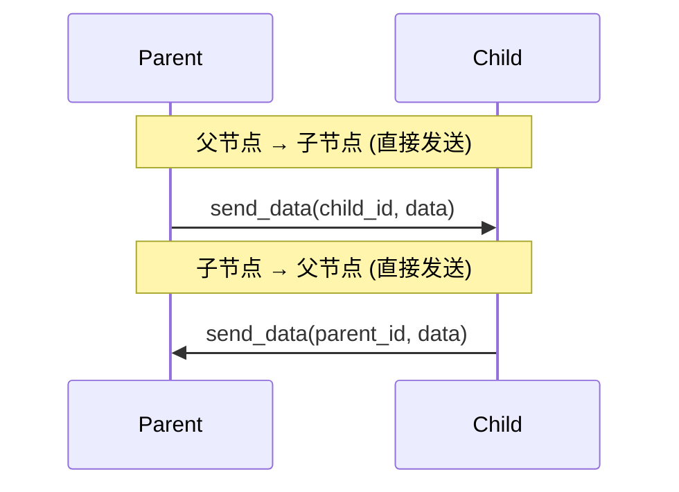

#### 场景2: 直接兄弟节点通信 (同父，会建立直连)

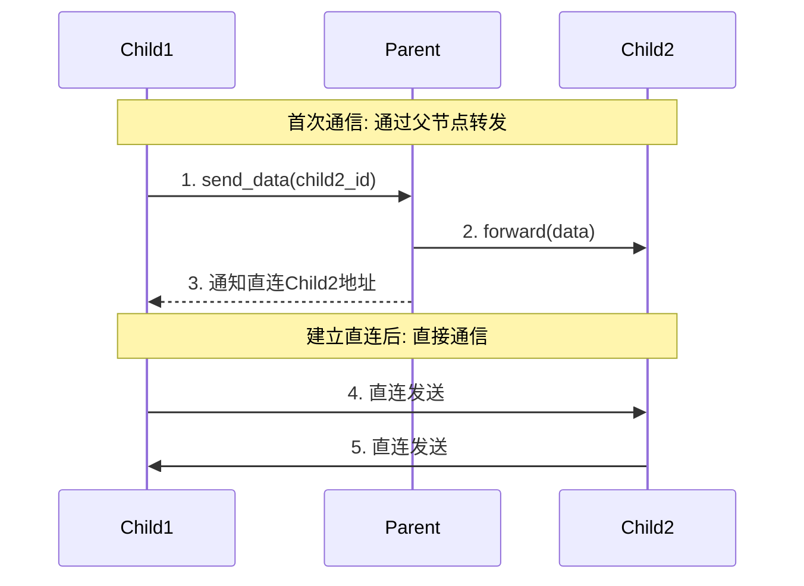

#### 场景3: 二级子节点转发

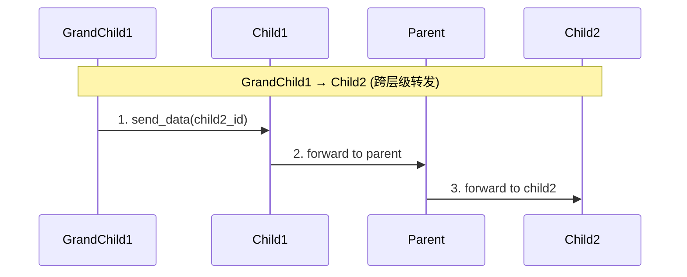

#### 场景4: 非直接兄弟节点 (不同父，不会自动直连)

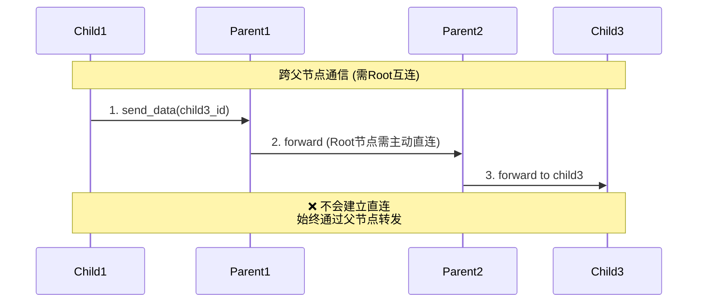

#### 场景5: Root节点主动直连

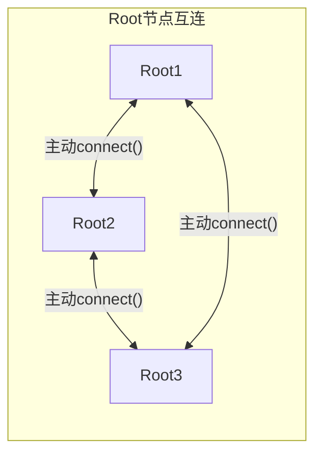

Root节点之间没有父子关系，需要通过 `node->connect(address)` 主动建立连接。

### 通道选择优先级

根据通信双方的位置关系，自动选择最优通道：

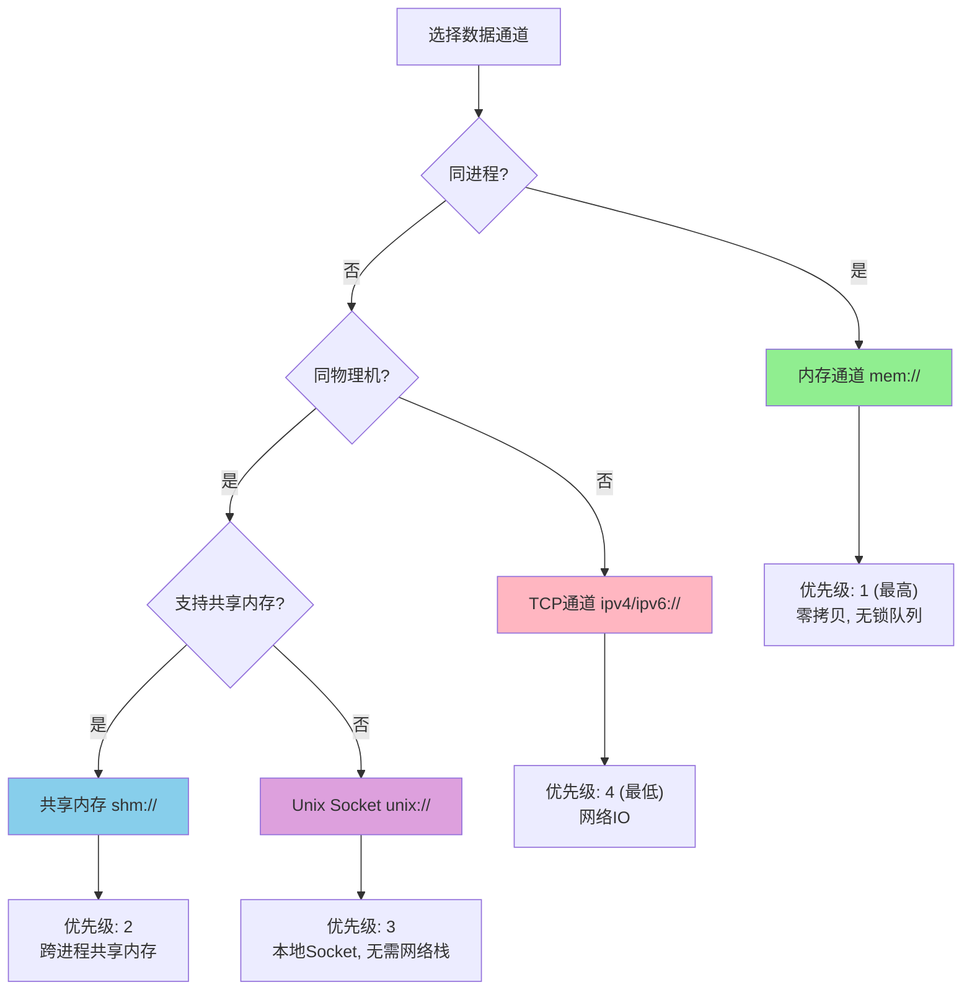

#### 通道类型对比

| 通道类型        | 协议前缀            | 适用场景       | 特点                                       |
| --------------- | ------------------- | -------------- | ------------------------------------------ |
| **内存通道**    | `mem://`            | 同进程内       | 零拷贝、无锁队列、最高性能                 |
| **共享内存**    | `shm://`            | 同物理机跨进程 | 多写单读、无需网络IO                       |
| **Unix Socket** | `unix://` `pipe://` | 同物理机跨进程 | 无需网络栈、比TCP快、Windows上用Named Pipe |
| **TCP通道**     | `ipv4://` `ipv6://` | 跨物理机       | 支持双工、跨网络                           |

#### 通道选择逻辑

```cpp
// 按性能优先级排序: mem > shm > unix > tcp
connection *endpoint::get_data_connection(const endpoint *ep) {
    // 检查是否同进程 (share_pid)
    if (ep->get_hostname() == get_hostname() && 
        ep->get_pid() == get_pid()) {
        // 优先使用 mem:// 通道 (ACCESS_SHARE_ADDR)
    }
    
    // 检查是否同物理机 (share_host)
    if (ep->get_hostname() == get_hostname()) {
        // 优先使用 shm:// 或 unix:// 通道 (ACCESS_SHARE_HOST)
    }
    
    // 使用 tcp:// 通道
    return tcp_connection;
}
```

### 连接类型

```cpp
// 控制通道: 用于节点注册、心跳等控制消息
connection::ptr_t ctrl_conn_;

// 数据通道: 用于业务数据传输，按性能优先级排序
std::list<connection::ptr_t> data_conn_;  // mem > shm > tcp
```

### 关键特性

| 特性                 | 说明                                               |
| -------------------- | -------------------------------------------------- |
| **树形拓扑**         | 节点间呈严格的父子层级关系                         |
| **静态路由**         | 路由路径在算法层面可直接计算，无需外部服务发现     |
| **自动直连**         | 同父的兄弟节点首次通信后会自动建立直连             |
| **非直接兄弟不直连** | 不同父的节点始终通过父节点链转发                   |
| **多通道支持**       | 同时支持 TCP、共享内存、内存通道，自动选择最优通道 |
| **子网冲突检测**     | 注册时检测子网范围冲突，防止路由歧义               |

### 设计局限

1. **静态树形结构**: 不支持网状拓扑，难以实现动态代理层
2. **无法动态扩缩容**: 网关层 HPA 和迁移会破坏路由结构
3. **单点依赖**: 父节点故障会导致其所有子节点路由中断
4. **跨区适配不足**: 未考虑跨大区网络质量差异和流量隔离需求

## 新路由算法的几个问题

我们现在要用额外的路由注册表去托管节点间关系的管理，并且支持上述的各类关系。就需要考虑下注册表中应该包含什么内容。

### 问题一: 如何高性能地判定关系？

先列举一下节点间关系（尽量避免 Parent/Child 这类“族谱词”，更贴近转发/路由语境；其中 *Immediate* 表示一跳，*Transitive* 表示多跳闭包关系）。

> 约定：以下关系均以“判定 X 与 Y 的关系”为视角。

补充说明：这里的 *Upstream/Downstream* 用于描述在“转发拓扑/汇聚层级”上的相对位置：Upstream 表示承担转发/汇聚职责的节点，Downstream 表示挂载在某个 Upstream 之下的节点。实际连接与消息收发是双向的，只是我们在判定关系时会选定参考点（X）来描述相对位置。

| 关系(中文) | 新算法英文名            | 老英文名               | 定义                                                                                                                                                          |
| ---------- | ----------------------- | ---------------------- | ------------------------------------------------------------------------------------------------------------------------------------------------------------- |
| 自己       | **Self**                | **self**               | $X = Y$                                                                                                                                                       |
| 代理父节点 | **ImmediateUpstream**   | **parent**             | 若 $X \to \* $ 的消息需要经由 $Y$ 转发（$Y$ 是 $X$ 的一跳 *Upstream*）                                                                                        |
| 间接父节点 | **TransitiveUpstream**  | **parent**             | 若存在路径 $X \to \cdots \to Y$ 且路径上的节点均承担转发/汇聚（$Y$ 是 $X$ 的多跳 *Upstream*）                                                                 |
| 直接子节点 | **ImmediateDownstream**  | **child**              | 若 $X$ 挂载在 $Y$ 之下且 $Y$ 是 $X$ 的一跳 *Upstream*（从 $Y$ 的视角，$X$ 是其直接 *Downstream*）                                                              |
| 间接子节点 | **TransitiveDownstream** | **child**              | 若 $X$ 可视作挂载在 $Y$ 之下的多跳 *Downstream*（跨越若干层 Upstream）                                                                                              |
| 邻居节点   | **SameUpstreamPeer**         | 通过 **contains** 接口判定 | 若 $X$ 与 $Y$ 共享同一个 *ImmediateUpstream*（即它们的直属 Upstream 相同）                                                                                         |
| 远方节点   | **OtherUpstreamPeer**     | 通过 **contains** 接口判定 | 设 $H_X$ 为 $X$ 的 *ImmediateUpstream*，$H_Y$ 为 $Y$ 的 *ImmediateUpstream*；若 $H_X$ 与 $H_Y$ 互为 *SameUpstreamPeer*（Upstream 层相邻），则 $X$ 与 $Y$ 互为远端对等体 |

原来的树形路由逻辑里是通过 subnet 判定，属于纯算法可计算的关系。目标ID落在自己的子网范围内，则目标是自己的下游节点；目标的ID是自己的父节点地址，（其子网范围包含自己），则目标是自己的上游节点；目标的ID也在自己的父节点子网范围内，则目标是自己的邻居节点或远方节点；否则是自己的远方节点。
两个节点间的关系是 **邻居节点** 还是 **远方节点** 是由 **代理父节点** 根据是否双方都是 **直接子节点** 决定的。

而在新的路由关系中，我们理论上只需要上报： **A节点 -> |代理父节点| -> B节点** 。其他的都能根据算法得出。

- 由 **A节点 -> |代理父节点| -> B节点** , 我们可以获得直接的关系有 **Self** , **ImmediateUpstream** , **ImmediateDownstream** 。算法复杂度为O(1)。
- 如果 **A节点 -> |代理父节点| -> C节点** , **B节点 -> |代理父节点| -> C节点** 。则他们是 **SameUpstreamPeer** 关系，算法复杂度为O(1)。
- 如果 **A节点** 的 ***代理父节点*** 链路包含 **B节点** ，或 **B节点** 的 ***代理父节点*** 链路包含 **A节点** ，它们是 **TransitiveUpstream** 或 **TransitiveDownstream** 子节点关系。这里涉及多级查找，但通常不会很深。可以考虑优化为如果深度很大，使用全局Atomic版本号比较+缓存父节点链路，如果深度小，直接链式查找。
- 其他的就全部是 **OtherUpstreamPeer** 节点了。

### 问题二: 兄弟节点不再总是直连？

之前的路由流程中，最上层的proxy层总是互相直连的。然后由父节点判定两个直接子节点是否可以直连。但是在跨大区通信时，比如下面的结构:


**区域1-Proxy1** 和 **区域2-Proxy1** 永不互通。即便他们是 **SameUpstreamPeer** 关系。而 **区域1-Proxy1** 和 **区域1-Proxy2** 是互通的，并且他们不需要经过 **跨大区Proxy节点** 下发直连消息就应该直接互通。

也就是说，是否能够直连应该是带策略的。我们可以用类似策略路由的方式来，在 [libatapp][libatapp] 层会有创建连接的流程。可以在这个流程里判定是走代理还是走直连，这个操作不会频繁，所以通过对比属性集的开销还可以接受。
但是在上游代理节点中，原本有判定两个节点是否通知直连的操作，如果每次转发消息包都去走策略判定属性集开销会过高了，所以我们可以直接提供个全局关闭的参数直接不再通过父节点通知直连了。
实际上后面都可以通过 [libatapp][libatapp] 来主动判定直连策略，后期也可以考虑干脆把这个协议删了算了。

这里涉及到 [libatapp][libatapp] 层需要能获知到是直连还是需要代理，而这个又是属于 libatbus 的算法层面的东西。所以还要设计一个接口去获知到链路下一跳的目标endpoint和connection地址。

### 问题三: 是否需要libatbus层直连判定直连？

这个问题是上一个问题延伸出来的。为了 [libatapp][libatapp] 能够接入不同的网络协议层，而不只支持 [libatbus][libatbus] 作为协议通信层，我之前在某个版本里给 [libatapp][libatapp] 也加了一层endpoint管理。它会处理连接过程中的pending message排队和支持接入其他协议层，比如loopback。然后把 [libatbus][libatbus] 作为其中一种协议。

在 [libatapp][libatapp] 层实现pending message排队的好处是不需要网络层协议支持在连接过程中的缓冲区，这样接入其他协议更简单也更灵活一些。
而在 [libatbus][libatbus] 里只有connection层的排队，是没有 message 层面的排队逻辑的。

我们也不希望重复实现message层面的排队重试逻辑，尽可能复用。这就导致在 [libatapp][libatapp] 中，针对 [libatbus][libatbus] 的接入层需要一定程度关心 [libatbus][libatbus] 的流程。
比如发起连接的时候 [libatapp][libatapp] 要根据 [libatbus][libatbus] 的算法知道实际发送的链路走直连，还是发给下游某个子节点，还是发给父节点。
如果是发给父节点则可以直接发送数据，如果是发给直连节点或者下游子节点，则要判定是否已经创建连接，如果没有创建连接要等连接创建完再尝试发送。

### 问题四: 单独的路由关系表还是注入到服务发现策略路由表？

[libatapp][libatapp] 里已经接入了etcd做服务发现和策略路由。一个选择是把 [libatbus][libatbus] 的路由关系也写到这个服务发现的数据里。
但是如果在父节点扩缩容或者抖动的时候就会导致整个业务策略路由抖动。另一个选择是单独放一份，这样 [libatbus][libatbus] 层的路由关系抖动不影响业务层负载分布。
但是隔离开有个问题是如何保证一致性？启动的时候我们可以先写入 [libatbus][libatbus] 层的路由关系，再写服务发现。
并且它们绑到同一个lease上，这样唯一的不一致点就在于上下线的时候，如果接收etcd的两个key的事件被分割到两次收包处理，可能有短暂的不一致。
虽然这种情况可以通过pending message的retry去解决，但是会增加整体实现的复杂性。为了以后两个数据分离不互相影响，这应该是值得的。

最终的方案是 **路由拓扑和服务发现分离，但共享同一个 etcd lease**。写入顺序是先拓扑再服务发现，这样其他节点看到某节点的服务发现数据时，该节点的拓扑信息已经就绪。唯一的短暂不一致窗口（收到两个 key 的 watcher 事件之间的间隔）通过 libatapp 层的 pending message 和 retry 机制自然消化。

## 新的拓扑注册表设计

确定了上面四个问题的方向后，下面具体看拓扑注册表的实现。

### topology_registry: 进程内拓扑图

新的拓扑管理由 `topology_registry` 实现，它是一个进程内的轻量级图结构：

- 每个节点是一个 `topology_peer`，通过 `bus_id_t`（64 位）唯一标识
- 每个 peer 可选地持有一个 upstream（形成树/森林）
- 每个 peer 可以挂载任意数量的 downstream（通过 weak pointer 引用，避免循环依赖）
- 每个 peer 附带 `topology_data`（PID、hostname、labels），用于支持策略路由判定

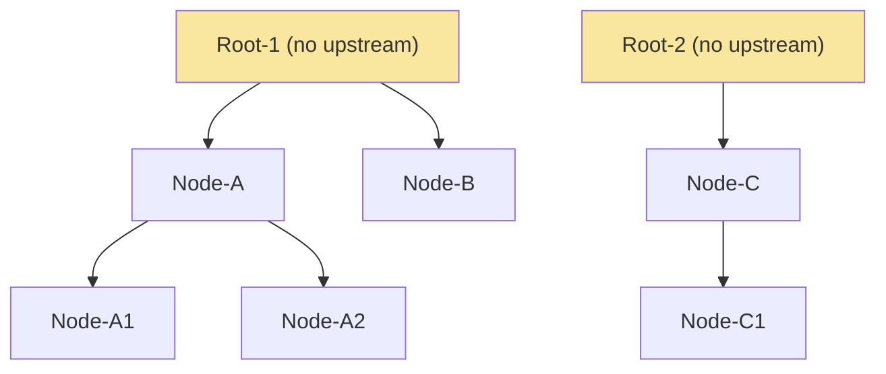

### 关系判定算法

`topology_registry::get_relation(from, to)` 的判定逻辑：

1. `from == to` → **Self**，$O(1)$
2. `to` 是 `from` 的直属 upstream → **ImmediateUpstream**，$O(1)$
3. `from` 是 `to` 的直属 upstream → **ImmediateDownstream**，$O(1)$
4. `from.upstream == to.upstream` → **SameUpstreamPeer**，$O(1)$
5. 沿 `from` 的 upstream 链向上遍历找 `to` → **TransitiveUpstream**，$O(d)$ 其中 $d$ 为深度
6. 沿 `to` 的 upstream 链向上遍历找 `from` → **TransitiveDownstream**，$O(d)$
7. 以上均不满足 → **OtherUpstreamPeer**

实际场景中代理层级很少超过 3-4 层，所以 $O(d)$ 的遍历开销可以忽略。

### 策略路由: topology_policy_rule

为了解决"邻居节点不一定能直连"的问题，引入了 `topology_policy_rule`：

```cpp
struct topology_policy_rule {
  bool require_same_process;    // 要求同进程
  bool require_same_hostname;   // 要求同主机
  // Key: label 名, Value: 允许的 label 值集合
  std::unordered_map<std::string, std::unordered_set<std::string>> require_label_values;
};
```

每个 peer 注册时携带 labels（如 `region=us-west`、`tier=proxy`），连接决策时通过 `check_policy(from, to, rule)` 判定两个节点是否满足直连条件。这样就可以灵活表达"同区域内的 proxy 可以直连，跨区域的必须走代理"这类规则。

### 拓扑变更的安全性保证

`topology_registry::update_peer()` 自带环检测。更新某个 peer 的 upstream 前，会沿新 upstream 的链路向上遍历，如果在链路中发现了当前 peer 的 ID，则拒绝更新并返回错误码。这避免了拓扑形成环导致消息死循环转发的风险。

## 新的协议层设计

老版本 [libatbus][libatbus] 的协议基于自定义的二进制编码，迭代和扩展不方便。新版本全部切换到 **Protobuf v3**，带来几个直接的收益：

1. **跨语言互通**：proto 文件自带 `go_package` 指令，已在计划中提供 Go SDK
2. **演进友好**：利用 protobuf 的 field number 和 optional 语义，协议字段的增减不会破坏前/向兼容性
3. **可读性**：排查线上问题时可以直接用 protobuf decode 工具解析报文

### 报文结构

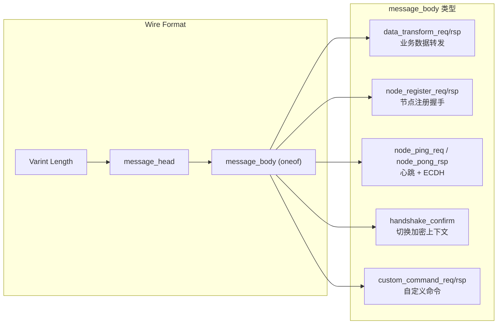

`message_head` 包含：版本号、消息类型、序列号、源节点 bus_id，以及可选的加密元数据（算法类型 + IV + AAD）和压缩元数据（算法 + 原始大小）。

### ECDH 密钥协商

老版本 [libatbus][libatbus] 的加密协商采用类似 TLS 握手的方式——客户端和服务端发送给对方的数据是不同的（非对称角色）。这个设计有两个现实问题：

1. **3 RTT 才能完成握手**：对跨大区高延迟链路来说代价太高
2. **Go 语言难以支持**：计划中的 Go SDK 需要完整实现非对称握手的状态机，复杂度远超核心诉求

新版本改成了**对称式握手**：双方在 ping/pong 中各自发送公钥，各自独立推导出相同的 shared secret。这种方式天然是对称的——谁先发 ping 谁就是"Client"，但双方执行的操作完全一致。

代价是密钥交换算法必须两端配置成一样的（不像 TLS 可以在握手中协商非对称算法）。考虑到内部服务集群的部署通常可以统一配置，这个限制可以接受。

新版本在心跳报文中嵌入 ECDH 密钥协商流程，同一条连接不需要额外的握手阶段：

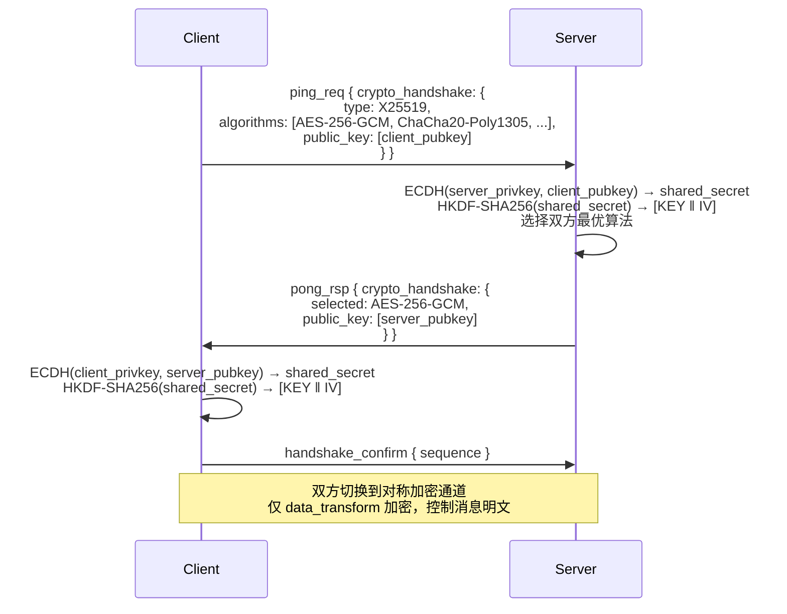

**关键设计决策**：

- 支持的密钥交换算法：X25519（TLS 1.3 推荐）、P-256、P-384、P-521
- 支持的对称算法：AES-128/192/256-CBC、AES-128/192/256-GCM（AEAD）、ChaCha20、ChaCha20-Poly1305-IETF、XChaCha20-Poly1305-IETF、XXTEA
- 控制消息（register、ping/pong、handshake_confirm）**始终明文**，不加密也不压缩
- 支持运行时换密钥（默认 3 小时），无需断连

### 压缩支持

新版本增加了传输层压缩支持。一个关键的设计决策是 **先压缩再加密**：加密前的数据通常更有规律（protobuf 序列化的结构化数据、重复的字段前缀等），压缩率显著高于加密后再压缩。处理顺序是：

```text
发送: 原始 body → 压缩 → 加密 → [head | encrypted(compressed(body))]
接收: [head | encrypted(compressed(body))] → 解密 → 解压 → 原始 body
```

这个设计带来一个实现上的约束：**除了控制消息（register、ping/pong、handshake_confirm）使用验证算法验证 key 以外，其他流量（`data_transform`）的 body 都是加密的**。这意味着不能像以前那样把业务 payload 直接放在 protobuf message 的 `oneof` body 字段里让 protobuf 自动解析——因为 body 在到达 protobuf 反序列化之前需要先经过解密和解压。所以新版本的报文打解包必须手动处理：先序列化 `message_head`，再独立处理 body 的压缩/加密，最后拼接成完整的 wire format。接收端也是先拆出 head 和 body，对 body 做解密/解压后再交给上层。

协议同时引入了语义化的压缩等级定义，将不同算法的参数抽象为统一的等级：

| 语义等级 | 典型映射 (zstd / lz4 / zlib) | 适用场景 |
|----------|-------------------------------|----------|
| STORAGE  | level 1 / fast(1) / level 1   | 落库前轻量压缩 |
| FAST     | level -1 / fast(1) / level 1  | 延迟敏感的实时通信 |
| BALANCED | level 3 / fast(默认) / level 6 | 日常通信默认值 |
| HIGH_RATIO | level 9 / HC / level 7 | 带宽受限的跨区传输 |

支持的压缩算法包括 Zstd、LZ4、Snappy、Zlib，上层可以按消息类型或链路特征选择不同等级。

## 新的多通道与连接模型

### 连接生命周期

新版本的连接状态机更精细，加入了独立的握手阶段和密钥刷新阶段：

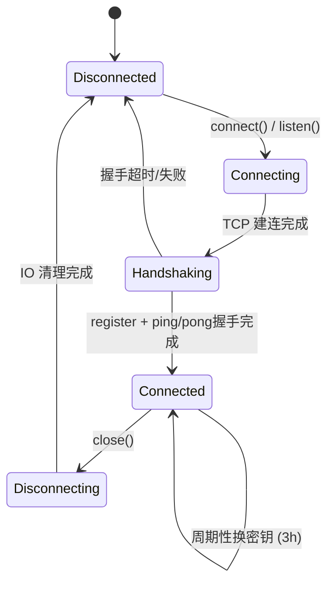

### Endpoint 的双通道模型

每个远端节点（`endpoint`）包含两类连接：

- **控制通道** (`ctrl_conn_`)：承载注册、心跳、ECDH 握手等控制消息
- **数据通道** (`data_conn_`)：承载业务数据，可以有多条，按优先级排序

### 通道选择优先级（保持不变）

多通道选择机制基本延续了老设计，按实际部署拓扑自动选择最优通道：

| 优先级 | 通道类型 | 协议前缀 | 条件 |
|--------|----------|----------|------|
| 最高 | 内存通道 | `mem://` | 同进程（同 PID + 同 hostname） |
| 高 | 共享内存 | `shm://` | 同物理机（同 hostname） |
| 中 | Unix Socket / Named Pipe | `unix://` `pipe://` | 同物理机 |
| 低 | TCP | `ipv4://` `ipv6://` `atcp://` | 跨物理机 |

新增的 `atcp://` 协议名不预设 IPv4/IPv6，而是根据地址实际内容判定协议族，在双栈环境下更友好。

### 节点注册与访问控制

新版本的 `node_register_req` 会携带节点的 **公开信息**（listen 地址列表、支持的通道类型、支持的加密/压缩算法集），服务端验证通过后返还 `node_register_rsp`。验证机制使用 HMAC-SHA256 签名 `access_key`，防止未授权节点接入。

## 新路由算法的完整流程

综合上面的拓扑注册表和连接模型，新的路由流程如下：

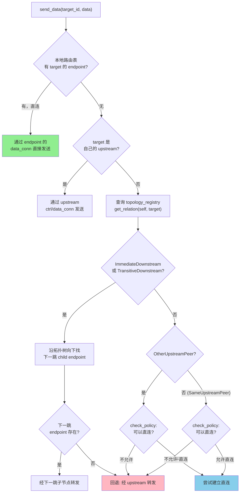

与老路由的关键差异：

| 维度 | 老路由（subnet + 静态树） | 新路由（topology_registry + 策略） |
|------|--------------------------|----------------------------------|
| 关系判定 | 子网掩码位计算 | 拓扑注册表链式查询 |
| 直连决策 | 父节点自动通知直连 | 策略规则判定，上层应用可控 |
| 拓扑变更 | 不支持动态变更 | update_peer / remove_peer，实时响应 |
| 代理层扩缩容 | 需要预分配 ID 段 | 动态注册和注销，支持 HPA |
| 跨区隔离 | 不支持 | labels 策略精确控制 |

## 总结

这次 [libatbus][libatbus] 的重构不是简单的代码翻新，核心是把路由模型从"静态子网树"切换到"动态拓扑注册表 + 策略驱动"。四个关键设计决策及其 trade-off：

1. **关系判定从 subnet 计算改为拓扑链查询**：失去了 $O(1)$ 的纯算法判定，换来了代理层可以动态增减的灵活性。实际可接受，因为查询深度通常不超过 4 层。
2. **直连决策从父节点下推改为上层策略判定**：libatbus 层不再主动通知直连，改由 libatapp 通过 labels + policy 自行判断。代价是多了一次策略匹配开销；收益是跨区隔离、差异化安全策略都可以优雅实现。
3. **协议从自定义二进制改为 Protobuf**：性能上略有额外开销（序列化/反序列化），但获得了跨语言支持、协议演进能力和运维可观测性。密钥协商从类 TLS 的非对称握手改为对称式 ECDH，降低了 RTT 和跨语言实现复杂度，代价是两端必须配置相同的密钥交换算法。先压缩再加密的流程获得了更好的压缩率，但需要手动处理 body 的打解包而非依赖 protobuf oneof。
4. **拓扑关系和服务发现两张表分离但共享 lease**：隔离了代理层抖动对业务层的影响，代价是需要处理短暂的事件时序不一致。通过 pending message retry 机制自然消化。

这些变更为后续 libatapp 中的连接管理、重连机制、代理级联等上层特性提供了基座。关于 libatapp 如何在这个基座上实现 pending message 排队、拓扑变更响应、指数退避重连和代理级联传播，将在[下一篇文章][next-post]中展开。

[libatbus]: https://github.com/atframework/libatbus
[libatapp]: https://github.com/atframework/libatapp
[next-post]: ../2605
