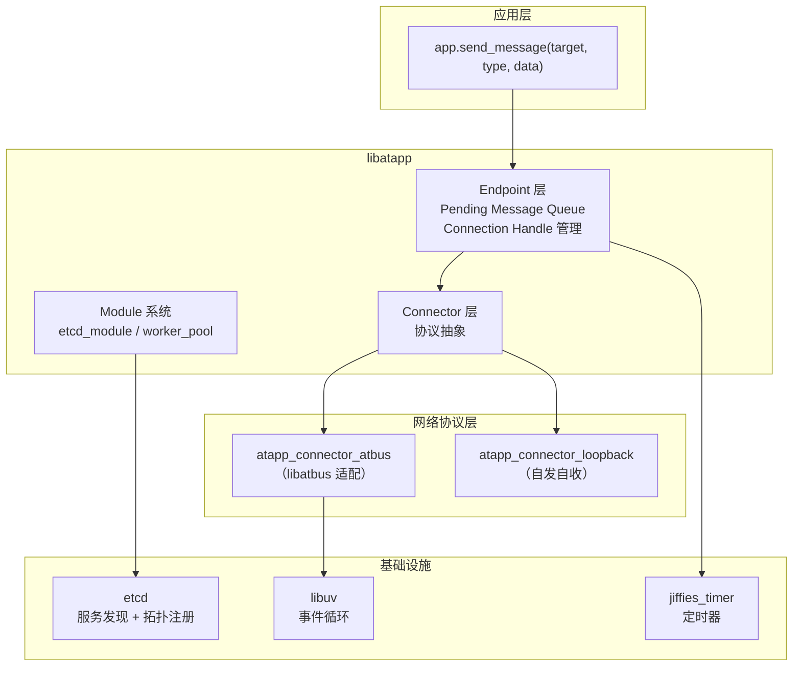
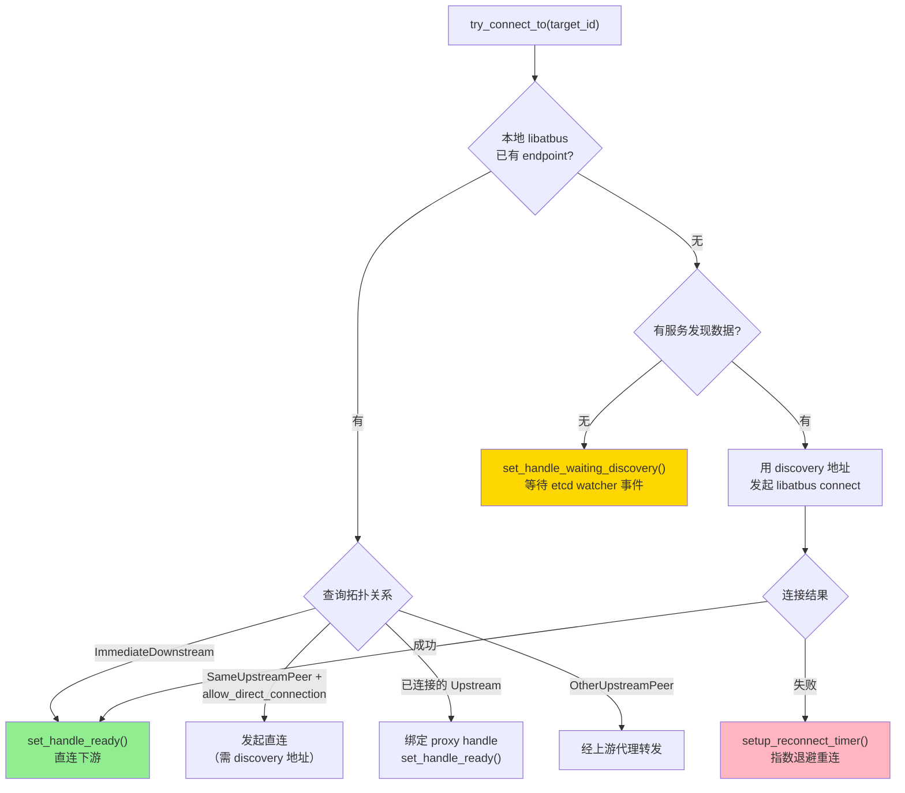
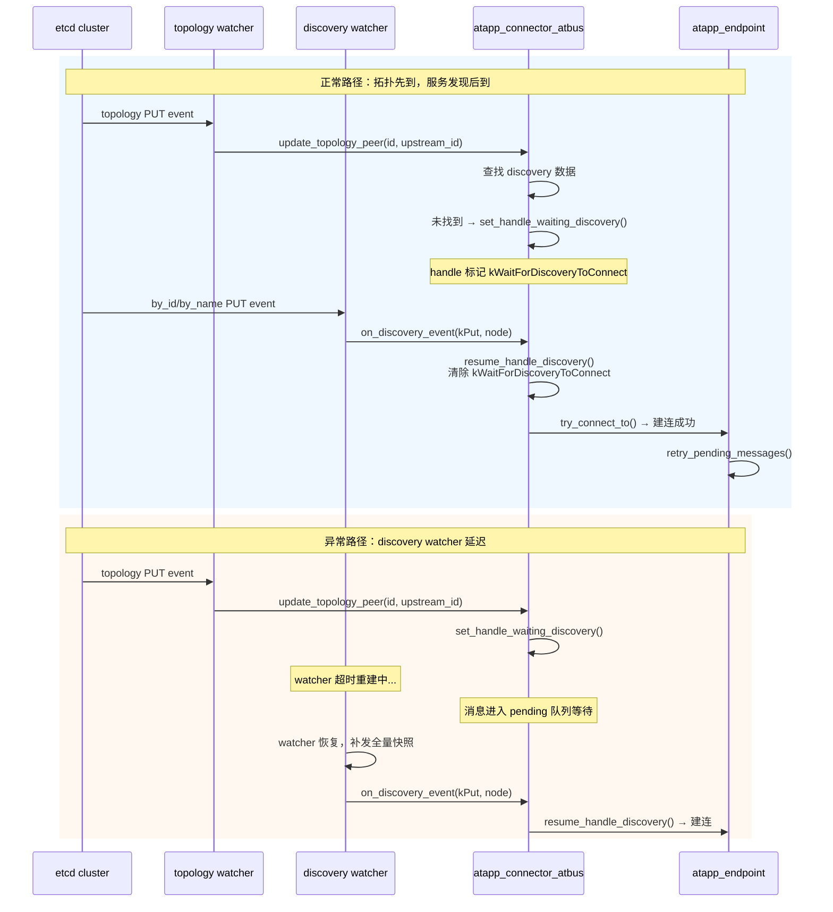
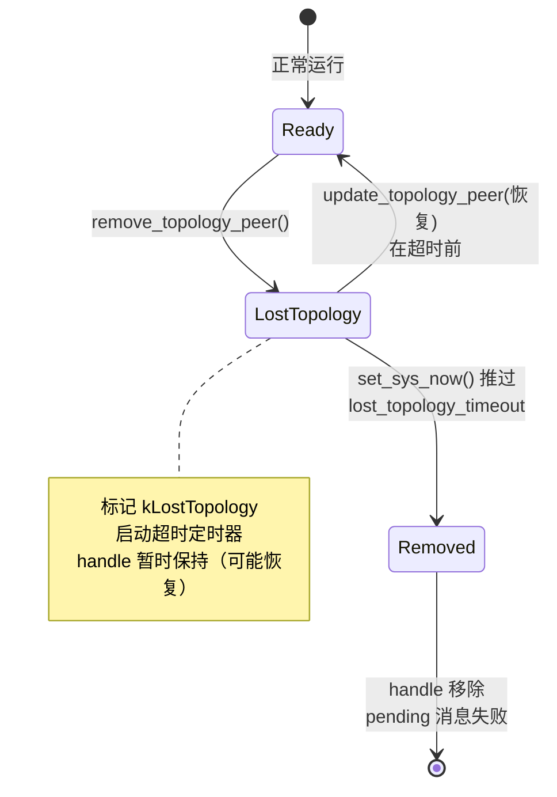
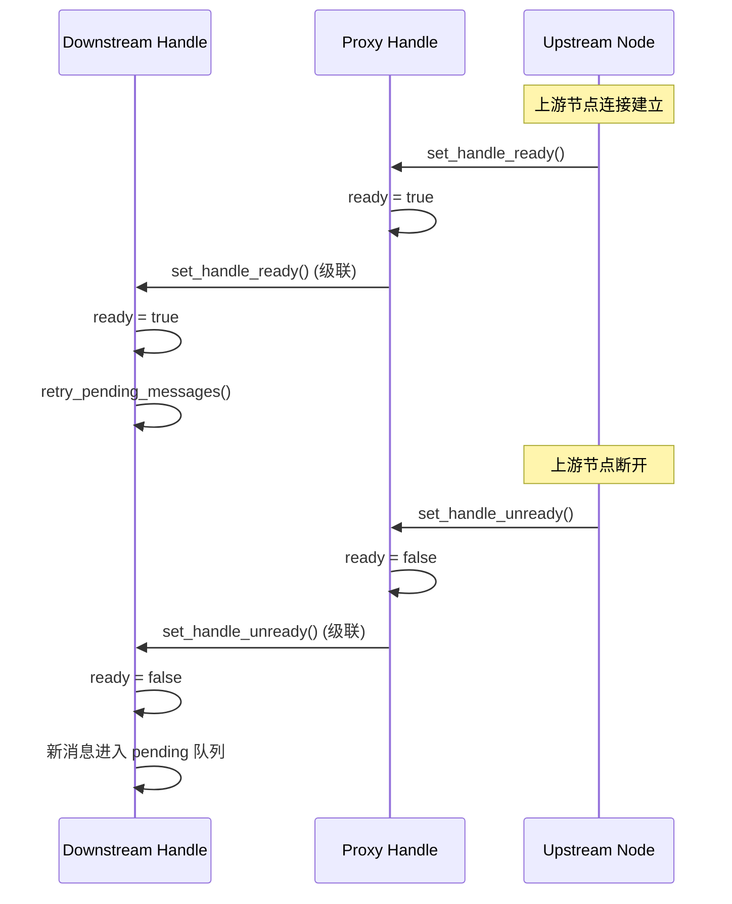

## 前言

在[上一篇文章][prev-post]中，介绍了 [libatbus][libatbus] 从静态子网树到动态拓扑注册表的路由设计变更。新的拓扑模型解决了代理层无法弹性伸缩和跨区域隔离的问题，但路由只是底层基座——上层应用框架 [libatapp][libatapp] 才是真正面对业务开发者的接口。

这篇文章聚焦于 [libatapp][libatapp] 在新架构下的连接管理层设计，涵盖以下核心问题：

- **Connector 抽象**：如何让多种网络协议（libatbus、loopback、未来的 gRPC）共用同一套连接管理逻辑？
- **Pending Message 排队**：连接尚未建立时，消息如何排队、何时重试、何时放弃？
- **etcd 双注册表**：服务发现和拓扑关系分两张表存 etcd，事件时序不一致时怎么处理？
- **拓扑变更响应**：上游切换、上游丢失、服务发现删除等场景下的自动恢复流程
- **重连机制**：指数退避、定时器替换策略、重试次数上限

如果你在做类似的分布式服务框架，或者在游戏服务器中面临过"网关/代理层 HPA 时消息丢失"的问题，这篇可能有参考价值。

## 总体架构

先给一个全景图，帮助理解各层的职责边界：



**核心设计原则**：

- [libatapp][libatapp] 的 Endpoint 和 Connection Handle 与 [libatbus][libatbus] 的 endpoint/connection 是 **两套独立的概念**。前者管理消息排队和连接状态，后者管理底层通道
- [libatbus][libatbus] 层只有 connection 级别的缓冲区，没有 message 级别的排队逻辑。所有 message 排队统一在 [libatapp][libatapp] 层完成
- 一个 libatapp endpoint 可以同时持有多个 connection handle（比如一条直连 + 一条经代理），但任何时刻只有一个是 ready 状态

## Connector 抽象层

### 设计动机

早期版本 [libatapp][libatapp] 和 [libatbus][libatbus] 是强绑定的，发消息就直接调 `atbus_node::send_data()`。但有几个场景推着我们做抽象：

1. **自发自收**：同一进程内的消息不需要经过网络栈，搞个 loopback connector 直接回调就行
2. **未来扩展**：有计划接入其他协议（如 gRPC），不想每次都把连接管理逻辑重写一遍
3. **Pending Message 复用**：不管底层是什么协议，"连接没建好时消息排队等待"这个逻辑是通用的

### Connector 接口

```cpp
class atapp_connector_impl {
  // 判断地址类型（ipv4/ipv6/shm/mem/loopback/...）
  virtual uint32_t get_address_type(const channel_address_t &addr) const = 0;
  
  // 发起连接
  virtual int32_t on_start_connect(const etcd_discovery_node &discovery,
                                   atapp_endpoint &endpoint,
                                   const channel_address_t &addr,
                                   const atapp_connection_handle::ptr_t &handle);
  
  // 发送数据
  virtual int32_t on_send_forward_request(atapp_connection_handle *handle,
                                          int32_t type, uint64_t *msg_sequence,
                                          gsl::span<const unsigned char> data,
                                          const atapp_metadata *metadata);
  
  // 响应服务发现事件
  virtual void on_discovery_event(etcd_discovery_action_t action,
                                  const etcd_discovery_node::ptr_t &node);
};
```

每种协议只需实现这几个接口，连接管理的上层逻辑（排队、重试、超时）全部在 Endpoint 层统一处理。

### atapp_connector_atbus: libatbus 适配器

这是最核心的 connector 实现，也是逻辑最复杂的部分。它需要：

- 把 libatapp 的"发给某个 target_id"翻译成 libatbus 的实际路由决策（直连、经代理、经上游转发）
- 追踪每个 connection handle 对应的 libatbus 链路状态
- 响应 libatbus 层的连接/断连/拓扑变更事件

每个 connection handle 内部维护一個 `atbus_connection_handle_data`：

```cpp
struct atbus_connection_handle_data {
  bus_id_t current_bus_id;               // 目标节点 ID
  bus_id_t topology_upstream_bus_id;     // 来自拓扑信息的上游 ID
  bus_id_t proxy_bus_id;                 // 当前实际走的代理节点 ID（0 = 直连）
  
  enum flags_t {
    kActiveConnection,              // 主动发起的连接
    kWaitForDiscoveryToConnect,     // 等待 etcd 服务发现数据到达
    kLostTopology,                  // 拓扑信息已丢失，等待超时清理
    kReady,                         // 连接就绪，可以发数据
  };
  
  uint32_t reconnect_retry_times;          // 当前重连累计次数
  raw_time_t reconnect_next_timepoint;     // 下次重连时间点
  jiffies_timer_watcher_t timer_handle;    // 关联的定时器（可撤销）
};
```

## 连接建立的路由决策

当 libatapp 需要和某个目标节点通信时，`atapp_connector_atbus` 的 `try_connect_to()` 会按以下优先级选择路径：



**关键行为**：

- 如果目标是自己的下游（ImmediateDownstream），并且 libatbus 层已经有这个 endpoint（对方主动连上来了），直接标记 ready
- 如果目标和自己挂在同一个上游（SameUpstreamPeer），且配置允许直连 (`allow_direct_connection: true`)，则尝试直连
- 如果无法直连或没有服务发现数据，通过上游代理转发
- 如果服务发现数据还没到，标记 `kWaitForDiscoveryToConnect` 并等待 etcd watcher 回调

## Pending Message 队列

### 排队机制

当消息发送时 endpoint 上没有 ready 的 connection handle，消息不会被丢弃，而是进入 `pending_message_` 队列：

```cpp
struct pending_message_t {
  int32_t type;
  uint64_t msg_sequence;
  std::vector<unsigned char> data;
  const atapp_metadata *metadata;
  raw_time_t expired_timepoint;     // 超时时间
};
```

排队有两道保护：

- **数量上限** (`send_buffer_number`)：防止内存暴涨
- **超时上限** (`message_timeout`)：默认 30 秒，过期的消息触发 `on_forward_response` 错误回调

### 重试触发

当 connection handle 状态切换为 ready 时（不管是新连接建立、重连成功、还是代理 handle 就绪），会调用 `endpoint.retry_pending_messages()`：

1. 从队列头部取消息
2. 检查是否过期，过期的移除并触发错误回调
3. 发送，成功则移除
4. 发送失败（如缓冲区满）则停止本轮重试，等下个 tick

重试是**增量的**，不会一次性把所有 pending 消息全部发出，避免瞬间打满网络缓冲区。

## etcd 双注册表: 服务发现 + 拓扑

### 服务发现: 已有功能

服务发现是 [libatapp][libatapp] 的既有功能，节点启动时将自身信息写入 etcd，其他节点通过 watcher 获取地址列表和元数据。每个节点写入两个 discovery key（按 ID 和按名字各一个），用于支持不同的查找模式：

| Key 路径 | 说明 |
|---------|------|
| `{path}/by_id/{name}-{id}` | 按节点 ID 查找 |
| `{path}/by_name/{name}-{id}` | 按节点名字查找 |

两个 key 的 value 内容相同，都是 `atapp_discovery` protobuf 的 JSON 序列化：

```protobuf
message atapp_discovery {
  uint64 id = 1;
  string name = 2;
  repeated string listen = 5;        // 连接地址（ipv4/ipv6/shm/...）
  atapp_area area = 9;               // 区域信息
  uint64 type_id = 7;
  string type_name = 8;
  atapp_metadata metadata = 61;      // Kubernetes 风格的 labels/namespace 等
  // ... 其他字段省略
}
```

服务发现数据的核心用途是：**知道目标节点在哪、怎么连过去**。`listen` 字段提供连接地址，`metadata` 提供策略路由所需的标签。

#### 服务发现的策略缓存

服务发现数据在内存中通过 `etcd_discovery_set` 管理。这个集合不只是简单的 `map<id, node>`，还维护了多层策略路由缓存：

- **默认一致性哈希环**：每个节点生成 80 个虚拟哈希点（`HASH_POINT_PER_INS = 80`），排序后形成哈希环
- **策略路由缓存**：按 `atapp_metadata` 分组，每种 metadata 过滤条件都有独立的一致性哈希环和轮询列表
- **紧凑哈希环**：去除连续指向同一节点的哈希点，减少查询时的跳转开销

```cpp
struct index_cache_type {
  std::vector<node_hash_type> normal_hashing_ring;   // 排序后的 N×80 哈希点
  std::vector<node_hash_type> compact_hashing_ring;  // 去重后的紧凑环
  std::vector<etcd_discovery_node::ptr_t> round_robin_cache;  // 按 id/name 排序的节点列表
  size_t round_robin_index;
  std::unordered_set<const etcd_discovery_node *> reference_cache;  // 用于反查
};
```

策略路由匹配时，`metadata_equal_type::filter()` 会逐字段比对 `api_version`、`kind`、`group`、`namespace_name`、`service_subset`，以及 `labels` 中所有非空的 key-value 对。这个过滤逻辑本身不算贵，但 **缓存重建** 的代价很高：

每次节点变更（增/删/改）都会触发 `clear_cache()`，该函数需要：

1. 无条件清除默认哈希环（$O(1)$ 但丢掉了 $N \times 80$ 个预计算的哈希点）
2. 遍历所有 metadata 索引（$O(M)$，$M$ = 曾经查询过的不同 metadata 条件数），检查受影响的索引并删除
3. 下次查询命中空缓存时执行 `rebuild_cache()`：遍历所有节点、对每个节点做 metadata 过滤匹配、计算 80 个哈希点、排序整个哈希环（$O(N \times 80 \times \log(N \times 80))$）

在一个有数百个节点、十几种 metadata 策略的集群里，这个重建代价是秒级的。如果 proxy 层 HPA 导致服务发现事件频繁触发，所有缓存反复重建，会成为不可忽略的性能开销。

### 拓扑注册表: 新增功能

拓扑注册表是这次重构中 **新增** 的 etcd 注册内容，每个节点额外写入一个 topology key：

| Key 路径 | 说明 |
|---------|------|
| `{path}/topology/{name}-{id}` | 拓扑关系 |

Value 是 `atapp_topology_info` protobuf 的 JSON 序列化：

```protobuf
message atapp_topology_info {
  uint64 id = 1;
  string name = 2;
  string hostname = 3;
  int32 pid = 4;
  string identity = 7;
  string version = 8;
  uint64 upstream_id = 11;          // 我的上游是谁
  atbus_topology_data data = 12;    // 拓扑标签
}

message atbus_topology_data {
  map<string, string> label = 21;   // key-value 标签，用于拓扑策略匹配
}
```

拓扑数据的核心用途是：**判定节点间的代理关系和连接策略**。`upstream_id` 标明代理关系树的结构，`data.label` 提供给 `topology_policy_rule` 做直连/代理决策。

和服务发现数据的关键区别：

| 维度 | 服务发现 (`atapp_discovery`) | 拓扑 (`atapp_topology_info`) |
|------|---------------------------|----------------------------|
| 变更频率 | 低（节点启停时变更） | 高（proxy HPA 扩缩容时 `upstream_id` 变化） |
| 数据体量 | 大（包含地址列表、gateway、metadata） | 小（只有 upstream_id + labels） |
| 缓存代价 | 高（一致性哈希环 + 策略路由索引重建） | 低（无哈希环，仅拓扑树更新） |
| 作用 | 怎么连（地址） | 往哪走（路由关系） |

三个 key（topology + by_id + by_name） **绑到同一个 etcd lease** 上，节点下线时（lease 过期）三个 key 一起被 etcd 自动删除。

### 为什么分两张表

分表的核心目的是 **隔离 proxy 层 HPA 扩缩容引起的拓扑抖动，避免触发服务发现缓存的大规模重建**。

在 Kubernetes 环境下，proxy 层经常跟随负载做 HPA 自动扩缩容。每次 proxy 扩缩容，下游节点的 `upstream_id` 发生变化，需要更新拓扑关系。如果拓扑数据和服务发现放在同一个 key 里：

1. proxy 扩容 → 下游节点更新自身的 etcd key（`upstream_id` 变了）→ 所有 watcher 收到 PUT 事件
2. 其他节点认为这是一次服务发现变更 → `clear_cache()` → 丢弃所有一致性哈希环和策略路由缓存
3. 下一次路由查询 → `rebuild_cache()` → 遍历所有节点 × 80 哈希点 × 排序 × 每种 metadata 策略
4. 如果 proxy 扩缩容频繁（比如一分钟内发生多次），缓存反复重建，策略路由在持续重算中抖动

分表后：

- 拓扑变更（`upstream_id` 变化）只写 `topology/` key → 只触发拓扑 watcher → 拓扑树更新（$O(1)$ 的 `update_peer` 操作）
- 服务发现数据（地址、metadata）不变 → discovery watcher 无事件 → 一致性哈希环和策略路由缓存完全不受影响
- 业务层的负载均衡、一致性哈希分配、轮询计数器等**感知不到 proxy 层的抖动**

### 写入顺序和时序不一致处理

#### 写入顺序

节点启动时 `init_keepalives()` 的写入顺序是 **先拓扑，后服务发现**。代码中有明确注释：

> 先刷新 topology 数据，后刷新 discovery 数据，以保证策略路由变化时已获取到最新的 topology 信息

这样设计的意图是：其他节点收到某节点的服务发现事件（`by_id` 或 `by_name` 的 PUT）时，该节点的拓扑信息通常已经在 etcd 中就绪，查询一次就能拿到。

#### 时序不一致是现实问题

由于服务发现和拓扑使用了**独立的 watcher**（etcd_module 启动时创建三个 watcher：`by_name/`、`by_id/`、`topology/`），即使 etcd 侧的写入顺序确定，watcher 事件的到达顺序也无法保证。实际运行中会遇到以下情况：

**情况一：拓扑先到，服务发现后到**

这是最常见的正常路径。收到拓扑 PUT 事件后，`update_topology_peer()` 更新拓扑树。如果此时需要建连但没有 discovery 数据：

```cpp
auto discovery_info = get_owner()->get_discovery_node_by_id(target_bus_id);
if (!discovery_info) {
    set_handle_waiting_discovery(handle);  // 标记：等待服务发现
    set_handle_unready(handle);             // 新消息进 pending 队列
    return;
}
```

等服务发现事件到达后，`on_discovery_event(kPut)` → `resume_handle_discovery()` 清除等待标记并发起建连。

**情况二：服务发现先到，拓扑后到**

收到服务发现 PUT 后，连接器知道目标地址了，但不知道拓扑关系（不知道是否需要经代理转发）。此时如果已有 handle 处于 `kWaitForDiscoveryToConnect` 状态，`resume_handle_discovery()` 会尝试建连。如果还没有 handle（首次发消息），则根据当前已有的拓扑数据尝试路由；如果拓扑数据不全，走代理转发兜底。

**情况三：一个 watcher 超时或延迟较长**

这在网络分区恢复、etcd 集群 leader 切换等场景下可能发生。比如拓扑 watcher 正常，但 discovery watcher 的长轮询请求超时重建：

1. 拓扑事件正常到达 → `update_topology_peer()` 执行
2. 发现没有 discovery 数据 → `set_handle_waiting_discovery()` + `set_handle_unready()`
3. 发送给目标的消息进入 pending 队列
4. Discovery watcher 恢复后补发全量快照 → `on_discovery_event(kPut)` → `resume_handle_discovery()` → 建连 → pending 消息重试

关键保障是：`kWaitForDiscoveryToConnect` 标记不会自动超时清除（它不像 `kLostTopology` 有超时定时器），handle 会一直持有并等待直到 discovery 事件到来或被 `kLostTopology` 的超时机制兜底清理。

**情况四：拓扑 DELETE 和服务发现 DELETE 不同步**

节点下线时，由于共享同一个 etcd lease，三个 key 的 DELETE 事件几乎同时产生，但到达本地 watcher 的顺序不确定：

- 如果 discovery DELETE 先到 → handle 标记 `kWaitForDiscoveryToConnect`
- 紧接着 topology DELETE 到达 → `remove_topology_peer()` → 标记 `kLostTopology` + 超时定时器
- 最终由 `kLostTopology` 的超时（默认 120s）兜底清理

交换顺序也安全：topology DELETE 先到标记 `kLostTopology`，discovery DELETE 后到再标记 `kWaitForDiscoveryToConnect`，最后由 `kLostTopology` 超时判定最终清理。

#### 不一致处理的完整交互

下图展示了两个 watcher 与 connector 的交互，重点标注了时序差异的处理路径：



## 拓扑变更响应

这是整个连接管理中最复杂的部分。下面按场景分析。

### 场景一: 上游切换 (update_topology_peer)

当 etcd 拓扑 watcher 发现某节点的 `upstream_id` 从 A 变为 B：

1. 检查新上游 B 是否已有 libatbus endpoint（已连接）
2. 如果已连接：无缝切换 proxy_bus_id，handle 保持 ready，消息不中断
3. 如果未连接但有服务发现数据：发起连接，连接成功后切换
4. 如果未连接且无服务发现数据：标记 `kWaitForDiscoveryToConnect`，等事件到达

### 场景二: 上游丢失 (remove_topology_peer)



关键行为：

- 上游拓扑丢失后，handle **不立即关闭**，而是标记 `kLostTopology` 并启动超时定时器（默认 `lost_topology_timeout = 120s`）
- 如果在超时前收到新的 `update_topology_peer`，清除标记并恢复正常
- 如果超时后仍未恢复，强制移除 handle，所有 pending 消息以 `EN_ATBUS_ERR_NODE_TIMEOUT` 失败回调

这个"宽限期"设计对 rolling update 场景很重要：proxy 节点重启时，短暂的拓扑中断不应该导致下游全量消息失败。

### 场景三: 服务发现删除再恢复

一个特殊的场景是目标节点在 etcd 中短暂消失（如进程重启）：

1. 收到 discovery DELETE → connector 触发 `set_handle_unready` + `set_handle_waiting_discovery`
2. 收到 topology DELETE → `set_handle_lost_topology` + 超时定时器
3. 节点重启 → 新的 topology PUT 到达 → `update_topology_peer()` 清除 `kLostTopology`
4. Discovery PUT 到达 → `on_discovery_event(kPut)` → `resume_handle_discovery()` 清除 `kWaitForDiscoveryToConnect`
5. 用新的 discovery 地址重新建连

注意这里 `kWaitForDiscoveryToConnect` 只对**对等节点或远方节点**（SameUpstreamPeer / OtherUpstreamPeer）生效。上游和下游节点由 libatbus 层自行管理重连，不需要等待服务发现数据：

```cpp
switch (topology_relation) {
  case kImmediateUpstream:
  case kTransitiveUpstream:   // 上游由 atbus 自动重连
  case kImmediateDownstream:
  case kTransitiveDownstream:  // 下游由被动连接恢复
    return;  // 跳过，不设 kWaitForDiscoveryToConnect
  default:
    break;
}
```

同样，如果 handle 当前设置了 `proxy_bus_id`（通过代理转发），也不需要等待直连的服务发现数据。

## 重连机制

### 指数退避

重连定时器的间隔按指数递增：

$$\text{interval}(n) = \min(\text{start\_interval} \times 2^n, \text{max\_interval})$$

例如，配置 `start_interval = 2s, max_interval = 16s, max_try_times = 5`：

| 重试次数 | 间隔 | 累计等待 |
|----------|------|----------|
| 第 1 次 | 4s | 4s |
| 第 2 次 | 8s | 12s |
| 第 3 次 | 16s | 28s |
| 第 4 次 | 16s | 44s |
| 第 5 次 | — | 超限，移除 handle |

### 定时器替换策略

一个 handle 同一时刻只有一个 pending 定时器。当多个事件（如 `set_handle_unready` 和 `remove_topology_peer`）都想设定定时器时：

- **取更近的**：新定时器的超时时间比现有的更早 → 替换
- **跳过更远的**：新定时器比现有的更晚 → 保持原定时器

这避免了同一个 handle 上定时器不断积累的问题。

### 重试次数累积

每次重连失败 `reconnect_retry_times` 递增。但以下事件会重置计数器：

- 连接成功 → 归零
- 收到新的服务发现事件 → 归零
- `update_topology_peer` 切换上游 → 归零

这意味着一个 handle 如果经历了"失败 → 失败 → 上游切换 → 失败"的序列，重试计数从第三次失败重新开始。

## 代理级联传播

### Ready/Unready 级联

当一个节点充当代理（proxy）角色时，它自身的 connection handle 状态会级联传播给所有通过它路由的下游 handle：



### 代理移除级联

如果代理节点的 handle 被移除（如超时/GC），所有绑定到它的下游 handle 也会触发 `on_close_connection` 回调并被移除。

在实现上需要注意一个边界情况：如果下游 handle 先于代理 handle 被移除（如下游自己超时了），代理移除时的级联遍历要安全跳过已移除的下游。这里使用了 weak reference + 有效性检查来避免 dangling pointer。

## Endpoint 的 GC 机制

libatapp endpoint 的生命周期比 connection handle 长。当最后一个 connection handle 被移除后，endpoint 不会立即销毁，而是进入 GC 等待期：

1. 所有 handle 移除 → 设置 `gc_timepoint = now + gc_timeout`
2. 在 GC 等待期内，如果有新的 connection handle 进来（如重连成功），endpoint 恢复活跃
3. GC 超时后，endpoint 被真正销毁，其上的所有 pending message 以错误回调

这个机制避免了因短暂网络抖动导致 endpoint 反复创建/销毁的开销。

## 单元测试覆盖

这次重构的一个重点产出是完整的单元测试矩阵。测试框架使用项目私有测试框架，通过多节点拓扑 + `set_sys_now()` 虚拟时间推进来覆盖各种异步场景：

| 测试组 | 拓扑 | 覆盖场景 | 用例数 |
|--------|------|----------|--------|
| A 组 | node1 → upstream ← node3 | 上游转发、pending 排队、重连、超时 | 8 |
| B 组 | node1 → upstream ← node2 (直连) | 直连优先、discovery 等待、指数退避 | 8 |
| C 组 | upstream ← downstream | 下游连接、双向发送、断连恢复 | 4 |
| D 组 | node → old_upstream / new_upstream | 拓扑切换、丢失恢复、超时清理 | 9 |
| E 组 | node1 ↔ node2 | 服务发现生命周期、重连计数、定时器策略 | 5 |
| F 组 | node → proxy → downstream | 代理级联 ready/unready、代理移除 | 5 |

每个用例都验证了 **数据一致性**（发送内容和接收内容逐字节比对），而非只检查"收到了消息"。虚拟时间推进用于精确触发超时和重连，避免测试依赖真实时间导致的不稳定。

### 测试中踩的坑

几个值得记录的调试经验：

1. **多 app 共享 `uv_default_loop()`**：当多个 atapp 实例用 `init(nullptr, ...)` 初始化时，它们共享同一个 libuv 事件循环。调用任一 app 的 `run_noblock()` 会驱动所有 app 的 IO 回调。需要虚拟时间推进的阶段，应该用 `tick()` 而非 `run_noblock()`，避免跨 app 的定时器相互干扰。

2. **jiffies_timer 懒初始化**：`add_custom_timer()` 如果在第一次 `tick()` 前调用，jiffies_timer 还未初始化（`get_last_tick() == 0`），会导致 delta 计算溢出，返回 `EN_JTET_TIMEOUT_EXTENDED`。修复方式是在 `add_custom_timer()` 内部增加一次懒初始化。

3. **`set_sys_now()` 和定时器回调的交互**：虚拟时间跳跃后，定时器回调内部会用 `get_sys_now()` 计算下一个定时器的超时点。这意味着一次 `tick()` 只会触发一个中间定时器——需要多次 `set_sys_now() + tick()` 逐步推进才能触发连续的重连退避。

## Vibe Coding 实践: AI 辅助开发的收益与边界

这次 libatbus 和 libatapp 的改造大量使用了 AI 辅助编程（Vibe Coding）。整体体验是：**AI 在重复性劳动上的提效非常显著，但对核心逻辑的可信度还远没到无脑 accept 的程度**。

### 哪些地方 AI 做得好

单元测试的 case 构造是 AI 发挥最大的领域。像 libatbus 和 libatapp 这种通信组件，测试需要大量构造不同的拓扑配置、故障时序、容灾场景的测试数据和 YAML 配置文件。AI 能快速生成这些基础脚手架：多节点拓扑搭建、消息收发的 boilerplate、各种超时和重连参数的排列组合。这部分工作量在整个测试开发中占比很大，AI 帮忙完成后大幅拉升了测试覆盖率。

胶水代码和重复性的适配层代码（比如各种 callback 注册、event handler 的转发、configuration 的解析和映射）也是 AI 表现稳定的区域，生成质量基本够用。

### 碰到的问题

#### 1. 私有测试框架的识别

我们使用的是项目自己的单元测试框架，不是 Google Test。但无论是 GPT 还是 Claude Opus，都会反复尝试用 `TEST_F`、`EXPECT_EQ` 这些 gtest 宏来写测试。最终通过编写 Skills 文件（`.agents/skills/testing/SKILL.md`），明确告诉 AI 测试框架的宏定义和使用模式，才基本解决了这个问题。

#### 2. Windows DLL 加载路径

在 Windows 下编译成 DLL 后，运行测试需要把 DLL 所在目录加入 `PATH`。AI 反复报告"无法执行"但不能自行诊断出是 DLL 加载失败。解决方法是把环境变量写到 `.vscode/launch.json` 里，再通过提示词让 AI 读取这个配置。

#### 3. 核心逻辑必须人工 Review

**这一点怎么强调都不为过**。AI 写核心逻辑时会出现以下问题：

- 误解设计意图，写出结构或流程不符合预期的代码
- 生成的单元测试本身就是错误的——测试流程不对、断言条件不覆盖真实路径
- 为了让测试通过而构造无意义的测试流程，比如跳过了关键的异步步骤或者直接 mock 掉被测逻辑

实际上这次改造中，核心代码（拓扑注册表、连接状态机、重连定时器管理、代理级联传播）基本上还是手写的。AI 负责的是周边的适配和重复劳动。

#### 4. 纠偏困难导致代码膨胀

一旦 AI 对设计的理解发生偏离，三番五次纠正往往改不过来，而且每次尝试都会引入重复代码。累积下来代码重复率很高，人工重构起来很痛苦。**建议核心逻辑不要让 AI 写**，直接手写反而更快。

#### 5. 测试几乎都需要人工校正

虽然 AI 生成测试 case 的速度很快，但对于稍微复杂一点的异步流程——比如涉及虚拟时间推进的重连退避、多节点拓扑切换的事件顺序、代理级联的状态传播——AI 写的测试几乎没有不需要修正的。常见问题包括：

- 遗漏关键的 `tick()` / `run_noblock()` 调用，导致异步事件没被驱动
- `set_sys_now()` 推进的时间不对，定时器没触发
- 断言放在错误的时间点，检查的是中间状态而非最终状态
- 为了通过测试而降低断言强度（比如只检查"收到了消息"而不校验内容）

不过即便需要逐个校正，整体效率仍然比全手写快得多。构造测试数据和配置文件的时间大概缩减了 60-70%，需要人重点投入的只剩「这个异步流程到底对不对」的校验。

### 小结

当前 AI 辅助开发的定位是：**好用的高级工具，但不是可以信任的同事**。它在模式化工作（数据构造、样板代码、格式转换）上非常高效，但在需要理解系统设计意图的核心逻辑上，输出必须逐行 Review。希望后面错误率能越来越低。

## 总结

libatapp 的连接管理层不是简单地"包一层 libatbus"，而是在 libatbus 的拓扑路由基座上构建了一套完整的连接生命周期管理：

- **Connector 抽象** 使得网络协议可插拔，pending message 排队逻辑只实现一次
- **etcd 双注册表** 隔离了代理层抖动对业务路由的影响
- **拓扑变更响应** 结合 `kLostTopology` 宽限期和 pending retry 机制，实现了对 rolling update 的平滑过渡
- **指数退避重连** 配合定时器替换策略，避免了重连风暴和定时器泄漏
- **代理级联传播** 通过 ready/unready 状态传递，让下游节点无需直接感知代理层的变化

整体设计的 trade-off 是用额外的状态机复杂度（connection handle 的多个 flags + 定时器管理）换来了对网络抖动和拓扑变更的自愈能力。从 111 个覆盖核心路径的单元测试来看，这个复杂度是可控的。

[libatbus]: https://github.com/atframework/libatbus
[libatapp]: https://github.com/atframework/libatapp
[prev-post]: ../2604
