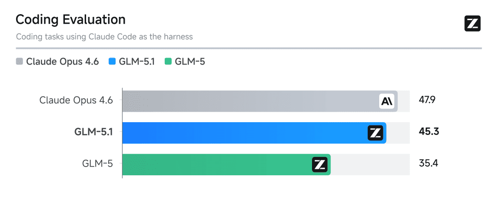
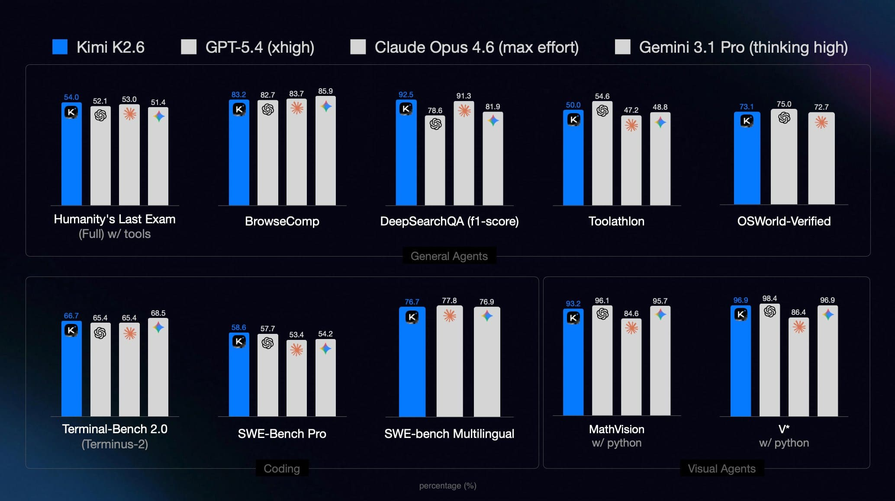

## 背景

今年国产大模型是真的热闹。新模型一出来，宣传话术一个比一个猛。

尤其是最近出来的 GLM 5.1。

还有 Kimi K2.6。

海报和宣传图看着都很唬人，但真到自己拿去干活的时候，往往还是会闻到一点“跑分没输过，实战没稳过”的味道。所以我干脆把最近几个真实使用场景里的体验记了下来。

这篇我主要想聊两件事：一是把它们放进已有项目、已有规范里之后，到底能不能真干活；二是几家国产模型的 Coding Plan 订阅，大概能给多少额度。

这里的 GPT 和 Claude 是通过 VS Code 内置的 Copilot 用的；GLM 5.1 和 Kimi K2.6 则是通过 Kilo Code。测试时 GLM 5.1 的思考强度开到 High，Kimi K2.6 开到 Max。

下面这些结论，不是我对着榜单和宣传页脑补出来的，而是 2026 年 4 月我自己按真实工作流一点点跑出来的。你要是平时的使用场景和我差不多，应该会有点参考价值。

## 实际体验效果

MiniMax M2.5 和千问 3.6 Plus 我之前简单测过。即便是比较简单的任务，也经常出现理解错误或执行中断。和 Kimi、GLM 的差距还是比较明显的——我个人猜测和参数规模有关，参数量差距摆在那儿，再怎么优化也很难完全抹平。所以这次后续对比里，我主要关注的是 Kimi 和 GLM 这两个系列。

这两个模型在日常简单任务里的表现其实都还行。虽然整体上还是打不过 GPT 和 Claude，但价格更容易接受，国内用起来也省心很多。

我这次和很多公开评测不太一样的地方在于：不是让模型从零开始造一个新东西，而是要求它老老实实遵守既有项目的规范、接口风格和设计约束。

很多评测喜欢看“从零造轮子”的效果，但那跟大多数工程团队的真实 AI 使用场景，多少还是有点距离。大语言模型通常在 0 到 1 阶段更容易给人惊艳感，但到了 1 到 100 的增量开发，背景知识更多、历史包袱更重、边界条件也更复杂，模型就更容易出现幻觉和误修。

另外，AI 写出来的代码，在很多情况下比有架构经验的工程师写的代码更难维护。它经常会生成大量“看起来差不多、实际上隐患不少”的相似实现：单元测试也许能过，但里面埋着一些不自己顺逻辑就很难发现的坑。

> 之前我让 Claude Opus 4.7 参考一份 C++ 接入层实现去写一个 Golang 版本，结果它没有限制缓冲区长度，存在溢出风险。
> 断线重连时的 token 验证又刚好被单元测试绕过去了，逻辑其实根本不对。
> 另外它也没有实现恢复期的容灾逻辑，一旦出故障就直接 GG。
> 所以，只要不是写小工具或玩具项目，AI 生成的代码我都建议必须认真 Review。
> 否则它在服务端链路里到处埋坑，平时可能靠“刚好没出事”勉强跑通；一旦某个环节轻微抖动，业务就可能跟着出问题。

这次我让它们干的活，大概是这些：

- 编写一套 AI agent 指令和 skills，告诉 AI 如何访问阿里云 API、如何鉴权、如何查询文档以及文档目录。
- 让大语言模型操作阿里云 SLS 服务，执行以下任务：
  - 分析已有的日志结构和索引；
  - 创建 LogStore 和定时 SQL 任务，用于数据清洗并入库；
  - 补充遗漏字段和索引设置；
  - 创建仪表盘并编写查询语句。

### 第一个场景：自动阅读文档并创建阿里云资源

在编写查询语句和访问 API 这类任务上，GPT 5.4（高思考强度）、Claude Opus 4.7、GLM 5.1 和 Kimi K2.6 基本都没遇到明显问题。
只有一个查询语句里，Kimi K2.6 把原本应该返回多个分组的逻辑写成了 `sum` 聚合，算是一个比较明确的失误。
但有意思的是，所有模型——包括 GPT 5.4（高思考强度）和 Claude Opus 4.7——在第一版 SQL 里，都漏掉了 `JOIN` 相关表的数据范围限制，导致扫描集明显偏大。
好在这类问题在提示一次之后，所有模型都能重新分析并修正到正确方向。

另一个更能拉开差距的问题，是阿里云某个仪表盘的图表单位设置异常。这个问题我分别让 GPT 5.4（高思考强度）、GLM 5.1 和 Kimi K2.6 去处理，谁更能打、谁更容易卡住，基本一下子就看出来了。

| 人工交互阶段 | GPT 5.4（高思考强度）                              | GLM 5.1                                                                    | Kimi K2.6                               |
| ------------ | -------------------------------------------------- | -------------------------------------------------------------------------- | --------------------------------------- |
| 问题提出     | 能分析出大致原因，尝试修复但失败                   | 能分析出大致原因，尝试修复但失败                                           | 能分析出大致原因，尝试修复但失败        |
| 第一次反馈   | 尝试从 UI 可选项中反推设置项，找到正确值后修复成功 | 发现自己第一次分析失败，转而提示用户先设置一个正确样例，再基于样例继续修复 | 能分析出失败原因，但再次尝试仍然失败    |
| 第二次反馈   | -                                                  | 人工修正一个图表后，能把其他有问题的图表一并修对                           | 能分析出失败原因，但再次尝试仍然失败    |
| 第三次反馈   | -                                                  | -                                                                          | Andante 订阅的 5 小时限频耗尽，任务终止 |

### 第二个场景：修复仪表盘错误

Kimi K2.6 创建的图表里，系列标签没有按要求正确显示分组信息。

> 这个问题的起因是阿里云对应的文档页面失效了。也就是说，数据分组本身其实是正常的，SQL 也没写错，问题主要出在图表展示层。

- Kimi K2.6
  - 两次收到错误反馈并尝试修复后，仍然没能修对。
- GLM 5.1
  - 第一次反馈错误后，先通过 API 拉取数据，但拉取流程有问题，最终没拉到任何有效数据。随后又启动浏览器辅助分析。浏览器登录仍然需要我手动完成，并不是全自动流程；最后依然没解决。
  - 第二次通过截图反馈修复失败，但 Kilo Code 没有正确调用 GLM 提供的视觉识别 MCP，导致截图也没分析起来。
  - 第三次反馈修复失败后，我在提示词里额外要求它阅读文档，并自动修复失效文档链接。执行过程中应该触发了 Kilo Code 的 Auto Compact，随后直接卡死。
  - **失败结束**
- GPT 5.4（高思考强度）
  - 第一次反馈错误后，先尝试通过 API 拉取数据进行分析，但修复失败。
  - 第二次反馈修复失败后，改成写死 `series` 的方式。虽然能显示多条线，但不符合“动态拆线”的原始目标，只能算一次有效但不满足需求的尝试。
  - 第三次在我指出不符合需求后，又回退到了原来的实现。
  - 第四次我主动提示“换一种图表试试”之后，它正确分析出了可以使用流图，但把图直接改没了（图表类型字段设置错了）。
  - 第五次我指出图表消失后，它认为是类型参数传错，于是又还原回了之前那个有问题的版本。
  - **失败结束**
- Claude Opus 4.7
  - 第一次反馈错误后，先判断数据本身是正确的。
  - 第二次在我明确“数据没问题，问题出在绘图显示”之后，AI 尝试继续优化，但修复仍然失败。
  - 第三次我主动提示“换一种图表试试”之后，它选了柱状图——这个结论本身就是错的，最终依然没修成。
  - **失败结束**

在没有人工明确提示方向的情况下，这几个模型都没能把问题修掉。

其中 GLM 5.1 还出现过一次卡死（之前我也遇到过其他任务里出现类似情况），这里不排除是 Kilo Code 本身的 Bug。

虽然最后都没解决，但 GPT 5.4 在人工提示后的分析路径基本是对的；Claude Opus 4.7 也在第一次就正确识别出“数据是正确的”这一点。

### 第三个场景：分析 Kilo Code 的模型调用量

- GLM 5
  - 日志里同时存在老版本和新版本的数据记录，但它一次就找到了正确的新版本数据。
- Kimi K2.6
  - 第一次找到的是老版本数据，没法分析出结果；
  - 第二次在提示“新版本数据的位置和格式可能不一样”之后，才能正确找到数据并分析出结果。

> 整个操作过程中，Kimi K2.6 的响应速度最快，明显快于另外两个；GLM 5.1 最慢。

## Coding Plan 额度

虽然各家模型的缓存命中价和未命中价差得很大，但问题在于：你很难知道它到底什么时候命中了缓存。

所以这里我就不再细分“命中缓存”和“未命中缓存”了，直接按正常使用过程里的真实消耗来估算。这样算出来的结果，和我平时实际用下来的体感也更接近。

### 腾讯云和阿里云 Coding Plan

腾讯云和阿里云的 Coding Plan 刚出来那阵子，性价比确实很高，属于典型的“量大管饱”。

以我的使用频率来说，平时并不算高强度，但基本也很难把任何一个限额打到 5% 以上，所以再去放大使用倍率做推算，意义并不大。

这里先贴一下官方文档里现在还能续费的套餐额度，后面就拿它当参照。

| Coding Plan 订阅 | Pro（200 元/月） |
| ---------------- | ---------------- |
| 5 小时限频       | 6000 次          |
| 周限频           | 45000 次         |
| 月限频           | 90000 次         |

### 腾讯云和阿里云 Token Plan

各个云厂商的 Token Plan 价格都贵得离谱。我自己没买过，先放在这里给后面的对比垫个底。

| 腾讯云 Token Plan  | Lite（39 元/月） | Standard（99 元/月） | Pro（299 元/月） | Max（599 元/月） |
| ------------------ | ---------------- | -------------------- | ---------------- | ---------------- |
| 月限制（Token 数） | 35M              | 100M                 | 320M             | 650M             |

### 月之暗面 / Kimi

我之前一直没买 Kimi 会员，因为它官方介绍页里对限额的描述一直比较模糊，总让人感觉有点猫腻。

但现在各大云厂商的 Coding Plan 基本都不怎么更新了，反而都在推更贵得离谱的 Token Plan。

为了摸清新模型到底值不值得买，我这次从最便宜的一档开始，一档一档往上升（由于贫穷，最高档没买，也就没法测），就是想看看它实际到底能给多少用量。

Andante 的额度测试里，我大概两次就消耗掉了 5 小时额度的 166%；Moderato 和 Allegretto 则都是测到周限额约 5%、5 小时限额约 23%。
后面的额度都是按这个比例估出来的，只能大概看看，别当成精确值。

下面的价格我按年付折算成月价来写，这样更接近真实下单时的感受。

| Kimi 会员                           | Andante（39 元/月） | Moderato（79 元/月） | Allegretto（159 元/月） |
| ----------------------------------- | ------------------- | -------------------- | ----------------------- |
| 5 小时限频（预估请求数 / Token 量） | 86 / 3.8M           | 600 / 34M            | 1100 / 101M             |
| 周限频（预估请求数 / Token 量）     | 411 / 18M           | 2820 / 158M          | 5020 / 466M             |
| 4 周限频（预估请求数 / Token 量）   | 1622 / 72M          | 11280 / 632M         | 20080 / 1864M           |

从这组数据看，Kimi 的限额大概率主要是按 Token 量在算。

### 智谱 / GLM

智谱这边我测到的使用情况，大致是 5 小时额度用了 31%，周额度用了 6%。

| 智谱 / GLM                          | Pro（119 元/月；我较早期的订阅价格是 1200 / 年） |
| ----------------------------------- | ------------------------------------------------ |
| 5 小时限频（预估请求数 / Token 量） | 763 / 30M                                        |
| 周限频（预估请求数 / Token 量）     | 4200 / 200M                                      |
| 4 周限频（预估请求数 / Token 量）   | 16800 / 800M                                     |

GLM 看起来也主要是按 Token 量来计算；至少现在页面上展示的核心统计项，也已经是 Token 数了。

## 总结

如果只看我这次这几个真实工作流里的综合表现，我现在个人还是会更偏向 GLM 5.1。
它当然还没到 GPT 和 Claude 那个水平，但如果是拿来做一个国产补充方案，去扛一些不那么深的编码任务，或者那种流程比较长、但难度没那么夸张的任务，基本还是能用的。

我还是挺怀念当初那种“量大管饱”的 Coding Plan，那个时候买起来心里是真的踏实。
之前我一直觉得 Kimi 会员偏贵，但这次真用下来，感觉倒也没有贵得那么离谱。它最大的问题其实不是绝对价格，而是额度描述一直比较模糊，给人的信任感不太够；如果后面再改计算方式，用户也很难第一时间察觉。

单看我这次的粗略估算，Kimi 会员的价格比 GLM 贵 50%，但给到的量大概翻了一倍；如果再把其他附加服务也算进去，那它现在的性价比反而可能还更高一点。

不过现在各家云厂商的 Coding Plan 基本都绝版了，我自己也在犹豫：要是后面一直不更新，是不是干脆退订算了。

总之，这篇不算什么严格评测，更像是一份真实使用记录。要是能帮后面准备选模型、选订阅的人少踩一点坑，那我这轮测试就算没白跑。
