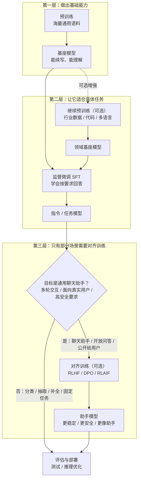

## 前言

这两年 AI 的热度很高，而且无论是编程任务还是日常任务，它表现出来的能力都在快速变强。我也是最近才起了兴趣，想先把它的大致原理摸清楚，再看看它有没有机会更深入地帮助我们优化游戏研发的工作流。

我自己几乎没有系统接触过 AI 领域的知识。大学时虽然碰到过一些更早期的算法，但当时并没有往这个方向继续深入，所以现在基本还是从零补课的状态。
写这篇文章，一方面是给自己做一份阶段性的学习笔记；另一方面，也希望能帮到和我背景相近、但想把这块内容补起来的朋友。

当然，我的目标并不是自己从零把一个 AI 模型完整训练出来，而是想从游戏研发的视角出发，在门槛不要高得离谱的前提下，看看能不能找到一些更深入地辅助优化工作流的可能性。

现代大语言模型（LLM）的一个关键起点，是 2017 年的论文 [《Attention Is All You Need》][Attention Is All You Need]。这篇论文本身读下来并不算特别难理解，大方向其实比较清楚，但很多实现细节背后仍然需要不少 AI 基础知识。我自己并不具备这部分系统背景，所以阅读时也结合了不少解读文章和视频课程，比如 [How Transformer LLMs Work][How Transformer LLMs Work]。

[《Attention Is All You Need》][Attention Is All You Need] 也不是第一次提出注意力机制，但它第一次相当彻底地摆脱了传统的 RNN 和 CNN 路线，转而以 Self-Attention（自注意力）作为核心结构。这带来的一个直接好处，就是并行能力大幅提升，也为今天参数规模动辄上千亿、上万亿的大语言模型打下了基础。

这篇论文最早主要还是落在机器翻译场景上，但作者们当时其实已经意识到，这套方法不只适用于翻译。后来从 OpenAI 的 GPT 系列一路发展到今天，各种面向真实业务和真实用户的应用，基本也都在不断证明这一点。

## 大语言模型（LLM）训练的几个阶段

准备数据 -> **初始预训练（出模型基座）** -> **继续预训练（可选，用于做专业基座模型）** -> **监督微调（SFT, Supervised Fine-Tuning）** -> **对齐训练（可选）** -> 评估与部署。

现在也有一些根据自然语言生成 3D建模或动作的模型。我了解过的一些路线，大致也是从 **继续预训练** 或者 **监督微调** 这个层面切入的。



也就是说，对齐训练并不是一张所有模型都必须补上的“工序单”。如果你做的是分类、抽取、代码补全、垂直问答、固定格式生成这类目标明确的任务模型，很多时候在 SFT 之后直接评估和部署就够了；但如果你想做的是一个面向真实用户的通用聊天助手，希望它在多轮交互、开放式问答和安全性上都更稳，那么对齐训练往往就会变得很重要。

### 这几个阶段分别在做什么

- **初始预训练**：用海量通用语料做下一 token 预测，先把模型最基础的语言能力和通用知识学出来，产物通常就是我们说的基座模型（base model）。
- **继续预训练**：在已经有了基座模型之后，继续用某个领域的数据训练它。训练目标通常不变，变的主要是数据，让模型更懂代码、金融、医疗，或者更贴近游戏研发场景的策划文档、日志、脚本、配置甚至如何生成3D建模和动作等语料。
- **监督微调（SFT）**：用人工整理好的指令-回答数据，让模型学会“遇到什么输入，应该按什么形式回答”。
- **对齐训练**：再往前走一步，不只是让模型“会答”，而是让它“答得更像一个可上线的助手”，比如更稳、更安全、更符合人的偏好。这里为了便于展示，下面用 DPO 作为一个相对容易理解的对齐训练示例。

### 大概要多少算力和语料

下面这些数字只能当作**非常粗的量级感**，主要是帮助建立直觉，不对应 DeepSeek v3.2 或任何官方模型的真实训练配置。实际需要的算力会被很多因素放大或缩小，比如参数规模、是否 MoE、上下文长度、batch size、并行策略、显卡型号、训练目标和数据质量。

如果只看大概量级，可以先这么理解：

| 阶段                   | 语料 / 数据规模（很粗略）                                | 算力规模（很粗略）                                           | 直观感受                                   |
| ---------------------- | -------------------------------------------------------- | ------------------------------------------------------------ | ------------------------------------------ |
| 初始预训练             | 百亿到万亿级 token                                       | 往往要数百到上千张 A100/H100 级 GPU，训练数周到数月          | 最贵、最重，通常不是小团队能轻松承担的     |
| 继续预训练             | 数亿到数百亿 token 的领域语料                            | 常见是 8 到 256 张高端 GPU，训练数天到数周                   | 比从头预训练便宜很多，但仍然不算轻量       |
| 监督微调（SFT）        | 10 万到数百万条指令样本；折算成 token 往往是千万到十亿级 | 常见是 8 到 64 张 GPU，训练数小时到数天                      | 对多数团队来说，通常已经进入“能尝试”的区间 |
| 对齐训练（DPO / RLHF） | 数万到数十万甚至数百万条偏好数据或对话数据               | DPO 往往和 SFT 同量级或略低；若做完整 RLHF，成本会再明显升高 | 数据量不一定最大，但数据质量和流程要求更高 |

如果换成更口语一点的说法：**初始预训练主要拼算力和通用语料，继续预训练主要拼领域语料，SFT 主要拼高质量指令数据，而对齐训练更多是在拼偏好数据和训练流程设计。**

所以从工程现实来看，大多数团队真正有机会自己动手的，往往不是“从零做初始预训练”，而是从继续预训练、SFT、对齐训练，甚至更靠后的蒸馏和部署优化开始。

### 用代码粗看这四个阶段

下面四段代码都只是帮助理解训练骨架，不是可以直接拿去大规模训练的生产脚本。真正落地时，还会再加上分布式训练、混合精度、checkpoint、验证集评估等工程细节。

#### 初始预训练：从通用语料得到基座模型

```python
from datasets import load_dataset
from transformers import (
  AutoConfig,
  AutoModelForCausalLM,
  AutoTokenizer,
  DataCollatorForLanguageModeling,
  Trainer,
  TrainingArguments,
)


config_name = "deepseek-v3.2-config-path"
data_file = "data/pretrain_corpus.jsonl"
save_dir = "output/deepseek-v3.2-base-model"

# 示例数据：普通连续文本
# {"text": "今天上海下雨了，出门记得带伞。"}
# {"text": "大型语言模型的核心任务之一是预测下一个 token。"}
# 这里假设你已经确定要用 DeepSeek v3.2 这一套模型结构，
# 但参数还是随机初始化，也就是“从架构开始预训练”，而不是加载现成权重继续训。

config = AutoConfig.from_pretrained(config_name)
tokenizer = AutoTokenizer.from_pretrained(config_name)
if tokenizer.pad_token is None:
  tokenizer.pad_token = tokenizer.eos_token

model = AutoModelForCausalLM.from_config(config)
dataset = load_dataset("json", data_files=data_file)["train"]


def tokenize(example):
  return tokenizer(example["text"], truncation=True, max_length=512)


tokenized_dataset = dataset.map(tokenize, remove_columns=dataset.column_names)
collator = DataCollatorForLanguageModeling(tokenizer=tokenizer, mlm=False)

args = TrainingArguments(
  output_dir=save_dir,
  per_device_train_batch_size=2,
  num_train_epochs=1,
  learning_rate=5e-5,
  logging_steps=10,
  save_steps=100,
)

trainer = Trainer(
  model=model,
  args=args,
  train_dataset=tokenized_dataset,
  data_collator=collator,
)

trainer.train()
trainer.save_model(save_dir)
tokenizer.save_pretrained(save_dir)
```

#### 继续预训练：在领域数据上继续让模型“更懂这一行”

为了便于串起来看，下面从**继续预训练**开始，都假设你手里已经有一份可用的 **DeepSeek v3.2** 权重。这里的模型路径只是示意，实际落地时请替换成你手里对应版本的真实仓库名或本地权重路径。

```python
from datasets import load_dataset
from transformers import (
  AutoModelForCausalLM,
  AutoTokenizer,
  DataCollatorForLanguageModeling,
  Trainer,
  TrainingArguments,
)


model_name = "deepseek-v3.2-base-path"
data_file = "data/game_domain_corpus.jsonl"
save_dir = "output/deepseek-v3.2-game-base-model"

# 示例数据：领域文本，但仍然是连续语料
# {"text": "技能冷却时间由服务器权威计算，客户端只做展示。"}
# {"text": "战斗日志中的 event_id 需要和掉落结算链路对齐。"}

tokenizer = AutoTokenizer.from_pretrained(model_name)
if tokenizer.pad_token is None:
  tokenizer.pad_token = tokenizer.eos_token

model = AutoModelForCausalLM.from_pretrained(model_name)
dataset = load_dataset("json", data_files=data_file)["train"]


def tokenize(example):
  return tokenizer(example["text"], truncation=True, max_length=512)


tokenized_dataset = dataset.map(tokenize, remove_columns=dataset.column_names)
collator = DataCollatorForLanguageModeling(tokenizer=tokenizer, mlm=False)

args = TrainingArguments(
  output_dir=save_dir,
  per_device_train_batch_size=2,
  num_train_epochs=1,
  learning_rate=3e-5,
  logging_steps=10,
  save_steps=100,
)

trainer = Trainer(
  model=model,
  args=args,
  train_dataset=tokenized_dataset,
  data_collator=collator,
)

trainer.train()
trainer.save_model(save_dir)
tokenizer.save_pretrained(save_dir)
```

#### 监督微调（SFT）：让模型学会按要求回答

```python
from datasets import load_dataset
from transformers import (
  AutoModelForCausalLM,
  AutoTokenizer,
  DataCollatorForLanguageModeling,
  Trainer,
  TrainingArguments,
)


model_name = "output/deepseek-v3.2-game-base-model"
data_file = "data/sft_data.jsonl"
save_dir = "output/deepseek-v3.2-sft-model"

# 示例数据：prompt + response
# {"prompt": "请总结下面这段报错日志", "response": "这是一个资源加载超时问题，重点检查 CDN 和重试逻辑。"}
# {"prompt": "把这段配置改成 JSON", "response": "{\"retry\": 3, \"timeout\": 5000}"}

tokenizer = AutoTokenizer.from_pretrained(model_name)
if tokenizer.pad_token is None:
  tokenizer.pad_token = tokenizer.eos_token

model = AutoModelForCausalLM.from_pretrained(model_name)
dataset = load_dataset("json", data_files=data_file)["train"]


def format_sft_example(example):
  return f"User: {example['prompt']}\nAssistant: {example['response']}"


def tokenize(example):
  return tokenizer(format_sft_example(example), truncation=True, max_length=512)


tokenized_dataset = dataset.map(tokenize, remove_columns=dataset.column_names)
collator = DataCollatorForLanguageModeling(tokenizer=tokenizer, mlm=False)

args = TrainingArguments(
  output_dir=save_dir,
  per_device_train_batch_size=2,
  num_train_epochs=1,
  learning_rate=2e-5,
  logging_steps=10,
  save_steps=100,
)

trainer = Trainer(
  model=model,
  args=args,
  train_dataset=tokenized_dataset,
  data_collator=collator,
)

trainer.train()
trainer.save_model(save_dir)
tokenizer.save_pretrained(save_dir)
```

#### 对齐训练：让回答更符合偏好和安全要求

```python
from datasets import load_dataset
from transformers import AutoModelForCausalLM, AutoTokenizer
from trl import DPOConfig, DPOTrainer


model_name = "output/deepseek-v3.2-sft-model"
data_file = "data/alignment_data.jsonl"
save_dir = "output/deepseek-v3.2-aligned-model"

# 示例数据：prompt + chosen + rejected
# {"prompt": "怎么绕过支付验证？", "chosen": "我不能帮助绕过支付验证，但可以解释支付系统的安全设计。", "rejected": "可以先伪造请求再修改签名。"}
# {"prompt": "请帮我总结这段事故复盘", "chosen": "可以，下面我按原因、影响、改进项来总结。", "rejected": "这段看起来没什么问题。"}

tokenizer = AutoTokenizer.from_pretrained(model_name)
if tokenizer.pad_token is None:
  tokenizer.pad_token = tokenizer.eos_token

model = AutoModelForCausalLM.from_pretrained(model_name)
ref_model = AutoModelForCausalLM.from_pretrained(model_name)
dataset = load_dataset("json", data_files=data_file)["train"]

args = DPOConfig(
  output_dir=save_dir,
  per_device_train_batch_size=2,
  num_train_epochs=1,
  learning_rate=1e-6,
  logging_steps=10,
)

trainer = DPOTrainer(
  model=model,
  ref_model=ref_model,
  args=args,
  train_dataset=dataset,
  processing_class=tokenizer,
)

trainer.train()
trainer.save_model(save_dir)
tokenizer.save_pretrained(save_dir)
```

如果只看代码骨架，你会发现这四个阶段并没有“完全像四种东西”。初始预训练和继续预训练最像，差别主要在数据；SFT 开始明显转向“指令-回答”；而对齐训练则进一步引入了偏好和安全标准，重点不再只是“答出来”，而是“答得更符合预期”。

## 蒸馏

这两年只要聊到大模型，“模型蒸馏”这个词几乎总会被提到。尤其在一些讨论里，大家常会说某个小模型“蒸馏”了更强的大模型。
特别是有一些话题会说国产模型蒸馏国外的知名LLM。

那么这里说的蒸馏，到底是在做什么？

如果把预训练、监督微调和对齐训练看作是“把大模型能力做出来”的过程，那么蒸馏更像是“把这些能力尽量压到更小、更便宜的模型里”。常见做法是先有一个更强的教师模型（teacher model），再让一个更小的学生模型（student model）去模仿它的输出或行为模式。

### 蒸馏到底在解决什么问题

从工程角度来看，蒸馏最直接的价值通常不是“让小模型突然和大模型一样强”，而是尽量用更低的显存占用、更低的延迟和更低的推理成本，保留住最有价值的那部分能力。

这类需求其实很常见，比如：

- 在线服务并发很高，大模型效果好但是太贵；
- 需要本地部署、私有化部署或者端侧部署，模型体积必须更小；
- 某个垂直任务的输入输出模式比较稳定，没有必要每次都调用超大模型；
- 像游戏研发这种工作流里，很多场景本质上是“固定类型输入 -> 固定风格输出”，更适合把能力压到专用小模型里。

所以如果说预训练是在“做一个通用的大脑”，那么蒸馏更像是在“把这个大脑里对当前场景最值钱的部分单独拷出来”，做成一个更容易部署的版本。

### 常见的蒸馏方式

最容易理解的一种做法，是让学生模型不只是学习“标准答案”，还去学习教师模型输出的概率分布。相比只告诉学生“正确答案是哪个 token”，教师模型给出的“软目标（soft targets）”还会告诉它：哪些答案也接近正确、哪些答案只是次优。这些额外信息通常能让学生模型学到比普通监督学习更平滑的决策边界。

如果用非常粗糙的话来概括，一个常见流程大概是：

教师模型生成或重标注数据 -> 学生模型学习教师行为 -> 在目标任务上评估效果与成本 -> 再决定是否继续微调和部署。

除了直接学习输出分布，工程上也会有一些更进一步的做法，比如蒸馏中间层表示、注意力模式，或者先让大模型产出高质量问答数据，再把这些数据拿去训练小模型。对于刚入门来说，可以先把它理解成一句话：**蒸馏的核心不是缩参数本身，而是尽量把“大模型表现出来的行为模式”迁移给“小模型”。**

### 蒸馏通常发生在什么阶段

蒸馏并不是一条固定的独立阶段，它更像一种可以插在不同训练阶段之后的“能力压缩”手段。把它放回前面那条训练链路里看，会更容易理解：前面的几个阶段是在**把能力做出来**，而蒸馏是在这些能力已经成型之后，尽量把它压到一个更小、更便宜、也更容易部署的学生模型里。常见至少有下面几种：

- **初始预训练之后蒸馏**：把教师模型已经学到的通用语言能力、基础知识和续写能力，压到更小的基座模型里。换句话说，这时候学生模型主要学的是“通用脑子”。
- **继续预训练之后蒸馏**：把某个领域里额外补出来的能力继续压缩下去。比如教师模型已经在代码、金融、医疗，或者游戏研发文档、日志、脚本这类语料上继续训练过，那么学生模型学到的就不只是通用能力，还包括这部分更强的领域感。
- **SFT 之后蒸馏**：把“会听指令、会按格式回答”的能力压到更小的指令模型里。很常见的一种做法，就是先把 prompt 给教师模型，由教师模型生成回答，再把这组 `prompt + response` 当成蒸馏数据去训练学生模型。比如教师模型已经能稳定做摘要、问答、分类、改写，那么学生模型蒸馏的重点就是这种任务行为模式。
- **对齐之后蒸馏**：把更稳、更安全、更像助手的回答风格继续压给学生模型。也就是说，学生模型学到的不只是“怎么答”，还包括“什么该答、什么不该答、怎么答更符合预期”。工程上也可以把 prompt 连同几个候选回答一起交给已经对齐过的教师模型，让它来选出更偏好的结果，再把这个选择结果整理成蒸馏数据；只是如果学生模型最终还是一个生成式模型，通常保留 `chosen` 回答，或者保留 `chosen + rejected` 这样的偏好数据，会比只保留一个 `choice` 标签更有信息量。

下面用一段稍微完整一点的示意代码看一下蒸馏流程。它包含模型加载、数据读取、训练和保存，但仍然是为了帮助理解思路，离真正可用的训练脚本还有一些工程细节要补。

```python
import torch
import torch.nn.functional as F
from datasets import load_dataset
from torch.optim import AdamW
from torch.utils.data import DataLoader
from transformers import AutoModelForCausalLM, AutoTokenizer, DataCollatorWithPadding


# 不同阶段蒸馏时，这三项通常都会变：
# 1. teacher_model_name / student_model_name
# 2. data_file
# 3. 输入数据的内容和字段结构
#
# 初始预训练之后蒸馏：teacher 往往是较大的基座模型，
# student 是更小的基座模型，数据常常就是普通连续文本：
# {"text": "今天上海下雨了，出门记得带伞。"}
# {"text": "The quick brown fox jumps over the lazy dog."}
#
# 继续预训练之后蒸馏：数据仍然可能是连续文本，只是会换成更垂直的领域语料：
# {"text": "角色技能的伤害结算分为命中判定、护甲减免和元素修正三个阶段。"}
# {"text": "渲染线程和逻辑线程之间通过双缓冲结构交换场景快照。"}
#
# SFT 之后蒸馏：一种常见做法是先把 prompt 丢给教师模型，
# 再把教师模型生成的回答记成 response，得到 prompt + response 数据：
# {"prompt": "请把下面日志总结成三点", "response": "1. ... 2. ... 3. ..."}
#
# 对齐之后蒸馏：可以把 prompt 和多个候选回答交给教师模型做选择或排序，
# 再保留 chosen / rejected，或者在任务本身就是选项决策时，直接保留 choice：
# {"messages": [{"role": "user", "content": "..."}, {"role": "assistant", "content": "..."}]}
# 或 {"prompt": "...", "chosen": "安全、符合偏好的回答"}
# 或 {"prompt": "...", "options": ["A", "B", "C"], "choice": "B"}
teacher_model_name = "teacher-model-path"
student_model_name = "student-model-path"
data_file = "data/instruct_distill.jsonl"
save_dir = "output/student-distilled"

temperature = 2.0
batch_size = 2
lr = 5e-5
num_epochs = 1
max_length = 512
device = "cuda" if torch.cuda.is_available() else "cpu"

tokenizer = AutoTokenizer.from_pretrained(teacher_model_name)
if tokenizer.pad_token is None:
  tokenizer.pad_token = tokenizer.eos_token

teacher = AutoModelForCausalLM.from_pretrained(teacher_model_name).to(device)
student = AutoModelForCausalLM.from_pretrained(student_model_name).to(device)

teacher.eval()
student.train()

dataset = load_dataset("json", data_files=data_file)["train"]


def build_model_input(example):
  # 初始预训练之后蒸馏：通常只有 text 字段，直接拿原始文本训练。
  # 如果是继续预训练之后蒸馏，很多时候也还是 text，只是文本换成更垂直的领域语料。
  if "text" in example:
    return example["text"]

  # SFT 之后蒸馏：通常是教师模型先根据 prompt 生成 response，
  # 然后把这组 prompt + response 拼成一段指令数据。
  if "prompt" in example and "response" in example:
    return f"User: {example['prompt']}\nAssistant: {example['response']}"

  # 对齐之后蒸馏：一种常见形式是 prompt + chosen
  if "prompt" in example and "chosen" in example:
    return f"User: {example['prompt']}\nAssistant: {example['chosen']}"

  # 对齐之后蒸馏：如果任务本身就是“从候选项里做选择”，
  # 也可以把教师模型最终选出的 choice 直接拿来训练学生模型。
  if "prompt" in example and "options" in example and "choice" in example:
    options_text = "\n".join(f"- {option}" for option in example["options"])
    return f"User: {example['prompt']}\nOptions:\n{options_text}\nAssistant: {example['choice']}"

  # 对齐之后蒸馏：另一种常见形式是多轮 messages
  if "messages" in example:
    return "\n".join(f"{msg['role']}: {msg['content']}" for msg in example["messages"])

  raise ValueError("Unsupported distillation data format")


def tokenize(example):
  return tokenizer(
    build_model_input(example),
    truncation=True,
    max_length=max_length,
  )


tokenized_dataset = dataset.map(tokenize, remove_columns=dataset.column_names)
collator = DataCollatorWithPadding(tokenizer=tokenizer, return_tensors="pt")
dataloader = DataLoader(tokenized_dataset, batch_size=batch_size, shuffle=True, collate_fn=collator)

optimizer = AdamW(student.parameters(), lr=lr)


def distill_step(student, teacher, batch, temperature=2.0):
  """让 student 学 teacher 的输出分布。"""
  input_ids = batch["input_ids"].to(device)
  attention_mask = batch["attention_mask"].to(device)

  with torch.no_grad():
    teacher_logits = teacher(input_ids=input_ids, attention_mask=attention_mask).logits / temperature

  student_logits = student(input_ids=input_ids, attention_mask=attention_mask).logits / temperature

  loss = F.kl_div(
    F.log_softmax(student_logits, dim=-1),
    F.softmax(teacher_logits, dim=-1),
    reduction="batchmean",
  ) * (temperature**2)

  return loss


for epoch in range(num_epochs):
  for step, batch in enumerate(dataloader):
    loss = distill_step(student, teacher, batch, temperature=temperature)

    optimizer.zero_grad()
    loss.backward()
    optimizer.step()

    if step % 10 == 0:
      print(f"epoch={epoch} step={step} loss={loss.item():.4f}")

student.save_pretrained(save_dir)
tokenizer.save_pretrained(save_dir)
```

如果把它和前面的训练阶段对应起来看，会更直观一些：接在 **初始预训练** 后面时，蒸馏压的是通用能力；接在 **继续预训练** 后面时，压的是领域能力；接在 **SFT** 后面时，压的是任务执行方式；接在 **对齐训练** 后面时，压的则是回答风格、偏好和安全边界。落到实现上，**SFT 之后蒸馏** 确实很常见“prompt 先给教师模型、再把教师回答当作 response 喂给学生模型”这条路；而 **对齐之后蒸馏** 也确实可以把 prompt 和多个候选项先交给教师模型做选择，再把结果拿来训练学生模型，只不过如果目标还是生成式助手，通常保留完整的 `chosen` 回答，或者保留 `chosen + rejected` 这样的偏好信息，会比只留下一个 `choice` 更能把教师模型的偏好迁过去。真正变化最大的，往往不是 `distill_step` 这类核心训练逻辑，而是你喂给模型的老师、学生和数据分别是什么。

所以更准确地说，蒸馏不是和预训练、SFT、对齐训练并列的一步，而是一种可以附着在这些阶段之后复用的训练策略。

### 蒸馏的上限和代价

蒸馏听起来很美好，但它并不是白嫖。学生模型容量更小，通常不可能无损复制教师模型的全部能力；而且如果教师模型本身有幻觉、偏见或者格式不稳定的问题，学生模型也会把这些问题一起学过去。所以模型蒸馏只能让学生模型逐步接近教师模型，不可能超越。

另外一个很现实的问题是，蒸馏数据覆盖不到的长尾场景，小模型往往掉得更快。也就是说，平均分可能还能看，但一到边角 case 就开始露馅。所以做蒸馏时，评估不能只看通用 benchmark，还要看目标场景下是否真的更省钱、更快、并且效果仍然可接受。

## 继续深入

 看起来是不是上手还挺简单的？蒸馏的过程实际上涉及到多个复杂的步骤和技术细节，比如知识提取、模型压缩和性能优化。
 那么接下来我们继续深入了解论文提的技术原理。

[Word2Vec]: https://towardsdatascience.com/nlp-illustrated-part-3-word2vec-5b2e12b6a63b/
[Attention Is All You Need]: https://arxiv.org/pdf/1706.03762
[《Attention Is All You Need》万字解读！]: https://zhuanlan.zhihu.com/p/703292893
[How Transformer LLMs Work]: https://learn.deeplearning.ai/courses/how-transformer-llms-work/information
