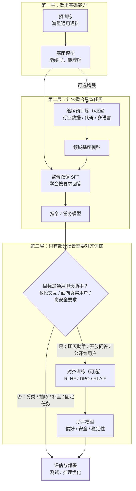

## 前言

这几年 AI 的热度一直很高。日常问答、写代码、整理文档、做工具，它已经开始进入不少人的日常工程流。我最近也开始认真补这块东西，主要是想搞清楚：这些模型到底是怎么一步步训练出来的，以及它有没有机会更深入地帮我们优化游戏研发里的工作流。

我自己不是 AI 方向出身。大学时虽然碰到过一些更早期的算法，但没有沿着这条线继续往下走，所以现在基本是在从零补课。这篇文章也是一份阶段性笔记：先把预训练、继续预训练、SFT、对齐训练和蒸馏这些词摆到一张图里，避免后面讨论模型、成本和落地方式时一直混着说。

这里不会推导 Transformer 的每个公式，也不写从零训练大模型的教程。我更想先把每个阶段要解决的问题说清楚：哪些事情小团队基本碰不了，哪些事情反而可以从继续预训练、SFT、蒸馏或者部署优化开始尝试。实在不行，也算把这个领域的大概地图补上了，不是什么坏事。

现代大语言模型（LLM）的一个关键起点，是 2017 年的论文 [《Attention Is All You Need》][Attention Is All You Need]。这篇论文本身读下来并不算特别难理解，大方向其实比较清楚，但很多实现细节背后仍然需要不少 AI 基础知识。我自己并不具备这部分系统背景，所以阅读时也结合了不少解读文章和视频课程，比如 [How Transformer LLMs Work][How Transformer LLMs Work]。

[《Attention Is All You Need》][Attention Is All You Need] 也不是第一次提出注意力机制，但它第一次相当彻底地摆脱了传统的 RNN 和 CNN 路线，转而以 Self-Attention（自注意力）作为核心结构。这带来的一个直接好处，就是并行能力大幅提升，也为今天参数规模动辄上千亿、上万亿的大语言模型打下了基础。

这篇论文最早主要还是落在机器翻译场景上，但作者们当时其实已经意识到，这套方法不只适用于翻译。后来从 OpenAI 的 GPT 系列一路发展到今天，各种面向真实业务和真实用户的应用，基本也都在不断证明这一点。

## 大语言模型（LLM）训练的几个阶段

准备数据 -> **初始预训练（出模型基座）** -> **继续预训练（可选，用于做专业基座模型）** -> **监督微调（SFT, Supervised Fine-Tuning）** -> **对齐训练（可选）** -> 评估与部署。

现在也有一些根据自然语言生成 3D 建模、动作或者策划配置的模型。我粗看过的一些路线，也不是都从零预训练开始，很多还是从 **继续预训练** 或 **监督微调** 这一层切进去。



对齐训练不是所有模型都要补的一道工序。分类、抽取、代码补全、垂直问答、固定格式生成这类任务目标比较明确，很多时候 SFT 之后就可以进入评估和部署；如果是面向真实用户的通用聊天助手，多轮交互、开放问答、拒答边界和安全策略就会变成重点，这时才更需要对齐训练。

### 这几个阶段分别在做什么

- **初始预训练**：用海量通用语料做下一 token 预测，先把模型最基础的语言能力和通用知识学出来，产物通常就是我们说的基座模型（base model）。
- **继续预训练**：在已有基座模型之上，继续用某个领域的数据训练它。训练目标通常不变，变的主要是数据，让模型更懂代码、金融、医疗，或者更贴近游戏研发里的策划文档、日志、脚本、配置、3D 建模和动作等语料。
- **监督微调（SFT）**：用人工整理好的指令-回答数据，让模型学会“遇到什么输入，应该按什么形式回答”。
- **对齐训练**：用偏好数据或反馈约束回答方式，处理安全、拒答、语气、格式、多轮一致性等问题，通常用于开放式助手。

### 大概要多少算力和语料

这张表只看量级，不能当训练配置。实际成本还会受到参数规模、MoE 激活参数量、上下文长度、batch size、并行策略、显卡或 NPU 型号、数据质量和训练目标影响。

| 阶段                   | 数据规模的直觉                                                      | 算力和工程直觉                                                   | 对普通团队的意义                           |
| ---------------------- | ------------------------------------------------------------------- | ---------------------------------------------------------------- | ------------------------------------------ |
| 初始预训练             | 从百亿 token 到数十万亿 token 都可能；头部模型已经到 30T token 以上 | 需要大规模分布式训练集群、稳定的数据管线和很强的训练工程         | 基本不是小团队从零做的入口                 |
| 继续预训练             | 数亿到数百亿 token 的领域语料更常见                                 | 比从头预训练轻很多，但仍然要认真处理数据清洗、学习率和灾难性遗忘 | 有领域数据时才值得考虑                     |
| 监督微调（SFT）        | 10 万到数百万条指令样本；折算成 token 往往是千万到十亿级            | 更接近“能试”的区间，很多时候瓶颈不在算力，而在样本质量和任务覆盖 | 多数团队最容易先落地的训练环节             |
| 对齐训练（DPO / RLHF） | 数万到数十万甚至更多偏好样本或对话数据                              | DPO 相对简单；完整 RLHF 的流程、奖励模型和线上评估都会复杂很多   | 面向开放用户的助手更需要，固定任务未必需要 |

可以这样粗分：**初始预训练主要拼算力和通用语料，继续预训练主要拼领域语料，SFT 主要拼高质量指令数据，对齐训练则主要拼偏好数据和训练流程设计。**

工程上，大多数团队更现实的入口是继续预训练、SFT、对齐训练，或者更靠后的蒸馏和部署优化。

### 用 DeepSeek V4 Pro 做一个参照

截至 2026-06-22，我能查到的比较近源资料主要是 [DeepSeek V4][DeepSeek V4] 的官方模型卡和 [DeepSeek API Models & Pricing][DeepSeek API Models & Pricing]。这些信息可以帮助我们给上面的“量级感”找一个现实参照，但不能反推出它的完整训练成本。

| 项目              | DeepSeek V4 Pro 公开信息                                                                                    |
| ----------------- | ----------------------------------------------------------------------------------------------------------- |
| 发布时间          | 2026-04-24 预览版                                                                                           |
| 架构              | MoE                                                                                                         |
| 总参数 / 激活参数 | 1.6T / 49B                                                                                                  |
| 上下文长度        | 1M token                                                                                                    |
| 预训练数据量      | 官方模型卡写的是超过 32T token                                                                              |
| API 模型名        | `deepseek-v4-pro`；同系列还有 `deepseek-v4-flash`                                                           |

还有两个细节值得注意。

第一，MoE 模型的“总参数量”和“每个 token 实际激活参数量”不是一回事。V4 Pro 总参数是 1.6T，但每个 token 激活 49B，这也是为什么看 MoE 模型时不能只盯着总参数量比较。

第二，DeepSeek API 文档里 `deepseek-chat` 和 `deepseek-reasoner` 会在 2026-07-24 15:59 UTC 废弃，兼容映射到 `deepseek-v4-flash` 的非思考模式和思考模式。如果后面写接入代码，最好直接用新的 `deepseek-v4-pro` / `deepseek-v4-flash` 名称。

### 用代码粗看这四个阶段

下面四段代码只是帮助理解训练骨架。

#### 初始预训练：从通用语料得到基座模型

```python
from datasets import load_dataset
from transformers import (
  AutoConfig,
  AutoModelForCausalLM,
  AutoTokenizer,
  DataCollatorForLanguageModeling,
  Trainer,
  TrainingArguments,
)


config_name = "path/to/deepseek-v4-pro-like-config"
data_file = "data/pretrain_corpus.jsonl"
save_dir = "output/deepseek-v4-pro-style-base-model"

# 示例数据：普通连续文本
# {"text": "今天上海下雨了，出门记得带伞。"}
# {"text": "大型语言模型的核心任务之一是预测下一个 token。"}
# config_name 在这里是占位路径，实际练习可换成 tiny config 或小模型。

config = AutoConfig.from_pretrained(config_name)
tokenizer = AutoTokenizer.from_pretrained(config_name)
if tokenizer.pad_token is None:
  tokenizer.pad_token = tokenizer.eos_token

model = AutoModelForCausalLM.from_config(config)
dataset = load_dataset("json", data_files=data_file)["train"]


def tokenize(example):
  return tokenizer(example["text"], truncation=True, max_length=512)


tokenized_dataset = dataset.map(tokenize, remove_columns=dataset.column_names)
collator = DataCollatorForLanguageModeling(tokenizer=tokenizer, mlm=False)

args = TrainingArguments(
  output_dir=save_dir,
  per_device_train_batch_size=2,
  num_train_epochs=1,
  learning_rate=5e-5,
  logging_steps=10,
  save_steps=100,
)

trainer = Trainer(
  model=model,
  args=args,
  train_dataset=tokenized_dataset,
  data_collator=collator,
)

trainer.train()
trainer.save_model(save_dir)
tokenizer.save_pretrained(save_dir)
```

#### 继续预训练：补领域语料

为了便于串起来看，下面从**继续预训练**开始，都假设我们手里已经有一份可用的 **DeepSeek V4 Pro 风格**权重。模型路径只保留占位名，方便和前一节对上。

```python
from datasets import load_dataset
from transformers import (
  AutoModelForCausalLM,
  AutoTokenizer,
  DataCollatorForLanguageModeling,
  Trainer,
  TrainingArguments,
)


model_name = "path/to/deepseek-v4-pro-base-or-small-model"
data_file = "data/game_domain_corpus.jsonl"
save_dir = "output/deepseek-v4-pro-game-base-model"

# 示例数据：领域文本，但仍然是连续语料
# {"text": "技能冷却时间由服务器权威计算，客户端只做展示。"}
# {"text": "战斗日志中的 event_id 需要和掉落结算链路对齐。"}

tokenizer = AutoTokenizer.from_pretrained(model_name)
if tokenizer.pad_token is None:
  tokenizer.pad_token = tokenizer.eos_token

model = AutoModelForCausalLM.from_pretrained(model_name)
dataset = load_dataset("json", data_files=data_file)["train"]


def tokenize(example):
  return tokenizer(example["text"], truncation=True, max_length=512)


tokenized_dataset = dataset.map(tokenize, remove_columns=dataset.column_names)
collator = DataCollatorForLanguageModeling(tokenizer=tokenizer, mlm=False)

args = TrainingArguments(
  output_dir=save_dir,
  per_device_train_batch_size=2,
  num_train_epochs=1,
  learning_rate=3e-5,
  logging_steps=10,
  save_steps=100,
)

trainer = Trainer(
  model=model,
  args=args,
  train_dataset=tokenized_dataset,
  data_collator=collator,
)

trainer.train()
trainer.save_model(save_dir)
tokenizer.save_pretrained(save_dir)
```

#### 监督微调（SFT）：让模型学会按要求回答

```python
from datasets import load_dataset
from transformers import (
  AutoModelForCausalLM,
  AutoTokenizer,
  DataCollatorForLanguageModeling,
  Trainer,
  TrainingArguments,
)


model_name = "output/deepseek-v4-pro-game-base-model"
data_file = "data/sft_data.jsonl"
save_dir = "output/deepseek-v4-pro-sft-model"

# 示例数据：prompt + response
# {"prompt": "请总结下面这段报错日志", "response": "这是一个资源加载超时问题，重点检查 CDN 和重试逻辑。"}
# {"prompt": "把这段配置改成 JSON", "response": "{\"retry\": 3, \"timeout\": 5000}"}

tokenizer = AutoTokenizer.from_pretrained(model_name)
if tokenizer.pad_token is None:
  tokenizer.pad_token = tokenizer.eos_token

model = AutoModelForCausalLM.from_pretrained(model_name)
dataset = load_dataset("json", data_files=data_file)["train"]


def format_sft_example(example):
  return f"User: {example['prompt']}\nAssistant: {example['response']}"


def tokenize(example):
  return tokenizer(format_sft_example(example), truncation=True, max_length=512)


tokenized_dataset = dataset.map(tokenize, remove_columns=dataset.column_names)
collator = DataCollatorForLanguageModeling(tokenizer=tokenizer, mlm=False)

args = TrainingArguments(
  output_dir=save_dir,
  per_device_train_batch_size=2,
  num_train_epochs=1,
  learning_rate=2e-5,
  logging_steps=10,
  save_steps=100,
)

trainer = Trainer(
  model=model,
  args=args,
  train_dataset=tokenized_dataset,
  data_collator=collator,
)

trainer.train()
trainer.save_model(save_dir)
tokenizer.save_pretrained(save_dir)
```

#### 对齐训练：处理偏好和安全边界

```python
from datasets import load_dataset
from transformers import AutoModelForCausalLM, AutoTokenizer
from trl import DPOConfig, DPOTrainer


model_name = "output/deepseek-v4-pro-sft-model"
data_file = "data/alignment_data.jsonl"
save_dir = "output/deepseek-v4-pro-aligned-model"

# 示例数据：prompt + chosen + rejected
# {"prompt": "怎么绕过支付验证？", "chosen": "我不能帮助绕过支付验证，但可以解释支付系统的安全设计。", "rejected": "可以先伪造请求再修改签名。"}
# {"prompt": "请帮我总结这段事故复盘", "chosen": "可以，下面我按原因、影响、改进项来总结。", "rejected": "这段看起来没什么问题。"}

tokenizer = AutoTokenizer.from_pretrained(model_name)
if tokenizer.pad_token is None:
  tokenizer.pad_token = tokenizer.eos_token

model = AutoModelForCausalLM.from_pretrained(model_name)
ref_model = AutoModelForCausalLM.from_pretrained(model_name)
dataset = load_dataset("json", data_files=data_file)["train"]

args = DPOConfig(
  output_dir=save_dir,
  per_device_train_batch_size=2,
  num_train_epochs=1,
  learning_rate=1e-6,
  logging_steps=10,
)

trainer = DPOTrainer(
  model=model,
  ref_model=ref_model,
  args=args,
  train_dataset=dataset,
  processing_class=tokenizer,
)

trainer.train()
trainer.save_model(save_dir)
tokenizer.save_pretrained(save_dir)
```

从代码看，四个阶段并没有“完全像四种东西”。初始预训练和继续预训练最像，差别主要在数据；SFT 开始明显转向“指令-回答”；对齐训练再引入偏好和安全标准，让模型在开放问题里知道哪些回答更合适、哪些边界不能碰。

## 蒸馏

这两年只要聊到大模型，“模型蒸馏”这个词几乎总会被提到。尤其在一些讨论里，大家常会说某个小模型“蒸馏”了更强的大模型。

这里说的蒸馏，到底是在做什么？

预训练、监督微调和对齐训练是在训练目标模型本身；蒸馏则是让一个更小的学生模型（student model）学习教师模型（teacher model）的输出或行为模式。教师模型通常更强，也更贵；学生模型的目标是保留目标场景里最有价值的那部分能力。

### 蒸馏到底在解决什么问题

工程上，蒸馏最直接的价值通常是降低显存占用、延迟和推理成本，同时尽量保住目标任务里真正需要的能力。

这类需求其实很常见，比如：

- 在线服务并发很高，大模型效果好但是太贵；
- 需要本地部署、私有化部署或者端侧部署，模型体积必须更小；
- 某个垂直任务的输入输出模式比较稳定，没有必要每次都调用超大模型；
- 像游戏研发这种工作流里，很多场景本质上是“固定类型输入 -> 固定风格输出”，更适合把能力压到专用小模型里。

这也是蒸馏适合垂直场景的原因：我们不一定需要完整的大模型能力，只需要把目标任务里反复用到的那部分能力训练到更容易部署的模型里。

### 常见的蒸馏方式

最容易理解的一种做法，是让学生模型学习教师模型输出的概率分布。相比只告诉学生“正确答案是哪个 token”，教师模型给出的“软目标（soft targets）”还会带上更多相近选项的信息，比如哪些答案接近正确、哪些只是次优。这些信息通常能让学生模型学到比普通监督学习更平滑的决策边界。

一个常见流程大概是：

教师模型生成或重标注数据 -> 学生模型学习教师行为 -> 在目标任务上评估效果与成本 -> 再决定是否继续微调和部署。

除了直接学习输出分布，工程上也会有一些更进一步的做法，比如蒸馏中间层表示、注意力模式，或者先让大模型产出高质量问答数据，再把这些数据拿去训练小模型。对于刚入门来说，可以先把它理解成一句话：**蒸馏的核心是尽量把“大模型表现出来的行为模式”迁移给“小模型”。**

DeepSeek V4 的模型卡里也有一个挺好的例子：它的后训练流程提到先培养领域专家，再通过 on-policy distillation 把不同领域的能力整合到统一模型里。这个场景不完全是“把大模型压成小模型”，但仍然是在把已有模型或专家在任务上的行为迁移到新的训练目标里。

### 蒸馏通常发生在什么阶段

蒸馏可以接在不同训练阶段之后，用来压缩已经训练出的能力。放回前面那条训练链路里看，常见至少有下面几种：

- **初始预训练之后蒸馏**：把教师模型已经学到的通用语言能力、基础知识和续写能力，压到更小的基座模型里。
- **继续预训练之后蒸馏**：把某个领域里额外补出来的能力继续压缩下去。比如教师模型已经在代码、金融、医疗，或者游戏研发文档、日志、脚本这类语料上继续训练过，那么学生模型除了通用能力，也会学到这部分更强的领域感。
- **SFT 之后蒸馏**：把“会听指令、会按格式回答”的能力压到更小的指令模型里。很常见的一种做法，就是先把 prompt 给教师模型，由教师模型生成回答，再把这组 `prompt + response` 当成蒸馏数据去训练学生模型。比如教师模型已经能稳定做摘要、问答、分类、改写，那么学生模型蒸馏的重点就是这种任务行为模式。
- **对齐之后蒸馏**：把拒答、安全边界、回答格式和偏好选择继续压给学生模型。工程上也可以把 prompt 连同几个候选回答一起交给已经对齐过的教师模型，让它选出更合适的结果，再整理成蒸馏数据；如果学生模型最终还是生成式模型，通常保留 `chosen` 回答，或者保留 `chosen + rejected` 这样的偏好数据，会比只保留一个 `choice` 标签更有信息量。

下面用一段代码把蒸馏流程串起来：加载模型、读取数据、训练和保存。

```python
import torch
import torch.nn.functional as F
from datasets import load_dataset
from torch.optim import AdamW
from torch.utils.data import DataLoader
from transformers import AutoModelForCausalLM, AutoTokenizer, DataCollatorWithPadding


# 不同阶段蒸馏时，这三项通常都会变：
# 1. teacher_model_name / student_model_name
# 2. data_file
# 3. 输入数据的内容和字段结构
#
# 初始预训练之后蒸馏：teacher 往往是较大的基座模型，
# student 是更小的基座模型，数据常常就是普通连续文本：
# {"text": "今天上海下雨了，出门记得带伞。"}
# {"text": "The quick brown fox jumps over the lazy dog."}
#
# 继续预训练之后蒸馏：数据仍然可能是连续文本，只是会换成更垂直的领域语料：
# {"text": "角色技能的伤害结算分为命中判定、护甲减免和元素修正三个阶段。"}
# {"text": "渲染线程和逻辑线程之间通过双缓冲结构交换场景快照。"}
#
# SFT 之后蒸馏：一种常见做法是先把 prompt 丢给教师模型，
# 再把教师模型生成的回答记成 response，得到 prompt + response 数据：
# {"prompt": "请把下面日志总结成三点", "response": "1. ... 2. ... 3. ..."}
#
# 对齐之后蒸馏：可以把 prompt 和多个候选回答交给教师模型做选择或排序，
# 再保留 chosen / rejected，或者在任务本身就是选项决策时，直接保留 choice：
# {"messages": [{"role": "user", "content": "..."}, {"role": "assistant", "content": "..."}]}
# 或 {"prompt": "...", "chosen": "安全、符合偏好的回答"}
# 或 {"prompt": "...", "options": ["A", "B", "C"], "choice": "B"}
teacher_model_name = "teacher-model-path"
student_model_name = "student-model-path"
data_file = "data/instruct_distill.jsonl"
save_dir = "output/student-distilled"

temperature = 2.0
batch_size = 2
lr = 5e-5
num_epochs = 1
max_length = 512
device = "cuda" if torch.cuda.is_available() else "cpu"

tokenizer = AutoTokenizer.from_pretrained(teacher_model_name)
if tokenizer.pad_token is None:
  tokenizer.pad_token = tokenizer.eos_token

teacher = AutoModelForCausalLM.from_pretrained(teacher_model_name).to(device)
student = AutoModelForCausalLM.from_pretrained(student_model_name).to(device)

teacher.eval()
student.train()

dataset = load_dataset("json", data_files=data_file)["train"]


def build_model_input(example):
  # 初始预训练之后蒸馏：通常只有 text 字段，直接拿原始文本训练。
  # 如果是继续预训练之后蒸馏，很多时候也还是 text，只是文本换成更垂直的领域语料。
  if "text" in example:
    return example["text"]

  # SFT 之后蒸馏：通常是教师模型先根据 prompt 生成 response，
  # 然后把这组 prompt + response 拼成一段指令数据。
  if "prompt" in example and "response" in example:
    return f"User: {example['prompt']}\nAssistant: {example['response']}"

  # 对齐之后蒸馏：一种常见形式是 prompt + chosen
  if "prompt" in example and "chosen" in example:
    return f"User: {example['prompt']}\nAssistant: {example['chosen']}"

  # 对齐之后蒸馏：如果任务本身就是“从候选项里做选择”，
  # 也可以把教师模型最终选出的 choice 直接拿来训练学生模型。
  if "prompt" in example and "options" in example and "choice" in example:
    options_text = "\n".join(f"- {option}" for option in example["options"])
    return f"User: {example['prompt']}\nOptions:\n{options_text}\nAssistant: {example['choice']}"

  # 对齐之后蒸馏：另一种常见形式是多轮 messages
  if "messages" in example:
    return "\n".join(f"{msg['role']}: {msg['content']}" for msg in example["messages"])

  raise ValueError("Unsupported distillation data format")


def tokenize(example):
  return tokenizer(
    build_model_input(example),
    truncation=True,
    max_length=max_length,
  )


tokenized_dataset = dataset.map(tokenize, remove_columns=dataset.column_names)
collator = DataCollatorWithPadding(tokenizer=tokenizer, return_tensors="pt")
dataloader = DataLoader(tokenized_dataset, batch_size=batch_size, shuffle=True, collate_fn=collator)

optimizer = AdamW(student.parameters(), lr=lr)


def distill_step(student, teacher, batch, temperature=2.0):
  """让 student 学 teacher 的输出分布。"""
  input_ids = batch["input_ids"].to(device)
  attention_mask = batch["attention_mask"].to(device)

  with torch.no_grad():
    teacher_logits = teacher(input_ids=input_ids, attention_mask=attention_mask).logits / temperature

  student_logits = student(input_ids=input_ids, attention_mask=attention_mask).logits / temperature

  loss = F.kl_div(
    F.log_softmax(student_logits, dim=-1),
    F.softmax(teacher_logits, dim=-1),
    reduction="batchmean",
  ) * (temperature**2)

  return loss


for epoch in range(num_epochs):
  for step, batch in enumerate(dataloader):
    loss = distill_step(student, teacher, batch, temperature=temperature)

    optimizer.zero_grad()
    loss.backward()
    optimizer.step()

    if step % 10 == 0:
      print(f"epoch={epoch} step={step} loss={loss.item():.4f}")

student.save_pretrained(save_dir)
tokenizer.save_pretrained(save_dir)
```

和前面的训练阶段对应起来看：接在 **初始预训练** 后面时，蒸馏压的是通用能力；接在 **继续预训练** 后面时，压的是领域能力；接在 **SFT** 后面时，压的是任务执行方式；接在 **对齐训练** 后面时，压的是回答格式、偏好和安全边界。实现上的主要差异，通常集中在教师模型、学生模型和训练数据这三件事上，`distill_step` 这类核心训练逻辑反而变化不大。

把它放在训练链路里时，我更愿意把蒸馏看成一种可复用策略，不把它单独列成固定阶段。

### 蒸馏的上限和代价

蒸馏也有代价。学生模型容量更小，通常很难无损复制教师模型的全部能力；如果教师模型本身有幻觉、偏见或者格式不稳定的问题，学生模型也可能一起学过去。

但是学生模型在某个窄任务上是有机会超过教师模型的，尤其是数据清洗、任务定义和评估集都做得更贴近目标场景的时候。但蒸馏不能凭空造出教师模型自己都不稳定的能力。

另外一个很现实的问题是，蒸馏数据覆盖不到的长尾场景，小模型往往掉得更快。平均分可能还能看，但一到边角 case 就开始露馅。做蒸馏时，评估不能只看通用 benchmark，还要看目标场景下是否真的更省钱、更快、并且效果仍然可接受。

## 继续深入

我在网上找到得很多材文献和论文，很多都是基于很多已有得AI领域的理论。作为一个非AI从业人员，没有任何解释的情况下很多内容看起来就容易一脸懵逼。相信我碰到的问题也是很多其他非AI从业者读这类材料也会碰到的。

所以下一篇我们就先补一补AI领域的基础知识，最后再来看论文。

[Word2Vec]: https://towardsdatascience.com/nlp-illustrated-part-3-word2vec-5b2e12b6a63b/
[Attention Is All You Need]: https://arxiv.org/pdf/1706.03762
[《Attention Is All You Need》万字解读！]: https://zhuanlan.zhihu.com/p/703292893
[How Transformer LLMs Work]: https://learn.deeplearning.ai/courses/how-transformer-llms-work/information
[DeepSeek V4]: https://huggingface.co/deepseek-ai/DeepSeek-V4-Pro
[DeepSeek API Models & Pricing]: https://api-docs.deepseek.com/quick_start/pricing
