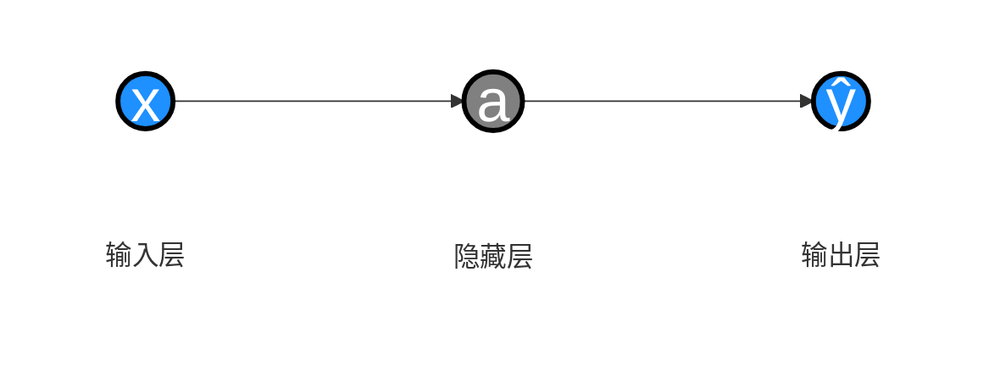
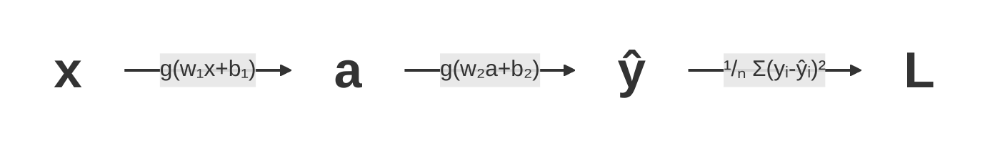

## 背景

继续我们的 [Attention Is All You Need][1] 学习之旅。

我不是这个领域的，只是感兴趣想补一下基础，所以这一篇先只看最通用的原理：神经网络训练的大概流程、Embedding 是什么，以及 Word2Vec 里两种常见优化思路。

[Attention Is All You Need][1] 最早落在机器翻译任务上，它提出的核心架构就是 Transformer。工程上我们常接触到的 [Transformers][3] 库，则是围绕这类模型提供了更完整的封装。

先贴下这套模型结构：


*图 1：Transformer 模型架构（来自 [《Attention Is All You Need》][1] ）。左侧为 Encoder，右侧为 Decoder，每个堆叠重复 N 次。*

> BTW: 推荐一个视频系列 [《【Transformer】最强动画讲解！目前B站最全最详细的Transformer教程，2025最新版！从理论到实战，通俗易懂解释原理，草履虫都学的会！》][2] 。这里面讲解了很多基础知识和名词解释，讲得比较通俗易懂。

## 基本原理

作为一个非 AI 从业人员，我还是需要先把神经网络训练的几个基本词弄明白。不然后面看 Transformer、Embedding、Attention 这些内容时，很容易每个词都认识，连起来却不知道在算什么。
我是先看后面的内容时发现很多地方卡住了，才回头补这部分。

记录一下几个名词的大白话的含义，以便后面看文献的时候统一理解名词：

- **激活函数**: 在神经元的线性变换结果上施加的非线性函数，用来给神经网络引入非线性表达能力。
- **隐藏层**: 位于输入层和输出层之间的神经元层。每一层通常会先对上一层输出做线性变换，再经过激活函数，得到新的特征表示。
- 神经网络的**前向传播**: 数据 -> 输入层 -> 隐藏层 -> 输出层 -> 预测结果的过程。
- **损失函数**: 衡量模型预测值和真实值差距的函数。（比如： $L(w, b)=\sum_{i=1}^{N} \left| y_i - \hat{y}_i \right|$ 或者 $L(w, b)=\frac{1}{N} \sum_{i=1}^{N} (y_i - \hat{y}_i)^2$ ）
- **均方误差(MSE)**: 用平方误差衡量预测偏差。平方项便于求导，也会放大较大的误差；再取平均后，损失值更容易在不同样本数量下比较。 （  $\frac{1}{N} \sum_{i=1}^{N} (y_i - \hat{y}_i)^2$  ）

一个简单的神经网络推理大致是这样



神经网络训练是：对训练样本进行 **前向传播** 得到预测值，用 **损失函数** 衡量预测值和真实值的差距，然后通过 **反向传播** 计算参数梯度，并用优化算法不断更新权重和偏置，使损失尽可能减小。

为了方便理解让 **损失函数** 变小的过程，我们先用一个最基本的分析方法（**线性回归**）举一个简单的例子。

- 输入数据: `(1,1) (2,2) (3,3) (4,4)`
- 线性模型: $y = wx$
- 损失函数: $L(w)=\frac{1}{N} \sum_{i=1}^{N} (y_i - \hat{y}_i)^2$
- 目标: 求解 $w$ 让 $L$ 最小

$$
\begin{aligned}
L(w)
&= \frac{1}{N} \sum_{i=1}^{N} (y_i - \hat{y}_i)^2 \\\\
&= \frac{1}{N} \sum_{i=1}^{N} (y_i - wx_i)^2 \\\\
&= \frac{1}{4} \left((1 - w)^2 + (2 - 2w)^2 + (3 - 3w)^2 + (4 - 4w)^2\right) \\\\
&= 7.5 - 15w + 7.5w^2
\end{aligned}
$$


这条曲线展示 $L(w)$ 在 $w=1$ 时取到最小值，也就是这组样本对应的最优斜率为0（切线水平）时。

然后对其求导，令导数为 0，就能求出 $w$ 的最优值。

$$L^\prime(w) = 15w - 15 = 0$$

$$w = 1$$

然后我们考虑一下更复杂的情况。

- 线性模型: $y = wx + b$
- 损失函数: $L(w, b)=\frac{1}{N} \sum_{i=1}^{N} (y_i - \hat{y}_i)^2$

$$
\begin{aligned}
L(w, b)
&= \frac{1}{N} \sum_{i=1}^{N} (y_i - \hat{y}_i)^2 \\\\
&= \frac{1}{N} \sum_{i=1}^{N} (y_i - (wx_i + b))^2 \\\\
&= \frac{1}{4} \left((1 - (w + b))^2 + (2 - (2w + b))^2 + (3 - (3w + b))^2 + (4 - (4w + b))^2\right) \\\\
&= 7.5 + 7.5w^2 + b^2 + 5wb - 15w - 5b
\end{aligned}
$$

这个就变成了一个三维的函数图像。


求解方式就变成了让偏导数为 0。$\frac{\partial L(w, b)}{\partial w} = 0$ ，$\frac{\partial L(w, b)}{\partial b} = 0$ 。

但是在实际的机器学习里，参数个数非常多，套了多层激活函数之后，很难像这个小例子一样直接写出解析解。
所以就要采用一个终极奥义：**猜** 。

猜的过程如下:

| 第N次尝试 | w   | b   | $L(w, b)$ | 调整方向是否正确 |
| --------- | --- | --- | --------- | ---------------- |
| 1         | 5   | 5   | 10        |                  |
| 2         | 6   | 5   | 9         | ✔️                |
| 3         | 6   | 6   | 11        | ❌️                |
| 4         | 6   | 3   | 7         | ✔️                |
| 5         | 8   | 3   | 3         | ✔️                |
| 6         | 8   | 2   | 1         | ✔️                |

实际训练更常见的方式，是从一组初始参数出发，反复计算当前参数下的梯度，再沿着让损失变小的方向更新参数。这个过程可以理解成“有方向地试”，不是完全瞎猜。

比如只观察 $w$ 的变化时，$\Delta L(w, b) / \Delta w$ 可以粗略看作 $L(w, b)$ 对 $w$ 的偏导数近似。同理也可以观察 $b$ 的变化。偏导数为正，说明当前方向上继续增大参数会让损失变大；偏导数为负，则说明继续增大参数会让损失变小。

每一轮计算时，都让参数向偏导数的反方向调整。

$$
\begin{cases}
w = w - \eta \frac{\partial L(w,b)}{\partial w} \\[8pt]
b = b - \eta \frac{\partial L(w,b)}{\partial b}
\end{cases}
$$

其中， $\eta$ 是 **学习率** ，用于控制每轮的变化速度。这个偏导数组成的向量也就是 **梯度** 。
让参数沿着负梯度方向变化，并持续降低 **损失函数** 的过程，就是 **梯度下降** 。

然后回到神经网络的流程中。


其中 $x \to a$ 和 $a \to \hat{y}$ 的过程都可以套 **激活函数** $g$。激活函数可以很简单，比如 $g(z) = \frac{1}{1 + e^{-z}}$；$a$ 里面也可以继续叠多层，这里为了简单起见只画一层。



这里面，参数有 4 个：$w_1,b_1,w_2,b_2$。
要求 $\frac{\partial L}{\partial w_1}$，可以把它拆成三段：$w_1$ 先影响 $a$，$a$ 再影响 $\hat{y}$，最后 $\hat{y}$ 影响损失 $L$。所以有：

$$\frac{\partial L}{\partial w_1} = \frac{\partial L}{\partial \hat{y}} \frac{\partial \hat{y}}{\partial a} \frac{\partial a}{\partial w_1}$$

这个偏导数的计算方式就是 **链式法则**。实际计算时，可以从损失函数往前一层层传回去，把已经算过的中间梯度复用起来。这个过程就是 **反向传播**。

为什么前一层的值能复用呢？

比如在一次计算中：

$$
\begin{cases}
\frac{\partial L}{\partial w_1} = \frac{\partial L}{\partial \hat{y}} \frac{\partial \hat{y}}{\partial a} \frac{\partial a}{\partial w_1} \\
\frac{\partial L}{\partial w_2} = \frac{\partial L}{\partial \hat{y}} \frac{\partial \hat{y}}{\partial w_2} \\
\frac{\partial L}{\partial b_1} = \frac{\partial L}{\partial \hat{y}} \frac{\partial \hat{y}}{\partial a} \frac{\partial a}{\partial b_1}
\end{cases}
$$

计算 $\frac{\partial L}{\partial w_2}$ 时，$\frac{\partial L}{\partial \hat{y}}$ 可以复用。
计算 $\frac{\partial L}{\partial b_1}$ 时，$\frac{\partial L}{\partial \hat{y}} \frac{\partial \hat{y}}{\partial a}$ 这一段也可以复用。

一次训练过程就是通过一组 $(w_1,b_1,w_2,b_2)$ 做 **前向传播**，计算出 $a$、$\hat{y}$ 和 $L$；再用 **反向传播**（本质就是 **链式法则** 的递归应用）计算梯度；最后用 **梯度下降** 更新权重。

实际训练时，因为数据有噪声、数据量不够、模型过于复杂等原因，有时会出现训练数据上表现很好、换一批数据就明显变差的情况，这就是 **过拟合**。通过人工或脚本改造已有数据、加入噪声、做数据增强，可以在一定程度上增强最终模型的 **鲁棒性**。
另外也可以在 **损失函数** 里加 **惩罚项**，阻止参数无限制变大。比如给原损失加上参数绝对值（ **新损失函数** = **老损失函数** + $\lambda \sum_{i=1}^{N} |w_i|$ ），或者加上参数平方（ **新损失函数** = **老损失函数** + $\lambda \sum_{i=1}^{N} w_i^2$ ）。这个过程也叫 **正则化**。其中 $\lambda$ 是 **正则化系数**，和 $\eta$（**学习率**）一样都需要人工设置，但含义不同：$\eta$ 控制每次更新走多远，$\lambda$ 控制惩罚项有多重。

> 这些需要人工设定、通过实验调整的控制量统称为 **超参数**。唉，名词太多有点遭不住啊 ( T _ T )。为了后面看其他文献的时候别卡壳，也只能先记住了。

其他的还有比如像 Dropout 来解决部分参数依赖过重的问题，还有其他的问题比如梯度消失、梯度爆炸、收敛速度过慢、计算开销过大等等很多细节。我这里仅仅用于理解基本原理就不展开了。正儿八经的模型训练的话可能就得继续深入下去。

## Word Embeddings

我们处理文本的时候，需要先把词或 token 变成神经网络能处理的向量，并且让这些向量能表达词之间的关系。
比如："中国的首都是北京，美国的首都是华盛顿。"在一个理想化的词向量空间里，可能会出现类似 $\text{北京} - \text{中国} \approx \text{华盛顿} - \text{美国}$ 的关系。它表达的不是四则运算真的等同于语义推理，而是向量空间里某些方向能承载“国家 -> 首都”这类关系。

在 [Attention Is All You Need][1] 的整个执行过程中，模型操作的是 Embedding 数据。但是我们输入的是文本。怎么把文本转换成 Embedding 数据呢？这就需要 [Word Embeddings][5]。

> 在一段文本里怎么拆分 word 或 token 呢？并不是简单地按空白字符或者 CJK 字符拆分，这又是一系列论文和工程方法，这里就不展开了。

可以先把 [Word Embeddings][5] 理解成：给每个词或 token 分配一个固定维度的向量，模型训练会不断调整这些向量，让相似上下文里的词更容易在向量空间里靠近。

举个例子便于理解：

| -            | cats | puppy | houses | apple | baby |
| ------------ | ---- | ----- | ------ | ----- | ---- |
| animal       | .91  | .93   | -.56   | -.67  | .01  |
| newborn      | -.11 | .71   | -.32   | -.1   | .90  |
| human        | .19  | .36   | .31    | .29   | .87  |
| 其他维度 ... | ...  | ...   | ...    | ...   | ...  |
| plural       | .94  | -.82  | .94    | -.51  | -.11 |
| fruit        | -.11 | -.91  | -.5    | .89   | -.11 |

如果真有这样一组可解释维度，那么 cats 的 animal 权重会比较高，apple 的 fruit 权重比较高，baby 的 newborn 和 human 权重比较高。

我们可以用两个词向量的点积（ $a \cdot b = \sum_{i=1}^{N} {a_i b_i}$ ）或余弦相似度（ $cos(\theta) = \frac{a \cdot b}{|a| \cdot |b|}$ ）来表达两个词的相关性。

实际模型里的维度通常没有 animal、newborn、human 这类人工可读的名字，而是训练出来的隐含方向。向量元素本身也不一定落在 \[-1, 1\]，只有余弦相似度这类归一化后的相似度指标才天然落在这个范围里。对于一个确定的模型来说，Embedding 维度数量是固定的。

那么这个 Embedding 向量表要怎么训练出来呢？

初始向量表可以随机生成。训练时，我们把样本送进模型，让它经过隐藏层计算后尽量降低 **损失函数**；梯度下降会反过来调整这些向量。

## [Word2Vec][4]

训练 [Word Embeddings][5] 的基础原理，可以先参考前面的 [基本原理](#基本原理) 部分。
具体方法不止一种。我目前只看了比较经典的 [Word2Vec][4]，所以这里也只记录 Word2Vec 的思路。

[Word2Vec][4] 常见训练方式包括 CBOW 和 Skip-gram。下面主要按 Skip-gram + Negative Sampling 来理解：从文本里采出真实的“目标词-上下文词”组合，再抽一些噪声词当负样本，让模型学会把真实组合打高分、负样本打低分。

### [Word2Vec][4] - Negative Sampling（负采样）

[《NLP Illustrated, Part 3: Word2Vec》][4] 里比较详细地举例了 **Negative Sampling（负采样）** 方法计算过程；[Word2Vec 原论文][6] 里也给出了标准目标函数。

**损失函数** 如下：

- 方便理解: $L = -\frac{1}{k+1} \sum_{j=0}^{k} \Big[ y_j \log \sigma(v_{w_j}^{\prime} \cdot v_c) + (1-y_j) \log \sigma(-v_{w_j}^{\prime} \cdot v_c) \Big]$
- 论文标准形式: $L = -\log \sigma(v_o^{\prime} \cdot v_c) - \sum_{i=1}^{k} \log \sigma(-v_{n_i}^{\prime} \cdot v_c)$

> 上面这个平均版和论文标准形式只差一个常数缩放。它不改变最优点，但会改变梯度尺度；实际训练时通常可以通过学习率吸收这类差异。

为了方便理解，下面以上下文窗口 2、Embedding 维度 2 来看。输入数据是 “Happiness can be found even in the darkest of times
if only one remembers to turn on the light”。

那首先我们有这个邻居词表

| 目标词    | 上下文词  | 是否相邻 |
| --------- | --------- | -------- |
| Happiness | can       | 1        |
| Happiness | be        | 1        |
| can       | Happiness | 1        |
| can       | be        | 1        |
| can       | found     | 1        |
| be        | Happiness | 1        |
| be        | can       | 1        |
| be        | found     | 1        |
| be        | even      | 1        |
| ...       | ...       | 1        |

然后给每个真实邻居词配 2 个负样本，作为 **训练数据**。真实邻居词标成 1，随机采到的噪声词标成 0。

| Target Word | Context Word | 是否相邻（对应上面的真实值 y） |
| ----------- | ------------ | ------------------------------ |
| Happiness   | can          | 1                              |
| Happiness   | light        | 0                              |
| Happiness   | even         | 0                              |
| Happiness   | be           | 1                              |
| Happiness   | darkest      | 0                              |
| Happiness   | one          | 0                              |
| can         | Happiness    | 1                              |
| can         | light        | 0                              |
| can         | turn         | 0                              |
| can         | be           | 1                              |
| can         | one          | 0                              |
| can         | remembers    | 0                              |
| ...         | ...          | ...                            |

因为这里以维度 2 为例，所以接下来随机初始化 **Target Embeddings**：

| Happiness | can | be  | found |
| --------- | --- | --- | ----- |
| 0.2       | 0.1 | 0.8 | 0.6   |
| -0.6      | 0.2 | 1   | -0.1  |

和 **Context Embeddings**：

| Happiness | can | be   | found | light | even |
| --------- | --- | ---- | ----- | ----- | ---- |
| -0.1      | 0.6 | -0.3 | 0.2   | 0.3   | -0.9 |
| -0.1      | 0.8 | 0.7  | 0.4   | 0.6   | -0.2 |

然后我们用训练数据集，对 **Target Embedding** 和 **Context Embedding** 作点积。在这个二分类任务里，点积越大，经过 sigmoid 后越接近 1；点积越小，越接近 0。

以这个数据为例：

| Target Word   | Context Word | 是否相邻 |
| ------------- | ------------ | -------- |
| **Happiness** | **can**      | **1**    |
| Happiness     | light        | 0        |
| Happiness     | even         | 0        |

$TargetEmbedding_{Happiness} \cdot ContextEmbedding_{can} = \begin{bmatrix}0.2 \\ -0.6 \end{bmatrix} \cdot \begin{bmatrix} 0.6 & 0.8 \end{bmatrix} = (0.2 \times 0.6) + (-0.6 \times 0.8) = -0.36$

然后我们要把这个值转换成规范化后的概率，比如用 $\sigma (x) = \frac{1}{1 + e^{-x}}$


Happiness 和 can 的预测值 $\hat{y}$：$\sigma(-0.36) = \frac{1}{1 + e^{0.36}} \approx 0.41$

Happiness 和 light 的预测值 $\hat{y}$：$\sigma(\begin{bmatrix}0.2 \\ -0.6 \end{bmatrix} \cdot \begin{bmatrix} 0.3 & 0.6 \end{bmatrix}) = \sigma(-0.3) \approx 0.43$

Happiness 和 even 的预测值 $\hat{y}$：$\sigma(\begin{bmatrix}0.2 \\ -0.6 \end{bmatrix} \cdot \begin{bmatrix} -0.9 & -0.2 \end{bmatrix}) = \sigma(-0.06) \approx 0.49$

然后可以用二分类交叉熵 **损失函数**：$L = - \frac{1}{N} \sum_{i=1}^{N} \big(y_i \log(\hat{y}_i) + (1 - y_i) \log(1 - \hat{y}_i)\big)$。

按前面三个数据的例子，用自然对数计算就是：$L \approx - \frac{1}{3} (\log(0.41) + \log(1 - 0.43) + \log(1 - 0.49)) \approx 0.71$。

> 实现时通常不会真的先手写 sigmoid 再手写 log，而是使用 log-sigmoid 或 BCE-with-logits 这类数值更稳定的写法。点积绝对值很大时 sigmoid 会饱和，梯度容易变小；这是数值稳定性和训练效率问题，不是简单的“梯度爆炸”。

然后用 **梯度下降** 来更新 Embedding。一轮下来调整方向可能是如下这样：

- Old Target embedding: Happiness: (0.2, -0.6)
- Old Context embedding: can: (0.6, 0.8), light: (0.3, 0.6), even: (-0.9, -0.2)
- New Target embedding: Happiness: (0.7, -0.6)
- New Context embedding: can: (0.7, 0.7), light: (0.2, 0.8), even: (-0.9, -0.2)


看起来就是 Happiness 和 can 更近了，和 even 与 light 更远了。

### [Word2Vec][4] - Hierarchical Softmax（基于 Huffman 树的层次化 Softmax）

还有一种 **Hierarchical Softmax（基于 Huffman 树的层次化 Softmax）**。

> [Attention Is All You Need][1] 里 “Embeddings and Softmax” 提到的 Softmax，通常指输出层对词表做标准 softmax；这里的 Hierarchical Softmax 是 Word2Vec 为了降低词表计算量使用的近似训练方法，两者不要混在一起。

标准 Softmax 概率是：$P(w_o \mid w_c) = \frac{\exp({v_{w_o}^{\prime}}^{\top} v_{w_c})}{\sum_{w \in V} \exp({v_w^{\prime}}^{\top} v_{w_c})}$。因为每次计算都要访问整个词汇表 $V$，复杂度是 $O(V)$，词表很大时开销会很高。

Hierarchical Softmax 的做法，是先基于词频统计建立 Huffman 树，把一次大词表分类变成沿树路径的一串二分类。中心词仍然有自己的向量 $v_{w_c}$，每个内部节点也有一个路径向量 $v_n$。

它的 **损失函数** 可以写成：

$$L = -\sum_{n \in \mathrm{path}(w_o)} \log \sigma\big(\mathrm{dir}(w_o, n) \cdot {v_{n}^{\prime}}^{\top} v_{w_c}\big)$$

其中 $\mathrm{dir}(w_o, n)$ 根据走左子树还是右子树取 $-1$ 或者 $+1$。左右方向取正取负只是约定，前后一致即可。

比如：

```text
        n1(root, 10)
       /            \
   a(4)            n2(6)
                  /      \
               b(3)     n3(3)
                       /    \
                     c(2)   d(1)
```

| 词  | 路径（内部节点序列）  | 方向 $\mathrm{dir}_j$  |
| --- | --------------------- | ---------------------- |
| $a$ | $n_1$                 | $+1$（左）             |
| $b$ | $n_1 \to n_2$         | $-1$（右）, $+1$（左） |
| $c$ | $n_1 \to n_2 \to n_3$ | $-1$, $-1$, $+1$       |
| $d$ | $n_1 \to n_2 \to n_3$ | $-1$, $-1$, $-1$       |

以目标词 $w_o = c$ 为例，路径经过 $n_1,n_2,n_3$，方向分别为 $-1,-1,+1$。路径概率是：$P(c \mid w_c) = \prod_{j=1}^{3} \sigma(z_j) = \sigma(-{v_{n_1}^{\prime}}^{\top} v_c) \cdot \sigma(-{v_{n_2}^{\prime}}^{\top} v_c) \cdot \sigma(+{v_{n_3}^{\prime}}^{\top} v_c)$。

那么最终的 **损失函数** 计算就是：$L = -\log P(c \mid w_c) = -\sum_{j=1}^{l_o} \log \sigma(z_j) = -\log \sigma(\mathrm{dir}_1 \cdot {v_{n_1}^{\prime}}^{\top} v_c) - \log \sigma(\mathrm{dir}_2 \cdot {v_{n_2}^{\prime}}^{\top} v_c) - \log \sigma(\mathrm{dir}_3 \cdot {v_{n_3}^{\prime}}^{\top} v_c)$

这样每轮只需要计算和更新路径上的向量。因为 Huffman 树基于词频构建，高频词通常离根更近，训练和 **反向传播** 涉及的节点也更少。

如果类比 Negative Sampling，中心词向量 $v_{w_c}$ 仍然相当于 Target Embedding；路径向量 $v_n$ 有点像 Context Embedding，但它绑定在树的内部节点上，不是绑定在某个词上，也一定程度表达了关系。

### 最后做个简单对比

| 对比维度           | Hierarchical Softmax                                                           | Negative Sampling                                                                  |
| ------------------ | ------------------------------------------------------------------------------ | ---------------------------------------------------------------------------------- |
| **核心思想**       | 将词汇表组织成 Huffman 二叉树，把多分类转化为沿树路径的一系列二分类决策        | 将多分类转化为 **1 个正样本 + $k$ 个负样本** 的二分类问题                          |
| **概率模型**       | 路径上各节点二分类概率的连乘                                                   | 正/负样本对的 sigmoid 概率                                                         |
| **每样本计算量**   | $O(\log V)$（路径长度，与词汇量对数成正比）                                    | $O(k)$（常数，与词汇量无关，通常 $k=5 \sim 20$）                                   |
| **每样本更新参数** | 中心词向量 + 路径上 $O(\log V)$ 个内部节点向量                                 | 中心词向量 + 1 个正样本词向量 + $k$ 个负样本词向量                                 |
| **对高频词**       | Huffman 树中路径短，更新节点少                                                 | 与低频词计算量相同，但高频词更容易被采样分布选中                                   |
| **对低频词**       | 路径更长，需要经过更多内部节点                                                 | 与高频词计算量相同，但作为正样本出现次数少                                         |
| **损失函数**       | $-\sum_{j=1}^{L(w_o)-1} \log \sigma(\mathrm{dir}_j \cdot {v_{n_j}^{\prime}}^{\top} v_c)$ | $-\log \sigma({v_o^{\prime}}^{\top} v_c) - \sum_{i=1}^{k} \log \sigma(-{v_{n_i}^{\prime}}^{\top} v_c)$ |
| **实现难度**       | 较复杂，需要预先构建 Huffman 树并维护内部节点向量                              | 较简单，维护词向量矩阵并随机采样负样本即可                                         |
| **数值稳定性**     | 路径概率连乘可能极小，通常要在 log 空间里处理                                  | 无路径连乘问题，但点积过大时 sigmoid 可能饱和                                      |
| **并行/向量化**    | 路径长度不一，不太适合批量向量化                                               | 固定 $k+1$ 个样本，更适合矩阵计算                                                  |
| **适用场景**       | 词汇量很大、内存或计算受限，或需要更接近概率解释的场景                         | 大规模语料快速训练、批量计算、实现简单                                             |

也还有一些其他用于解决标准 Softmax 计算量过大的优化。

| 方法                                   | 原理                                                     | 使用场景                   |
| -------------------------------------- | -------------------------------------------------------- | -------------------------- |
| **Adaptive Softmax**                   | 按词频分层，高频词用短向量、低频词用长向量，减少总计算量 | 大词汇量语言模型           |
| **Sampled Softmax**                    | 从全词汇表中采样一个子集近似分母                         | 训练阶段近似输出层 Softmax |
| **Noise Contrastive Estimation (NCE)** | 与 Negative Sampling 思想类似，但用于估计输出层概率      | 极大规模词汇表             |

我暂时没有继续深入了，可能以后接触到再说吧。

### 代码示例

下面用 PyTorch 写一个最小训练例子。[`nn.Embedding` 本质上就是一张可训练的查表矩阵][7]；这里准备 target 和 context 两张表，取两个向量的点积作为 logit，再用 `BCEWithLogitsLoss` 训练，它内部已经 [把 sigmoid 和 BCE 合在一起处理][8] ，数值上比手写 `sigmoid + log` 稳定一些。

```python
import torch
from torch import nn


# 固定随机种子，方便观察同一组初始化下的训练变化。
torch.manual_seed(0)

# 定义训练样本：(target, context, label)。
# label=1 表示真实邻居词，label=0 表示负采样词。
training_data = [
    ("happiness", "can", 1.0),
    ("happiness", "be", 1.0),
    ("happiness", "light", 0.0),
    ("happiness", "even", 0.0),
    ("can", "happiness", 1.0),
    ("can", "be", 1.0),
    ("can", "found", 1.0),
    ("can", "light", 0.0),
    ("can", "turn", 0.0),
    ("be", "happiness", 1.0),
    ("be", "can", 1.0),
    ("be", "found", 1.0),
    ("be", "one", 0.0),
    ("be", "remembers", 0.0),
]

# 初始化词表，并给每个词分配一个整数 ID。
vocab = sorted({word for item in training_data for word in item[:2]})

# nn.Embedding 只能接收整数 ID，所以需要先把词映射到词表下标。
word_to_id = {word: index for index, word in enumerate(vocab)}

# 把训练样本拆成 target、context 和真实标签三组 Tensor。
target_ids = torch.tensor([word_to_id[target] for target, _, _ in training_data])
context_ids = torch.tensor([word_to_id[context] for _, context, _ in training_data])
labels = torch.tensor([label for _, _, label in training_data])


# 定义模型结构。
class TinyWord2Vec(nn.Module):
    # vocab_size: 词表大小；embedding_dim: 每个词向量的维度。
    def __init__(self, vocab_size, embedding_dim):
        super().__init__()
        # 初始化两张 Embedding 表：中心词表和上下文词表。
        self.target_embeddings = nn.Embedding(vocab_size, embedding_dim)
        self.context_embeddings = nn.Embedding(vocab_size, embedding_dim)

    # 前向传播：查表 -> 点积 -> 输出 logits。
    def forward(self, target_ids, context_ids):
        target_vectors = self.target_embeddings(target_ids)
        context_vectors = self.context_embeddings(context_ids)
        # 点积越大，模型越倾向于判断这对词真实相邻。
        return (target_vectors * context_vectors).sum(dim=1)


# 初始化模型。这里用二维 Embedding，方便直接打印和观察。
model = TinyWord2Vec(vocab_size=len(vocab), embedding_dim=2)

# 定义损失函数。BCEWithLogitsLoss 内部会处理 sigmoid + 二分类交叉熵。
criterion = nn.BCEWithLogitsLoss()

# 定义优化器，用梯度下降更新两张 Embedding 表。
optimizer = torch.optim.SGD(model.parameters(), lr=0.2)

# 执行训练。这里每个 epoch 都用全部样本做一轮 full-batch 更新。
for epoch in range(201):
    # 前向传播：得到每个 target/context 组合的 logit。
    logits = model(target_ids, context_ids)

    # 计算损失：让真实邻居词接近 1，让负采样词接近 0。
    loss = criterion(logits, labels)

    # 一轮训练：清空梯度 -> 反向传播 -> 更新参数。
    optimizer.zero_grad()
    loss.backward()
    optimizer.step()

    if epoch % 50 == 0:
        print(f"epoch={epoch:03d} loss={loss.item():.4f}")

print("\nTarget embeddings:")
for word, index in word_to_id.items():
    # detach() 只用于打印，避免把展示逻辑接进梯度图。
    vector = model.target_embeddings.weight[index].detach().tolist()
    print(f"{word:10s}", [round(value, 3) for value in vector])
```

训练过程里，`target_embeddings` 和 `context_embeddings` 都会被更新。为了和前面的表格对上，这里只打印 target 这张表；真实使用时可以只取一张，也可以把两张表做平均或拼接，这取决于具体实现和评估效果。

## 接下来...

我本人并非 AI 领域从业者，可能有理解不到位的地方，欢迎指正。

下一篇就进入神经网络模型架构的部分。

[1]: https://arxiv.org/pdf/1706.03762
[2]: https://www.bilibili.com/video/BV1fj6vBfEnu/
[3]: https://github.com/huggingface/transformers
[4]: https://towardsdatascience.com/nlp-illustrated-part-3-word2vec-5b2e12b6a63b/
[5]: https://aiwiki.ai/wiki/word_embedding
[6]: https://arxiv.org/abs/1310.4546
[7]: https://docs.pytorch.org/docs/stable/generated/torch.nn.Embedding.html
[8]: https://docs.pytorch.org/docs/stable/generated/torch.nn.BCEWithLogitsLoss.html
