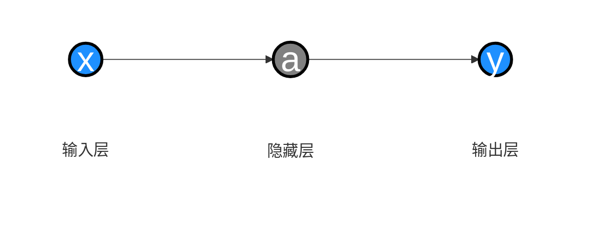
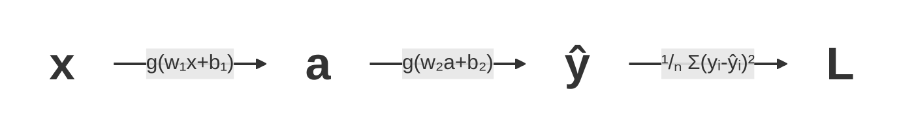

## 背景

继续我们的 [Attention Is All You Need][1] 学习之旅。
整个AI的体系和后续优化实在是内容很多。
我也不是这个领域的，只是感兴趣了解一下，所以先只有时间来看最基础通用的原理部分。

[Attention Is All You Need][1] 最早是应用于翻译领域，推理框架名字叫 [Transformer][3] 。

先贴下这套框架的基本框架:

*图 1：Transformer 模型架构（来自 [《Attention Is All You Need》][1] ）。左侧为 Encoder，右侧为 Decoder，每个堆叠重复 N 次。*

> BTW: 推荐一个视频系列 [《【Transformer】最强动画讲解！目前B站最全最详细的Transformer教程，2025最新版！从理论到实战，通俗易懂解释原理，草履虫都学的会！》][2] 。这里面讲解了很多基础知识和名词解释，讲得比较通俗易懂。

## Word Embeddings

我们处理文本的时候，需要让神经网络知道词之间的相关性。
比如: "中国的首都是北京，美国的首都是华盛顿。"
那么在这里，中国 \* 首都 = 北京，美国 \* 首都 = 华盛顿。这些词之间是有关联的。

> 如果让模型猜测 “中国 北京 美国 ？”中？可能是什么。他是不是能推断出我们要查找的是首都，然后通过 $\frac{北京}{中国} \cdot 美国 = 华盛顿$ 来推断出答案是华盛顿？

在 [Attention Is All You Need][1] 的整个执行过程中操作的都是 Embedding 数据。但是我们输入的都是文本。
怎么把这些输入的文本转换成 Embedding 数据呢？这就需要一个 [Word Embeddings][5] 的过程。

> 在一段文本里怎么拆分World呢？并不是简单得按空白字符或者CJK字符拆分，这又是有一系列论文方法的，这里就不展开了。

首先我们可以理解 [Word Embeddings][5] 表达的含义是一个词在多个维度的相关性。

举个例子便于理解：

| -            | cats | puppy | houses | apple | baby |
| ------------ | ---- | ----- | ------ | ----- | ---- |
| anima        | .91  | .93   | -.56   | -.67  | .01  |
| newborn      | -.11 | .71   | -.32   | -.1   | .90  |
| human        | .19  | .36   | .31    | .29   | .87  |
| 其他维度 ... | ...  | ...   | ...    | ...   | ...  |
| plural       | .94  | -.82  | .94    | -.51  | -.11 |
| fruit        | -.11 | -.91  | -.5    | .89   | -.11 |

cats 的anima权重会比较高，apple 的 fruit 权重比较高， baby的newborn和human权重高。
实际计算场景里，由于要方便计算，实际这个权重要归一化处理（所以数值范围一定在 \[-1, 1\] 之间），并且权重实际是绝对值越大相关性越强。另外实际场景里是没有anima、newborn、human ... 这类明确的维度的。维度也是算出来的，但是对于一个确定的模型来说，维度数量是固定的。

那么对这个Embeddings的向量表要怎么训练出来呢？

初始我们的向量表可以纯随机。
训练的过程就是经过输入训练数据之后，我们要让训练数据通过 **隐藏层** 计算后 **损失函数** 尽量小。

### 参数计算的原理

记录一下几个名词的大白话的含义，以便后面看文献的时候统一理解名词：

- **激活函数**: 把线性关系函数激活成非线性关系。
- **隐藏层**: 把线性函数，引用上多个维度的参数，再通过多层激活函数之后。把数据从输入层转到输出层的过程。
- 神经网络的**前向传播**: 数据->输入层->隐藏层->输出层的过程。
- **损失函数**: 预测数据与真实数据的误差函数。（ $\sum_{i=1}^{N} \left| y_i - \hat{y}_i \right|$ ）
- **均方误差(MSE)**: 消除损失函数里样本数量带来的影响和绝对值处理起来困难的问题。 （  $\frac{1}{N} \sum_{i=1}^{N} (y_i - \hat{y}_i)^2$  ）
- **损失函数**: $L(w, b)=\frac{1}{N} \sum_{i=1}^{N} (y_i - \hat{y}_i)^2$

为了方便理解让 **损失函数** 变小的过程，我们先用一个最基本的分析方法（**线性回归**）举一个简单的例子。

- 输入数据: `(1,1) (2,2) (3,3) (4,4)`
- 线性模型: $y = wx$
- 损失函数: $L(w)=\frac{1}{N} \sum_{i=1}^{N} (y_i - \hat{y}_i)^2$
- 目标: 求解 $w$ 让 $L$ 最小

$$
\begin{aligned}
L(w)
&= \frac{1}{N} \sum\_{i=1}^{N} (y\_i - \hat{y}\_i)^2 \\\\
&= \frac{1}{N} \sum\_{i=1}^{N} (y\_i - wx\_i)^2 \\\\
&= \frac{1}{4} \left((1 - w)^2 + (2 - 2w)^2 + (3 - 3w)^2 + (4 - 4w)^2\right) \\\\
&= 7.5 - 15w + 7.5w^2
\end{aligned}
$$

这条曲线展示 $L(w)$ 在 $w=1$ 时取到最小值，也就是这组样本对应的最优斜率。

然后对其求导，导数为0即w的最优值。

$$L^\prime(w) = 15w - 15 = 0$$

$$w = 1$$

然后我们考虑一下更复杂的情况。

- 线性模型: $y = wx + b$
- 损失函数: $L(w, b)=\frac{1}{N} \sum_{i=1}^{N} (y_i - \hat{y}_i)^2$

$$
\begin{aligned}
L(w, b)
&= \frac{1}{N} \sum\_{i=1}^{N} (y\_i - \hat{y}\_i)^2 \\\\
&= \frac{1}{N} \sum\_{i=1}^{N} (y\_i - (wx\_i + b))^2 \\\\
&= \frac{1}{4} \left((1 - (w + b))^2 + (2 - (2w + b))^2 + (3 - (3w + b))^2 + (4 - (4w + b))^2\right) \\\\
&= 7.5 + 7.5w^2 + b^2 + 5wb - 15w - 5b
\end{aligned}
$$

这个就变成了一个三维的函数图像。

求解方式就变成了让偏导数为0。$\frac{\partial L(w, b)}{\partial w} = 0$ ，$\frac{\partial L(w, b)}{\partial b} = 0$ 。

但是在实际的机器学习里，参数个数非常多，套了多层激活函数之后很难用这种数学的方式归纳出来。
所以就要采用一个终极奥义：**猜** 。

猜的过程如下:

| 第N次尝试 | w   | b   | $L(w, b)$ | 调整方向是否正确 |
| --------- | --- | --- | --------- | ---------------- |
| 1         | 5   | 5   | 10        |                  |
| 2         | 6   | 5   | 9         | ✔️                |
| 3         | 6   | 6   | 11        | ❌️                |
| 4         | 6   | 3   | 7         | ✔️                |
| 5         | 8   | 3   | 3         | ✔️                |
| 6         | 8   | 2   | 1         | ✔️                |

这其中比如 1 -> 2 的过程中 L\(w, b\) 的变化量 / w 的变化量，可以视作 L\(w, b\) 对 w 的偏导数 $\frac{\partial L(w, b)}{\partial w} = 0$ 。同理对b也一样。

然后每一轮计算，都让参数向偏导数的反方向靠近。

$$
\begin{cases}
w = w - \eta \frac{\partial L(w,b)}{\partial w} \\[8pt]
b = b - \eta \frac{\partial L(w,b)}{\partial b}
\end{cases}
$$

其中， $\eta$ 是 **学习率** ，用于控制每轮的变化速度。这个偏导数组成的向量也就是 **梯度** 。
而这个变化参数让 **损失函数** 变小的过程就叫做 **梯度下降** 。

然后回到神经网络的流程中。

其中 x->a 和 a->ŷᵢ 的过程都可以套 **激活函数** g （ 激活函数g可以很简单，比如 $g(z) = \frac{1}{1 + e^{-z}}$ ，a里面也可以是多层**激活函数**，这里为了简单起见以一层为例）。

这里面，参数有4个。w₁,b₁,w₂,b₂。
然后求 $\frac{\partial L}{\partial w_1}$ 偏导数的过程，可以通过分别对 $\frac{\partial a}{\partial w_1}$ ，$\frac{\partial \hat{y}}{\partial a}$ ，$\frac{\partial L}{\partial y}$ 通过上面的流程计算偏导数。然后就有

$$\frac{\partial L}{\partial w_1} = \frac{\partial L}{\partial y} \frac{\partial \hat{y}}{\partial a} \frac{\partial a}{\partial w_1}$$

这个偏导数的计算方式就是 **链式法则** 。实际计算的时候，可以把这些偏导数从右边开始计算，每一层传播过来。依次更新每一层的参数。然后前一层的值，后面也会用到，这样可以减少计算量。这个过程叫 **反向传播** 。

为什么前一层的值能复用呢？

比如在一次计算中:

$$
\begin{cases}
\frac{\partial L}{\partial w_1} = \frac{\partial L}{\partial y} \frac{\partial \hat{y}}{\partial a} \frac{\partial a}{\partial w_1} \\
\frac{\partial L}{\partial w_2} = \frac{\partial L}{\partial y} \frac{\partial \hat{y}}{\partial w_2} \\
\frac{\partial L}{\partial b_1} = \frac{\partial L}{\partial y} \frac{\partial \hat{y}}{\partial a} \frac{\partial a}{\partial b_1}
\end{cases}
$$

那么计算 $\frac{\partial L}{\partial w_2}$ 的过程中， $\frac{\partial L}{\partial y}$ 就能被复用。
而计算 $\frac{\partial L}{\partial b_1}$ 的过程中，$\frac{\partial L}{\partial y} \frac{\partial \hat{y}}{\partial a}$ 整个都能被复用。

一次训练过程就是通过一组 (w₁,b₁,w₂,b₂)通过 **前向传播** 计算出a、ŷ和L。用 **反向传播**（本质就是 **链式法则** 的递归应用）计算梯度 → 最后才用 **梯度下降** 更新权重。

实际训练的过程中吗，因为数据有噪声，数据集量不够，训练模型过于复杂等原因。有时候会导致训练出来的函数在训练数据上表现好，但是预测其他数据的时候表现不好，出现 **过拟合** 。通过人工修改或者脚本修改已有数据，制造训练数据噪音等，可以一定层度增强最终模型的 **鲁棒性** 。
另外也可以在训练过程中优化 **损失函数** 加上 **惩罚项** 来阻止参数野蛮增长。比如 **损失函数** 加上参数的绝对值（ **新损失函数** = **老损失函数** + \lambda $\sum_{i=1}^{N} |w_i|$ ）或参数的平方（ **新损失函数** = **老损失函数** + \lambda $\sum_{i=1}^{N} w_i^2$ ）。这个过程也叫 **正则化** 。其中 $\lambda$ 和之前$\eta$ （ **学习率** ）的作用很像，叫做 **正则化系数**。

> 这些控制参数的参数又统称为 **超参数** 。 唉，名词太多有点遭不住啊 ( T _ T )。为了编译后面卡纳其他文献的时候别卡壳，也只能先记住了。

其他的还有比如像 Dropout 来解决部分参数依赖过重的问题，还有其他的问题比如梯度消失、梯度爆炸、收敛速度过慢、计算开销过大等等很多细节。我这里仅仅用于理解基本原理就不展开了。正儿八经的模型训练的话可能就得继续深入下去。

### [Word2Vec][4]

现在我们回到计算 [Word Embeddings][5] 的词之间的相关性上。

其他的方法我也没看了，只看了现在的万精油 [Word2Vec][4]。
简单得说，就是给出两个单词，通过判定他们是否相邻来调整权重。

[《NLP Illustrated, Part 3: Word2Vec》][4] 里比较详细地举例了计算过程。

比如如果 [Word2Vec][4] 的上下文窗口是5，输入数据是 “Happiness can be found even in the darkest of times
if only one remembers to turn on the light”。

## 传统RNN（卷积神经网络）的Encoding和Decoding

卷积神经网络（CNN）似乎更适合静态数据（比如图片处理、提取特征等）。我大概看了下原理，和我们要关注的 [Transformer][3] 关系不大，先略过了。

我们处理文本的时候，需要让神经网络知道上下文关系。
比如一句话: "我上午要去图书馆借书，下午去参加比赛。晚饭前我会把它还掉。"
那么在这里，需要系统要能知道，这里的“它”指的是“书”。

传统RNN的方法就是把后续数据叠加到前文输入里来传递上下文表达。
这里不详细铺开RNN的原理和过程，因为不是我们要关注的重点。大致了解一下流程和问题即可。

比如我们要翻译 I love lamas 到中文。
那么它的执行流程是先输入完整的 "I love lamas"，在把它转换成Embeddings数据集之后，每一次执行翻译一个Word。
然后下一次执行把之前的输出Append到下一层的输入。

| Step | Input                 | Output |
| ---- | --------------------- | ------ |
| 1    | I love lamas          | 我     |
| 2    | I love lamas **我**   | 爱     |
| 3    | I love lamas **我爱** | lamas  |

显然这里有两个问题。一是每次计算都依赖上一次的结果，导致没法并发。而是如果内容太长的话会丢失前后文关系。

## 注意力机制

[Transformer][3] 注意力机制的基本流程可以理解为一个查询过程。分为 **查询（Q）** 、 **键（K）** 、 **值（V）** 三部分。
当然这些数据都是向量。

*图 2：Scaled Dot-Product Attention（左）与 Multi-Head Attention（右）。左侧展示 Q/K/V 的注意力计算流程，右侧展示 h 个并行注意力头拼接后再线性投影的结构。*

$$\mathrm{Attention}(Q, K, V) = \mathrm{softmax}\left(\frac{QK^T}{\sqrt{d_k}}\right)V$$

## 大语言模型的参数量

<!-- 调查目前各个大预言模型的维度数量，层数。Word Embeddings数量级等，刨析大预言模型的参数量包含哪几部分，怎么算出来的？ -->

[1]: https://arxiv.org/pdf/1706.03762
[2]: https://www.bilibili.com/video/BV1fj6vBfEnu/
[3]: https://github.com/huggingface/transformers
[4]: https://towardsdatascience.com/nlp-illustrated-part-3-word2vec-5b2e12b6a63b/
[5]: https://aiwiki.ai/wiki/word_embedding
