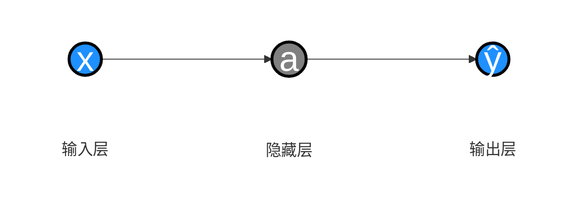
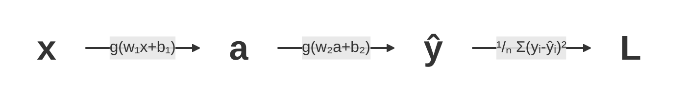

## 背景

继续我们的 [Attention Is All You Need][1] 学习之旅。
整个AI的体系和后续优化实在是内容很多。
我也不是这个领域的，只是感兴趣了解一下，所以先只有时间来看最基础通用的原理部分。

[Attention Is All You Need][1] 最早是应用于翻译领域，推理框架名字叫 [Transformer][3] 。

先贴下这套框架的基本框架:


*图 1：Transformer 模型架构（来自 [《Attention Is All You Need》][1] ）。左侧为 Encoder，右侧为 Decoder，每个堆叠重复 N 次。*

> BTW: 推荐一个视频系列 [《【Transformer】最强动画讲解！目前B站最全最详细的Transformer教程，2025最新版！从理论到实战，通俗易懂解释原理，草履虫都学的会！》][2] 。这里面讲解了很多基础知识和名词解释，讲得比较通俗易懂。

## 基本原理

作为一个非AI从业人员，还是需要先了解一下基本原理。不然后面的文献会看得云里雾里。
我是先看后面得内容发现很多不清楚得地方，再来翻这部分的。

记录一下几个名词的大白话的含义，以便后面看文献的时候统一理解名词：

- **激活函数**: 在神经元的线性变换结果上施加的非线性函数，用来给神经网络引入非线性表达能力。
- **隐藏层**: 位于输入层和输出层之间的神经元层。每一层通常会先对上一层输出做线性变换，再经过激活函数，得到新的特征表示。
- 神经网络的**前向传播**: 数据->输入层->隐藏层->输出层->预测结果的过程。
- **损失函数**: 模型预测数据与真实数据的误差函数。（比如: $L(w, b)=\sum_{i=1}^{N} \left| y_i - \hat{y}_i \right|$ 或者 $L(w, b)=\frac{1}{N} \sum_{i=1}^{N} (y_i - \hat{y}_i)^2$ ）
- **均方误差(MSE)**: 通过取平均，使损失值更容易在不同样本数量下比较，解决绝对值处理起来困难的问题，顺带放大了误差的效果。 （  $\frac{1}{N} \sum_{i=1}^{N} (y_i - \hat{y}_i)^2$  ）

一个简单的神经网络推理大致是这样



神经网络训练是：对训练样本进行 **前向传播** 得到预测值，用 **损失函数** 衡量预测值和真实值的差距，然后通过 **反向传播** 计算参数梯度，并用优化算法不断更新权重和偏置，使损失尽可能减小。

为了方便理解让 **损失函数** 变小的过程，我们先用一个最基本的分析方法（**线性回归**）举一个简单的例子。

- 输入数据: `(1,1) (2,2) (3,3) (4,4)`
- 线性模型: $y = wx$
- 损失函数: $L(w)=\frac{1}{N} \sum_{i=1}^{N} (y_i - \hat{y}_i)^2$
- 目标: 求解 $w$ 让 $L$ 最小

$$
\begin{aligned}
L(w)
&= \frac{1}{N} \sum\_{i=1}^{N} (y\_i - \hat{y}\_i)^2 \\\\
&= \frac{1}{N} \sum\_{i=1}^{N} (y\_i - wx\_i)^2 \\\\
&= \frac{1}{4} \left((1 - w)^2 + (2 - 2w)^2 + (3 - 3w)^2 + (4 - 4w)^2\right) \\\\
&= 7.5 - 15w + 7.5w^2
\end{aligned}
$$


这条曲线展示 $L(w)$ 在 $w=1$ 时取到最小值，也就是这组样本对应的最优斜率。

然后对其求导，导数为0即w的最优值。

$$L^\prime(w) = 15w - 15 = 0$$

$$w = 1$$

然后我们考虑一下更复杂的情况。

- 线性模型: $y = wx + b$
- 损失函数: $L(w, b)=\frac{1}{N} \sum_{i=1}^{N} (y_i - \hat{y}_i)^2$

$$
\begin{aligned}
L(w, b)
&= \frac{1}{N} \sum\_{i=1}^{N} (y\_i - \hat{y}\_i)^2 \\\\
&= \frac{1}{N} \sum\_{i=1}^{N} (y\_i - (wx\_i + b))^2 \\\\
&= \frac{1}{4} \left((1 - (w + b))^2 + (2 - (2w + b))^2 + (3 - (3w + b))^2 + (4 - (4w + b))^2\right) \\\\
&= 7.5 + 7.5w^2 + b^2 + 5wb - 15w - 5b
\end{aligned}
$$

这个就变成了一个三维的函数图像。


求解方式就变成了让偏导数为0。$\frac{\partial L(w, b)}{\partial w} = 0$ ，$\frac{\partial L(w, b)}{\partial b} = 0$ 。

但是在实际的机器学习里，参数个数非常多，套了多层激活函数之后很难用这种数学的方式归纳出来。
所以就要采用一个终极奥义：**猜** 。

猜的过程如下:

| 第N次尝试 | w   | b   | $L(w, b)$ | 调整方向是否正确 |
| --------- | --- | --- | --------- | ---------------- |
| 1         | 5   | 5   | 10        |                  |
| 2         | 6   | 5   | 9         | ✔️                |
| 3         | 6   | 6   | 11        | ❌️                |
| 4         | 6   | 3   | 7         | ✔️                |
| 5         | 8   | 3   | 3         | ✔️                |
| 6         | 8   | 2   | 1         | ✔️                |

这其中比如 1 -> 2 的过程中 L\(w, b\) 的变化量 / w 的变化量，可以视作 L\(w, b\) 对 w 的偏导数 $\frac{\partial L(w, b)}{\partial w} = 0$ 。同理对b也一样。

然后每一轮计算，都让参数向偏导数的反方向靠近。

$$
\begin{cases}
w = w - \eta \frac{\partial L(w,b)}{\partial w} \\[8pt]
b = b - \eta \frac{\partial L(w,b)}{\partial b}
\end{cases}
$$

其中， $\eta$ 是 **学习率** ，用于控制每轮的变化速度。这个偏导数组成的向量也就是 **梯度** 。
而这个变化参数让 **损失函数** 变小的过程就就是 **梯度下降** 。

然后回到神经网络的流程中。


其中 x->a 和 a->ŷᵢ 的过程都可以套 **激活函数** g （ 激活函数g可以很简单，比如 $g(z) = \frac{1}{1 + e^{-z}}$ ，a里面也可以是多层**激活函数**，这里为了简单起见以一层为例）。



这里面，参数有4个。w₁,b₁,w₂,b₂。
然后求 $\frac{\partial L}{\partial w_1}$ 偏导数的过程，可以通过分别对 $\frac{\partial a}{\partial w_1}$ ，$\frac{\partial \hat{y}}{\partial a}$ ，$\frac{\partial L}{\partial y}$ 通过上面的流程计算偏导数。然后就有

$$\frac{\partial L}{\partial w_1} = \frac{\partial L}{\partial y} \frac{\partial \hat{y}}{\partial a} \frac{\partial a}{\partial w_1}$$

这个偏导数的计算方式就是 **链式法则** 。实际计算的时候，可以把这些偏导数从右边开始计算，每一层传播过来。依次更新每一层的参数。然后前一层的值，后面也会用到，这样可以减少计算量。这个过程就是 **反向传播** 。

为什么前一层的值能复用呢？

比如在一次计算中:

$$
\begin{cases}
\frac{\partial L}{\partial w_1} = \frac{\partial L}{\partial y} \frac{\partial \hat{y}}{\partial a} \frac{\partial a}{\partial w_1} \\
\frac{\partial L}{\partial w_2} = \frac{\partial L}{\partial y} \frac{\partial \hat{y}}{\partial w_2} \\
\frac{\partial L}{\partial b_1} = \frac{\partial L}{\partial y} \frac{\partial \hat{y}}{\partial a} \frac{\partial a}{\partial b_1}
\end{cases}
$$

那么计算 $\frac{\partial L}{\partial w_2}$ 的过程中， $\frac{\partial L}{\partial y}$ 就能被复用。
而计算 $\frac{\partial L}{\partial b_1}$ 的过程中，$\frac{\partial L}{\partial y} \frac{\partial \hat{y}}{\partial a}$ 整个都能被复用。

一次训练过程就是通过一组 (w₁,b₁,w₂,b₂)通过 **前向传播** 计算出a、ŷ和L。用 **反向传播**（本质就是 **链式法则** 的递归应用）计算梯度 → 最后才用 **梯度下降** 更新权重。

实际训练的过程中吗，因为数据有噪声，数据集量不够，训练模型过于复杂等原因。有时候会导致训练出来的函数在训练数据上表现好，但是预测其他数据的时候表现不好，出现 **过拟合** 。通过人工修改或者脚本修改已有数据，制造训练数据噪音等，可以一定层度增强最终模型的 **鲁棒性** 。
另外也可以在训练过程中优化 **损失函数** 加上 **惩罚项** 来阻止参数野蛮增长。比如 **损失函数** 加上参数的绝对值（ **新损失函数** = **老损失函数** + $\lambda \sum_{i=1}^{N} |w_i|$ ）或参数的平方（ **新损失函数** = **老损失函数** + $\lambda \sum_{i=1}^{N} w_i^2$ ）。这个过程也叫 **正则化** 。其中 $\lambda$ 是 **正则化系数** 和之前 $\eta$ （ **学习率** ）的作用很像。

> 这些控制参数的参数又统称为 **超参数** 。 唉，名词太多有点遭不住啊 ( T _ T )。为了编译后面卡纳其他文献的时候别卡壳，也只能先记住了。

其他的还有比如像 Dropout 来解决部分参数依赖过重的问题，还有其他的问题比如梯度消失、梯度爆炸、收敛速度过慢、计算开销过大等等很多细节。我这里仅仅用于理解基本原理就不展开了。正儿八经的模型训练的话可能就得继续深入下去。

## Word Embeddings

我们处理文本的时候，需要让神经网络知道词之间的相关性。
比如: "中国的首都是北京，美国的首都是华盛顿。"
那么在这里，中国 \* 首都 = 北京，美国 \* 首都 = 华盛顿。这些词之间是有关联的。

> 如果让模型猜测 “中国 北京 美国 ？”中？可能是什么。他是不是能推断出我们要查找的是首都，然后通过 $\frac{北京}{中国} \cdot 美国 = 华盛顿$ 来推断出答案是华盛顿？

在 [Attention Is All You Need][1] 的整个执行过程中操作的都是 Embedding 数据。但是我们输入的都是文本。
怎么把这些输入的文本转换成 Embedding 数据呢？这就需要一个 [Word Embeddings][5] 的过程。

> 在一段文本里怎么拆分World呢？并不是简单得按空白字符或者CJK字符拆分，这又是有一系列论文方法的，这里就不展开了。

首先我们可以理解 [Word Embeddings][5] 表达的含义是一个词在多个维度的相关性。

举个例子便于理解：

| -            | cats | puppy | houses | apple | baby |
| ------------ | ---- | ----- | ------ | ----- | ---- |
| anima        | .91  | .93   | -.56   | -.67  | .01  |
| newborn      | -.11 | .71   | -.32   | -.1   | .90  |
| human        | .19  | .36   | .31    | .29   | .87  |
| 其他维度 ... | ...  | ...   | ...    | ...   | ...  |
| plural       | .94  | -.82  | .94    | -.51  | -.11 |
| fruit        | -.11 | -.91  | -.5    | .89   | -.11 |

cats 的anima权重会比较高，apple 的 fruit 权重比较高， baby的newborn和human权重高。

我们可以用两个词的向量的点积( $a \cdot b = \sum_{i=1}^{N} {a_i b_i}$ )或余弦相似度( $cos(\theta) = \frac{a \cdot b}{|a| \cdot |b|}$ )来表达两个词的相关性。

实际计算场景里，由于要方便计算，实际这个权重要归一化处理（所以数值范围一定在 \[-1, 1\] 之间），并且权重实际是绝对值越大相关性越强。另外实际场景里是没有anima、newborn、human ... 这类明确的维度的。维度也是算出来的，但是对于一个确定的模型来说，维度数量是固定的。

那么对这个Embeddings的向量表要怎么训练出来呢？

初始我们的向量表可以纯随机。
训练的过程就是经过输入训练数据之后，我们要让训练数据通过 **隐藏层** 计算后 **损失函数** 尽量小。

## [Word2Vec][4]

在计算 [Word Embeddings][5] 的词之间的相关性上，寄出原理可以参考前面的 [基本原理](#基本原理) 的部分。
实际上具体应用场景的方法不止一种。其他的方法我也没看了，只看了现在的万精油 [Word2Vec][4]。

[Word2Vec][4] 简单得说，就是给出两个单词，通过判定他们是否相邻来调整权重。

### [Word2Vec][4] - Negative Sampling（负采样）

[《NLP Illustrated, Part 3: Word2Vec》][4] 里比较详细地举例了 **Negative Sampling（负采样）** 方法计算过程。这也是很多库的默认选项。

**损失函数** 如下:

- 方便理解: $L = -\frac{1}{k+1} \sum_{j=0}^{k} \Big[ y_j \log \sigma(v_{w_j}' \cdot v_c) + (1-y_j) \log \sigma(-v_{w_j}' \cdot v_c) \Big]$
- 论文标准形式: $L = -\log \sigma(v_o' \cdot v_c) - \sum_{i=1}^{k} \log \sigma(-v_{n_i}' \cdot v_c)$

> 除不除k不影响判断 **损失函数** 的结果比较。论文标准形式把正采样单拎出来了，因为流程是每个正采样要配对k的负采样，1对k关系，所以结果一样的。
> 

比如如果 [Word2Vec][4] 的默认上下文窗口是5，维度是100。
我们为了方便理解，以上下文窗口 2，维度 2来看。输入数据是 “Happiness can be found even in the darkest of times
if only one remembers to turn on the light”。

那首先我们有这个邻居词表

| 目标词    | 上下文词  | 是否相邻 |
| --------- | --------- | -------- |
| Happiness | can       | 1        |
| Happiness | be        | 1        |
| can       | Happiness | 1        |
| can       | be        | 1        |
| can       | found     | 1        |
| be        | Happiness | 1        |
| be        | can       | 1        |
| be        | found     | 1        |
| be        | even      | 1        |
| ...       | ...       | 1        |

然后给每个邻居词加2（可以大数据集根据情况加 2-5 个，小数据集可以加到10个），作为 **训练数据**。

| Target Word | Context Word | 是否相邻（对应上面的真实值y） |
| ----------- | ------------ | ----------------------------- |
| Happiness   | can          | 1                             |
| Happiness   | light        | 0                             |
| Happiness   | even         | 0                             |
| Happiness   | be           | 1                             |
| Happiness   | darkest      | 0                             |
| Happiness   | one          | 0                             |
| can         | Happiness    | 1                             |
| can         | light        | 0                             |
| can         | turn         | 0                             |
| can         | be           | 1                             |
| can         | one          | 0                             |
| can         | remembers    | 0                             |
| ...         | ...          | ...                           |

然后，因为我们以维度 2为例，所以接下来，我们要随机初始化**Target Embeddings**

| Happiness | can | be  | found |
| --------- | --- | --- | ----- |
| 0.2       | 0.1 | 0.8 | 0.6   |
| -0.6      | 0.2 | 1   | -0.1  |

和 **Context Embeddings** 。

| Happiness | can | be   | found | light | can | even |
| --------- | --- | ---- | ----- | ----- | --- | ---- |
| -0.1      | 0.6 | -0.3 | 0.2   | 0.3   | 0.6 | -0.9 |
| -0.1      | 0.8 | 0.7  | 0.4   | 0.6   | 0.8 | -0.2 |

然后我们用训练数据集，对 **Target Embedding** 和 **Context Embedding** 作点积。越大表示相关性越高，反之相关性越小。

以这个数据为例:

| Target Word   | Context Word | 是否相邻 |
| ------------- | ------------ | -------- |
| **Happiness** | **can**      | **1**    |
| Happiness     | light        | 0        |
| Happiness     | even         | 0        |

$TargetEmbedding_{Happiness} \cdot ContextEmbedding_{can} = \begin{bmatrix}0.2 \\ -0.6 \end{bmatrix} \cdot \begin{bmatrix} 0.6 & 0.8 \end{bmatrix} = (0.2 \times 0.6) + (-0.6 \times 0.8) = -0.36$

然后我们要把这个值转换成规范化后的概率，比如用 $\sigma (x) = \frac{1}{1 + e^{-x}}$


Happiness和can的预测值ŷ: $\sigma(-0.36) = \frac{1}{1 + e^{-0.36}} = 0.41$

Happiness和light的预测值ŷ: $\sigma(\begin{bmatrix}0.2 \\ -0.6 \end{bmatrix} \cdot \begin{bmatrix} 0.3 & 0.6 \end{bmatrix}) = \sigma(-0.3) = 0.42$

Happiness和even的预测值ŷ: $\sigma(\begin{bmatrix}0.2 \\ -0.6 \end{bmatrix} \cdot \begin{bmatrix} -0.9 & -0.2 \end{bmatrix}) = \sigma(-0.06) = 0.48$

然后我们可以用对数 **损失函数** $L = - \frac{1}{N} \sum_{i=1}^{N} (y_i \cdot \log(\hat{y}_i) + (1 - y) \cdot \log(1 - \hat{y}_i) )$

按前面三个数据的例子就是: $L = - \frac{1}{3} (1 \times \log(0.41) + (1 - 0) \times \log(1 - 0.42) + (1 - 0) \times \log(1 - 0.48) ) = 0.3$

> sigmoid + log 是 [Word2Vec][4] 的标准方法。但是当前这种方法在维度过大时很容易超出float的精度。导致梯度爆炸而丢失信息。所以我的理解实际使用的话还要根据实际情况调参。

然后用 **梯度下降** 来更新Embdding。一轮下来调整方向可能是如下这样:

- Old Target embedding: Happiness: (0.2, -0.6)
- Old Context embedding: can: (0.6, 0.8), light: (0.3, 0.6), even: (-0.9, -0.2)
- New Target embedding: Happiness: (0.7, -0.6)
- New Context embedding: can: (0.7, 0.7), light: (0.2, 0.8), even: (-0.9, -0.2)


看起来就是 Happiness 和 can 更近了，和 even 与 light 更远了。

### [Word2Vec][4] - Hierarchical Softmax（基于Huffman树的层次化Softmax）

还有一种 **Hierarchical Softmax（基于Huffman树的层次化Softmax）** 也比较主流。

> 不知道 [Attention Is All You Need][1] 论文里的 Embeddings and Softmax 里的 Softmax 是不是这个。

标准的 Softmax算法是: $L = P(w_o \mid w_c) = \frac{\exp(v_{w_o}'^{\top} v_{w_c})}{\sum_{w \in V} \exp(v_{w}'^{\top} v_{w_c})}$ 。因为每次计算都要访问整个词汇表 V （可能几百万词），每次更新都是 O(V)  的复杂度，开销很高。
所以实际应用更多是采用 **Hierarchical Softmax（基于Huffman树的层次化Softmax）** 的方法。

它首先基于词频统计建立Huffman树，然后误差计算就是从根节点走到目标词（叶子）的过程中，每个词都有一个自己的中心词向量 $v_{w_c}$ ，每个节点都有一个路径向量 $v_{n}$ 。

它的 **损失函数** 计算方式如下:

$$L = P(w_o \mid w_c) = -\sum_{n \in \mathrm{path}(w_o)} \log \sigma\big(\mathrm{dir}(w_o, n) \cdot v_{n}'^{\top} v_{w_c}\big)$$

其中 $\mathrm{dir}(w_o, n)$ 是根据走左子树还是右路子树 $-1$ 或者 $+1$ 。

比如:

```text
        n1(root, 10)
       /            \
   a(4)            n2(6)
                  /      \
               b(3)     n3(3)
                       /    \
                     c(2)   d(1)
```

| 词  | 路径（内部节点序列）  | 方向 $\mathrm{dir}_j$  |
| --- | --------------------- | ---------------------- |
| $a$ | $n_1$                 | $+1$（左）             |
| $b$ | $n_1 \to n_2$         | $-1$（右）, $+1$（左） |
| $c$ | $n_1 \to n_2 \to n_3$ | $-1$, $-1$, $+1$       |
| $d$ | $n_1 \to n_2 \to n_3$ | $-1$, $-1$, $-1$       |

以目标词 $w_o = c$ 为例，路径经过 $n_1 n_2 n_3$ ，方向分别为 −1,−1,+1 。路径概率是: $P(c \mid w_c) = \prod_{j=1}^{3} \sigma(z_j) = \sigma(-v_{n_1}'^{\top} v_c) \cdot \sigma(-v_{n_2}'^{\top} v_c) \cdot \sigma(+v_{n_3}'^{\top} v_c)$ 。

那么最终的**损失函数** 计算就是 $L = -\log P(c \mid w_c) = -\sum_{j=1}^{l_o} \log \sigma(z_j) = -\log \sigma(\mathrm{dir}_1 \cdot v_{n_1}'^{\top} v_c) - \log \sigma(\mathrm{dir}_2 \cdot v_{n_2}'^{\top} v_c) - \log \sigma(\mathrm{dir}_3 \cdot v_{n_3}'^{\top} v_c)$

这样每轮计算的时候只要计算和更新路径上的向量表就行了，而且因为是基于词频的。所以越频繁的词计算和 **反向传播** 的时候涉及的更新节点数就更少。

我的理解类比于 Negative Sampling 的话，中心词向量 $v_{w_c}$ 相当于 Target Embedding, 路径向量 $v_{n}$ 相当于 Context Embedding，只是它是绑在路径上的，不是词上的，也一定程度表达了关系。

### 最后做个简单对比

| 对比维度           | Hierarchical Softmax                                                           | Negative Sampling                                                                  |     |     |
| ------------------ | ------------------------------------------------------------------------------ | ---------------------------------------------------------------------------------- | --- | --- |
| **核心思想**       | 将词汇表组织成 Huffman 二叉树，把多分类转化为沿树路径的一系列二分类决策        | 将多分类转化为**1 个正样本 + $k$ 个负样本**的二分类问题                            |     |     |
| **概率模型**       | 路径上各节点二分类概率的**连乘**                                               | 正/负样本对的 sigmoid 概率                                                         |     |     |
| **每样本计算量**   | $O(\log V)$（路径长度，与词汇量对数成正比）                                    | $O(k)$（常数，与词汇量无关，通常 $k=5 \sim 20$）                                   |     |     |
| **每样本更新参数** | 中心词向量 + 路径上 $O(\log V)$ 个**内部节点向量**                             | 中心词向量 + **1 个正样本词向量** + $k$ 个**负样本词向量**                         |     |     |
| **对高频词**       | **更快**（Huffman 树中路径短，接近根节点）                                     | 与低频词相同计算量，但负采样分布可能更频繁地选中高频词作为负样本                   |     |     |
| **对低频词**       | **更慢**（路径长，需经过更多内部节点）                                         | 与高频词相同计算量，但低频词作为正样本出现次数少                                   |     |     |
| **损失函数**       | $-\sum_{j=1}^{L(w_o)-1} \log \sigma(\mathrm{dir}_j \cdot v_{n_j}'^{\top} v_c)$ | $-\log \sigma(v_o'^{\top} v_c) - \sum_{i=1}^{k} \log \sigma(-v_{n_i}'^{\top} v_c)$ |     |     |
| **实现难度**       | 较复杂（需预先构建 Huffman 树，维护内部节点向量矩阵）                          | **简单**（只需维护词向量矩阵，随机采样负样本即可）                                 |     |     |
| **数值稳定性**     | 路径概率连乘可能极小，但取对数后稳定；内部节点向量需单独维护                   | 更直接，无连乘问题；但 $\|v^{\top}v\_c\|$ 过大时 sigmoid 可能饱和                  |
| **并行/向量化**    | 路径长度不一，**难以批量向量化**（不同词路径不同）                             | 天然适合批量计算（固定 $k+1$ 个样本，可用矩阵乘法加速）                            |     |     |
| **训练速度**       | 中等（受限于树结构，难以充分利用 GPU 并行）                                    | **更快**（尤其是 GPU 上，负样本可批量矩阵运算）                                    |     |     |
| **现代默认推荐**   | 早期 Word2Vec 支持，现已较少使用                                               | **Gensim、TensorFlow、PyTorch 等主流库的默认选择**                                 |     |     |
| **适用场景**       | 词汇量极大且内存受限，或需要严格概率解释的场景                                 | 大规模语料快速训练，GPU 加速，实现简单                                             |     |     |

也还有一些其他用于解决标准 Softmax计算量过大的优化。

| 方法                                   | 原理                                                     | 使用场景                  |
| -------------------------------------- | -------------------------------------------------------- | ------------------------- |
| **Adaptive Softmax**                   | 按词频分层，高频词用短向量、低频词用长向量，减少总计算量 | 早期大词汇量语言模型      |
| **Sampled Softmax**                    | 从全词汇表中采样一个子集近似分母                         | TensorFlow 等框架支持     |
| **Noise Contrastive Estimation (NCE)** | 与 Negative Sampling 思想类似，但用于输出层              | 极大规模词汇表            |
| **Sparse Attention + Sparse Softmax**  | 只激活部分输出维度                                       | 特定高效 Transformer 变体 |

我暂时没有继续深入了，可能以后接触到再说吧。

## 接下来...

我本人并非AI领域，可能有理解不到位的地方欢迎指正。

接下来后面就是神经网络模型架构的部分了。

[1]: https://arxiv.org/pdf/1706.03762
[2]: https://www.bilibili.com/video/BV1fj6vBfEnu/
[3]: https://github.com/huggingface/transformers
[4]: https://towardsdatascience.com/nlp-illustrated-part-3-word2vec-5b2e12b6a63b/
[5]: https://aiwiki.ai/wiki/word_embedding
