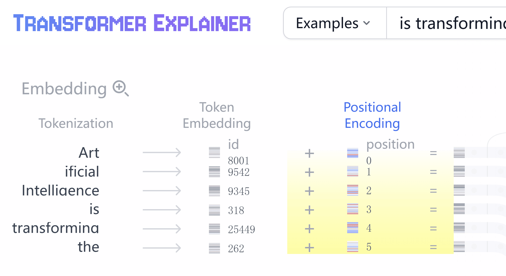
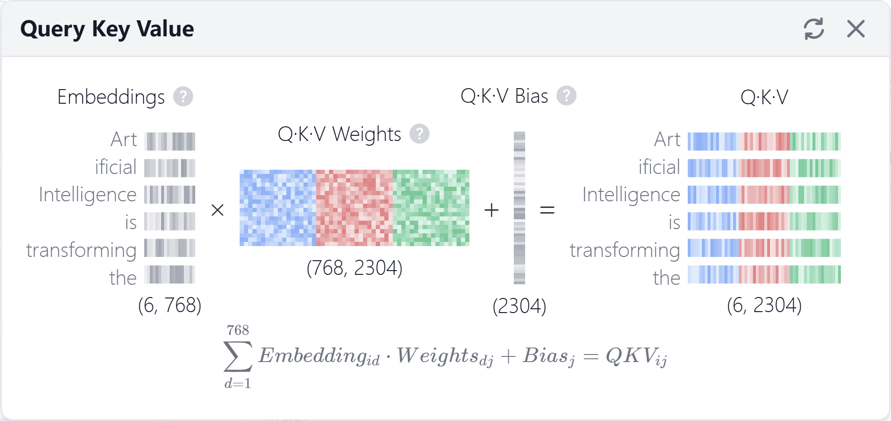
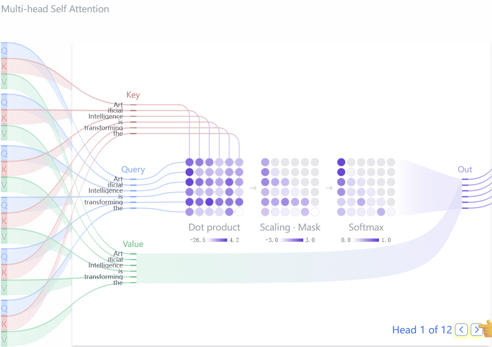
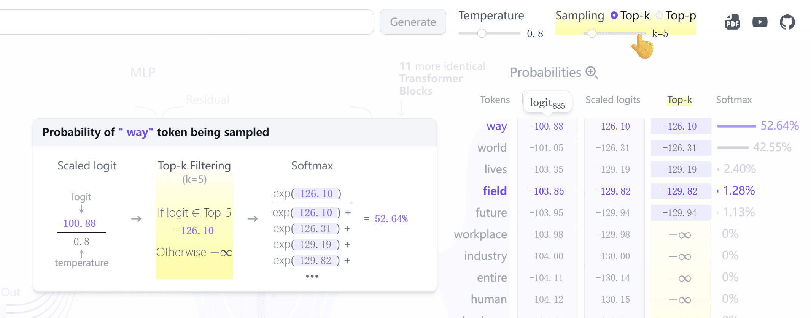
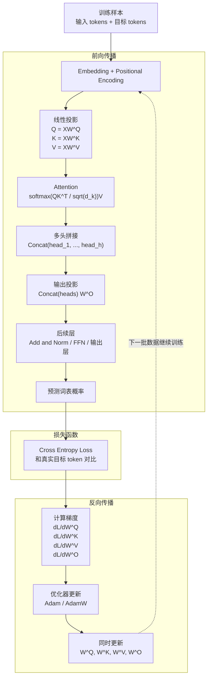

## 背景

接上文 [《大语言模型的基石：Transformer 入坑笔记（二） - 基本原理和 Word Embeddings》][9]，继续我们的 [Attention Is All You Need][1]/[Transformer][3] 学习之旅。

首先简单了解下传统的方案。

## 卷积神经网络（CNN）

卷积神经网络（CNN）似乎更适合静态数据（比如图片处理、提取特征等）。
所谓静态数据，是指每个数据组都单独和目标矩阵运算，通过卷积层、池化层、全连接层等输出。
每个数据组都单独运算所以可以大规模并发，但是数据组之间也缺乏关联。
我大概看了下原理，和我们要关注的 [Transformer][3] 关系不大，先略过了。

## 循环神经网络（RNN）

我们处理文本的时候，需要让神经网络知道上下文关系。
比如一句话: "我上午要去图书馆借书，下午去参加比赛。晚饭前我会把它还掉。"
那么在这里，系统需要知道“它”指的是“书”。

传统循环神经网络（RNN）的方法就是把后续数据叠加到前文输入里来传递上下文表达。
这里不详细铺开循环神经网络（RNN）的原理和过程，因为不是我们要关注的重点。大致了解一下流程和问题即可。

比如我们要把 I love llamas 翻译成中文。
典型的 RNN encoder-decoder 会先把源句子读成隐藏状态，Decoder 再按顺序生成目标 Token。每一步都会依赖上一步的隐藏状态和已经生成的 Token。

| Step | Input                  | Output |
| ---- | ---------------------- | ------ |
| 1    | I love llamas          | 我     |
| 2    | I love llamas **我**   | 爱     |
| 3    | I love llamas **我爱** | 羊驼   |

> 注意: 词向量、隐藏状态以及最终计算输出的w、b矩阵都是不同的。

显然这里有两个问题。一是同一个序列里的每一步都依赖上一步结果，并行度受限。二是内容太长时，早期信息会逐渐被隐藏状态压缩掉，长距离依赖容易丢。
当然有一些方法一定程度缓解这个问题，但是也不是我们要关注的 [Transformer][3] 的重点就也略过了。

## Transformer

那前面两种模型都有各自的问题。俗话说小孩子才做选择，大人我全都要。怎么办呢？于是 [Transformer][3] 来了。

> 这有个非常好的工具 [Transformer Explainer][6]，可以把 [Transformer][3] 里的各个步骤拆开看，很适合理解整体流程。
> 这个工具甚至还发了篇 Paper：[《Transformer Explainer: Learning LLM Transformers with Interactive Visual Explanation and Experimentation》][7]。

注意力机制并不是 [《Attention Is All You Need》][1] 的首创，之前已经有人把它用来缓解传统神经网络在长距离依赖上的问题。
这篇论文真正激进的地方，是把循环和卷积从主干里拿掉，只用注意力搭出完整序列模型。还是先贴 [Transformer][3] 的基本框架：

*图 1：Transformer 模型架构（来自 [《Attention Is All You Need》][1]）。左侧为 Encoder，右侧为 Decoder，Encoder block 和 Decoder block 各重复 N 次。*

### Positional Encoding

一上来，仍然是把输入数据做 Embedding。具体方式和原理前面解释过了，这里就不复述了。
然后差异点是，现在还要融合 Positional Encoding 矩阵，表示词所在的位置。

为什么需要 Positional Encoding 矩阵呢？因为 [Transformer][3] 的注意力层本身不会天然知道 Token 的先后顺序；如果不额外加入位置信息，模型很难区分“我爱你”和“你爱我”这种同词不同序的输入。Positional Encoding 矩阵的公式如下:

$$
\begin{aligned}
\mathbf{PE}_{(\text{pos}, 2i)} &=
\sin\left(\frac{\text{pos}}{10000^{2i/d_{\text{model}}}}\right) \\
\mathbf{PE}_{(\text{pos}, 2i+1)} &=
\cos\left(\frac{\text{pos}}{10000^{2i/d_{\text{model}}}}\right)
\end{aligned}
$$

如果序列长度为 $L$，模型维度为 $d_{model}$，位置编码矩阵 $PE$ 的维度就是 $L \times d_{model}$。然后:

- $pos$ ：词在序列中的位置（从 0 开始）。其中序列长度为 $L$，则 $0 \le pos < L$
- $d_{model}$ ：模型的总维度（如 512、768、1024 等，[Transformer][3] 论文里是 512）
- $i$ ：维度索引对（$2i$ 和 $2i+1$ 成对出现，$0 \le i < d_{model}/2$）。

位置公式不是定死的，只要满足几个条件即可。

- 唯一标识: 每个位置必须有独一无二的编码向量
- 相对距离可感知: 模型能判断“相隔 $k$ 个位置”的关系，而不仅是绝对位置
- 平滑过渡: 相邻位置的编码应该相近，反映位置的连续性
- 值域有界: 编码值不能过大或过小，避免破坏词嵌入的数值分布

[Transformer][3] 的方案使用的是正弦和余弦函数，值域范围是 $-1 \le PE \le 1$，距离感知推导如下：

利用三角函数加法公式：$\sin(a+b) = \sin a \cos b + \cos a \sin b$，令 $a = pos \cdot w_i, b = k \cdot w_i$（其中 $w_i = \frac{1}{10000^{2i/d_{\text{model}}}}$），则：

$$
\begin{aligned}
\mathbf{PE}_{(\text{pos}+k, 2i)} &= \sin(\text{pos}\cdot w_i + k\cdot w_i) \\
&= \underbrace{\sin(\text{pos}\cdot w_i)}_{\mathbf{PE}_{(\text{pos},2i)}} \underbrace{\cos(k\cdot w_i)}_{\text{仅与}k\text{有关}} + \underbrace{\cos(\text{pos}\cdot w_i)}_{\mathbf{PE}_{(\text{pos},2i+1)}} \underbrace{\sin(k\cdot w_i)}_{\text{仅与}k\text{有关}}
\end{aligned}
$$

同理: $\mathbf{PE}_{(\text{pos}+k, 2i+1)} = \mathbf{PE}_{(\text{pos},2i+1)}\cos(k\cdot w_i) - \mathbf{PE}_{(\text{pos},2i)}\sin(k\cdot w_i)$

所以是满足这些条件的。不过要注意的是，原始公式没有“超过某个位置就不能用”的硬上限；它可以外推，但最长波长的量级大约是 $10000 \times 2\pi$，序列长度远超训练范围后效果不能只靠公式保证。现代长上下文模型通常还会配合 RoPE、ALiBi、位置插值、分块或稀疏注意力等方案。
最后，显然对确定的总维度，这个位置编码矩阵是可以提前算好的。

### 注意力机制

[Transformer][3] 注意力机制核心部分叫做 self-attention (自注意力)。基本流程可以理解为：当前 Token 拿着 Query 去和所有 Key 做匹配，再按匹配权重汇总对应的 Value。
当然这些数据都是向量。可以这么理解：

- **查询（Q）**：当前 Token 想找什么信息。
- **键（K）**：每个 Token 对外提供的匹配索引。
- **值（V）**：真正被加权汇总的信息内容。

实际计算时，同一份输入矩阵 $X$ 会分别乘以三组可训练权重矩阵，得到 $Q$、$K$、$V$ 三组向量。图里把维度压成 4 格只是为了画得清楚；真实模型里，$X \in \mathbb{R}^{L \times d_{model}}$，$W^Q/W^K \in \mathbb{R}^{d_{model} \times d_k}$，$W^V \in \mathbb{R}^{d_{model} \times d_v}$。

*图 2：Q/K/V 线性投影。Self-Attention 使用同一份输入 $X$，通过三组不同的权重矩阵生成后续注意力计算需要的 Query、Key 和 Value。*

*图 3：Scaled Dot-Product Attention（左）与 Multi-Head Attention（右）。左侧展示 Q/K/V 的注意力计算流程，右侧展示 h 个并行注意力头拼接后再线性投影的结构。*

对于单个单头的注意力，计算公式如下：

$$\mathrm{Attention}(Q, K, V) = \mathrm{softmax}\left(\frac{QK^T}{\sqrt{d_k}}\right)V$$

这里的 $d_k$ 是 Key 向量的维度。除以 $\sqrt{d_k}$ 是为了把点积结果拉回更合适的数值范围，避免维度变大后 softmax 太容易进入饱和区。$W^Q$、$W^K$、$W^V$ 这些矩阵也是训练出来的。

$$
\begin{aligned}
X &\in \mathbb{R}^{L \times d_{model}} \\
W^Q &\in \mathbb{R}^{d_{model} \times d_k} \\
W^K &\in \mathbb{R}^{d_{model} \times d_k} \\
W^V &\in \mathbb{R}^{d_{model} \times d_v}
\end{aligned}
$$

$$
\begin{aligned}
Q &= XW^Q \in \mathbb{R}^{L \times d_k} \\
K &= XW^K \in \mathbb{R}^{L \times d_k} \\
V &= XW^V \in \mathbb{R}^{L \times d_v}
\end{aligned}
$$

相当于把每个 Token 都投影到 Query、Key、Value 三个表示空间中。

然后计算每个 Q 和每个 Key 的相似程度，也表达了每个 Token 对其他 Token 的注意程度，即 $QK^T$。这里的 $\frac{1}{\sqrt{d_k}}$ 是一个缩放，用于控制方差，让点积的方差和输入向量的维度无关。

这个缩放项可以直接推出来。先看某一个 Query 向量 $q$ 和 Key 向量 $k$ 的点积：

$$
s = q \cdot k = \sum_{i=1}^{d_k} q_i k_i
$$

为了只看维度带来的影响，先假设这些分量彼此独立，均值为 0，方差为 1。单项乘积的期望为：

$$
\mathbb{E}[q_i k_i] = \mathbb{E}[q_i]\mathbb{E}[k_i] = 0
$$

方差为：

$$
\begin{aligned}
\mathrm{Var}(q_i k_i)
&= \mathbb{E}[q_i^2 k_i^2] - \mathbb{E}[q_i k_i]^2 \\
&= \mathbb{E}[q_i^2]\mathbb{E}[k_i^2] \\
&= 1
\end{aligned}
$$

点积是 $d_k$ 个这样的项相加，所以：

$$
\mathrm{Var}(s) = \mathrm{Var}\left(\sum_{i=1}^{d_k} q_i k_i\right) = d_k
$$

也就是说，$d_k$ 越大，$QK^T$ 里的分数波动越大，标准差大约是 $\sqrt{d_k}$。把它除以 $\sqrt{d_k}$ 后：

$$
\mathrm{Var}\left(\frac{s}{\sqrt{d_k}}\right)
= \frac{\mathrm{Var}(s)}{d_k}
= 1
$$

如果 $q_i$、$k_i$ 的方差不是 1，而是 $\sigma_q^2$、$\sigma_k^2$，点积方差会变成 $d_k\sigma_q^2\sigma_k^2$，这个缩放项同样能消掉由 $d_k$ 带来的那部分放大。

Softmax 对这个尺度很敏感。它的梯度是：

$$
\frac{\partial \mathrm{softmax}(z)_i}{\partial z_j}
= \mathrm{softmax}(z)_i \left(\mathbf{1}_{i=j} - \mathrm{softmax}(z)_j\right)
$$

如果 $z$ 里的某个分数远大于其他分数，Softmax 会非常接近 one-hot：最大项接近 1，其他项接近 0。这时上面的梯度项也会接近 0，反向传播很难把注意力权重再调回来。在 float 精度有限时，指数函数的差距还可能直接把小概率压到接近 0。除以 $\sqrt{d_k}$ 不是为了改变排序，而是让 logits 的尺度别随着 $d_k$ 增大而失控，减轻 Softmax 饱和和梯度变小的问题。

最后再 Softmax 归一化。

这个图里还有一次 Mask 遮挡。它的作用是模拟阅读和写作过程：生成当前位置时，后面的词还没看到，所以不应该参与注意力计算。

> $\mathrm{softmax}\left(\frac{QK^T}{\sqrt{d_k}}\right)$ 的结果是一个 $L \times L$ 的注意力权重矩阵，再乘以 $V$ 后得到 $L \times d_v$ 的输出。现代化LLM有些支持1M上下文，不可能真的 1M \* 1M 这么夸张的计算量，而是通过线性注意力计算的，这个后面再看。这样可以把计算量从 $O(L^2)$ 压到接近 $O(Lw)$，其中 $w$ 是窗口大小。

到这里，**单头注意力** 的主要流程就结束了。

每个注意力头都有自己的一组 $W^Q, W^K, W^V$，会学到一类匹配偏好，但单头表达能力有限。为了让模型同时看不同关系，就引入了 **多头注意力**。

**多头注意力** 就是让多个注意力头并行计算，再把结果拼接起来。

$$
\begin{aligned}
\operatorname{MultiHead}(X)
&= \operatorname{Concat}(\operatorname{head}_1, \dots, \operatorname{head}_h)W^O \\
\text{where } \operatorname{head}_i
&= \operatorname{Attention}(XW_i^Q, XW_i^K, XW_i^V)
\end{aligned}
$$

这里又引入了一个新的投影矩阵：$W^O \in \mathbb{R}^{hd_v \times d_{model}}$，其中 $h$ 是并行的注意力头数（原论文 $h = 8$）。它负责把拼接后的表示重新投影到 $d_{model}$ 维度。

到这里，**多头注意力** 的计算过程就完成了。当然后面还会经过 [残差连接][8]（Residual Connection）和 LayerNorm；再通过 **前馈神经网络（FFN）** 执行非线性变换。MoE、激活函数、归一化位置这些优化又是另一个层面的内容，已经超出这篇入门笔记的范围，这里先不展开。

> [《Attention Is All You Need》][1] 论文里的 Position-wise FFN 由两个线性变换组成，中间接一个 ReLU 激活函数：$FFN(x) = \max\left(0, xW_1 + b_1\right)W_2 + b_2$。输入和输出维度为 $d_{model} = 512$，中间层维度为 $d_{ff} = 2048$。

### 整个模型的注意力整合

我们再回到整体的架构图。

在整体架构里，无论是左边 Encoder 的 self-attention (自注意力) 层，还是右边的 self-attention (自注意力) 层 和 encoder-decoder attention 层，都是多层堆叠出来的。
[《Attention Is All You Need》][1] 论文的堆叠层数 $N = 6$。

在左边的 **Encoder 的每层堆叠** 中，除了第 1 层外，Q、K、V 都来自上一层的输出。

第一层:

$$
H_E^{0} = \operatorname{Dropout}\left(\operatorname{Emb}_{src}(X) + PE_{src}\right)
$$

然后对后面每一层：

$$
\begin{aligned}
A_E^{l}
&= \operatorname{MHA}\left(H_E^{l-1}, H_E^{l-1}, H_E^{l-1}\right) \\
\tilde{H}_E^{l}
&= \operatorname{LayerNorm}\left(H_E^{l-1} + \operatorname{Dropout}\left(A_E^{l}\right)\right) \\
F_E^{l}
&= \operatorname{FFN}\left(\tilde{H}_E^{l}\right) \\
H_E^{l}
&= \operatorname{LayerNorm}\left(\tilde{H}_E^{l} + \operatorname{Dropout}\left(F_E^{l}\right)\right)
\end{aligned}
\qquad l = 1, \dots, N
$$

- Encoder 的每一层都有自己的 $W^Q,W^K,W^V,W^O$ 和 FFN 参数。
- Encoder self-attention 里，Q/K/V 都来自同一个输入：第一层来自 Embedding + PE，后续层来自上一层输出。
- Encoder 不需要 mask，因为输入序列一次性全部可见，每个 token 可以 attend 到所有输入位置。
- PE: Positional Encoding 不逐层重复添加。位置信息已经混进了 $H^0$，后面通过残差连接、Attention 和 FFN 一层层传下去。

然后:

$$
\begin{aligned}
Q_E^l &= H_E^{l-1} W_{E}^{Q,l} \\
K_E^l &= H_E^{l-1} W_{E}^{K,l} \\
V_E^l &= H_E^{l-1} W_{E}^{V,l}
\end{aligned}
\qquad l = 1,\dots,N
$$

右边 Decoder 包含两段注意力计算：**Decoder masked self-attention** 和 **Decoder encoder-decoder attention**。其中：

第一层:

$$
H_D^{0} = \operatorname{Dropout}\left(\operatorname{Emb}_{tgt}(Y_{&lt;t}) + PE_{tgt}\right)
$$

然后对后面每一层：

$$
\begin{aligned}
A_D^{l}
&= \operatorname{MaskedMHA}\left(H_D^{l-1}, H_D^{l-1}, H_D^{l-1}\right) \\
\tilde{H}_D^{l}
&= \operatorname{LayerNorm}\left(H_D^{l-1} + \operatorname{Dropout}\left(A_D^{l}\right)\right) \\
C_D^{l}
&= \operatorname{MHA}\left(\tilde{H}_D^{l}, H_E^{N}, H_E^{N}\right) \\
\hat{H}_D^{l}
&= \operatorname{LayerNorm}\left(\tilde{H}_D^{l} + \operatorname{Dropout}\left(C_D^{l}\right)\right) \\
F_D^{l}
&= \operatorname{FFN}\left(\hat{H}_D^{l}\right) \\
H_D^{l}
&= \operatorname{LayerNorm}\left(\hat{H}_D^{l} + \operatorname{Dropout}\left(F_D^{l}\right)\right)
\end{aligned}
\qquad l = 1, \dots, N
$$

这段公式要拆开看：

- MaskedMHA：Q/K/V 都来自 Decoder 当前层输入，并且使用 causal mask。
- Cross-attention MHA：Q 来自 masked self-attention 后的 $\tilde{H}_D^l$，K/V 来自 Encoder 最后一层输出 $H_E^N$。
- PE 表示 Positional Encoding，MHA 表示多头注意力计算。

然后右边的第一段 **Decoder masked self-attention**，Q、K、V 都来自 Decoder 自己。

$$
\begin{aligned}
Q_{D,\mathrm{self}}^l &= H_D^{l-1} W_{D,\mathrm{self}}^{Q,l} \\
K_{D,\mathrm{self}}^l &= H_D^{l-1} W_{D,\mathrm{self}}^{K,l} \\
V_{D,\mathrm{self}}^l &= H_D^{l-1} W_{D,\mathrm{self}}^{V,l}
\end{aligned}
\qquad l = 1,\dots,N
$$

而右边的第二段 **Decoder encoder-decoder attention**，也常叫 cross-attention。这里 K、V 来自左边 Encoder 多层堆叠后的最终结果 $H_E^N$，Q 来自 Decoder 当前层 masked self-attention 之后的 $\tilde{H}_D^l$。所以右侧的 Output Embedding 会先进入 Decoder self-attention，再作为 cross-attention 的 Query 来源。

$$
\begin{aligned}
Q_{D,\mathrm{cross}}^l &= \tilde{H}_D^l W_{D,\mathrm{cross}}^{Q,l} \\
K_{D,\mathrm{cross}}^l &= H_E^N W_{D,\mathrm{cross}}^{K,l} \\
V_{D,\mathrm{cross}}^l &= H_E^N W_{D,\mathrm{cross}}^{V,l}
\end{aligned}
\qquad l = 1,\dots,N
$$

在语言模型的 Decoder 端，多层 Transformer block 会先得到每个位置的 hidden state；最后通过 `lm_head` 映射到词表维度，为每个 Token 生成一个 logit，再经过 softmax 得到概率分布。GPT-2 这类模型的 FFN/MLP 中间层常用 GELU，但输出词表 logits 的那一层本质上还是线性投影。

这张图也能解释现在 LLM 里 temperature、top_p / top_k 这些采样参数的作用。
如果是贪心解码，就直接选概率最高的那个词；如果是采样解码，就会在筛选后的概率分布里抽样。

这里也能看出 LLM 的底层目标：在当前上下文里预测下一个 Token 的概率分布。
所以它输出的往往是训练数据、后训练和解码策略共同推出来的高概率结果。这也导致了，如果某些情况下 “真理往往掌握在少数人手中” 的时候，大语言模型就掌握不了真理。

### 怎么训练 $W^Q$、$W^K$、$W^V$、$W^O$ ？

对于一组注意力矩阵来说，$W^Q$、$W^K$、$W^V$、$W^O$ 是同时训练出来的，具体训练方法和上一章 [《大语言模型的基石：Transformer 入坑笔记（二） - 基本原理和 Word Embeddings》][9] 的基本原理一致。主线就是 **前向计算 -> loss -> 反向传播 -> 同时更新参数**。

训练样本就是大量的语料文本。更新矩阵参数时，仍然是：

$$
\begin{aligned}
W_i^Q &\leftarrow W_i^Q - \eta \frac{\partial \mathcal{L}}{\partial W_i^Q} \\
W_i^K &\leftarrow W_i^K - \eta \frac{\partial \mathcal{L}}{\partial W_i^K} \\
W_i^V &\leftarrow W_i^V - \eta \frac{\partial \mathcal{L}}{\partial W_i^V} \\
W^O &\leftarrow W^O - \eta \frac{\partial \mathcal{L}}{\partial W^O}
\end{aligned}
\qquad i = 1,\dots,h
$$

不同 attention head / layer 的区别主要来自:

- 结构位置不同：同样叫 attention，看到的输入不一样。比如第 1 层看到的是 $H^0 = Embedding(X) + PE$，第 6 层看到的是前 5 层加工后的结果 $H^5$。
- 参数初始化不同：只要初始随机矩阵不同，后续训练轨迹就可能分化。
- 训练过程中梯度不同：每个 head 对 loss 的贡献不同，更新方向也不同。

除了结构位置、初始化和梯度路径，attention head 的差异还会受到 mask、位置编码、head 维度、$W^O$ 的混合方式、残差连接、LayerNorm、Dropout 以及训练数据分布影响。数据类型确实会影响最终学到的模式，比如代码语料多了以后，某些 head 可能对括号、缩进、变量引用更敏感；这些都是同一套参数在反复训练中自然形成的偏好，不是人工设定的。

### $W^Q$ 的优化

后面看公开模型配置时，会遇到 `q_lora_rank` 这个字段。它不是 [Transformer][3] 原论文里的标准概念，而是 DeepSeek、Kimi 这类模型在 Attention 投影里使用的低秩结构参数。

普通 Attention 里，Query 通常是一次线性投影：

$$
Q = XW^Q
$$

如果输入维度是 $d_{model}$，所有 attention head 拼起来后的 Query 维度是 $h \cdot d_q$，那么：

$$
W^Q \in \mathbb{R}^{d_{model} \times (h \cdot d_q)}
$$

带 `q_lora_rank` 的实现不会直接用一个完整的大矩阵做 Query 投影，而是先压到一个较小的中间维度，再投影回所有 head 需要的 Query 维度：

$$
C^Q = XW^{DQ}
$$

$$
Q = C^QW^{UQ}
$$

其中：

$$
W^{DQ} \in \mathbb{R}^{d_{model} \times r_q}
$$

$$
W^{UQ} \in \mathbb{R}^{r_q \times (h \cdot d_q)}
$$

这里的 $r_q$ 就是 `q_lora_rank`。也就是说，它是 Query 投影里的低秩瓶颈维度。

不同模型的 Attention 配置字段不完全一样。以后面表格里的 Kimi-K2.7-Code 为例，`hidden_size = 7168`，`q_lora_rank = 1536`，64 个 attention head，每个 head 的 Query 维度按 `qk_nope_head_dim + qk_rope_head_dim = 128 + 64 = 192` 计算，所有 head 拼起来就是：

$$
64 \times 192 = 12288
$$

如果直接做完整 $W^Q$：

$$
7168 \times 12288 \approx 88.1M
$$

如果拆成 `q_lora_rank = 1536` 的两段低秩投影：

$$
7168 \times 1536 + 1536 \times 12288 \approx 29.9M
$$

所以 `q_lora_rank` 的主要作用是减少 Query 投影的参数量和计算规模。

这里的 LoRA 容易和微调里的 LoRA adapter 混淆。常见 LoRA 微调是冻结原始矩阵，再额外训练一个低秩增量：

$$
W^{\prime} = W + AB
$$

而这些模型配置里的 `q_lora_rank` 更像是模型结构本身就把 Query 投影设计成低秩分解：

$$
W^Q \approx W^{DQ}W^{UQ}
$$

这两个矩阵从预训练开始就是模型参数的一部分，不是后面外挂上去的微调插件。

### 混合专家模型(MoE)

原始 Transformer 里，FFN/MLP 层是 dense 的：一个 Token 经过这一层时，会走这层的全部 FFN 参数。MoE 的想法是把 FFN/MLP 换成多组 Expert，再让 Router 为每个 Token 只选其中一小部分。

这个思路很符合直觉。写代码时不太需要心理学专家，做数学题时也不太需要一个擅长社交闲聊的专家；如果每个 Token 都让所有专家参与计算，参数容量是上去了，推理成本也会一起上去。于是就有了 **混合专家模型(MoE)**。

**混合专家模型(MoE)** 通常是在 Transformer block 里，把 **前馈神经网络（FFN/MLP）** 从一套 dense MLP 换成多个 Expert。拿到输入 hidden state 后，Router 只会选中一个或几个 Expert 参与计算。

Router 层会根据输入 hidden state 给每个 Expert 打分，再按概率或 top-k 规则选取要激活的 Expert。

> 最简单的策略可以是只选分数最高的一个 Expert；选更多 Expert 会增加每个 Token 的计算容量，但也会增加推理成本和路由负载。

模型加载时通常仍要加载全部专家，所以内存/显存占用看的是总参数；但每次计算只激活子集，所以实际计算量会小得多。

MoE Router 也有自己的可训练参数，比如：

$$
\begin{aligned}
s &= hW^R + b^R \\
p &= \operatorname{softmax}(s)
\end{aligned}
$$

其中：

- $h$ 是进入 MoE 层前的 hidden state；
- $W^R$ 是 Router 的权重矩阵；
- $s$ 是每个 Expert 的打分；
- $p$ 是每个 Expert 被选中的概率；
- 然后取 top-k 个 Expert 参与计算。

专家数量是训练前先定好的，专家“负责什么”通常不是人工指定的，而是在训练过程中自己分化出来的。

**混合专家模型(MoE)** 还有个参数 `moe_intermediate_size`，可以理解为每个 MoE Expert 内部 FFN/MLP 的中间层维度。
如果模型用的是 SwiGLU 这类结构，单个 Expert 通常有三组矩阵：

- gate_proj: $d_{model}$ -> $d_{moe}$
- up_proj: $d_{model}$ -> $d_{moe}$
- down_proj: $d_{moe}$ -> $d_{model}$

所以单个 Expert 参数量粗略是：$3 \times d_{model} \times d_{moe}$，也就是 $3 \times hidden\_size \times moe\_intermediate\_size$。

一般来说，在其它条件不变、训练数据和训练预算也足够的前提下，moe_intermediate_size 变大，单个 Expert 的表达能力会更好。
但它不是越大越好，收益会递减，也很容易被训练预算、推理成本和路由质量这些瓶颈卡住。

最后有一个经验可以先记住：总参数量更像模型容量的上限，单次任务效果还要看激活参数、路由质量、训练数据、后训练和解码策略。

## 大语言模型的参数量参考

一个 decoder-only Transformer 的参数量大致来自这几块：

- **词表 Embedding**：$V \times d_{model}$。如果输出层 `lm_head` 不和 Embedding 共享权重，再加一份 $V \times d_{model}$。
- **Attention**：普通 MHA 可以粗略看成每层 $Q/K/V/O$ 四个投影，约 $4d_{model}^2$。现在很多模型用了 GQA、MLA、DSA、LoRA rank 等变体，实际要按配置和代码算，不能只套这个公式。
- **Dense FFN/MLP**：如果是 SwiGLU，常见是 `gate_proj`、`up_proj`、`down_proj` 三个矩阵，约 $3 \times d_{model} \times d_{ff}$。
- **MoE 专家层**：每个专家通常也是一套 SwiGLU MLP，单专家约 $3 \times d_{model} \times d_{moe}$。总参数要乘以全部专家数；激活参数只乘以每个 token 实际选中的专家数，再加 shared expert 和 attention 等固定会走的参数。
- **路由器、Norm、位置编码、MTP、视觉编码器等**：通常不是最大头，但开放模型的官方总参数和自己按专家层粗算之间的差额，往往就在这些结构里。

所以 MoE 模型的“总参数”和“激活参数”不是一个概念。总参数是模型权重的完整规模；激活参数是处理单个 token 时实际走过的权重规模。下面的拆分只算权重数量，不算 KV cache、优化器状态，也不把量化后的存储大小混进来。

| 系列   | 当前公开口径                                                                                                                                                                              | 参数结构是否公开 | 备注                                                                                                                                                                                                           |
| ------ | ----------------------------------------------------------------------------------------------------------------------------------------------------------------------------------------- | ---------------- | -------------------------------------------------------------------------------------------------------------------------------------------------------------------------------------------------------------- |
| GPT    | OpenAI 模型页当前推荐 GPT-5.5 用于复杂推理和编码 <a href="https://platform.openai.com/docs/models">10</a>                                                                      | 未公开           | GPT-4 技术报告明确说没有继续披露 architecture、model size、hardware、training compute 等细节 <a href="https://arxiv.org/abs/2303.08774">11</a>。我没有找到 GPT-5.5 的官方参数量、词表、维度、层数。 |
| Claude | Anthropic 文档当前提到 Claude Fable 5、Claude Mythos 5，并建议复杂任务从 Claude Opus 4.8 起步 <a href="https://docs.anthropic.com/en/docs/about-claude/models/overview">12</a> | 未公开           | 官方文档给的是模型能力、上下文、平台支持等产品信息，没有公开参数量、词表、维度、层数。                                                                                                                         |
| Gemini | Gemini API 模型页当前在 Gemini 3 家族里列出 Gemini 3.1 Pro、Gemini 3.5 Flash 等模型 <a href="https://ai.google.dev/gemini-api/docs/models">13</a>                              | 未公开           | 官方 API 文档公开的是上下文、输入输出能力、稳定/预览状态，没有公开结构参数。                                                                                                                                   |

虽然官方没有给确切的参数文档，但是我们能从网上搜索别人的评测估算或者拿公开 MoE 模型做参照：DeepSeek-V4-Pro 是 1.6T / 49B activated，Kimi-K2.7-Code 是 1T / 32B activated，GLM-5 报告口径是 744B / 40B active。Google 早年的 GLaM 论文也公开过 1.2T 参数的稀疏激活 MoE 模型<a href="https://arxiv.org/abs/2112.06905">21</a>。这些模型给了一个大致范围：前沿 MoE 的总参数可以上 T，单 token 激活参数通常是几十 B 到一两百 B 这个量级。

另外还有两条第三方/官方材料参考。第一，Klu 汇总 GPT-4 的公开研究和 SemiAnalysis 等资料，给过一个常被引用的拆法：GPT-4 约 1.8T 总参数，16 个专家，每个约 111B，top-2 激活，再加约 55B shared attention，单次推理约 280B 参数参与<a href="https://klu.ai/blog/gpt-4-llm">22</a>。第二，Gemini 3 Pro 官方模型信息确认它是 sparse MoE Transformer，并明确说这种结构会把总模型容量和每 token 计算/服务成本拆开<a href="https://storage.googleapis.com/deepmind-media/Model-Cards/Gemini-3-Pro-Model-Card.pdf">23</a>。所以下面闭源模型那张表只能看量级作为参考。

| 系列                       | 估算结构                                                                                                                                         | 总参数量级                 | 单 token 激活量级             | 参数组成预估                                                                                                                                                            |
| -------------------------- | ------------------------------------------------------------------------------------------------------------------------------------------------ | -------------------------- | ----------------------------- | ----------------------------------------------------------------------------------------------------------------------------------------------------------------------- |
| GPT-5.5                    | 以 GPT-4 的 1.8T / 约 280B active 传闻拆法为下界，再考虑两代后的推理/代码能力提升。更像稀疏 MoE + 路由/推理预算组合，而不是单个超大 dense 模型。 | 2T-5T                      | 100B-300B                     | 专家 MLP 约 85%-95%；attention、shared dense、router、Norm 等约 5%-15%；Embedding + lm_head 通常 1B-5B。多模态 encoder、工具/代码专用头可能另算。                       |
| Claude Fable 5 / Mythos 5  | 官方只说 Fable 是最强广泛发布模型、Mythos 是受限可用模型，二者 1M context、128k output、同价。按这个定位，5T 可以作为 MoE 总参数的高位估计。     | 2T-5T                      | 80B-250B                      | 如果总参数接近 5T，大概率是大量 routed experts 堆出来的 MoE 总量；真正每 token 激活的仍是 top-k 专家 + shared dense/attention。Embedding + lm_head 仍然大概率只是几 B。 |
| Claude Opus 4.8            | Opus 4.8 价格大约是 Fable/Mythos 的一半，官方定位也是 Opus-tier 而不是最高 Mythos/Fable tier。                                                   | 1T-3T                      | 50B-180B                      | 比 Fable/Mythos 小一档更合理；如果是 MoE，专家 MLP 是大头；如果是 dense，总参数和激活参数会接近，但 5T dense 对延迟和成本都太重。                                       |
| Gemini 3.1 Pro / 3.5 Flash | Gemini 3 Pro 官方确认 sparse MoE；1.5 Pro 报告也说 MoE 让总参数容量和单 token 成本解耦。Pro 和 Flash 很可能不是同一组激活规模。                  | Pro: 1T-3T；Flash: 0.2T-1T | Pro: 50B-150B；Flash: 10B-60B | 专家 MLP 约 80%-95%；attention 和长上下文相关模块占剩余主要部分；视觉、音频、视频 encoder 可能是几亿到几十亿参数，并且不一定计入语言模型本体。                          |

开源模型的参数计算就简单多了，可以直接拿 <https://huggingface.co> 上的模型信息和 `config.json` 来参考，其中 DeepSeek 和 Kimi 的总参数/激活参数来自模型信息；GLM-5.2 模型信息 <a href="https://huggingface.co/zai-org/GLM-5.2">18</a> 链接到 GLM-5 技术报告，报告中给出同系 GLM-5 架构为 744B 总参数、40B 激活参数，GLM-5.2 的模型信息没有单独重复一张参数表。

| 模型            | 官方总量/激活量                                                                                                  | 词表                                                                                                                         | 隐藏维度 | 层数                  | Attention                                                 | MoE 配置                                                                            | 上下文    |
| --------------- | ---------------------------------------------------------------------------------------------------------------- | ---------------------------------------------------------------------------------------------------------------------------- | -------- | --------------------- | --------------------------------------------------------- | ----------------------------------------------------------------------------------- | --------- |
| DeepSeek-V4-Pro | 1.6T / 49B activated <a href="https://huggingface.co/deepseek-ai/DeepSeek-V4-Pro">14</a>              | 129,280 <a href="https://huggingface.co/deepseek-ai/DeepSeek-V4-Pro/blob/main/config.json">15</a>                 | 7,168    | 61                    | 128 heads，1 KV head，`q_lora_rank=1536`                  | 384 routed experts，6 selected/token，1 shared expert，`moe_intermediate_size=3072` | 1,048,576 |
| Kimi-K2.7-Code  | 1T / 32B activated，视觉编码器 400M <a href="https://huggingface.co/moonshotai/Kimi-K2.7-Code">16</a> | 163,840（模型信息写 160K）<a href="https://huggingface.co/moonshotai/Kimi-K2.7-Code/blob/main/config.json">17</a> | 7,168    | 61，其中 1 层 dense   | 64 heads，64 KV heads，`q_lora_rank=1536`                 | 384 routed experts，8 selected/token，1 shared expert，`moe_intermediate_size=2048` | 262,144   |
| GLM-5.2         | GLM-5 技术报告口径为 744B / 40B active <a href="https://arxiv.org/abs/2602.15763">20</a>              | 154,880 <a href="https://huggingface.co/zai-org/GLM-5.2/blob/main/config.json">19</a>                             | 6,144    | 78，其中前 3 层 dense | 64 heads，64 KV heads，`q_lora_rank=2048`，DSA/IndexShare | 256 routed experts，8 selected/token，1 shared expert，`moe_intermediate_size=2048` | 1,048,576 |

按上面的公式拆一下，会更容易理解这些数字为什么这么大。

| 模型            | Embedding + lm_head                         | 单专家参数                                | MoE 总专家参数粗算                                | 每 token 激活的 MoE 专家参数粗算               | 说明                                                                                                |
| --------------- | ------------------------------------------- | ----------------------------------------- | ------------------------------------------------- | ---------------------------------------------- | --------------------------------------------------------------------------------------------------- |
| DeepSeek-V4-Pro | $2 \times 129280 \times 7168 \approx 1.85B$ | $3 \times 7168 \times 3072 \approx 66.1M$ | $61 \times (384 + 1) \times 66.1M \approx 1.55T$  | $61 \times (6 + 1) \times 66.1M \approx 28.2B$ | 模型信息给 1.6T / 49B。差额主要来自 attention、路由器、Norm、HCA/CSA/MTP 等固定结构。               |
| Kimi-K2.7-Code  | $2 \times 163840 \times 7168 \approx 2.35B$ | $3 \times 7168 \times 2048 \approx 44.0M$ | $60 \times (384 + 1) \times 44.0M \approx 1.02T$  | $60 \times (8 + 1) \times 44.0M \approx 23.8B$ | 模型信息写 1T / 32B，属于四舍五入后的公开口径；还有 1 层 dense MLP、attention 和 400M 视觉编码器。  |
| GLM-5.2         | $2 \times 154880 \times 6144 \approx 1.90B$ | $3 \times 6144 \times 2048 \approx 37.7M$ | $75 \times (256 + 1) \times 37.7M \approx 727.6B$ | $75 \times (8 + 1) \times 37.7M \approx 25.5B$ | GLM-5 报告给 744B / 40B；除专家层外，还有前 3 层 dense MLP、attention、DSA/IndexShare、MTP 等结构。 |

可以看到，现代 MoE 大模型的参数大头几乎都在专家 MLP 里，Embedding 反而只是十亿级。

## 最后

当前基本原理的入门就到这里了。如果真的要做相关业务，还得继续往训练、推理、并行、显存、数据和评测这些细节里钻，这就留到以后再说了。

我本人并非 AI 领域从业者，可能有理解不到位的地方，欢迎指正。

[1]: https://arxiv.org/pdf/1706.03762
[2]: https://www.bilibili.com/video/BV1fj6vBfEnu/
[3]: https://github.com/huggingface/transformers
[4]: https://towardsdatascience.com/nlp-illustrated-part-3-word2vec-5b2e12b6a63b/
[5]: https://aiwiki.ai/wiki/word_embedding
[6]: https://poloclub.github.io/transformer-explainer/
[7]: https://dl.acm.org/doi/pdf/10.1145/3772318.3791725
[8]: https://arxiv.org/abs/1512.03385
[9]: https://owent.net/2026/2609.html
